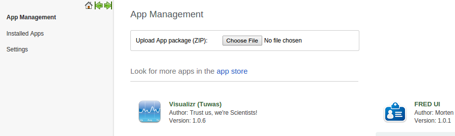

# Apps

<!--DHIS2-SECTION-ID:apps-->

A packaged app is an [Open Web
App](https://developer.mozilla.org/en-US/docs/Open_Web_apps_and_Web_standards)
that has all of its resources (HTML, CSS, JavaScript, app manifest, and
so on) contained in a zip file. It can be uploaded to a DHIS2
installation directly through the user interface at runtime. A packaged
app is a ZIP file with an [app
manifest](http://www.w3.org/2008/webapps/manifest/) in its root
directory. The manifest must be named `manifest.webapp`. A throrough
description of apps can be obtained
[here](https://developer.mozilla.org/en-US/Apps/Quickstart).

## Purpose of packaged Apps

<!--DHIS2-SECTION-ID:apps_purpose_packaged_apps-->

The purpose of packaged apps is to extend the web interface of DHIS2,
without the need to modify the source code of DHIS2 itself. A system
deployment will often have custom and unique requirements. The apps
provide a convenient extension point to the user interface. Through
apps, you can complement and customize the DHIS2 core functionality with
custom solutions in a loosely coupled and clean manner.

Apps do not have permissions to interact directly with DHIS2 Java API.
Instead, apps are expected to use functionality and interact with the
DHIS2 services and data by utilizing the DHIS2 Web API.

## Creating Apps

<!--DHIS2-SECTION-ID:apps_creating_apps-->

DHIS2 apps are constructed with HTML, JavaScript and CSS files, similar
to any other web application. Apps also need a special file called
*manifest.webapp* which describes the contents of the app. A basic
example of the *manifest.webapp* is shown below:

    {
        "version": "0.1",
        "name": "My App",
        "description": "My App is a Packaged App",
        "launch_path": "/index.html",
        "appType": "APP",
        "icons": {
            "16": "/img/icons/mortar-16.png",
            "48": "/img/icons/mortar-48.png",
            "128": "/img/icons/mortar-128.png"
        },
        "developer": {
            "name": "Me",
            "url": "http://me.com"
        },
        "default_locale": "en",
        "activities": {
            "dhis": {
                "href": "*",
                "namespace": "my-namespace"
            }
        },
        "authorities": [
             "MY_APP_ADD_NEW",
             "MY_APP_UPDATE",
             "MY_APP_DELETE"
        }
    }

The *manifest.webapp* file must be located at the root of the project.
Among the properties are:

  - The *icons→48* property is used for the icon that is displayed on
    the list of apps that are installed on a DHIS2 instance.

  - The *activities* property is an dhis-specific extension meant to
    differentiate between a standard Open Web App and an app that can be
    installed in DHIS2.

  - The *authorities* property contains a list of DHIS2 authorities
    which can be used to restrict users from certain actions on the
    current app. This list will be loaded into DHIS2 during app
    installation process and available for selecting in User Role
    management form.

  - The *\** value for *href* is converted to the appropriate URL when
    the app is uploaded and installed in DHIS2. This value can then be
    used by the application's JavaScript and HTML files to make calls to
    the DHIS2 Web API and identify the correct location of DHIS2 server
    on which the app has been installed. To clarify, the *activities*
    part will look similar to this after the app has been installed:

<!-- end list -->

    "activities": {
        "dhis": {
            "href": "http://apps.dhis2.org/demo",
            "namespace": "my-namespace"
        }
     }

The namespace property can be added if your app is utilizing the
dataStore or userDataStore api. When adding the namespace property, only
users with access to your app are allowed to make changes to the
namespace. A namespace can only be reserved in this way once. If another
app tries to reserve a namespace already in use, the installation of the
other app will fail.

If you have a collection of apps that want to share the same namespace,
but also wish to reserve it, the users of the apps needs to have the
authority to use the app that initially reserved the namespace.

> **Note**
> 
> Namespaces will not be created until atleast one key-value pair is
> present in the namespace. Specifying a namespace in the manifest only
> restricts the access and does not create any data in the namespace.

The *appType* property specifies how the app will be displayed by the
DHIS2 instance. The possible values for appType and their effects are
explained in the following table.

<table>
<caption>App types</caption>
<colgroup>
<col style="width: 27%" />
<col style="width: 72%" />
</colgroup>
<thead>
<tr class="header">
<th>App type</th>
<th>Description</th>
</tr>
</thead>
<tbody>
<tr class="odd">
<td>APP</td>
<td>Will be listed in the &quot;apps&quot; menu</td>
</tr>
<tr class="even">
<td>DASHBOARD_WIDGET</td>
<td>Available from the search box on the dashboard, can be added as an item on any dashboard</td>
</tr>
<tr class="odd">
<td>TRACKER_DASHBOARD_WIDGET</td>
<td>Can be embedded in the tracker dashboard <em>(this type is not yet supported)</em></td>
</tr>
<tr class="even">
<td>RESOURCE</td>
<td>Resource apps are packages that can be shared by multiple other apps. These apps are not shown anywhere in the UI, except from in the app management app.</td>
</tr>
</tbody>
</table>

If no *appType* is specified in the manifest, the system will use "APP"
by default.

To read the JSON structure into JavaScript, you can use a regular AJAX
request and parse the JSON into an object. Most Javascript libraries
provide some support, for instance with jQuery it can be done like this:

    $.getJSON( "manifest.webapp", function( json ) {
        var apiBaseUrl = json.activities.dhis.href + "/api";
    } );

The app can contain HTML, JavaScript, CSS, images and other files which
may be required to support it . The file structure could look something
like this:

    /
    /manifest.webapp    #manifest file (mandatory)
    /css/               #css stylesheets (optional)
    /img/               #images (optional)
    /js/                #javascripts (optional)

> **Note**
> 
> It is only the `manifest.webapp` file which must be placed in the
> root. It is up the developer to organize CSS, images and JavaScript
> files inside the app as needed.

All the files in the project should be compressed into a standard zip
archive. Note that the manifest.webapp file must be located on the root
of the zip archive (do not include a parent directory in the archive).
The zip archive can then be installed into DHIS2 as you will see in the
next section.

## Installing Apps into DHIS2

<!--DHIS2-SECTION-ID:apps_installing_apps-->

Apps can be installed by uploading zip file into the App Manager. In,
Services → Apps, click on the *App Store* menu item.
 The app can be uploaded by
pressing the Browse button and after selecting the zip package, the file
is uploaded automatically and installed in DHIS2. You can also browse
through apps in the DHIS2 [app store](https://www.dhis2.org/appstore)
and download apps from there. The DHIS2 app store allows for app
searching, reviewing, commenting, requesting features, rating on the
apps by the community.

## Launching Apps

<!--DHIS2-SECTION-ID:apps_launching_apps-->

After installation, your apps will be integrated with the menu system
and can be accessed under services and from the module overview page. It
can also be accessed from the home page of the apps module. Click on an
app in the list in order to launch it.

