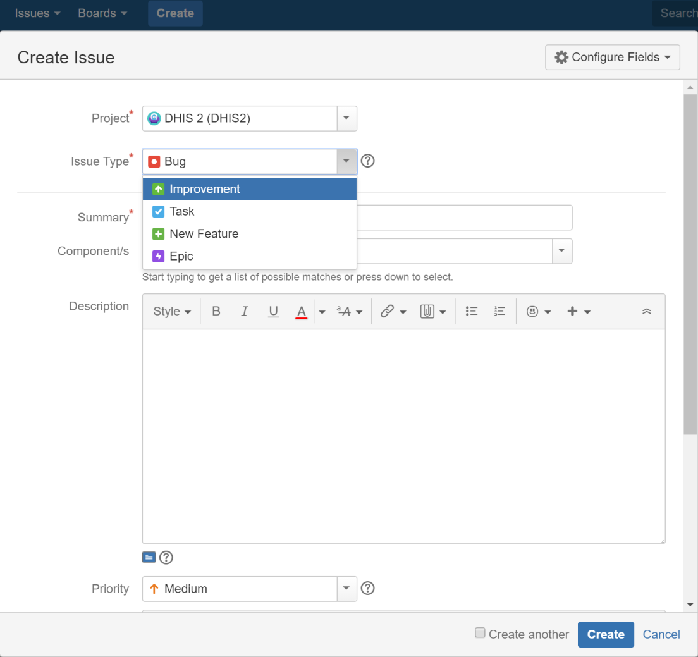
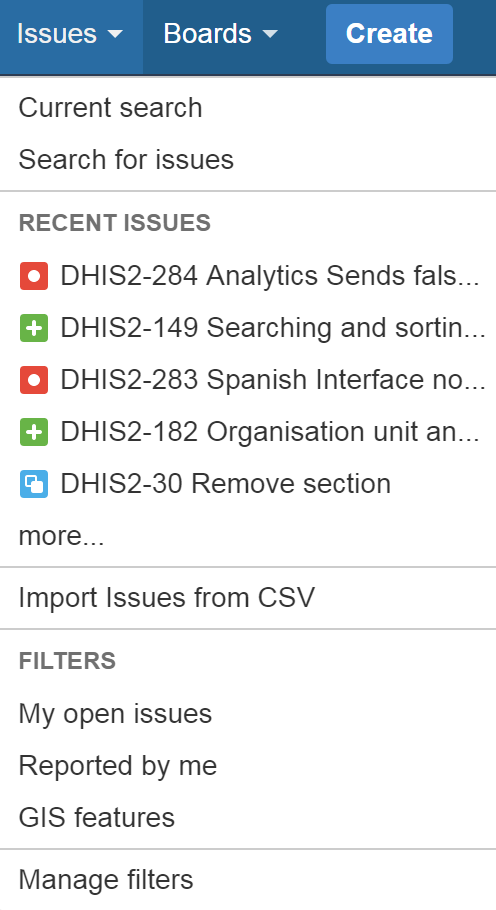
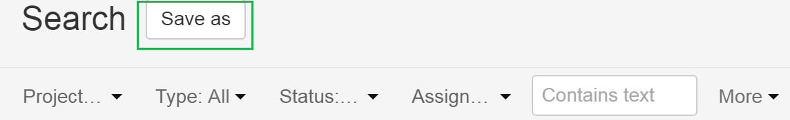
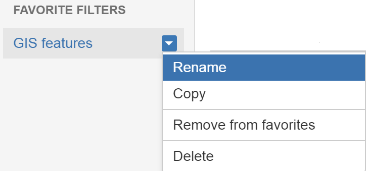
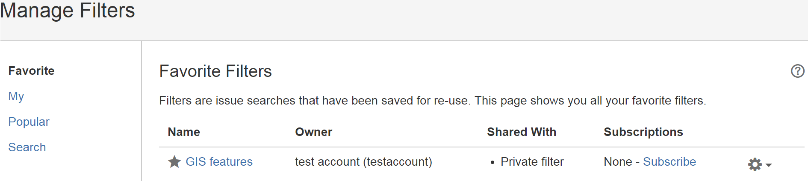
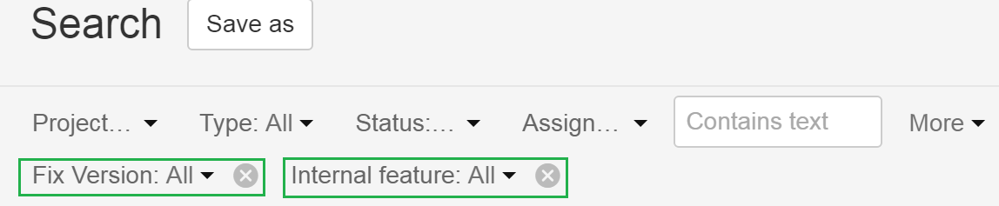

# Using JIRA for DHIS2 issues

<!--DHIS2-SECTION-ID:jira-gettingstarted-->

## Sign up to JIRA - it's open to everyone\!

1.  Go to: <https://jira.dhis2.org>.

2.  Create an account with your name and email address.

## Report an issue

> **Tip**
> 
> Uncertain whether something is a missing feature, a bug or deprecated?
> We'd really appreciate that you ask on the developer list before
> reporting a bug directly. Thanks\!

1.  Click **Create** in the top menu.

2.  Select a **Project** from the list.

3.  Select an **Issue Type**:
    
      - **Improvement** - if you’d like to tell us about something that
        could be better such as usability or design suggestions.
    
      - **New feature** - if you want to suggest a feature.
    
      - **Task** - if you’ve been asked to work on a DHIS2 task.
    
      - **Bug** - if you’ve found something that needs fixing.
    
      - **Epic** - if you’d like to submit an idea for a new DHIS2 area
        such as an app. Epic is used for issues more complex than new
        features.

4.  Click **Create**.
    
    > **Tip**
    > 
    > To create several issues in one go, select **Create another**.

5.  Fill out the issue form. Please give us plenty of context\! Include
    server logs, JavaScript console logs, the DHIS2 version and the web
    browser you’re using.

## Search for issues

Click **Issues \> Search for issues**.

If you click **Advanced**, you can order your search criteria using the
predefined fields. You can also enter search terms in the search field.
See also: [Search syntax for text
fields](https://confluence.atlassian.com/jirasoftwareserver072/search-syntax-for-text-fields-829057414.html).

## About filters

You can save your search results as filters to get back to them faster.
A filter is very similar to a favorite. We’ve created filters for
features intended for release numbers 2.26, 2.27 and 2.28 and for all
open bugs.

## Create a filter

1.  To create a filter, go to **Issues \> Search for issues**.

2.  Add filters to your search such as:
    
      - **Project** – the main software project is DHIS 2.
    
      - **Type** – you can filter by **Standard Issue Types** such as
        New Features, Improvements, Bugs or Epic or **Sub-Task Issue
        Types**.
    
      - **Status** – filter by **To Do** (not started) and **Done**, for
        example.
    
      - **Version** - click **More \> All Criteria \> Fix version** to
        filter by DHIS2 release number.
    
      - **Internal**- click **More \> Internal feature** to exclude
        low-level (back end) features from your search.

3.  Click **Save As**. This button is at the top of the Search pane.
    
    

4.  Enter a name for your search filter and click **Submit**. Your
    filter is now available in **Favorite Filters**. Use the arrow to
    modify your filter. Your filter is also available on the **System
    Dashboard**.
    
    

## Add a filter to your profile

To add a filter to your profile, click **Issues \> Manage filters** and
click the star icon next to each filter.

## Remove search filter terms from your search

Click the cross to remove search filter terms you previously added from
your search.

## Communicate with us

To share information, clarify requirements, or discuss details about an
issue, do this using issue comments.

1.  Select the issue you want to comment.

2.  In the Issue Detail view click **Comment** and enter your text.
    
    To email others about your comment, simply enter **@User's Name** in
    the comment field. An email will be sent to the users' email
    addresses that are registered with their JIRA accounts.

3.  Click **Add**.
