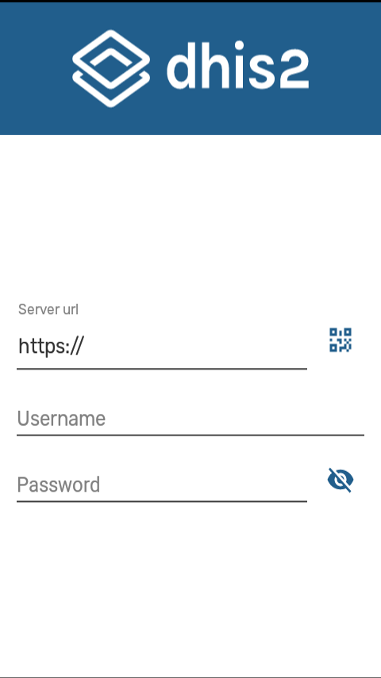
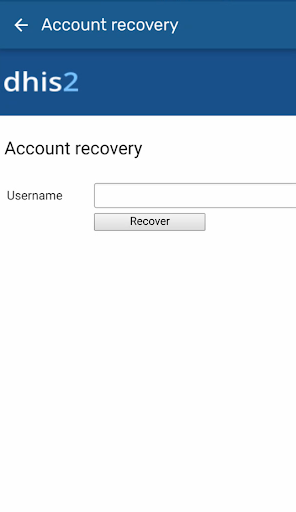
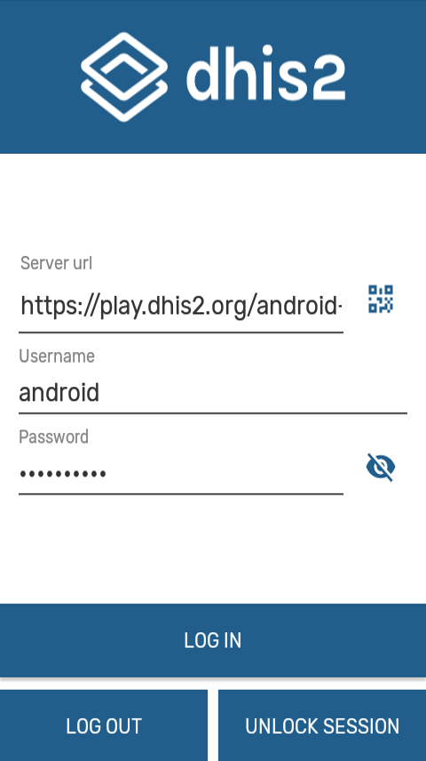
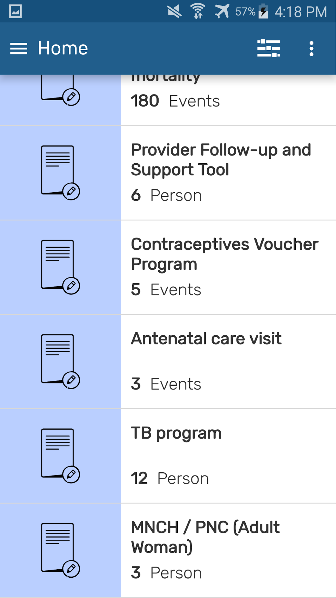

# Android specific features

## Login

There are two ways to access the application:

1. Manual: The user must type the corresponding URL of the server to be used and enter the username and password.

    > **Note**
    >
    > Take note that the login only possible with 2.29, 2.30 and 2.31 servers.

2. QR: The user can use a QR code instead of typing the URL. Username and password must be entered manually.

    > **Note**
    >
    > After the first login, the app will suggest URL and username of all successful connections.
    >
    > You are able to make an *offline* login only if using the same user as the last online session.
 
 {.center width=35%}
 
## Account Recovery

The users will be able to restore their own password if they have the setting enabled: Enabled User Account Recovery.

{.center width=35%}

## Blocking session (PIN)

User is able to lock the session using a 4 digit PIN. This allows to move to other apps in your phone without deleting the local data.
If the user forgets the PIN number, log in by entering the credentials is also available.

{width=35%}
{width=35%}

## Instructions/ information buttons

A contextual guide opens the first time the user opens the App.

{width=35%}
{width=35%}

> **Tip**
>
>  User is able to re-open<!-- PALD: unnecessary: (trigger)--> the instructions by clicking on the three dots at the top right corner of the screen.

## Filter

<!-- PALD alternative: "The Filter allows you to narrow down the data available from the ..." -->
Allows the user to filter data from the available programs based on periods (specific day, week, month, or year) or organisation units.

{ width=25%}
{ width=25%}
{ width=25%}

## Org unit

{.center width=35%}

The whole organisation unit tree is displayed. Organisation units not available for data entry will be colored in grey.
User must check the box to select the org unit wanted.

> **Caution**
>
>  Mobile users are not expected to access the org. unit hierarchy of a whole country. Maximum number of org units is difficult to set, as the App does not set the limit, but the resources on the device (memory, processor). We could say below 250 org units should be safe, but still believe that is a very big number for a mobile use case.

## Differentiating tracker and event programs

{.center width=35%}

> **Tip**
>
>  An easy way to differentiate program is by looking at the word at the bottom left corner. The word 'Event' will always be in event programs. In tracker will appear the name of the tracked entity type (person, patient, building, etc.).

## Sharing Data

{ width=35%}
{ width=35%}

## Program with registration specific features

### Complete event

User must enter the event and then click the 'Done' button in the bottom right corner.

{ width=35%}
{ width=35%}

Three options will be presented:

1. Complete
2. Complete and add new
3. Complete later

{.center width=35%}

> **Note**
>
> To verify if an event is completed look at the color of the box, it must be grey; and also have the label 'Event Completed' on it. It applies the same legend set than the web UI.

### Reset search fields

{.center width=35%}

All tracker programs will take the user to the search screen. The search fields are used to look up for a specific entity, and the circled arrow at the top right corner to reset the search. All fields will be in blank for the user to make a new search.

### Search screen for all Tracked Entity Type

User is able to search across all program of one tracked entity type (TET). In the Search screen there is a drop down which shows all the programs available for the active TET (active TET is defined by the selection of the program in the home screen). That drop down should also have an option with TET name. (for example: person)

When the user selects that option, the search fields available will only be the TET attributes (no program specific attributes).
Search restrictions do not apply, because they belong to the programs.

{ width=35%}
{ width=35%}

The search will return the found TEI's in the local database and also those in the Search OU of the user (when user is online). For those found online, the user will have to select them and the whole record will be downloaded.

> **Note**
>
>  When configuring search org. units, make sure that your capture org. units are contained in your search org. units, to do that capture org. units have to be selected as well as search org. units.

### TEI Dashboard across programs

User can see the TEI dashboard without any program by selecting the TEI in the list if the search was without program.

The dashboards will show the list of active enrollments.

{ width=35%}
{ width=35%}

### TEI enrollment history and new enrollment

User is able to see the complete historical record of the TEI. By clicking on the top right corner icon they will see a list of Active enrollments, followed by a list of past enrollments (completed or cancelled), followed by the programs in which the TEI could be enrolled.
User can also return to the 'TEI Dashboard without any program' by selecting 'All enrollments'.

Users should be able to navigate to the different enrollments from the list.

{ width=35%}
{ width=35%}

## Program without registration specific features

### Complete event and Field completion percentage

The percentage of data completed in each event is shown in the top right corner of an event when it is opened after first registration.

{ width=25%}
{ width=25%}
{ width=25%}

To complete an event click on the complete button. Three options will be offered

1. Complete
1. Complete and add new
1. Complete later

{ width=35%}
{ width=35%}

You can also complete by clicking by clicking on the three dots at the top right corner of the screen, then Details, then click on the percentage and select 'complete and close' button.

{.center width=35%}

> **Note**
>
>   The percentages will be adapted according to the effects of the program rules in the forms.
