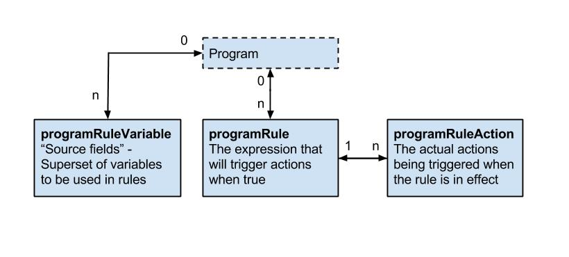

# Metadata

## Identifier schemes

<!--DHIS2-SECTION-ID:webapi_identifier_schemes-->

This section provides an explanation of the identifier scheme concept.
Identifier schemes are used to map metadata objects to other metadata
during import, and to render metadata as part of exports. Please note
that not all schemes work for all API calls, and not all
schemes can be used for both input and output. This is outlined in the
sections explaining the various Web APIs.

The full set of identifier scheme object types available are listed
below, using the name of the property to use in queries:

  - idScheme

  - dataElementIdScheme

  - categoryOptionComboIdScheme

  - orgUnitIdScheme

  - programIdScheme

  - programStageIdScheme

  - trackedEntityIdScheme

  - trackedEntityAttributeIdScheme

The general idScheme applies to all types of objects. It can be
overridden by specific object types.

The default scheme for all parameters is UID (stable DHIS2
identifiers). The supported identifier schemes are described in the
table below.

<table>
<caption>Scheme Values</caption>
<colgroup>
<col style="width: 14%" />
<col style="width: 85%" />
</colgroup>
<thead>
<tr class="header">
<th>Scheme</th>
<th>Description</th>
</tr>
</thead>
<tbody>
<tr class="odd">
<td>ID, UID</td>
<td>Match on DHIS2 stable Identifier, this is the default id scheme.</td>
</tr>
<tr class="even">
<td>CODE</td>
<td>Match on DHIS2 Code, mainly used to exchange data with an external system.</td>
</tr>
<tr class="odd">
<td>NAME</td>
<td>Match on DHIS2 Name, please note that this uses what is available as <em>object.name</em>, and not the translated name. Also note that names are not always unique, and in that case, they can not be used.</td>
</tr>
<tr class="even">
<td>ATTRIBUTE:ID</td>
<td>Match on metadata attribute, this attribute needs to be assigned to the type you are matching on, and also that the unique property is set to <em>true</em>. The main usage of this is also to exchange data with external systems, it has some advantages over <em>CODE</em> since multiple attributes can be added, so it can be used to synchronize with more than one system.</td>
</tr>
</tbody>
</table>

Note that identifier schemes is not an independent feature but needs to
be used in combination with resources such as data value import and metadata import.

As an example, to specify CODE as the general id scheme and override
with UID for organisation unit id scheme you can use these query
parameters:

    ?idScheme=CODE&orgUnitIdScheme=UID

As another example, to specify an attribute for the organisation unit id
scheme, code for the data element id scheme and use the default UID id
scheme for all other objects you can use these parameters:

    ?orgUnitIdScheme=ATTRIBUTE:j38fk2dKFsG&dataElementIdScheme=CODE


## Browsing the Web API

<!--DHIS2-SECTION-ID:webapi_browsing_the_web_api-->

The entry point for browsing the Web API is `/api`. This resource
provides links to all available resources. Four resource representation
formats are consistently available for all resources: HTML, XML, JSON,
and JSONP. Some resources will have other formats available, like MS
Excel, PDF, CSV, and PNG. To explore the API from a web browser, navigate
to the `/api` entry point and follow the links to your desired
resource, for instance `/api/dataElements`. For all resources which
return a list of elements certain query parameters can be used to modify
the response:

<table style="width:100%;">
<caption>Query parameters</caption>
<colgroup>
<col style="width: 11%" />
<col style="width: 20%" />
<col style="width: 12%" />
<col style="width: 54%" />
</colgroup>
<thead>
<tr class="header">
<th>Param</th>
<th>Option values</th>
<th>Default option</th>
<th>Description</th>
</tr>
</thead>
<tbody>
<tr class="odd">
<td>paging</td>
<td>true | false</td>
<td>true</td>
<td>Indicates whether to return lists of elements in pages.</td>
</tr>
<tr class="even">
<td>page</td>
<td>number</td>
<td>1</td>
<td>Defines which page number to return.</td>
</tr>
<tr class="odd">
<td>pageSize</td>
<td>number</td>
<td>50</td>
<td>Defines the number of elements to return for each page.</td>
</tr>
<tr class="even">
<td>order</td>
<td>property:asc/iasc/desc/idesc</td>
<td></td>
<td>Order the output using a specified order, only properties that are both persisted and simple (no collections, idObjects etc) are supported. iasc and idesc are case insensitive sorting.</td>
</tr>
</tbody>
</table>

An example of how these parameters can be used to get a full list of
data element groups in XML response format is:

    /api/dataElementGroups.xml?links=false&paging=false

You can query for elements on the name property instead of returning
a full list of elements using the *query* query variable. In this example
we query for all data elements with the word "anaemia" in the name:

    /api/dataElements?query=anaemia

You can get specific pages and page sizes of objects like this:

    /api/dataElements.json?page=2&pageSize=20

You can completely disable paging like this:

    /api/indicatorGroups.json?paging=false

To order the result based on a specific property:

    /api/indicators.json?order=shortName:desc

You can find an object based on its ID across all object types through
the *identifiableObjects* resource:

    /api/identifiableObjects/<id>

### Translation

<!--DHIS2-SECTION-ID:webapi_translation-->

DHIS2 supports translations of database content, such as data elements,
indicators, and programs. All metadata objects in the Web API have
properties meant to be used for display / UI purposes, which include
*displayName*, *displayShortName*, *displayDescription* and
*displayFormName* (for data elements and tracked entity attributes).

<table>
<caption>Translate options</caption>
<colgroup>
<col style="width: 20%" />
<col style="width: 16%" />
<col style="width: 62%" />
</colgroup>
<thead>
<tr class="header">
<th>Parameter</th>
<th>Values</th>
<th>Description</th>
</tr>
</thead>
<tbody>
<tr class="odd">
<td>translate</td>
<td>true | false</td>
<td>Translate display* properties in metadata output (displayName, displayShortName, displayDescription, and displayFormName for data elements and tracked entity attributes). Default value is true.</td>
</tr>
<tr class="even">
<td>locale</td>
<td>Locale to use</td>
<td>Translate metadata output using a specified locale (requires translate=true).</td>
</tr>
</tbody>
</table>

### Translation API

<!--DHIS2-SECTION-ID:webapi_translation_api-->

The translations for an object is rendered as part of the object itself
in the *translations* array. Note that the *translations* array in the
JSON/XML payloads is normally pre-filtered for you, which means they
can not directly be used to import/export translations (as that would
normally overwrite locales other than current users).

Example of data element with translation array filtered on user locale:

```json
{
  "id": "FTRrcoaog83",
  "displayName": "Accute French",
  "translations": [
    {
      "property": "SHORT_NAME",
      "locale": "fr",
      "value": "Accute French"
    },
    {
      "property": "NAME",
      "locale": "fr",
      "value": "Accute French"
    }
  ]
}
```

Example of data element with translations turned off:

```json
{
  "id": "FTRrcoaog83",
  "displayName": "Accute Flaccid Paralysis (Deaths < 5 yrs)",
  "translations": [
    {
      "property": "FORM_NAME",
      "locale": "en_FK",
      "value": "aa"
    },
    {
      "property": "SHORT_NAME",
      "locale": "en_GB",
      "value": "Accute Flaccid Paral"
    },
    {
      "property": "SHORT_NAME",
      "locale": "fr",
      "value": "Accute French"
    },
    {
      "property": "NAME",
      "locale": "fr",
      "value": "Accute French"
    },
    {
      "property": "NAME",
      "locale": "en_FK",
      "value": "aa"
    },
    {
      "property": "DESCRIPTION",
      "locale": "en_FK",
      "value": "aa"
    }
  ]
}
```

Note that even if you get the unfiltered result, and are using the
appropriate type endpoint i..e `/api/dataElements` we do not allow
updates, as it would be too easy to make mistakes and overwrite the
other available locales.

To read and update translations you can use the special translations
endpoint for each object resource. These can be accessed by *GET* or
*PUT* on the appropriate `/api/<object-type>/<object-id>/translations` endpoint.

As an example, for a data element with identifier `FTRrcoaog83`, you could use
`/api/dataElements/FTRrcoaog83/translations` to get and update
translations. The fields available are `property` with options *NAME*,
*SHORT_NAME*, *FORM_NAME*, *DESCRIPTION*, `locale` which supports any valid
locale ID and the translated property `value`.

Example of NAME property for French locale:

```json
{
  "property": "NAME",
  "locale": "fr",
  "value": "Paralysie Flasque Aiguë (Décès <5 ans)"
}
```

This payload would then be added to a translation array, and sent back
to the appropriate endpoint:

```json
{
  "translations": [
    {
      "property": "NAME",
      "locale": "fr",
      "value": "Paralysie Flasque Aiguë (Décès <5 ans)"
    }
  ]
}
```

For a data element with ID *FTRrcoaog83* you can *PUT* this to
`/api/dataElements/FTRrcoaog83/translations`. Make sure to send all
translations for the specific object and not just for a single locale
(if not you will potentially overwrite existing locales for other
locales).

### Web API versions

<!--DHIS2-SECTION-ID:webapi_api_versions-->

The Web API is versioned starting from DHIS 2.25. The API versioning
follows the DHIS2 major version numbering. As an example, the API
version for DHIS 2.33 is `33`.

You can access a specific API version by including the version number
after the `/api` component, as an example like this:

    /api/33/dataElements

If you omit the version part of the URL, the system will use the current
API version. As an example, for DHIS 2.25, when omitting the API part,
the system will use API version 25. When developing API clients it is
recommended to use explicit API versions (rather than omitting the API
version), as this will protect the client from unforeseen API changes.

The last three API versions will be supported. As an example, DHIS
version 2.27 will support API version 27, 26 and 25.

Note that the metadata model is not versioned and that you might
experience changes e.g. in associations between objects. These changes
will be documented in the DHIS2 major version release notes.

## Metadata object filter

<!--DHIS2-SECTION-ID:webapi_metadata_object_filter-->

To filter the metadata there are several filter operations that can be
applied to the returned list of metadata. The format of the filter
itself is straight-forward and follows the pattern
*property:operator:value*, where *property* is the property on the
metadata you want to filter on, *operator* is the comparison operator
you want to perform and *value* is the value to check against (not all
operators require value). Please see the *schema* section to discover
which properties are available. Recursive filtering, ie. filtering on
associated objects or collection of objects, is supported as well.

<table>
<caption>Available Operators</caption>
<thead>
<tr class="header">
<th>Operator</th>
<th>Types</th>
<th>Value required</th>
<th>Description</th>
</tr>
</thead>
<tbody>
<tr class="odd">
<td>eq</td>
<td>string | boolean | integer | float | enum | collection (checks for size) | date</td>
<td>true</td>
<td>Equality</td>
</tr>
<tr class="even">
<td>!eq</td>
<td>string | boolean | integer | float | enum | collection (checks for size) | date</td>
<td>true</td>
<td>Inequality</td>
</tr>
<tr class="odd">
<td>ne</td>
<td>string | boolean | integer | float | enum | collection (checks for size) | date</td>
<td>true</td>
<td>Inequality</td>
</tr>
<tr class="even">
<td>like</td>
<td>string</td>
<td>true</td>
<td>Case sensitive string, match anywhere</td>
</tr>
<tr class="odd">
<td>!like</td>
<td>string</td>
<td>true</td>
<td>Case sensitive string, not match anywhere</td>
</tr>
<tr class="even">
<td>\$like</td>
<td>string</td>
<td>true</td>
<td>Case sensitive string, match start</td>
</tr>
<tr class="odd">
<td>!\$like</td>
<td>string</td>
<td>true</td>
<td>Case sensitive string, not match start</td>
</tr>
<tr class="even">
<td>like\$</td>
<td>string</td>
<td>true</td>
<td>Case sensitive string, match end</td>
</tr>
<tr class="odd">
<td>!like\$</td>
<td>string</td>
<td>true</td>
<td>Case sensitive string, not match end</td>
</tr>
<tr class="even">
<td>ilike</td>
<td>string</td>
<td>true</td>
<td>Case insensitive string, match anywhere</td>
</tr>
<tr class="odd">
<td>!ilike</td>
<td>string</td>
<td>true</td>
<td>Case insensitive string, not match anywhere</td>
</tr>
<tr class="even">
<td>\$ilike</td>
<td>string</td>
<td>true</td>
<td>Case insensitive string, match start</td>
</tr>
<tr class="odd">
<td>!\$ilike</td>
<td>string</td>
<td>true</td>
<td>Case insensitive string, not match start</td>
</tr>
<tr class="even">
<td>ilike\$</td>
<td>string</td>
<td>true</td>
<td>Case insensitive string, match end</td>
</tr>
<tr class="odd">
<td>!ilike\$</td>
<td>string</td>
<td>true</td>
<td>Case insensitive string, not match end</td>
</tr>
<tr class="even">
<td>gt</td>
<td>string | boolean | integer | float | collection (checks for size) | date</td>
<td>true</td>
<td>Greater than</td>
</tr>
<tr class="odd">
<td>ge</td>
<td>string | boolean | integer | float | collection (checks for size) | date</td>
<td>true</td>
<td>Greater than or equal</td>
</tr>
<tr class="even">
<td>lt</td>
<td>string | boolean | integer | float | collection (checks for size) | date</td>
<td>true</td>
<td>Less than</td>
</tr>
<tr class="odd">
<td>le</td>
<td>string | boolean | integer | float | collection (checks for size) | date</td>
<td>true</td>
<td>Less than or equal</td>
</tr>
<tr class="even">
<td>null</td>
<td>all</td>
<td>false</td>
<td>Property is null</td>
</tr>
<tr class="odd">
<td>!null</td>
<td>all</td>
<td>false</td>
<td>Property is not null</td>
</tr>
<tr class="even">
<td>empty</td>
<td>collection</td>
<td>false</td>
<td>Collection is empty</td>
</tr>
<tr class="odd">
<td>token</td>
<td>string</td>
<td>true</td>
<td>Match on multiple tokens in search property</td>
</tr>
<tr class="even">
<td>!token</td>
<td>string</td>
<td>true</td>
<td>Not match on multiple tokens in search property</td>
</tr>
<tr class="odd">
<td>in</td>
<td>string | boolean | integer | float | date</td>
<td>true</td>
<td>Find objects matching 1 or more values</td>
</tr>
<tr class="even">
<td>!in</td>
<td>string | boolean | integer | float | date</td>
<td>true</td>
<td>Find objects not matching 1 or more values</td>
</tr>
</tbody>
</table>

Operators will be applied as logical *and* query, if you need a *or*
query, you can have a look at our *in* filter (also have a look at the
section below). The filtering mechanism allows for recursion. See below
for some examples.

Get data elements with id property ID1 or ID2:

    /api/dataElements?filter=id:eq:ID1&filter=id:eq:ID2

Get all data elements which have the dataSet with id ID1:

    /api/dataElements?filter=dataSetElements.dataSet.id:eq:ID1

Get all data elements with aggregation operator "sum" and value type
"int":

    /api/dataElements.json?filter=aggregationOperator:eq:sum&filter=type:eq:int

You can do filtering within collections, e.g. to get data elements which
are members of the "ANC" data element group you can use the following
query using the id property of the associated data element groups:

    /api/dataElements.json?filter=dataElementGroups.id:eq:qfxEYY9xAl6

Since all operators are *and* by default, you can't find a data
element matching more than one id, for that purpose you can use the *in*
operator.

    /api/dataElements.json?filter=id:in:[fbfJHSPpUQD,cYeuwXTCPkU]

### Logical operators

<!--DHIS2-SECTION-ID:webapi_metadata_logical_operator-->

As mentioned in the section before, the default logical operator applied
to the filters is *AND* which means that all object filters must be
matched. There are however cases where you want to match on one of
several filters (maybe id and code field) and in those cases, it is
possible to switch the root logical operator from *AND* to *OR*
using the *rootJunction* parameter.

Example: Normal filtering where both id and code must match to have a
result returned

    /api/dataElements.json?filter=id:in:[id1,id2]&filter=code:eq:code1

Example: Filtering where the logical operator has been switched to OR
and now only one of the filters must match to have a result
    returned

    /api/dataElements.json?filter=id:in:[id1,id2]&filter=code:eq:code1&rootJunction=OR

### Identifiable token filter

In addition to the specific property based filtering mentioned above,
we also have *token* based *AND* filtering across a set of
properties: id, code, and name (also shortName if available). These
properties are commonly referred to as *identifiable*. The idea is to
filter metadata whose id, name, code or short name containing something.

Example: Filter all data elements containing *2nd* in any of the
following: id,name,code, shortName

    /api/dataElements.json?filter=identifiable:token:2nd

It is also possible to specify multiple filtering values.

Example: Get all data elements where *ANC visit* is found in any of the *identifiable* properties. The system returns all data elements where both tokens (ANC and visit) are found anywhere in identifiable properties.

    /api/dataElements.json?filter=identifiable:token:ANC visit

It is also possible to combine the identifiable filter with property-based filter and expect the *rootJunction* to be applied.

    /api/dataElements.json?filter=identifiable:token:ANC visit&filter=displayName:ilike:tt1

    /api/dataElements.json?filter=identifiable:token:ANC visit
      &filter=displayName:ilike:tt1&rootJunction=OR

## Metadata field filter

<!--DHIS2-SECTION-ID:webapi_metadata_field_filter-->

In many situations, the default views of the metadata can be too
verbose. A client might only need a few fields from each object and want
to remove unnecessary fields from the response. To discover which fields
are available for each object please see the *schema* section.

The format for include/exclude allows for infinite recursion. To filter
at the "root" level you can just use the name of the field,
i.e. `?fields=id,name` which would only display the `id` and
`name` fields for every object. For objects that are either collections or
complex objects with properties on their own, you can use the format
`?fields=id,name,dataSets[id,name]` which would return `id`, `name` of
the root, and the `id` and `name` of every data set on that object.
Negation can be done with the exclamation operator, and we have a set of
presets of field select. Both XML and JSON are supported.

**Example**: Get `id` and `name` on the indicators resource:

    /api/indicators?fields=id,name

**Example**: Get `id` and `name` from dataElements, and `id` and `name`
from the dataSets on dataElements:

    /api/dataElements?fields=id,name,dataSets[id,name]

To exclude a field from the output you can use the exclamation `!`
operator. This is allowed anywhere in the query and will simply not
include that property as it might have been inserted in some of the
presets.

A few presets (selected fields groups) are available and can be applied
using the `:` operator.

<table>
<caption>Property operators</caption>
<colgroup>
<col style="width: 25%" />
<col style="width: 74%" />
</colgroup>
<thead>
<tr class="header">
<th>Operator</th>
<th>Description</th>
</tr>
</thead>
<tbody>
<tr class="odd">
<td>&lt;field-name&gt;</td>
<td>Include property with name, if it exists.</td>
</tr>
<tr class="even">
<td>&lt;object&gt;[&lt;field-name&gt;, ...]</td>
<td>Includes a field within either a collection (will be applied to every object in that collection), or just on a single object.</td>
</tr>
<tr class="odd">
<td>!&lt;field-name&gt;, &lt;object&gt;[!&lt;field-name&gt;</td>
<td>Do not include this field name, it also works inside objects/collections. Useful when you use a preset to include fields.</td>
</tr>
<tr class="even">
<td>*, &lt;object&gt;[*]</td>
<td>Include all fields on a certain object, if applied to a collection, it will include all fields on all objects on that collection.</td>
</tr>
<tr class="odd">
<td>:&lt;preset&gt;</td>
<td>Alias to select multiple fields. Three presets are currently available, see the table below for descriptions.</td>
</tr>
</tbody>
</table>

<table>
<caption>Field presets</caption>
<colgroup>
<col style="width: 25%" />
<col style="width: 74%" />
</colgroup>
<thead>
<tr class="header">
<th>Preset</th>
<th>Description</th>
</tr>
</thead>
<tbody>
<tr class="odd">
<td>all</td>
<td>All fields of the object</td>
</tr>
<tr class="even">
<td>*</td>
<td>Alias for all</td>
</tr>
<tr class="odd">
<td>identifiable</td>
<td>Includes id, name, code, created and lastUpdated fields</td>
</tr>
<tr class="even">
<td>nameable</td>
<td>Includes id, name, shortName, code, description, created and lastUpdated fields</td>
</tr>
<tr class="odd">
<td>persisted</td>
<td>Returns all persisted property on an object, does not take into consideration if the object is the owner of the relation.</td>
</tr>
<tr class="even">
<td>owner</td>
<td>Returns all persisted property on an object where the object is the owner of all properties, this payload can be used to update through the API.</td>
</tr>
</tbody>
</table>

**Example**: Include all fields from dataSets except organisationUnits:

    /api/dataSets?fields=:all,!organisationUnits

**Example**: Include only id, name and the collection of organisation units from a data set, but exclude the id from organisation units:

    /api/dataSets/BfMAe6Itzgt?fields=id,name,organisationUnits[:all,!id]

**Example**: Include nameable properties from all indicators:

    /api/indicators.json?fields=:nameable

### Field transformers

<!--DHIS2-SECTION-ID:webapi_field_transformers-->

In DHIS2.17 we introduced field transformers, the idea is to allow
further customization of the properties on the server-side.

    /api/dataElements/ID?fields=id~rename(i),name~rename(n)

This will rename the *id* property to *i* and *name* property to *n*.

Multiple transformers can be used by repeating the transformer syntax:

    /api/dataElementGroups.json?fields=id,displayName,dataElements~isNotEmpty~rename(haveDataElements)

<table>
<caption>Available Transformers</caption>
<colgroup>
<col style="width: 33%" />
<col style="width: 21%" />
<col style="width: 44%" />
</colgroup>
<thead>
<tr class="header">
<th>Name</th>
<th>Arguments</th>
<th>Description</th>
</tr>
</thead>
<tbody>
<tr class="odd">
<td>size</td>
<td></td>
<td>Gives sizes of strings (length) and collections</td>
</tr>
<tr class="even">
<td>isEmpty</td>
<td></td>
<td>Is string or collection empty</td>
</tr>
<tr class="odd">
<td>isNotEmpty</td>
<td></td>
<td>Is string or collection not empty</td>
</tr>
<tr class="even">
<td>rename</td>
<td>Arg1: name</td>
<td>Renames the property name</td>
</tr>
<tr class="odd">
<td>paging</td>
<td>Arg1: page,Arg2: pageSize</td>
<td>Pages a collection, default pageSize is 50.</td>
</tr>
<tr class="even">
<td>pluck</td>
<td>Optional Arg1: fieldName</td>
<td>Converts an array of objects to an array of a selected field of that object. By default, the first field that is returned by the collection is used (normally the ID).</td>
</tr>
</tbody>
</table>

#### Examples

<!--DHIS2-SECTION-ID:webapi_field_transformers_examples-->

Examples of transformer usage.

```
/api/dataElements?fields=dataSets~size

/api/dataElements?fields=dataSets~isEmpty

/api/dataElements?fields=dataSets~isNotEmpty

/api/dataElements/ID?fields=id~rename(i),name~rename(n)

/api/dataElementGroups?fields=id,displayName,dataElements~paging(1;20)

# Include array with IDs of organisation units:
/api/categoryOptions.json?fields=id,organisationUnits~pluck

# Include array with names of organisation units (collection only returns field name):
/api/categoryOptions.json?fields=id,organisationUnits~pluck[name]
```

## Metadata create, read, update, delete, validate

<!--DHIS2-SECTION-ID:webapi_metadata_crud-->

All metadata entities in DHIS2 have their own API endpoint which supports
*CRUD* operations (create, read, update and delete). The endpoint URLs
follows this format:

    /api/<entityName>

The _entityName_ uses the camel-case notation. As an example, the endpoint
for _data elements_ is:

    /api/dataElements

### Create / update parameters

<!--DHIS2-SECTION-ID:webapi_metadata_create_update-->

The following request query parameters are available across all metadata endpoints.

<table>
<caption>Available Query Filters</caption>
<thead>
<tr class="header">
<th>Param</th>
<th>Type</th>
<th>Required</th>
<th>Options (default first)</th>
<th>Description</th>
</tr>
</thead>
<tbody>
<tr class="odd">
<td>preheatCache</td>
<td>boolean</td>
<td>false</td>
<td>true | false</td>
<td>Turn cache-map preheating on/off. This is on by default, turning this off will make initial load time for importer much shorter (but will make the import itself slower). This is mostly used for cases where you have a small XML/JSON file you want to import, and don't want to wait for cache-map preheating.</td>
</tr>
<tr class="even">
<td>strategy</td>
<td>enum</td>
<td>false</td>
<td>CREATE_AND_UPDATE | CREATE | UPDATE | DELETE</td>
<td>Import strategy to use, see below for more information.</td>
</tr>
<tr class="odd">
<td>mergeMode</td>
<td>enum</td>
<td>false</td>
<td>REPLACE, MERGE</td>
<td>Strategy for merging of objects when doing updates. REPLACE will just overwrite the property with the new value provided, MERGE will only set the property if it is not null (only if the property was provided).</td>
</tr>
</tbody>
</table>

### Creating and updating objects

<!--DHIS2-SECTION-ID:webapi_creating_updating_objects-->

For creating new objects you will need to know the endpoint, the type
format, and make sure that you have the required authorities. As an
example, we will create and update a *constant*. To figure out the
format, we can use the new *schema* endpoint for getting format
description. So we will start with getting that info:

    http://<server>/api/schemas/constant.json

From the output, you can see that the required authorities for create
are `F_CONSTANT_ADD`, and the important properties are: *name* and
*value*. From this, we can create a JSON payload and save it as a file
called constant.json:

```json
{
  "name": "PI",
  "value": "3.14159265359"
}
```

The same content as an XML payload:

```xml
<constant name="PI" xmlns="http://dhis2.org/schema/dxf/2.0">
  <value>3.14159265359</value>
</constant>
```

We are now ready to create the new *constant* by sending a POST request to
the *constants*endpoint with the JSON payload using curl:

```bash
curl -d @constant.json "http://server/api/constants" -X POST
  -H "Content-Type: application/json" -u user:password
```

A specific example of posting the constant to the demo
    server:

```bash
curl -d @constant.json "https://play.dhis2.org/api/constants" -X POST
  -H "Content-Type: application/json" -u admin:district
```

If everything went well, you should see an output similar to:

```json
{
  "status": "SUCCESS",
  "importCount": {
    "imported": 1,
    "updated": 0,
    "ignored": 0,
    "deleted": 0
  },
  "type": "Constant"
}
```

The process will be exactly the same for updating, you make your changes
to the JSON/XML payload, find out the *ID* of the constant, and then
send a PUT request to the endpoint including ID:

```bash
curl -X PUT -d @pi.json -H "Content-Type: application/json"
  -u user:password "http://server/api/constants/ID"
```

### Deleting objects

<!--DHIS2-SECTION-ID:webapi_deleting_objects-->

Deleting objects is very straight forward, you will need to know the
*ID* and the endpoint of the type you want to delete, let's continue our
example from the last section and use a *constant*. Let's assume that
the id is *abc123*, then all you need to do is the send the DELETE
request to the endpoint + id:

```bash
curl -X DELETE -u user:password "http://server/api/constants/ID"
```

A successful delete should return HTTP status 204 (no content).

### Adding and removing objects in collections

<!--DHIS2-SECTION-ID:webapi_adding_removing_objects_collections-->

The collections resource lets you modify collections of
objects.

#### Adding or removing single objects

<!--DHIS2-SECTION-ID:webapi_collections_adding_removing_single_objects-->

In order to add or remove objects to or from a collection of objects you
can use the following
    pattern:

    /api/{collection-object}/{collection-object-id}/{collection-name}/{object-id}

You should use the POST method to add, and the DELETE method to remove
an object. When there is a many-to-many relationship between objects,
you must first determine which object owns the relationship. If it isn't
clear which object this is, try the call both ways to see which works.

The components of the pattern are:

  - collection object: The type of objects that owns the collection you
    want to modify.

  - collection object id: The identifier of the object that owns the
    collection you want to modify.

  - collection name: The name of the collection you want to modify.

  - object id: The identifier of the object you want to add or remove
    from the collection.

As an example, in order to remove a data element with identifier IDB
from a data element group with identifier IDA you can do a DELETE
request:

    DELETE /api/dataElementGroups/IDA/dataElements/IDB

To add a category option with identifier IDB to a category with
identifier IDA you can do a POST
request:

    POST /api/categories/IDA/categoryOptions/IDB

#### Adding or removing multiple objects

<!--DHIS2-SECTION-ID:webapi_collections_adding_removing_multiple_objects-->

You can add or remove multiple objects from a collection in one request
with a payload like this:

```json
{
  "identifiableObjects": [{
      "id": "IDA"
    }, {
      "id": "IDB"
    }, {
      "id": "IDC"
    }
  ]
}
```

Using this payload you can add, replace or delete items:

*Adding Items:*

    POST /api/categories/IDA/categoryOptions

*Replacing Items:*

    PUT /api/categories/IDA/categoryOptions

*Delete
Items:*

    DELETE /api/categories/IDA/categoryOptions

#### Adding and removing objects in a single request

<!--DHIS2-SECTION-ID:webapi_collections_adding_removing_objects_single_request-->

You can both add and remove objects from a collection in a single POST
request to the following URL:

    POST /api/categories/IDA/categoryOptions

The payload format is:

```json
{
  "additions": [{
      "id": "IDA"
    }, {
      "id": "IDB"
    }, {
      "id": "IDC"
    }
  ],
  "deletions": [{
      "id": "IDD"
    }, {
      "id": "IDE"
    }, {
      "id": "IDF"
    }
  ]
}
```

### Validating payloads

<!--DHIS2-SECTION-ID:webapi_validating_payloads-->

DHIS 2 supports system wide validation of metadata payloads, which means
that create and update operations on the API endpoints will be checked for
valid payload before allowing changes to be made. To find out what validations
are in place for a specific endpoint, have a look at the `/api/schemas`
endpoint, i.e. to figure out which constraints a data element have, you
would go to `/api/schemas/dataElement`.

You can also validate your payload manually by sending it to the proper
schema endpoint. If you wanted to validate the constant from the create
section before, you would send it like this:

    POST /api/schemas/constant

A simple (non-validating) example would be:

```bash
curl -X POST -d "{\"name\": \"some name\"}" -H "Content-Type: application/json"
  -u admin:district "https://play.dhis2.org/dev/api/schemas/dataElement"
```

Which would yield the result:

```json
[
   {
      "message" : "Required property missing.",
      "property" : "type"
   },
   {
      "property" : "aggregationOperator",
      "message" : "Required property missing."
   },
   {
      "property" : "domainType",
      "message" : "Required property missing."
   },
   {
      "property" : "shortName",
      "message" : "Required property missing."
   }
]
```

### Partial updates

<!--DHIS2-SECTION-ID:webapi_partial_updates-->

For cases where you don't want or need to update all properties on a
object (which means downloading a potentially huge payload, change one
property, then upload again) we now support partial update, for one or
more properties.

The payload for doing partial updates are the same as when you are
doing a full update, the only difference is that you only include the
properties you want to update, i.e.:

```json
{
  "name": "Updated Name",
  "zeroIsSignificant": true
}
```

An example curl command looks like this:

```bash
curl -X PATCH -d @file.json -H "Content-Type: application/json"
  -u admin:district "https://play.dhis2.org/dev/api/dataElements/fbfJHSPpUQD"
```

## Metadata export

<!--DHIS2-SECTION-ID:webapi_metadata_export-->

This section explains the metatada API which is available at
`/api/metadata`. XML and JSON resource representations are supported.

    /api/metadata

The most common parameters are described below in the "Export Parameter"
table. You can also apply this to all available types by using
`type:fields=<filter>` and `type:filter=<filter>`. You can also
enable/disable the export of certain types by setting `type=true|false`.

<table>
<caption>Export Parameter</caption>
<colgroup>
<col style="width: 17%" />
<col style="width: 21%" />
<col style="width: 61%" />
</colgroup>
<thead>
<tr class="header">
<th>Name</th>
<th>Options</th>
<th>Description</th>
</tr>
</thead>
<tbody>
<tr class="odd">
<td>fields</td>
<td>Same as metadata field filter</td>
<td>Default field filter to apply for all types, default is `:owner`.</td>
</tr>
<tr class="even">
<td>filter</td>
<td>Same as metadata object filter</td>
<td>Default object filter to apply for all types, default is `none`.</td>
</tr>
<tr class="odd">
<td>order</td>
<td>Same as metadata order</td>
<td>Default order to apply to all types, default is `name` if available, or `created` if not.</td>
</tr>
<tr class="even">
<td>translate</td>
<td>false/true</td>
<td>Enable translations. Be aware that this is turned off by default (in other endpoints this is on by default).</td>
</tr>
<tr class="odd">
<td>locale</td>
<td>&lt;locale&gt;</td>
<td>Change from user locale, to your own custom locale.</td>
</tr>
<tr class="even">
<td>defaults</td>
<td>INCLUDE/EXCLUDE</td>
<td>Should auto-generated category object be included or not in the payload. If you are moving metadata between 2 non-synced instances, it might make sense to set this to EXCLUDE to ease the handling of these generated objects.</td>
</tr>
<tr class="odd">
<td>skipSharing</td>
<td>false/true</td>
<td>Enabling this will strip the sharing properties from the exported objects. This includes <em>user</em>, <em>publicAccess</em>, <em>userGroupAccesses</em>, <em>userAccesses</em>, and <em>externalAccess</em>.</td>
</tr>
<tr class="odd">
<td>download</td>
<td>false/true</td>
<td>Enabling this will add HTTP header Content-Disposition that specifies that the data should be handled as an attachment and will be offered by web browsers as a download.</td>
</tr>
</tbody>
</table>

### Metadata export examples

<!--DHIS2-SECTION-ID:webapi_metadata_export_examples-->

Export all metadata. Be careful as the response might be very large depending
on your metadata configuration:

    /api/metadata

Export all metadata ordered by lastUpdated descending:

    /api/metadata?defaultOrder=lastUpdated:desc

Export metadata only including indicators and indicator groups:

    /api/metadata?indicators=true&indicatorGroups=true

Export id and displayName for all data elements, ordered by displayName:

    /api/metadata?dataElements:fields=id,name&dataElements:order=displayName:desc

Export data elements and indicators where name starts with "ANC":

    /api/metadata?filter=name:^like:ANC&dataElements=true&indicators=true

### Metadata export with dependencies

<!--DHIS2-SECTION-ID:webapi_dataset_program_export_dependencies-->

When you want to exchange metadata for a data set, program or category combo
from one DHIS2 instance to another instance there are three dedicated endpoints available:

```
/api/dataSets/{id}/metadata.json

/api/programs/{id}/metadata.json

/api/categoryCombos/{id}/metadata.json

/api/dashboards/{id}/metadata.json
```

These exports can then be imported using `/api/metadata`.

These endpoints also support the following parameters:

<table>
<caption>Export Parameter</caption>
<colgroup>
<col style="width: 17%" />
<col style="width: 21%" />
<col style="width: 61%" />
</colgroup>
<thead>
<tr class="header">
<th>Name</th>
<th>Options</th>
<th>Description</th>
</tr>
</thead>
<tbody>
<tr class="odd">
<td>skipSharing</td>
<td>false/true</td>
<td>Enabling this will strip the sharing properties from the exported objects. This includes <em>user</em>, <em>publicAccess</em>, <em>userGroupAccesses</em>, <em>userAccesses</em>, and <em>externalAccess</em>.</td>
</tr>
<tr class="odd">
<td>download</td>
<td>false/true</td>
<td>Enabling this will add HTTP header Content-Disposition that specifies that the data should be handled as an attachment and will be offered by web browsers as a download.</td>
</tr>
</tbody>
</table>

## Metadata import

<!--DHIS2-SECTION-ID:webapi_metadata_import-->

This section explains the metadata import API. XML and JSON resource
representations are supported. Metadata can be imported using a *POST* request.

    /api/metadata

The importer allows you to import metadata payloads which may include many
different entities and any number of objects per entity. The metadata export
generated by the metadata export API can be imported directly.

The metadata import endpoint support a variety of parameters, which are
listed below.

<table>
<caption>Import Parameter</caption>
<colgroup>
<col style="width: 17%" />
<col style="width: 21%" />
<col style="width: 61%" />
</colgroup>
<thead>
<tr class="header">
<th>Name</th>
<th>Options (first is default)</th>
<th>Description</th>
</tr>
</thead>
<tbody>
<tr class="odd">
<td>importMode</td>
<td>COMMIT, VALIDATE</td>
<td>Sets overall import mode, decides whether or not to only `VALIDATE` or also `COMMIT` the metadata, this has similar functionality as our old dryRun flag.</td>
</tr>
<tr class="even">
<td>identifier</td>
<td>UID, CODE, AUTO</td>
<td>Sets the identifier scheme to use for reference matching. `AUTO` means try `UID` first, then `CODE`.</td>
</tr>
<tr class="odd">
<td>importReportMode</td>
<td>ERRORS, FULL, DEBUG</td>
<td>Sets the `ImportReport` mode, controls how much is reported back after the import is done. `ERRORS` only includes <em>ObjectReports</em> for object which has errors. `FULL` returns an <em>ObjectReport</em> for all objects imported, and `DEBUG` returns the same plus a name for the object (if available).</td>
</tr>
<tr class="even">
<td>preheatMode</td>
<td>REFERENCE, ALL, NONE</td>
<td>Sets the preheater mode, used to signal if preheating should be done for `ALL` (as it was before with <em>preheatCache=true</em>) or do a more intelligent scan of the objects to see what to preheat (now the default), setting this to `NONE` is not recommended.</td>
</tr>
<tr class="odd">
<td>importStrategy</td>
<td>CREATE_AND_UPDATE, CREATE, UPDATE, DELETE</td>
<td>Sets import strategy, `CREATE_AND_UPDATE` will try and match on identifier, if it doesn't exist, it will create the object.</td>
</tr>
<tr class="even">
<td>atomicMode</td>
<td>ALL, NONE</td>
<td>Sets atomic mode, in the old importer we always did a <em>best effort</em> import, which means that even if some references did not exist, we would still import (i.e. missing data elements on a data element group import). Default for new importer is to not allow this, and similar reject any validation errors. Setting the `NONE` mode emulated the old behavior.</td>
</tr>
<tr class="odd">
<td>mergeMode</td>
<td>REPLACE, MERGE</td>
<td>Sets the merge mode, when doing updates we have two ways of merging the old object with the new one, `MERGE` mode will only overwrite the old property if the new one is not-null, for `REPLACE` mode all properties are overwritten regardless of null or not.</td>
</tr>
<tr class="even">
<td>flushMode</td>
<td>AUTO, OBJECT</td>
<td>Sets the flush mode, which controls when to flush the internal cache. It is <em>strongly</em> recommended to keep this to `AUTO` (which is the default). Only use `OBJECT` for debugging purposes, where you are seeing hibernate exceptions and want to pinpoint the exact place where the stack happens (hibernate will only throw when flushing, so it can be hard to know which object had issues).</td>
</tr>
<tr class="odd">
<td>skipSharing</td>
<td>false, true</td>
<td>Skip sharing properties, does not merge sharing when doing updates, and does not add user group access when creating new objects.</td>
</tr>
<tr class="even">
<td>skipValidation</td>
<td>false, true</td>
<td>Skip validation for import. `NOT RECOMMENDED`.</td>
</tr>
<tr class="odd">
<td>async</td>
<td>false, true</td>
<td>Asynchronous import, returns immediately with a <em>Location</em> header pointing to the location of the <em>importReport</em>. The payload also contains a json object of the job created.</td>
</tr>
<tr class="even">
<td>inclusionStrategy</td>
<td>NON_NULL, ALWAYS, NON_EMPTY</td>
<td><em>NON_NULL</em> includes properties which are not null, <em>ALWAYS</em> include all properties, <em>NON_EMPTY</em> includes non empty properties (will not include strings of 0 length, collections of size 0, etc.)</td>
</tr>
<tr class="odd">
<td>userOverrideMode</td>
<td>NONE, CURRENT, SELECTED</td>
<td>Allows you to override the user property of every object you are importing, the options are NONE (do nothing), CURRENT (use import user), SELECTED (select a specific user using overrideUser=X)</td>
</tr>
<tr class="even">
<td>overrideUser</td>
<td>User ID</td>
<td>If userOverrideMode is SELECTED, use this parameter to select the user you want override with.</td>
</tr>
</tbody>
</table>

An example of a metadata payload to be imported looks like this. Note how
each entity type have their own property with an array of objects:

```json
{
  "dataElements": [
    {
      "name": "EPI - IPV 3 doses given",
      "shortName": "EPI - IPV 3 doses given",
      "aggregationType": "SUM",
      "domainType": "AGGREGATE",
      "valueType": "INTEGER_ZERO_OR_POSITIVE"
    },
    {
      "name": "EPI - IPV 4 doses given",
      "shortName": "EPI - IPV 4 doses given",
      "aggregationType": "SUM",
      "domainType": "AGGREGATE",
      "valueType": "INTEGER_ZERO_OR_POSITIVE"
    }
  ],
  "indicators": [
    {
      "name": "EPI - ADS stock used",
      "shortName": "ADS stock used",
      "numerator": "#{LTb8XeeqeqI}+#{Fs28ZQJET6V}-#{A3mHIZd2tPg}",
      "numeratorDescription": "ADS 0.05 ml used",
      "denominator": "1",
      "denominatorDescription": "1",
      "annualized": false,
      "indicatorType": {
        "id": "kHy61PbChXr"
      }
    }
  ]
}
```

When posting this payload to the metadata endpoint, the response will contain
information about the parameters used during the import and a summary per
entity type including how many objects were created, updated, deleted and
ignored:

```json
{
  "importParams": {
    "userOverrideMode": "NONE",
    "importMode": "COMMIT",
    "identifier": "UID",
    "preheatMode": "REFERENCE",
    "importStrategy": "CREATE_AND_UPDATE",
    "atomicMode": "ALL",
    "mergeMode": "REPLACE",
    "flushMode": "AUTO",
    "skipSharing": false,
    "skipTranslation": false,
    "skipValidation": false,
    "metadataSyncImport": false,
    "firstRowIsHeader": true,
    "username": "UNICEF_admin"
  },
  "status": "OK",
  "typeReports": [
    {
      "klass": "org.hisp.dhis.dataelement.DataElement",
      "stats": {
        "created": 2,
        "updated": 0,
        "deleted": 0,
        "ignored": 0,
        "total": 2
      }
    },
    {
      "klass": "org.hisp.dhis.indicator.Indicator",
      "stats": {
        "created": 1,
        "updated": 0,
        "deleted": 0,
        "ignored": 0,
        "total": 1
      }
    }
  ],
  "stats": {
    "created": 3,
    "updated": 0,
    "deleted": 0,
    "ignored": 0,
    "total": 3
  }
}
```


## Schema

<!--DHIS2-SECTION-ID:webapi_schema-->

A resource which can be used to introspect all available DXF 2 objects
can be found on `/api/schemas`. For specific resources you can have a
look at `/api/schemas/<type>`.

To get all available schemas in XML:

    GET /api/schemas.xml

To get all available schemas in JSON:

    GET /api/schemas.json

To get JSON schema for a specific class:

    GET /api/schemas/dataElement.json


## Icons

<!--DHIS2-SECTION-ID:webapi_icons-->

DHIS2 includes a collection of icons that can be used to give visual
context to metadata. These icons can be accessed through the icons
resource.

    GET /api/icons

This endpoint returns a list of information about the available icons.
Each entry contains information about the icon, and a reference to the
actual icon.

```json
{
  key: "mosquito_outline",
  description: "Mosquito outline",
  keywords: [
    "malaria",
    "mosquito",
    "dengue"
  ],
  href: "<dhis server>/api/icons/mosquito_outline/icon.svg"
}
```

The keywords can be used to filter which icons to return. Passing a list
of keywords with the request will only return icons that match all the
keywords:

    GET /api/icons?keywords=shape,small

A list of all unique keywords can be found at the keywords resource:

    GET /api/icons/keywords

## Render type

<!--DHIS2-SECTION-ID:webapi_render_type-->

Some metadata types have a property named *renderType*. The render type
property is a map between a *device* and a *renderingType*. Applications
can use this information as a hint on how the object should be rendered
on a specific device. For example, a mobile device might want to render
a data element differently than a desktop computer.

There is currently two different kinds of renderingTypes available:

1.  Value type rendering

2.  Program stage section rendering

There is also 2 device types available:

1.  MOBILE

2.  DESKTOP

The following table lists the metadata and rendering types available.
The value type rendering has addition constraints based on the metadata
configuration, which will be shown in a second table.

<table>
<caption>Metadata and RenderingType overview</caption>
<colgroup>
<col style="width: 50%" />
<col style="width: 50%" />
</colgroup>
<thead>
<tr class="header">
<th>Metadata type</th>
<th>Available RenderingTypes</th>
</tr>
</thead>
<tbody>
<tr class="odd">
<td>Program Stage Section</td>
<td><ul>
<li><p>LISTING (default)</p></li>
<li><p>SEQUENTIAL</p></li>
<li><p>MATRIX</p></li>
</ul></td>
</tr>
<tr class="even">
<td>Data element</td>
<td><ul>
<li><p>DEFAULT</p></li>
<li><p>DROPDOWN</p></li>
<li><p>VERTICAL_RADIOBUTTONS</p></li>
<li><p>HORIZONTAL_RADIOBUTTONS</p></li>
<li><p>VERTICAL_CHECKBOXES</p></li>
<li><p>HORIZONTAL_CHECKBOXES</p></li>
<li><p>SHARED_HEADER_RADIOBUTTONS</p></li>
<li><p>ICONS_AS_BUTTONS</p></li>
<li><p>SPINNER</p></li>
<li><p>ICON</p></li>
<li><p>TOGGLE</p></li>
<li><p>VALUE</p></li>
<li><p>SLIDER</p></li>
<li><p>LINEAR_SCALE</p></li>
</ul></td>
</tr>
</tbody>
</table>

Since handling the default rendering of data elements and tracked entity
attributes are depending on the value type of the object, there is also
a DEFAULT type to tell the client it should be handled as normal.
Program Stage Section is LISTING as default.

<table>
<caption>RenderingTypes allowed based on value types</caption>
<colgroup>
<col style="width: 33%" />
<col style="width: 33%" />
<col style="width: 33%" />
</colgroup>
<thead>
<tr class="header">
<th>Value type</th>
<th>Is object an optionset?</th>
<th>RenderingTypes allowed</th>
</tr>
</thead>
<tbody>
<tr class="odd">
<td>TRUE_ONLY</td>
<td>No</td>
<td>DEFAULT, VERTICAL_RADIOBUTTONS, HORIZONTAL_RADIOBUTTONS, VERTICAL_CHECKBOXES, HORIZONTAL_CHECKBOXES, TOGGLE</td>
</tr>
<tr class="even">
<td>BOOLEAN</td>
<td>No</td>
<td></td>
</tr>
<tr class="odd">
<td>-</td>
<td>Yes</td>
<td>DEFAULT, DROPDOWN, VERTICAL_RADIOBUTTONS, HORIZONTAL_RADIOBUTTONS, VERTICAL_CHECKBOXES, HORIZONTAL_CHECKBOXES, SHARED_HEADER_RADIOBUTTONS, ICONS_AS_BUTTONS, SPINNER, ICON</td>
</tr>
<tr class="even">
<td>INTEGER</td>
<td>No</td>
<td>DEFAULT, VALUE, SLIDER, LINEAR_SCALE, SPINNER</td>
</tr>
<tr class="odd">
<td>INTEGER_POSITIVE</td>
<td>No</td>
<td></td>
</tr>
<tr class="even">
<td>INTEGER_NEGATIVE</td>
<td>No</td>
<td></td>
</tr>
<tr class="odd">
<td>INTEGER_ZERO_OR_POSITIVE</td>
<td>No</td>
<td></td>
</tr>
<tr class="even">
<td>NUMBER</td>
<td>No</td>
<td></td>
</tr>
<tr class="odd">
<td>UNIT_INTERVAL</td>
<td>No</td>
<td></td>
</tr>
<tr class="even">
<td>PERCENTAGE</td>
<td>No</td>
<td></td>
</tr>
</tbody>
</table>

A complete reference of the previous table can also be retrieved using
the following endpoint:

    GET /api/staticConfiguration/renderingOptions

Value type rendering also has some additional properties that can be
set, which is usually needed when rendering some of the specific types:

<table>
<caption>renderType object properties</caption>
<colgroup>
<col style="width: 33%" />
<col style="width: 33%" />
<col style="width: 33%" />
</colgroup>
<thead>
<tr class="header">
<th>Property</th>
<th>Description</th>
<th>Type</th>
</tr>
</thead>
<tbody>
<tr class="odd">
<td>type</td>
<td>The RenderingType of the object, as seen in the first table. This property is the same for both value type and program stage section, but is the only property available for program stage section.</td>
<td>Enum (See list in the Metadata and Rendering Type table)</td>
</tr>
<tr class="even">
<td>min</td>
<td>Only for value type rendering. Represents the minimum value this field can have.</td>
<td>Integer</td>
</tr>
<tr class="odd">
<td>max</td>
<td>Only for value type rendering. Represents the maximum value this field can have.</td>
<td>Integer</td>
</tr>
<tr class="even">
<td>step</td>
<td>Only for value type rendering. Represents the size of the steps the value should increase, for example for SLIDER og LINEAR_SCALE</td>
<td>Integer</td>
</tr>
<tr class="odd">
<td>decimalPoints</td>
<td>Only for value type rendering. Represents the number of decimal points the value should use.</td>
<td>Integer</td>
</tr>
</tbody>
</table>

The *renderingType* can be set when creating or updating the metadata listed in the first table. An example payload for the rendering type for program stage section looks like this:

```json
{
  "renderingType": {
    "type": "MATRIX"
  }
}
```

For data element and tracked entity attribute:

```json
{
  "renderingType": {
    "type": "SLIDER",
    "min": 0,
    "max": 1000,
    "step": 50,
    "decimalPoints": 0
  }
}
```

## Object Style

<!--DHIS2-SECTION-ID:webapi_object_style-->

Most metadata have a property names "style". This property can be used
by clients to represent the object in a certain way. The properties
currently supported by style is as follows:

<table>
<caption>Style properties</caption>
<colgroup>
<col style="width: 33%" />
<col style="width: 33%" />
<col style="width: 33%" />
</colgroup>
<thead>
<tr class="header">
<th>Property</th>
<th>Description</th>
<th>Type</th>
</tr>
</thead>
<tbody>
<tr class="odd">
<td>color</td>
<td>A color, represented by a hexadecimal.</td>
<td>String (#000000)</td>
</tr>
<tr class="even">
<td>icon</td>
<td>An icon, represented by a icon-name.</td>
<td>String</td>
</tr>
</tbody>
</table>

Currently, there is no official list or support for icon-libraries, so
this is currently up to the client to provide. The following list shows
all objects that support style:

  - Data element

  - Data element category option

  - Data set

  - Indicator

  - Option

  - Program

  - Program Indicator

  - Program Section

  - Program Stage

  - Program Stage Section

  - Relationship (Tracker)

  - Tracked Entity Attribute

  - Tracked Entity Type

When creating or updating any of these objects, you can include the
following payload to change the style:

```json
{
  "style": {
    "color": "#ffffff",
    "icon": "my-beautiful-icon"
  }
}
```

## Indicators

<!--DHIS2-SECTION-ID:webapi_indicators-->

This section describes indicators and indicator expressions.

### Aggregate indicators

<!--DHIS2-SECTION-ID:webapi_aggregate_indicators-->

To retrieve indicators you can make a GET request to the indicators
resource like this:

    /api/indicators

Indicators represent expressions which can be calculated and presented
as a result. The indicator expressions are split into a numerator and
denominator. The numerators and denominators are mathematical
expressions which can contain references to data elements, other indicators, constants and
organisation unit groups. The variables will be substituted with data
values when used e.g. in reports. Variables which are allowed in
expressions are described in the following table.

<table>
<caption>Indicator variables</caption>
<colgroup>
<col style="width: 39%" />
<col style="width: 22%" />
<col style="width: 37%" />
</colgroup>
<thead>
<tr class="header">
<th>Variable</th>
<th>Object</th>
<th>Description</th>
</tr>
</thead>
<tbody>
<tr class="odd">
<td>#{&lt;dataelement-id&gt;.&lt;categoryoptcombo-id&gt;.&lt;attributeoptcombo-id&gt;}</td>
<td>Data element operand</td>
<td>Refers to a combination of an aggregate data element and a category option combination. Both category and attribute option combo ids are optional, and a wildcard &quot;*&quot; symbol can be used to indicate any value.</td>
</tr>
<tr class="even">
<td>#{&lt;dataelement-id&gt;.&lt;categoryoptiongroup-id&gt;.&lt;attributeoptcombo-id&gt;}</td>
<td>Category Option Group</td>
<td>Refers to an aggregate data element and a category option group, containing multiple category option combinations.</td>
</tr>
<tr class="odd">
<td>#{&lt;dataelement-id&gt;}</td>
<td>Aggregate data element</td>
<td>Refers to the total value of an aggregate data element across all category option combinations.</td>
</tr>
<tr class="even">
<td>D{&lt;program-id&gt;.&lt;dataelement-id&gt;}</td>
<td>Program data element</td>
<td>Refers to the value of a tracker data element within a program.</td>
</tr>
<tr class="odd">
<td>A{&lt;program-id&gt;.&lt;attribute-id&gt;}</td>
<td>Program tracked entity attribute</td>
<td>Refers to the value of a tracked entity attribute within a program.</td>
</tr>
<tr class="even">
<td>I{&lt;program-indicator-id&gt;}</td>
<td>Program indicator</td>
<td>Refers to the value of a program indicator.</td>
</tr>
<tr class="odd">
<td>R{&lt;dataset-id&gt;.&lt;metric&gt;}</td>
<td>Reporting rate</td>
<td>Refers to a reporting rate metric. The metric can be REPORTING_RATE, REPORTING_RATE_ON_TIME, ACTUAL_REPORTS, ACTUAL_REPORTS_ON_TIME, EXPECTED_REPORTS.</td>
</tr>
<tr class="even">
<td>C{&lt;constant-id&gt;}</td>
<td>Constant</td>
<td>Refers to a constant value.</td>
</tr>
<tr class="odd">
<td>N{&lt;indicator-id&gt;}</td>
<td>Indicator</td>
<td>Refers to an existing Indicator.</td>
</tr>
<tr class="even">
<td>OUG{&lt;orgunitgroup-id&gt;}</td>
<td>Organisation unit group</td>
<td>Refers to the count of organisation units within an organisation unit group.</td>
</tr>
</tbody>
</table>

The syntax looks like
    this:

    #{<dataelement-id>.<catoptcombo-id>} + C{<constant-id>} + OUG{<orgunitgroup-id>}

A corresponding example looks like this:

    #{P3jJH5Tu5VC.S34ULMcHMca} + C{Gfd3ppDfq8E} + OUG{CXw2yu5fodb}

Note that for data element variables the category option combo
identifier can be omitted. The variable will then represent the total
for the data element, e.g. across all category option combos. Example:

    #{P3jJH5Tu5VC} + 2

Data element operands can include any of category option combination and
attribute option combination, and use wildcards to indicate any
    value:

    #{P3jJH5Tu5VC.S34ULMcHMca} + #{P3jJH5Tu5VC.*.j8vBiBqGf6O} + #{P3jJH5Tu5VC.S34ULMcHMca.*}

An example which uses a program data element and a program
    attribute:

    ( D{eBAyeGv0exc.vV9UWAZohSf} * A{IpHINAT79UW.cejWyOfXge6} ) / D{eBAyeGv0exc.GieVkTxp4HH}

An example which combines program indicators and aggregate indicators:

    I{EMOt6Fwhs1n} * 1000 / #{WUg3MYWQ7pt}

An example which uses a reporting rate looks like this:

    R{BfMAe6Itzgt.REPORTING_RATE} * #{P3jJH5Tu5VC.S34ULMcHMca}

Another example which uses actual data set reports:

    R{BfMAe6Itzgt.ACTUAL_REPORTS} / R{BfMAe6Itzgt.EXPECTED_REPORTS}

An example which uses an existing indicator would look like this:

    N{Rigf2d2Zbjp} * #{P3jJH5Tu5VC.S34ULMcHMca}

Expressions can be any kind of valid mathematical expression, as an
example:

    ( 2 * #{P3jJH5Tu5VC.S34ULMcHMca} ) / ( #{FQ2o8UBlcrS.S34ULMcHMca} - 200 ) * 25

### Program indicators

<!--DHIS2-SECTION-ID:webapi_program_indicators-->

To retrieve program indicators you can make a GET request to the program
indicators resource like this:

    /api/programIndicators

Program indicators can contain information collected in a program.
Indicators have an expression which can contain references to data
elements, attributes, constants and program variables. Variables which
are allowed in expressions are described in the following table.

<table>
<caption>Program indicator variables</caption>
<colgroup>
<col style="width: 31%" />
<col style="width: 68%" />
</colgroup>
<thead>
<tr class="header">
<th>Variable</th>
<th>Description</th>
</tr>
</thead>
<tbody>
<tr class="odd">
<td>#{&lt;programstage-id&gt;.&lt;dataelement-id&gt;}</td>
<td>Refers to a combination of program stage and data element id.</td>
</tr>
<tr class="even">
<td>A{&lt;attribute-id&gt;}</td>
<td>Refers to a tracked entity attribute.</td>
</tr>
<tr class="odd">
<td>V{&lt;variable-id&gt;}</td>
<td>Refers to a program variable.</td>
</tr>
<tr class="even">
<td>C{&lt;constant-id&gt;}</td>
<td>Refers to a constant.</td>
</tr>
</tbody>
</table>

The syntax looks like
    this:

    #{<programstage-id>.<dataelement-id>} + #{<attribute-id>} + V{<varible-id>} + C{<constant-id>}

A corresponding example looks like
    this:

    #{A03MvHHogjR.a3kGcGDCuk6} + A{OvY4VVhSDeJ} + V{incident_date} + C{bCqvfPR02Im}

### Expressions

<!--DHIS2-SECTION-ID:webapi_expressions-->

Expressions are mathematical formulas which can contain references to
data elements, constants and organisation unit groups. To validate and
get the textual description of an expression, you can make a GET request
to the expressions resource:

    /api/expressions/description?expression=<expression-string>

The response follows the standard JSON web message format. The *status*
property indicates the outcome of the validation and will be "OK" if
successful and "ERROR" if failed. The *message* property will be "Valid"
if successful and provide a textual description of the reason why the
validation failed if not. The *description* provides a textual
description of the expression.

```json
{
  "httpStatus": "OK",
  "httpStatusCode": 200,
  "status": "OK",
  "message": "Valid",
  "description": "Acute Flaccid Paralysis"
}
```

## Organisation units

<!--DHIS2-SECTION-ID:webapi_organisation_units-->

The *organisationUnits* resource follows the standard conventions as
other metadata resources in DHIS2. This resource supports some
additional query parameters.

### Get list of organisation units

<!--DHIS2-SECTION-ID:webapi_list_of_organisation_units-->

To get a list of organisation units you can use the following resource.

    /api/33/organisationUnits

<table>
<caption>Organisation units query parameters</caption>
<colgroup>
<col style="width: 17%" />
<col style="width: 17%" />
<col style="width: 65%" />
</colgroup>
<thead>
<tr class="header">
<th>Query parameter</th>
<th>Options</th>
<th>Description</th>
</tr>
</thead>
<tbody>
<tr class="odd">
<td>userOnly</td>
<td>false | true</td>
<td>Data capture organisation units associated with current user only.</td>
</tr>
<tr class="even">
<td>userDataViewOnly</td>
<td>false | true</td>
<td>Data view organisation units associated with current user only.</td>
</tr>
<tr class="odd">
<td>userDataViewFallback</td>
<td>false | true</td>
<td>Data view organisation units associated with current user only with fallback to data capture organisation units.</td>
</tr>
<tr class="even">
<td>query</td>
<td>string</td>
<td>Query against the name, code and ID properties.</td>
</tr>
<tr class="odd">
<td>level</td>
<td>integer</td>
<td>Organisation units at the given level in the hierarchy.</td>
</tr>
<tr class="even">
<td>maxLevel</td>
<td>integer</td>
<td>Organisation units at the given max level or levels higher up in the hierarchy.</td>
</tr>
<tr class="odd">
<td>withinUserHierarchy</td>
<td>false | true</td>
<td>Limits search and retrieval to organisation units that are within the users data capture scope.</td>
</tr>
<tr class="even">
<td>withinUserSearchHierarchy</td>
<td>false | true</td>
<td>Limits search and retrieval to organisation units that are within the current users search scope. Note: "withinUserHierarchy", if true, takes higher precedence.</td>
</tr>
<tr class="odd">
<td>memberCollection</td>
<td>string</td>
<td>For displaying count of members within a collection, refers to the name of the collection associated with organisation units.</td>
</tr>
<tr class="even">
<td>memberObject</td>
<td>UID</td>
<td>For displaying count of members within a collection, refers to the identifier of the object member of the collection.</td>
</tr>
</tbody>
</table>

### Get organisation unit with relations

<!--DHIS2-SECTION-ID:webapi_organisation_units_with_relations-->

To get an organisation unit with related organisation units you can use
the following resource.

    /api/33/organisationUnits/{id}

<table>
<caption>Organisation unit parameters</caption>
<colgroup>
<col style="width: 20%" />
<col style="width: 20%" />
<col style="width: 58%" />
</colgroup>
<thead>
<tr class="header">
<th>Query parameter</th>
<th>Options</th>
<th>Description</th>
</tr>
</thead>
<tbody>
<tr class="odd">
<td>includeChildren</td>
<td>false | true</td>
<td>Include immediate children of the specified organisation unit, i.e. the units at the immediate level below in the subhierarchy.</td>
</tr>
<tr class="even">
<td>includeDescendants</td>
<td>false | true</td>
<td>Include all children of the specified organisation unit, i.e. all units in the sub-hierarchy.</td>
</tr>
<tr class="odd">
<td>includeAncestors</td>
<td>false | true</td>
<td>Include all parents of the specified organisation unit.</td>
</tr>
<tr class="even">
<td>level</td>
<td>integer</td>
<td>Include children of the specified organisation unit at the given level of the sub-hierarchy (relative to the organisation unit where the immediate level below is level 1).</td>
</tr>
</tbody>
</table>

### Get organisation units by programs

<!--DHIS2-SECTION-ID:webapi_organisation_units_by_programs-->

Purpose-built endpoint to retrieve associations between Programs and Organisation Units. This endpoint is
the preferred way to retrieve program org unit associations.


    /api/33/programs/orgUnits?programs=<programUid,anotherProgramUid,...>

responses will have the following format:

    {
        "<programUid>": [
            "<orgUnitUid>",
            "<orgUnitUid>",
            ...,
            "<orgUnitUid>"
        ],
        "<programUid>": [
            "<orgUnitUid>",
            "<orgUnitUid>",
            ...,
            "<orgUnitUid>"
        ],
        "...": [
            ...,
            ...
        ],
        "<programUid>": []
    }

programs with no associated uids (hence accessible by all orgUnits) are returned with an empty array [] of orgUnits.

## Data sets

<!--DHIS2-SECTION-ID:webapi_data_sets-->

The *dataSets* resource follows the standard conventions as other
metadata resources in DHIS2. This resource supports some additional
query parameters.

    /api/33/dataSets

To retrieve the version of a data set you can issue a GET request:

    GET /api/33/dataSets/<uid>/version

To bump (increase by one) the version of a data set you can issue a POST
request:

    POST /api/33/dataSets/<uid>/version

### DataSet Notification Template

<!--DHIS2-SECTION-ID:webapi_dataset_notifications-->

The *dataset notification templates* resource follows the standard
conventions as other metadata resources in DHIS2.

    GET /api/33/dataSetNotficationTemplates

To retrieve data set notification template you can issue a GET request:

    GET /api/33/dataSetNotficationTemplates/<uid>

To add data set notification template you can issue a POST request:

    POST /api/33/dataSetNotficationTemplates

To delete data set notification template you can issue a DELETE request:

    DELETE /api/33/dataSetNotficationTemplates/<uid>

JSON payload sample is given below:

```json
{
  "name": "dataSetNotificationTemplate1",
  "notificationTrigger": "COMPLETION",
  "relativeScheduledDays": 0,
  "notificationRecipient": "ORGANISATION_UNIT_CONTACT",
  "dataSets": [{
    "id": "eZDhcZi6FLP"
  }],
  "deliveryChannels": ["SMS"],
  "subjectTemplate": "V{data_name}",
  "messageTemplate": "V{data_name}V{complete_registration_period}",
  "sendStrategy": "SINGLE_NOTIFICATION"
}

```

## Filled organisation unit levels

<!--DHIS2-SECTION-ID:webapi_filled_organisation_unit_levels-->

The *filledOrganisationUnitLevels* resource provides an ordered list of
organisation unit levels, where generated levels are injected into the
list to fill positions for which it does not exist a persisted level.

    GET /api/33/filledOrganisationUnitLevels

To set the organisation unit levels you can issue a POST request with a
JSON payload looking like this.

```json
{
  "organisationUnitLevels": [{
    "name": "National",
    "level": 1,
    "offlineLevels": 3
  }, {
    "name": "District",
    "level": 2
  }, {
    "name": "Chiefdom",
    "level": 3
  }, {
    "name": "Facility",
    "level": 4
  }]
}
```

To do functional testing with curl you can issue the following command.

```bash
curl "http://localhost/api/33/filledOrganisationUnitLevels" -H "Content-Type:application/json"
  -d @levels.json -u admin:district
```

## Predictors

<!--DHIS2-SECTION-ID:webapi_predictors-->

A predictor allows you to generate data values based on an expression.
This can be used for example to generate targets, thresholds,
or estimated values.

To retrieve predictors you can make a GET request to the predictors
resource like this:

    /api/predictors

### Creating a predictor

<!--DHIS2-SECTION-ID:webapi_create_predictor-->

You can create a predictor with a POST request to the predictors
resource:

    POST /api/predictors

A sample payload looks like this:

```json
{
  "id": "AG10KUJCrRk",
  "name": "Malaria Outbreak Threshold Predictor",
  "shortName": "Malaria Outbreak Predictor",
  "description": "Computes the threshold for potential malaria outbreaks based on the mean plus 1.5x the std dev",
  "output": {
    "id": "nXJJZNVAy0Y"
  },
  "generator": {
    "expression": "AVG(#{r6nrJANOqMw})+1.5*STDDEV(#{r6nrJANOqMw})",
    "description": "Maximum normal malaria case count",
    "missingValueStrategy": "NEVER_SKIP",
    "slidingWindow": false
  },
  "periodType": "Monthly",
  "sequentialSampleCount": 4,
  "sequentialSkipCount": 1,
  "annualSampleCount": 3,
  "organisationUnitLevels": [4]
}
```

The output element refers to the identifier of the data element for
which to saved predicted data values. The generator element refers to the
expression to use when calculating the predicted values.

### Predictor expressions

<!--DHIS2-SECTION-ID:webapi_predictor_expressions-->

A predictor always has a generator expression that describes how the
predicted value is calculated. A predictor may also have a skip test
expression returning a boolean value. When the skip test expression is
present, it is evaluated in each of the sampled periods to tell whether
values from that period should be skipped.

The following variables may be used in either a generator expression
or a skip test expression:

| Variable    | Object     | Description |
| ----------- | ---------- | ----------- |
| #{\<dataelement-id>} | Aggregate data element | Refers to the total value of an aggregate data element across all category option combinations. |
| #{\<dataelement-id>.\<categoryoptcombo-id> | Data element operand | Refers to a combination of an aggregate data element and a category option combination. |
| D{\<program-id>.\<dataelement-id>} | Program data element | Refers to the value of a tracker data element within a program. |
| A{\<program-id>.\<attribute-id>} | Program tracked entity attribute | Refers to the value of a tracked entity attribute within a program. |
| I{\<program-indicator-id>} | Program indicator | Refers to the value of a program indicator. |
| R{\<dataset-id>.\<metric>} | Reporting rate | Refers to a reporting rate metric. The metric can be REPORTING_RATE, REPORTING_RATE_ON_TIME, ACTUAL_REPORTS, ACTUAL_REPORTS_ON_TIME, EXPECTED_REPORTS. |
| C{\<constant-id>} | Constant | Refers to a constant value. |
| OUG{\<orgunitgroup-id>} | Organisation unit group | Refers to the count of organisation units within an organisation unit group. |
| [days] | Number of days | The number of days in the current period. |

### Generating predicted values

<!--DHIS2-SECTION-ID:webapi_generating_predicted_values-->

To run all predictors (generating predicted values) you can make a POST
request to the run resource:

    POST /api/predictors/run

To run a single predictor you can make a POST request to the run
resource for a predictor:

    POST /api/predictors/AG10KUJCrRk/run

## Program rules

<!--DHIS2-SECTION-ID:webapi_program_rules-->

This section is about sending and reading program rules, and explains
the program rules data model. The program rules give functionality to
configure dynamic behaviour in the programs in DHIS2.

### Program rule model

<!--DHIS2-SECTION-ID:webapi_program_rule_model-->

The program rules data model consists of programRuleVariables,
programRules and programRuleActions. The programRule contains an
expression - when this expression is true, the child programRuleActions
is triggered. The programRuleVariables is used to address data elements,
tracked entity data values and other data values needed to run the
expressions. All programRules in a program share the same library of
programRuleVariables, and one programRuleVariable can be used in several
programRules' expressions.



#### Program rule model details

The following table gives a detailed overview over the programRule
model.

<table style="width:100%;">
<caption>programRule</caption>
<colgroup>
<col style="width: 16%" />
<col style="width: 66%" />
<col style="width: 16%" />
</colgroup>
<thead>
<tr class="header">
<th>name</th>
<th>description</th>
<th>Compulsory</th>
</tr>
</thead>
<tbody>
<tr class="odd">
<td>program</td>
<td>The program of which the programRule is executed in.</td>
<td>Compulsory</td>
</tr>
<tr class="even">
<td>name</td>
<td>The name with which the program rule will be displayed to dhis2 configurators. Not visible to the end user of the program.</td>
<td>Compulsory</td>
</tr>
<tr class="odd">
<td>description</td>
<td>The description of the program rule, can be used by configurators to describe the rule. Not visible to the end user of the program.</td>
<td>Compulsory</td>
</tr>
<tr class="even">
<td>programStage</td>
<td>If a programStage is set for a program rule, the rule will only be evaluated inside the specified program stage.</td>
<td>optional</td>
</tr>
<tr class="odd">
<td>condition</td>
<td>The expression that needs to be evaluated to true in order for the program rule to trigger its child actions. The expression is written using operators, function calls, hard coded values, constants and program rule variables.
<pre><code>d2:hasValue(&#39;hemoglobin&#39;) &amp;&amp; #{hemoglobin} &lt;= 7</code></pre></td>
<td>Compulsory</td>
</tr>
<tr class="even">
<td>priority</td>
<td>The priority to run the rule in cases where the order of the rules matters. In most cases the rules does not depend on being run before or after other rules, and in these cases the priority can be omitted. If no priority is set, the rule will be run after any rules that has a priority defined. If a priority(integer) is set, the rule with the lowest priority will be run before rules with higher priority.</td>
<td>optional</td>
</tr>
</tbody>
</table>

#### Program rule action model details

The following table gives a detailed overview over the programRuleAction
model.

<table style="width:100%;">
<caption>programRuleAction</caption>
<colgroup>
<col style="width: 16%" />
<col style="width: 66%" />
<col style="width: 16%" />
</colgroup>
<thead>
<tr class="header">
<th>name</th>
<th>description</th>
<th>Compulsory</th>
</tr>
</thead>
<tbody>
<tr class="odd">
<td>programRule</td>
<td>The programRule that is the parent of this action.</td>
<td>Compulsory</td>
</tr>
<tr class="even">
<td>programRule- ActionType</td>
<td>The type of action that is to be performed.
<ul>
<li><p>`DISPLAYTEXT` - Displays a text in a given widget.</p></li>
<li><p>`DISPLAYKEYVALUEPAIR` - Displays a key and value pair(like a program indicator) in a given widget.</p></li>
<li><p>`HIDEFIELD` - Hide a specified dataElement or trackedEntityAttribute.</p>
<ul>
<li><p><em>content</em> - if defined, the text in <em>content</em> will be displayed to the end user in the instance where a value is previously entered into a field that is now about to be hidden (and therefore blanked). If <em>content</em> is not defined, a standard message will be shown to the user in this instance.</p></li>
<li><p><em>dataElement</em> - if defined, the HIDEFIELD action will hide this dataElement when the rule is effective.</p></li>
<li><p><em>trackedEntityDataValue</em> - if defined, the HIDEFIELD action will hide this trackedEntityDataValue when the rule is effective.</p></li>
</ul></li>
<li><p>`HIDESECTION` - Hide a specified section.</p>
<ul>
<li><p><em>programStageSection</em> - must be defined. This is the programStageSection that will be hidden in case the parent rule is effective.</p></li>
</ul></li>
<li><p>`ASSIGN` - Assign a dataElement a value(help the user calculate something or fill in an obvious value somewhere)</p>
<ul>
<li><p><em>content</em> - if defined, the value in <em>data</em> is assigned to this variable. If content id defined, and thus a variable is assigned for use in other rules, it is important to also assign a <em>programRule.priority</em> to make sure the rule with an ASSIGN action runs before the rule that will in turn evaluate the assigned variable.</p></li>
<li><p><em>data</em> - must be defined, data forms an expression that is evaluated and assigned to either a variable(#{myVariable}), a dataElement, or both.</p></li>
<li><p><em>dataElement</em> - if defined, the value in <em>data</em> is assigned to this data element.</p></li>
</ul>
<p>Either the content or dataElement must be defined for the ASSIGN action to be effective.</p></li>
<li><p>`SHOWWARNING` - Show a warning to the user, not blocking the user from completing the event or registration.</p>
<ul>
<li><p><em>content</em> - if defined, content is a static part that is displayed at the end of the error message.</p></li>
<li><p><em>data</em> - if defined, data forms an expression that is evaluated and added to the end of the warning message.</p></li>
<li><p><em>dataElement</em> - if defined, the warning message is displayed next to this data element.</p></li>
<li><p><em>trackedEntityAttribute</em> - if defined, the warning message is displayed next to this tracked entity attribute.</p></li>
</ul>
<p>Either dataElement or trackedEntityAttribute must be specified.</p></li>
<li><p>`SHOWERROR` - Show an error to the user, blocking the user from completing the event or registration.</p>
<ul>
<li><p><em>content</em> - if defined, content is a static part that is displayed in the start of the error message.</p></li>
<li><p><em>data</em> - if defined, data forms an expression that is evaluated and added to the end of the error message.</p></li>
<li><p><em>dataElement</em> - if defined, the error message is linked to this data element.</p></li>
<li><p><em>trackedEntityAttribute</em> - if defined, the error message is linked to this tracked entity attribute.</p></li>
</ul>
<p>Either dataElement or trackedEntityAttribute must be specified.</p></li>
<li><p>`WARNINGONCOMPLETINON` - Show a warning to the user on the &quot;Complete form&quot; dialog, but allowing the user to complete the event.</p>
<ul>
<li><p><em>content</em> - if defined, content is a static part that is displayed at the end of the error message.</p></li>
<li><p><em>data</em> - if defined, data forms an expression that is evaluated and added to the end of the warning message.</p></li>
<li><p><em>dataElement</em> - if defined, the warning message prefixed with the name/formName of the data element.</p></li>
</ul></li>
<li><p>`ERRORONCOMPLETION` - Show an error to the user on in a modal window when the user tries to complete the event. The user is prevented from completing the event.</p>
<ul>
<li><p><em>content</em> - if defined, content is a static part that is displayed in the start of the error message.</p></li>
<li><p><em>data</em> - if defined, data forms an expression that is evaluated and added to the end of the error message.</p></li>
<li><p><em>dataElement</em> - if defined, the error message is linked to this data element.</p></li>
</ul></li>
<li><p>`CREATEEVENT` - Create an event within the same enrollment.</p>
<ul>
<li><p><em>content</em></p></li>
<li><p><em>data</em> - if defined, contains data values to assign the created event. The format is &lt;uid&gt;:&lt;data value&gt;. Where several values is specified, these are separated with comma.</p>
<pre><code>AcMrnleqHqc:100,AqK1IHqCkEE:&#39;Polyhydramnios&#39;</code></pre></li>
<li><p><em>programStage</em> - must be defined, and designates the program stage that the rule shall create an event of.</p></li>
</ul></li>
<li><p>`SETMANDATORYFIELD` - Set a field to be mandatory.</p>
<ul>
<li><p><em>dataElement</em> - if defined, this data element will be set to be mandatory in the data entry form.</p></li>
<li><p><em>trackedEntityAttribute</em> - if defined, this tracked entity attribute will be set to mandatory in the registration form or profile.</p></li>
</ul></li>
<li><p>`SENDMESSAGE` - To send message at completion of event/enrollment or at data value update.</p>
<ul>
<li><p><em>messageTemplate</em> - if defined, this template will be delivered either as SMS or EMAIL depending upon DeliveryChannel value in message template.</p></li>
</ul></li>
<li><p>`SCHEDULEMESSAGE` - To schedule message at completion of event/enrollment or at data value update.</p>
<ul>
<li><p><em>messageTemplate</em> - if defined, this template will be delivered either as SMS or EMAIL depending upon DeliveryChannel value in message template.</p></li>
<li><p><em>Date to send message</em> - Expression which is going to be used for evaluation of scheduled date. This expression should result in Date, any other resultant will be discarded and notification will not get scheduled.</p></li>
</ul></li>
</ul></td>
<td>Compulsory</td>
</tr>
<tr class="odd">
<td>location</td>
<td>Used for actionType DISPLAYKEYVALUEPAIR and DISPLAYTEXT to designate which widget to display the text or keyvaluepair in. Compulsory for DISPLAYKEYVALUEPAIR and DISPLAYTEXT.</td>
<td>See description</td>
</tr>
<tr class="even">
<td>content</td>
<td>Used for user messages in the different actions. See the actionType overview for a detailed explanation for how it is used in each of the action types. Compulsory for SHOWWARNING, SHOWERROR, WARNINGONCOMPLETION, ERRORONCOMPLETION, DISPLAYTEXT and DISPLAYKEYVALUEPAIR. Optional for HIDEFIELD and ASSIGN.</td>
<td>See description</td>
</tr>
<tr class="odd">
<td>data</td>
<td>Used for expressions in the different actions. See the actionType overview for a detailed explanation for how it is used in each of the action types. Compulsory for ASSIGN. Optional for SHOWWARNING, SHOWERROR, WARNINGONCOMPLETION, ERRORONCOMPLETION, DISPLAYTEXT, CREATEEVENT and DISPLAYKEYVALUEPAIR</td>
<td>See description</td>
</tr>
<tr class="even">
<td>dataElement</td>
<td>Used for linking rule actions to dataElements. See the actionType overview for a detailed explanation for how it is used in each of the action types. Optional for SHOWWARNING, SHOWERROR, WARNINGONCOMPLETION, ERRORONCOMPLETION, ASSIGN and HIDEFIELD</td>
<td>See description</td>
</tr>
<tr class="odd">
<td>trackedEntity- Attribute</td>
<td>Used for linking rule actions to trackedEntityAttributes. See the actionType overview for a detailed explanation for how it is used in each of the action types. Optional for SHOWWARNING, SHOWERROR and HIDEFIELD.</td>
<td>See description</td>
</tr>
<tr class="even">
<td>option</td>
<td>Used for linking rule actions to options. See the actionType overview for a detailed explanation for how it is used in each of the action types. Optional for HIDEOPTION</td>
<td>See description</td>
</tr>
<tr class="odd">
<td>optionGroup</td>
<td>Used for linking rule actions to optionGroups. See the actionType overview for a detailed explanation for how it is used in each of the action types. Compulsory for SHOWOPTIONGROUP, HIDEOPTIONGROUP.</td>
<td>See description</td>
</tr>
<tr class="even">
<td>programStage</td>
<td>Only used for CREATEEVENT rule actions. Compulsory for CREATEEEVENT.</td>
<td>See description</td>
</tr>
<tr class="odd">
<td>programStage- Section</td>
<td>Only used for HIDESECTION rule actions. Compulsory for HIDESECTION</td>
<td>See description</td>
</tr>
</tbody>
</table>

#### Program rule variable model details

The following table gives a detailed overview over the
programRuleVariable model.

<table style="width:100%;">
<caption>programRuleVariable</caption>
<colgroup>
<col style="width: 16%" />
<col style="width: 66%" />
<col style="width: 16%" />
</colgroup>
<thead>
<tr class="header">
<th>name</th>
<th>description</th>
<th>Compulsory</th>
</tr>
</thead>
<tbody>
<tr class="odd">
<td>name</td>
<td>the name for the programRuleVariable - this name is used in expressions.
<pre><code>#{myVariable} &gt; 5</code></pre></td>
<td>Compulsory</td>
</tr>
<tr class="even">
<td>sourceType</td>
<td>Defines how this variable is populated with data from the enrollment and events.
<ul>
<li><p>DATAELEMENT_NEWEST_EVENT_PROGRAM_STAGE - In tracker capture, gets the newest value that exists for a data element, within the events of a given program stage in the current enrollment. In event capture, gets the newest value among the 10 newest events on the organisation unit.</p></li>
<li><p>DATAELEMENT_NEWEST_EVENT_PROGRAM - In tracker capture, get the newest value that exists for a data element across the whole enrollment. In event capture, gets the newest value among the 10 newest events on the organisation unit.</p></li>
<li><p>DATAELEMENT_CURRENT_EVENT - Gets the value of the given data element in the current event only.</p></li>
<li><p>DATAELEMENT_PREVIOUS_EVENT - In tracker capture, gets the newest value that exists among events in the program that precedes the current event. In event capture, gets the newvest value among the 10 preceeding events registered on the organisation unit.</p></li>
<li><p>CALCULATED_VALUE - Used to reserve a variable name that will be assigned by a ASSIGN program rule action</p></li>
<li><p>TEI_ATTRIBUTE - Gets the value of a given tracked entity attribute</p></li>
</ul></td>
<td>Compulsory</td>
</tr>
<tr class="odd">
<td>dataElement</td>
<td>Used for linking the programRuleVariable to a dataElement. Compulsory for all sourceTypes that starts with DATAELEMENT_.</td>
<td>See description</td>
</tr>
<tr class="even">
<td>trackedEntity- Attribute</td>
<td>Used for linking the programRuleVariable to a trackedEntityAttribute. Compulsory for sourceType TEI_ATTRIBUTE.</td>
<td>See description</td>
</tr>
<tr class="odd">
<td>useCodeFor- OptionSet</td>
<td>If checked, the variable will be populated with the code - not the name - from any linked option set. Default is unchecked, meaning that the name of the option is populated.</td>
<td></td>
</tr>
<tr class="even">
<td>programStage</td>
<td>Used for specifying a specific program stage to retreive the programRuleVariable value from. Compulsory for DATAELEMENT_NEWEST_EVENT_PROGRAM_STAGE.</td>
<td>See description</td>
</tr>
</tbody>
</table>

### Creating program rules

<!--DHIS2-SECTION-ID:webapi_creating_program_rules-->

- To perform crud operations, `programRules` resource is available in API.

To retrieve list of programRules you can do a GET request like this:

    /api/programRules

To retrieve single programRule you can do a GET request like this:

    /api/programRules/<program_rule_uid>

To save/add single programRule you can do a POST request like this:

    /api/programRules/<program_rule_uid>

To update single programRule you can do a PUT request like this:

    /api/programRules/<program_rule_uid>

To delete single programRule you can do a DELETE request like this:

    /api/programRules/<program_rule_uid>

To retrieve description of programRule condition you can use POST and provide condition string in the POST body.

    /api/programRules/condition/description?<program_rule_uid>

## Forms

<!--DHIS2-SECTION-ID:webapi_forms-->

To retrieve information about a form (which corresponds to a data set
and its sections) you can interact with the `form` resource. The form
response is accessible as XML and JSON and will provide information
about each section (group) in the form as well as each field in the
sections, including labels and identifiers. By supplying period and
organisation unit identifiers the form response will be populated with
data values.

<table>
<caption>Form query parameters</caption>
<colgroup>
<col style="width: 12%" />
<col style="width: 12%" />
<col style="width: 74%" />
</colgroup>
<thead>
<tr class="header">
<th>Parameter</th>
<th>Option</th>
<th>Description</th>
</tr>
</thead>
<tbody>
<tr class="odd">
<td>pe</td>
<td>ISO period</td>
<td>Period for which to populate form data values.</td>
</tr>
<tr class="even">
<td>ou</td>
<td>UID</td>
<td>Organisation unit for which to populate form data values.</td>
</tr>
<tr class="odd">
<td>metaData</td>
<td>false | true</td>
<td>Whether to include metadata about each data element of form sections.</td>
</tr>
</tbody>
</table>

To retrieve the form for a data set you can do a GET request like this:

    /api/dataSets/<dataset-id>/form.json

To retrieve the form for the data set with identifier "BfMAe6Itzgt" in
XML:

    /api/dataSets/BfMAe6Itzgt/form

To retrieve the form including metadata in JSON:

    /api/dataSets/BfMAe6Itzgt/form.json?metaData=true

To retrieve the form filled with data values for a specific period and
organisation unit in XML:

    /api/dataSets/BfMAe6Itzgt/form.xml?ou=DiszpKrYNg8&pe=201401

When it comes to custom data entry forms, this resource also allows for
creating such forms directly for a data set. This can be done through a
POST or PUT request with content type text/html where the payload is the
custom form markup such as:

```bash
curl -d @form.html "localhost/api/dataSets/BfMAe6Itzgt/form"
  -H "Content-Type:text/html" -u admin:district -X PUT
```

## Documents

<!--DHIS2-SECTION-ID:webapi_documents-->

References to files can be stored with the document resource.

<table>
<caption>Document fields</caption>
<colgroup>
<col style="width: 50%" />
<col style="width: 50%" />
</colgroup>
<thead>
<tr class="header">
<th>Field name</th>
<th>Description</th>
</tr>
</thead>
<tbody>
<tr class="odd">
<td>name</td>
<td>unique name of document</td>
</tr>
<tr class="even">
<td>external</td>
<td>flag identifying the location of the document. TRUE for external files, FALSE for internal ones</td>
</tr>
<tr class="odd">
<td>url</td>
<td>the location of the file. URL for external files. File resource id for internal ones (see <a href="#webapi_file_resources">File resources</a>)</td>
</tr>
</tbody>
</table>

A GET request to the documents endpoint will return all documents:

    /api/documents

A POST request to the documents endpoint will create a new document:

```bash
curl -X POST -d @document.json -H "Content-type: application/json"
  "http://dhis.domain/api/documents"
```

```json
{
  "name": "dhis home",
  "external": true,
  "url": "https://www.dhis2.org"
}
```

A GET request with the id of a document appended will return information
about the document. A PUT request to the same endpoint will update the
fields of the document:

    /api/documents/<documentId>

Appending */data* to the GET request will return the actual file content
of the document:

    /api/documents/<documentId>/data

## CSV metadata import

<!--DHIS2-SECTION-ID:webapi_csv_metadata_import-->

DHIS2 supports import of metadata in the CSV format, such as data elements, organisation units and validation rules. Properties for the various metadata objects are identified based on the column order/column index (see below for details). You can omit non-required object properties/columns, but since the column order is significant, an empty column must be included. In other words, if you would like to specify properties/columns which appear late in the column order but not specify certain columns which appear early in the order you can include empty/blank columns for them.

The first row of the CSV file is considered to be a header and is ignored during import. The _comma_ character should be used as a text delimiter. Text which contains commas must be enclosed in _double quotes_.

To upload metadata in CSV format you can make a POST request to the metadata endpoint:

    POST /api/metadata?classKey=CLASS-KEY

The following object types are supported. The `classKey` query parameter is mandatory and can be found next to each object type in the table below.

<table>
<caption>Object types and keys</caption>
<tr>
<th>Object type</th>
<th>Class key</th>
</tr>
<tr>
<td>Data elements</td>
<td>DATA_ELEMENT</td>
</tr>
<tr>
<td>Data element groups</td>
<td>DATA_ELEMENT_GROUP
</tr>
<tr>
<td>Category options</td>
<td>CATEGORY_OPTION</td>
</tr>
<tr>
<td>Category option groups</td>
<td>CATEGORY_OPTION_GROUP</td>
</tr>
<tr>
<td>Organisation units</td>
<td>ORGANISATION_UNIT</td>
</tr>
<tr>
<td>Organisation unit groups</td>
<td>ORGANISATION_UNIT_GROUP</td>
</tr>
<tr>
<td>Validation rules</td>
<td>VALIDATION_RULE</td>
</tr>
<tr>
<td>Option sets</td>
<td>OPTION_SET</td>
</tr>
<tr>
<td>Translations</td>
<td>TRANSLATION</td>
</tr>
</table>

> **Tip**
>
> If using *curl*, the `--data-binary` option should be used as it preserves line breaks and newlines, which is essential for CSV data.

As an example, to upload a file of data elements in CSV format with `curl` you can use the following command:

```bash
curl --data-binary @data_elements.csv "http://localhost/api/metadata?classKey=DATA_ELEMENT"
  -H "Content-Type:application/csv" -u admin:district
```

The formats for the currently supported object types for CSV import are listed in the following sections.

### Data elements

<!--DHIS2-SECTION-ID:webapi_csv_data_elements-->

<table>
<caption>Data Element CSV Format</caption>
<colgroup>
<col />
<col style="width: 13%" />
<col style="width: 7%" />
<col style="width: 27%" />
<col style="width: 50%" />
</colgroup>
<thead>
<tr class="header">
<th>Index</th>
<th>Column</th>
<th>Required</th>
<th>Value (default first)</th>
<th>Description</th>
</tr>
</thead>
<tbody>
<tr class="odd">
<td>1</td>
<td>Name</td>
<td>Yes</td>
<td></td>
<td>Name. Max 230 char. Unique.</td>
</tr>
<tr class="even">
<td>2</td>
<td>UID</td>
<td>No</td>
<td>UID</td>
<td>Stable identifier. Exactly 11 alpha-numeric characters, beginning with a character. Will be generated by system if not specified.</td>
</tr>
<tr class="odd">
<td>3</td>
<td>Code</td>
<td>No</td>
<td></td>
<td>Stable code. Max 50 char.</td>
</tr>
<tr class="even">
<td>4</td>
<td>Short name</td>
<td>No</td>
<td>50 first char of name</td>
<td>Will fall back to first 50 characters of name if unspecified. Max 50 char. Unique.</td>
</tr>
<tr class="odd">
<td>5</td>
<td>Description</td>
<td>No</td>
<td></td>
<td>Free text description.</td>
</tr>
<tr class="even">
<td>6</td>
<td>Form name</td>
<td>No</td>
<td></td>
<td>Max 230 char.</td>
</tr>
<tr class="odd">
<td>7</td>
<td>Domain type</td>
<td>No</td>
<td>AGGREGATE | TRACKER</td>
<td>Domain type for data element, can be aggregate or tracker. Max 16 char.</td>
</tr>
<tr class="even">
<td>8</td>
<td>Value type</td>
<td>No</td>
<td>INTEGER | NUMBER | UNIT_INTERVAL | PERCENTAGE | INTEGER_POSITIVE | INTEGER_NEGATIVE | INTEGER_ZERO_OR_POSITIVE | FILE_RESOURCE | COORDINATE |TEXT | LONG_TEXT | LETTER | PHONE_NUMBER | EMAIL | BOOLEAN | TRUE_ONLY | DATE | DATETIME</td>
<td>Value type. Max 16 char.</td>
</tr>
<tr class="odd">
<td>9</td>
<td>Aggregation type</td>
<td>No</td>
<td>SUM | AVERAGE | AVERAGE_SUM_ORG_UNIT | COUNT | STDDEV | VARIANCE | MIN | MAX | NONE</td>
<td>Aggregation type indicating how to aggregate data in various dimensions. Max 16 char.</td>
</tr>
<tr class="even">
<td>10</td>
<td>Category combination</td>
<td>No</td>
<td>UID</td>
<td>UID of category combination. Will default to default category combination if not specified.</td>
</tr>
<tr class="odd">
<td>11</td>
<td>Url</td>
<td>No</td>
<td></td>
<td>URL to data element resource. Max 255 char.</td>
</tr>
<tr class="even">
<td>12</td>
<td>Zero is significant</td>
<td>No</td>
<td>false | true</td>
<td>Indicates whether zero values will be stored for this data element.</td>
</tr>
<tr class="odd">
<td>13</td>
<td>Option set</td>
<td>No</td>
<td>UID</td>
<td>UID of option set to use for data.</td>
</tr>
<tr class="even">
<td>14</td>
<td>Comment option set</td>
<td>No</td>
<td>UID</td>
<td>UID of option set to use for comments.</td>
</tr>
</tbody>
</table>

An example of a CSV file for data elements can be seen below. The first
row will always be ignored. Note how you can skip columns and rely on
default values to be used by the system. You can also skip columns which
you do not use which appear to the right of the ones

```csv
name,uid,code,shortname,description
"Women participated skill development training",,"D0001","Women participated in training"
"Women participated community organizations",,"D0002","Women participated in organizations"
```

### Organisation units

<!--DHIS2-SECTION-ID:webapi_csv_org_units-->

<table>
<caption>Organisation Unit CSV Format</caption>
<colgroup>
<col />
<col style="width: 14%" />
<col style="width: 10%" />
<col style="width: 21%" />
<col style="width: 53%" />
</colgroup>
<thead>
<tr class="header">
<th>Index</th>
<th>Column</th>
<th>Required</th>
<th>Value (default first)</th>
<th>Description</th>
</tr>
</thead>
<tbody>
<tr class="odd">
<td>1</td>
<td>Name</td>
<td>Yes</td>
<td></td>
<td>Name. Max 230 characters. Unique.</td>
</tr>
<tr class="even">
<td>2</td>
<td>UID</td>
<td>No</td>
<td>UID</td>
<td>Stable identifier. Max 11 char. Will be generated by system if not specified.</td>
</tr>
<tr class="odd">
<td>3</td>
<td>Code</td>
<td>No</td>
<td></td>
<td>Stable code. Max 50 char.</td>
</tr>
<tr class="even">
<td>4</td>
<td>Parent</td>
<td>No</td>
<td>UID</td>
<td>UID of parent organisation unit.</td>
</tr>
<tr class="odd">
<td>5</td>
<td>Short name</td>
<td>No</td>
<td>50 first char of name</td>
<td>Will fall back to first 50 characters of name if unspecified. Max 50 characters. Unique.</td>
</tr>
<tr class="even">
<td>6</td>
<td>Description</td>
<td>No</td>
<td></td>
<td>Free text description.</td>
</tr>
<tr class="odd">
<td>7</td>
<td>Opening date</td>
<td>No</td>
<td>1970-01-01</td>
<td>Opening date of organisation unit in YYYY-MM-DD format.</td>
</tr>
<tr class="even">
<td>8</td>
<td>Closed date</td>
<td>No</td>
<td></td>
<td>Closed date of organisation unit in YYYY-MM-DD format, skip if currently open.</td>
</tr>
<tr class="odd">
<td>9</td>
<td>Comment</td>
<td>No</td>
<td></td>
<td>Free text comment for organisation unit.</td>
</tr>
<tr class="even">
<td>10</td>
<td>Feature type</td>
<td>No</td>
<td>NONE | MULTI_POLYGON | POLYGON | POINT | SYMBOL</td>
<td>Geospatial feature type.</td>
</tr>
<tr class="odd">
<td>11</td>
<td>Coordinates</td>
<td>No</td>
<td></td>
<td>Coordinates used for geospatial analysis in Geo JSON format.</td>
</tr>
<tr class="even">
<td>12</td>
<td>URL</td>
<td>No</td>
<td></td>
<td>URL to organisation unit resource. Max 255 char.</td>
</tr>
<tr class="odd">
<td>13</td>
<td>Contact person</td>
<td>No</td>
<td></td>
<td>Contact person for organisation unit. Max 255 char.</td>
</tr>
<tr class="even">
<td>14</td>
<td>Address</td>
<td>No</td>
<td></td>
<td>Address for organisation unit. Max 255 char.</td>
</tr>
<tr class="odd">
<td>15</td>
<td>Email</td>
<td>No</td>
<td></td>
<td>Email for organisation unit. Max 150 char.</td>
</tr>
<tr class="even">
<td>16</td>
<td>Phone number</td>
<td>No</td>
<td></td>
<td>Phone number for organisation unit. Max 150 char.</td>
</tr>
</tbody>
</table>

A minimal example for importing organisation units with a parent unit
looks like this:

```csv
name,uid,code,parent
"West province",,"WESTP","ImspTQPwCqd"
"East province",,"EASTP","ImspTQPwCqd"
```

### Validation rules

<!--DHIS2-SECTION-ID:webapi_csv_validation_rules-->

<table>
<caption>Validation Rule CSV Format</caption>
<colgroup>
<col />
<col style="width: 17%" />
<col style="width: 7%" />
<col style="width: 28%" />
<col style="width: 46%" />
</colgroup>
<thead>
<tr class="header">
<th>Index</th>
<th>Column</th>
<th>Required</th>
<th>Value (default first)</th>
<th>Description</th>
</tr>
</thead>
<tbody>
<tr class="odd">
<td>1</td>
<td>Name</td>
<td>Yes</td>
<td></td>
<td>Name. Max 230 characters. Unique.</td>
</tr>
<tr class="even">
<td>2</td>
<td>UID</td>
<td>No</td>
<td>UID</td>
<td>Stable identifier. Max 11 char. Will be generated by system if not specified.</td>
</tr>
<tr class="odd">
<td>3</td>
<td>Code</td>
<td>No</td>
<td></td>
<td>Stable code. Max 50</td>
</tr>
<tr class="even">
<td>4</td>
<td>Description</td>
<td>No</td>
<td></td>
<td>Free text description.</td>
</tr>
<tr class="odd">
<td>5</td>
<td>Instruction</td>
<td>No</td>
<td></td>
<td>Free text instruction.</td>
</tr>
<tr class="even">
<td>6</td>
<td>Importance</td>
<td>No</td>
<td>MEDIUM | HIGH | LOW</td>
<td>Importance of validation rule.</td>
</tr>
<tr class="odd">
<td>7</td>
<td>Rule type (ignored)</td>
<td>No</td>
<td>VALIDATION | SURVEILLANCE</td>
<td>Type of validation rule.</td>
</tr>
<tr class="even">
<td>8</td>
<td>Operator</td>
<td>No</td>
<td>equal_to | not_equal_to | greater_than | greater_than_or_equal_to | less_than | less_than_or_equal_to | compulsory_pair | exclusive_pair</td>
<td>Expression operator.</td>
</tr>
<tr class="odd">
<td>9</td>
<td>Period type</td>
<td>No</td>
<td>Monthly | Daily | Weekly | Quarterly | SixMontly | Yearly</td>
<td>Period type.</td>
</tr>
<tr class="even">
<td>10</td>
<td>Left side expression</td>
<td>Yes</td>
<td></td>
<td>Mathematical formula based on data element and option combo UIDs.</td>
</tr>
<tr class="odd">
<td>11</td>
<td>Left side expression description</td>
<td>Yes</td>
<td></td>
<td>Free text.</td>
</tr>
<tr class="even">
<td>12</td>
<td>Left side missing value strategy</td>
<td>No</td>
<td>SKIP_IF_ANY_VALUE_MISSING | SKIP_IF_ALL_VALUES_MISSING | NEVER_SKIP</td>
<td>Behavior in case of missing values in left side expression.</td>
</tr>
<tr class="odd">
<td>13</td>
<td>Right side expression</td>
<td>Yes</td>
<td></td>
<td>Mathematical formula based on data element and option combo UIDs.</td>
</tr>
<tr class="even">
<td>14</td>
<td>Right side expression description</td>
<td>Yes</td>
<td></td>
<td>Free text.</td>
</tr>
<tr class="odd">
<td>15</td>
<td>Right side missing value strategy</td>
<td>No</td>
<td>SKIP_IF_ANY_VALUE_MISSING | SKIP_IF_ALL_VALUES_MISSING | NEVER_SKIP</td>
<td>Behavior in case of missing values in right side expression.</td>
</tr>
</tbody>
</table>

### Option sets

<!--DHIS2-SECTION-ID:webapi_csv_option_sets-->

<table style="width:100%;">
<caption>Option Set CSV Format</caption>
<colgroup>
<col />
<col style="width: 14%" />
<col style="width: 11%" />
<col style="width: 15%" />
<col style="width: 59%" />
</colgroup>
<thead>
<tr class="header">
<th>Index</th>
<th>Column</th>
<th>Required</th>
<th>Value (default first)</th>
<th>Description</th>
</tr>
</thead>
<tbody>
<tr class="odd">
<td>1</td>
<td>OptionSetName</td>
<td>Yes</td>
<td></td>
<td>Name. Max 230 characters. Unique. Should be repeated for each option.</td>
</tr>
<tr class="even">
<td>2</td>
<td>OptionSetUID</td>
<td>No</td>
<td>UID</td>
<td>Stable identifier. Max 11 char. Will be generated by system if not specified. Should be repeated for each option.</td>
</tr>
<tr class="odd">
<td>3</td>
<td>OptionSetCode</td>
<td>No</td>
<td></td>
<td>Stable code. Max 50 char. Should be repeated for each option.</td>
</tr>
<tr class="even">
<td>4</td>
<td>OptionName</td>
<td>Yes</td>
<td></td>
<td>Option name. Max 230 characters.</td>
</tr>
<tr class="odd">
<td>5</td>
<td>OptionUID</td>
<td>No</td>
<td>UID</td>
<td>Stable identifier. Max 11 char. Will be generated by system if not specified.</td>
</tr>
<tr class="even">
<td>6</td>
<td>OptionCode</td>
<td>Yes</td>
<td></td>
<td>Stable code. Max 50 char.</td>
</tr>
</tbody>
</table>

The format for option sets is special. The three first values represent
an option set. The three last values represent an option. The first
three values representing the option set should be repeated for each
option.

```csv
optionsetname,optionsetuid,optionsetcode,optionname,optionuid,optioncode
"Color",,"COLOR","Blue",,"BLUE"
"Color",,"COLOR","Green",,"GREEN"
"Color",,"COLOR","Yellow",,"YELLOW"
"Sex",,,"Male",,"MALE"
"Sex",,,"Female",,"FEMALE"
"Sex",,,"Unknown",,"UNKNOWN"
"Result",,,"High",,"HIGH"
"Result",,,"Medium",,"MEDIUM"
"Result",,,"Low",,"LOW"
"Impact","cJ82jd8sd32","IMPACT","Great",,"GREAT"
"Impact","cJ82jd8sd32","IMPACT","Medium",,"MEDIUM"
"Impact","cJ82jd8sd32","IMPACT","Poor",,"POOR"
```

### Option group

<table style="width:100%;">
<caption>Option Group CSV Format</caption>
<colgroup>
<col />
<col style="width: 14%" />
<col style="width: 11%" />
<col style="width: 15%" />
<col style="width: 59%" />
</colgroup>
<thead>
<tr class="header">
<th>Index</th>
<th>Column</th>
<th>Required</th>
<th>Value (default first)</th>
<th>Description</th>
</tr>
</thead>
<tbody>
<tr class="odd">
<td>1</td>
<td>OptionGroupName</td>
<td>Yes</td>
<td>Name. Max 230 characters. Unique. Should be repeated for each option.</td>
</tr>
<tr class="even">
<td>2</td>
<td>OptionGroupUid</td>
<td>No</td>
<td>Stable identifier. Max 11 char. Will be generated by system if not specified. Should be repeated for each option.</td>
</tr>
<tr class="odd">
<td>3</td>
<td>OptionGroupCode</td>
<td>No</td>
<td>Stable code. Max 50 char. Should be repeated for each option.</td>
</tr>
<tr class="even">
<td>4</td>
<td>OptionGroupShortName</td>
<td>Yes</td>
<td>Short Name. Max 50 characters. Unique. Should be repeated for each option.</td>
</tr>
<tr class="odd">
<td>5</td>
<td>OptionSetUid</td>
<td>Yes</td>
<td>Stable identifier. Max 11 char. Should be repeated for each option.</td>
</tr>
<tr class="even">
<td>6</td>
<td>OptionUid</td>
<td>No</td>
<td>Stable identifier. Max 11 char.</td>
</tr>
<tr class="odd">
<td>7</td>
<td>OptionCode</td>
<td>No</td>
<td>Stable code. Max 50 char.</td>
</tr>
</tbody>
</table>

Sample OptionGroup CSV payload

```csv
optionGroupName,optionGroupUid,optionGroupCode,optionGroupShortName,optionSetUid,optionUid,optionCode
optionGroupA,,,groupA,xmRubJIhmaK,,OptionA
optionGroupA,,,groupA,xmRubJIhmaK,,OptionB
optionGroupB,,,groupB,QYDAByFgTr1,,OptionC
```
### Option Group Set

<table style="width:100%;">
<caption>Option Group Set CSV Format</caption>
<colgroup>
<col />
<col style="width: 14%" />
<col style="width: 11%" />
<col style="width: 15%" />
<col style="width: 59%" />
</colgroup>
<thead>
<tr class="header">
<th>Index</th>
<th>Column</th>
<th>Required</th>
<th>Value (default first)</th>
<th>Description</th>
</tr>
</thead>
<tbody>
<tr class="odd">
<td>1</td>
<td>OptionGroupSetName</td>
<td>Yes</td>
<td>Name. Max 230 characters. Unique. Should be repeated for each option.</td>
</tr>
<tr class="even">
<td>2</td>
<td>OptionGroupSetUid</td>
<td>No</td>
<td>Stable identifier. Max 11 char. Will be generated by system if not specified. Should be repeated for each option.</td>
</tr>
<tr class="odd">
<td>3</td>
<td>OptionGroupSetCode</td>
<td>No</td>
<td>Stable code. Max 50 char. Should be repeated for each option.</td>
</tr>
<tr class="even">
<td>4</td>
<td>OptionGroupSetDescription</td>
<td>No</td>
<td>Description. Should be repeated for each option.</td>
</tr>
<tr class="odd">
<td>5</td>
<td>DataDimension</td>
<td>No</td>
<td>TRUE, FALSE</td>
</tr>
<tr class="even">
<td>6</td>
<td>OptionSetUid</td>
<td>No</td>
<td>OptionSet UID. Stable identifier. Max 11 char.</td>
</tr>
</tbody>
</table>

Sample OptionGroupSet CSV payload

```csv
name,uid,code,description,datadimension,optionsetuid
optiongroupsetA,,,,,xmRubJIhmaK
optiongroupsetB,,,,false,QYDAByFgTr1
```
To add OptionGroups to an imported OptionGroupSet, follow the steps as importing collection membership

### Collection membership

In addition to importing objects, you can also choose to only import the
group-member relationship between an object and a group. Currently, the
following group and object pairs are supported

  - Organisation Unit Group - Organisation Unit

  - Data Element Group - Data Element

  - Indicator Group - Indicator

  - Option Group Set - Option Group

The CSV format for these imports are the same

<table>
<caption>Collection membership CSV Format</caption>
<colgroup>
<col />
<col style="width: 25%" />
<col style="width: 25%" />
<col style="width: 25%" />
<col style="width: 25%" />
</colgroup>
<thead>
<tr class="header">
<th>Index</th>
<th>Column</th>
<th>Required</th>
<th>Value (default first)</th>
<th>Description</th>
</tr>
</thead>
<tbody>
<tr class="odd">
<td>1</td>
<td>UID</td>
<td>Yes</td>
<td>UID</td>
<td>The UID of the collection to add an object to</td>
</tr>
<tr class="even">
<td>2</td>
<td>UID</td>
<td>Yes</td>
<td>UID</td>
<td>The UID of the object to add to the collection</td>
</tr>
</tbody>
</table>

### Other objects

<!--DHIS2-SECTION-ID:webapi_csv_other_objects-->

<table>
<caption>Data Element Group, Category Option, Category Option Group, Organisation Unit Group CSV Format</caption>
<colgroup>
<col />
<col style="width: 17%" />
<col style="width: 12%" />
<col style="width: 14%" />
<col style="width: 55%" />
</colgroup>
<thead>
<tr class="header">
<th>Index</th>
<th>Column</th>
<th>Required</th>
<th>Value (default first)</th>
<th>Description</th>
</tr>
</thead>
<tbody>
<tr class="odd">
<td>1</td>
<td>Name</td>
<td>Yes</td>
<td></td>
<td>Name. Max 230 characters. Unique.</td>
</tr>
<tr class="even">
<td>2</td>
<td>UID</td>
<td>No</td>
<td>UID</td>
<td>Stable identifier. Max 11 chars. Will be generated by system if not specified.</td>
</tr>
<tr class="odd">
<td>3</td>
<td>Code</td>
<td>No</td>
<td></td>
<td>Stable code. Max 50 char.</td>
</tr>
<tr class="even">
<td>4</td>
<td>Short name</td>
<td>No</td>
<td></td>
<td>Short name. Max 50 characters.</td>
</tr>
</tbody>
</table>

An example of category options looks like this:

```csv
name,uid,code,shortname
"Male",,"MALE"
"Female",,"FEMALE"
```

## Deleted objects

<!--DHIS2-SECTION-ID:webapi_deleted_objects-->

The deleted objects resource provides a log of metadata objects being
deleted.

    /api/deletedObjects

Whenever an object of type metadata is deleted, a log is being kept of
the uid, code, the type and the time of when it was deleted. This API is
available at `/api/deletedObjects` field filtering and object filtering
works similarly to other metadata resources.

Get deleted objects of type data elements:

    GET /api/deletedObjects.json?klass=DataElement

Get deleted object of type indicator which was deleted in 2015 and
forward:

    GET /api/deletedObjects.json?klass=Indicator&deletedAt=2015-01-01

## Favorites

<!--DHIS2-SECTION-ID:webapi_favorites-->

Certain types of metadata objects can be marked as favorites for the
currently logged in user. This applies currently for dashboards.

    /api/dashboards/<uid>/favorite

To make a dashboard a favorite you can make a *POST* request (no content
type required) to a URL like this:

    /api/dashboards/iMnYyBfSxmM/favorite

To remove a dashboard as a favorite you can make a *DELETE* request
using the same URL as above.

The favorite status will appear as a boolean *favorite* field on the
object (e.g. the dashboard) in the metadata response.

## Subscriptions

<!--DHIS2-SECTION-ID:webapi_subscription-->

A logged user can subscribe to certain types of objects. Currently
subscribable objects are those of type Chart, EventChart, EventReport,
Map, ReportTable and Visualization.

> **Note**
>
> The Chart and ReportTable objects are deprecated. Use Visualization instead.

To get the subscribers of an object (return an array of user IDs) you
can make a *GET* request:

    /api/<object-type>/<object-id>/subscribers

See example as follows:

    /api/charts/DkPKc1EUmC2/subscribers

To check whether the current user is subscribed to an object (returns a
boolean) you can perform a *GET* call:

    /api/<object-type>/<object-id>/subscribed

See example as follows:

    /api/charts/DkPKc1EUmC2/subscribed

To subscribe/de-subscribe to an object you perform a *POST/DELETE*
request (no content type required):

    /api/<object-type>/<object-id>/subscriber

## File resources

<!--DHIS2-SECTION-ID:webapi_file_resources-->

*File resources* are objects used to represent and store binary content.
The *FileResource* object itself contains the file meta-data (name,
Content-Type, size, etc.) as well as a key allowing retrieval of the
contents from a database-external file store. The *FileResource* object
is stored in the database like any other but the content (file) is
stored elsewhere and is retrievable using the contained reference
*(storageKey)*.

    /api/fileResources

The contents of file resources are not directly accessible but are
referenced from other objects (such as data values) to store binary
content of virtually unlimited size.

To create a file resource that does not require a corresponding data value,
POST to the endpoint `/api/fileResources` with a multipart upload:

```bash
curl "https://server/api/fileResources" -X POST
  -F "file=@/path/to/file/name-of-file.png"
```

To create both a file resource and a data value that references the file,
POST to the `/api/dataValues/file` endpoint in DHIS 2.36 or later:

```bash
curl "https://server/api/dataValues/file?de=xPTAT98T2Jd
  &pe=201301&ou=DiszpKrYNg8&co=Prlt0C1RF0s" -X POST
  -F "file=@/path/to/file/name-of-file.png"
```

For the `api/fileResources` endpoint, the only form parameter required is
*file*, which is the file to upload. For the `api/dataValues/file`
endpoint, the parameters required are the same as for a post to
`api/dataValues`, with the addition of *file*.

The filename and content-type should also be included in the request but 
will be replaced with defaults when not supplied.

On successfully creating a file resource the returned data will contain
a `response` field which in turn contains the `fileResource` like this:

```json
{
  "httpStatus": "Accepted",
  "httpStatusCode": 202,
  "status": "OK",
  "response": {
    "responseType": "FileResource",
    "fileResource": {
      "name": "name-of-file.png",
      "created": "2015-10-16T16:34:20.654+0000",
      "lastUpdated": "2015-10-16T16:34:20.667+0000",
      "externalAccess": false,
      "publicAccess": "--------",
      "user": { ... },
      "displayName": "name-of-file.png",
      "contentType": "image/png",
      "contentLength": 512571,
      "contentMd5": "4e1fc1c3f999e5aa3228d531e4adde58",
      "storageStatus": "PENDING",
      "id": "xm4JwRwke0i"
    }
  }
}
```

Note that the response is a *202 Accepted*, indicating that the returned
resource has been submitted for background processing (persisting to the
external file store in this case). Also, note the `storageStatus` field
which indicates whether the contents have been stored or not. At this
point, the persistence to the external store is not yet finished (it is
likely being uploaded to a cloud-based store somewhere) as seen by the
`PENDING` status.

Even though the content has not been fully stored yet the file resource
can now be used, for example as referenced content in a data value (see
[Working with file data values](#datavalue_file)). If we need to check
the updated *storageStatus* or otherwise retrieve the metadata of the
file, the `fileResources` endpoint can be queried.

```bash
curl "https://server/api/fileResources/xm4JwRwke0i" -H "Accept: application/json"
```

This request will return the `FileResource` object as seen in the
response of the above example.

### File resource constraints

<!--DHIS2-SECTION-ID:webapi_file_resources_constraints-->

  - File resources *must* be referenced (assigned) from another object
    in order to be persisted in the long term. A file resource which is
    created but not referenced by another object such as a data value is
    considered to be in *staging*. Any file resources which are in this
    state and are older than *two hours* will be marked for deletion
    and will eventually be purged from the system.

  - The ID returned by the initial creation of the file resource is not
    retrievable from any other location unless the file resource has
    been referenced (in which the ID will be stored as the reference),
    so losing it will require the POST request to be repeated and a new
    object to be created. The *orphaned* file resource will be cleaned
    up automatically.

  - File resource objects are *immutable*, meaning modification is not
    allowed and requires creating a completely new resource instead.

### File resource blocklist

Certain types of files are blocked from being uploaded for security reasons.

The following content types are blocked.

| Content type | Content type |
| ------------------------------------- | ---- |
| text/html                             | application/x-ms-dos-executable |
| text/css                              | application/vnd.microsoft.portable-executable |
| text/javascript                       | application/vnd.apple.installer+xml |
| font/otf                              | application/vnd.mozilla.xul+xml |
| application/x-shockwave-flash         | application/x-httpd-php  |
| application/vnd.debian.binary-package | application/x-sh |
| application/x-rpm                     | application/x-csh |
| application/java-archive              |  |

The following file extensions are blocked.

| File extension | File extension | File extension |
| ---- | ---- | ---- |
| html | deb  | xul  |
| htm  | rpm  | php  |
| css  | jar  | bin  |
| js   | jsp  | sh   |
| mjs  | exe  | csh  |
| otf  | msi  | bat  |
| swf  | mpkg |      |

## Metadata versioning

<!--DHIS2-SECTION-ID:webapi_metadata_versioning-->

This section explains the Metadata Versioning APIs available starting
2.24

  - `/api/metadata/version`: This endpoint will return the current metadata
    version of the system on which it is invoked.

<table>
<caption>Query Parameters</caption>
<colgroup>
<col style="width: 19%" />
<col style="width: 23%" />
<col style="width: 57%" />
</colgroup>
<thead>
<tr class="header">
<th>Name</th>
<th>Required</th>
<th>Description</th>
</tr>
</thead>
<tbody>
<tr class="odd">
<td>versionName</td>
<td>false</td>
<td>If this parameter is not specified, it will return the current version of the system or otherwise it will return the details of the versionName passed as parameter. (versionName is of the syntax &quot;Version_&lt;id&gt;&quot;</td>
</tr>
</tbody>
</table>

### Get metadata version examples

<!--DHIS2-SECTION-ID:webapi_metadata_versioning_examples-->

**Example:** Get the current metadata version of this system

Request:

```
/api/metadata/version
```

Response:

```json
{
  "name": "Version_4",
  "created": "2016-06-30T06:01:28.684+0000",
  "lastUpdated": "2016-06-30T06:01:28.685+0000",
  "externalAccess": false,
  "displayName": "Version_4",
  "type": "BEST_EFFORT",
  "hashCode": "848bf6edbaf4faeb7d1a1169445357b0",
  "id": "Ayz2AEMB6ry"
}
```

**Example:** Get the details of version with name "Version_2"

Request:

```
/api/metadata/version?versionName=Version_2
```

Response:

```json
{
  "name": "Version_2",
  "created": "2016-06-30T05:59:33.238+0000",
  "lastUpdated": "2016-06-30T05:59:33.239+0000",
  "externalAccess": false,
  "displayName": "Version_2",
  "type": "BEST_EFFORT",
  "hashCode": "8050fb1a604e29d5566675c86d02d10b",
  "id": "SaNyhusVxBG"
}
```

  - `/api/metadata/version/history`: This endpoint will return the list of all
    metadata versions of the system on which it is invoked.

<table>
<caption>Query Parameters</caption>
<colgroup>
<col style="width: 19%" />
<col style="width: 23%" />
<col style="width: 57%" />
</colgroup>
<thead>
<tr class="header">
<th><p>Name</p></th>
<th><p>Required</p></th>
<th><p>Description</p></th>
</tr>
</thead>
<tbody>
<tr class="odd">
<td><p>baseline</p></td>
<td><p>false</p></td>
<td><p>If this parameter is not specified, it will return list of all metadata versions. Otherwise we need to pass a versionName parameter of the form &quot;Version_&lt;id&gt;&quot;. It will then return the list of versions present in the system which were created after the version name supplied as the query parameter.</p></td>
</tr>
</tbody>
</table>

### Get the list of all metadata versions

<!--DHIS2-SECTION-ID:webapi_get_list_of_metadata_versions-->

**Example:** Get the list of all versions in this system

Request:

```
/api/metadata/version/history
```

Response:

```json
{
  "metadataversions": [{
    "name": "Version_1",
    "type": "BEST_EFFORT",
    "created": "2016-06-30T05:54:41.139+0000",
    "id": "SjnhUp6r4hG",
    "hashCode": "fd1398ff7ec9fcfd5b59d523c8680798"
  }, {
    "name": "Version_2",
    "type": "BEST_EFFORT",
    "created": "2016-06-30T05:59:33.238+0000",
    "id": "SaNyhusVxBG",
    "hashCode": "8050fb1a604e29d5566675c86d02d10b"
  }, {
    "name": "Version_3",
    "type": "BEST_EFFORT",
    "created": "2016-06-30T06:01:23.680+0000",
    "id": "FVkGzSjAAYg",
    "hashCode": "70b779ea448b0da23d8ae0bd59af6333"
  }]
}
```

**Example:** Get the list of all versions in this system created after "Version_2"

Request:

```
/api/metadata/version/history?baseline=Version_2
```

Response:

```json
{
  "metadataversions": [{
    "name": "Version_3",
    "type": "BEST_EFFORT",
    "created": "2016-06-30T06:01:23.680+0000",
    "id": "FVkGzSjAAYg",
    "hashCode": "70b779ea448b0da23d8ae0bd59af6333"
  }, {
    "name": "Version_4",
    "type": "BEST_EFFORT",
    "created": "2016-06-30T06:01:28.684+0000",
    "id": "Ayz2AEMB6ry",
    "hashCode": "848bf6edbaf4faeb7d1a1169445357b0"
  }]
 }
```

  - `/api/metadata/version/create`: This endpoint will create the metadata
    version for the version type as specified in the parameter.

<table>
<caption>Query Parameters</caption>
<colgroup>
<col style="width: 19%" />
<col style="width: 23%" />
<col style="width: 57%" />
</colgroup>
<thead>
<tr class="header">
<th><p>Name</p></th>
<th><p>Required</p></th>
<th><p>Description</p></th>
</tr>
</thead>
<tbody>
<tr class="odd">
<td><p>type</p></td>
<td><p>true</p></td>
<td><p>The type of metadata version which needs to be created.</p>
<ul>
<li><p>BEST_EFFORT</p></li>
<li><p>ATOMIC</p></li>
</ul></td>
</tr>
</tbody>
</table>

Users can select the type of metadata which needs to be created.
Metadata Version type governs how the importer should treat the given
version. This type will be used while importing the metadata. There are
two types of metadata.

  - *BEST_EFFORT*: This type suggests that missing references can be
    ignored and the importer can continue importing the metadata (e.g.
    missing data elements on a data element group import).

  - *ATOMIC*: This type ensures a strict type checking of the metadata
    references and the metadata import will fail if any of the references
    do not exist.

> **Note**
>
> It's recommended to have an ATOMIC type of versions to ensure that all
> systems (central and local) have the same metadata. Any missing
> reference is caught in the validation phase itself. Please see the
> importer details for a full explanation.

### Create metadata version

<!--DHIS2-SECTION-ID:webapi_create_metadata_version-->

**Example:** Create metadata version of type `BEST_EFFORT`

Request:

```bash
curl -X POST -u admin:district "https://play.dhis2.org/dev/api/metadata/version/create?type=BEST_EFFORT"
```

Response:

```json
{
  "name": "Version_1",
  "created": "2016-06-30T05:54:41.139+0000",
  "lastUpdated": "2016-06-30T05:54:41.333+0000",
  "externalAccess": false,
  "publicAccess": "--------",
  "user": {
    "name": "John Traore",
    "created": "2013-04-18T17:15:08.407+0000",
    "lastUpdated": "2016-04-06T00:06:06.571+0000",
    "externalAccess": false,
    "displayName": "John Traore",
    "id": "xE7jOejl9FI"
  },
  "displayName": "Version_1",
  "type": "BEST_EFFORT",
  "hashCode": "fd1398ff7ec9fcfd5b59d523c8680798",
  "id": "SjnhUp6r4hG"
}
```

  - `/api/metadata/version/{versionName}/data`: This endpoint will download
    the actual metadata specific to the version name passed as path
    parameter.

  - `/api/metadata/version/{versionName}/data.gz`: This endpoint will download
    the actual metadata specific to the version name passed as path
    parameter in a compressed format (gzipped).

<table>
<caption>Path parameters</caption>
<colgroup>
<col style="width: 33%" />
<col style="width: 33%" />
<col style="width: 33%" />
</colgroup>
<thead>
<tr class="header">
<th><p>Name</p></th>
<th><p>Required</p></th>
<th><p>Description</p></th>
</tr>
</thead>
<tbody>
<tr class="odd">
<td><p>versionName</p></td>
<td><p>true</p></td>
<td><p>Path parameter of the form &quot;Version_&lt;id&gt;&quot; so that the API downloads the specific version</p></td>
</tr>
</tbody>
</table>

### Download version metadata

<!--DHIS2-SECTION-ID:webapi_download_version_metadata-->

**Example:** Get the actual metadata for "Version 5"

Request:

```bash
curl -u admin:district "https://play.dhis2.org/dev/api/metadata/version/Version_5/data"
```

Response:

```json
{
  "date": "2016-06-30T06:10:23.120+0000",
  "dataElements": [
    {
      "code": "ANC 5th Visit",
      "created": "2016-06-30T06:10:09.870+0000",
      "lastUpdated": "2016-06-30T06:10:09.870+0000",
      "name": "ANC 5th Visit",
      "id": "sCuZKDsix7Y",
      "shortName": "ANC 5th Visit ",
      "aggregationType": "SUM",
      "domainType": "AGGREGATE",
      "zeroIsSignificant": false,
      "valueType": "NUMBER",
      "categoryCombo": {
        "id": "p0KPaWEg3cf"
      },
      "user": {
        "id": "xE7jOejl9FI"
      }
    }
  ]
}
```

## Metadata Synchronization

<!--DHIS2-SECTION-ID:webapi_metadata_synchronization-->

This section explains the Metadata Synchronization API available
starting 2.24

  - `/api/metadata/sync`: This endpoint performs metadata sync of the
    version name passed in the query parameter by downloading and
    importing the specified version from the remote server as defined in
    the settings app.

<table>
<caption>Query parameters</caption>
<colgroup>
<col style="width: 33%" />
<col style="width: 33%" />
<col style="width: 33%" />
</colgroup>
<thead>
<tr class="header">
<th><p>Name</p></th>
<th><p>Required</p></th>
<th><p>Description</p></th>
</tr>
</thead>
<tbody>
<tr class="odd">
<td><p>versionName</p></td>
<td><p>true</p></td>
<td><p>versionName query parameter of the form &quot;Version_&lt;id&gt;&quot; . The api downloads this version from the remote server and imports it in the local system.</p></td>
</tr>
</tbody>
</table>

  - This API should be used with utmost care. Please note that there is
    an alternate way to achieve sync in a completely automated manner by
    leveraging the Metadata Sync Task from the "Data Administration"
    app. See Chapter 22, Section 22.17 of User Manual for more details
    regarding Metadata Sync Task.

  - This sync API can alternatively be used to sync metadata for the
    versions which have failed from the metadata sync scheduler. Due to
    its dependence on the given metadata version number, care should be
    taken for the order in which this gets invoked. E.g. If this api is
    used to sync some higher version from the central instance, then the
    sync might fail as the metadata dependencies are not present in the
    local instance.

  - Assume the local instance is at `Version_12` and if this endpoint is used
    to sync `Version_15` (of type `BEST_EFFORT`) from the central
    instance, the scheduler will start syncing metadata from
    `Version_16`. So the local instance will not have the metadata
    versions between `Version_12` and `Version_15`. You need to manually
    sync the missing versions using these endpoints only.

### Sync metadata version

<!--DHIS2-SECTION-ID:webapi_metadata_synchronization_version-->

**Example:** Sync Version_6 from central system to this system

Request:

```bash
curl -u admin:district "https://play.dhis2.org/dev/api/metadata/sync?versionName=Version_6"
```

## Metadata repository

<!--DHIS2-SECTION-ID:webapi_metadata_repository-->

DHIS2 provides a metadata repository containing metadata packages with
various content. A metadata package is a DHIS2-compliant JSON document
which describes a set of metadata objects.

To retrieve an index over available metadata packages you can issue a
GET request to the *metadataRepo* resource:

    GET /api/synchronization/metadataRepo

A metadata package entry contains information about the package and a
URL to the relevant package. An index could look like this:

```json
{
  "packages": [
    {
      "id": "sierre-leone-demo",
      "name": "Sierra Leone demo",
      "description": "Sierra Leone demo database",
      "version": "0.1",
      "href": "https://dhis2.org/metadata-repo/221/sierra-leone-demo/metadata.json"
    },
    {
      "id": "trainingland-org-units",
      "name": "Trainingland organisation units",
      "description": "Trainingland organisation units with four levels",
      "version": "0.1",
      "href": "https://dhis2.org/metadata-repo/221/trainingland-org-units/metadata.json"
    }
  ]
}
```

A client can follow the URLs and install a metadata package through a
POST request with content type *text/plain* with the metadata package
URL as the payload to the *metadataPull* resource:

    POST /api/synchronization/metadataPull

An example curl command looks like this:

```bash
curl "localhost:8080/api/synchronization/metadataPull" -X POST
  -d "https://dhis2.org/metadata-repo/221/trainingland-org-units/metadata.json"
  -H "Content-Type:text/plain" -u admin:district
```
