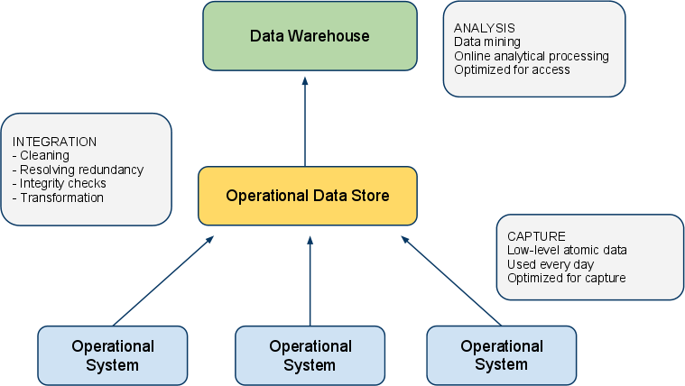
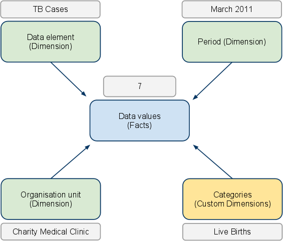

# DHIS2 as Data Warehouse

This chapter will discuss the role and place of the DHIS2 application in
a system architecture context. It will show that DHIS2 can serve the
purpose of both a data warehouse and an operational system.

## Data warehouses and operational systems

A *data warehouse* is commonly understood as a database used for
analysis. Typically data is uploaded from various operational /
transactional systems. Before data is loaded into the data warehouse it
usually goes through various stages where it is cleaned for anomalies
and redundancy and transformed to conform with the overall structure of
the integrated database. Data is then made available for use by
analysis, also known under terms such as*data mining*and *online
analytical processing*. The data warehouse design is optimized for speed
of data retrieval and analysis. To improve performance the data storage
is often redundant in the sense that the data is stored both in its most
granular form and in an aggregated (summarized) form.

A *transactional system* (or *operational system* from a data warehouse
perspective) is a system that collects, stores and modifies low level
data. This system is typically used on a day-to-day basis for data entry
and validation. The design is optimized for fast insert and update
performance.

There are several benefits of maintaining a data warehouse, some of them
being:

  - *Consistency:* It provides a common data model for all relevant data
    and acts as an abstraction over a potentially high number of data
    sources and feeding systems which makes it a lot easier to perform
    analysis.

  - *Reliability:* It is detached from the sources where the data
    originated from and is hence not affected if data in the operational
    systems are purged or lost.

  - *Analysis performance:* It is designed for maximum performance for
    data retrieval and analysis in contrast to operational systems which
    are often optimized for data capture.

There are however also significant challenges with a data warehouse
approach:

  - *High cost:* There is a high cost associated with moving data from
    various sources into a common data warehouse, especially when the
    operational systems are not similar in nature. Often long-term
    existing systems (referred to as legacy systems) put heavy
    constraints on the data transformation process.

  - *Data validity:* The process of moving data into the data warehouse
    is often complex and hence often not performed at regular and timely
    intervals. This will then leave the data users with out-dated and
    irrelevant data not suitable for planning and informed decision
    making.

Due to the mentioned challenges, it has lately become increasingly
popular to merge the functions of the data warehouse and operational
system, either into a single system which performs both tasks or with
tightly integrated systems hosted together. With this approach, the
system provides functionality for data capture and validation as well as
data analysis and manages the process of converting low-level atomic
data into aggregate data suitable for analysis. This sets high standards
for the system and its design as it must provide appropriate performance
for both of those functions; however, advances in hardware and parallel
processing is increasingly making such an approach feasible.

In this regard, the DHIS2 application is designed to serve as a tool for
both data capture, validation, analysis and presentation of data. It
provides modules for all of the mentioned aspects, including data entry
functionality and a wide array of analysis tools such as reports,
charts, maps, pivot tables and dashboard.

In addition, DHIS2 is a part of a suite of interoperable health
information systems which covers a wide range of needs and are all
open-source software. DHIS2 implements the standard for data and
meta-data exchange in the health domain called SDMX-HD. There are many
examples of operational systems which also implements this standard and
potentially can feed data into DHIS2:

  - iHRIS: System for management of human resource data. Examples of
    data which is relevant for a national data warehouse captured by
    this system is "number of doctors", "number of nurses" and "total
    number of staff". This data is interesting to compare for instance
    to district performance.

  - OpenMRS: Medical record system being used at hospital. This system
    can potentially aggregate and export data on inpatient diseases to a
    national data warehouse.

  - OpenELIS: Laboratory enterprise information system. This system can
    generate and export data on number and outcome of laboratory tests.

## Aggregation strategy in DHIS2

The analysis tools in DHIS2 read aggregated data from *data mart*
tables. A data mart is a data store optimized for meeting the most
common user requests for data analysis. The DHIS2 data mart contains
data aggregated in the*space dimension* (the organisation unit
hierarchy), *time dimension* (over multiple periods) and for *indicator
formulas* (mathematical expressions including data elements). Retrieving
data directly from data marts provides good performance even in
high-concurrency environments since most requests for analysis can be
served with a single, simple database query against the data mart. The
aggregation engine in DHIS2 is capable of processing low-level data in
the multi-millions and managing most national-level databases, and it
can be said to provide *near real-time access* to aggregate data.

DHIS2 allows for setting up scheduled aggregation tasks which typically
will refresh and populate the data mart with aggregated data every
night. You can choose between aggregating data for the last 12 months
every night, or aggregate data for the last 6 months every night and the
last 6 to 12 months every Saturday. The scheduled tasks can be
configured under "Scheduling" in "Data administration" module. It is
also possible to execute arbitrary data mart tasks under "Data mart" in
"Reports" module.

## Data storage approach

There are two leading approaches for storing data in a data warehouse,
namely the *normalized* and *dimensional* approach. DHIS2 lends a bit
from the former but mostly from the latter. In the dimensional approach,
the data is partitioned into *dimensions* and *facts*. Facts generally
refer to transactional numeric data while dimensions are the reference
data that gives context and meaning to the data. The strict rules of
this approach make it easy for users to understand the data warehouse
structure and provides for good performance since few tables must be
combined to produce meaningful analysis, while it, on the other hand,
might make the system less flexible and harder to change.

In DHIS2 the facts correspond to the data value object in the data
model. The data value captures data as numbers, yes/no or text. The
*compulsory dimensions* which give meaning to the facts are the *data
element*, *organisation unit hierarchy* and *period* dimensions. These
dimensions are referred to as compulsory since they must be provided for
all stored data records. DHIS2 also has a custom dimensional model which
makes it possible to represent any kind of dimensionality. This model
must be defined prior to data capture. DHIS2 also has a flexible model
of groups and group sets which makes it possible to add custom
dimensionality to the compulsory dimensions after data capture has taken
place. You can read more about dimensionality in DHIS2 in the chapter by
the same name.

