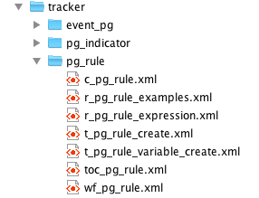

# DHIS2 Documentation Guide

<!--DHIS2-SECTION-ID:doc_guide_chapter-->

## DHIS2 Documentation System Overview

<!--DHIS2-SECTION-ID:docs_1-->

DHIS2 is a web-based information management system under very active
development with typically four releases per year. Each release
typically includes a number of new features and additional
functionality. Given the fast pace of development, the system's wide
user base and distributed, global nature of development, a comprehensive
documentation system is required. An in-depth discussion of the need for
documentation of DHIS2 has been considered previously.Store2007
[DocBook](http://www.docbook.org) is a comprehensive, standard XML based
markup language for the creation of books, papers and other technical
documents maintained by [OASIS](%20http://www.oasis-open.org/) . In this
chapter, we will describe the documentation system of DHIS2 and how you
can contribute.

## Introduction

<!--DHIS2-SECTION-ID:docs_2-->

One of the main advantages of [DocBook](http://docbook.org/whatis) is
that there is complete separation between the content and presentation.
DocBook is a pure XML markup format used for technical documentation. In
spite of the hundreds of tags which DocBook supports, only a very small
subset of its features are currently used for the DHIS2 documentation.
Since DocBook can be transformed into a wide variety of formats (HTML,
PDF, etc) and is a text-based format, it serves as an ideal format for
documentation of the system.

There exist a wide range of text editors which can be used for the
creation of DocBook files. A fairly complete list of possibilities is
located [here](http://wiki.docbook.org/topic/DocBookAuthoringTools). It
is currently recommended to use the [\<oXygen/\> XML
editor](https://www.oxygenxml.com) for editing DocBook source files. In
principle, any text editing program or XML editor can be used to author
DocBook files. Other good possibilities are excellent and freely
available text editor[jEdit](http://jedit.org/) with the XML plugin
installed, or the [cross-platform
Emacs](https://www.gnu.org/software/emacs/) text editor. Both of these
programs support editing DocBook XML.

One of the key concepts to keep in mind when authoring documentation in
DocBook, or other presentation neutral formats, is that the **content**
of the document should be considered first. The **presentation** of the
document will take place in a separate transformation step, whereby the
source XML will be rendered into different formats, such as HTML and
PDF. It is therefore important that the document is well organised and
structured, with appropriate tags and structural elements being
considered.

It is good practice to break your document in to various sections using
the sect tag. It is easy to make use of the modular nature of DocBook,
and split very complex chapters into smaller, more manageable pieces.
This concept is essentially the same as Microsoft Word or other word
processing programs. DocBook will automatically take care of numbering
the sections for you when the document is produced.

Two other important elements are the itemizedlist andnumberedlist. These
are quite similar, but an itemised list corresponds to a bulleted list,
which a numbered list will be rendered with each element being numbered
sequentially. Other key elements are screenshot and table which should
be self-explanatory.

The reader is referered to the DocBook documentation for a more in-depth
description of the exact elements which are availbale to be used.
Currently, the DHIS2 documentation is using version 5.0 of DocBook.

## Getting started with GitHub

<!--DHIS2-SECTION-ID:docs_3-->

The DHIS2 documentation system is managed at
[GitHub](https://github.com/dhis2/dhis2-docbook-docs) in its own source
code repository. GitHub is a collaborative platform that enables
multiple people to work on software projects collaboratively. In order
for this to be possible, a version control system is necessary in order
to manage all the changes that multiple users may make. GitHub uses the
*git* source control system. While it is beyond the scope of this
document to describe the functionality of *git*, users who wish to
create documentation will need to gain at least a basic understanding of
how the system works. A basic guide is provided in the next section. The
reader is referred to the [git manual](https://git-scm.com/book/en/v2)
for futher more detailed information.

In order to start adding or editing the documentation, you should first
perform a checkout of the source code. If you do not already have a
GitHub account, you will need to get one. This can be done
[here](https://github.com/). Once you register with GitHub, you will
need to request access to the*dhis2-documenters* group if you wish to
modify the source code of the documentation directly.

Login to GitHub, and then file an issue
[here](https://github.com/dhis2/dhis2docs/issues/new). Your request will
need to be approved by the group administrators. Once you have been
granted access to the group, you can commit changes to the documentation
branch and send and receive notifications if you wish. Alternatively,
you can clone the documentation into your own repository, commit your
changes to your own fork, and request that your changes be merged with
the source of the documenation with a pull request
[here](https://github.com/dhis2/dhis2-docs/pulls).

## Getting the document source

<!--DHIS2-SECTION-ID:docs_4-->

In order to edit the documentation, you will need to download the source
of the documentation to your computer. GitHub uses a version control
system known as git . There are different methods for getting Git
working on your system, depending on which operating system you are
using. A good step-by-step guide for Microsoft operating systems can be
viewed
[here](https://help.github.com/articles/getting-started-with-github-for-windows).
Alternatively, if you are comfortable using the command line, you can
download git from [this page](http://git-scm.com/download/win) If you
are using Linux, you will need to install git on your system through
your package manager, or from source code. A very thorough reference for
how git is used is available in a number of different formats
[here](http://git-scm.com/book).

Once you have installed git on your system, you will need to download
the document source. Just follow this procedure:

1.  Make sure you have git installed.

2.  On Windows systems, visit <https://github.com/dhis2/dhis2docs> and
    press "Clone in Desktop". If you are using the command line, just
    type `git clone
                                                    git@github.com:dhis2/dhis2docs.git`

3.  The download process should start and all the documentation source
    files will be downloaded to the folder that you specified.

4.  The DHIS2 documents depend on other branches for their
    documentation. Be sure to keep these these up to date as well. When
    you build the documentation, the necessary submodules will be
    downloaded automatically as part of the build process ,if you have
    not already done so.

5.  Once you have the source, be sure to create your own branch for
    editing. Simply execute` git checkout -b mybranch` where *mybranch*
    is the name of the branch you wish to create.

## Editing the documentation

<!--DHIS2-SECTION-ID:docs_5-->

Once you have downloaded the source, you should have a series of folders
inside of the repository directory.

  - Place all files in a folder in the following format
    `/src/docbkx/content/XXXX`. XXXX represents one of the thematic
    folders which are used to organize the documentation.

  - Place images that you linked to in the
    `/dhis2docs/src/docbkx/XX/resources/images` folder. Link these
    inside your DocBook file using a relative file link. When the
    documentation is built, in a separate step, the images will be
    automatically copied over to the correct directory.

<table>
<caption>File naming conventions for modularization</caption>
<colgroup>
<col style="width: 25%" />
<col style="width: 25%" />
<col style="width: 25%" />
<col style="width: 25%" />
</colgroup>
<thead>
<tr class="header">
<th><p>File prefix</p></th>
<th><p>Topic type</p></th>
<th><p>Description</p></th>
<th><p>Example</p></th>
</tr>
</thead>
<tbody>
<tr class="odd">
<td><p>c</p></td>
<td><p>Concept</p></td>
<td><p>This topic contains a short description about the feature.</p></td>
<td><p><code>c_pg_rule.xml</code></p></td>
</tr>
<tr class="even">
<td><p>r</p></td>
<td><p>Reference</p></td>
<td><p>This topic contains relevant reference information, for example operators and functions to use in program rule expressions.</p></td>
<td><p><code>r_pg_indicator_expression.xml</code></p></td>
</tr>
<tr class="odd">
<td><p>t</p></td>
<td><p>Task</p></td>
<td><p>This topic contains detailed step-by-step instructions of how to perform a task.</p></td>
<td><p><code>t_pg_rule_create.xml</code></p></td>
</tr>
<tr class="even">
<td><p>toc</p></td>
<td><p>-</p></td>
<td><p>This topic contains the xi:include links that together create a complete section.</p>
<p>You shouldn't mix xi:include links and content in the same topic.</p></td>
<td><p><code>toc_pg_rule.xml</code></p></td>
</tr>
<tr class="odd">
<td><p>wf</p></td>
<td><p>-</p></td>
<td><p>This topic contains the process the user must go through to complete a complicated task, for example create a program rule.</p></td>
<td><p><code>wf_pg_rule.xml</code></p></td>
</tr>
</tbody>
</table>



## DHIS2 Bibliography

DHIS2 has a rich set of academic literature which can serve as useful
resources during implementations, project proposals and more detailed
reading than what is appropriate for a general user manual. A
specialized bibliography has been added to the source code of the
application. [BibTeX](http://www.bibtex.org) is a specialized language
which is widely used in the academic world to handle bibliographic
databases. A large number of free and open source tools are capable of
working with BibTeX. Currently, the recommended tool of choice for
manipulating the DHIS2 bibliography is
[JabRef](http://jabref.sourceforge.net/).

To get started with the bibliography, download a copy of JabRef and open
the `/src/bibliography/dhis2_bibliography.bib file`. . Add some new
references, then export the bibliography back to the
`/src/docbkx/en/dhis2_bibliography.xml` file, using the DocBook 5.0
export format. The updated bibliography will automatically be included
in the documentation after you commit your changes.

## Using images

<!--DHIS2-SECTION-ID:docs_6-->

Screen shots are very useful for providing information to users on how
particular actions should be performed. DocBook has no intrinsic
mechanisms to know exactly how an image should be rendered in the final
document. Therefore, it is necessary to provide instructions through
element attributes. The following XML code fragment demonstrates how an
image can be specified to occupy 80% of the available page width. For
screen shots in landscape format, this seems to be an appropriate
amount. You may need to experiment a bit to obtain a proper width for
your image. Alternatively, you can edit the resolution of the image
itself, in order to obtain a proper size during rendering.

    <screenshot>
     <title>DHIS2 Login screen</title>
      <mediaobject>
       <imageobject> 
        <imagedata fileref="resources/images/login/dhis2_login_screen.jpg" format="JPG" width="80%"/>
       </imageobject>
      </mediaobject> 
    </screenshot>

For other images, depending on their size, a different value may be
necessary. If you do not specify a width for you image, and its
intrinsic size is larger than the available screen width, the image may
overflow in certain document types with a fixed width, such as PDF.

Its is important that all images begin with `resources/images/XXXX`
where XXXX is the folder where the image is actually located. When the
documentation is actually built, the images will be copied into the
correct location for the different formats. If you are having trouble
seeing the image in your editor, be sure you create a symlink to this
folder in the corresponding documents `content` folder.

## Linking documents together

<!--DHIS2-SECTION-ID:docs_7-->

DocBook provides a modular framework where many separate documents can
be linked together into a master document. Fragments from different
documents can also be reused in different contexts. It is therefore
important to consider whether your document should be constructed as an
article or a chapter. Chapters are essentially portions of a book, and
can therefore be linked together into a larger document very easily.
Articles are essentially standalone documents, but they can also be
assembled together into a larger document at the component level.

Should you wish to link several articles together into a book, DocBook
provides a mechanism to assign an id to a section. In the example below,
a section has been assigned an id. This id must be unique within the
document.

``` 
  <section xml:id="mod2_1">
<title>Getting started with DHIS2</title> ....
```

In order to include an article into a book, an Xinclude statement must
be used. The following example shows how.

    <chapter>
    <title>Getting started with DHIS2</title> 
    <xi:include xmlns:xi="http://www.w3.org/2001/XInclude" href="dhis2_user_man_mod2.xml"
     xpointer="mod2_1" encoding="UTF-8"/>
    ... 

Note that the file name and id have been assigned in the parent
document, referring to the actual file (href) and particular fragment of
the child document that should be referenced in the parent document
(xpointer).

Including chapters in a book is very simple. The example below
illustrates
    how:

    <xi:include xmlns:xi="http://www.w3.org/2001/XInclude" href="dhis2_user_man_
    mod1.xml" encoding="UTF-8"/> 

In this case, there is no need to explicitly reference a part of the
document, unless you only want to include a portion of the chapter. If
you want to use a section of the chapter, you can assign an id to that
section, and then reference that section through an xpointer.

## Handling multilingual documentation

<!--DHIS2-SECTION-ID:docs_8-->

The DHIS2 docuemtnation has been translated into a number of different
languages including French, Spanish and Portuguese. If you would like to
create a translation of the documentation or contribute to one of the
exisiting translations, please contact the DHIS2 documentation team at
the email provided at the end of this chapter.

## Building the documentation

<!--DHIS2-SECTION-ID:docs_9-->

One of the key advantages of the DocBook format is that the source
documentation can be transformed into a wide variety of formats,
including HTML, chunked HTML, XHTML, PDF, and a number of other formats.
There are a wide variety of tools that are capable of performing this
task. Basically the XML source of the document is transformed using the
standard [DocBook XSL style
sheets](https://sourceforge.net/projects/docbook/files/docbook-xsl/)
into the desired output format. The complete list of tools capable of
transforming DocBook will not be listed here, but a few examples are
provided below.

Latest builds of the documentation are available from the [DHIS2
website](http://www.dhis2.org/documentation). The latest snapshot builds
and previous versions of the documentation are available through a
searchable site located [here](http://dhis2.github.io/dhis2-docs/).

### Building the documentation with Apache maven

In order to transform the documentation source files to different
formats, such as HTML or PDF, you will need to install the Apache Maven
program. You can get a copy
[here](http://maven.apache.org/download.html) or by installing it
through your package manager if you are using Linux. Just execute the
command `mvn clean package` on Windows or on Linux from the
`/dhis2-docbook-docs `directory. Maven will start to download the
necessary components to transform the documents into HMTL,PDF and RTF.
Once the process has completed (be patient the first time, as there are
a number of components that must be downloaded), all of the target
document types will be generated in the /`dhis2docs/target/docbkx`
directory in respective sub-directories.

### Building with xmlto

`xmlto` is a useful utility available on Linux platforms for
transforming DocBook documents into many different formats. More
information on the package can be found
[here](http://cyberelk.net/tim/software/xmlto/). If you do not want to
use Apache Maven for some reason, you can install `xmlto` through your
package manager. Once you have installed `xmlto` you can just execute

`xmltohtmlfile_to_transform`

where the file\_to\_transform parameter is the name of the file you wish
to transform. There are many other formats available, such as PDF, PS,
JavaHelp and others.

## Committing your changes back to GitHub

<!--DHIS2-SECTION-ID:docs_10-->

Once you have finished editing your document, you will need to commit
your changes back to GitHub. Open up a command prompt on Windows or a
shell on Linux, and navigate to the folder where you have placed your
documentation. If you have added any new files or folders to your local
repository, you will need to add them to the source tree with the `git
add
` command, followed by the folder or file name(s) that you have added.
Be sure to include a descriptive comment with your commit.

`
git commit 
-m
"Improved documentation on organisation unit imports with CSV."
`

Finally, you should push the changes back to the repository with `git
push origin mybranch`, where "mybranch" is the name of the branch which
you created when you checked out the document source or which you
happent o be working on. In order to do this, you will need the
necessary permissions to commit to the repository.When you have
committed your changes, [you can issue a pull
request](https://github.com/dhis2/dhis2-docs/pulls) to have them merged
with the master branch. You changes will be reviewed by the core
documentation team and tested to ensure they do not break the build, as
well as reviwed for quality. As mentioned previously, you can also push
your changes to your own GitHub repo, if you do not have access to the
main repo, and submit a pull request for your changes to be merged.

If you have any questions, or cannot find that you can get started, just
send an email with your problem to
<dhis2-documenters@lists.launchpad.net>.

