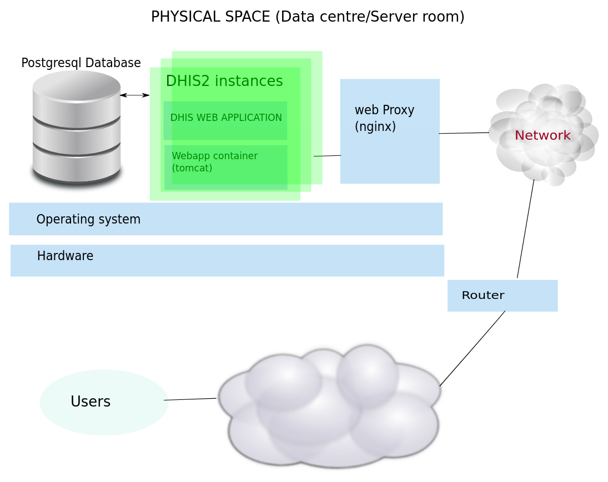

# DHIS2 Tools Guide

## Overview

The dhis2-tools package is a collection of tools and utilities for
installing and managing DHIS2 applications on an ubuntu server. The
tools provide the ability to go from a "blank" server with only ssh
running, to a fully functioning dhis2 installation in a matter of
minutes. Used together they can also be combined into automated scripts
to facilitate rapid reconstruction of a given configuration.

The tools have been collected and developed over a number of years. This
documentation differs in some respects from the installation guidelines
in the dhis2 user manual in that it describes the implementation of a
specific approach rather than the more general tutorial nature of the
user manual. It is recommended that implementers do also study the
material in the user manual as it provides additional information, eg.
how to tune the postgresql server. The rationale of the tools described
in this manual includes:

1.  to ease the process of installation so that it can be easily
    explained, documented and executed;

2.  to assist system administrators (particularly, but not exclusively,
    lesser experienced ones) to implement reasonable security measures
    by default and thus minimize vulnerabilities brought about through
    human error and negligence;

3.  to provide a set of scripts to assist the administrator with tasks
    related to managing their dhis2 system, beyond the one off process
    of installation.

The package remains a work in progress and there are a number of areas
where it could and should (and hopefully will) be improved. For example,

1.  currently the tuning of the postgresql database is not covered.
    There are ways in which this could be at least semi automated;

2.  nginx configuration is assisted by means of providing a sample
    configuration file. This configuration could be made more dynamic;

3.  the format of what is currently packaged is an Ubuntu linux deb
    package. There is also considerable interest in the Redhat/CentOS
    flavour of linux for running dhis2. It should be possible to offer a
    yum format package to facilitate use on these systems.

## Architecture

The figure below shows the main components involved in a DHIS2 system.

The dhis2-tools are primarily concerned with the creation and managing
of the tomcat instances which deliver the web application. As you can
see in the diagram there may be one or more of these. In addition the
system requires a postgresql database server and an nginx web proxy
server. There are many possible configurations where these can be
running on a different server than the dhis2 instances. These tools for
the most part assume that they are all installed together on the one
machine. Some customisation is required to separate them.

When an instance is created with the dhis2-create-instance command, a
new user is created with the name of the instance (lets say its called
hmis). The home directory of that user is located at
/var/lib/dhis2/hmis. A database role is created also called hmis
together with a database with the name of hmis. The DHIS2\_HOME
environment variable for the instance is set to the same home directory
of the user.

The essential components of a standalone tomcat instance are also
created within the same directory (modelled after the ubuntu
tomcat7-user package). The web.xml file of that tomcat instance has been
customized to allow an upstream web proxy server (such as nginx) to
cache the static content of the dhis2 application.

The user will also have a crontab configuration automatically setup to
manage daily backups, start on computer restart and log file rotation.

Note that postgresql optimization, as described in the dhis2 user
documentation, is not managed by this package and needs to be done as a
post-installation step.

## Installation

This manual assumes that you have installed a minimal distribution of
ubuntu server 12.04 LTS, 14.04 LTS or 16.04 LTS. By minimal we mean that
only the base operating system is installed together with an openssh
server. During the installation you should avoid to install ANY other
packages The dhis2-tools package will ensure that the required packages
are installed as dependencies.

It is recommended as a general guideline that before proceeding any
further you should strengthen the security of the system at this point
by improving the security of your ssh service and installing a host
based firewall like ufw.

Once your base system is properly installed and secured you can proceed
to install the dhis2-tools package from the PPA repository at
https://launchpad.net/~simjes91/+archive/ubuntu/dhis2-tools. The easiest
way to do so is to run the install.sh script available (with the source
code of the package) at https://github.com/dhis2/dhis2tools.

The simplified set of steps to get a dhis2 instance up and running from
here are:

1.  turn your user (eg bobj) into a dhis2-admin user by running:
    
    sudo dhis2-create-admin bobj

2.  create an instance named eg dhis with:
    
    dhis2-instance-create dhis

3.  deploy the latest stable war file with:
    
    dhis2-deploy-war dhis

4.  setup a basic nginx template with:
    
    dhis2-nginx
    
    Note that nginx configuration is not done automatically. Though
    running the command dhis2-nginx will create a simple site
    configuration file under /etc/nginx/sites-enabled/dhis2. You may
    need to edit this file to ensure that instance names and port
    numbers are correct.

5.  start your dhis instance with:
    
    dhis2-startup dhis

A full description of these commands and others used for managing your
instance is included in the command reference section below.

## DHIS2 tools reference

The reference documentation for the commands contained in the package is
listed in the pages below. This documentation should also be included as
man pages when the package is installed. So for example you should be
able to type

`man dhis2-instance-create`

to read the documentation for that command on the system. Typing

`apropos dhis2`

will show you all the dhis2 related man pages.

---

**Name:** dhis2-instance-create  
**Purpose:** Creates a new dhis2 instance

`
/usr/bin/dhis2-instance-create

[OPTIONS]

name
`

Use this tool to create a new dhis2 instance in a tomcat container. The
name that is specified will be used to create a new user and a new
database with the name of that user. The user will be assigned to the
**dhis2** group. The user will have a home directory created in
/var/lib/dhis2/\<username\>. This directory acts as both the
**DHIS2\_HOME** directory and also the **CATALINA\_BASE** directory for
the tomcat servlet container.

By default the instance is allocated 2G of heap space RAM. This can be
adjusted by editing the parameters in
**/var/lib/dhis2/\<name\>/bin/setenv.sh**.

The servlet container is configured to run with an http connector pool
of a maximum of 100 threads. This parameter can be adjusted by editing
**/var/lib/dhis2/\<name\>/conf/server.conf**.

The servlet container configuration has been specially tweaked for
running DHIS2. For example tomcat filters are used to ensure that all
static content from the web application are cacheable by web proxy
servers such as nginx or apache. The lib directory of the webapp has
been explicitly placed in the application classpath so that additional
jars such as java compiled apache camel routes can be made available to
the DHIS2 application.

Note that a dhis2 war file is not deployed by default. See the manual
page for **dhis2-deploy-war** for instructions to deploy a dhis2 war
file over the internet from the latest stable global build, latest trunk
build or from a user specified war file on the filesystem.

You need to be a member of the **dhis2-admin** group to use these and
other tools for managing the instance. See the manual page for
**dhis2-create-admin**.

  - \-p  
    http port

  - \-n  
    DO NOT create the database when creating the instance. Note if you
    use this option you will have to manually edit the properties file
    at /var/lib/dhis2/\<instance\>/dhis.conf.

`dhis2-instance-create -p 8080 hmis`

Creates a new instance called hmis listening on http port 8080.

dhis2-create-admin (1), dhis2-deploy-war (1), dhis2-startup (1),
dhis2-shutdown (1), dhis2-deploy-war (1) and dhis2-log (1).

---

**Name:** dhis2-startup  
**Purpose:** Starts a dhis2 instance

`
/usr/bin/dhis2-startup
instance name
`

Start a dhis2 instance

dhis2-startup myInstance

dhis2-shutdown (1), dhis2-deploy-war (1) and dhis2-instance-create (1).

---

**Name:** dhis2-shutdown  
**Purpose:** Stops a dhis2 instance

`
/usr/bin/dhis2-shutdown
instance name
`

Stop a dhis2 instance

dhis2-shutdown myInstance

dhis2-startup (1)

---

**Name:** dhis2-clone  
**Purpose:** Clones the database of one instance to another instance

`
/usr/bin/dhis2-clone
master
copy
`

This command creates a copy of the database and war file of one instance
into another instance. The main use case for this is where you want to
setup an instance for training purposes. Trainees can be "let loose" on
the training instance without fear of disturbing the data or
configuration of the production instance. They will however be working
with the same usernames, forms and reports which exist in the master.
The command should be executed with care as it will completely replace
the existing database of the target instance

Scheduled datamart and analytics generation jobs are disabled in the
target instance.

The command could conceivably be scheduled to run in the early morning
to ensure that the database is restored to a pristine state for the
start of each day's training. Or it can be run on demand.

dhis2-clone hmis training

Creates a new instance called training from an existing instance called
hmis.

---

**Name:** dhis2-deploy-war  
**Purpose:** Deploys a war file

`
/usr/bin/dhis2-deploy-war

[OPTIONS]

instance name
`

  - \-t  
    Deploy war from latest trunk build. NOT RECOMMENDED for production
    systems

  - \-l  
    Deploy war located at a custom url

  - \-f  
    Deploy war from a file on the filesystem

Deploys a dhis2 war file to the instance. The default behaviour when no
options are given is to download and deploy the latest stable release
from http://stable.dhis2.org.

`dhis2-deploy-war myInstance` deploys the latest stable release from
dhis2.org into myInstance.

`dhis2-deploy-war -f wars/dhis.war myInstance` deploys the war file at
wars/dhis.war into myInstance.

`dhis2-deploy-war -t myInstance` deploys the latest trunk build from the
dhis2 team integration server into myInstance. Don't use this in
production.

`dhis2-deploy-war -l http://mywars.org/dhis.war myInstance` deploys the
war file from a user provided url into myInstance.

---

**Name:** dhis2-logview  
**Purpose:** Shows log file

`
/usr/bin/dhis2-logview
instance name
`

Use this tool to view log of dhis2 instance using less. Type ":q" to
exit. See the man page for less for tips in navigating and searching the
file.

dhis2-logview myInstance

dhis2-logtail (1).

---

**Name:** dhis2-logtail  
**Purpose:** Shows the bottom log file in real time. Type Ctrl-C to
exit.

`
/usr/bin/dhis2-logtail
instance name
`

Use this tool to show the log of dhis2 instance in real time.

dhis2-logtail myInstance

dhis2-logview (1).

---

**Name:** dhis2-create-admin  
**Purpose:** Create a user for administering dhis2 instances

`
/usr/bin/dhis2-create-admin
username
`

Creates a new dhis2 admin user. If the specified user does not exist,
she will be created on the system. Otherwise an existing user is
modified. The dhis2 admin user will have postgres superuser privileges
and wil be a member of the dhis2admin group.

Create it like this

---

**Name:** dhis2-nginx  
**Purpose:** Configure nginx with a specified or sample file

`
/usr/bin/dhis2-nginx

[FILENAME]

`

Use this tool to configure nginx. If no file is specified, a sample file
will be used.

The sample file is located at **/usr/share/dhis2-tools/samples/nginx/**

`dhis2-nginx`

Configures nginx to use the sample configuration.

---

**Name:** dhis2-integrity  
**Purpose:** Check database integrity of a DHIS2 instance

`
/usr/bin/dhis2-integrity

[instance name]

`

Use this tool to check the integrity of a dhis2 database. The tool runs
multiple sql queries to the specified database.

`dhis2-integrity dhis`

Runs various integrity tests on the database named dhis

---

**Name:** dhis2-restoredb  
**Purpose:** Restore a database dump to a dhis2 instance.

`
/usr/bin/dhis2-restoredb

[instance name]

[db dumps]

`

Use this tool to restore a database.

Shuts down the specified dhis2 instance and takes a snapshot backup of
the current database. It then drops the current database and creates a
new blank one. The new database is then populated with the specified db
dump.

`dhis2-restoredb myInstance db.sql`

Restores the db.sql dump to the myInstance database

---

**Name:** dhis2-backup  
**Purpose:** Create a backup of a dhis2 database

`
/usr/bin/dhis2-backup
`

Use this tool to create a backup of a database.

`dhis2-backup`

Creates a backup in the ~/backup folder

---

**Name:** dhis2-delete-instance  
**Purpose:** Deletes the specified DHIS2 instance and its database.

`
/usr/bin/dhis2-delete-instance

[OPTIONS]

name
`

Use this tool to delete a DHIS2 instance. This will delete the user
along with its home directory. It also deletes the database user and the
database.

  - \-d  
    database name

`dhis2-delete-instance -d dhisdb dhis`

Deletes a dhis2 instance named 'dhis' and its database named 'dhisdb'

## Troubleshooting guide

The following table shows some common problems which occur and likely
remedies:

<table>
<caption>Troubleshooting guide</caption>
<colgroup>
<col style="width: 50%" />
<col style="width: 50%" />
</colgroup>
<thead>
<tr class="header">
<th>Problem</th>
<th>Solution</th>
</tr>
</thead>
<tbody>
<tr class="odd">
<td>
When you attempt to access the site with your browser it does not connect.
</td>
<td>
Either there is a network problem or nginx is not running. Check first to see if you can ping the host. If not you have a network problem. If you can ping the site, the most likely problem is that nginx is not installed or is not running. Verify that nginx is up and running and listening on ports 443 and 80 by typing:

<code>sudo netstat -ntlp</code>

You should see the nginx process listening on those 2 ports
</td>
</tr>
<tr class="even">
<td>
You can access the site but you see a 502 gateway error in your browser.
</td>
<td>
This means that nginx is unable to connect to your backend dhis2 instance. Either the instance is not running or your nginx location configuration has an error. Running the same netstat command above should show your instance listening on 127.0.0.1 with a port number typically 8080 or whatever you have configured it as.

If its not running, try to start it with <code>dhis2-startup [instance
                  name]</code>

If it is still not running, check the log file with <code>dhis2-logview
                  [instance name]</code> to see if there is any information indicating why it has failed to start.

If it is running and you can see it with netstat then you need to check your nginx configuration file to ensure that the location is correctly mapped.
</td>
</tr>
<tr class="odd">
<td>
You can access the site but you see a blank page in your browser.
</td>
<td>
This usually means that the dhis2 instance is running, but you have forgotten to deploy a war file to it. You need to run dhis2-deploy-war on that instance. See the reference section above for details of options.
</td>
</tr>
</tbody>
</table>

