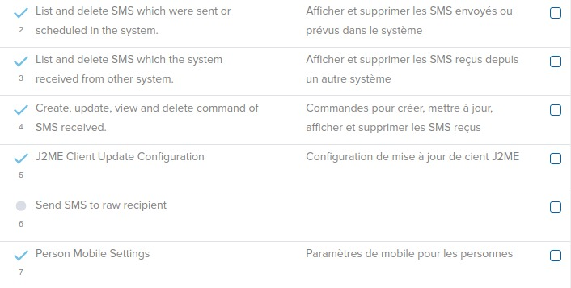
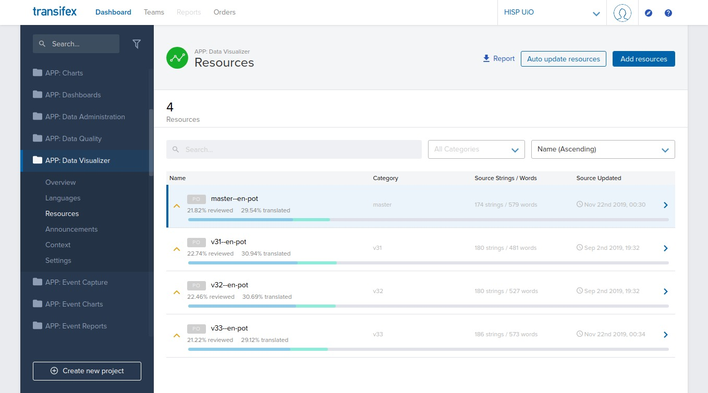

# Localization of DHIS 2

## DHIS 2 localization concepts

<!--DHIS2-SECTION-ID:localization-intro-->

Localization involves the adaptation of an application to a specific
location. When implementing DHIS 2 in a given country, adequate resources
should be allocated to translate and localize the application if required.
Translation of the user interface elements, messages, layout, date and
time formats, currency and other aspects must be considered. In addition
to translation of the user interface itself, metadata content which is
contained in the database must also be considered to be translated.

Interface translations are compiled into the system itself, such that new translations
can only be accessed by taking a newer version of DHIS 2.
Database translations, on the other hand, are specific to your implementation
and can be added to your existing DHIS 2 instance.

These two aspects are managed independently and the processes and tools are outlined
below.

## User Interface localization

### Overview

DHIS 2 supports internationalization (i18n) of the user interface through
the use of Java property strings and PO files. Java property files are used
when messages originate from the back-end Java server, while PO files
are used for front-end apps written in JavaScript.
The DHIS 2 Android apps use a specific XML format.

> **Note**
> 
> The translator need not worry about the different resource file formats; 
> the translation platform hides the details, and only displays the strings
> that require translation.  
> For example, the figure below shows the source and target strings when
> translating a resource to French.  
>
> 

There should always be an English string for all messages in DHIS 2.
When the user selects a given language, and a translation is present in that
language, then the translation will be shown. However, if the string in the
desired language is missing then fallback rules will be applied. In cases when
two given translations, such as Portuguese and Brazilian Portuguese share
common messages, it is not required to perform a full translation in the
variant language. Only messages which are different should be translated.  
Fallback rules are then applied in the following manner (assuming the user has
chooses Brazilian Portuguese as their language:

1.  Display the message in Brazilian Portuguese if it exists.

2.  If it does not exist in the variant language, then use the Portuguese
    message, if it exists.

3.  If there is no message in either the base language or the variant language,
    choose the ultimate fallback language, English.

>  **Important**
>
>   There are a number of source strings such as "dd MMM yyyy 'to '" which are used
>   for date/time formatting in various parts of DHIS 2. Part of the value
>   should not be translated because it is actually a special formatting
>   field used by either Java or JavaScript to interpolate or format a string.
>   In this example the part of the value which **can** be translated would be
>   "to", for instance to "a" in Spanish. The special string which should **not** 
>   be translated is "dd MMM yyyy". If these date format template
>   strings are translated, it may result in errors in the application!     

>  **Important**
>  
>   Some special variables (e.g. {0} ) use curly brackets. This
>   denotes a variable which will be replaced by a number or other
>   value by the application. You must place this variable notation in
>   the correct position and be sure not to modify it.

### Translation Platform

<!--DHIS2-SECTION-ID:translation-server-->

DHIS2 is now using [transifex](www.transifex.com) as our main platform for
managing translations. You can access the DHIS2 resources at
[translate.dhis2.org](https://translate.dhis2.org), or directly at
https://www.transifex.com/hisp-uio/public.

### How do I contribute to translations? 

#### Register as a translator

The first step is to  get access to the project. There are two ways to do this:

1. Navigate to the platform and create an account with transifex, then
	- request access to our organisation "HISP UiO" as a member of the "DHIS 2 Core Apps" translation team.  
	Transifex
have some useful instructions here:
[Getting Started as a Translator](https://docs.transifex.com/getting-started-1/translators)

1. Email the DHIS 2 team at translate@dhis2.org to request access.   
Please provide:
	- the name, email address and translation language of the user(s) you would like us to give access to, and
	- a little bit of information about why you are interested in contributing to the DHIS 2 translations

#### Edit translations

Once you have access as a translator, you can start translating through the transifex Web Editor.

Transifex have a useful guide here:
[Translating Online with the Web Editor](https://docs.transifex.com/translation/translating-with-the-web-editor)

As far as possible, the projects represent DHIS 2 apps one-to-one. For example, the **APP: Data Visualizer** project contains the translation strings for the Data Visualizer app.

Our transifex projects for DHIS2 User Interface all start with one of the following:

- **APP:** indicates that the project contains strings for a specific app
- **APP-COMPONENT:** indicates that the project is a component library used by the apps
- **ANDROID:** indicates that the project is an Andriod app

In addition, **APP: Server-Side Resources** contains some strings that are used by several apps; namely:
- "Data Entry"
- "Maintenance"
- "Pivot Tables"
- "Reports"

> **Tip**
>
> To ensure that there are full translations for a particular app, e.g. "Tracker Capture", you need to make sure translations are complete in:
> - The app project: **APP: Tracker Capture**
> - Any projects starting with **APP-COMPONENTS**
> - **APP: Server-Side Resources**, if required. For Tracker Capture this is **not required**.

Within the projects we have resources, which represent localization files in the source code. In order to support multiple DHIS2 versions, with the same localization files, the _version_ is associated with each instance of the file. So, for **APP: Data Visualizer** the list of resources looks like this in the Web Editor:

i.e. there is only one source resource for the app (`en.pot`), but we have added the versions from 2.31 (v31) up to the latest development (master). The version is shown in the "Category" field, and is also visible as a prefix to the resource name, e.g. `v31--en-pot`.

> **Note**
>
> In general, we request translators focus on the "**master**" resource; it usually contains all strings from previous versions, and when translations are added the platform will fill in matching translations on the previous versions too.

### When will new translations be available in the system?

We have a nightly service that pulls new translations from the transifex platform and opens a pull request on the source code.

The service loops over all projects and supported languages and does the following:

1. Pulls localization files from transifex (**where translations are more than 20% complete**)
2. Raises a pull request on the source code if changes are found for the language

The pull requests are reviewed and merged into the code base as part of the normal development process.

> **Info**
>
> The translations adde to transifex will, in general, be in the next available stable release for all supported DHIS 2 versions
>
> _If you need to ensure that your translations are in the next stable release, contact us (translate@dhis2.org) expalining your needs, and we'll let you know what we can do._ 

> **Tip**
>
> The translations you add in transifex should be visible in all development demo versions on our play server (https://play.dhis2.org) within a few days, in most cases.

### How do I add a new language?

Please contact us via email translate@dhis2.org, or on the [Community of Practice](https://community.dhis2.org/c/translation) and we'll add that language to the projects on transifex.

Once resources for that language are more than 20% translated, they will start to be pulled into the system. They will then
become visible in the development demo versions, and be available in future releases.

> **Note**
>
> DHIS 2 manages metadata (database) locales independently from the UI. _See the following section._ 

## Metadata/Database translations

<!--DHIS2-SECTION-ID:metadata-database-translations-->

In addition to translation of the user interface, DHIS 2 also supports
the localization of the metadata content in the database. It is possible
to translate individual objects through the **Maintenance app**, but in
order to better support a standard translation workflow, a specialized
app has been developed for this purpose.

New metadata locales can be added in **Maintenance app > Locales**.

### DHIS 2 Translations app

<!--DHIS2-SECTION-ID:translations-app-->

The DHIS 2 **Translation app** can 
be used to translate all metadata (data elements, categories,
organization units, etc) into any locale which is present in the
database.

To get started, simply choose the **Translations app** from the top level
menu.

1.  Choose the type of object you wish to translate from the **Object**
    drop-down menu, such as "Data elements".

2.  Be sure you have set the **Target Locale** to the correct language.

3.  Choose the specific object you wish to translate, and translate each
    of the properties (Name, Short name, Description, etc). These
    properties vary from object to object.

4.  Press "Save" when you are done translating the specific object to
    save your changes.

> **Note**
>
> You can search for a specific term using the search feature in the
upper right hand corner of the app.
