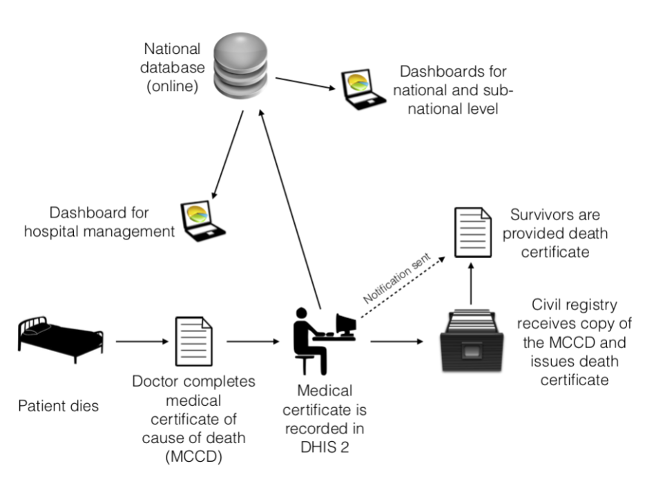
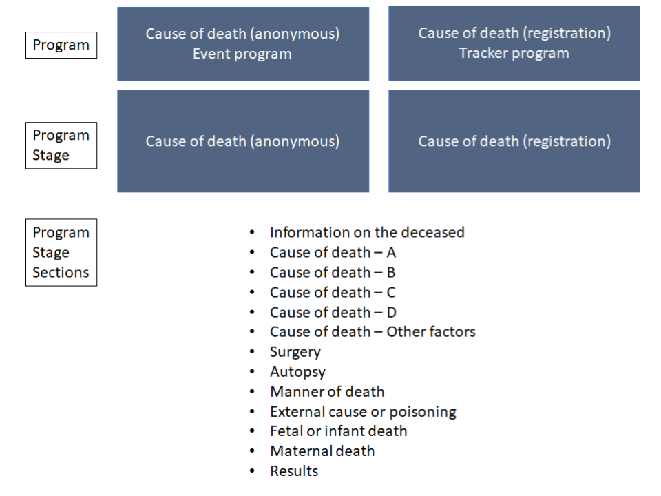
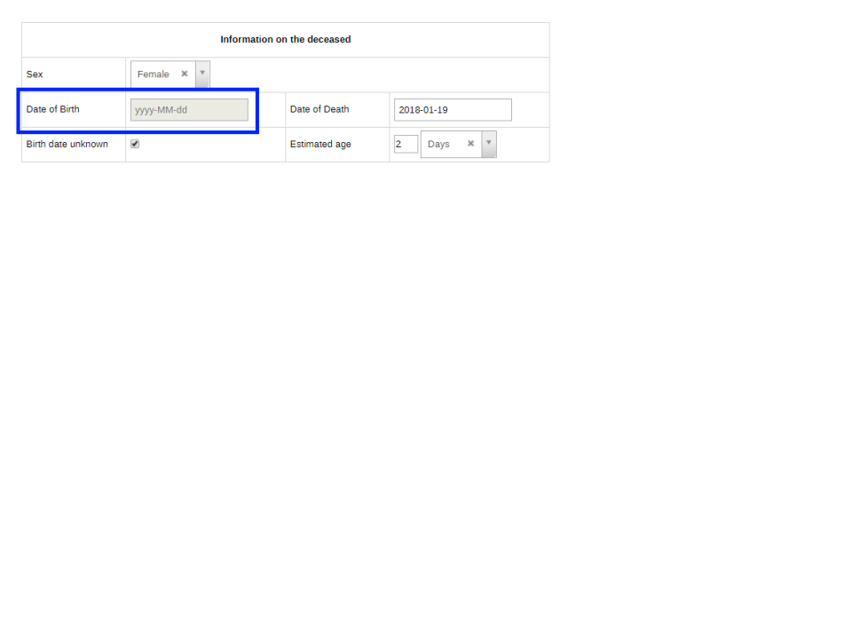
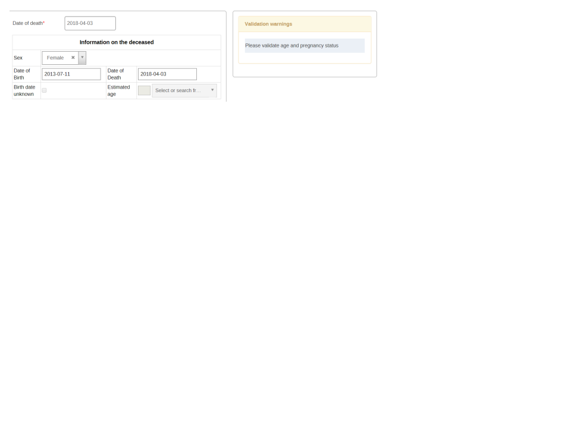
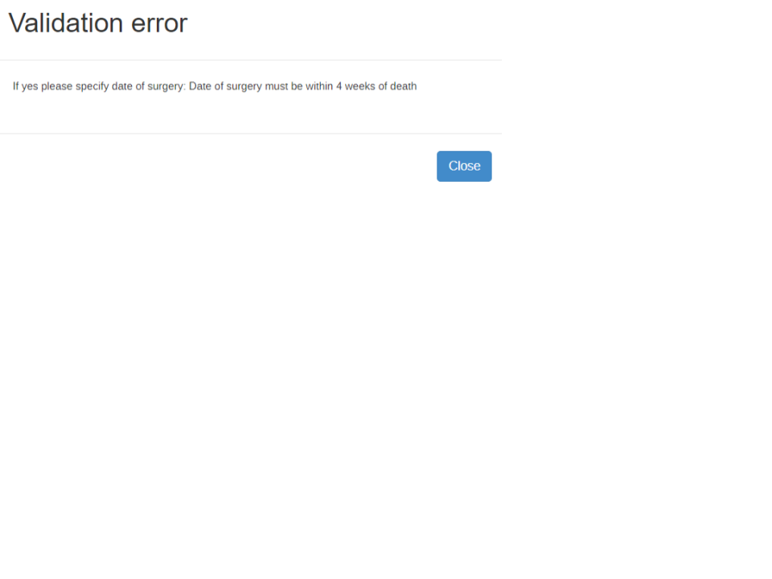
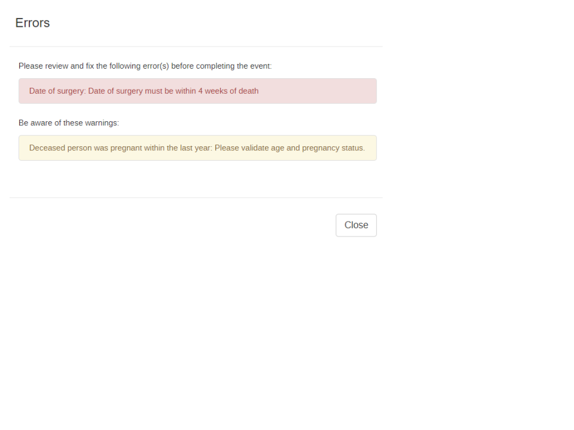
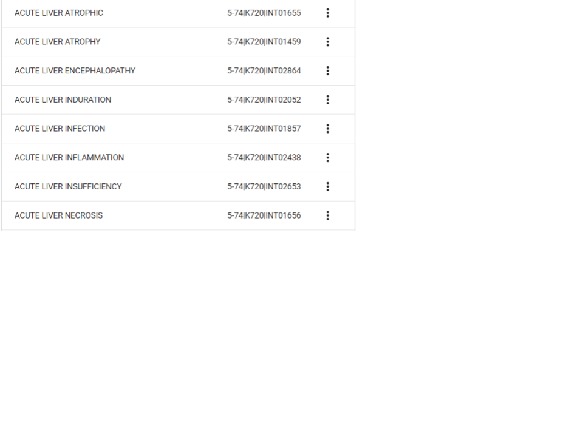
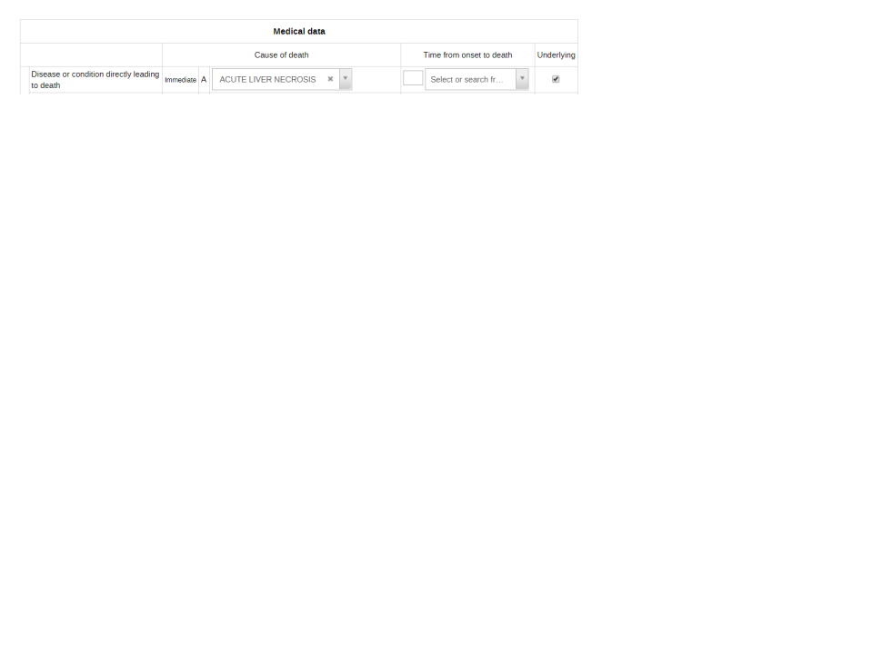
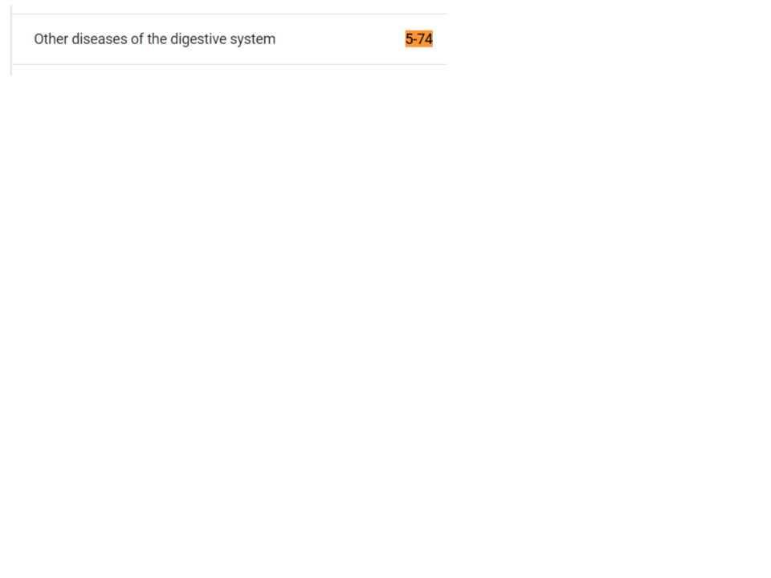
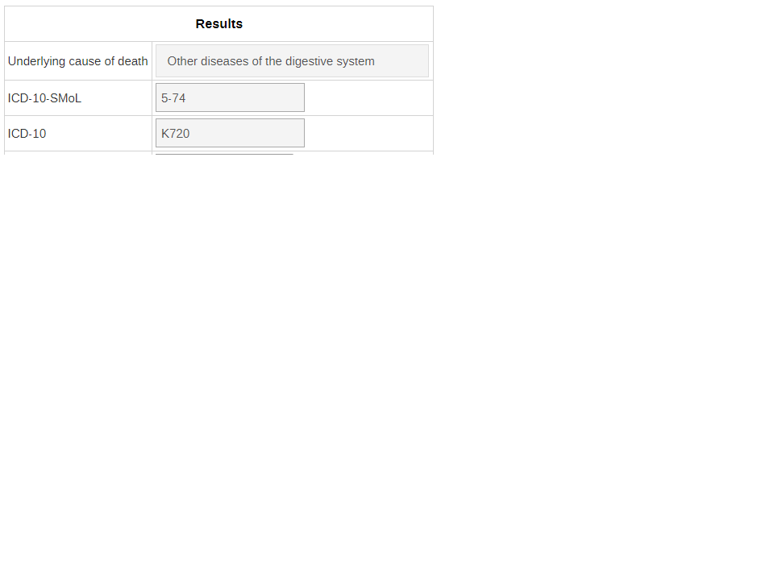

<!DOCTYPE html>
<html>

<head>
  <meta charset="utf-8">
  <meta name="viewport" content="width=device-width, initial-scale=1.0">
  <link rel="stylesheet" href="https://stackedit.io/style.css" />
</head>

<body class="stackedit">
  
<h2 id="who-cause-of-death-tracker-system-design">WHO Cause of Death Tracker System Design</h2>
<h2 id="overall-design">Overall Design</h2>

The WHO cause of death tracker system is configured in order to effectively collect and manage data related to causes of death. It is based on the International Medical Certificate of Cause of Death and ICD-10.

There are two programs that comprise its design and can be used depending on the needs of country/organization that is collecting this data.

<ol>
<li>Cause of death (anonymous – event capture program without registration)</li>
<li>Cause of death (tracker program with registration)</li>
</ol>

The **_anonymous _**program is an event program while the **_registration _**program is a tracker program. Both of these programs share the same data elements, custom form design, program indicators, program rules, etc.

A comparison of these two programs, taken from the implementation guide, can be seen below

<h3 id="cause-of-death-anonymous---event--program">Cause of death (anonymous) - event  program</h3>
<table>
  <tbody><tr>
   <td>Pros
   </td>
   <td>Cons
   </td>
  </tr>
  <tr>
   <td>Simple structure/data model
   </td>
   <td>Not possible to record identifiers in a way where uniqueness can be enforced, and person attributes can be encrypted.
   </td>
  </tr>
  <tr>
   <td>Uses the Event Capture app, which supports offline data entry in the Web browser.
   </td>
   <td>Due to lack of identifiers, finding and editing existing data is difficult.
   </td>
  </tr>
  <tr>
   <td>User friendly data entry screen, e.g. pertaining to display of data validation warnings.
   </td>
   <td>
   </td>
  </tr>
</tbody></table>
<h3 id="cause-of-death-registration---tracker-program">Cause of death (registration) - tracker program</h3>
<table>
  <tbody><tr>
   <td>Pros
   </td>
   <td>Cons
   </td>
  </tr>
  <tr>
   <td>Supports use of unique identifiers, as well as person attributes. This is necessary for example if considering interoperability with other CRVS systems, and for finding and editing data.
   </td>
   <td>No support for offline data entry in the web browser.
   </td>
  </tr>
  <tr>
   <td>
   </td>
   <td>Data and system becomes more sensitive when including person identifiers.
   </td>
  </tr>
  <tr>
   <td>
   </td>
   <td>Less user friendly data entry screen, e.g. pertaining to display of validation warnings.
   </td>
  </tr>
</tbody></table>

What version to choose depends on the specific situation, however, the offline capability of the <strong><em>event</em></strong> program is likely to be of importance in many settings. Note that the variables (data elements) used by both programmes are the same, and data from the two are thus comparable should one switch from using one version to the other.

<h2 id="cause-of-death-workflow">Cause of Death Workflow</h2>

The cause of death module uses a framework based off of the ICD (International Classification of Diseases) method of recording cause of death data. The <a href="http://apps.who.int/iris/handle/10665/40557">international medical certificate of cause of death</a> serves as the main source of information in this process. In order for the information to be entered in DHIS2, the medical certificate of cause of death must first be filled in (this will likely be a manual process and not filled in directly in DHIS2). This information will then be entered into DHIS2 using one of the program types that has been selected. The data entry form itself is a replica of the paper based medical certificate of cause of death. For more information/background on this certificate please refer to the ICD SMoL Training Manual.

    

    
<h2 id="tracker-program-overview">Tracker Program Overview</h2>

Both the event and tracker version of the WHO cause of death module only consist of one program stage, as they are very similar in their design; with the key design change being the ability to register attributes in the tracker based program. The cause of death module uses a custom form in order to meet design requirements to closely reflect the paper form in a web browser, however sections have also been made in the event a mobile device is used. This structure can be seen in the diagram below.

Descriptions of these programs are described in further detail in the sections below.

<h3 id="event-program---cause-of-death-anonymous">Event Program - Cause of death (anonymous)</h3>
<table>
  <tbody><tr>
   <td><strong>Stage</strong>
   </td>
   <td><strong>Description</strong>
   </td>
  </tr>
  <tr>
   <td><strong>Cause of death (anonymous)</strong>
   </td>
   <td>Contains all information necessary to record the information associated with the medical certificate of causes of death. Uses a custom form layout to reflect the paper-based certificate, with sections available to use on mobile devices. 
   </td>
  </tr>
</tbody></table>
<h3 id="tracker-program---cause-of-death-registration">Tracker Program - Cause of death (registration)</h3>
<table>
  <tbody><tr>
   <td><strong>Stage</strong>
   </td>
   <td><strong>Description</strong>
   </td>
  </tr>
  <tr>
   <td><strong>Registration / Attributes</strong>
   </td>
   <td>Registration consists of a single attribute, a system generated ID. This can be used in order to uniquely identify the death and find it in the system if required, but would in most cases be replaced with existing ID schemes, e.g. a national ID. It can also be used as a link to other systems (eg. civil registration). 
   </td>
  </tr>
  <tr>
   <td><strong>Cause of death (registration)</strong>
   </td>
   <td>Contains all the information necessary to record the information associated with the medical certificate cause of death. Uses a custom form layout to reflect the paper-based certificate, with sections available to use on mobile devices.

This is a <strong>non-repeatable</strong> stage; once the details of the death are registered no additional events will be added.
   
</td>
  </tr>
</tbody></table>

For a full list and description of the program, program stages and data elements used in this design, please refer to the full meta-data reference here

<h2 id="program-rules">Program Rules</h2>

You can read more about program rules here:

<a href="https://docs.dhis2.org/master/en/user/html/configure_program_rule.html">https://docs.dhis2.org/master/en/user/html/configure_program_rule.html</a>

Program rules are a critical component of the cause of death module in both tracker and event programs. Program rules are not only being used to reduce data entry errors through the use of the hide field and show error/warning actions, but also **_assign and code _**the underlying cause of death using ICD-10 SMoL and ICD-10 full codes; considered a key feature to this module in order to obtain higher quality mortality data. For a full list and description of the program rules for this program, see the detailed meta-data list here

<h3 id="hide-field">Hide Field</h3>

The hide field action is being used to **_grey/disable _**fields (this is the hide rule action being applied to a custom form; while it can not hide the field due to the custom design it can grey out the field so it cannot be interacted with). You can see this in the below example

Date of birth can not be interacted with as the birth date is unknown; however it is not hidden from view.

Note that on a mobile device the field will be hidden, as the form will default to the section design discussed previously.

<h3 id="show-warningshow-error">Show Warning/Show Error</h3>

A number of error/warning messages are built into the form in order to point out likely data entry issues. These messages will be displayed immediately within the event program  when it detects a problem

For the tracker program, they will display upon event completion only.

The differences in displaying these error/messages was discussed as a potential pro/con to each of these designs and should be considered prior to implementation.

<h3 id="assign">Assign</h3>

The assign rule action is used in order to determine the values for the following 4 data elements:

<ul>
<li>Age in years</li>
<li>Underlying cause of death</li>
<li>ICD-10 SMoL code</li>
<li>ICD-10 full code</li>
</ul>

The assignment of the value for the age in years is based upon the information on dates of birth and death or the estimated age, whilst the last 3 data elements are based upon the selection of the underlying cause of death. More information on selecting this cause is available through the WHO’s SMoL training resources: <a href="https://www.who.int/healthinfo/civil_registration/smol/en/.">https://www.who.int/healthinfo/civil_registration/smol/en/. </a>

In order to assign different values to 3 data elements an interaction of 2 option sets is used along with a code containing multiple parts. In this particular case, the data element that identifies the cause of death (for example, cause of death C on the form is identified as the underlying cause) is linked to the option set “<strong>ICD SMoL - local dictionary.</strong>” This option set contains plain English language terms for the different factors that could potentially be identified for cause of death A,B,C or D within the medical certificate of cause of death. This option set also contains option codes for each option that is separated into 3 parts; this is what is used to assign values to the separate data elements indicated previously.

Note that the code is separated by a delimiter “|” to indicate the separate parts of the code. The parts are separated as follows:

<ol>
<li>Code 1: ICD-10 SMoL code</li>
<li>Code 2: ICD-10 full code</li>
<li>Code 3: The code used to uniquely identify the option</li>
</ol>

The SMoL code used within the “<strong>ICD SMoL - local dictionary</strong>” identifies what will be used as the eventual underlying cause of death according to the shortened list in the ICD-10 SMoL. See in the above example that there can be multiple options using the same SMoL code in the “<strong>ICD-SMoL - local dictionary</strong>” option set, as these terms all correspond with the same cause of death that will be used for statistical purposes in the SMoL list.

In this example, let us say that we have identified acute liver necrosis as our underlying cause of death (note this is to explain the design and not necessarily reflective of a real example), which corresponds to an ICD-10 SMoL code of 5-74 and an ICD-10 full code of K720.

Once this has been entered:

<ol>
<li>It will take the first part of the code in the option set “<strong>ICD SMoL - local dictionary</strong>” (5-74) and assign it to the “underlying cause of death” data element. This data element is also linked to an option set “<strong><em>ICD-SMoL.</em></strong>” This option set is the shortened list of causes of death that can be used for obtaining better quality cause of death data.</li>
<li>The code 5-74 in the “<strong><em>ICD-SMoL</em></strong>”  option set corresponds to a value of “Other diseases of the digestive system.”</li>
</ol>

We can see that this is what will appear in the data entry form assigned to this data element at the bottom of the screen

<ol>
<li>It will take the first part of the code in the option set “<strong>ICD SMoL - local dictionary</strong>” (5-74) and assign it to the “<strong><em>ICD-10 SMoL</em></strong>” data element. This is just a plain text data element, so the code appears exactly as it is written in the option set.</li>
<li>It will take the second part of the code in the option set “<strong>ICD SMoL - local dictionary</strong>” (K720) and assign it to the “ICD-10” data element. This is just a plain text data element, so the code appears exactly as it is written in the option set.</li>
</ol>

This is the general process that is used in order to automatically code the identified underlying causes of death in this form and facilitate one of the key requirements of this module. By using this methodology, the cause of death is coded correctly and can subsequently be aggregated as required.

<h2 id="program-indicators">Program Indicators</h2>

You can read more about program indicators here:

<a href="https://docs.dhis2.org/master/en/user/html/configure_program_indicator.html">https://docs.dhis2.org/master/en/user/html/configure_program_indicator.html</a>

There are a number of program indicators associated with the program. A full list can be viewed in the detailed meta-data description here:

Program Indicators are used for this program to typically:

<ol>
<li>Group similar diseases together by their assigned ICD-10 SMoL code</li>
<li>Group deaths together by age group</li>
</ol>
<h2 id="external-data-analysis-anacod">External Data Analysis (ANACOD)</h2>

Data captured by the Cause of Death program can also be exported for external analysis using the WHO’s <a href="https://www.who.int/healthinfo/anacod/en/">Analysis Levels and Cause of Death (ANACOD)</a> tool. The ANACOD electronic tool provides a step-by-step approach to enables users to quickly conduct a comprehensive analysis of data on mortality levels and causes of death. The tool automatically reviews the data for errors, tabulates the information, presents the results in the form of easy to use tables and charts, and provides the opportunity to compare the findings with those from other groups of countries.

To export country data to the ANACOD tool, you will use the SQL views in DHIS2. The SQL views are included in the metadata package, by year (‘CoD: ANACOD Export [YYYY]’). New SQL views for each year are required in order to produce detailed outputs within ANACOD by year. You will need to take special care to keep the scripts up to date as new versions of DHIS2 may alter the underlying SQL tables that are being accessed to generate the view compatible with ANACOD. The SQL view will remain up-to-date on the DHIS2 WHO demo and can be used as a reference if your view is no longer working when you upgrade to a newer version of DHIS2.

<h2 id="references">References</h2>
<ul>
<li>WHO Start-up Mortality List (SMoL-ICD-10): <a href="https://www.who.int/healthinfo/civil_registration/smol/en/.">https://www.who.int/healthinfo/civil_registration/smol/en/</a></li>
<li>WHO Analysis Levels and Cause of Death (ANACOD):  <a href="https://www.who.int/healthinfo/anacod/en/">https://www.who.int/healthinfo/anacod/en/</a></li>
<li></li>
</ul>

</body>

</html>
