# Immunisation aggregate system design

## Introduction

This document describes the system design for the Immunisation configuration package for aggregate reporting, focusing on how the data collection part of the configuration has been designed in DHIS2 (i.e. data sets and data elements).

## Overview

The Immunisation configuration package for aggregate reporting contains a single dataset described in Table 1.

|Name|Periodicity|Purpose|
|:--|:--|:--|
|Immunisation|Monthly|Reporting of immunisation activities (including outreach activities), adverse events following immunisation, stock and cold-chain.|

Note that this data set was designed using a custom form in DHIS2, in particular to accommodate the stock section within this data set. If a section form was used, the stock section would extend beyond the width of the majority of user’s screens whom do not have a high-resolution monitor, causing them to have to scroll left/right when entering data within this section. 

## Data set structure and design

This section will present the main sections (tables) of the immunisation dataset (reporting forms), explaining their configuration.

### Outreach Session

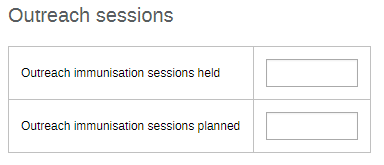

*   This section has been configured as individual data elements. No disaggregations are required here.

### Vaccinations - children

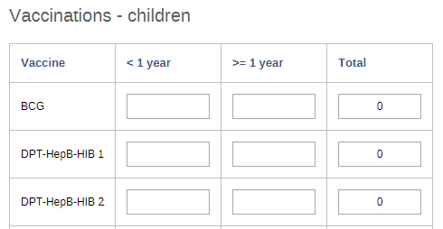

*Note: this is not the full table. Please review the full table in DHIS2.

*   This section has been configured using an age disaggregation `(<1, >=1)` for each data element within the section 
*   By applying a disaggregated structure, this reduces the data elements within this section from 34 to 17
*   In analysis, this allows us to quickly add in the age breakdowns and pivot them as required. We can also see that the totals are quite useful to determine the total number of vaccine doses administered for a particular vaccine.

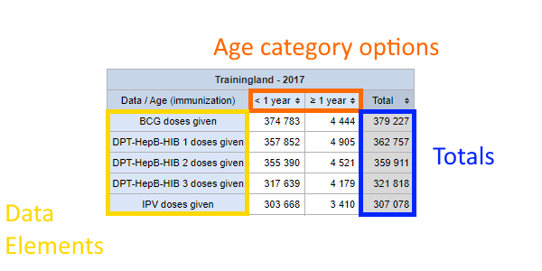

### Vaccinations - women of childbearing age

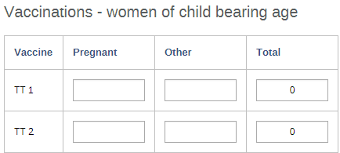

*Note: this is not the full table. Please review the full table in DHIS2.

*   This section has been configured using a disaggregation for pregnant women (Pregnant, Other).
*   By applying a disaggregated structure, this reduces the data elements within this section from 10 to 5.
*   In analysis, this allows us to quickly add in the breakdown of pregnancy status and pivot them as required. We can also see that the totals are quite useful to determine the total number of vaccine doses administered for a particular vaccine.

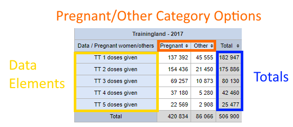

### Adverse Events Following Immunisation

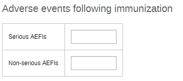

*   This section has been configured as individual data elements. No disaggregations are required here.

### Stock

*Note: this is not the full table. Please review the full table in DHIS2.

*   A “flat” structure has been applied to the stock section (ie. no disaggregations have been applied, this section consists solely of individual data elements).
*   This type of structure is required as the “used” column = `(starting balance + received) -  (VVM + frozen + expired + broken + missing + ending balance)`
*   Using two separate category options (ie. starting balance, received/VVM, frozen, expired, broken, missing, ending balance) would also not be appropriate given that a number of these options do not apply to several of the data elements within this section. It was therefore decided that applying different structures to thematically linked data elements was not the most effective approach.
*   While using this type of structure increases the number of data elements significantly, using a category option combination that would add up all of these items would not work within this structure, given that a total does not provide you with any meaningful information when reviewing the “used” column. 

### Cold Chain

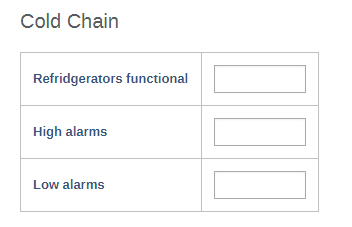

*   This section has been configured as individual data elements. No disaggregations are required here.

## Validation Rules

### Vaccinations

The immunisation program uses a set of validation rules that combine data from three sections within the data set for vaccinations:

1. Vaccinations
    a. Children
    b. Women of childbearing age
2. Stock

The validation rule is essentially the same across the various vaccines that are administered: 

_Vaccine doses given <= Vaccine doses used and wasted_

Let us apply this rule using BCG as an example.

1. Vaccine doses given = BCG doses given < 1 year + BCG doses given ≥ 1 year
2. Vaccine doses used and wasted = `(BCG starting balance + BCG received) - (BCG VVM + BCG frozen + BCG expired + BCG broken + BCG missing + BCG ending balance)`

The vaccine doses given is taken from the _Vaccinations - children section_

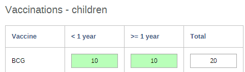

The vaccine doses used and wasted is taken from the _Stock_ section

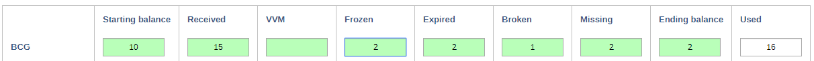

In this case, if we run validation, we will have a violation

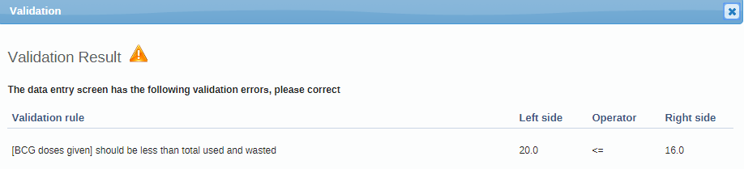

Essentially, we can not administer more vaccines than we have access to. Here, we started with 25 vaccines (starting balance = 10, received = 15) and wasted 9 vaccines. We only have 16 vaccines within the facility we can administer based on this information, and therefore we see a violation when we enter 20 as the total number of BCG vaccinations administered.

If we started with more stock, then we no longer have this problem and the validation would pass. 

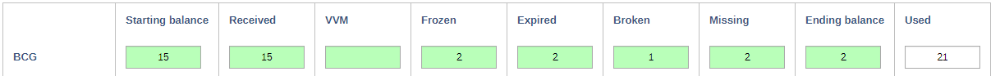

This same type of logic is applied to all of the vaccinations within both the _Vaccinations - children_ and _Vaccinations - women of childbearing age_ sections.

### Consumables

For consumables (items including safety boxes, ADS, etc.) validation rules are applied directly within the stock section. 

_Consumable waste <= consumption_

We can apply this rule using safety boxes as an example.

1. Consumable waste = `(Safety boxes missing + Safety boxes broken)`
2. Consumable consumption = `(Safety boxes starting balance + Safety boxes received) - Safety boxes ending balance`

The logic used here is simpler to understand compared to the validation rules used for the vaccinations. These rules ensure that we have not used more of the consumable than is available within the facility.

## Immunisation Outputs

The immunisation outputs included in the aggregate package include:

*   Indicators
*   Analytical outputs
    *   Charts
    *   Pivot Tables 
    *   Maps
*   Dashboards
    *   Immunisation
    *   Immunisation maps

A detailed overview of these items, including their names and descriptions, can be found in the _[Immunisation metadata reference](https://docs.dhis2.org/master/en)_ guide.
