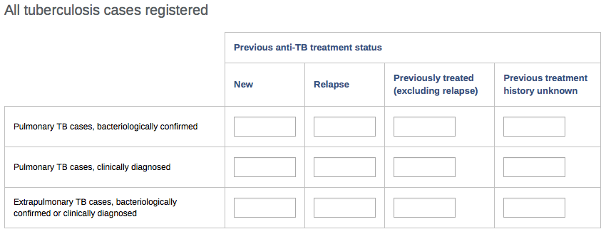
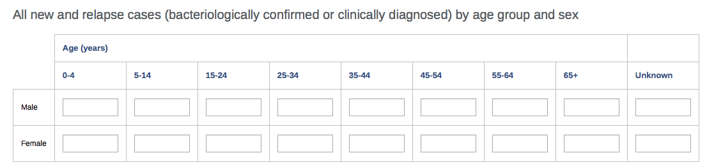
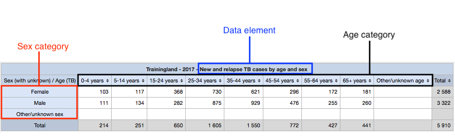
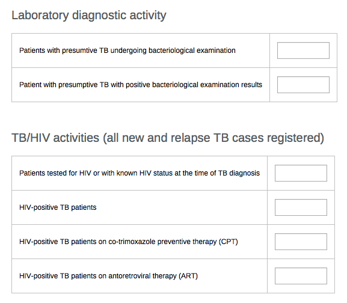
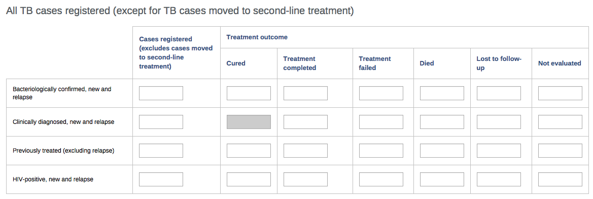
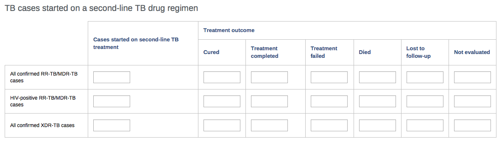
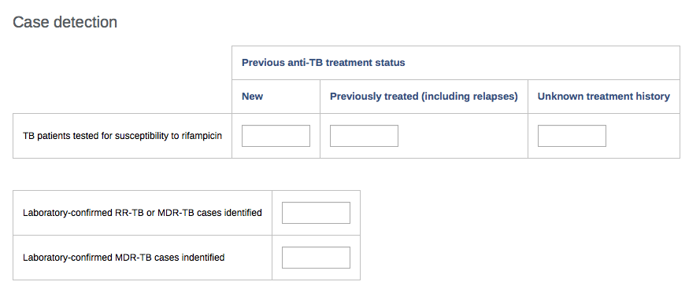
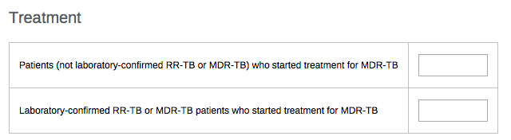

# TB aggregate system design

## Introduction

This document describes the system design for the TB configuration package for aggregate reporting, focusing on how the data collection part of the configuration has been designed in DHIS2 (i.e. data sets and data elements).

## Overview

The TB configuration package for aggregate reporting is based on the WHO [Definitions and reporting framework for tuberculosis](http://apps.who.int/iris/bitstream/10665/79199/1/9789241505345_eng.pdf). It contains a total of 7 data sets, as described in table 1.

|Name|Periodicity|Purpose|
|:--|:--|:--|
|TB case registration|Quarterly|Reporting of new cases of TB (notifications)|
|TB treatment outcomes|Quarterly|Reporting of treatment outcomes of first line treatment|
|TB treatment outcomes - second line|Yearly|Reporting of treatment outcomes of second line treatment|
|RR/MDR-TB case detection and treatment|Yearly|Reporting of new cases of drug-reistant TB|
|**[old records only]** TB case registration by smear results|Quarterly|Reporting of new cases of TB (notifications), based on the 2006 reporting framework|
|**[old records only]** TB treatment outcomes - by smear results|Quarterly|Reporting of treatment outcomes of first line treatment, based on the 2006 reporting framework|
|**[old records only]** TB treatment outcomes - second line|Yearly|Reporting of treatment outcomes of second line treatment, based on the 2006 reporting framework|

As the name implies, the last 3 of the data sets show in the above table are only included for the purpose of keeping historical data according to the previous reporting guidelines. This is important because the tuberculosis epidemiology changes relatively slowly, and analysis of TB data requires looking at multi-year trend. Where possible, the same data elements have been used for the new and old forms. Indicators included the configuration package are linked to data elements from both current and old forms, to make it possible to compare data collected using the two different frameworks.

**Note:** These **[old records only]** data set should **not** be used for prospective data entry.

## Data set structure and design

This section will for each data set present the main sections (tables) of the data sets (reporting forms), explaining how and why they have been configured.

The **[old records only]** will not be described in detail as they are relatively close to the current forms, except for the age disaggregation of the case registration form.

### TB case registration

#### Case registration

The case registration table has been set up as 12 individual data elements. This table could conceivable also have been set up as three data elements with “Previous anti-TB treatment staus” as a data element category. There are a few reasons why a “flat” structure with individual data elements was chosen:

*   As noted above, it has been important to have a structure for the TB configuration package that allows comparisons with the previous reporting framework. Using a flat structure allow certain fields (data elements) in this section to be reused in the previous version of the case registration form.
*   Analysis of this data is often done on specific combinations of these rows and columns, which have been defined as indicators. Using a category for treatment status would make it easier to replicate the above table “as-is”, but this seems less relevant. If necessary, this could be re-created using data element group sets.
*   A “previous anti-TB treatment status” category would only apply to 3 data elements. While including a similar concept/classification of previous treatment, both the data set for drug resistant TB and the previous reporting framework is structured differently so that the cateogry could not be used there.

#### Case registration by age and sex

This section/table has been configured as a single data element, with an “age and sex” category combination. Even though the age category only applies to a single data element, this allows maximum flexibility in the analysis tools, as shown in the example below:

#### Data validation

A validation rule has been configured that checks the number of new and relapse cases reported in the “Case registration” to the number reported by age and sex.

### Lab activity and TB/HIV

These two sections/tables have been configured as individual data elements. 

#### Data validation

Validation rules have been configured for these checks:

*   Lab examinations done ≥ positive results
*   HIV status known ≥ status positive
*   HIV status positive ≥ CPT/ART

### TB treatment outcomes

#### Treatment outcomes

The treatment outcomes table (which applies to first line treatment only) is categorised by the type of TB case (bacteriological confirmed, clinical, previously treated, HIV positive). For each category of patient, the table includes the number of cases registered (i.e. the treatment cohort) and the treatment outcome. Each category of patients is configured in DHIS2 as one data element for the cases registered/cohort, and one for treatment outcomes. The treatment outcome data elements have a “TB treatment outcome” category with each of the 6 treatment outcomes. 

First of all, it is clear that having **one** data element for each category of TB case would not make sense, as it would include both the cohort and the number of reported outcomes, i.e. the total of the category would not make sense, which is the general rule. However, the table _could_ have been set up with each field being an individual data element. The reason why a category was chosen includes:

*   The general recommendations for categories is that the sum of all options should make sense, as it is the total that is showed by default in the reporting tools. While the total in this case might not be particularly useful (it is essentially the total number of evaluated outcomes), it is a meaningful number. For comparison, a common example of a category that most often does not make sense is “cases and deaths”. 
*   When including current and old forms, first and second line, the treatment outcome category applies to 13 case categories. Using a category thus helps reduce the number of data elements from 78 to 13.
*   Using a category maximises the flexibility when analysing the treatment outcome data. For example, the total number of outcomes with “treatment success” (which is defined as the sum of “cured” and “treatment completed”) can be shown simply by setting up a filter with two category options.

#### Data validation

Validation rules have been set up verifying that the size of the cohort (cases registered) is the same as the number of treatment outcomes reported.

#### TB/HIV

The TB/HIV section/table of the treatment outcomes data set closely resembles the TB/HIV section of the case registration form. It is included because often the HIV status of a significant proportion of cases may not yet be known at the time the quarterly notification report is compiled. The TB/HIV section of the treatment outcomes report enables collection of the complete information about HIV status. It has the similar variables related to HIV status, but uses separate data elements with a “(by time of outcome)” postfix to separate them. The same validation rules apply here as on the TB/HIV table in the Case registration dataset.

### TB treatment outcomes - second line

#### Treatment outcomes 

The treatment outcomes for cases on second-line regimen has been configured in the same way as described above, and with the same validation rules.

### RR/MDR-TB case detection and treatment

#### Case detection

The case detection section/table is configured with individual data elements.

#### Data validation

A data validation rule checks that the number RR-TB or MDR-TB cases is more than the number of MDR-TB cases only.

#### Treatment

The treatment section/table is configured with individual data elements.

### [old records only] TB case registration by smear results

#### Cases by sex and age (legacy)

  

The [old records only] data sets are not discussed in detail, but the “cases by sex and age” section/table deserves a special comment. The previous TB reporting framework (2006 version) allowed some variations in how notifications where disaggregated by age. Consequently, different countries use a few different age disaggregations. Because the TB configuration package is designed to be used in different countries/contexts, the “cases by sex and age” section uses a sex category that includes “unknown sex”, and an age category that includes a few different, overlapping age options. For example, it includes both 0-4 years, 5-14 years _and_ 0-14 years. This is in general **not** a recommended approach as 1) the category total does not make sense, and 2) there is a risk for double counting if all age brackets are used. However, this was done here for the following reasons:

*   It is only used for the historical data, which is not intended to be typed in manually (and if typed manually
*   Since it is designed for use with already existing data, there should not be any case where data exists for any of the overlapping
*   Including only one set of age options and leaving it to each country to add the once they need could work, but would require updates to indicator formulas as new category option combos would be generated.
*   Individual category options can be re-used, both the current and the old frameworks. When using category option groups, it is possible to define age disaggregations that work over time even as the reported age brackets change.
*   Quite a large number of countries have saved their historical data in a global DHIS2 database maintained by the WHO GTB, where this category is used (for the above reasons). If a different category was used for the historical data in the TB configuration package, moving this data into the national DHIS2 database would be more complicated.
