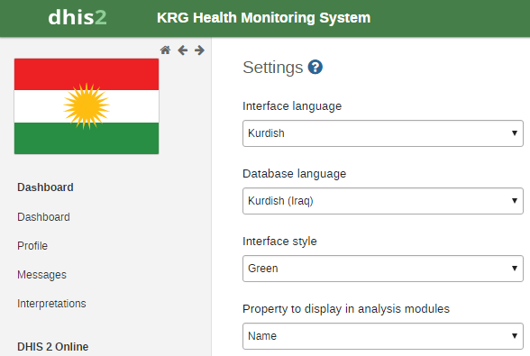
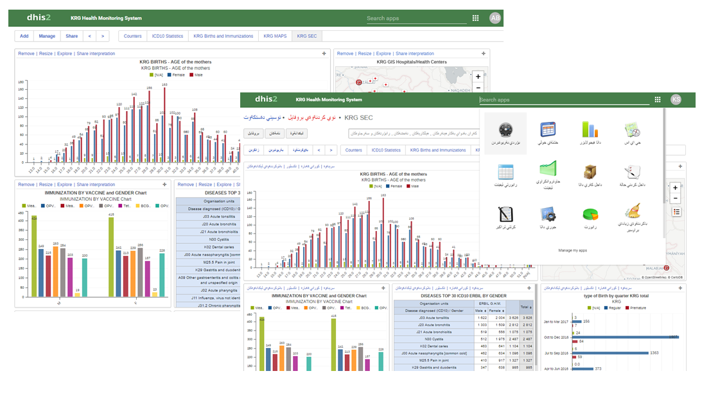
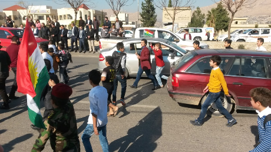
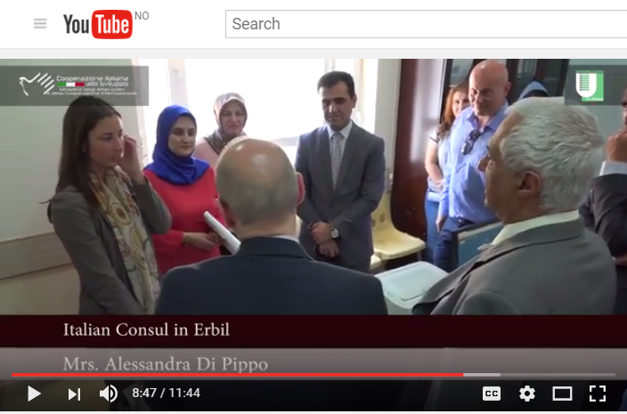

# DHIS2 in the Autonomous Region of Kurdistan, Iraq

<!--DHIS2-SECTION-ID:user_story_kurdistan-->

*For the citizens of war-torn Iraq, as well as for the hundreds of
thousands of refugees stranded in camps and sheltered by the Autonomous
Region of Kurdistan, getting access to regular health care is not a
straightforward procedure.*

*Refugee camp in Iraqi Kurdistan © IPRO, Oct. 2016*

## <!-- {-} -->

**In June 2015, a DHIS2 Health Information System** was set up to assist
the Kurdish health authorities in collecting population data and
improving the access and quality of public health care.

## <!-- {-} -->

A KRG-DHIS2 pilot project, funded by the Italian Ministry of Foreign
Affairs and International Cooperation, led by the [University of Rome
Tor Vergata](http://web.uniroma2.it/home/newlang/english) in cooperation
with the Ministry of Health of the Kurdistan Regional Government, and
realized by [I-PRO](http://www.informapro.it/) and [EuResist
Network](http://www.euresist.org/) was deployed across a set of pilot
health centers and hospitals in the Kurdish governorates of Duhok, Erbil
and Slemani.

**With 60 registered users spread across 30 health centers**, **700
Kurdish medical professionals** can now follow a staggering **180,000
health events**\! Indeed, just 18 months into the pilot project, there
are now 7 primary/family health centers, 9 hospitals, and 14 general
health centers. There are currently 10 health centers in rural areas
such as small towns or villages, and there are 20 health centers in
major towns.

**Since January 2017, 110,000 cases** have been imported via periodic
uploads from existing and running databases, and 70,000 cases have been
recorded by DHIS2 users. This great progress is enabling health
professionals to gather statistics for disease diagnoses, hospital
discharges, and registrations of births, deaths and immunizations.

**The project is also using the WHO’s International Classification of
Diseases** ([WHO ICD-10](http://www.who.int/classifications/icd/en/)),
which is the standard diagnostic tool for epidemiology, health
management and research purposes. This classification defines the
universe of diseases, disorders, injuries and other related health
conditions, listed in a comprehensive, hierarchical way. The data can
be:

  - Easily stored, retrieved and analysed for evidenced-based
    decision-making;

  - Used for sharing and comparing health information between hospitals,
    regions, settings and countries;

  - Making data comparisons in the same location across different time
    periods.

## Key implementation challenges

With a small time frame to get a DHIS2 epidemiological surveillance
pilot project implemented and deployed in the whole Kurdish region of
Iraq, many challenges are ahead for the teams involved.

**Racing against the clock.** The first challenge lies in building a
solution that works in a short time and satisfies the basic needs of the
regional health system in collecting data. So far, a subset of the
regional health centers, approximately 30 establishments, made up of
rural and urban centers, family health centers, hospitals, hospital
colleges, and general health centers have been involved in testing the
system.

**Pulling in data from other systems.** Another challenge lies in making
it possible to import existing data from hospitals into DHIS2 while also
making it achievable to enter data from mobile devices. Additional
challenges lie in preparing reports equal to those requested by the
health authorities, and building a DHIS2 system for people who don’t
necessarily have a background in health.

**Testing using a small, live version of DHIS2.** The testing phase
covered two areas: creating data sets with aggregate data entry and
making programs with disaggregate event data capture. After analyzing
the data reports produced by the tests, the project managers decided to
use programs without registration using the Event Capture app.

**Capturing data with the Event Capture app.** In this region of Iraq,
people do not have identification numbers. It's therefore almost
impossible to follow patients' visits to different health centers.
Bearing this in mind, the team built a system to record basic health
events such as births, deaths, immunizations, disease diagnoses and
hospital discharges using the Event Capture app.

**Why the Event Capture app?** On the one hand, this app allows you to
import existing data from hospital databases, while adhering to the same
data structure. On the other hand, physicians or health technicians can
enter data in real-time during a visit, without having to complete
further data aggregation tasks. These two key areas combined were very
helpful to our teams.

**Hosting.** Without the means to implement a dedicated server, we chose
to use an outsourced hosting solution through a recommended company
called [BAO Systems](https://baosystems.com/). With this solution, it
will be possible to scale up the DHIS2 instance in the future.

**Translating the UI into Kurdish-Sorani.** With the help of the DHIS2
community, DHIS2 developers and a translation team, the DHIS2 user
interface is now available in Kurdish-Sorani, a language spoken by 6
million people in Iraq.

Some parts of the data model do not have translations. For example, the
description of report dates were added in English, Arabic and
Kurdish-Sorani consecutively: Date of birth / تاريخ الولادة / بةرواري لة
دايك بوون. Another problem is the lack of **ISO 639-3 ckb**, or the
Kurdish-Sorani language, in the underlying Java library.

The screen captures here show the DHIS2-KRG Health Monitoring System
user interface in both English and Kurdish-Sorani:

## What's ahead?

**Creating national health numbers for all citizens of the Autonomous
Region of Iraqi Kurdistan.** The first focus for the upcoming years is
to introduce a national health identity (HNID) for each citizen
accessing health services provided by the hospitals and health centers
monitored by and coordinated with the MOH of the KRG. Once this is in
place, the HNID will be integrated into the Kurdish DHIS2 platform.

**Expanding the system for a complete coverage of the Autonomous Region
of Kurdistan.** The second major goal set for 2021 is to involve at
least 300 health centers in the KRG-DHIS2 platform, in order to reach a
complete coverage of the territory.

**Setting up a high-quality epidemiological health surveillance system
in the Autonomous Region of Kurdistan.** While achieving this goal, the
teams hope to extend their DHIS2 expertise to other areas besides
health, such as programs of demographic or environmental interest.

## In the news

If you'd like to view a presentation of the DHIS2-KRG project to the
Kurdish government and Italian Ministry of foreign Affairs, here’s a
recent
[video](https://www.youtube.com/watch?v=-jIOUJkVGJw&amp;feature=em-uploademail).

*Kurdistan Region, DHIS2 Health Monitoring System, © IPRO Research, Oct.
2016*

## Handy resources

  - Find out more about KRG-DHIS2 on the [project web
    page](http://www.informapro.it/krg-dhis.html).

  - Read the KRG-DHIS2 HMS documentation:
    
      - [User
        Manual](https://krg-dhis.ipro-it.eu/api/documents/b8Uobi3Hqri/data),
        version February 2016.
    
      - [How
        To](https://krg-dhis.ipro-it.eu/api/documents/tLCQli1uX2K/data)
        documentation.

  - KRG-DHIS2 [playlist on
    YouTube](https://www.youtube.com/playlist?list=PLwRF39H2QHFbx2WzDfxFPSjxwpmcN6ERZ)

## Contact us\!

We're very keen to give feedback about the progress we're making with
our KRG-DHIS2 project. If you’d like to ask us questions about our work,
please reach out to us as follows:

<table>
<colgroup>
<col style="width: 50%" />
<col style="width: 50%" />
</colgroup>
<thead>
<tr class="header">
<th>Title</th>
<th>Contact details</th>
</tr>
</thead>
<tbody>
<tr class="odd">
<td>Mr. Leonardo Emberti Gialloreti

Project leader and medical supervisor
</td>
<td><a href="mailto:leonardo.emberti.gialloreti@uniroma2.it">leonardo.emberti.gialloreti@uniroma2.it</a>

University of Tor Vergata, Rome, Italy
</td>
</tr>
<tr class="even">
<td>Mr. Dario Corsini

Project management and team coordinator
</td>
<td><a href="mailto:dario.corsini@informa.pro">dario.corsini@informa.pro</a>

IPRO – Informapro, Rome, Italy
</td>
</tr>
<tr class="odd">
<td>Ms. Antonia Bezenchek

IT management, DHIS2 implementation, translation, IT support
</td>
<td><a href="mailto:antonia.bezenchek@informa.pro">antonia.bezenchek@informa.pro</a>

IPRO – Informapro, Rome, Italy
</td>
</tr>
<tr class="even">
<td>Mr. Iuri Fanti

DHIS2 implementation and statistics
</td>
<td><a href="mailto:iuri.fanti@informa.pro">iuri.fanti@informa.pro</a>

IPRO - Informapro, Rome, Italy
</td>
</tr>
<tr class="odd">
<td>Mr. Faiq Basa

Kurdish local management and medical supervision
</td>
<td><a href="mailto:faiqbasa@yahoo.com">faiqbasa@yahoo.com</a></td>
</tr>
<tr class="even">
<td>Mr. Revan Khorany

Kurdish local management, DHIS2 implementation and translation
</td>
<td><a href="mailto:revan.khorany@informa.pro">revan.khorany@informa.pro</a></td>
</tr>
<tr class="odd">
<td>Ms. Francesca Incadona

International relations and documentation
</td>
<td><a href="mailto:francesca.incardona@informa.pro">francesca.incardona@informa.pro</a>

Euresist Network GEIE, Rome, Italy
</td>
</tr>
<tr class="even">
<td>Mr. Vincenzo Jorio

International and government relations
</td>
<td><a href="mailto:marco.jorio@informa.pro">marco.jorio@informa.pro</a>

Ital Consult, Rome, Italy
</td>
</tr>
</tbody>
</table>

*Opening a DHIS2 training center in KRG. © IPRO 2016.*

