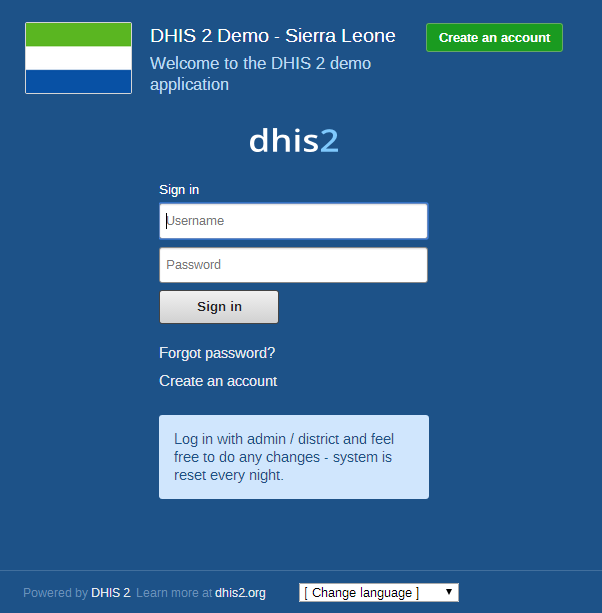

# About demo server, live package and database design

<!--DHIS2-SECTION-ID:moare_about_dhis2_server_database-->

## Using the DHIS2 demo server

The DHIS2 team maintains a demonstration server at
<https://play.dhis2.org/demo>. This is by far the easiest way to try out
DHIS2. Simply open the link in your web browser and login with username
= admin and password = district.

> **Note**
>
> All changes on this server are deleted each night, so do not save any
> important work on this server. It is strictly for demonstration
> purposes on only\!

## Using the DHIS2 live package

<!--DHIS2-SECTION-ID:mod2_1-->

### Starting the DHIS2 Live package

The DHIS2 Live package is the easiest way to get started with DHIS2 on
your local computer. DHIS2 Live is appropriate for a stand-alone
installation and demos. Simply download the application from
[here](http://www.dhis2.org/downloads). Once the file is downloaded, you
can simply double-click the downloaded file, and get started using
DHIS2.

#### Prerequisites for DHIS2 Live

You must be sure that you have a current version of the Java Runtime
installed on your machine. Depending on your operating system, there are
different ways of installing Java. The reader is referred to this
[website](http://java.sun.com/javase/downloads/index.jsp) for detailed
information on getting Java installed.

#### Starting up with a blank database

The live package comes with a demo database just like what you see on
the [online demo](http://apps.dhis2.org/demo/) (which is based on the
national Sierra Leone HMIS), and if you want to start with a blank
system/database and build up your own system then you need to do the
following:

1\) Stop DHIS2 live if it is already running. Right click on the tray
icon and select Exit. The tray icon is the green symbol on the bottom
right of your screen (on Windows) which should say' DHIS2 Server
running' when you hover your mouse pointer over the icon.

2\) Open the folder where the DHIS2 live package is installed and locate
the folder called "conf".

3\) In conf/ open the file called 'hibernate.properties' in a text
editor (notepad or similar) and do the following modification: locate
the string 'jdbc:h2:./database/dhis2' and replace the 'dhis2' part with
any name that you want to give to your database (e.g. dhis2\_test).

4\) Save and close the hibernate.properties file.

5\) Start DHIS2 Live by double-clicking on the file dhis2-live.exe in
the DHIS2 Live installation folder or by using a desktop shortcut or
menu link that you might have set up.

6\) Wait for the browser window to open and the login screen to show,
and then log in with username: admin and password: district

7\) Now you will see a completely empty DHIS2 system and you should
start by adding your users, organisational hierarchy, data elements, and
datasets etc. Please refer to the other sections of the user manual for
instructions on how to do this.

### Downloading and installing the server version

The latest stable server version can be downloaded from this
[website](http://stable.dhis2.org/). For detailed information on how to
install it please refer to the installation chapter in the
implementation manual.

## Logging on to DHIS2

<!--DHIS2-SECTION-ID:mod2_2-->

Regardless of whether you have installed the server version or the
desktop Live version, you will use a web-browser to log on to the
application. DHIS2 should be compatible with most modern web-browsers,
although you will need to ensure that Java Script is enabled.

To log on to the application just enter <http://localhost:8080/dhis> if
you are using the DHIS2 live package, or replace `localhost` with the
name or IP address of the server where the server version is installed.

Once you have started DHIS2, either on-line or off-line, the displayed
screen will prompt you to enter your registered user-name and password.
After entering the required information click on log-in button to log
into the application. The default user name and password are 'admin' and
'district'. They should be changed immediately upon logging on the first
time.

You can select the language which you wish to display DHIS2 in from the
"Change language" dialog box at the bottom of the screen. Not all
languages may be available.

Should you have forgotten your password, you can click on the "Forgot
password?" link. You must have informed DHIS2 of your email address and
the server must be properly configured to send emails.

If you want to create your own account (and the server administrator
allows this), simply click "Create an account" and follow the directions
provided.

Once you have logged into DHIS2, refer to the specific sections in this
manual for the different functionality which is available.

## Logging out of DHIS2

<!--DHIS2-SECTION-ID:mod2_4-->

Just click on the Profile and the click "Log out" the top-right corner
of the DHIS2 menu.

## Quick intro to designing a DHIS2 database

<!--DHIS2-SECTION-ID:database_design-->

DHIS2 provides a powerful set of tools for data collection, validation,
reporting and analysis, but the contents of the database, e.g. what to
collect, who should collect it and on what format will depend on the
context of use. However, in order to do anything with DHIS2, you must
first create meta-data. Meta-data, or data about the data, describes
what should be collected (data elements and categories), where it should
be collected (organisation units) and how frequently it should be
collected (periods). This meta-data needs to be created in the DHIS2
database before it can be used. This can be done through the user
interface and requires no programming or in-depth technical skills of
the software, but does require a good understanding of the processes
which you are trying to collect data form.

This section will provide a very quick and brief introduction to DHIS2
database design and mainly explain the various steps needed to prepare a
new DHIS2 system for use. How to do each step is explained in other
chapters, and best practices on design choices will be explained in the
implementers manual. Here are the steps to follow:

1\. Set up an organisational hierarchy

2\. Define data elements

3\. Define data sets and data entry forms

4\. Define validation rules

5\. Define indicators

6\. Define report tables and design reports

7\. Set up the GIS module

8\. Design charts and customise the dashboard

### The organisational hierarchy

The organisational hierarchy defines the organisation using the DHIS2,
the health facilities, administrative areas and other geographical areas
used in data collection and data analysis. This dimension to the data is
defined as a hierarchy with one root unit (e.g. Ministry of Health) and
any number of levels and nodes below. Each node in this hierarchy is
called an organisational unit in DHIS2.

The design of this hierarchy will determine the geographical units of
analysis available to the users as data is collected and aggregated in
this structure. There can only be one organisational hierarchy at the
same time so its structure needs careful consideration. Additional
hierarchies (e.g. parallel administrative groupings such as "Facility
ownership") can be modelled using organisational groups and group sets,
however the organisational hierarchy is the main vehicle for data
aggregation on the geographical dimension. Typically national
organisational hierarchies in public health have 4-6 levels, but any
number of levels is supported. The hierarchy is built up of parent-child
relations, e.g. a Country or MoH unit (the root) might have e.g. 8
parent units (provinces), and each province again ( at level 2) might
have 10-15 districts as their children. Normally the health facilities
will be located at the lowest level, but they can also be located at
higher levels, e.g. national or provincial hospitals, so skewed
organisational trees are supported (e.g. a leaf node can be positioned
at level 2 while most other leaf nodes are at level 5).

Typically there is a geographical hierarchy defined by the health
system. e.g. where the administrative offices are located (e.g. MoH,
province, district), but often there are other administrative boundaries
in the country that might or might not be added, depending on how its
boundaries will improve data analysis. When designing the hierarchy the
number of children for any organisational unit may indicate the
usefulness of the structure, e.g. having one or more 1-1 relationships
between two levels is not very useful as the values will be the same for
the child and the parent level. On the other extreme a very high number
of children in the middle of the hierarchy (e.g. 50 districts in a
province) might call for an extra level to be added in between to
increase the usefulness of data analysis. The lowest level, the health
facilities will often have a large number of children (10-60), but for
other levels higher up in the hierarchy approx. 5-20 children is
recommended. Too few or too many children might indicate that a level
should be removed or added.

Note that it is quite easy to make changes to the upper levels of the
hierarchy at a later stage, the only problem is changing organisational
units that collect data (the leaf nodes), e.g. splitting or merging
health facilities. Aggregation up the hierarchy is done based on the
current hierarchy at any time and will always reflect the most recent
changes to the organisational structure. Refer to the chapter on
Organisation Units to learn how to create organisational units and to
build up the hierarchy.

### Data Elements

The Data Element is perhaps the most important building block of a DHIS2
database. It represents the "WHAT" dimension, it explains what is being
collected or analysed. In some contexts this is referred to an
indicator, but in DHIS2 we call this unit of collection and analysis a
*data element*. The data element often represents a count of something,
and its name describes what is being counted, e.g. "BCG doses given" or
"Malaria cases". When data is collected, validated, analysed, reported
or presented it is the data elements or expressions built upon data
elements that describes the WHAT of the data. As such the data elements
become important for all aspects of the system and they decide not only
how data is collected, but more importantly how the data values are
represented in the database, which again decides how data can be
analysed and presented.

It is possible to add more details to this "WHAT" dimension through the
disaggregation dimension called data element categories. Some common
categories are Age and Gender, but any category can be added by the user
and linked to specific data elements. The combination of a data
element's name and its assigned category defines the smallest unit of
collection and analysis available in the system, and hence describes the
raw data in the database. Aggregations can be done when zooming out of
this dimension, but no further drill-down is possible, so designing data
elements and categories define the detail of the analysis available to
the system (on the WHAT dimension). Changes to data elements and
categories at a later stage in the process might be complicated as these
will change the meaning of the data values already captured in the
database (if any). So this step is one of the more decisive and careful
steps in the database design process.

One best practice when designing data elements is to think of data
elements as a unit of data analysis and not just as a field in the data
collection form. Each data element lives on its own in the database,
completely detached from the collection form, and reports and other
outputs are based on data elements and expressions/formulas composed of
data elements and not the data collection forms. So the data analysis
needs should drive the process, and not the look an feel of the data
collection forms. A simple rule of thumb is that the name of the data
element must be able to stand on its own and describe the data value
also outside the context of its collection form. E.g. a data element
name like "Total referrals" makes sense when looking at it in either the
"RCH" form or the "OPD" form, but on its own it does not uniquely
describe the phenomena (who are being referred?), and should in stead be
called "Total referrals from Maternity" or "Total referrals from OPD".
Two different data elements with different meanings, although the field
on the paper form might only say "Total referrals" since the user of the
form will always know where these referrals come from. In a database or
a repository of data elements this context is no longer valid and
therefore the names of the data elements become so important in
describing the data.

Common properties of data elements can be modelled through what is
called data element groups. The groups are completely flexible in the
sense that they are defined by the user, both their names and their
memberships. Groups are useful both for browsing and presenting related
data, but can also be used to aggregate data elements together. Groups
are loosely coupled to data elements and not tied directly to the data
values which means they can be modified and added at any point in time
without interfering with the raw data.

### Datasets and data entry forms

All data entry in DHIS2 is organised through the use of Datasets. A
Dataset is a collection of data elements grouped together for data
collection, and in the case of distributed installs they also define
chunks of data for export and import between instances of DHIS2 (e.g.
from a district office local installation to a national server).
Datasets are not linked directly to the data values, only through their
data elements and frequencies, and as such a dataset can be modified,
deleted or added at any point in time without affecting the raw data
already captured in the system, but such changes will of course affect
how new data will be collected.

A dataset has a period type which controls the data collection
frequency, which can be daily, weekly, monthly, quarterly, six-monthly,
or yearly. Both which data elements to include in the dataset and the
period type is defined by the user, together with a name, short name,
and code.

In order to use a dataset to collect data for a specific orgunit you
must assign the orgunit to the dataset, and this mechanism controls
which orgunits that can use which datasets, and at the same time defines
the target values for data completeness (e.g. how many health facilities
in a district expected to submit RCH data every month).

A data element can belong to multiple datasets, but this requires
careful thinking as it may lead to overlapping and inconstant data being
collected if e.g. the datasets are given different frequencies and are
used by the same orgunits.

#### Data entry forms

Once you have assigned a dataset to an orgunit that dataset will be made
available in Data Entry (under Services) for the orgunits you have
assigned it to and for the valid periods according to the dataset's
period type. A default data entry form will then be shown, which is
simply a list of the data elements belonging to the dataset together
with a column for inputting the values. If your dataset contains data
elements with categories such as age groups or gender, then additional
columns will be automatically generated in the default form based on the
categories. In addition to the default list-based data entry form there
are two more alternatives, the section-based form and the custom form.

##### Section forms

Section forms allow for a bit more flexibility when it comes to using
tabular forms and are quick and simple to design. Often your data entry
form will need multiple tables with subheadings, and sometimes you need
to disable (grey out) a few fields in the table (e.g. some categories do
not apply to all data elements), both of these functions are supported
in section forms. After defining a dataset you can define it's sections
with subsets of data elements, a heading and possible grey fields i the
section's table. The order of sections in a dataset can also be defined.
In Data Entry you can now start using the Section form (should appear
automatically when sections are available for the selected dataset). You
can switch between default and section forms in the top right corner of
the data entry screen. Most tabular data entry forms should be possible
to do with sections forms, and the more you can utilise the section
forms (or default forms) the easier it is for you. If these two types of
forms are not meeting your requirements then the third option is the
completely flexible, although more time-consuming, custom data entry
forms.

##### Custom Forms

When the form you want to design is too complicated for the default or
section forms then your last option is to use a custom form. This takes
more time, but gives you full flexibility in term of the design. In
DHIS2 there is a built in HTML editor (FcK Editor) for the form designer
and you can either design the form in the UI or paste in your HTML
directly using the Source window in the editor. In the custom form you
can insert static text or data fields (linked to data elements +
category) in any position on the form and you have complete freedom to
design the layout of the form. Once a custom form has been added to a
dataset it will be available in data entry and used automatically. You
can switch back to default and section (if exists) forms in the top
right corner of the data entry screen.

### Validation rules

Once you have set up the data entry part of the system and started to
collect data then there is time to define data quality checks that help
to improve the quality of the data being collected. You can add as many
validation rules as you like and these are composed of left and right
side expressions that again are composed of data elements, with an
operator between the two sides. Typical rules are comparing subtotals to
totals of something. E.g. if you have two data elements "HIV tests
taken" and "HIV test result positive" then you know that in the same
form (for the same period and organisational unit) the total number of
tests must always be equal or higher than the number of positive tests.
These rules should be absolute rules meaning that they are
mathematically correct and not just assumptions or "most of the time
correct". The rules can be run in data entry, after filling each form,
or as a more batch like process on multiple forms at the same time, e.g.
for all facilities for the previous reporting month. The results of the
tests will list all violations and the detailed values for each side of
the expression where the violation occurred to make it easy to go back
to data entry and correct the values.

### Indicators

Indicators represent perhaps the most powerful data analysis feature of
the DHIS2. While data elements represent the raw data (counts) being
collected the indicators represent formulas providing coverage rates,
incidence rates, ratios and other formula-based units of analysis. An
indicator is made up of a factor (e.g. 1, 100, 100, 100 000), a
numerator and a denominator, the two latter are both expressions based
on one or more data elements. E.g. the indicator "BCG coverage \<1 year"
is defined a formula with a factor 100, a numerator ("BCG doses given to
children under 1 year") and a denominator ("Target population under 1
year"). The indicator "DPT1 to DPT3 drop out rate" is a formula of 100 %
x ("DPT1 doses given"- "DPT3 doses given") / ("DPT1 doses given").

Most report modules in DHIS2 support both data elements and indicators
and you can also combine these in custom reports, but the important
difference and strength of indicators versus raw data (data element's
data values) is the ability to compare data across different
geographical areas (e.g. highly populated vs rural areas) as the target
population can be used in the denominator.

Indicators can be added, modified and deleted at any point in time
without interfering with the data values in the database.

### Report tables and reports

Standard reports in DHIS2 are a very flexible way of presenting the data
that has been collected. Data can be aggregated by any organisational
unit or orgunit level, by data element, by indicators, as well as over
time (e.g. monthly, quarterly, yearly). The report tables are custom
data sources for the standard reports and can be flexibly defined in the
user interface and later accessed in external report designers such as
iReport or through custom HTML reports. These report designs can then be
set up as easily accessible one-click reports with parameters so that
the users can run the same reports e.g. every month when new data is
entered, and also be relevant to users at all levels as the
organisational unit can be selected at the time of running the report.

### GIS

In the integrated GIS module you can easily display your data on maps,
both on polygons (areas) and as points (health facilities), and either
as data elements or indicators. By providing the coordinates of your
organisational units to the system you can quickly get up to speed with
this module. See the GIS section for details on how to get started.

### Charts and dashboard

On of the easiest way to display your indicator data is through charts.
An easy to use chart dialogue will guide you through the creation of
various types of charts with data on indicators, organisational units
and periods of your choice. These charts can easily be added to one of
the four chart sections on your dashboard and there be made easily
available right after log in. Make sure to set the dashboard module as
the start module in user settings.
