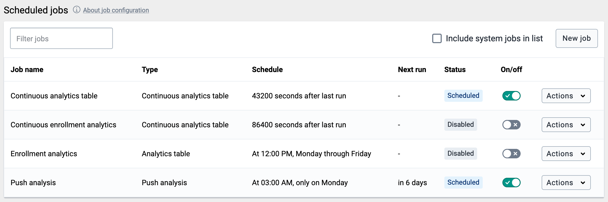

# Data Administration

<!--DHIS2-SECTION-ID:data_admin-->

The data administration module provides a range of functions to ensure
that the data stored in the DHIS2 database is integral and that the
database performance is optimised. These functions should be executed on
a regular basis by a data administrator to ensure that the quality of
the data stored is optimal.

## Data integrity

<!--DHIS2-SECTION-ID:dataAdmin_dataIntegrity-->

DHIS2 can perform a wide range of data integrity checks on the data
contained in the database. Identifying and correcting data integrity
issues is extremely important for ensuring that the data used for
analysis purposes is valid. Each of the data integrity checks that are
performed by the system will be described, along with general procedures
that can be performed to resolve these issues.

### Data elements without data set

Each data element must be assigned to a data set. Values for data
elements will not be able to be entered into the system if a data
element is not assigned to a data set. Choose
Maintenance-\>Datasets-\>Edit from the main menu and then add the
"orphaned" data element to the appropriate data set.

### Data elements without groups

Some Data Elements have been allocated to several Data Element Groups.
This is currently not allowed, because it will result in duplication of
linked data records in the analytics record sets that provide aggregated
data. Go to Maintenance -\> Data Element Groups to review each Data
Element identified and remove the incorrect Group allocations.

### Data elements violating exclusive group sets

Some data elements have been allocated to several data element groups
that are members of the same data element group set. All group sets in
DHIS2 are defined as exclusive, which means that a data element can
*only* be allocated to *one* data element group within that group set.
Go to Maintenance -\> Data elements and indicators -\>Data element
groups to review each data element identified in the integrity check.
Either remove the data element from all groups except the one that it
should be allocated to, or see if one of the groups should be placed in
a different group set.

### Data elements in data set but not in form or sections

Data elements have been assigned to a data set, but have not been
assigned to any sections of the data set forms. All data sets which use
section forms, should generally have all data elements in the data set
assigned to exactly one section of the dataset.

### Data elements assigned to data sets with different period types

Data elements should not be assigned to two separate data sets whose
period types differ. The recommended approach would be to create two
separate data elements (for instance a monthly and yearly data element)
and assign these to respective datasets.

### Data sets not assigned to organisation units

All data sets should be assigned to at least one organisation unit.

### Sections with invalid category combinations

Data sets which use section forms should only have a single category
combination within each section. This violation could result from
assigning a data element to a section, but then changing the category
combination of this data element at a later point in time.

### Indicators with identical formulas

Although this rule will not affect data quality, it generally does not
make sense to have two indicators with the exact same definition. Review
the identified indicators and their formulas and delete or modify any
indicator that appears to be the duplicate.

### Indicators without groups

All data elements and indicators must be assigned to at least one group,
so these Indicators need to be allocated to their correct Data Element
and Indicator Group. From the main menu, go to Data elements/Indicators
-\> Indicator Groups, and allocate each of the \`Orphaned\` indicators
to its correct group.

### Invalid indicator numerators

Violations of this rule may be caused by an incorrect reference to a
deleted or modified data element. Review the indicator and make
corrections to the numerator definition.

### Invalid indicator denominators

Violations of this rule may be caused by an incorrect reference to a
deleted or modified data element. Review the indicator and make
corrections to the denominator definition.

### Indicators violating exclusive group sets

Some indicators have been allocated to several indicator groups that are
members of the same indicator group set. All group sets in DHIS2 are
defined as exclusive, which means that an indicator can *only* be
allocated to *one* indicator group within that group set. Go to
Maintenance -\> Data elements and indicators -\>Indicator groups to
review each indicator identified in the integrity check. Either remove
the indicator from all groups except the one that it should be allocated
to, or see if one of the groups should be placed in a different group
set.

### Duplicate periods

If periods have been imported from external applications, it may be
possible that some periods will be duplicated. If you have any periods
which appear to be duplicated here, you will need to resolve these
directly in the DHIS2 database. All data which has been assigned to the
duplicated period, should be moved to the correct period, and the
duplicate period should be removed.

### Organisation units with cyclic references

Organisation units cannot be both parent and children of each other,
directly nor indirectly. If this situation occurs, you will need to
resolve the cyclic reference directly in the DHIS2 database in the
"organisation unit" table, by reassigning the "parentid" field of the
organisation units.

### Orphaned organisation units

All organisation units must exist within the organisation unit
hierarchy. Go to Organisation- units \>Hierarchy Operations and move the
offending organisation unit into the proper position in the hierarchy.

### Organisation units without groups

All organisation units *must* be allocated to at least *one* group. The
problem might either be that you have not defined any compulsory OrgUnit
Group Set at all, or that there are violations of the compulsory rule
for some OrgUnits . NOTE: If you have defined no compulsory OrgUnit
Group Sets, then you must first define them by going to Organisation
units-\>Organisation unit group sets and define at least one compulsory
Group Set (the group set 'Type' are nearly universally relevant). If you
have the relevant group sets, go to Maintenance -\> OrgUnit Groups to
review each OrgUnit identified and add the relevant Group allocation.

### Organisation units violating compulsory group sets

These organisation units have not been assigned to the any organisation
unit group within one of the *compulsory* organisation unit group sets.
When a group set is defined as compulsory, it means that an organisation
unit must be allocated to at least one organisation unit group within
that group set. For instance, all organisation units must belong to one
of the groups in the 'Type' group set. It might belong to the
\`Hospital\` or the \`Clinic\` or any other 'type' group - but it must
belong to exactly one of them. Go to Organisation units-\>Organisation
unit groups to review each organisation unit identified in the integrity
check. Allocate all organisation units to exactly one compulsory group.

### Organisation units violating exclusive group sets

Some organisation units have been allocated to several organisation unit
groups that are members of the same organisation unit group set. All
group sets in DHIS2 are defined as exclusive, which means that an
organisation unit can *only* be allocated to *one* organisation unit
group within that Group Set. For instance, one organisation unit cannot
normally belong to the both the 'Hospital' and 'Clinic' groups , but
rather to only to one of them. Go to Organisation unit-\>Organisation
unit groups to review each organisation unit identified in the integrity
check. Remove the organisation units from all groups except the one that
it should be allocated to.

### Organisation unit groups without group sets

The organisation unit groups listed here have not been allocated to a
group set. Go to Maintenance-\>Organisation unit-\>Organisation unit
group sets and allocate the Organisation unit group to the appropriate
group set.

### Validation rules without groups

All validation rules must be assigned to a group. Go to **Maintenance**
app \> **Validation rule group** and assign the offending validation
rule to a group.

### Invalid validation rule left side expressions

An error exists in the left-side validation rule definition. Go to
**Maintenance** app \> **Validation rule** and click **Edit** on the
offending rule. Click **Left side** and make the required corrections.

### Invalid validation rule right side expressions

An error exists in the right-side validation rule definition. Go to
**Maintenance** app \> **Validation rule** and click **Edit** on the
offending rule. Click **Right side** and make the required corrections.

### ProgramRules with no condition

Report will highlight all the **Program rules** not configured with **Condition**. Evaluation for rules not having condition are always evaluated as false.

### ProgramRules with no priority

Report will highlight all the **Program rules** not configured with **Priority**. This is optional but its existence is very important when **ProgramRuleActionType** is **ASSIGN**. Rules with ASSIGN action type should have high priotity then the rest 
of the action types.

### ProgramRules with no action

Report will highlight all the **Program rules** not configured with any **ProgramRuleAction**.

### ProgramRuleVariables without dataEeements

Report will highlight all the **Program rule variables** not configured with **DataElement**. Report will be based on source type configuration. DataElement should be provided when the source type of ProgramRuleVariable is **DataElement**.

### ProgramRuleVariables without attibutes

Report will highlight all the **Program rule variables** not configured with **TrackedEntityAttribute**. Report will be based on source type configuration. TrackedEntityAttribute should be provided when the source type of ProgramRuleVariable is **Attribute**.

### ProgramRuleActions with no data Objects.

Report will highlight all the **Program rule actions** not configured with any Data object. Data object can be either **DataElement** of **TrackedEntityAttribute**. There are certain ProgramRuleActions which are responsible for assinging values to either dataelement or trackedentityattribute.

### ProgramRuleActions with no notification

Report will highlight all the **Program rule actions** which have ProgramRuleActionType set to SENDMESSAGE/SCHEDULEMESSAGE but configuration does not provide any link to notification.

### ProgramRuleActions with no section id

Report will highlight all the **Program rule actions** which have ProgramRuleActionType set to **HIDESECTION** but configuration does not provide any section id.

### ProgramRuleActions with no program stage id

Report will highlight all the **Program rule actions** which have ProgramRuleActionType set to **HIDEPROGRAMSTAGE** but configuration does not provide any program stage id.

## Maintenance

<!--DHIS2-SECTION-ID:data_admin_maintenance-->

<table>
<caption>Data maintenance functions in the Data Administration app</caption>
<colgroup>
<col style="width: 50%" />
<col style="width: 50%" />
</colgroup>
<thead>
<tr class="header">
<th>
Function
</th>
<th>
Description
</th>
</tr>
</thead>
<tbody>
<tr class="odd">
<td>
Clear analytics tables
</td>
<td>
Completely empties the analytics tables. These tables are used to generate aggregate data for the pivot tables, GIS and reports.
</td>
</tr>
<tr class="even">
<td>
Remove zero data values
</td>
<td>
Removes zero data values from the database. Values registered for data elements with aggregation operator average is not removed, as such values will be significant when aggregating the data, contrary to values registered for data elements with aggregation operator sum.

Reducing the number of data values will improve system performance.
</td>
</tr>
<tr class="odd">
<td>
Permanently remove soft deleted data values
</td>
<td>
When a data value is deleted in DHIS2, the system will mark the corresponding database row as deleted, and not actually delete the row.

Running this maintenance function will physically remove these data value rows from the database.
</td>
</tr>
<tr class="even">
<td>
Prune periods
</td>
<td>
Removes all periods which have no registered data values. Reducing the number of periods will improve system performance.
</td>
</tr>
<tr class="odd">
<td>
Remove expired invitations
</td>
<td>
Will delete users which represent user account invitations that now have gone past their expiry date.
</td>
</tr>
<tr class="even">
<td>
Drop SQL views
</td>
<td>
DHIS2 lets you set up and manage SQL views as system objects with corresponding database SQL views.

Running this maintenance function will drop underlying SQL views for all system views. Use the <strong>Create SQL views</strong> function to recreate these SQL views.
</td>
</tr>
<tr class="odd">
<td>
Create SQL views
</td>
<td>
Recreates all SQL views in the database.
</td>
</tr>
<tr class="even">
<td>
Update category option combinations
</td>
<td>
Rebuilds the category option combinations. This may be required after altering the category options which belong to a given category.
</td>
</tr>
<tr class="odd">
<td>
Update organisation unit paths
</td>
<td>
The organisation unit table in the DHIS2 database has a column &quot;path&quot; which contains a concatenated string of all ancestors in the hierarchy for each organisation unit.

Running this maintenance function will update and ensure that these values are in sync with the current organisation unit hierarchy. This column is managed by DHIS2, but a manual update might be useful when doing data loading directly in the database.
</td>
</tr>
<tr class="even">
<td>
Clear application cache
</td>
<td>
Clears the system cache.
</td>
</tr>
<tr class="odd">
<td>
Reload apps
</td>
<td>
Manually reloads and detects installed DHIS2 apps.

The installed apps are also detected when the system starts and when installing or uninstall apps.
</td>
</tr>
</tbody>
</table>

## Resource tables

<!--DHIS2-SECTION-ID:dataAdmin_resourceTables-->

Resource tables are supporting tables that are used during analysis of
data. One would typically join the contents of these tables with the
data value table when doing queries from third-party applications like
Microsoft Excel. They are also used extensively by the analysis modules
of DHIS2. Regeneration of the resource tables should only be done once
all data integrity issues are resolved. The resource tables are also
generated automatically, every time the analytics process is run by the
system.

  - Organisation unit structure (\_orgunitstructure)

    This table should be regenerated any time there have been any
    changes made to the organisational unit hierarchy. This table
    provides information about the organisation unit hierarchy. It has
    one row for each organisation unit, one column for each organisation
    unit level and the organisation unit identifiers for all parents in
    the lineage as values.

  - Data element group set structure (\_dataelementgroupsetstructure)

    This table provides information about which data elements are
    members of which data element group sets. The table has one row for
    each data element, one column for each data element group set and
    the names of the data element group as values.

  - Indicator group set structure (\_indicatorgroupsetstructure)

    This table provides information about which indicators are members
    of which indicator group sets. The table has one row for each
    indicator, one column for each indicator group set and the names of
    the indicator group as values.

  - Organisation unit group set structure
    (\_organisationunitgroupsetstructure)

    This table provides information about which organisation units are
    members of which organisation unit group sets. The table has one row
    for each organisation unit, one column for each organisation unit
    group set and the names of the organisation unit groups as values.

  - Category structure (\_categorystructure)

    This table provides information about which data elements are
    members of which categories. The table has one row for each data
    element, one column for each category and the names of the category
    options as values.

  - Data element category option combo name (\_categoryoptioncomboname)

    This table should be regenerated any time there have been changes
    made to the category combination names. It contains readable names
    for the various combinations of categories.

  - Data element structure (\_dataelementstructure)

    This table provides information about all data elements and which
    period type (frequency) they capture data at. The period type is
    determined through the data set membership and hence relies on data
    elements to be member of data sets with similar period types to have
    a defined behaviour.

  - Period structure (\_dataperiodstructure)

    This table provides information about all periods and which period
    type they are associated with. For each period type with lower
    frequency than itself, it contains information about which period it
    will fall within.

  - Data element category option combinations
    (\_dataelementcategoryoptioncombo)

    This table provides a mapping between data elements and all possible
    category option combinations.

## Duplicate data elimination

<!--DHIS2-SECTION-ID:dataAdmin_duplicateDataElimination-->

This function is useful when data has been entered mistakenly for two
data elements which represents the same phenomena.

Start by selecting the data element to eliminate from the list and click
confirm. Then select the data element to keep and click confirm again.
Finally, verify the selection and click merge.

In the situation where data exists for the data element to eliminate and
not for the one to keep, the data will be moved to the one to keep. When
data exists for both data elements, the data which was updated last will
be used. When data exists only for the one to keep, no action will be
taken. The data element to eliminate will eventually be deleted, except
when it is a multidimensional data element and has other data
registered.

## Data statistics

<!--DHIS2-SECTION-ID:dataAdmin_dataStatistics-->

The data statistics module provides an overview of the number of objects
stored in the DHIS2 database.

The total number of each type of object is presented in a series of
tables with summary statistics of each object.

## Lock exceptions

<!--DHIS2-SECTION-ID:dataAdmin_lockException-->

Lock exceptions provide fine-grained control over exemption from a
locked data set. After the expiry of the data set, data entry will be
denied by default, unless an exception has been granted through the Lock
exception interface. To enable a lock exception, select the desired
organization units, data sets, and time period and press "Add". By
granting a lock exception, data entry will be enabled even after the
expiry period of the data set has passed.

In the example above, a data lock exception would be created for "ab
Abundant Life Organization" and "ab Seventh Day Hospital" for the "Care
and Support" dataset for "February 2012".

## Min-Max Value Generation

<!--DHIS2-SECTION-ID:dataAdmin_minMaxValueGeneration-->

This administrative function can be used to generate min-max values,
which are used as part of the data quality and validation process for
specific organization units and data sets. Simply select the dataset
from the left hand frame, and then select the required organisation
units to generate the min-max values for from the organisational units
selector on the right. Press the "Generate" button to generate or
regenerate all min-max values. Press "Remove" to remove all min-max
values which are currently stored in the database.

## Cache Statistics

<!--DHIS2-SECTION-ID:dataAdmin_cacheStatistics-->

This option is for system administrators only to use. The cache
statistics shows the status of the application level cache. The
application level cache refers to the objects and query results that the
application is caching in order to speed up performance. If the database
has been modified directly the application cache needs to be cleared for
it to take effect.

## Scheduling

<!--DHIS2-SECTION-ID:dataAdmin_scheduling-->

The Scheduler is an application for managing background jobs in DHIS2.
Background jobs can do a number of tasks, such as running analytics,
synchronizing data and meta data, or sending a push analysis report. The
application provides the ability to create, modify and delete such jobs.

The Scheduler comes bundled with DHIS2 and is accessed through the App
Menu.

The start page of the Scheduler app shows an overview of existing jobs.
By default, pre-defined system jobs are hidden. To view these, toggle
**Show system jobs** in the top right corner.

When you create or modify a job, it will be rescheduled according to
selected preferences. To run a job on demand, press the green triangle
labelled "Run now". This action is only available for enabled jobs.

### Creating a job

<!--DHIS2-SECTION-ID:dataAdmin_scheduling_config-->

1.  Open the **Scheduler** app and click the add button in the bottom
    right corner.

2.  Choose a suitable **Name** for the new job.

3.  Select a running frequency for the job, i.e. when and how often the
    job should run.

    1.  You can either select a pre-defined frequency from the
        drop-down menu, or ...

    2.  You can give the job a custom **Cron expression** if you want a
        specific schedule, using the [Spring
        scheduling](https://docs.spring.io/spring/docs/current/javadoc-api/org/springframework/scheduling/support/CronSequenceGenerator.html)
        syntax.

    3.  Enabling the **Continuous execution** option will make the job
        run constantly. In other words, as soon as the job finishes, it
        will be scheduled to run again right away. Selecting this option
        will disable the other fields.

4.  Select the **Job type** you want to schedule using the
    drop-down menu.

5.  If the job type is customizable, a **Parameters** section will
    appear below. These additional options specify the details of the
    scheduled job, and will vary greatly depending on the job type.

6.  Press the **Add job** button to confirm the job creation. The newly
    created job should now be listed in the job overview, given that the
    **Show system jobs** setting is not enabled.

Jobs are enabled by default.

### Configuring a job

<!--DHIS2-SECTION-ID:dataAdmin_scheduler_config-->

With the proper permissions, you can modify the details of user-created
jobs. Note that for system jobs, only the schedule (cron expression) can
be changed.

To quickly enable or disable a user created job from running, use the
**Enabled** column on the landing page of the Scheduler app. System jobs
are always enabled.

Further configuring a job:

1.  Select a job from the landing page to unveil the **Attributes** and
    change them to accordingly. See the previous section for scheduling
    details.

2.  If the job type supports extra options, the **Parameters** section
    will also be available.

3.  When done, press the **Save changes** button to persist the changes.

### Deleting a job

<!--DHIS2-SECTION-ID:dataAdmin_scheduler_delete-->

1.  Select the job you want to delete.

2.  Press the **Delete** button in the bottom right corner.

3.  Confirm by pressing **Delete** again in the pop-up window.

## Data synchronization

<!--DHIS2-SECTION-ID:dataAdmin_dataSync-->

DHIS2 provides synchronisation of data between remotely distributed
instances and a central instance of DHIS2. This can be useful e.g. when
you have deployed multiple stand-alone instances of DHIS2 which are
required to submit data values to a central DHIS2 instance. Both tracker
data and aggregate data synchronisation is supported..

These are the steps to enable data synchronization:

  - Go to Synchronization Settings, enter the remote server URL,
    username and password. Press the TAB button to automatically save
    the new password. Refresh the page and check that the filled values
    are still present. Note that the password field will be empty after
    the refresh, since this value is encrypted, so you can consider it
    saved.

  - Using the Scheduler app, create a new job using the "Program Data
    Synchronization". Make sure it is enabled when you finish.

Some aspects of the data synchronization feature to be aware of:

  - The local DHIS2 instance will store the password of the user account
    on the remote instance encrypted in the local database. The remote
    account is used for authentication when transferring data. For
    security purposes make sure you set the "encryption.password"
    configuration parameter in hibernate.properties to a strong
    password.

  - Deploying the remote server on SSL/HTTPS is strongly recommended as
    the username and password are sent in clear text using basic
    authentication and could be intercepted by an attacker.

  - The data synchronization uses the UID property of data elements,
    category option combos and organisation units to match the
    meta-data. Hence the synchronization is dependent on these three
    meta-data objects being harmonized on the local and remote instance
    in order to work appropriately.

  - The first time DHIS2 runs the synchronization job, it will include
    any data available. The subsequent synchronization jobs will only
    include data added and changed since the last successful job. A
    synchronization job is considered successful only if all the data
    was saved successfully on the remote server (Any data successfully
    synced will remain on the receiving instance, regardless if the job
    eventually fails). Whether the job was successful or not can be
    decided from the import summary returned from the central server.

  - The initial synchronization job may take a significant amount of
    time, possibly slowing down your instance, depending on how much
    data is being synchronized. It could be a good idea to configure the
    job to run when there are few online users, then later change this
    to your own preference. If you do not want or need to synchronise all 
    the data, there is a possibility to <a href="#skip_changed_before">skip 
    some of the data being synchronised</a>.  

    When DHIS2 synchronises tracker data, it determines the set of data
    to synchronise based on the last time it was synchronised. Each of
    the tracked entity instances and events have their own records of
    when they where last successfully synchronised.

  - The system will start a synchronization job based on the rules set
    in the configuration of the job. If the synchronization job starts
    while there is no connection to the remote server, it will retry up
    to three times before it aborts. The job will run again at a
    scheduled time.

  - The server handles each set of programs separately, which means one
    set of programs can be synchronized successfully, while the other
    fails. The failure or success of one doesn't influence the other, as
    the last successful synchronization time is tracked individually for
    each item as previously mentioned.

  - The attributes of TrackedEntityInstances (TrackedEntityAttribute)
    and the data elements of ProgramStages (ProgramStageDataElement)
    which have an option "Skip synchronization" turned on will not be
    synchronized. This feature allows you to decide to not synchronize
    some sensitive or not relevant data and to keep them only locally.

  - The authority __"Ignore validation of required fields in Tracker and Event Capture"__
    (F\_IGNORE\_TRACKER\_REQUIRED\_VALUE\_VALIDATION) should be used when
    there is a requirement that some mandatory attribute / data element
    has at the same time a "Skip synchronization" property turned on.
    Such a setting will lead to validation failure on the central server
    as the given attribute / data element will not be present in the
    payload.

    The validation won't fail for the user with this authority. The
    authority should be assigned to the user, on the central server,
    that will be used for synchronization job.
    
  - 

In specific cases, **the initial 
    synchronisation of all the data can be undesirable**; for example, 
    when a database on the local instance is a fresh copy of the database 
    present on the central instance, or when it is preferred to not 
    synchronise old data in favor of initial synchronisation taking less 
    time. 
  
    The *syncSkipSyncForDataChangedBefore* SettingKey can be used to skip 
    the synchronisation of all the data (data values, Event and Tracker 
    program data, complete data set registrations) that were *last 
    changed before the specified date*. The SettingKey is used in the 
    synchronisation job all the time. Therefore, if you need to synchronise 
    the old data, you should change the SettingKey.

## Metadata Synchronization Scheduling

<!--DHIS2-SECTION-ID:dataAdmin_metaDataSync-->

DHIS2 provides a feature for synchronizing meta data from a remote
instance to a local instance of DHIS2. This can be useful when you have
deployed multiple stand-alone instances of DHIS2 and you need to create
meta data in all the local instances similar to the central DHIS2
instance.

These are the steps to enable meta data synchronization:

  - Go to Settings \> Synchronization, enter the remote server URL,
    username and password and click Save.

  - Go to Metadata administration \> Scheduling. Under Metadata
    synchronization set strategy to Enabled, select the time-period and
    click Start.

Some aspects of the meta data synchronization feature to be aware of:

  - The local DHIS2 instance will store the password of the user account
    of the remote instance in its database. The remote user account is
    used for authentication when transferring/downloading data. For
    security purposes make sure you set the "encryption.password"
    configuration parameter in hibernate.properties to a strong
    password.

  - Deploying the remote server on SSL/HTTPS is strongly recommended as
    the username and password are sent in clear text using basic
    authentication and could be intercepted by an attacker.

  - Also ensure that the remote user is not having ALL authority,
    instead simply create a user with F\_METADATA\_MANAGE authority so
    that even if these details are intercepted by a hacker, one cannot
    have full control of the remote system.

  - The meta data synchronization relies on the underlying import layer.
    Each meta data version is an export of meta data between two given
    timestamps. Each sync of meta data version is an attempt to import
    that meta data snapshot into the local instance. The sync of
    versions is incremental. The local instance will try to download the
    meta data versions from the central instance one after the other.
    Failure to sync a specific meta data version will not let the sync
    proceed to further versions. In case of failures, appropriate
    changes must be made to meta data at central to ensure that the
    error gets resolved. Metadata configuration is critical and the
    configurator should be careful while rolling out the updates to the
    production. It's always recommended to have staging environments in
    place to ensure the sanity of the meta data versions and their
    impact thereafter. The local instance will sync the meta data from
    first version so that harmony is maintained and local and central
    instance will work appropriately.

  - The system will attempt a synchronization at the scheduled time. If
    the local or remote server does not have a working Internet
    connection at the time, the synchronization will be aborted and
    re-attempted after as per the retry count as mentioned in the
    dhis.conf file.

  - You can see the time of last successful synchronization with remote
    server in the scheduling screen next to the "Last success" label.
