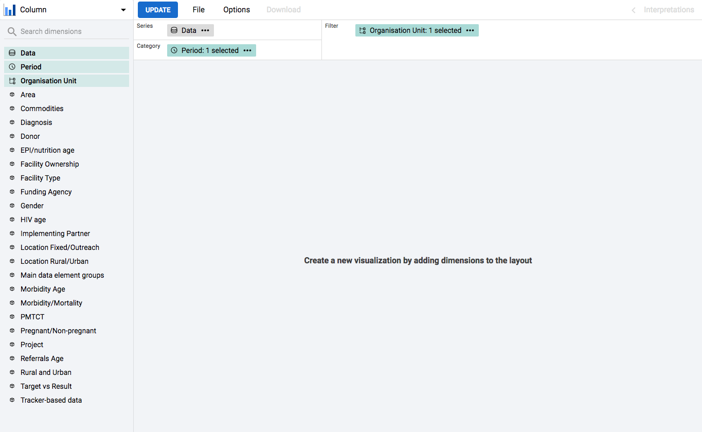
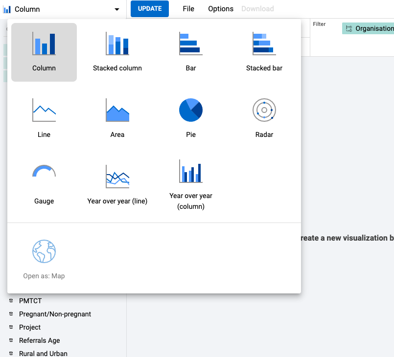
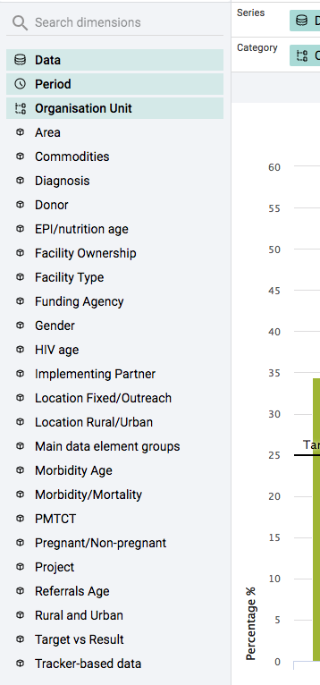
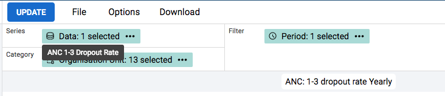
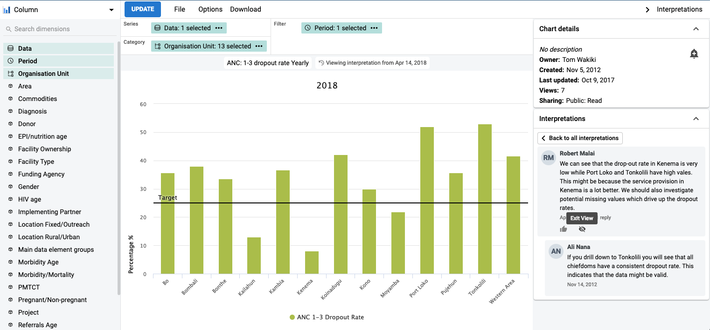
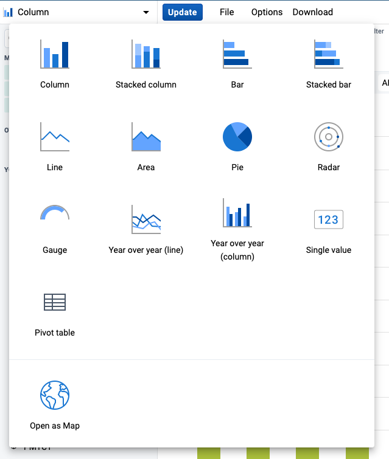

# Data Visualizer

<!--DHIS2-SECTION-ID:data_visualizer-->

## Creating and editing charts

When you open the data-visualizer app from the dhis2 menu, you are presented with a blank slate and you can start creating your chart right away.

Select the desired chart type from the selector in the upper left corner:

From the dimension menu on the left you can select the dimension you want
to show in your chart, including data, period, organisation units and
dynamic dimensions.

You can also change the selections by clicking on the
chips in the layout area.

## Viewing chart interpretations

When viewing a chart, you can expand the interpretations on the right
side by clicking on the Interpretations button in the upper right corner.
The chart description will also be shown. The description suppots rich text format.

To view the chart according to the date of a particular interpretation,
click on the interpretation or its "View" button. This will regenerate the chart with the
relevant date, which is indicated next to the chart title.

Clicking on "Back to all interpretations" or the "Exit View" button inside the interpretations panel will clear the
interpretation and regenerate the chart with the current date.

## See chart as map

Sometimes it can be useful to see how visualization would look like on map. To achieve this you can select "Open as: Map" chart type after you build your chart.

