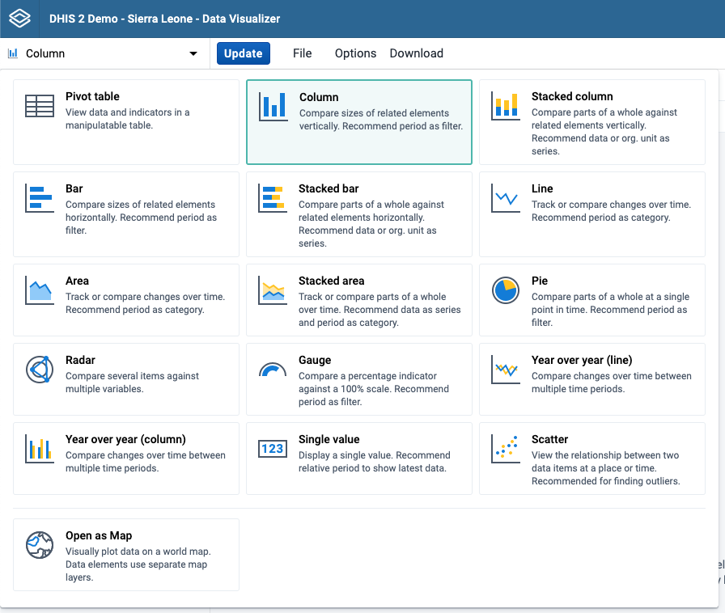
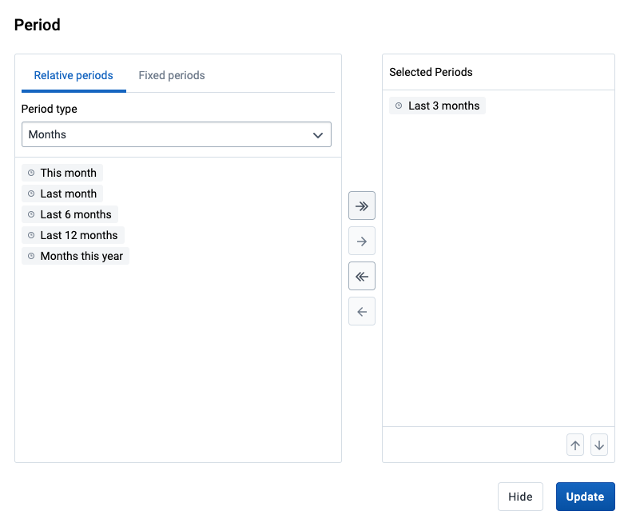
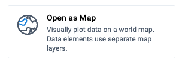

# Using the Data Visualizer app

<!--DHIS2-SECTION-ID:data_visualizer-->

## Creating and editing visualizations

When you open the data-visualizer app from the dhis2 menu, you are presented with a blank slate and you can start creating your visualization right away.

### Select visualization type

Select the desired visualization type from the selector in the upper left corner.
For each visualization type there is a brief description with suggestions about where to use the main dimensions in the layout.

 
<table>
<colgroup>
<col style="width: 33%" />
<col style="width: 66%" />
</colgroup>
<thead>
<tr class="header">
<th>
Visualization type
</th>
<th>
Description
</th>
</tr>
</thead>
<tbody>
<tr class="odd">
<td>
Column
</td>
<td>
Displays information as vertical rectangular columns with lengths proportional to the values they represent.

Example: comparing performance of different districts.

Layout restrictions: exactly 1 dimension as series, exactly 1 dimension as category.

</td>
</tr>
<tr class="even">
<td>
Stacked column
</td>
<td>
Displays information as vertical rectangular columns, where bars representing multiple categories are stacked on top of each other.

Example: displaying trends or sums of related data elements.

Layout restrictions: same as <em>Column</em>.

</td>
</tr>
<tr class="odd">
<td>
Bar
</td>
<td>
Same as <em>Column</em>, only with horizontal bars.
</td>
</tr>
<tr class="even">
<td>
Stacked bar
</td>
<td>
Same as <em>Stacked column</em>, only with horizontal bars.
</td>
</tr>
<tr class="odd">
<td>
Line
</td>
<td>
Displays information as a series of points connected by straight lines. Also referred to as time series.

Example: visualizing trends in indicator data over intervals of time.

Layout restrictions: same as <em>Column</em>.

</td>
</tr>
<tr class="even">
<td>
Area
</td>
<td>
Is based on a line (above), with the space between the axis and the line filled with colors and the lines stacked on top of each other.

Example: comparing the trends of related indicators.

Layout restrictions: same as <em>Column</em>.

</td>
</tr>
<tr class="odd">
<td>
Stacked area
</td>
<td>
Same as <em>Area</em>, but the areas of the various dimension items are stacked on top of each other.

Example: comparing the trends of related indicators.

Layout restrictions: same as <em>Area</em>.

</td>
</tr>
<tr class="even">
<td>
Pie
</td>
<td>
Circle divided into sectors (or slices).

Example: visualizing the proportion of data for individual data elements compared to the total sum of all data elements.

Layout restrictions: exactly 1 dimension as series, has no category.

</td>
</tr>
<tr class="even">
<td>
Radar
</td>
<td>
Displays data on axes starting from the same point. Also known as spider chart.

Layout restrictions: same as <em>Column</em>.

</td>
</tr>
<tr class="odd">
<td>
Gauge
</td>
<td>
Semi-circle which displays a single value, typically out of 100% (start and end values are configurable).

Layout restrictions: exactly 1 dimension with exactly 1 item as series, <em>data</em> dimension is locked to series.

</td>
</tr>
<tr class="even">
<td>
Year over year (line)
</td>
<td>
Useful when you want to compare one year of data to other years of data. Based on calendar years.

Layout restrictions: <em>period</em> dimension is disabled.

</td>
</tr>
<tr class="odd">
<td>
Year over year (column)
</td>
<td>
Same as <em>Year over year (line)</em>, only with columns.
</td>
</tr>
<tr class="even">
<td>
Single value
</td>
<td>
Displays a single value in a dashboard friendly way.

Layout restrictions: same as <em>Gauge</em>.

</td>
</tr>
<tr class="odd">
<td>
Pivot table
</td>
<td>
Summarizes the data of a more extensive table and might include sums, averages, or other statistics, which the pivot table groups together in a meaningful way.

Layout restrictions: none.

</td>
</tr>
</tbody>
</table>
 

### Select dimensions

From the dimensions menu on the left you can select the dimensions you want to show in your visualization, including data, period, organisation units and dynamic dimensions. These can be added by clicking on a dimension, by dragging and dropping a dimension to the layout area or by hovering over a dimension and using on its context menu (three dots).

Just like in the dimensions menu, in the layout area you can also change the selections by clicking on a dimension, dragging and dropping a dimension or by using a dimension's context menu (three dots).

- **Series**: A series is a set of continuous, related elements (for
  example periods or data elements) that you want to visualize in
  order to emphasize trends or relations in its data. Also known as Columns for Pivot table visualizations.

<!-- end list -->

- **Categories**: A category is a set of elements (for example indicators
  or organisation units) for which you want to compare its data. Also known as Rows for Pivot table visualizations.

<!-- end list -->

- **Filter**: The filter selection will filter the data displayed in the
  visualization. Note that if you use the data dimension as filter, you can
  only specify a single indicator or data set as filter item, whereas
  with other dimension types you can select any number of items.

### Select dimension items

<!--DHIS2-SECTION-ID:data_vis_select_dim_items-->

A dimension refers to the elements that describe the data values in the system. There are three main dimensions in the system:

- **Data**: Includes data elements, indicators and datasets (reporting
  rates), describing the phenomena or event of the data.

<!-- end list -->

- **Periods**: Describes when the event took place.

<!-- end list -->

- **Organisation units**: Describes where the event took place.

Data Visualizer is highly flexible in terms of allowing you to use these dimensions as series, categories and filter.

To select items for a dimension, open the dimension modal window by clicking on a dimension. This window will also be opened automatically when adding a dimension without selected items to the layout. Select which items to add to the visualization by double-clicking an item or by selecting an item with a single click and using the arrows in the middle. The order of appearance will be the same as the order in which they are selected. Selected items can be reordered by dragging and dropping them in the Selected section.

#### Select periods

When selecting a Period you have to option to choose between fixed periods and relative periods. These can also be combined. Overlapping periods are filtered so that they only appear once. For relative periods the names are relative to the current date, e.g. if the current month is March and **Last month** is selected, the month of February is shown in the visualization.

#### Select organisation units

The organisation units dialog is flexible, offering essentially three ways of selecting organisation units:

- Explicit selection: Use the **tree** to explicitly select the organisation units you want to appear in the visualization. If you right-click on an organisation unit you can easily choose to select all org units below it.

- Levels and groups: The **Level** and **Group** dropdowns are a convenient way to select all units in one or more org unit groups or at specific levels. Example: select _Chiefdom_ (level 3) to get all org units at that level.

  Please note that as soon as at least one level or group has been selected the org unit tree now acts as the boundary for the levels/groups. Example: if you select _Chiefdom_ (level 3) and _Kailahun_ org unit (at level 2) in the tree you get all chiefdom units inside Kailahun district.

- The user's organisation units:

  - User organisation unit: This is a way to dynamically select the org units that the logged in user is associated to.

  - User sub-units: Selects the sub-units of the user organisation unit.

  - User sub-x2-units: Selects the units two levels below the user organisation unit.

### Two category charts

Most chart visualization types can show two categories.
Switching from Pivot Table to Column, Bar, Area (and their stacked versions) and Line is keeping the first two dimensions in Category, any additional dimension is moved to Filter.
The labels for the first dimension in Category are shown at the top of the chart, and the ones for the second dimension at the bottom.
The resulting visualization is composed of separate charts, one for each item in the first dimension.

Example screenshot:

## Change the display of your visualization

The display of a visualization can be changed by enabling/disabling and configuring several options. Each visualization type can have a different set of available options. The options are organised in tabs in the **Options dialog** and in sections within each tab.

1.  Click **Options** to open the **Options dialog**.

2.  Navigate the tabs in the dialog to see the available options.

3.  Configure the desired options as required.

4.  Click **Update** to apply the changes to the visualization.

### List of available options

<table border="1">
<colgroup>
<col style="width: 20%" />
<col style="width: 80%" />
</colgroup>
<thead>
<tr class="header">
<th>
Option
</th>
<th>
Description
</th>
</tr>
</thead>
<tbody>
<tr>
<td colspan="2" align="center">Data tab</td>
</tr>
<tr>
<td>
Aggregation type
</td>
<td>
Defines how the data elements or indicators will be aggregated within the visualization. Some of the aggregation types are <em>By data element</em>, <em>Count</em>, <em>Min</em> and <em>Max</em>.
</td>
</tr>
<tr>
<td>
Base line
</td>
<td>
Displays a horizontal line at the given domain value. Useful for example when you want to visualize how your performance has evolved since the beginning of a process.
</td>
</tr>
<tr>
<td>
Column sub-totals
</td>
<td>
Displays sub-totals in a Pivot table for each dimension. 
If you only select one dimension, sub-totals will be hidden for those columns. This is because the values will be equal to the sub-totals.
</td>
</tr>
<tr>
<td>
Column totals
</td>
<td>
Displays total values in a Pivot table for each column, as well as a total for all values in the table.
</td>
</tr>
<tr>
<td>
Cumulative values
</td>
<td>
Displays cumulative values in Column, Stacked column, Bar, Stacked bar, Line and Area visualizations
</td>
</tr>
<tr>
<td>
Custom sort order
</td>
<td>
Controls the sort order of the values.
</td>
</tr>
<tr>
<td>
Dimension labels
</td>
<td>
Shows the dimension names as part of a Pivot table.
</td>
</tr>
<tr>
<td>
Hide empty categories
</td>
<td>
Hides the category items with no data from the visualization.
<em>Before first</em>: hides missing values only before the first value
<em>After last</em>: hides missing values only after the last value
<em>Before first and after last</em>: hides missing values only before the first value and after the last value
<em>All</em>: hides all missing values
This is useful for example when you create Column and Bar visualizations.
</td>
</tr>
<tr>
<td>
Hide empty columns
</td>
<td>
Hides empty columns from a Pivot table. This is useful when you look at large tables where a large portion of the dimension items don't have data in order to keep the table more readable.
</td>
</tr>
<tr>
<td>
Hide empty rows
</td>
<td>
Hides empty rows from a Pivot table. This is useful when you look at large tables where a large portion of the dimension items don't have data in order to keep the table more readable.
</td>
</tr>
<tr>
<td>
Number type
</td>
<td>
Sets the type of value you want to display in a Pivot table: <code>Value</code>, <code>Percentage of row</code> or <code>Percentage of column</code>. 
The options <code>Percentage of row</code> and <code>Percentage of column</code> mean that you'll display values as percentages of row total or percentage of column total instead of the aggregated value. This is useful when you want to see the contribution of data elements, categories or organisation units to the total value.
</td>
</tr>
<tr>
<td>
Only include completed events
</td>
<td>
Includes only completed events in the aggregation process. This is useful for example to exclude partial events in indicator calculations.
</td>
</tr>
<tr>
<td>
Row sub-totals
</td>
<td>
Displays sub-totals in a Pivot table for each dimension. 
If you only select one dimension, sub-totals will be hidden for those rows. This is because the values will be equal to the sub-totals.
</td>
</tr>
<tr>
<td>
Row totals
</td>
<td>
Displays total values in a Pivot table for each row, as well as a total for all values in the table.
</td>
</tr>
<tr>
<td>
Skip rounding
</td>
<td>
Skips the rounding of data values, offering the full precision of data values. Can be useful for finance data where the full dollar amount is required.
</td>
</tr>
<tr>
<td>
Stacked values add up to 100%
</td>
<td>
Displays 100 % stacked values in Stacked column and Stacked bar visualizations.
</td>
</tr>
<tr>
<td>
Target line
</td>
<td>
Displays a horizontal line at the given domain value. Useful for example when you want to compare your performance to the current target.
</td>
</tr>
<tr>
<td>
Trend line
</td>
<td>
Displays the trend line that visualizes how your data evolves over time. For example if performance is improving or deteriorating. Useful when periods are selected as category.
</td>
</tr>
<tr>
<td>
Value labels
</td>
<td>
Shows the values above the series in the visualization.
</td>
</tr>

<tr>
<td colspan="2" align="center">Axes tab</td>
</tr>
<tr>
<td>
Axis range
</td>
<td>
Defines the maximum and minimum value that will be visible on the range axis.
</td>
</tr>
<tr>
<td>
Axis title
</td>
<td>
Type a title here to display a label next to the x or y axis. Useful when you want to give context information to the visualization, for example about the unit of measure.
</td>
</tr>
<tr>
<td>
Decimals
</td>
<td>
Defines the number of decimals that will be used for range axis values.
</td>
</tr>
<tr>
<td>
Steps
</td>
<td>
Defines the number of ticks that will be visible on the range axis.
</td>
</tr>

<tr>
<td colspan="2" align="center">Legend tab</td>
</tr>
<tr>
<td>
Display legend
</td>
<td>
Applies a legend to the values. This means that you can apply a color to the values. You configure legends in the <em>Maintenance app</em>.

The <em>Legend type</em> section allows to control which color is applied. Select <em>Use pre-defined legend per data item</em> to color a data point individually according to each data element or indicator. Select <em>Select a single legend for entire visualization</em> to use a single legend, chosen in a drop-down list of available legends.

The <em>Legend style</em> section allows to control where the color is applied, the text or background based on the selected legend. You can use this option for scorecards to identify high and low values at a glance. Not applicable for <em>Single Value</em> visualizations.
</td>
</tr>

<tr>
<td colspan="2" align="center">Style tab</td>
</tr>
<tr>
<td>
Digit group separator
</td>
<td>
Controls which character to use to separate groups of digits or "thousands". You can set it to <em>Comma</em>, <em>Space</em> or <em>None</em>.
</td>
</tr>
<tr>
<td>
Display density
</td>
<td>
Controls the size of the cells in a Pivot table. You can set it to <em>Comfortable</em>, <em>Normal</em> or <em>Compact</em>.
<em>Compact</em> is useful when you want to fit large tables into the browser screen.
</td>
</tr>
<tr>
<td>
Display organisation unit hierarchy
</td>
<td>
Shows the name of all ancestors for organisation units, for example <em>"Sierra Leone / Bombali / Tamabaka / Sanya CHP"</em> for <em>"Sanya CHP"</em>.
The organisation units are then sorted alphabetically which will order the organisation units according to the hierarchy.
When you download a pivot table with organisation units as rows and you've selected <em>Display organisation unit hierarchy</em>, each organisation unit level is rendered as a separate column. This is useful for example when you create Excel pivot tables on a local computer.
</td>
</tr><tr>
<td>
Font size
</td>
<td>
Controls the size of a Pivot table text font. You can set it to <em>Large</em>, <em>Normal</em> or <em>Small</em>.
</td>
</tr>
<tr>
<td>
Chart/Table title
</td>
<td>
Controls the title that appears above the visualization.
<em>Auto generated</em> uses the default title generated from the visualization's dimensions/filters.
<em>None</em> removes the title.
The <em>Custom</em> option allows you to type a custom title.
</td>
</tr>
<tr>
<td>
Chart/Table subtitle
</td>
<td>
Controls the subtitle that appears above the visualization.
<em>Auto generated</em> uses the default subtitle generated from the visualization's dimensions/filters.
<em>None</em> removes the subtitle.
The <em>Custom</em> option allows you to type a custom subtitle.
</td>
</tr>
<tr>
<td>
Show legend key
</td>
<td>
Toggles the legend on and off leaving more room for the visualization itself.
</td>
</tr>
<tr>
<td>
No space between bars/columns
</td>
<td>
Removes the space between the columns or bars in the visualization. Useful for displaying the visualization as an EPI curve.
</td>
</tr>
<tr>
<td>
Value labels
</td>
<td>
Shows the values above the series in the visualization.
</td>
</tr>
<tr>
<td>
Chart/Table title
</td>
<td>
Controls the title that appears above the visualization.
<em>Auto generated</em> uses the default title generated from the visualization's dimensions/filters.
<em>None</em> removes the title.
The <em>Custom</em> option allows you to type a custom title.
</td>
</tr>
<tr>
<td>
Color set
</td>
<td>
Controls the colors used in the chart. A list of available color sets is shown with a preview of the colors. There is also a "Mono patterns" option which uses colored patterns instead of solid colors.
</td>
</tr>

<tr>
<td colspan="2" align="center">Limit values tab</td>
</tr>
<tr>
<td>
Limit minimum/maximum values
</td>
<td>
Allows for the data to be filtered on the server side.
You can instruct the system to return only records where the aggregated data value is equal, greater than, greater or equal, less than or less or equal to certain values.
If both parts of the filter are used, it's possible to filter out a range of data records.
</td>
</tr>

<tr>
<td colspan="2" align="center">Parameters tab</td>
</tr>
<tr>
<td>
Custom sort order
</td>
<td>
Controls the sort order of the values.
</td>
</tr>
<tr>
<td>
Include cumulative
</td>
<td>
Includes a column with cumulative values to a Pivot table.
</td>
</tr>
<tr>
<td>
Include regression
</td>
<td>
Includes a column with regression values to a Pivot table.
</td>
</tr><tr>
<td>
Organisation unit
</td>
<td>
Controls whether to ask user to enter an organisation unit when creating a standard report in Reports app.
</td>
</tr>
<tr>
<td>
Parent organisation unit
</td>
<td>
Controls whether to ask user to enter a parent organisation unit when creating a standard report in Reports app.
</td>
</tr>
<tr>
<td>
Reporting period
</td>
<td>
Controls whether to ask user to enter a report period when creating a standard report in Reports app.
</td>
</tr>
<tr>
<td>
Top limit
</td>
<td>
Controls the maximum number of rows to include in a Pivot table.
</td>
</tr>
</tbody>
</table>

### Custom styling for text and legend in charts

The following options can be customized using the text styling tool: `Chart title`, `Chart subtitle`, `Show legend key`, `Target line`, `Base line`, `Axis title` and `Labels` for both horizontal and vertical axes.
The text styling tool allows to choose a font size, color and italic/bold variants. It's also possible to choose the position of the text.

## Adding Assigned Categories

Assigned Categories is a composite dimension that represents associated category option combinations to the selected data element's category combination. This can be added by dragging the **Assigned Categories** dimension from the left side dimensions menu and into the visualization layout:

Another way of adding assigned categories is by accessing the **Add Assigned Categories** option from the `Data` dimension's context menu (not available for `Gauge`, `Year over year` or `Single value`).

## Adding more axes and changing how different series are displayed

When combining data with different measurement scales you will get a more meaningful visualization by having more than a single axis. For `Column`, `Bar` `Area` (and their stacked versions) and `Line` you can do so by clicking **Series tab** in the `Options` dialog. If the option is disabled, make sure that the `Data` dimension is on the `Series` axis and that at least two items have been added.
Four axis are available, two on the left side of the chart and two on the right side.
Each axis has a different color and the chart is going to be colored accordingly.

If the selected visualization is of type `Column` or `Line`, it's also possible to choose to display the data of each data dimension as column or line chart.

## Data drilling

This feature is enabled for the `Pivot Table` visualization type and allows to drill in the data by clicking on a value cell in the table. A contextual menu opens with various options.

You can drill the data by organisation unit, meaning navigating up and down the org unit tree. The data drill affects the current dimension selection in the layout area.

## Manage saved visualizations

Saving your visualizations makes it easy to find them later. You can also choose to share them with other users or display them on a dashboard.

### Open a visualization

1.  Click **File** \> **Open**.

2.  Enter the name of a visualization in the search field, or click the **<** and **>** arrows to navigate between different pages. The result can also be filtered by type and owner by using the corresponding menus in the top right corner.

3.  Click the name of the one you want to open.

### Save a visualization

1. a) Click **File** \> **Save**.

2. Enter a **Name** and a **Description** for your visualization.

3. Click **Save**.

### Rename a visualization

1.  Click **File** \> **Rename**.

2.  Enter the new name and/or description.

3.  Click **Rename**.

### Delete a visualization

1.  Click **File** \> **Delete**.

2.  Click **Delete**.

### Get the link to the visualization

1. Click **File** \> **Get Link**.

2. The URL can be copied via the browser's context menu that opens when right clicking on the link.

## Visualization interpretations

When viewing a saved visualization, you can expand the interpretations on the right side by clicking on the Interpretations button in the upper right corner. The visualization description will also be shown. The description supports rich text format.

New interpretations can be added by typing in the text field in the bottom right corner. Other users can be mentioned with `@username`. Start by typing `@` plus the first letters of the username or real name and a list of matching users will be displayed. Mentioned users will receive an internal DHIS2 message with the interpretation or comment. Interpretations can also be seen in the **Dashboard** app.

It is possible to format the text with **bold**, _italic_ by using the Markdown style markers `*` and `_` for **bold** and _italic_ respectively (keyboard shortcuts are also available: `Ctrl`/`Cmd` + `B` and `Ctrl`/`Cmd` + `I`). A limited set of emojis is supported and can be used by typing one of the following character combinations: `:)` `:-)` `:(` `:-(` `:+1` `:-1`. URLs are automatically detected and converted into a clickable link.

To view the visualization according to the date of a particular interpretation, click on the interpretation or its `View` button. This will regenerate the visualization with the relevant date, which is indicated next to the visualization title. Clicking on `Back to all interpretations` will regenerate the visualization with the current date.

To subscribe to the saved visualization, click the bell icon in the upper right corner. You will then receive internal messages whenever another user likes/creates/updates an interpretation in this saved visualization.

## Share a visualization

Sharing settings can be accessed by clicking **File** \> **Share**. Change sharing settings for the user groups you want to modify, the available settings are:

- **Can edit and view**: Can view and edit the visualization.

- **Can view only**: Can only view the visualization.

- **No access**: Won't have access to the visualization. This
  setting is only applicable to **Public access** and **External access**.

New users can be added by searching for them by name under `Add users and user groups`.

## Download

Visualizations can be downloaded using the **Download** menu. All visualization types support `Graphics` and `Plain data source` downloads, except for the `Pivot table` type, which can be downloaded as `Table layout` and `Plain data source`.

### `Graphics` download

Downloads an image (.png) or a PDF (.pdf) file to your computer.

### `Table layout` download

Downloads a Excel (.xls), CSV (.csv) or HTML (.html) file to your computer.

### `Plain data source` download

You can download the data source of a visualization in JSON, XML, Excel,
CSV, JXRML or Raw data SQL formats with different identification schemes
(ID, Code, and Name). The data document uses identifiers of the
dimension items and opens in a new browser window to display the URL of
the request to the Web API in the address bar. This is useful for
developers of apps and other client modules based on the DHIS2 Web API
or for those who require a plan data source, for instance for import
into statistical packages.

<table>
<caption>Available formats</caption>
<colgroup>
<col style="width: 18%" />
<col style="width: 33%" />
<col style="width: 47%" />
</colgroup>
<thead>
<tr class="header">
<th>
Format
</th>
<th>
Action
</th>
<th>
Description
</th>
</tr>
</thead>
<tbody>
<tr class="odd">
<td>
JSON
</td>
<td>
Click <strong>JSON</strong>
</td>
<td>
Downloads JSON format based on the <strong>ID</strong>, <strong>Code</strong> or <strong>Name</strong> property.

</tr>
<tr class="even">
<td>
XML
</td>
<td>
Click <strong>XML</strong>
</td>
<td>
Downloads XML format based on the <strong>ID</strong>, <strong>Code</strong> or <strong>Name</strong> property.

</tr>
<tr class="odd">
<td>
Microsoft Excel
</td>
<td>
Click <strong>Microsoft Excel</strong>
</td>
<td>
Downloads Microsoft Excel format based on the <strong>ID</strong>, <strong>Code</strong> or <strong>Name</strong> property.

</tr>
<tr class="even">
<td>
CSV
</td>
<td>
Click <strong>CSV</strong>
</td>
<td>
Downloads CSV format based on the <strong>ID</strong>, <strong>Code</strong> or <strong>Name</strong> property.

</tr>
<tr class="odd">
<td>
XML data value set
</td>
<td>
Click <strong>Advanced > XML</strong>
</td>
<td>
Downloads the raw data values as XML, as opposed to data which has been aggregated along various dimensions.
</td>
</tr>
<tr class="even">
<td>
JSON data value set
</td>
<td>
Click <strong>Advanced > JSON</strong>
</td>
<td>
Downloads the raw data values as JSON, as opposed to data which has been aggregated along various dimensions.
</td>
</tr>
<tr class="odd">
<td>
JRXML
</td>
<td>
Click <strong>Advanced > JRXML</strong>
</td>
<td>
Produces a template of a Jasper Report which can be further customized based on your exact needs and used as the basis for a standard report in DHIS 2.
</td>
</tr>
<tr class="even">
<td>
Raw data SQL
</td>
<td>
Click <strong>Advanced > Raw data SQL</strong>
</td>
<td>
Provides the actual SQL statement used to generate the data visualization. You can use it as a data source in a Jasper report, or as the basis for a SQL view.
</td>
</tr>
</tbody>
</table>

## See visualization as map

To see how a visualization would look on map, select the `Open as Map` Visualization type after you're finished building your visualization.

