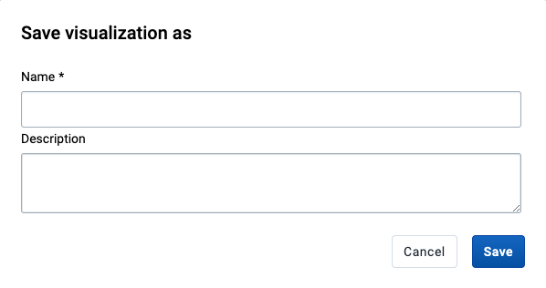

# Using the Data Visualizer app

<!--DHIS2-SECTION-ID:data_visualizer-->

## Creating and editing visualizations

When you open the data-visualizer app from the dhis2 menu, you are presented with a blank slate and you can start creating your visualization right away.

### Select visualization type

Select the desired visualization type from the selector in the upper left corner:

 
<table>
<colgroup>
<col style="width: 33%" />
<col style="width: 66%" />
</colgroup>
<thead>
<tr class="header">
<th>
Visualization type
</th>
<th>
Description
</th>
</tr>
</thead>
<tbody>
<tr class="odd">
<td>
Column
</td>
<td>
Displays information as vertical rectangular columns with lengths proportional to the values they represent.

Useful when you want to, for example, compare performance of different districts.
</td>
</tr>
<tr class="even">
<td>
Stacked column
</td>
<td>
Displays information as vertical rectangular columns, where bars representing multiple categories are stacked on top of each other.

Useful when you want to, for example, display trends or sums of related data elements.
</td>
</tr>
<tr class="odd">
<td>
Bar
</td>
<td>
Same as column, only with horizontal bars.
</td>
</tr>
<tr class="even">
<td>
Stacked bar
</td>
<td>
Same as stacked column, only with horizontal bars.
</td>
</tr>
<tr class="odd">
<td>
Line
</td>
<td>
Displays information as a series of points connected by straight lines. Also referred to as time series.

Useful when you want to, for example, visualize trends in indicator data over multiple time periods.
</td>
</tr>
<tr class="even">
<td>
Area
</td>
<td>
Is based on a line (above), with the space between the axis and the line filled with colors and the lines stacked on top of each other.

Useful when you want to compare the trends of related indicators.
</td>
</tr>
<tr class="odd">
<td>
Pie
</td>
<td>
Circle divided into sectors (or slices).

Useful when you want to, for example, visualize the proportion of data for individual data elements compared to the total sum of all data elements.
</td>
</tr>
<tr class="even">
<td>
Radar
</td>
<td>
Displays data on axes starting from the same point. Also known as spider chart.
</td>
</tr>
<tr class="odd">
<td>
Gauge
</td>
<td>
Semi-circle which displays values out of 100 %.
</td>
</tr>
<tr class="even">
<td>
Year over year (line)
</td>
<td>
TODO: NEEDS INFO 
</td>
</tr>
<tr class="odd">
<td>
Year over year (column)
</td>
<td>
TODO: NEEDS INFO 
</td>
</tr>
<tr class="even">
<td>
Single value
</td>
<td>
TODO: NEEDS INFO 
</td>
</tr>
<tr class="odd">
<td>
Pivot table
</td>
<td>
TODO: NEEDS INFO 
</td>
</tr>
</tbody>
</table>
 

### Select dimensions

From the dimension menu on the left you can select the dimension you want to show in your visualization, including data, period, organisation units and dynamic dimensions. These can be added by clicking on a dimension, by dragging and dropping a dimension to the layout area or by hovering over a dimension and using on its' context menu (three dots).

Just like in the dimensions menu, in the layout area you can also change the selections by clicking on a dimension, dragging and dropping a dimension or by using a dimension's context menu (three dots).

- **Series**: A series is a set of continuous, related elements (for
  example periods or data elements) which you want to visualize in
  order to emphasize trends or relations in its data. Also known as Columns for Pivot table visualizations.

<!-- end list -->

- **Categories**: A category is a set of elements (for example indicators
  or organisation units) for which you want to compare its data. Also known as Rows for Pivot table visualizations.

<!-- end list -->

- **Filter**: The filter selection will filter the data displayed in the
  visualization. Note that if you use the data dimension as filter, you can
  only specify a single indicator or data set as filter item, whereas
  with other dimension types you can select any number of items.

### Select dimension items

<!--DHIS2-SECTION-ID:data_vis_select_dim_items-->

A dimension refers to the elements which describe the data values in the system. There are three main dimensions in the system:

- **Data**: Includes data elements, indicators and datasets (reporting
  rates), describing the phenomena or event of the data.

<!-- end list -->

- **Periods**: Describes when the event took place.

<!-- end list -->

- **Organisation units**: Describes where the event took place.

Data Visualizer lets you use these dimensions completely flexible in terms of appearing as series, categories and filter.

To select items for each one, open the dimension modal window by clicking on a dimension. This window will also be opened automatically when adding a dimension with out items to the layout. Select which items to add to the visualization by double-clicking an item or by selecting an item with a single click and using the arrows in the middle. The order of appearance will be the same as the order in which they are selected. Selected items can be reordered by dragging and dropping them in the Selected section.

#### Select periods

When selecting a Period you have to option to choose between fixed periods and relative periods. These can also be combined. Overlapping periods are filtered so that they only appear once. For relative periods the names are relative to the current date, e.g. if the current month is March and **Last month** is selected, the month of February is added.

#### Select organisation units

TODO: NEEDS INFO

## Change the display of your visualization

TODO: NEEDS INFO, all options

## Adding more axes

When combining data with different measurement scales you will get a more meaningful visualization by having more than a single axis. For `Column`, `Bar` and `Line` charts you can do so by clicking **Manage chart axes** in the `Data` dimension's context menu. If the option is disabled, make sure that the `Data` dimension is on the `Series` axis and that at least two items have been added.

In the axis management dialog you can assign data items to the two axes.

## Manage saved visualizations

Saving your visualization makes it easy to find them later. You can also choose to share them with other users or display them on a dashboard.

### Open a visualization

1.  Click **File** \> **Open**.

2.  Enter the name of a visualization in the search field, or click the **<** and **>** arrows to navigate between different pages. The result can also be filtered by type and owner by using the corresponding menus in the top right corner.

3.  Click the name of the one you want to open.

### Save a visualization

1. a) Click **File** \> **Save**.

2. Enter a **Name** and a **Description** for your visualization.

3. Click **Save**.

### Rename a visualization

1.  Click **File** \> **Rename**.

2.  Enter the new name and/or description.

3.  Click **Rename**.

### Delete a visualization

1.  Click **File** \> **Delete**.

2.  Click **Delete**.

## Visualization interpretations

When viewing a saved visualization, you can expand the interpretations on the right side by clicking on the Interpretations button in the upper right corner. The visualization description will also be shown. The description supports rich text format.

New interpretations can be added by typing in the text field in the bottom right corner. Other users can be mentioned with `@username`. Start by typing `@` plus the first letters of the username or real name and a mentioning bar will display the available users. Mentioned users will receive an internal DHIS2 message with the interpretation or comment. Interpretations can also be seen in the **Dashboard** app.

It is possible to format the text with **bold**, _italic_ by using the Markdown style markers `*` and `_` for **bold** and _italic_ respectively (keyboard shortcuts are also available: `Ctrl`/`Cmd` + `B` and `Ctrl`/`Cmd` + `I`). A limited set of emojis is supported and can be used by typing one of the following character combinations: `:)` `:-)` `:(` `:-(` `:+1` `:-1`. URLs are automatically detected and converted into a clickable link.

To view the visualization according to the date of a particular interpretation, click on the interpretation or its `View` button. This will regenerate the visualization with the relevant date, which is indicated next to the visualization title. Clicking on `Back to all interpretations` will regenerate the visualization with the current date.

To subscribe to the saved visualization, click the bell icon in the upper right corner. This will allow you to receive internal messages whenever another user likes/creates/updates an interpretation in this saved visualization.

## Share a visualization

Sharing settings can be accessed by clicking **File** \> **Share**. Change sharing settings for the user groups you want to modify, the available settings are:

- **Can edit and view**: Can view and edit the visualization.

- **Can view only**: Can only view the visualization.

- **No access**: Won't have access to the visualization. This
  setting is only applicable to **Public access** and **External access**.

New users can be added by searching for them by name under `Add users and user groups`.

## Download

Visualizations can be downloaded using the **Download** menu. All visualization types support `Graphics` and `Plain data source` downloads, except for the `Pivot table` type that can be downloaded as `Table layout` and `Plain data source`.

### `Graphics` download

Downloads an image (.png) or a PDF (.pdf) file to your computer.

### `Table layout` download

Downloads a Excel (.xls), CSV (.csv) or HTML (.html) file to your computer.

### `Plain data source` download

You can download the data source behind a chart in JSON, XML, Excel,
CSV, JXRML or Raw data SQL formats with different identification schemes
(ID, Code, and Name). The data document uses identifiers of the
dimension items and opens in a new browser window to display the URL of
the request to the Web API in the address bar. This is useful for
developers of apps and other client modules based on the DHIS2 Web API
or for those who require a plan data source, for instance for import
into statistical packages.

<table>
<caption>Available formats</caption>
<colgroup>
<col style="width: 18%" />
<col style="width: 33%" />
<col style="width: 47%" />
</colgroup>
<thead>
<tr class="header">
<th>
Format
</th>
<th>
Action
</th>
<th>
Description
</th>
</tr>
</thead>
<tbody>
<tr class="odd">
<td>
JSON
</td>
<td>
Click <strong>JSON</strong>
</td>
<td>
Downloads JSON format based on the <strong>ID</strong>, <strong>Code</strong> or <strong>Name</strong> property.

</tr>
<tr class="even">
<td>
XML
</td>
<td>
Click <strong>XML</strong>
</td>
<td>
Downloads XML format based on the <strong>ID</strong>, <strong>Code</strong> or <strong>Name</strong> property.

</tr>
<tr class="odd">
<td>
Microsoft Excel
</td>
<td>
Click <strong>Microsoft Excel</strong>
</td>
<td>
Downloads Microsoft Excel format based on the <strong>ID</strong>, <strong>Code</strong> or <strong>Name</strong> property.

</tr>
<tr class="even">
<td>
CSV
</td>
<td>Click <strong>CSV</strong></td>
<td>
Downloads CSV format based on the <strong>ID</strong>, <strong>Code</strong> or <strong>Name</strong> property.

</tr>
<tr class="odd">
<td>
XML data value set
</td>
<td>
Click <strong>Advanced > XML</strong>
</td>
<td>
TODO: NEEDS INFO
</td>
</tr>
<tr class="even">
<td>
JSON data value set
</td>
<td>
Click <strong>Advanced > JSON</strong>
</td>
<td>
TODO: NEEDS INFO
</td>
</tr>
<tr class="odd">
<td>
JRXML
</td>
<td>
Click <strong>Advanced > JRXML</strong>
</td>
<td>
Produces a template of a Jasper Report which can be further customized based on your exact needs and used as the basis for a standard report in DHIS 2.
</td>
</tr>
<tr class="even">
<td>
Raw data SQL
</td>
<td>
Click <strong>Advanced > Raw data SQL</strong>
</td>
<td>
Provides the actual SQL statement used to generate the data visualization. You can use it as a data source in a Jasper report, or as the basis for a SQL view.
</td>
</tr>
</tbody>
</table>

## See visualization as map

To see how a visualization would look like on map, select the `Open as Map` Visualization type after you're finished building your visualization.

