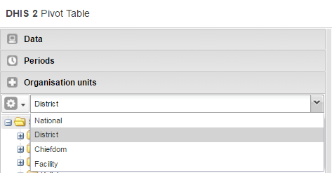

# DHIS2 Tutorials

<!--DHIS2-SECTION-ID:dhis2_tutorials-->

## Create Scorecards using the Pivot Table app

<!--DHIS2-SECTION-ID:create-scorecards-pivot-table-->

***Scorecards definition:** In public health settings such as Ministries
of Health, scorecards offer a useful and standardized method for
combining related indicators into one table. A scorecard gives an
overall view of the performance of a health program such as a
vaccination program, highlighting successes, weaknesses, and areas for
improvement Here's what a typical scorecard looks like:*

This tutorial explains how to create a scorecard in the DHIS2 Pivot
Table app. There are several advantages to using the Pivot Table to
create a scorecard, such as:

  - You can save the scorecard on the dashboard and use it offline.

  - You can share the scorecard with other DHIS2 users.

Let's get started\!

### Create a legend for your scorecard

First, we’ll create a 3-color “traffic light” legend for the scorecard.
With three basic colors, the scorecard is easy to scan and easy to
understand.

1.  Open the **Maintenance** app. Click the menu in the top right corner
    and select Maintenance from the list of apps. You can also type the
    first letters of the word maintenance in the search field to find
    the app.

    

2.  In the Maintenance app, scroll to the bottom of the page right down
    to the **Other** section.

3.  Go to **Legend** and click the **+**.

    

4.  In the **Legend Management** page, scroll to the bottom of the page
    and create a new legend by clicking the blue + button.

    

5.  Enter a name for the legend such as “Traffic light”, a start value
    and an end value in the fields. The values you enter here depend on
    the performance ratings you wish to set for the scorecard.

6.  Change **Number of legend items** to 3 to display three colors in
    the scorecard. To change the legend item colors, click the blue +
    button and then edit the
    colors.

    

### Create a scorecard in the Pivot Table app

1.  Open the **Pivot Table** app from the top right menu of the
    dashboard. You can also enter the first letters of Pivot Table in
    the search field.

2.  Go to **Data** in the pane on the left side and select
    **Indicators** in the list.

3.  Select an **Indicator group** such as “ANC” in the second list.

4.  Using the arrows, select the type of indicators you want to see in
    your scorecard.

    

5.  Click **Update**. This button is in the menu at the top of the
    workspace

6.  Go to **Periods** and select a period for which you want to display
    data. In this “traffic light” example, we’ll use the relative period
    section. In **Quarters**, select **This quarter**and **Last
    quarter**. Clear any other checkboxes and click **Update**.

    

7.  Go to **Organisation Units** in the same left side pane, and click
    the arrow next to the gear button.

8.  Select **Select levels**.

    

9.  Select **District** from the list (next to the gear button). Click
    **Update**.

    

As you can see, the scorecard is starting to take shape in the
workspace. Now it’s time to fine-tune the look and feel.

### Organise the layout and display of your scorecard

1.  In the workspace, click **Layout**.

    

2.  In **Table layout**, drag **Organisation units** down to the **Row
    dimensions** section.

3.  Drag **Data** to the **Column dimensions** section.

4.  In the **Column dimensions** pane, drag **Periods** below **Data**,
    and click **Update**.

5.  In the workspace, click **Options**.

    

6.  Go to **Data** and clear all the checkboxes.

7.  Go to **Style** \> **Legend set** and from the list, select the
    legend you created in the Maintenance app. In this example, we
    called it Traffic light.

8.  Go to **Style** \> **Legend display style** and select **Background
    color**.

9.  Click **Update**.

The Scorecard is ready\!

### Save and share your scorecard

1.  In the workspace, go to the **Favorites** menu.

2.  Click **Save as**. Enter a name for your Scorecard.

3.  To share your Scorecard, select **Favorites**.

4.  Enter the name of a user group name, and click **Save**. Your
    scorecard can be viewed by people that you share a dashboard with.

## Working with TextPattern

<!--DHIS2-SECTION-ID:working-with-textpattern-->

TextPattern was introduced in DHIS2 version 2.29, as a way of defining a
pattern that includes variables, generated values and raw text, which
then could be generated into a text value. The current use-case for
TextPattern is automatically generated attributes for tracked entities,
where you want to generate for example unique ids based on a specific
pattern.

This guide will cover both basic and advanced topics for working with
TextPattern, but is mainly focused on how you can define TextPatterns
and which limitations and caveats exists.

### TextPattern syntax

A TextPattern is a sequence of *segments*, joined together by the "+"
character. A segment has a specific notation and in most cases a
parameter *format*, which allows for further manipulation of the value.

<table>
<caption>TextPattern segments</caption>
<colgroup>
<col style="width: 20%" />
<col style="width: 36%" />
<col style="width: 12%" />
<col style="width: 30%" />
</colgroup>
<thead>
<tr class="header">
<th>Segment notation</th>
<th>Description</th>
<th>Paramenter (format)</th>
<th>Example (segment → input value → result)</th>
</tr>
</thead>
<tbody>
<tr class="odd">
<td>&quot;Plain text&quot;</td>
<td>The plain text segment will remain unchanged in all generated values. This special segment is defined by wrapping text between two double quotes. If your pattern should include separation symbols like a dash, you should use this &quot;-&quot;.

The plain text segment also allows for placeholder text. That means you can specify that parts of the plain text segment should be any of a set of characters. Currently there are 4 supported special characters you can use:

<ul>
<li>
\d (0-9)
</li>
<li>
\x (a-z)
</li>
<li>
\X (A-Z)
</li>
<li>
\w (a-zA-Z0-9)
</li>
</ul></td>
<td>None</td>
<td>&quot;Hello world&quot; → None → Hello world

&quot;Hello \x\x\x&quot; → &quot;Hello you&quot; → Hello you

&quot;\d\d\d&quot; → &quot;123&quot; → 123
</td>
</tr>
<tr class="even">
<td>CURRENT_DATE(format)</td>
<td>Current date segment will be generated by the server at the time of generation. This is useful if you want your patterns to have a time-constraint that is disconnected from the context. You should not use this if you need to control which date is injected into the pattern.</td>
<td>Date format</td>
<td>CURRENT_DATE(yyyy) → 01-01-2018 → 2018</td>
</tr>
<tr class="odd">
<td>ORG_UNIT_CODE(format)</td>
<td>This segment represents the organisation unit code associated with the generation.</td>
<td>Text format</td>
<td>ORG_UNIT_CODE(...) → OSLO → OSL</td>
</tr>
<tr class="even">
<td>RANDOM(format)</td>
<td>Random segments will be replaced by a value randomly generated by the server based on the format. Generated segments, like Random, bases its uniqueness on the rest of the pattern. That means a random value can appear twice, as long as the rest of the pattern is different, which means the generated text as a whole will be unique.</td>
<td>Generation format</td>
<td>RANDOM(X####) → None → A1234</td>
</tr>
<tr class="odd">
<td>SEQUENTIAL(format)</td>
<td>Sequential segments will be replaced by a number, based on a counting value on the server. Sequential segments will start at the value 1, and for each generated value count up until no more values are available, based on the format. Like Random segments, uniqueness is based on the rest of the pattern, so each possible version of the pattern will have it's own sequential counter starting from 1.</td>
<td>Generation format</td>
<td>&quot;A&quot;+SEQUENTIAL(###) → None → A001

&quot;A&quot;-SEQUENTIAL(###) → None → A002

&quot;B&quot;-SEQUENTIAL(###) → None → B001

&quot;B&quot;-SEQUENTIAL(###) → None → B002
</td>
</tr>
</tbody>
</table>

Most segments has a parameter *format*, except for the plain text
segment. The following table lists the available formats, how they are
used and example notations using them.

<table>
<caption>Parameter formats</caption>
<colgroup>
<col style="width: 13%" />
<col style="width: 52%" />
<col style="width: 34%" />
</colgroup>
<thead>
<tr class="header">
<th>Format</th>
<th>Description</th>
<th>Example</th>
</tr>
</thead>
<tbody>
<tr class="odd">
<td>Date format</td>
<td>This format is based directly on the java SimpleDateFormat, which means any pattern valid for SimpleDateFormat, will be valid as a date format in TextPattern</td>
<td>CURRENT_DATE(dd-MM-yyyy) → 31-12-2018

CURRENT_DATE(MM-yyyy) → 12-2018
</td>
</tr>
<tr class="even">
<td>Text format</td>
<td>The text format allows for some basic text manipulation. Leaving the format empty will return the value unmodified, but using "^", "." and "&#36;", you can modify the value before it is returned. Each "." represents a character, while "^" represents the start of the text and "&#36;" represents the end. When using formats, the input value must be at least the same length as the format.</td>
<td>

ORG_UNIT_CODE(....) → OSLO

ORG_UNIT_CODE(..) → OS

ORG_UNIT_CODE(..&#36;) → LO

ORG_UNIT_CODE(^...&#36;) → OSLO

^....&#36; will require the input value to be exactly 4 characters.
</td>
</tr>
<tr class="odd">
<td>Generation format</td>
<td>The generation format accepts a combination of one or more of he following characters: &quot;#&quot;, &quot;X&quot;, &quot;x&quot; and &quot;*&quot;. They respectively represent a number(0-9), an uppercase letter (A-Z), a lowercase letter(a-z) or any of the above(0-9,a-z,A-Z). The SEQUENTIAL segment only accepts &quot;#&quot;, since it will only generate numbers. The number of characters in the format decides the size of the value generated. Using just one &quot;#&quot; will in other words only allow for 10 values (0-9), while &quot;###&quot; will allow for 1000 values (000-999). SEQUENTIAL generated values have leading zeroes, so the length of the generated value will always match the format length.</td>
<td>RANDOM(X###) → A123

RANDOM(****) → 1AbC

SEQUENTIAL(###) → 001

SEQUENTIAL(######) → 000001
</td>
</tr>
</tbody>
</table>

A few important things to note regarding the formats:

  - Date format is very versatile, but be aware of which date or time
    components you are using. Using components smaller than a day (For
    example hours or seconds) is not recommended, even though available.

  - Text format allows for marking both the start and end of the input
    value, but "^..." and "..." will in reality give exactly the same
    results. The only time you would want to use "^" is when you want to
    enforce the length of the input value. For example, "^....$" will
    accept OSLO, since its 4 characters between the start and end, but
    PARIS will be rejected, since it has 5 characters.

  - When text format is used for unique values, like organisation unit
    code, make sure that the format does not break the uniqueness.
    (Example: ORG\_UNIT\_CODE(..) for "PARIS" and "PANAMA CITY" would
    both return PA, which means these two organisation units would in
    reality share generated values)

  - Generation format is the primary way to understanding the capacity
    of your pattern. Make sure the format is long enough to cover more
    values than you need.

To finish off the syntax section of the tutorial, here is a couple of
example
    TextPattern:

    ORG_UNIT_CODE(...) + "-" + CURRENT_DATE(yyyyww) + "-" + SEQUENTIAL(#####)

This pattern will have 99999 possible values (based on SEQUENTIAL. 00000
is never used since we start at 1). In addition, the remaining pattern
will change for each different organisation unit generating values
(ORG\_UNIT\_CODE) and for each week (CURRENT\_DATE(yyyyww) represents
year and week). That effectively means every new week, each organisation
unit will have 99999 new values they can use.

    "ABC_" + RANDOM(****)

The plain text segment of this pattern, will make no difference in the
total capacity of the pattern, however the generated segment (RANDOM)
will allow for 14776336 possible values. The reason for this is that \*
can be any one character of the 62 characters available (0-9, a-z, A-Z).
You can read more about understanding pattern capacity further down in
the tutorial.

### Designing TextPattern for generating ids

One use-case for TextPattern is to generate unique ids. In this section
we will present guidelines and common issues related to designing
TextPatterns used for ids.

An id should never contain sensitive information, or information that in
combination can identify an individual. TextPattern does not currently
support segments that uses these kind of values, but might do so in the
future.

The following list highlights some of the TextPattern specific
restrictions you need to consider when designing a TextPattern for ids:

  - Make sure the capacity (number of possible values) of the
    TextPattern covers your use-case. It's better to have more values
    than needed than less. Tracked entity attributes using TextPattern
    will require that a single generated segment is present in the
    TextPattern.

  - A TextPattern is unique in the entire system, but only for the
    object using it. In other words, if you have a single tracked entity
    attribute with TextPattern, used by multiple Tracked entities (Not
    to be mistaken for tracked entity instances), all values generated
    will be shared between all traced entities using the attribute. This
    also means that if you have two tracked entity attributes with the
    same TextPattern syntax, each attribute will be able to generate the
    same value as the other, since uniqueness is based on the attribute.

<!-- end list -->

  - SEQUENTIAL segments are in the implementation numbers starting from
    1, increasing by 1 for each value, sequentially until no more values
    are available. However, in reality you will most likely end up with
    gaps when users generate and reserve values that is never used, or
    if a user sends in a value where the SEQUENTIAL segment has a higher
    value than recorded on the server.

  - The current implementation relies on the user-client to send in the
    values contained in the TextPattern when storing a new value. That
    means generating a correct id is depending on the user, and
    user-client, to provide the correct data.

### Understanding TextPattern capacity

The most important thing to keep in mind when designing a TextPattern,
is the capacity - that means the total number of potential values a
TextPattern can yield.

With the current implementation of TextPattern, there are three main
factors that decides the capacity:

1.  Capacity of the generated segment in the TextPattern

2.  The presence of a CURRENT\_DATE segment

3.  The presence of a ORG\_UNIT\_CODE segment

The presence of a date segment (like CURRENT\_DATE) will effectively
reset the capacity each time the segment changes. Depending on the date
format, it can change anywhere to yearly to daily. **Important: If your
date format don't contain a year, the pattern will resolve to the same
value every year.** That means values will already be used. For example,
if your TextPattern looks like this:

    CURRENT_DATE(ww) + "-" + RANDOM(#)

This pattern will give you up to 10 unique values for each week, but
after 1 year, CURRENT\_DATE(ww) will be the same as last year, and you
will have no new values available. If you use "yyyy-ww" instead, it will
be unique for every year, every week.

Organisation unit codes will make your values unique for each different
organisation unit, which means if you have a text pattern like this:

    ORG_UNIT_CODE() + "-" + RANDOM(#)

This pattern will give you 10 unique values for each different
organisation unit.

#### Calculating capacity for generated segments

Understanding how to calculate the capacity of a TextPattern is critical
when designing TextPatterns. The generated segments will be the main
component of any TextPattern in terms of capacity, then increased based
on the presence of ORG\_UNIT\_CODE or CURRENT\_DATE.

Let's start with SEQUENTIAL segments. Each "\#" in the format represents
a number between 0 and 9. To calculate the total capacity, you multiply
the number of possible values for each "\#". Since it's always 10 (0-9)
the maths is quite straight forward:

    SEQUENTIAL(#) = 10 = 10
    SEQUENTIAL(###) = 10 * 10 * 10 = 1000
    SEQUENTIAL(#####) = 10 * 10 * 10 * 10 * 10 = 100000

Since SEQUENTIAL counters on the server start at 1 and not 0, the actual
capacity is 999, but that's insignificant in most cases.

As soon as we involve RANDOM, the calculation becomes a bit more
complicated. Similar to SEQUENTIAL, a "\#" has 10 possible values, in
addition we have "X" and "x" with 26 possible values each, as well as
"\*" which can be any of the previous, which means 62 (10+26+26)
possible values.

To calculate the capacity, you need to take each character in your
format and replace with the number of possible values, then multiply
them all together like we did for SEQUENTIAL:

    RANDOM(#) = 10 = 10
    RANDOM(X) = 26 = 26
    RANDOM(*) = 62 = 62

    RANDOM(X##) = 26 * 10 * 10 = 2600
    RANDOM(XXxx) = 26 * 26 * 26 * 26 = 456976

    RANDOM(***) = 62 * 62 * 62 = 238328

As you can see, the maths gets a bit more complicated when, but by
following this recipe you can see the number of potential values.

### Random segments and why you should avoid it

There is a hidden cost of using the random segment in TextPattern in the
long run, but that does not mean you should never use it. This section
will highlight the problems of using the random segment and suggest when
it might be more appropriate to use it.

This section is motivated by an issue with the previous generation
strategy, where you only had random generation. After while, instances
using this feature would actually be unable to generate and reserve new
values, since it was taking to long to find available values. This
section looks at some of the problems with random generation that
created this situation.

#### Generating random values

Before using the RANDOM segment in your TextPattern, you should consider
the following problems connected to the use of RANDOM:

  - Generating values from a TextPattern with a RANDOM segment will be
    more complex than other TextPatterns

### Data entry for TextPattern based metadata

As previously mentioned, the only metadata currently supporting
TextPattern is the tracked entity attributes. In this section, we will
describe the different ways data entry for TextPattern works, especially
for tracked entity attributes.

#### Validation of values using TextPattern

By default, all values sent to the server for metadata using
TextPattern, will be validated. Validation can be skipped if needed, but
you should always validate input under normal circumstances. The
validation will be based on the TextPattern you have defined and will be
as strict as possible:

  - Date segments must match the same format as specified in the segment
    parameter

  - Plain text segments must match exactly

  - Text segments values must be at least as long as the format string.
    If both "^" and "$" is present, the value must match the exact
    length.

  - Generated segment values must match the format exactly, character by
    character.

When using the server to first generate and reserve values, the server
will modify the values used in the TextPattern before injecting them,
meaning you will always get a valid value when generating it on the
server.

A final exception to TextPattern validation is made for a special case:
If you change a TextPattern after reserving values for the original
pattern, values sent to the server that are invalid according to the new
TextPattern, will still be accepted if it was already reserved.

#### Different data entry flows for TextPattern

There is currently 2 ways a client can store values for TextPattern
metadata:

1.  Generating and reserving values (Apps should do this for you)

2.  Storing a custom value

The preferred way, is to generate and reserve the needed values (The
number of values generated and reserved is handled by the app). That
means each time you are seeing and storing a value, it has been
generated and reserved by the server, and will be valid.

The other way might be useful in specific cases. The user will supply
the value themselves and as long as the value supplied is valid for the
TextPattern, they can put anything they want. The caveat of doing it
this way, is that you might use values that was reserved by someone else
and if you have a SEQUENTIAL segment, the counter will not be updated.
