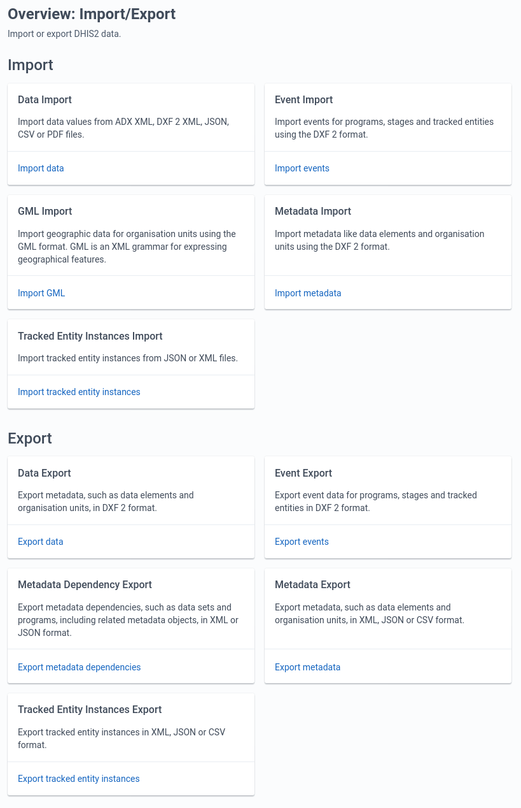
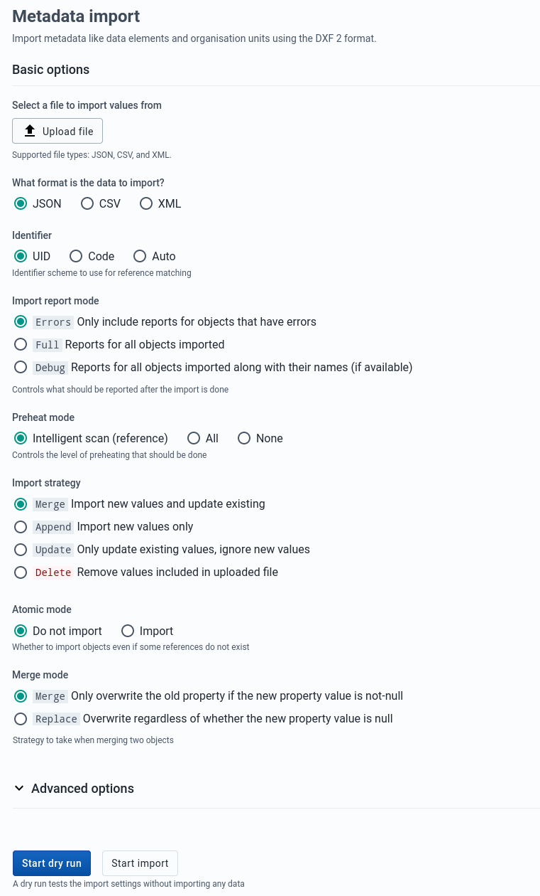
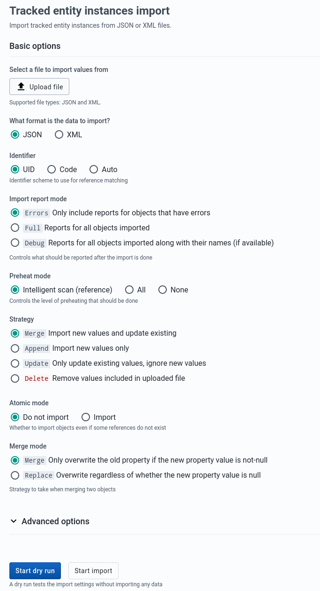
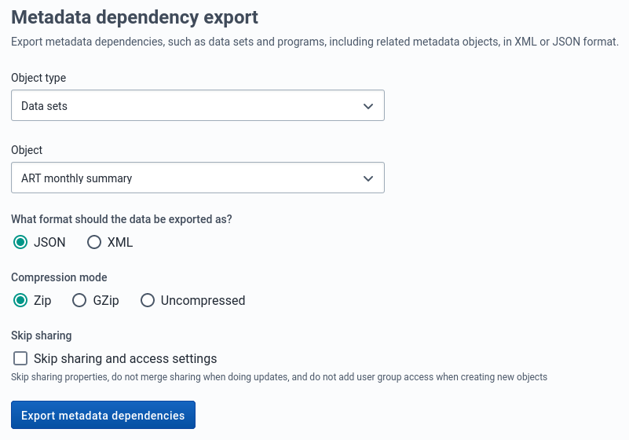
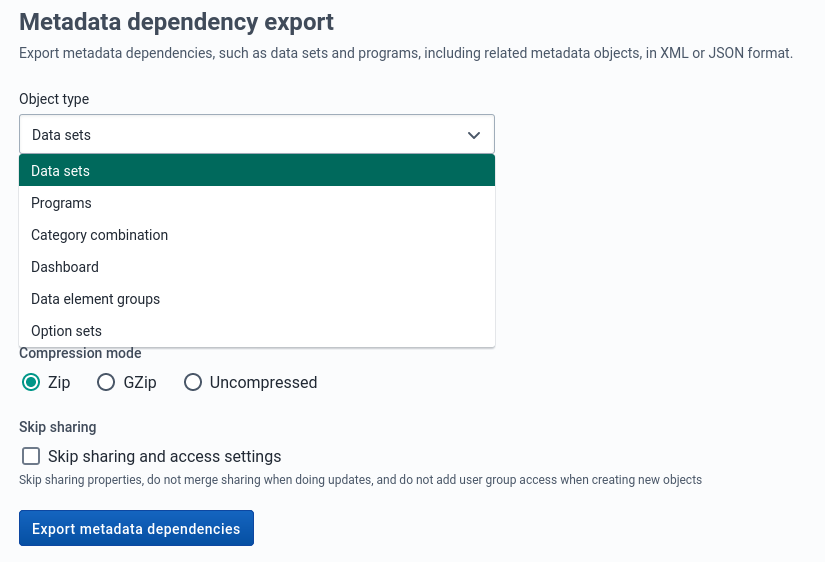
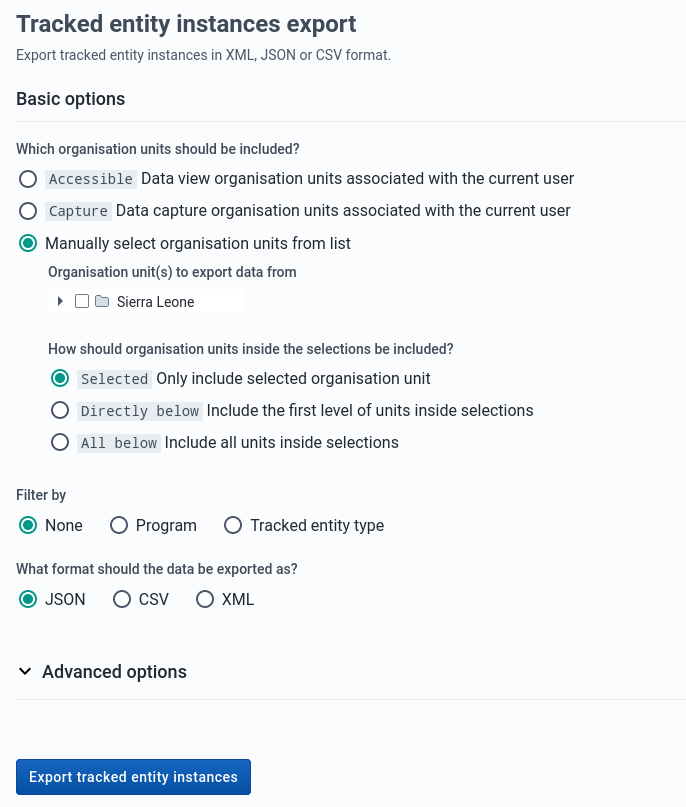
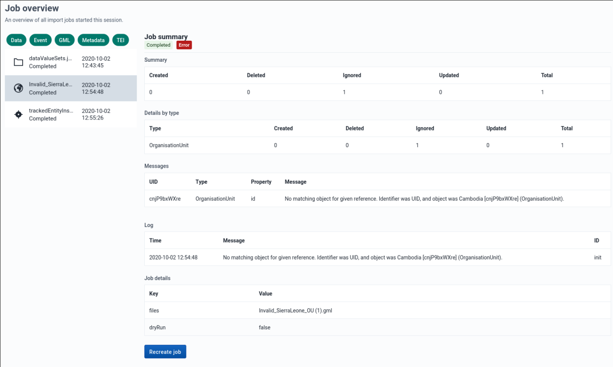

# Import/Export App

<!--DHIS2-SECTION-ID:import_export-->

In a primary health system, the HMIS typically involves a distributed
application, where the same application is running in different
geographical locations (PHCs,CHCs, hospitals, districts, and state).
Many of these physical locations do not have Internet connectivity, and
hence they work off-line. At some point (normally at the district
level), the data needs to be synchronised in order to have a
consolidated database for the a particular geographical region. For
this, it is important to be able to export data from one location (which
is working offline, say at the health facility level) and import into 
another one (say at the district level).
This feature of exporting and importing is thus a crucial function of a HMIS.
This feature also helps us overcome the dependency on the Internet to some
degree, as data updates can be transferred via USB key where there is no
connectivity, or through email where there is limited Internet
connectivity. DHIS2 provides robust export-import functionality to
fulfil these needs.

To access the Import/Export app, search in the top header bar for
Import/Export. Import/Export app offers a number of services details for
which can be found below.

## Importing data

<!--DHIS2-SECTION-ID:importing_data-->

### Import progress logger

<!--DHIS2-SECTION-ID:import_progress_logger-->

No matter what you import ("Data", "Events", "GML", "Metadata" or
"Tracked Entity Instances" data), you can always view the progress of
the import by looking at the "Job Summary" at the top of the page.

### Import Summaries

<!--DHIS2-SECTION-ID:metadata_import_summaries-->

On import request completion, we show import summaries above the
import form. Any conflicts or errors are shown in the table under the
main summary for the import.

### Metadata Import

<!--DHIS2-SECTION-ID:metadata_import-->

Metadata Import can be accessed from the sidebar by clicking on
Metadata Import.

1.  Choose a file to upload

2.  Select from the available formats e.g. *JSON* , *XML* or *CSV*

3.  Select the appropriate settings of:

    * Identifier
    * Import report mode
    * Preheat mode
    * Import strategy
    * Atomic mode
    * Merge mode

4.  Click **Advanced options** if you want to adjust one or more of
    the following settings before importing:

    * Flush mode
    * Skip sharing
    * Skip validation
    * Async
    * Inclusive strategy

5.  Click on the **Import** button which will upload the file and start the
    importing process.

> **Tip**
> 
> **It is highly recommend to use the Dry run option** to test before
> importing data; to make sure you keep control over any changes to your
> Metadata, and to check for problems with out-of-sync data elements or
> organisation unit names

> **Note**
> 
> If an organisation unit e.g. `Nduvuibu MCHP` had a unknown reference to an object with ID `aaaU6Kr7Gtpidn`, it means that the object with ID `aaaU6Kr7Gtpidn` was not present in your imported file, and it was not found in the existing database. 
>
> You can control this using **Identifier** option, to indicate if you want to allow objects with such invalid references to be imported or not. If you choose to import invalid references you will have to correct the reference manually in DHIS2 later.

#### Matching Identifiers in DXF2

<!--DHIS2-SECTION-ID:matching_identifiers_in_dxf2-->

The DXF2 format currently support matching for two identifiers, the
internal DHIS2 identifier (known as a UID), and also using an external
identifier called called a "code". When the importer is trying to search
for references (like the one above), it will first go to the UID field,
and then to the code field. This allows you to import from legacy
systems without having a UID for every meta-data object. I.e. if you are
importing facility data from a legacy system, you can leave out the ID
field completely (DHIS2 will fill this in for you) and put the
legacy system's own identifiers in the code field, this identifier is
required to be unique. This not only works for organisation units, but
for all kinds of meta-data, allowing for easy import from other systems.

### Data Import

<!--DHIS2-SECTION-ID:import-->

Data Import can be accessed from the sidebar by clicking on Data
Import.

1.  Choose a file to upload

2.  Select from the available formats: *JSON*, *XML*, *PDF*,
    *ADX* or *CSV*

3.  Select the appropriate settings of:

    * Strategy
    * Preheat cache

4.  Click **Advanced options** if you want to adjust one or more of
    the following settings before importing:

    * Data element ID scheme
    * Org unit ID scheme
    * ID scheme
    * Skip existing check

5.  Click on the **Import** button which will upload the file and start the
    importing process.

> **Tip**
> 
> **It is highly recommend to use the Dry run option** to test before
> importing data; to make sure you keep control over any changes to your
> Metadata, and to check for problems with out-of-sync data elements or
> organisation unit names

#### PDF Data

<!--DHIS2-SECTION-ID:importPDFdata-->

DHIS2 supports import of data in the PDF format. This can be used to
import data produced by off-line PDF data entry forms. Please refer to
the section **Data set management** for details on how to produce a PDF
form which can be used for off-line data entry.

To import a PDF data file, navigate to the *PDF Data Import* item in the
side menu. Upload the completed PDF file and click *Import*.

### Event Import

<!--DHIS2-SECTION-ID:event_import-->

Event can be access from the sidebar by by clicking on Event
import.

1.  Select from the available formats e.g. *JSON* , *XML* or *CSV*

2.  Click **Advanced options** if you want to adjust one or more of
    the following settings before importing:

    * Event ID scheme
    * Data element ID scheme
    * Org unit ID scheme
    * ID scheme

3.  Click on the **Import** button which will upload the file and start the
    importing process.

### GML Import

<!--DHIS2-SECTION-ID:gml_import-->

GML Import can be accessed from the sidebar by clicking on GML
Import.

1.  Upload a file using the *GML* (Geographic Markup Language) format.

2.  Click on the **Import** button which will upload the file and start the
    importing process.

### Tracked Entity Instances Import

<!--DHIS2-SECTION-ID:tei_import-->

Tracked Entity Instances Import can be accessed from the sidebar by
clicking on TEI Import.

1.  Choose a file to upload

2.  Select from the available formats e.g. *JSON*  or *XML*

3.  Select the appropriate settings of:

    * Identifier
    * Import report mode
    * Preheat mode
    * Import strategy
    * Atomic mode
    * Merge mode

4.  Click **Advanced options** if you want to adjust one or more of
    the following settings before importing:

    * Flush mode
    * Skip sharing
    * Skip validation
    * Inclusive strategy

5.  Click on the **Import** button which will upload the file and start the
    importing process.

> **Tip**
> 
> **It is highly recommend to use the Dry run option** to test before
> importing data; to make sure you keep control over any changes to
> your Tracked Entity Instances.

## Exporting data

### Metadata Export

<!--DHIS2-SECTION-ID:metadata_export-->

Metadata export can be accessed from the sidebar by clicking on
Metadata export.

1.  Choose the list of objects you would like to export.

2.  Choose export *format* *JSON*, *CSV* or *XML*

3.  Choose *compression* type *zip* , *gzip* or *uncompressed*

4.  Choose option *Sharing* with or without sharing.

5.  Click **Export metadata** which will open a new web-browser window
    that will give you a file to download to your local computer.

### Metadata Export with Dependencies

<!--DHIS2-SECTION-ID:metadata_export_dependencies-->

Metadata export with dependencies lets you create canned exports for
metadata objects. This type of export will include the metadata objects
and the metadata object's related objects; that is, the metadata which
belong together with the main object.

<table>
<caption>Object types and their dependencies</caption>
<colgroup>
<col style="width: 50%" />
<col style="width: 50%" />
</colgroup>
<thead>
<tr class="header">
<th>
Object type
</th>
<th>
Dependencies included in export
</th>
</tr>
</thead>
<tbody>
<tr class="odd">
<td>
<strong>Data sets</strong>

<!--DHIS2_SECTION_ID:docs-internal-guid-4a3662ce-63b9-1efd-e640-8ba874d1bcde--></td>
<td>
Data elements

Sections

Indicators

Indicator types

Attributes

Data entry forms

Legend sets

Legends

Category combinations

Categories

Category options

Category option combinations

Option sets
</td>
</tr>
<tr class="even">
<td>
Programs
</td>
<td>
Data entry form

Tracked entity

Program stages

Program attributes

Program indicators

Program rules

Program rule actions

Program rule variables

Program attributes

Data elements

Category combinations

Categories

Category options

Category option combinations

Option sets
</td>
</tr>
<tr class="odd">
<td>
Category combination
</td>
<td>
Category combinations

Categories

Category options

Category option combinations

Attributes
</td>
</tr>
<tr class="even">
<td>
Dashboard
</td>
<td>
Dashboard items

Charts

Event charts

Pivot tables

Event reports

Maps

Reports

Resources
</td>
</tr>
<tr class="odd">
<td>
Data element groups
</td>
<td>
Data elements

Category combinations

Categories

Category options

Category option combinations

Option sets

Attributes

Legend sets

Legends
</td>
</tr>
<tr class="even">
<td>
OptionSets
</td>
<td>
Option
</td>
</tr>
</tbody>
</table>

1.  Select an **Object type** : **Data sets** , **Programs** ,
    **Category combination** , **Dashboard** , **Data element groups** or **OptionSets**.

2.  Select an **Object**.

3.  Select a format: **JSON** or **XML**.

4.  Select **Compression** : **Zip** , **Gzip** or **Uncompressed**.

5.  Click **Export metadata dependencies** which will open a new
    web-browser window that will give you a file to download to your
    local computer.

### Data export

<!--DHIS2-SECTION-ID:data_export-->

Data export can be accessed from the sidebar by clicking on Data
export.

1.  Select the *Organisation Units* .

2.  Select if you want export to include descendants of organisation
    units selected in Step 1 or only the manually selected
    organisation units.

3.  Choose the *Data Sets*.

4.  Set the *Start* and *End Date* .

5.  Select a format: **XML**, **CSV** or **JSON** .

6.  Select **Compression** : **Zip** , **Gzip** or **Uncompressed**.

7.  Click **Advanced options** if you want to adjust one or more of
    the following settings before exporting:

    * Include deleted
    * Data element ID scheme
    * Organisation unit ID scheme
    * ID scheme

8.  Click **Export data** which will open a new web-browser window
    that will give you a file to download to your local computer.

### Event export

<!--DHIS2-SECTION-ID:event_export-->

Event export can be accessed from the sidebar by clicking on Event
export.

You can export event or tracker data in **XML** , **JSON** or **CSV**
formats.

1.  Select an organisation unit.

2.  Select the **Inclusion**:
    
      - **Selected** : Export event data only for the selected
        organisation unit
    
      - **Directly below** : Export event data including the first
        level of the organisation units inside the selections as well
        as the selected organisation unit itself.
    
      - **All below** : Export event data for all organisation units
        inside the selections as well as the selected organisation
        unit itself.

3.  Select a program and a program stage (if applicable).

4.  Select **Start date** and **End date** .

5.  Select a format: **XML** , **JSON** or **CSV**.

6.  Select **Compression** : **Zip** , **Gzip** or **Uncompressed**.

7.  Click **Advanced options** if you want to adjust one or more of
    the following settings before exporting:

    * Include deleted
    * Data element ID scheme
    * Organisation unit ID scheme
    * ID scheme

8.  Click **Export events** which will open a new web-browser window
    that will give you a file to download to your local computer.

### Tracked Entity Instances export

<!--DHIS2-SECTION-ID:tei_export-->

Tracked entity instances export can be accessed from the sidebar by
clicking on TEI export.

You can export event or tracker data in **XML** , **JSON** or **CSV**
formats.

1.  Select the *organisation units* that should be included.

2.  Select whether you want to filter by *program* or *tracked entity
    type*.

6.  Select a format: **XML** , **JSON** or **CSV**.

7.  Click **Advanced options** if you want to adjust one or more of
    the following settings before exporting:

    * Filter by last updated date
    * Assigned user mode
    * Include deleted
    * Include all attributes
    * Data element ID scheme
    * Event ID scheme
    * Organisation unit ID scheme
    * ID scheme

8.  Click **Export tracked entity instances** which will open a new
    web-browser window that will give you a file to download to your
    local computer.

## Job Overview

<!--DHIS2-SECTION-ID:job_overview-->

The job overview page can be accessed from the sidebar by clicking on
*Job Overview*.

This page allows you to see the progress of all the imports you have
started this session. You can see the list of all jobs on the left
side and details about a specific selected job on the right.

### Filtering by import job type

By default jobs of all import types are shown in the job list, but you
can filter categories you are interested in by clicking on the job
type filters above the job list.

### Recreating a previous job

You can recreate previously run import jobs by clicking on the
*Recreate job* button at the bottom of the page, assuming you have
selected a job from the list. This will take you to the correct import
page and fill in all the form details exactly as the job you chose to
recreate.

## Schemes
The various schemes used in many of the import and export pages are
also known as identifier schemes and are used to map metadata objects
to other metadata during import, and to render metadata as part of
exports.

<table>
<caption>Available values</caption>
<colgroup>
<col style="width: 14%" />
<col style="width: 85%" />
</colgroup>
<thead>
<tr class="header">
<th>Scheme</th>
<th>Description</th>
</tr>
</thead>
<tbody>
<tr class="odd">
<td>ID, UID</td>
<td>Match on DHIS2 stable Identifier, this is the default id scheme.</td>
</tr>
<tr class="even">
<td>CODE</td>
<td>Match on DHIS2 Code, mainly used to exchange data with an external system.</td>
</tr>
<tr class="odd">
<td>NAME</td>
<td>Match on DHIS2 Name, please note that this uses what is available as <em>object.name</em>, and not the translated name. Also note that names are not always unique, and in that case, they can not be used.</td>
</tr>
<tr class="even">
<td>ATTRIBUTE:ID</td>
<td>Match on metadata attribute, this attribute needs to be assigned to the type you are matching on, and also that the unique property is set to <em>true</em>. The main usage of this is also to exchange data with external systems, it has some advantages over <em>CODE</em> since multiple attributes can be added, so it can be used to synchronize with more than one system.</td>
</tr>
</tbody>
</table>

### ID scheme
The ID scheme applies to all types of objects, but can be overwritten
by more specific object types.
