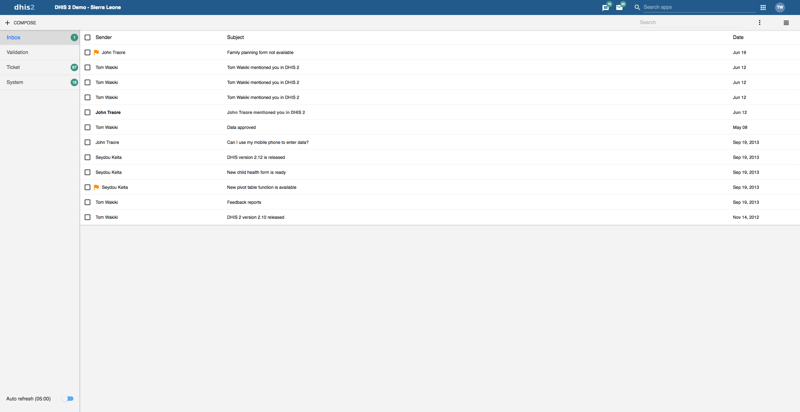
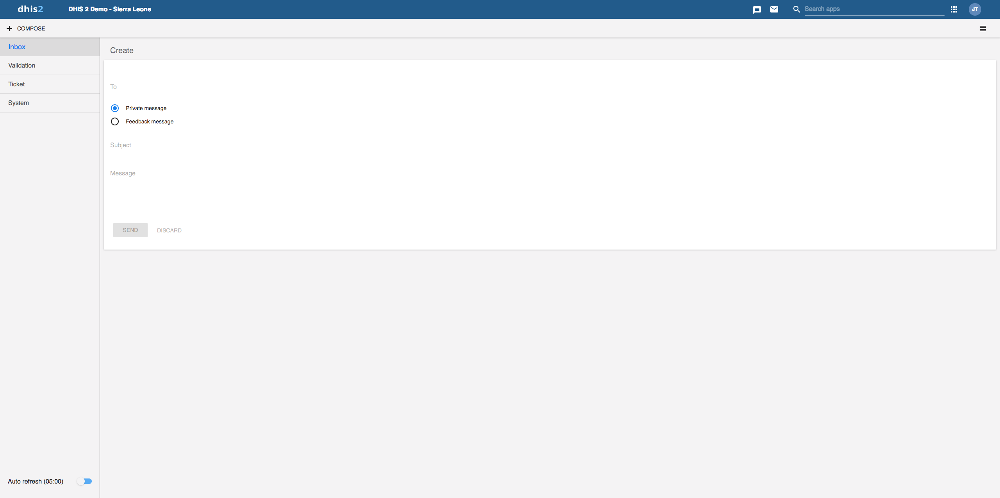
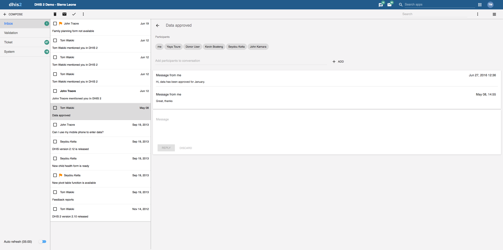
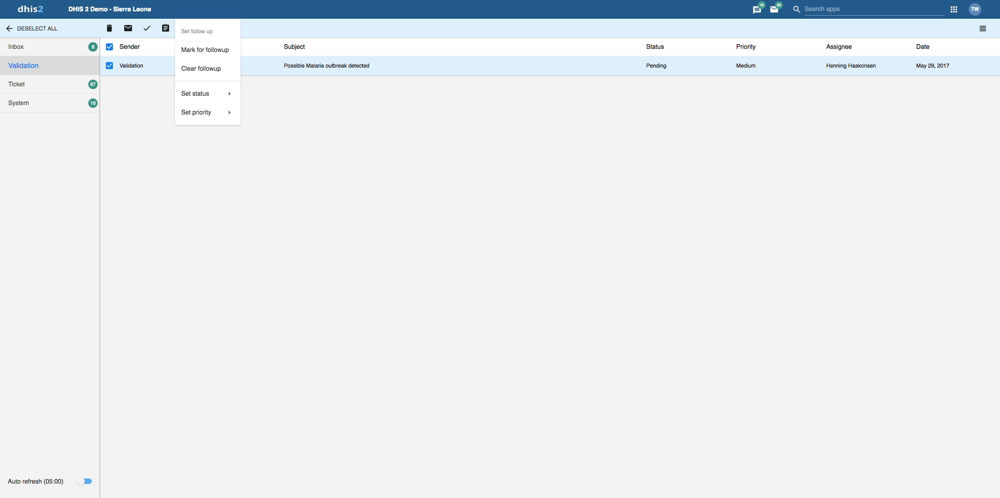

# Messaging

<!--DHIS2-SECTION-ID:messages-->

<!--DHIS2-SECTION-ID:dashboard_messages-->

## About messages and feedback messages

Within DHIS2 you can send messages and feedback messages to users, user
groups and organisation units. When you send a feedback message, it is
routed to a particular user group called the feedback recipient group.
If you are a member of this user group, you have access to feedback
handling tools. You can, for example, set the status of an incoming
feedback to "Pending" while you are waiting for information.

In addition to the user-to-user and feedback messages, depending on your
configuration the system will also send you system-generated messages.
These messages could be triggered by different events, including system
or background job failures and validation analysis results. Feedback
handling tools are also available for validation results and the
priority will be set to the importance of the validation rule violated.

To visit the app click **message icon in header bar** or find the
**Messaging** app in the app search box.

> **Note**
>
> Messages and feedback messages are not sent to users' e-mail
> addresses, the messages only appear within DHIS2.
>
> With 2.30 we introduced a new messaging app which offers a richer
> messaging experience. Specifically:
>
>   - Switch between list view and compact view by clicking the icon in
>     the top right corner.
>     - The list view is simplistic and gives a good
>     overview of all messages and is especially suited for feedback and
>     validation messages.
>     - The compact view is a modern way of view
>     messages where the user has more information in one view, hence
>     viewing and replying several messages is easier.
>
>     The first screenshot in this section displays list view, while the
>     screenshot in section **Read a message** displays the compact
>     view.
>
>   - A new search field is added which enables the user to search for
>     messages. The search filters messages on different message
>     attributes; subject, text and senders. This implies that you are
>     able to narrow down the message conversation list by entering a
>     search.
>
>   - A auto refresh feature is added so that the app fetches new
>     messages at a set interval, every 5 minutes. This feature is
>     disabled by default.
>
>   - For every message conversation you are able to add participants to
>     the conversation. This is very useful if you want input on that
>     particular conversation or if someone should also see the
>     information. It is not possible to delete participants from a
>     conversation.

## Create a message

1.  Click **Compose**.

2.  Define who you want to receive the message. You can send a message
    to organisation units, users and user groups.

      - In the **To** field you can search for organisation units, users
        and user groups and select the wished recipients.

3.  Type a subject and a message.

4.  Click **Send**.

## Read a message

1.  Select the appropriate message type to the left.

2.  Click a message.

    If the message is part of a conversation, you will see all messages in
    this conversation.

## Create a feedback message

1.  Follow the steps as for creating a message, only selecting
    **Feedback message** instead of entering recipients.

2.  The message will be created as a feedback message and will appear in
    all of the specified users' **Ticket** folder.

## Attachments

With 2.31 we introduced attachments to messages. When creating or
replying to a message conversation you have the possibility to add
attachments. Currently there are no limitations to type or size of the
file.

## Manage validation and feedback messages

> **Note**
>
> You will only see feedback messages and have access to the extended
> handling tools if you are a member of the user group that is set up to
> handle feedback messages.
>
> With the new app you manage extended tools for tickets and validation
> messages through the icon menu which appears when viewing a message or
> checking of messages in the conversation list.

### All messages selected

### All messages selected and extended choice picker selected

You will receive feedback messages to your **Ticket** folder and
validation messages to your **Validation** folder. For feedback and
validation messages you have the following options in addition to the
messages options:

<table style="width:100%;">
<caption>Feedback handling tools</caption>
<colgroup>
<col width="23%" />
<col width="76%" />
</colgroup>
<thead>
<tr class="header">
<th>Function</th>
<th>Description</th>
</tr>
</thead>
<tbody>
<tr class="odd">
<td>
<strong>Priority</strong>
</td>
<td>
You can mark a feedback/validation message with different priorities: <strong>None</strong>, <strong>Low</strong>, <strong>Medium</strong> or <strong>High</strong>.

Setting the priority makes it easier to keep track of which feedback message you need resolved first, and which feedback messages that can wait.
</td>
</tr>
<tr class="even">
<td>
<strong>Status</strong>
</td>
<td>
All feedback/validation messages get the status <strong>Open</strong> when created.

To keep track of existing feedback messages, you can change the status to <strong>Pending</strong>, <strong>Invalid</strong> or <strong>Solved</strong>.

You can filter feedback/validation messages based on their status with the two drop down menus in the internal header bar.
</td>
</tr>
<tr class="odd">
<td>
<strong>Assigned to</strong>
</td>
<td>
You can assign a feedback message to any member of the user group that is set up to handle feedback messages.

You can assign a validation message to any user in the system.

<strong>-</strong> means that you haven't assigned a user to the feedback message.
</td>
</tr>
<tr class="even">
<td>
<strong>Internal reply</strong>
</td>
<td>
When you work in a feedback handling team you might want to discuss the feedback before sending an answer to the sender. You can keep this discussion in the same message conversation as the feedback itself.

To send a reply that within the feedback handling user group, click <strong>INTERNAL REPLY</strong>.
</td>
</tr>
</tbody>
</table>

## Configure feedback message function

To configure the feedback message function, you must:

1.  Create a user group (for example "Feedback message recipients") that
    contains all the users who should receive feedback messages.

2.  Open the **System Settings** app and click **General** \> **Feedback
    recipients** and select the user group you created in the previous
    step.
