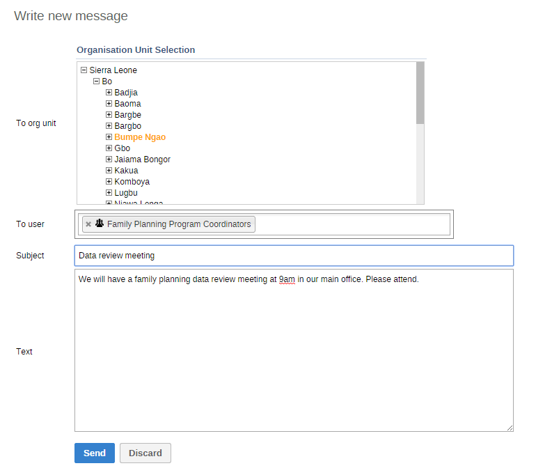
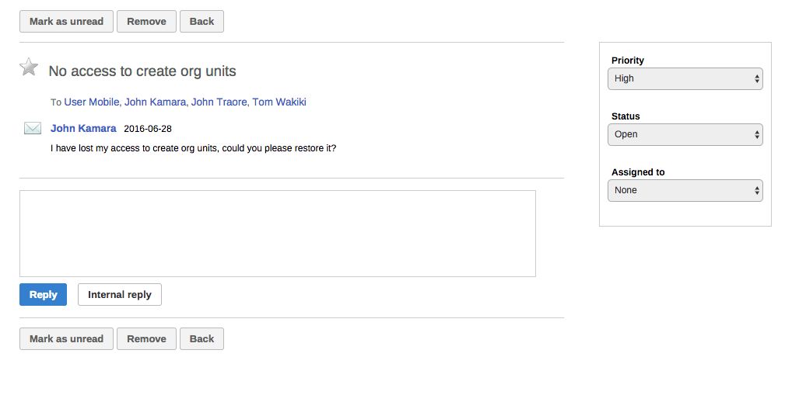

# Messaging

<!--DHIS2-SECTION-ID:messages-->

<!--DHIS2-SECTION-ID:dashboard_messages-->

## About messages and feedback messages

Within DHIS2 you can send messages and feedback messages to users, user
groups and organisation units. When you send a feedback message, it is
routed to a particular user group called the feedback recipient group.
If you are a member of this user group, you have access to feedback
handling tools. You can, for example, set the status of an incoming
feedback to "Pending" while you are waiting for information.

In addition to the user-to-user and feedback messages, depending on your
configuration the system will also send you system-generated messages.
These messages could be triggered by different events, including system
or background job failures and validation analysis results. Feedback
handling tools are also available for validation results and the
priority will be set to the importance of the validation rule violated.

> **Note**
>
> Messages and feedback messages are not sent to users' e-mail
> addresses, the messages only appear within DHIS2.

## Create a message

1.  From the **Dashboard**, click **Messages**.

2.  Click **Write message**.

3.  Define who you want to receive the message. You can send a message
    to organisation units, users and user groups.

      - In the **To org unit** field, select the organisation units or
        group of organisation units you want to send the message to.

      - In the **To user** field, select the users or user groups you
        want to send the message to.

4.  Type a subject and a message.

5.  Click **Send**.

## Read a message

1.  From the **Dashboard**, click **Messages**.

2.  Click a message.

    If the message is part of a conversation, you will see all messages in
    this conversation.

## Create a feedback message

1.  From the **Dashboard**, click **Write feedback**.

2.  Type a subject and a feedback message.

3.  Click **Send**.

    The feedback message will appear in all of the specified users'
    inboxes.

## Manage feedback messages

> **Note**
>
> You'll only see feedback messages and have access to the feedback
> handling tools if you are a member of the user group that is set up to
> handle feedback messages.

You'll receive feedback messages to your **Messages** inbox. For
feedback messages you've the following options in addition to the
messages options:

<table>
<caption>Feedback handling tools</caption>
<colgroup>
<col width="23%" />
<col width="76%" />
</colgroup>
<thead>
<tr class="header">
<th>Function</th>
<th>Description</th>
</tr>
</thead>
<tbody>
<tr class="odd">
<td>
<strong>Priority</strong>
</td>
<td>
You can mark a feedback message with different priorities: <strong>None</strong>, <strong>Low</strong>, <strong>Medium</strong> or <strong>High</strong>.

Setting the priority makes it easier to keep track of which feedback message you need resolved first, and which feedback messages that can wait.
</td>
</tr>
<tr class="even">
<td>
<strong>Status</strong>
</td>
<td>
All feedback messages get the status <strong>Open</strong> when created.

To keep track of existing feedback messages, you can change the status to <strong>Pending</strong>, <strong>Invalid</strong> or <strong>Solved</strong>.

You can filter feedback messages in your inbox based on their status. This makes it easier to switch between feedback messages and normal messages.
</td>
</tr>
<tr class="odd">
<td>
<strong>Assigned to</strong>
</td>
<td>
You can assign a feedback message to any member of the user group that is set up to handle feedback messages.

<strong>None</strong> means that you haven't assigned a user to the feedback message.
</td>
</tr>
<tr class="even">
<td>
<strong>Internal reply</strong>
</td>
<td>
When you work in a feedback handling team you might want to discuss the feedback before sending an answer to the sender. You can keep this discussion in the same message conversation as the feedback itself.

To send a reply that within the feedback handling user group, click <strong>Internal reply</strong>.
</td>
</tr>
</tbody>
</table>

## Configure feedback message function

To configure the feedback message function, you must:

1.  Create a user group (for example "Feedback message recipients") that
    contains all the users who should receive feedback messages.

2.  Open the **System Settings** app and click **General** \> **Feedback
    recipients** and select the user group you created in the previous
    step.
