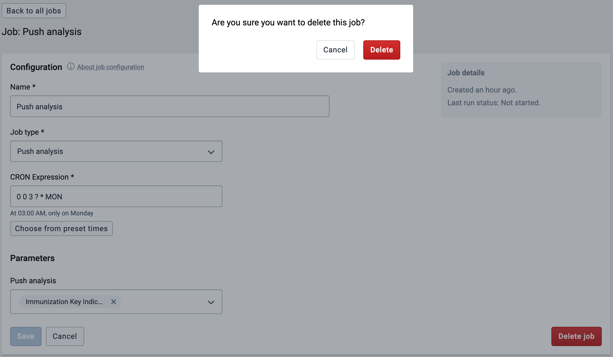

# Scheduling

<!--DHIS2-SECTION-ID:scheduling-->

The Scheduler is an application for managing background jobs in DHIS2.
Background jobs can do a number of tasks, such as running analytics,
synchronizing data and meta data, or sending a push analysis report. The
application provides the ability to create, modify and delete such jobs.

The Scheduler comes bundled with DHIS2 and is accessed through the App
Menu.

The start page of the Scheduler app shows an overview of existing jobs.
By default, pre-defined system jobs are hidden. To view these, toggle
*Show system jobs* in the top right corner.

When you create or modify a job, it will be rescheduled according to
selected preferences. To run a job on demand, press the green triangle
labelled "Run now". This action is only available for enabled jobs.

## Creating a job

<!--DHIS2-SECTION-ID:scheduling_create_job-->

1.  Open the **Scheduler** app and click the add button in the bottom
    right corner.

2.  Choose a suitable **Name** for the new job.

3.  Select a running frequency for the job, i.e. when and how often the
    job should run.

    1.  You can either select a predefined frequency from the
        drop-down menu, or

    2.  You can give the job a custom **Cron expression** if you want a
        specific schedule, using the [Spring scheduling](https://docs.spring.io/spring/docs/current/javadoc-api/org/springframework/scheduling/support/CronSequenceGenerator.html) syntax.
        
    3.  Enabling the **Continuous execution** option will make the job
    run constantly. In other words, as soon as the job finishes, it
        will be scheduled to run again right away. Selecting this option
        will disable the other fields.
    
4.  Select the **Job type** you want to schedule using the
    drop-down menu.

5.  If the job type is customizable, a **Parameters** section will
    appear below. These additional options specify the details of the
    scheduled job, and will vary greatly depending on the job type.

6.  Press the **Add job** button to confirm the job creation. The newly
    created job should now be listed in the job overview, given that the
    **Show system jobs** setting is not enabled.

Jobs are enabled by default.

## Configuring a job

<!--DHIS2-SECTION-ID:scheduling_configure_job-->

With the proper permissions, you can modify the details of user-created
jobs. Note that for system jobs, only the schedule (cron expression) can
be changed.

To quickly enable or disable a user created job from running, use the
**Enabled** column on the landing page of the Scheduler app. System jobs
are always enabled.

Further configuring a job:

1.  Select a job from the landing page to unveil the **Attributes** and
    change them to accordingly. See the previous section for scheduling
    details.

2.  If the job type supports extra options, the **Parameters** section
    will also be available.

3.  When done, press the **Save changes** button to persist the changes.

## Deleting a job

<!--DHIS2-SECTION-ID:dataAdmin_scheduler_delete-->

1.  Select the job you want to delete.

2.  Press the **Delete** button in the bottom right corner.

3.  Confirm by pressing **Delete** again in the pop-up window.

## Job types

The following section describes the various job types.

### Resource table

<!--DHIS2-SECTION-ID:scheduling_resource_table-->

The resource table job is responsible for generating and updating the resource database tables. These tables are used by various components in DHIS 2 and is meant to simplify queries against the database.

Note that when specifying any of the analytics table jobs, resource tables can be part of the process and it is not necessary to also specify a resource table job.

### Analytics table

<!--DHIS2-SECTION-ID:scheduling_analytics_table-->

The analytics tables job is responsible for generating and updating the analytics tables. The analytics tables are used as basis for data analytics queries in DHIS2. Apps such as dashboard, visualizer and maps retrieve data from these tables through the DHIS2 analytics API, and they must be updated in order for analytics data to become available. You can schedule this process to run regularly through an analytics table job type.

The analytics table job will by default populate data for all years and data elements. The following parameters are available:

- **Last years:** The number of last years to populate analytics tables for. As an example, if you specify 2 years, the process will update the two last years worth of data, but not update older data. This parameter is useful to reduce the time the process takes to complete, and is appropriate if older data has not changed, and when updating the latest data is desired.
- **Skip resource tables:** Skip resource tables during the analytics table update process. This reduces the time the process takes to complete, but leads to changes in metadata not being reflected in the analytics data.
- **Skip table types:** Skip one or more analytics table types. This reduces the time the process takes to complete, but leads to those data types not being updated in analytics data.

### Continuous analytics table

<!--DHIS2-SECTION-ID:scheduling_continuous_analytics_table-->

The analytics tables job is responsible for generating and updating the analytics tables. The analytics tables are used as basis for data analytics queries in DHIS2. Apps such as dashboard, visualizer and maps retrieve data from these tables through the DHIS2 analytics API, and they must be updated in order for analytics data to become available. You can schedule this process to run regularly through an analytics table job type.

The continuous analytics table job is based on two phases:

- _Latest update:_ Update of the latest data, where latest refers to the data which has been added, updated or removed since the last time the latest data or the full data was updated. This process will happen frequently.
- _Full update:_ Update of all data across all years. This process will happen once per day.

The continuous analytics table job will frequently update the latest data. The latest data process utilizes a special database partition which is used to hold the latest data only. This partition can be quickly refreshed due to the relatively small amount of data. The partition will grow in size until a full update is performed. Once per day, all data for all years will be updated. This will clear out the latest partition.

The analytics table job will by default populate data for all years and data elements. The following parameters are available:

- **Full update hour of day:** The hour of the day at which the full update will be done. As an example, if you specify 1, the full update will be performed at 1 AM. 
- **Last years:** The number of last years to populate analytics tables for. As an example, if you specify 2 years, the process will update the two last years worth of data, but not update older data. This parameter is useful to reduce the time the process takes to complete, and is appropriate if older data has not changed, and when updating the latest data is desired.
- **Skip resource tables:** Skip resource tables during the analytics table update process. This reduces the time the process takes to complete, but leads to changes in metadata not being reflected in the analytics data.

### Data synchronization

<!--DHIS2-SECTION-ID:scheduling_data_sync-->

DHIS2 provides synchronisation of data between remotely distributed
instances and a central instance of DHIS2. This can be useful e.g. when
you have deployed multiple stand-alone instances of DHIS2 which are
required to submit data values to a central DHIS2 instance. Both tracker
data and aggregate data synchronization is supported.

These are the steps to enable data synchronization:

- Go to Synchronization Settings, enter the remote server URL,
  username and password. Press the TAB button to automatically save
  the new password. Refresh the page and check that the filled values
  are still present. Note that the password field will be empty after
  the refresh, since this value is encrypted, so you can consider it
  saved.

- Using the Scheduler app, create a new job using the "Event Programs 
  Data Sync" and/or "Tracker Programs Data Sync" job type. Make sure it 
  is enabled when you finish. (Note: If the "Program Data Synchronization" 
  job, available in previous versions, was set up in Scheduler app before, 
  it was automatically replaced by the two new jobs "Event Programs Data Sync" 
  and "Tracker Programs Data Sync" with the identical settings. )

Some aspects of the data synchronization feature to be aware of:

- The local DHIS2 instance will store the password of the user account
  on the remote instance encrypted in the local database. The remote
  account is used for authentication when transferring data. For
  security purposes make sure you set the _encryption.password_
  configuration parameter in _hibernate.properties_ to a strong
  password.

- Deploying the remote server on SSL/HTTPS is strongly recommended as
  the username and password are sent in clear text using basic
  authentication and could be intercepted by an attacker.

- The data synchronization uses the UID property of data elements,
  category option combos and organisation units to match the
  meta-data. Hence the synchronization is dependent on these three
  meta-data objects being harmonized on the local and remote instance
  in order to work appropriately.

- The first time DHIS2 runs the synchronization job, it will include
  any data available. The subsequent synchronization jobs will only
  include data added and changed since the last successful job. A
  synchronization job is considered successful only if all the data
  was saved successfully on the remote server (Any data successfully
  synced will remain on the receiving instance, regardless if the job
  eventually fails). Whether the job was successful or not can be
  decided from the import summary returned from the central server.

- The initial synchronization job may take a significant amount of
  time, possibly slowing down your instance, depending on how much
  data is being synchronized. It could be a good idea to configure the
  job to run when there are few online users, then later change this
  to your own preference. If you do not want or need to synchronize all 
  the data, there is a possibility to <a href="#skip_changed_before">skip 
  some of the data being synchronised</a>.

  When DHIS2 synchronizes tracker data, it determines the set of data
  to synchronize based on the last time it was synchronized. Each of
  the tracked entity instances and events have their own records of
  when they where last successfully synchronized.

- The system will start a synchronization job based on the rules set
  in the configuration of the job. If the synchronization job starts
  while there is no connection to the remote server, it will retry up
  to three times before it aborts. The job will run again at a
  scheduled time.

- The server handles each set of programs separately, which means one
  set of programs can be synchronized successfully, while the other
  fails. The failure or success of one doesn't influence the other, as
  the last successful synchronization time is tracked individually for
  each item as previously mentioned.

- The attributes of TrackedEntityInstances (TrackedEntityAttribute)
  and the data elements of ProgramStages (ProgramStageDataElement)
  which have an option "Skip synchronization" turned on will not be
  synchronized. This feature allows you to decide to not synchronize
  some sensitive or not relevant data and to keep them only locally.

- The authority `Ignore validation of required fields in Tracker and Event Capture`
  (`F\_IGNORE\_TRACKER\_REQUIRED\_VALUE\_VALIDATION`) should be used when
  there is a requirement that some mandatory attribute / data element
  has at the same time a "Skip synchronization" property turned on.
  Such a setting will lead to validation failure on the central server
  as the given attribute / data element will not be present in the
  payload.

  The validation won't fail for the user with this authority. The
  authority should be assigned to the user, on the central server,
  that will be used for synchronization job.
  
- In specific cases, **the initial synchronization of all the data can be undesirable**; 
  for example, when a database on the local instance is a fresh copy of the 
  database present on the central instance, or when it is preferred to not 
  synchronize old data in favor of initial synchronization taking less 
  time. 
  
  The *syncSkipSyncForDataChangedBefore* SettingKey can be used to skip 
  the synchronisation of all the data (data values, Event and Tracker 
  program data, complete data set registrations) that were *last 
  changed before the specified date*. The `SettingKey` is used in the 
  synchronization job all the time. Therefore, if you need to synchronize 
  the old data, you should change the `SettingKey`.
  
- Both Tracker Programs and Event Programs synchronization job supports 
  paging in order to avoid timeouts and to deal with unstable network.
  Default page size for "Event Programs Data Sync" job is set to 60. 
  Default page size for "Tracker Programs Data Sync" job is set to 20.
  
  If default values do not fit your purpose, own page size can be specified 
  via parameter in particular sync job in Scheduler app.

### Metadata Synchronization Scheduling

<!--DHIS2-SECTION-ID:scheduling_metadata_sync-->

DHIS2 provides a feature for synchronizing meta data from a remote
instance to a local instance of DHIS2. This can be useful when you have
deployed multiple stand-alone instances of DHIS2 and you need to create
meta data in all the local instances similar to the central DHIS2
instance.

These are the steps to enable meta data synchronization:

- Go to Settings \> Synchronization, enter the remote server URL,
  username and password and click Save.

- Go to Metadata administration \> Scheduling. Under Metadata
  synchronization set strategy to Enabled, select the time-period and
  click Start.

Some aspects of the meta data synchronization feature to be aware of:

- The local DHIS2 instance will store the password of the user account
  of the remote instance in its database. The remote user account is
  used for authentication when transferring/downloading data. For
  security purposes make sure you set the _encryption.password_
  configuration parameter in _hibernate.properties_ to a strong
  password.

- Deploying the remote server on SSL/HTTPS is strongly recommended as
  the username and password are sent in clear text using basic
  authentication and could be intercepted by an attacker.

- Also ensure that the remote user is not having ALL authority,
  instead simply create a user with F\_METADATA\_MANAGE authority so
  that even if these details are intercepted by a hacker, one cannot
  have full control of the remote system.

- The meta data synchronization relies on the underlying import layer.
  Each meta data version is an export of meta data between two given
  timestamps. Each sync of meta data version is an attempt to import
  that meta data snapshot into the local instance. The sync of
  versions is incremental. The local instance will try to download the
  meta data versions from the central instance one after the other.
  Failure to sync a specific meta data version will not let the sync
  proceed to further versions. In case of failures, appropriate
  changes must be made to meta data at central to ensure that the
  error gets resolved. Metadata configuration is critical and the
  user should be careful while rolling out the updates to the
  production. It's always recommended to have staging environments in
  place to ensure the sanity of the meta data versions and their
  impact thereafter. The local instance will sync the meta data from
  first version so that harmony is maintained and local and central
  instance will work appropriately.

- The system will attempt a synchronization at the scheduled time. If
  the local or remote server does not have a working Internet
  connection at the time, the synchronization will be aborted and
  re-attempted after as per the retry count as mentioned in the
  _dhis.conf_ file.

- You can see the time of last successful synchronization with remote
  server in the scheduling screen next to the "Last success" label.
