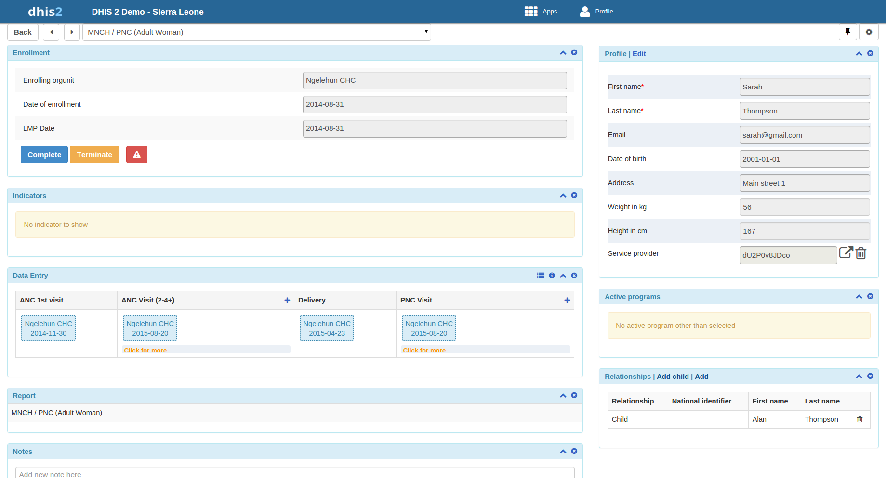
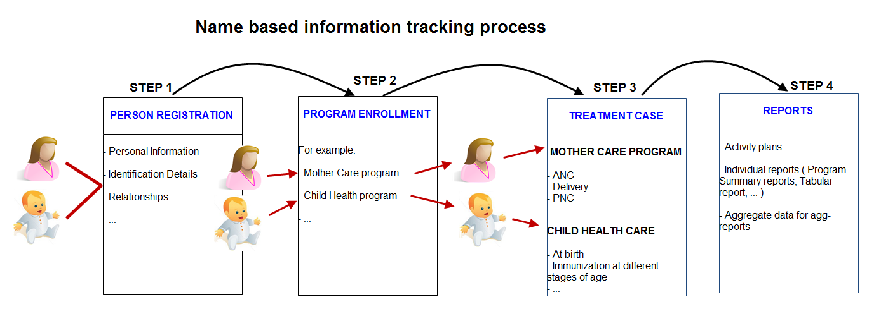
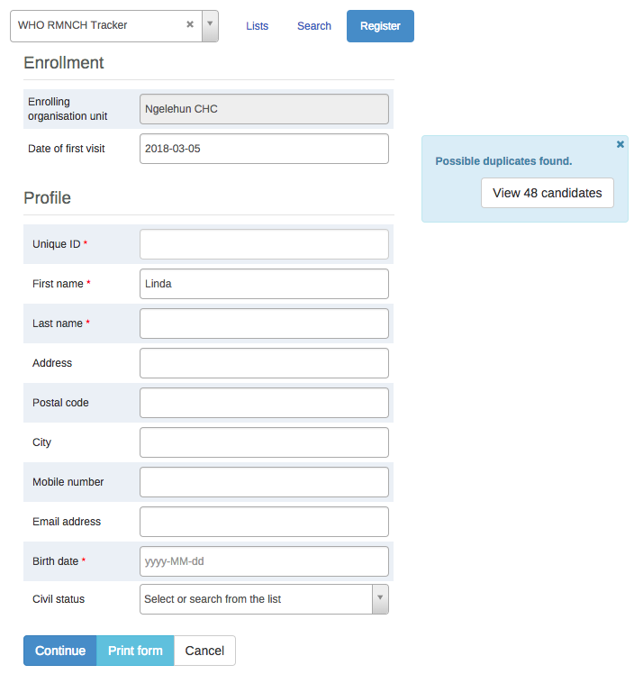
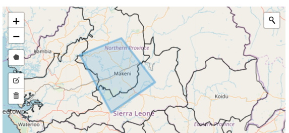
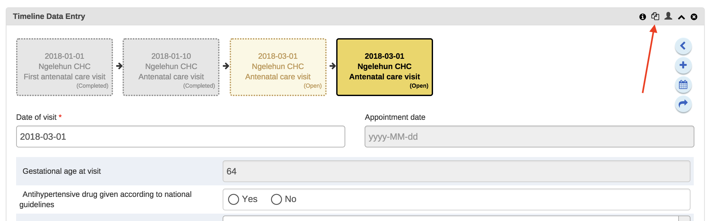
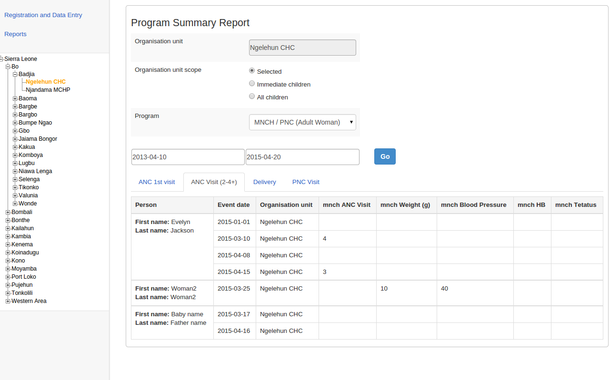

# Using the Tracker Capture app

<!--DHIS2-SECTION-ID:tracker_capture_app-->

## About the Tracker Capture app

<!--DHIS2-SECTION-ID:about_tracker_capture_app-->

The **Tracker Capture** app is an advanced version of the **Event
Capture** app.

  - **Event Capture**: handles single events *without* registration

  - **Tracker Capture**: handles multiple events (including single
    event) *with* registration.

  - You capture event data for a registered tracked entity instance
    (TEI).

  - You only see programs associated with the organisation unit you've
    selected and programs you've access to view through your user role.

  - The options you see in the search and register functions depend on
    the program you've selected. The program attributes control these
    options. The attributes also decide the columns names in the TEI
    list.
    
    If you don't select a program, the system picks default attributes.

  - Both skip-logic and validation error/warning messages are supported
    during registration.

  - When you close an organisation unit, you can't register or edit
    events to this organisation unit in the **Tracker Capture** app. You
    can still search for TEIs and filter the search results. You can
    also view the dashboard of a particular TEI.

## About tracked entity instance (TEI) dashboards

<!--DHIS2-SECTION-ID:about_tracked_entity_instance_dashboard-->

You manage a TEI from the TEI's dashboard in the **Tracker Capture**app.

  - The dashboard consist of widgets. Drag and drop the widgets to place
    them in the order and in the position you want.

  - Click the pin icon to stick the right column of widgets to a fix
    position. This is useful especially during data entry.
    
    If you have many data elements or big form to fill in, stick the
    right widget column. Then all the widgets you've placed in the right
    column remain visible while you scroll in the data entry part.

  - Any indicator defined for the program you've selected will have its
    value calculated and displayed in the **Indicators** widget.

  - Navigation:
    
      - **Back**: takes you back to the search and registration page
    
      - Previous and next buttons: takes you to the previous or next TEI
        dashboard in the TEI search results list
    
    <!-- end list -->
    
      - **Other programs** field: if the TEI is enrolled in other
        programs, they're listed here. Click a program to change the
        program for which you enter data for the selected TEI. When you
        change programs, the content in the widgets change too.

## Workflow

<!--DHIS2-SECTION-ID:workflow_tracker_capture-->

Working process of Mother and child health
program

1.  Create new or find existing TEI.
    
    You can search on defined attributes, for example name or address.

2.  Enroll TEI in a program.

3.  Based on the services of the program by the time, the app creates an
    activity plan for the TEI.

4.  The TEI is provided with various services depending on the program.
    All services are recorded.

5.  Use information about the individual cases to create reports.

## Create a TEI and enroll it in a program

<!--DHIS2-SECTION-ID:create_and_enroll_tracked_entity_instance-->

You can create a TEI and enroll that TEI to a program in one operation:

1.  Open the **Tracker Capture** app.

2.  In the organisation unit tree in the left hand pane, select an
    organisation unit.

3.  Select a program.

4.  Click **Register**.

5.  Fill in the required information.

    Both tracked entity type and program can be configured to use a feature type.
    This makes it possible to capture geometry for either the TEI or the enrollment.
    Supported feature type is Point and Polygon. Please see **How to use geometry**.

6.  If searching for program is configured, a background search will be
    performed on searchable fields to help you prevent registering
    duplicates. If there is any matching TEIs, a blue box will be
    displayed on the right side of the form with the possibility to view
    these matching
TEIs.

If there is any matching TEIs, click **Continue** to review possible
duplicates before registering a new one.

If there is no matching TEIs, click **Save and continue** or **Save and
add new**

  - **Save and continue**: completes the registration and opens the
    registered TEI's dashboard

  - **Save and add new**: completes the registration but stays on the
    same page. Use this option when you want to register and enroll one
    TEI after another without enter data.

(img integrated search)

## Open an existing TEI dashboard

<!--DHIS2-SECTION-ID:open_existing_tracked_entity_instance_dashboard-->

There are multiple ways to find a TEI: Using the "Lists" which is
predefined lists in the current selection, or "Search" for global
lookup.

### Lists

<!--DHIS2-SECTION-ID:simple_tracked_entity_instance_search-->

Lists is used to find and display TEIs in the selected organisation unit
and program.

1.  Open Tracked Capture app

2.  In the organisation unit tree in the left hand pane, select an
    organisation unit

3.  Select a program

4.  Click the "Lists" button if not already selected

If not configured, a set of predefined lists will be available:

1.  Any TEI with any enrollment status

2.  TEIs with an active enrollment of the current program

3.  TEIs with a completed enrollment of the current program

4.  TEIs with a cancelled enrollment of the current program

You can select which columns to show or hide in the lists for each
program. This will be saved in your user settings.

1.  Click the **grid** icon button

2.  Check the columns you want to include

3.  Click **Save**

There is also an option to create a custom working list with own
filters. This can be used to create custom lists on the fly.

Lists can also be downloaded or printed.

### Search

<!--DHIS2-SECTION-ID:advanced_tracked_entity_instance_search-->

Search is used to search for TEIs in the organisation units the user has
search access to. This can be used if you want to find a TEI, but you
dont know which organisation unit or program the TEI was enrolled in.
There are two ways of doing this: With and without a program context.
Searchable fields needs to be configured. For configuring searching with
program context, this is done individually for each program in the
program maintenance app. For configuring searching without a program
context, this is done individually for each tracked entity type in the
tracked entity type maintenance app.

**Searching without a program context:**

1.  Open **Tracker Capture app**

2.  Click the **Search** button

3.  Searchable fields will be displayed in groups. Unique attributes is
    only individually searchable. Non-unique attributes can be combined.

4.  Fill in search criteria and click the **search** icon button.

**Searching with a program context:**

1.  Open **Tracker Capture app**

2.  Select an organisation unit which has the program you wish to search
    in

3.  Select the program

4.  Click the **Search** button

5.  Searchable fields will be displayed in groups. Unique attributes is
    only individually searchable. Non-unique attributes can be combined.

6.  Fill in search criteria and click the **search** icon button

After the search has been done, you will be presented with the search
result. Whats displayed depends on the outcome of the search.

For unique attribute search:

  - If no matching TEI found, you will get the possibility to open the
    registration form.

  - If the TEI was found in the selected organisation unit, the TEI
    dashboard will automatically open.

  - If the TEI was found in outside the selected organisation unit, you
    will get the possibility to open the TEI.

For non-unique attributes search:

  - If no matching TEI's found, you will get the possibility to open the
    registration form.

  - If matching TEI's found, you can either click on any TEI in the
    result list, or open the registration form.

  - If a too large number of matches was found, you will be prompted to
    refine your search criteria

When choosing to open the registration form, the search values will
automatically be filled into the registration form.

### Breaking the glass

<!--DHIS2-SECTION-ID:break_glass-->

If the program is configured with access level **protected**, and the
user searches and finds tracked entity instances that is owned by
organisation unit that the user does not have data capture authority
for, the user is presented with the option of breaking the glass. The
user will gove a reason for breaking the glass, then gain temporary
ownership of the tracked entity
instance.

## Enroll an existing TEI in a program

<!--DHIS2-SECTION-ID:enroll_existing_tracked_entity_instance_in_program-->

1.  Open the **Tracker Capture** app.

2.  Open an existing TEI dashboard.

3.  Select a program.

4.  In the **Enrollment** widget, click **Add new**.

5.  Fill in the required information and click **Enroll**.

## Enter event data for a TEI

<!--DHIS2-SECTION-ID:enter_event_data_for_tracked_entity_instance-->

### Widgets for data entry

#### 

In a TEI dashboard, you enter event data in the **Timeline Data entry**
or **Tabular data entry** widgets.

<table>
<caption>Data entry widgets in the Tracker Capture app</caption>
<colgroup>
<col style="width: 31%" />
<col style="width: 68%" />
</colgroup>
<thead>
<tr class="header">
<th>
Widget name
</th>
<th>
Description
</th>
</tr>
</thead>
<tbody>
<tr class="odd">
<td>
<strong>Timeline Data entry</strong>
</td>
<td>
For data entry using either default or custom forms.

Depending on program definition, in particular program stages, events will be displayed in a timely fashion. Clicking on any of them displays the corresponding data entry. If a stage needs new event, a plus icon is displayed for new event creation. To proceed with data entry, it is mandatory to have event date. Once an event date is specified it is not possible to change due date. The assumption is that by specifying event date, the event has already taken place. If the event hasn't occurred yet, it is possible to change due date - this is effectively doing nothing but rescheduling. The buttons at the bottom help to change the status of a selected event.

Another key feature from this widget is addition of multiple notes for an event. Normally data recording is through data elements, however there are cases where it is necessary to record additional information or comments. This is where the notes section comes handy. However it is not possible to delete a note. The idea is notes are more like log books. Both skip-logic and validation error/warning messages are supported during data entry.

Also included in the Timeline Data entry is the option to compare your data entry to previous entries. This can be enabled by clicking the &quot;Switch to compare form&quot; button (Two sheets of paper) in the top right corner of the Timeline Data entry widget.
</td>
</tr>
<tr class="even">
<td>
<strong>Tabular data entry</strong>
</td>
<td>
For tabular-style data entry.

The widget displays the list of program stages as left-hand side labels. Events will be listed in table for repeatable program stage, and allows for in-line edits of event data values.
</td>
</tr>
</tbody>
</table>

### Creating an event

You can create an event for a TEI by:

1.  Open the **Tracker Capture** app.

2.  Open an existing TEI dashboard.

3.  In the **Timeline Data entry** or **Tabular data entry** widget,
    click the **+**-button.

4.  Select a **Programstage** and set a **Report date**.

    Program stages can be configured to use a feature type.
    This makes it possible to capture geometry for an event.
    Supported feature type is Point and Polygon. Please see **How to use geometry**.

5.  Click **Save**.

### Schedule an event

You can shedule an event for a future date by:

1.  Open the **Tracker Capture** app.

2.  Open an existing TEI dashboard.

3.  In the **Timeline Data entry** or **Tabular data entry** widget,
    click the **Calendar** icon.

4.  Select a **Programstage** and set a **Schedule date**.

5.  Click **Save**.

### Refer an event

Sometimes it might be nessascary to refer a patient to a different
**Organisation unit**. To refer a TEI:

1.  Open the **Tracker Capture** app.

2.  Open an existing TEI dashboard.

3.  In the **Timeline Data entry** or **Tabular data entry** widget,
    click the **Arrow** icon.

4.  Select a **Programstage**, **Organisation unit** and set a
    ****Report date****.

5.  Click either **One-time referral** which will only refer TEI for one
    single event or **Move permanently** which will move TEI and all its
    future events permantly to the selected **Organisation Unit**.

## How to use geometry

Tracked entity type, program and program stage can be configured to
use a feature type. This makes it possible to capture geometry for a
TEI, program or event. Supported feature types are Point and Polygon.

### Capture coordinate
**Option 1:** Fill in the latitude and longitude into the field.

**Option 2:**
1.  Click on the **map icon**
2.  Find the location you want by either searching or locating it on
    the map
3.  Right-click on the location you want, and choose **Set coordinate**
4.  Click **Capture** at the bottom

### Capture Polygon
1.  Click on the **map icon**
2.  Find the location you want by either searching or locating it on
    the map
3.  At the top left of the map, click the **polygon icon**
4.  Draw a polygon on the map. To finish, connect the last point with
    the first point
5.  Click **Capture** at the bottom

Polygons can also be deleted
1.  Click the **map icon**
2.  Click the **trash can icon** at the left side of the map, and select
    **Clear all**

## Manage a TEI's enrollments

<!--DHIS2-SECTION-ID:manage_tracked_entity_instance_enrollment-->

### Deactivate a TEI's enrollment

<!--DHIS2-SECTION-ID:deactivate_tracked_entity_instance_enrollment-->

If you deactivate a TEI dashboard, the TEI becomes 'read-only'. You
can't enter data, enroll the TEI or edit the TEI's profile.

1.  Open the **Tracker Capture** app.

2.  Open an existing TEI dashboard.

3.  In the **Enrollment** widget, click **Deactivate**.

4.  Click **Yes** to confirm.

### Activate a TEI's enrollment

<!--DHIS2-SECTION-ID:activate_tracked_entity_instance_enrollment-->

1.  Open the **Tracker Capture** app.

2.  Open an existing TEI dashboard.

3.  In the **Enrollment** widget, click **Activate**.

4.  Click **Yes** to
confirm.

### Mark TEI's enrollment as complete

<!--DHIS2-SECTION-ID:mark_tracked_entity_instance_enrollment_complete-->

1.  Open the **Tracker Capture** app.

2.  Open an existing TEI dashboard.

3.  In the **Enrollment** widget, click **Complete**.

4.  Click **Yes** to
confirm.

### Reopen completed enrollment

<!--DHIS2-SECTION-ID:reopen_complete_tracked_entity_instance_enrollment-->

1.  Open the **Tracker Capture** app.

2.  Open an existing TEI dashboard.

3.  In the **Enrollment** widget, click **Reopen**.

4.  Click **Yes** to
confirm.

### Display TEI's enrollment history

<!--DHIS2-SECTION-ID:display_tracked_entity_instance_enrollment_history-->

1.  Open the **Tracker Capture** app.

2.  Open an existing TEI dashboard.

3.  In the **Profile** widget, click the **Audit history** icon.

### Create a TEI enrollment note

<!--DHIS2-SECTION-ID:create_tracked_entity_instance_enrollment_note-->

An enrollment note is useful to record information about for example why
an enrollment was cancelled.

1.  Open the **Tracker Capture** app.

2.  Open an existing TEI dashboard.

3.  In the **Notes** widget, type your note and click **Add**.

## Send a message to a TEI

<!--DHIS2-SECTION-ID:send_message_to_tracked_entity_instance-->

1.  Open the **Tracker Capture** app.

2.  Open an existing TEI dashboard.

3.  In the **Messaging** widget and select **SMS** or **E-mail**.

4.  Enter the required contact information.
    
    If the TEI's profile contains an e-mail address or a phone number,
    these fields are filled in automatically.

5.  Type a message.

6.  Click **Send**.

## Mark a TEI for follow-up

<!--DHIS2-SECTION-ID:mark_tracked_entity_instance_for_follow_up-->

You can use mark a TEI's enrollment for follow-up and then use this
status as a filter when you create **Upcoming events** and **Overdue
events** reports. This can be useful for example to monitor high-risk
cases during a pregnancy program.

1.  Open the **Tracker Capture** app.

2.  Open an existing TEI dashboard.

3.  In the **Enrollment** widget, click the **Mark for follow-up** icon.

## Edit a TEI's profile

<!--DHIS2-SECTION-ID:edit_tracked_entity_instance_profile-->

You edit a TEI's profile or tracked entity attributes in the **Profile**
widget.

1.  Open the **Tracker Capture** app.

2.  Open an existing TEI dashboard.

3.  In the **Profile** widget, click **Edit**.

4.  Modify the profile and click **Save**.

## Add a relationship to a TEI

<!--DHIS2-SECTION-ID:add_relationship_to_tracked_entity_instance-->

You can create a relationship from one TEI to another, for example
linking a mother and a child together or a husband and a wife. Depending
on how the relationship type is configured, the relative can inherit
attributes.

Assume there are two programs: Antenatal care for the mother and
Immunization for the child. If first name, last name and address
attributes are required for both programs, it is possible to configure
last name and address attributes as inheritable. Then during child
registration, there is no need to enter these inheritable attributes.
You can add them automatically based on the mother's value. If you want
to have a different value for the child, you can override the
automatically generated value.

1.  Open the **Tracker Capture** app.

2.  Open an existing TEI dashboard.

3.  In the **Relationships** widget, and click **Add**.

4.  Select a relationship type.

5.  Search for the relative and select it.

6.  Click **Save**.

## Share a TEI dashboard

<!--DHIS2-SECTION-ID:share_tracked_entity_instance_dashboard-->

You can share a TEI dashboard via its web address.

1.  Open the **Tracker Capture** app.

2.  Open the dashboard you want to share.

3.  Copy the URL.
    
    Make sure that the URL contains "tei", "program" and "ou"
    (organisation unit) parameters.

4.  Paste the URL in the sharing method of your choice, for example an
    e-mail or a message within DHIS2.
    
    If you're not logged in to DHIS2 when you click the link, you'll be
    asked to do so and then taken to the dashboard.

## Deactivate a TEI

<!--DHIS2-SECTION-ID:deactivate_tracked_entity_instance-->

If you deactivate a TEI, the TEI becomes 'read-only'. Data associated
with the TEI is not deleted.

1.  Open the **Tracker Capture** app.

2.  Open an existing TEI dashboard.

3.  In the top right corner, click the
     button \>
    **Deactivate**.

4.  Click **Yes** to confirm.

## Activate a TEI

<!--DHIS2-SECTION-ID:activate_tracked_entity_instance-->

1.  Open the **Tracker Capture** app.

2.  Open an existing TEI dashboard.

3.  In the upper top corner, click the
     button \>
    **Activate**.

4.  Click **Yes** to confirm.

## Delete a TEI

<!--DHIS2-SECTION-ID:delete_tracked_entity_instance-->

> **Warning**
> 
> When you delete a TEI, you delete all data associated with the TEI.

1.  Open the **Tracker Capture** app.

2.  Open an existing TEI dashboard.

3.  In the top right corner, click the
     button \>
    **Delete**.

4.  Click **Yes** to
confirm.

## Configure the TEI dashboard

<!--DHIS2-SECTION-ID:configure_tracked_entity_instance_dashboard-->

### Show or hide widgets

<!--DHIS2-SECTION-ID:tracked_entity_instance_dashboard_show_hide_widget-->

1.  Open the **Tracker Capture** app.

2.  Open an existing TEI dashboard.

3.  Click the **Settings** icon, and select **Show/hide widgets**.

4.  Select the widgets you want to show or hide.

5.  Click **Close**.

### Save the dashboard's layout as default

<!--DHIS2-SECTION-ID:tracked_entity_instance_dashboard_save_layout-->

You can save the dashboard's layout as default for a program.

1.  Open the **Tracker Capture** app.

2.  Open an existing TEI dashboard.

3.  Click the **Settings** icon, and select **Save dashboard layout as
    default**.

### Lock dashboard's layout

If you are the **administrator** you have the option of locking the
layout of the dashboard for all users.

1.  Open the **Tracker Capture** app.

2.  Open an existing TEI dashboard.

3.  Organize the widgets to the desired layout and save it as default
    (see section above).

4.  Click the **Settings** icon, and select **Lock layout for all
    users**.

Users will still be able to reorganize the widgets temporarily, but the
layout will be reset to the admin's saved layout after page refresh. The
remove widget buttons will be hidden when the dashboard layout is
locked.

### Top bar

The top bar can be a helpful tool to see important data in a quick and
easy way. To start using the top bar:

1.  Open the **Tracker Capture** app.

2.  Open an existing TEI dashboard.

3.  Click the **Settings** icon, and select **Top bar settings**.

4.  Click **Activate top bar** and click the data you would like to
    display in the top bar.

### Chage table display mode for **Timeline Data Entry** widget

The **Timeline Data Entry** widget has 5 diffrent table display modes that can be selected. The different options are:
- **Default form** - Shows all data elements verticaly.

- **Compare form previous** - Shows the prevoius (repeatable) program stage next to the current selected program stage.

- **Compare form all** - Shows all prevoius (repeatable) program stages next to the current selected program stage.

- **Grid form** - Shows the data elements horizontaly.

- **POP-over form** - The same as **Grid form**, but when clicked the data elements are displayed in a pop-up.

To change the current display mode, click the second icon in the widgets top bar (see image below):

Once an option is selected the selection is stored for that spesific program stage. This mean that you can have different table modes for the different program stages in a program.  

> **Notes:**
> 1.  *The **Compare form** options will function best if you have multipe repeatable events (of the same program stage) present.*
> 2.  *The **Grid form** and **POP-over form** options are not selectable if the program stage has more than 10 data elements.*
> 3.  *The icon in the widgets bar will change depending on the option you have selected.*

## Create reports

<!--DHIS2-SECTION-ID:create_report_tracker_capture-->

1.  Open the **Tracker Capture** app.

2.  Click **Reports**.

3.  Select a report type.
    
    <table>
    <caption>Report types in the Tracker Capture app</caption>
    <colgroup>
    <col style="width: 50%" />
    <col style="width: 50%" />
    </colgroup>
    <thead>
    <tr class="header">
    <th>Report type</th>
    <th>Description</th>
    </tr>
    </thead>
    <tbody>
    <tr class="odd">
    <td>
Program summary
</td>
    <td>
A summary report for a particular program, organisation unit and time frame. The report consist of a list of TEIs and their records organised based on program stages.
</td>
    </tr>
    <tr class="even">
    <td>
Program statistics
</td>
    <td>
A statistics report for a particular program. The report provides for example an overview of drop-outs or completion rates in a given time frame at a particular organisation unit.
</td>
    </tr>
    <tr class="odd">
    <td>
Upcoming events
</td>
    <td>
A tabular report showing tracked entity instances and their upcoming events for a selected program and time. You can sort the columns and search the values. Show/hide operations are possible on the columns. You can also export the table to Microsoft Excel.
</td>
    </tr>
    <tr class="even">
    <td>
Overdue events
</td>
    <td>
A list of events for a selected program. The report displays a list of TEIs and their events that are not completed on time. You can sort the columns and search the values You can also export the table to Microsoft Excel.
</td>
    </tr>
    </tbody>
    </table>

The summary report displays a list of TEIs and their records for
"MNCH/PNC (Adult Woman)" program. The records are organized in the form
of tabs where each tab is a program stage. The columns in the table are
data elements which are configured to be displayed in reports under
program stage definition.

