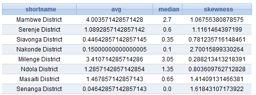

# DHIS2 and R integration { #rsetup } 

## Introduction { #rsetup_intro } 

R is freely available, open source statistical computing environment. R
refers to both the computer programming language, as well as the
software which can be used to create and run R scripts. There are
[numerous sources on the web](http://cran.r-project.org/) which describe
the extensive set of features of R.

R is a natural extension to DHIS2, as it provides powerful statistical
routines, data manipulation functions, and visualization tools. This
chapter will describe how to setup R and DHIS2 on the same server, and
will provide a simple example of how to retrieve data from the DHIS2
database into an R data frame and perform some basic calculations.

## Installing R { #rsetup_install } 

If you are installing R on the same server as DHIS, you should consider
using the Comprehensive R Archive Network (CRAN) to get the latest
distribution of R. All you need to do is to add the following like to
you `/etc/apt/source.list` file.

**deb \<your R mirror\>/bin/linux/ubuntu \<your Ubuntu distribution\>**

You will need to replace **\<your R mirror\>** with one from the list
available [here.](http://cran.r-project.org/mirrors.html) You will also
need to replace **\<your Ubuntu distribution\>** with the name of the
distribution you are using.

Once you have done this, invoke the following commands

    sudo apt-get update
    gpg --keyserver pgp.mit.edu --recv-keys 51716619E084DAB9
    gpg --armor --export 51716619E084DAB9 | apt-key add -
    sudo apt-get install r-base

At this point, you should have a functional R installation on your
machine.

Next, lets see if everything is working by simply invoking `R` from
the command line.

```
R version 3.4.4 (2018-03-15) -- "Someone to Lean On"
Copyright (C) 2018 The R Foundation for Statistical Computing
Platform: x86_64-pc-linux-gnu (64-bit)

R is free software and comes with ABSOLUTELY NO WARRANTY.
You are welcome to redistribute it under certain conditions.
Type 'license()' or 'licence()' for distribution details.

  Natural language support but running in an English locale

R is a collaborative project with many contributors.
Type 'contributors()' for more information and
'citation()' on how to cite R or R packages in publications.

Type 'demo()' for some demos, 'help()' for on-line help, or
'help.start()' for an HTML browser interface to help.
Type 'q()' to quit R.

>
```

## Using PL/R with DHIS2 { #rsetup_plr } 

The procedural language for R is an extension to the core of PostgreSQL
which allows data to be passed from the database to R, where
calculations in R can be performed. The data can then be passed back to
the database for further processing.. In this example, we will create a
function to calculate some summary statistics which do not exist by
default in SQL by using R. We will then create an SQL View in DHIS2 to
display the results. The advantage of utilizing R in this context is
that we do not need to write any significant amount of code to return
these summary statistics, but simply utilize the built-in functions of R
to do the work for us.

First, you will need to install [PL/R](http://www.joeconway.com/plr/),
which is described in detail
[here.](http://www.joeconway.com/plr/doc/plr-install.html). Following
the example from the PL/R site, we will create some custom aggregate
functions as detailed
[here.](http://www.joeconway.com/plr/doc/plr-aggregate-funcs.html) We
will create two functions, to return the median and the skewness of a
range of values.

    CREATE OR REPLACE FUNCTION r_median(_float8) returns float as '
      median(arg1)
    ' language 'plr';
    
    CREATE AGGREGATE median (
      sfunc = plr_array_accum,
      basetype = float8,
      stype = _float8,
      finalfunc = r_median
    );
    
    CREATE OR REPLACE FUNCTION r_skewness(_float8) returns float as '
      require(e1071)
      skewness(arg1)
    ' language 'plr';
    
    CREATE AGGREGATE skewness (
      sfunc = plr_array_accum,
      basetype = float8,
      stype = _float8,
      finalfunc = r_skewness
    );

Next, we will define an SQL query which will be used to retrieve the two
new aggregate functions (median and skewness) which will be calculated
using R. In this case, we will just get a single indicator from the data
mart at the district level and calculate the summary values based on the
name of the district which the values belong to. This query is very
specific, but could be easily adapted to your own database.

    SELECT  ou.shortname,avg(dv.value),
    median(dv.value),skewness(dv.value) FROM aggregatedindicatorvalue dv
    INNER JOIN period p on p.periodid = dv.periodid
    INNER JOIN organisationunit ou on 
    dv.organisationunitid = ou.organisationunitid
    WHERE dv.indicatorid = 112670
    AND dv.level = 3
    AND dv.periodtypeid = 3
    AND p.startdate >='2009-01-01'
    GROUP BY ou.shortname;

We can then save this query in the form of SQL View in DHIS2. A clipped
version of the results are shown below.




In this simple example, we have shown how to use PL/R with the DHIS2
database and web interface to display some summary statistics using R to
perform the calculations.

## Using this DHIS2 Web API with R { #rsetup_web_api } 

DHIS2 has a powerful web API which can be easily accessed using R.  In this section, we will illustrate a few examples of
the use of the DHIS2 metadata and analytics API with R. The web API uses basic HTTP authentication (as described in
the Web API section of this document). Using two R packages "RCurl" and
"XML", we will be able to work with the output of the API in R. In the
first example, we will get some metadata from the database.

```
#We are going to need these two libraries
require(httr)
require(magrittr)
require(readr)
base.url<-"https://play.dhis2.org/dev/"
url<-paste0(base.url,"api/me")
username<-"admin"
password<-"district"
login<-GET(url)
#If we cannot login, stop with an error
if(r$status == 200L) { print("Logged in successfully!")} else {stop("Could not login")}
}


mydata<-paste0(base.url,"api/reportTables/KJFbpIymTAo/data.csv") %>% #Define the API endpoint
    GET(.,authenticate(username,password)) %>% #Make the HTTP call
    content(.,"text") %>% #Read the response
    readr::read_csv() #Parse the CSV
head(mydata)
```

In this example, we are simply retrieving a report table which has been created in DHIS2 through the API, and parsing the CSV response into an R data frame.

In the next code example, we will retrieve some metadata, namely a list
of data elements and their unique identifiers.

```

#Get the list of data elements. Turn off paging and only get a few attributes.
require(httr)
username<-"admin"
password<-"district"
base.url<-"https://play.dhis2.org/dev/"

login<-function(username,password,base.url) {
url<-paste0(base.url,"api/me")
r<-GET(url,authenticate(username,password))
if(r$status == 200L) { print("Logged in successfully!")} else {stop("Could not login")}
}

getDataElements<-function(base.url) {

url<-paste0(base.url,"api/dataElements?fields=id,name,shortName")
r<-content(GET(url,authenticate(username,password)),as="parsed")
do.call(rbind.data.frame,r$dataElements)
}

login(username,password,base.url)
data_elements<-getDataElements(base.url)
head(data_elements)
```

The object `data_elements` should now contain a data frame of all data elements in the system. 

```
                                         name          id
2   Accute Flaccid Paralysis (Deaths < 5 yrs) FTRrcoaog83
210   Acute Flaccid Paralysis (AFP) follow-up P3jJH5Tu5VC
3           Acute Flaccid Paralysis (AFP) new FQ2o8UBlcrS
4     Acute Flaccid Paralysis (AFP) referrals M62VHgYT2n0
5        Additional notes related to facility uF1DLnZNlWe
6                              Admission Date eMyVanycQSC
```

## Using this DHIS2 Web API with datimutils { #r_datimutils } 

The [`datimutils`](https://github.com/pepfar-datim/datimutils) package is an open-source library developed by [ PEPFAR ](https://pepfar.gov), which provides a range of useful utility functions for interacting with the DHIS2 API. Although the package was developed specifically to interact with DATIM (the PEPFAR DHIS2 instance. ) We will not attempt to replicate the documentation of the package itself, but rather present a few practical examples of how to work with the library. 

 Authentication with DHIS2 is handled via a special object `d2_default_session`. The name and parent environment of this object can be changed if needed. Consult the package documentation for details. 
 
 ```  
 loginToDATIM(username = "admin",password = "district",base_url = "https://play.dhis2.org/dev/")  
 ```
 
 We should now have an object called `d2_default_session` in our R environment. Subsequent API calls can use this object to handle authentication, and thus there is no need to specify explicitly the username and password with each function call.
 
 `datimutils` provides a function for most metadata API endpoints, and have been designed to seamlessly work with  `tidyverse` packages. As an example, we can get a specific metadata object with the following command: 
 
 ```
datimutils::getDataElements("hCVSHjcml9g",fields = "name,shortName,id")
                                      name          shortName          id
1 Albendazole given at ANC (2nd trimester) Albendazole at ANC hCVSHjcml9g
 ``` 
 
 
 `datimutils` commands also work with lists to retrieve multiple metadata objects. 
 
 ```
> de_groups<-c("oDkJh5Ddh7d","zmWJAEjfv59")
> datimutils::getDataElementGroups(de_groups,fields = "name,shortName,id")
                            name                      shortName          id
1 Acute Flaccid Paralysis (AFP)  Acute Flaccid Paralysis (AFP)  oDkJh5Ddh7d
2                           Yaws                           Yaws zmWJAEjfv59
 ```
 
 `datimutils` commands are pipeable, and thus can be chained together with other `tidyverse` commands. 
 
 ```  

 > datimutils::getMetadata("dataElementGroups", fields = "id,name,shortName") 
 %>%  dplyr::filter(grepl("ART",`shortName`)) 
 %>%  dplyr::select(name) 
 
                     name
1                     ART
2          ART enrollment
3        ART entry points
4  ART pediatric 1st line
5             ART staging
6           ART treatment
7              New on ART
8       Prev month on ART
9     Shift from ART reg.
10      Shift to ART reg.  

```

For more information on the `datimutils` package, please consult the package documentation. 

 
 