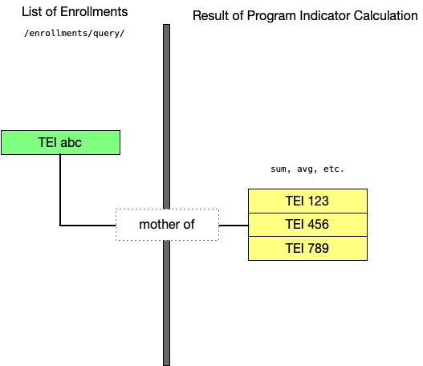

# Analytics

## Analytics { #webapi_analytics } 

To access analytical, aggregated data in DHIS2 you can work with the
*analytics* resource. The analytics resource is powerful as it lets you
query and retrieve data aggregated along all available data dimensions.
For instance, you can ask the analytics resource to provide the
aggregated data values for a set of data elements, periods and
organisation units. Also, you can retrieve the aggregated data for a
combination of any number of dimensions based on data elements and
organisation unit group sets.

    /api/analytics

### Request query parameters { #webapi_analytics_query_parameters } 

The analytics resource lets you specify a range of query parameters:

Table: Query parameters

| Query parameter | Required | Description | Options (default first) |
|---|---|---|---|
| dimension | Yes | Dimensions and dimension items to be retrieved, repeated for each. | Any dimension |
| filter | No | Filters and filter items to apply to the query, repeated for each. | Any dimension |
| aggregationType | No | Aggregation type to use in the aggregation process. | SUM &#124; AVERAGE &#124; AVERAGE_SUM_ORG_UNIT &#124; LAST &#124; LAST_AVERAGE_ORG_UNIT &#124; COUNT &#124; STDDEV &#124; VARIANCE &#124; MIN &#124; MAX |
| measureCriteria | No | Filters for the data/measures. | EQ &#124; GT &#124; GE &#124; LT &#124; LE |
| preAggregationMeasureCriteria | No | Filters for the data/measure, applied before aggregation is performed. | EQ &#124; GT &#124; GE &#124; LT &#124; LE |
| startDate | No | Start date for a date range. Will be applied as a filter. Can not be used together with a period dimension or filter. | Date |
| endDate | No | End date for date range. Will be applied as a filter. Can not be used together with a period dimension or filter. | Date |
| skipMeta | No | Exclude the metadata part of the response (improves performance). | false &#124; true |
| skipData | No | Exclude the data part of the response. | false &#124; true |
| skipRounding | No | Skip rounding of data values, i.e. provide full precision. | false &#124; true |
| hierarchyMeta | No | Include names of organisation unit ancestors and hierarchy paths of organisation units in the metadata. | false &#124; true |
| ignoreLimit | No | Ignore limit on max 50 000 records in response, use with care. | false &#124; true |
| tableLayout | No | Use plain data source or table layout for the response. | false &#124; true |
| hideEmptyRows | No | Hides empty rows in response, applicable when table layout is true. | false &#124; true |
| hideEmptyColumns | No | Hides empty columns in response, applicable when table layout is true. | false &#124; true |
| showHierarchy | No | Display full org unit hierarchy path together with org unit name. | false &#124; true |
| includeNumDen | No | Include the numerator and denominator used to calculate the value in the response. | false &#124; true |
| includeMetadataDetails | No | Include metadata details to raw data response. | false &#124; true |
| displayProperty | No | Property to display for metadata. | NAME &#124; SHORTNAME |
| outputIdScheme | No | Identifier scheme used for metadata items in the query response. It accepts identifier, code or attributes. | UID &#124; UUID &#124; CODE &#124; NAME &#124; ATTRIBUTE:<ID\> |
| outputOrgUnitIdScheme | No | Identifier scheme used for metadata items in the query response. Overrides "outputIdScheme" specifically for for Org Units. It accepts identifier, code or attributes. | UUID &#124; CODE &#124; NAME &#124; ATTRIBUTE:<ID\> |
| outputDataElementIdScheme | No | Identifier scheme used for metadata items in the query response. Overrides "outputIdScheme" specifically for Data Elements. It accepts identifier, code or attributes. | UUID &#124; CODE &#124; NAME &#124; ATTRIBUTE:<ID\> |
| inputIdScheme | No | Identifier scheme to use for metadata items in the query request, can be an identifier, code or attributes. | UID &#124; CODE &#124; ATTRIBUTE:<ID\> |
| approvalLevel | No | Include data which has been approved at least up to the given approval level, refers to identifier of approval level. | Identifier of approval level |
| relativePeriodDate | No | Date used as basis for relative periods. | Date |
| userOrgUnit | No | Explicitly define the user org units to utilize, overrides organisation units associated with the current user, multiple identifiers can be separated by semicolon. | Organisation unit identifiers |
| columns | No | Dimensions to use as columns for table layout, separated by semi-colon. | Any dimension (must be query dimension) |
| rows | No | Dimensions to use as rows for table layout, separated by semi-colon. | Any dimension (must be query dimension) |
| order | No | Specify the ordering of rows based on value. | ASC &#124; DESC |
| timeField | No | The time field to base event aggregation on. Applies to event data items only. Can be a predefined option or the ID of an attribute or data element with a time-based value type. | EVENT_DATE &#124; ENROLLMENT_DATE &#124; INCIDENT_DATE &#124; DUE_DATE &#124; COMPLETED_DATE &#124; CREATED &#124; LAST_UPDATED &#124; <Attribute ID\> &#124; <Data element ID\> |
| orgUnitField | No | The organisation unit field to base event aggregation on. Applies to event data items only. Can be the ID of an attribute or data element with the Organisation unit value type. The default option is specified as omitting the query parameter. | <Attribute ID\> &#124; <Data element ID\> &#124; REGISTRATION &#124; ENROLLMENT &#124; OWNER_AT_START &#124; OWNER_AT_END |
| enhancedConditions | No | Enable enhanced conditions for dimensions and filters. | false &#124; true |

The *dimension* query parameter defines which dimensions should be
included in the analytics query. Any number of dimensions can be
specified. The dimension parameter should be repeated for each dimension
to include in the query response. The query response can potentially
contain aggregated values for all combinations of the specified
dimension items.

The *filter* parameter defines which dimensions should be used as
filters for the data retrieved in the analytics query. Any number of
filters can be specified. The filter parameter should be repeated for
each filter to use in the query. A filter differs from a dimension in
that the filter dimensions will not be part of the query response
content, and that the aggregated values in the response will be
collapsed on the filter dimensions. In other words, the data in the
response will be aggregated on the filter dimensions, but the filters
will not be included as dimensions in the actual response. As an
example, to query for certain data elements filtered by the periods and
organisation units you can use the following URL:

    /api/analytics?dimension=dx:fbfJHSPpUQD;cYeuwXTCPkU&filter=pe:2014Q1;2014Q2
      &filter=ou:O6uvpzGd5pu;lc3eMKXaEfw

The *aggregationType* query parameter lets you define which aggregation
operator should be used for the query. By default, the aggregation
operator defined for data elements included in the query will be used.
If your query does not contain any data elements but does include data
element groups, the aggregation operator of the first data element in
the first group will be used. The order of groups and data elements is
undefined. This query parameter allows you to override the default and
specify a specific aggregation operator. As an example, you can set the
aggregation operator to "count" with the following URL:

    /api/analytics?dimension=dx:fbfJHSPpUQD&dimension=pe:2014Q1&dimension=ou:O6uvpzGd5pu
      &aggregationType=COUNT

The *measureCriteria* query parameter lets you filter out ranges of data
records to return. You can instruct the system to return only records
where the aggregated data value is equal, greater than, greater or
equal, less than or less or equal to certain values. You can specify any
number of criteria on the following format, where *criteria* and
*value* should be substituted with real values:

    /api/analytics?measureCriteria=criteria:value;criteria:value

As an example, the following query will return only records where the
data value is greater or equal to 6500 and less than 33000:

    /api/analytics?dimension=dx:fbfJHSPpUQD;cYeuwXTCPkU&dimension=pe:2014
      &dimension=ou:O6uvpzGd5pu;lc3eMKXaEfw&measureCriteria=GE:6500;LT:33000

Similar to *measureCriteria*, the *preAggregationMeasureCriteria* query
parameter lets you filter out data, only before aggregation is
performed. For example, the following query only aggregates data where
the original value is within the criteria defined:

    /api/analytics?dimension=dx:fbfJHSPpUQD;cYeuwXTCPkU&dimension=pe:2014
      &dimension=ou:O6uvpzGd5pu;lc3eMKXaEfw&preAggregationMeasureCriteria=GE:10;LT:100

The *startDate* and *endDate* parameters can be used to specify a custom
date range to aggregate over. When specifying a date range you can not
specify relative nor fixed periods as dimension or filter. The date range
will filter the analytics response. You can use it like this:

    /api/analytics.json?dimension=dx:fbfJHSPpUQD;cYeuwXTCPkU
      &dimension=ou:ImspTQPwCqd&startDate=2018-01-01&endDate=2018-06-01

In order to have the analytics resource generate the data in the shape
of a ready-made table, you can provide the *tableLayout* parameter with
true as value. Instead of generating a plain, normalized data source,
the analytics resource will now generate the data in a table layout. You
can use the *columns* and *rows* parameters with dimension identifiers
separated by semi-colons as values to indicate which ones to use as
table columns and rows. The column and rows dimensions must be present
as a data dimension in the query (not a filter). Such a request can look
like this:

    /api/analytics.html?dimension=dx:fbfJHSPpUQD;cYeuwXTCPkU&dimension=pe:2014Q1;2014Q2
      &dimension=ou:O6uvpzGd5pu&tableLayout=true&columns=dx;ou&rows=pe

The *order* parameter can be used for analytics resource to generate
ordered data. The data will be ordered in ascending (or descending) order
of values. An example request for ordering the values in descending
order is:

    /api/analytics?dimension=dx:fbfJHSPpUQD&dimension=pe:LAST_12_MONTHS
      &dimension=ou:O6uvpzGd5pu&order=DESC

### Dimensions and items { #webapi_analytics_dimensions_and_items } 

DHIS2 features a multi-dimensional data model with several fixed and
dynamic data dimensions. The fixed dimensions are the data element,
period (time) and organisation unit dimension. You can dynamically add
dimensions through categories, category option group sets, 
organisation unit group sets, data element group sets and organisation
unit group sets. The table below displays the available data dimensions
in DHIS2. Each data dimension has a corresponding *dimension
identifier*, and each dimension can have a set of *dimension items*:


Table: Dimensions and dimension items

| Dimension | Dimension id | Dimension items |
|---|---|---|
| Data elements, indicators, data set reporting rate metrics, data element operands, program indicators, program data elements, program attributes, validation rules | dx | Data element, indicator, data set reporting rate metrics, data element operand, program indicator, program attribute identifiers, keyword DE_GROUP-<group-id\>, IN_GROUP-<group-id\>, use <dataelement-id\>.<optioncombo-id\> for data element operands, <program-id\>.<dataelement-id\> for program data elements, <program-id\>.<attribute-id\> for program attributes, <validationrule-id\> for validation results. |
| Periods (time) | pe | ISO periods and relative periods, see "date and period format" |
| Organisation unit hierarchy | ou | Organisation unit identifiers, and keywords USER_ORGUNIT, USER_ORGUNIT_CHILDREN, USER_ORGUNIT_GRANDCHILDREN, LEVEL-<level\> and OU_GROUP-<group-id\> |
| Category option combinations | co | Category option combo identifiers  (omit to get all items) |
| Attribute option combinations | ao | Category option combo identifiers (omit to get all items) |
| Categories | <category id\> | Category option identifiers (omit to get all items) |
| Data element group sets | <group set id\> | Data element group identifiers (omit to get all items) |
| Organisation unit group sets | <group set id\> | Organisation unit group identifiers (omit to get all items) |
| Category option group sets | <group set id\> | Category option group identifiers (omit to get all items) |

It is not necessary to be aware of which objects are used for the
various dynamic dimensions when designing analytics queries. You can get
a complete list of dynamic dimensions by visiting this URL in the Web API:

    /api/dimensions

If you want to retrieve only the dimensional items for a given dynamic dimension you can
use the example below. Pagination is disabled by default. It can be enabled by adding
the pagination parameter `paging=true` to the URL.

    /api/dimensions/J5jldMd8OHv/items?paging=true

The `/dimensions` API also provides an endpoint where the clients can get the *recomendations* for a given set of *dimensions*. For example:

    /api/33/dimensions/recommendations?fields=id&dimension=dx:fbfJHSPpUQD

In the example above, the response will contain the categories which are configured as data dimensions and associated, through data sets and category combos, with the data element `fbfJHSPpUQD`.
In addition, all org unit group sets which are configured as data dimensions will be returned.

The endpoint supports multiple data elements. If one wishes to send multiple data elements, they should be separated by `;`. For example:

    /api/33/dimensions/recommendations?fields=id&dimension=dx:fbfJHSPpUQD;JuTpJ2Ywq5b

> Note
>
> This endpoint returns only dimensions that can be read by the current logged user. It will check if the current user can read the data or the metadata of the respective recommended dimension. Non-authorized dimensions are omitted from the list.

The base URL to the analytics resource is `/api/analytics`. To request
specific dimensions and dimension items you can use a query string on
the following format, where `dim-id` and `dim-item` should be substituted with real values:

    /api/analytics?dimension=dim-id:dim-item;dim-item&dimension=dim-id:dim-item;dim-item

As illustrated above, the dimension identifier is followed by a colon
while the dimension items are separated by semi-colons. As an example, a
query for two data elements, two periods and two organisation units can
be done with the following URL:

    /api/analytics?dimension=dx:fbfJHSPpUQD;cYeuwXTCPkU
      &dimension=pe:2016Q1;2016Q2&dimension=ou:O6uvpzGd5pu;lc3eMKXaEfw

To query for data broken down by category option combinations instead of
data element totals you can include the category dimension in the query
string, for instance like this:

    /api/analytics?dimension=dx:fbfJHSPpUQD;cYeuwXTCPkU
      &dimension=co&dimension=pe:201601&dimension=ou:O6uvpzGd5pu;lc3eMKXaEfw

When selecting data elements you can also select all data elements in a
group as items by using the `DE_GROUP-<id>` syntax:

    /api/analytics?dimension=dx:DE_GROUP-h9cuJOkOwY2
      &dimension=pe:201601&dimension=ou:O6uvpzGd5pu

When selecting data set reporting rates, the syntax contains a data
set identifier followed by a reporting rate metric:

    /api/analytics?dimension=dx:BfMAe6Itzgt.REPORTING_RATE;BfMAe6Itzgt.ACTUAL_REPORTS
      &dimension=pe:201601&dimension=ou:O6uvpzGd5pu

To query for program data elements (of tracker domain type) you can get
those by specifying the program for each data element using the
`<program-id>.<dataelement-id>` syntax:

    /api/analytics.json?dimension=dx:eBAyeGv0exc.qrur9Dvnyt5;eBAyeGv0exc.GieVkTxp4HH
      &dimension=pe:LAST_12_MONTHS&filter=ou:ImspTQPwCqd

To query for program attributes (tracked entity attributes) you can get
those by specifying the program for each attribute using the
`<program.id>.<attribute-id>` syntax:

    /api/analytics.json?dimension=dx:IpHINAT79UW.a3kGcGDCuk6;IpHINAT79UW.UXz7xuGCEhU
      &dimension=pe:LAST_4_QUARTERS&dimension=ou:ImspTQPwCqd

To query for organisation unit group sets and data elements you can use
the following URL. Notice how the group set identifier is used as
a dimension identifier and the groups as dimension items:

    /api/analytics?dimension=Bpx0589u8y0:oRVt7g429ZO;MAs88nJc9nL
      &dimension=pe:2016&dimension=ou:ImspTQPwCqd

To query for data elements and categories you can use this URL. Use the
category identifier as a dimension identifier and the category options as
dimension items:

    /api/analytics?dimension=dx:s46m5MS0hxu;fClA2Erf6IO&dimension=pe:2016
      &dimension=YNZyaJHiHYq:btOyqprQ9e8;GEqzEKCHoGA&filter=ou:ImspTQPwCqd

To query using relative periods and organisation units associated with
the current user you can use a URL like this:

    /api/analytics?dimension=dx:fbfJHSPpUQD;cYeuwXTCPkU
      &dimension=pe:LAST_12_MONTHS&dimension=ou:USER_ORGUNIT

When selecting organisation units for a dimension you can select an
entire level optionally constrained by any number of boundary
organisation units with the `LEVEL-<level>` syntax. Boundary refers to a
top node in a sub-hierarchy, meaning that all organisation units at the
given level below the given boundary organisation unit in the hierarchy
will be included in the response, and is provided as regular organisation unit
dimension items. The level value can either be a numerical level or refer to the identifier
of the organisation unit level entity. A simple query for all org units at level three:

    /api/analytics?dimension=dx:fbfJHSPpUQD&dimension=pe:2016&dimension=ou:LEVEL-3

A query for level three and four with two boundary org units can be
specified like this:

    /api/analytics?dimension=dx:fbfJHSPpUQD&dimension=pe:2016
      &dimension=ou:LEVEL-3;LEVEL-4;O6uvpzGd5pu;lc3eMKXaEf

When selecting organisation units you can also select all organisation
units in an organisation unit group to be included as dimension items
using the `OU_GROUP-<id>` syntax. The organisation units in the groups
can optionally be constrained by any number of boundary organisation
units. Both the level and the group items can be repeated any number of
times:

    /api/analytics?dimension=dx:fbfJHSPpUQD&dimension=pe:2016
      &dimension=ou:OU_GROUP-w0gFTTmsUcF;OU_GROUP-EYbopBOJWsW;O6uvpzGd5pu;lc3eMKXaEf

You can utilize identifier schemes for the metadata part of the
analytics response with the outputIdScheme property like this. You can
use ID, code and attributes as identifier scheme:

    /api/analytics?dimension=dx:fbfJHSPpUQD;cYeuwXTCPkU
      &dimension=pe:2017Q1;2017Q2&dimension=ou:O6uvpzGd5pu&outputIdScheme=CODE

A few things to be aware of when using the analytics resource are listed
below.

  - Data elements, indicator, data set reporting rates, program data
    elements and program indicators are part of a common data dimension,
    identified as "dx". This means that you can use any of data
    elements, indicators and data set identifiers together with the "dx"
    dimension identifier in a query.

  - For the category, data element group set and organisation unit group
    set dimensions, all dimension items will be used in the query if no
    dimension items are specified.

  - For the period dimension, the dimension items are ISO period
    identifiers and/or relative periods. Please refer to the section
    above called "Date and period format" for the period format and
    available relative periods.

  - For the organization unit dimension, you can specify items as either
    the organization unit or its sub-units associated with the currently
    authenticated user. Use the keys `USER_ORGUNIT` for the organization unit
    itself or `USER_ORGUNIT_CHILDREN` for its sub-units. You may also specify
    organization unit identifiers directly or use a combination of both.
    The authenticated user must have permission to export and analyze data
    for the designated organization units.

  - For the organisation unit dimension, you can specify the organisation
    hierarchy level and the boundary unit to use for the request on the
    format `LEVEL-<level>-<boundary-id>`; as an example
    `LEVEL-3-ImspTQPwCqd` implies all organisation units below the given
    boundary unit at level 3 in the hierarchy.

  - For the organisation unit dimension, the dimension items are the
    organisation units and their sub-hierarchy - data will be aggregated
    for all organisation units below the given organisation unit in the
    hierarchy.

  - You cannot specify dimension items for the category option
    combination dimension. Instead, the response will contain the items
    which are linked to the data values.

### The dx dimension { #webapi_analytics_dx_dimension } 

The `dx` dimension is a special dimension which can contain all of the
following data types.

Table: Data dx dimension types

| Type | Syntax | Description | Data source |
|---|---|---|---|
| Indicator | <indicator-id\> | Indicator identifier. | Aggregated data |
| Indicator grop | IN_GROUP-<indicatorgroup-id\> | Keyword followed by an indicator group identifier. Will include all indicators in the group in the response. | Aggregated data |
| Data element | <dataelement-id\> | Data element identifier. | Aggregated data |
| Data element group | DE_GROUP-<dataelementgroup-id\> | Keyword followed by a data element group identifier. Will include all data elements in the group in the response. | Aggregated data |
| Data element operand | <dataelement-id\>.<categoryoptcombo-id\>.<attributeoptcombo-id\> | Data element identifier followed by one or both of category option combination and attribute option combo identifier. Wildcard "\*" symbol can be used to indicate any option combination value. The attribute option combination identifier can be completely left out. | Aggregate data |
| Data set | <dataset-id\>.<reporting-rate-metric\> | Data set identifier followed by reporting rate metric. Can be REPORTING_RATE &#124; REPORTING_RATE_ON_TIME &#124; ACTUAL_REPORTS &#124; ACTUAL_REPORTS_ON_TIME &#124; EXPECTED_REPORTS. | Data set completeness registrations |
| Program data element | <program-id\>.<dataelement-id\> | Program identifier followed by data element identifier. Reads from events within the specified program. | Events from the given program |
| Program indicator | <programindicator-id\> | Program indicator identifier. Reads from events from within the program associated with the program identifier. | Events from the program of the program indicator |
| Validation result | <validationrule-id\> | Validation rule identifier. Will include validation rule violations for the validation rule, requires that validation results are generated and persisted. | Validation results |

Items from all of the various `dx` types can be combined in an analytics
request. An example looks like this:

    /api/analytics.json
      ?dimension=dx:Uvn6LCg7dVU;BfMAe6Itzgt.REPORTING_RATE;IpHINAT79UW.a3kGcGDCuk6
      &dimension=pe:LAST_12_MONTHS&filter=ou:ImspTQPwCqd

The group syntax can be used together with any other item as well. An
example looks like this:

    /api/analytics.json
      ?dimension=dx:DE_GROUP-qfxEYY9xAl6;IN_GROUP-oehv9EO3vP7;BfMAe6Itzgt.REPORTING_RATE
      &dimension=pe:LAST_12_MONTHS&filter=ou:ImspTQPwCqd

Data element operands can optionally specify attribute option
combinations and use wildcards e.g. to specify all category option
combination values:

    /api/analytics.json
      ?dimension=dx:Uvn6LCg7dVU.*.j8vBiBqGf6O;Uvn6LCg7dVU.Z4oQs46iTeR
      &dimension=pe:LAST_12_MONTHS&filter=ou:ImspTQPwCqd

> **Tip**
>
> A great way to learn how to use the analytics API is to use the DHIS2
> Data Visualizer web app and create a pivot table. You can play around 
> with pivot tables using the various dimensions and items and click 
> **Download** > **Plain data source** > **JSON** to see the resulting analytics 
> API calls in the address bar of your web browser.

### Response formats { #webapi_analytics_response_formats } 

The analytics response containing aggregate data can be returned in
various representation formats. As usual, you can indicate interest in a
specific format by appending a file extension to the URL, through the
`Accept` HTTP header or through the `format` query parameter. The
default format is JSON. The available formats and content-types are
listed below.

  - json (application/json)

  - jsonp (application/javascript)

  - xml (application/xml)

  - csv (application/csv)

  - html (text/html)

  - html+css (text/html)

  - xls (application/vnd.ms-excel)

As an example, to request an analytics response in XML format you can
use the following URL:

    /api/analytics.xml?dimension=dx:fbfJHSPpUQD
      &dimension=pe:2016&dimension=ou:O6uvpzGd5pu;lc3eMKXaEfw

The JSON response will look like this:

```json
{
  "headers": [
    {
      "name": "dx",
      "column": "Data",
      "valueType": "TEXT",
      "meta": true
    },
    {
      "name": "pe",
      "column": "Period",
      "valueType": "TEXT",
      "meta": true
    },
    {
      "name": "value",
      "column": "Value",
      "valueType": "NUMBER",
      "meta": false
    }
  ],
  "height": 4,
  "metaData": {
    "pe": [
      "2016Q1",
      "2016Q2"
    ],
    "ou": [
      "ImspTQPwCqd"
    ],
    "names": {
      "2016Q1": "Jan to Mar 2016",
      "2016Q2": "Apr to Jun 2016",
      "FbKK4ofIv5R": "Measles Coverage <1 y",
      "ImspTQPwCqd": "Sierra Leone",
      "eTDtyyaSA7f": "Fully Immunized Coverage"
    }
  },
  "rows": [
    [
      "eTDtyyaSA7f",
      "2016Q2",
      "81.1"
    ],
    [
      "eTDtyyaSA7f",
      "2016Q1",
      "74.7"
    ],
    [
      "FbKK4ofIv5R",
      "2016Q2",
      "88.9"
    ],
    [
      "FbKK4ofIv5R",
      "2016Q1",
      "84.0"
    ]
  ],
  "width": 3
}
```

The response represents a table of dimensional data. The *headers* array
gives an overview of which columns are included in the table and what
the columns contain. The *column* property shows the column dimension
identifier, or if the column contains measures, the word "Value". The
*meta* property is *true* if the column contains dimension items or
*false* if the column contains a measure (aggregated data values). The
*name* property is similar to the column property, except it displays
"value" in case the column contains a measure. The *type* property
indicates the Java class type of column values.

The *height* and *width* properties indicate how many data columns and
rows are contained in the response, respectively.

The *metaData periods* property contains a unique, ordered array of the
periods included in the response. The *metaData ou* property contains an
array of the identifiers of organisation units included in the response.
The *metaData names* property contains a mapping between the identifiers
used in the data response and the names of the objects they represent.
It can be used by clients to substitute the identifiers within the data
response with names in order to give a more meaningful view of the data
table.

The *rows* array contains the dimensional data table. It contains
columns with dimension items (object or period identifiers) and a column
with aggregated data values. The example response above has a
data/indicator column, a period column and a value column. The first
column contains indicator identifiers, the second contains ISO period
identifiers and the third contains aggregated data values.

### Constraints and validation { #webapi_analytics_constraints } 

There are several constraints to the input parameters you can provide to the
analytics resource. If any of the constraints are violated, the API will
return a *409 Conflict* response and a response message looking similar to this:

```json
{
  "httpStatus": "Conflict",
  "httpStatusCode": 409,
  "status": "ERROR",
  "message": "Only a single indicator can be specified as filter",
  "errorCode": "E7108"
}
```

The `httpStatus` and `httpStatusCode` fields indicate the HTTP status and
status code per the HTTP specification. The `messsage` field provides a
human-readable description of the validation error. The `errorCode` field
provides a machine-readable code which can be used by clients to handle
validation errors. The possible validation errors for the aggregate analytics
API are described in the table below.

| Error code | Message |
| ---------- | ------- |
| E7100      | Query parameters cannot be null |
| E7101      | At least one dimension must be specified |
| E7102      | At least one data dimension item or data element group set dimension item must be specified |
| E7103      | Dimensions cannot be specified as dimension and filter simultaneously |
| E7104      | At least one period as dimension or filter, or start and dates, must be specified |
| E7105      | Periods and start and end dates cannot be specified simultaneously |
| E7106      | Start date cannot be after end date |
| E7107      | Start and end dates cannot be specified for reporting rates |
| E7108      | Only a single indicator can be specified as filter |
| E7109      | Only a single reporting rate can be specified as filter |
| E7110      | Category option combos cannot be specified as filter |
| E7111      | Dimensions cannot be specified more than once |
| E7112      | Reporting rates can only be specified together with dimensions of type |
| E7113      | Assigned categories cannot be specified when data elements are not specified |
| E7114      | Assigned categories can only be specified together with data elements, not indicators or reporting rates |
| E7115      | Data elements must be of a value and aggregation type that allow aggregation |
| E7116      | Indicator expressions cannot contain cyclic references |
| E7117      | A data dimension 'dx' must be specified when output format is DATA_VALUE_SET |
| E7118      | A period dimension 'pe' must be specified when output format is DATA_VALUE_SET |
| E7119      | An organisation unit dimension 'ou' must be specified when output format is DATA_VALUE_SET |
| E7120      | User is not allowed to view org unit |
| E7121      | User is not allowed to read data for object |
| E7122      | Data approval level does not exist |
| E7123      | Current user is constrained by a dimension but has access to no dimension items |
| E7124      | Dimension is present in query without any valid dimension options |
| E7125      | Dimension identifier does not reference any dimension |
| E7126      | Column must be present as dimension in query |
| E7127      | Row must be present as dimension in query |
| E7128      | Query result set exceeded max limit |
| E7129      | Program is specified but does not exist |
| E7130      | Program stage is specified but does not exist |
| E7131      | Query failed, likely because the query timed out |

### Data value set format { #webapi_analytics_data_value_set_format } 

The analytics *dataValueSet* resource allows for returning aggregated
data in the data value set format. This format represents raw data
values, as opposed to data which has been aggregated along various
dimensions. Exporting aggregated data as regular data values is useful
for data exchange between systems when the target system contains data
of finer granularity compared to what the destination system is storing.

As an example, one can specify an indicator in the target system to
summarize data for multiple data elements and import this data for a
single data element in the destination system. As another example, one
can aggregate data collected at organisation unit level 4 in the target
system to level 2 and import that data in the destination system.

You can retrieve data in the raw data value set format from the
dataValueSet resource:

    /api/analytics/dataValueSet

The following resource representations are supported:

  - json (application/json)

  - xml (application/xml)

When using the data value set format, exactly three dimensions must be
specified as analytics dimensions with at least one dimension item each:

  - Data (dx)

  - Period (pe)

  - Organisation unit (ou)

Any other dimension will be ignored. Filters will be applied as with
regular analytics requests. Note that any data dimension type can be
specified, including indicators, data elements, data element operands,
data sets and program indicators.

An example request which aggregates data for specific indicators,
periods and organisation units and returns it as regular data values in
XML looks like this:

    api/analytics/dataValueSet.xml?dimension=dx:Uvn6LCg7dVU;OdiHJayrsKo
      &dimension=pe:LAST_4_QUARTERS&dimension=ou:lc3eMKXaEfw;PMa2VCrupOd

A request which aggregates data for data element operands and uses `CODE`
as output identifier scheme looks like the below. When defining the
output identifier scheme, all metadata objects part of the response are
affected:

    api/analytics/dataValueSet.json?dimension=dx:fbfJHSPpUQD.pq2XI5kz2BY;fbfJHSPpUQD.PT59n8BQbqM
      &dimension=pe:LAST_12_MONTHS&dimension=ou:ImspTQPwCqd&outputIdScheme=CODE

When using attribute-based identifier schemes for export there is a risk
of producing duplicate data values. The boolean query parameter
`duplicatesOnly` can be used for debugging purposes to return only
duplicates data values. This response can be used to clean up the
duplicates:

    api/analytics/dataValueSet.xml?dimension=dx:Uvn6LCg7dVU;OdiHJayrsKo
      &dimension=pe:LAST_4_QUARTERS&dimension=ou:lc3eMKXaEfw&duplicatesOnly=true

### Raw data format { #webapi_analytics_raw_data } 

The analytics *rawData* resource allows for returning the data stored in
the analytics data tables without any aggregation being performed. This
is useful for clients which would like to perform aggregation and
filtering on their own without having to denormalize data in the
available data dimensions themselves.

    /api/analytics/rawData

The following resource representations are supported:

  - json (application/json)

  - csv (application/csv)

This resource follows the syntax of the regular analytics resource. Only
a subset of the query parameters are supported. Additionally, a
*startDate* and *endDate* parameter are available. The supported
parameters are listed in the table below.


Table: Query parameters

| Query parameter | Required / Notes |
|---|---|
| dimension | Yes |
| startDate | No / yyyy-MM-dd |
| endDate | No / yyyy-MM-dd |
| skipMeta | No |
| skipData | No |
| hierarchyMeta | No |
| showHierarchy | No |
| displayProperty | No |
| outputIdScheme | No |
| outputOrgUnitIdScheme | No |
| outputDataElementIdScheme | No |
| inputIdScheme | No |
| userOrgUnit | No |

The *dimension* query parameter defines which dimensions (table columns)
should be included in the response. It can optionally be constrained
with items. The *filter* query parameter defines which items and
dimensions (table columns) should be used as a filter for the response.

For the organisation unit dimension, the response will contain data
associated with the organisation unit and all organisation units in the
sub-hierarchy (children in the tree). This is different compared to the
regular analytics resource, where only the explicitly selected
organisation units are included.

To retrieve a response with specific data elements, specific periods,
specific organisation units and all data for two custom dimensions you
can issue a request like this:

    /api/analytics/rawData.json?dimension=dx:fbfJHSPpUQD;cYeuwXTCPkU;Jtf34kNZhzP
      &dimension=J5jldMd8OHv&dimension=Bpx0589u8y0
      &dimension=pe:LAST_12_MONTHS
      &dimension=ou:O6uvpzGd5pu;fdc6uOvgoji

The *startDate* and *endDate* parameters allow for fetching data linked
to any period between those dates. This avoids the need for defining all
periods explicitly in the
    request:

    /api/analytics/rawData.json?dimension=dx:fbfJHSPpUQD;cYeuwXTCPkU;Jtf34kNZhzP
      &dimension=J5jldMd8OHv&dimension=Bpx0589u8y0
      &startDate=2015-01-01&endDate=2015-12-31
      &dimension=ou:O6uvpzGd5pu;fdc6uOvgoji

The *filter* parameter can be used to filter a response without
including that dimension as part of the response, this time in CSV
format:

    /api/analytics/rawData.csv?dimension=dx:fbfJHSPpUQD;cYeuwXTCPkU;Jtf34kNZhzP
      &filter=J5jldMd8OHv:uYxK4wmcPqA;tDZVQ1WtwpA
      &startDate=2015-01-01&endDate=2015-12-31
      &dimension=ou:O6uvpzGd5pu

The *outputIdScheme* parameter is useful if you want human readable data
responses as it can be set to *NAME* like this:

    /api/analytics/rawData.csv?dimension=dx:fbfJHSPpUQD;cYeuwXTCPkU
      &filter=J5jldMd8OHv:uYxK4wmcPqA;tDZVQ1WtwpA
      &startDate=2017-01-01&endDate=2017-12-31
      &dimension=ou:O6uvpzGd5pu
      &outputIdScheme=NAME

The response from the *rawData* resource will look identical to the
regular analytics resource; the difference is that the response contains
raw, non-aggregated data, suitable for further aggregation by
third-party systems.

### Debugging { #webapi_analytics_debugging } 

When debugging analytics requests it can be useful to examine the data
value source of the aggregated analytics response. The
*analytics/debug/sql* resource will provide an SQL statement that
returns the relevant content of the datavalue table. You can produce
this SQL by doing a GET request with content type "text/html" or
"text/plain" like below. The dimension and filter syntax are identical to
regular analytics queries:

    /api/analytics/debug/sql?dimension=dx:fbfJHSPpUQD;cYeuwXTCPkU
      &filter=pe:2016Q1;2016Q2&filter=ou:O6uvpzGd5pu

## Event analytics { #webapi_event_analytics } 

The event analytics API lets you access aggregated event data and query
*events* captured in DHIS2. This resource lets you retrieve events based
on a program and optionally a program stage, and lets you retrieve and
filter events on any event dimensions.

    /api/analytics/events

### Dimensions and items { #webapi_event_analytics_dimensions_items } 

Event dimensions include data elements, attributes, organisation units
and periods. The aggregated event analytics resource will return
aggregated information such as counts or averages. The query analytics
resource will simply return events matching a set of criteria and does
not perform any aggregation. You can specify dimension items in the form
of options from option sets and legends from legend sets for data
elements and attributes which are associated with such. The event
dimensions are listed in the table below.


Table: Event dimensions

| Dimension | Dimension id | Description |
|---|---|---|
| Data elements | <id\> | Data element identifiers |
| Attributes | <id\> | Attribute identifiers |
| Periods | pe | ISO periods and relative periods, see "date and period format" |
| Organisation units | ou | Organisation unit identifiers and keywords USER_ORGUNIT, USER_ORGUNIT_CHILDREN, USER_ORGUNIT_GRANDCHILDREN, LEVEL-<level\> and OU_GROUP-<group-id\> |
| Organisation unit group sets | <org unit group set id\> | Organisation unit group set identifiers |
| Categories | <category id\> | Category identifiers (program attribute categories only) |

### Request query parameters { #webapi_event_analytics_request_query_parameters } 

The analytics event API lets you specify a range of query parameters.


Table: Query parameters for both event query and aggregate analytics

| Query parameter | Required | Description | Options (default first) |
|---|---|---|---|
| program | Yes | Program identifier. | Any program identifier |
| stage | No | Program stage identifier. | Any program stage identifier |
| startDate | Yes | Start date for events. | Date in yyyy-MM-dd format |
| endDate | Yes | End date for events. | Date in yyyy-MM-dd format |
| dimension | Yes | Dimension identifier including data elements, attributes, program indicators, periods, organisation units and organisation unit group sets. Parameter can be repeated any number of times. Item filters can be applied to a dimension on the format <item-id\>:<operator\>:<filter\>. Filter values are case-insensitive. | Operators can be EQ &#124; GT &#124; GE &#124; LT &#124; LE &#124; NE &#124; LIKE &#124; IN |
| filter | No | Dimension identifier including data elements, attributes, periods, organisation units and organisation unit group sets. Parameter can be repeated any number of times. Item filters can be applied to a dimension on the format <item-id\>:<operator\>:<filter\>. Filter values are case-insensitive. ||
| hierarchyMeta | No | Include names of organisation unit ancestors and hierarchy paths of organisation units in the metadata. | false &#124; true |
| eventStatus | No | Specify status of events to include. | ACTIVE &#124; COMPLETED &#124; SCHEDULE &#124; OVERDUE &#124; SKIPPED. Can be comma separated (*for query only*). |
| programStatus | No | Specify enrollment status of events to include. | ACTIVE &#124; COMPLETED &#124; CANCELLED. Can be comma separated (*for query only*). |
| relativePeriodDate | string | No | Date identifier e.g: "2016-01-01". Overrides the start date of the relative period |
| columns | No | Dimensions to use as columns for table layout. | Any dimension (must be query dimension) |
| rows | No | Dimensions to use as rows for table layout. | Any dimension (must be query dimension) |
| timeField | No | Time field used in aggregations/queries on events. Applies to event data items only. Can be a predefined option or the ID of an attribute or data element with a time-based value type. For "/analytics/events/" endpoints, the default "timeField" is EVENT_DATE. | EVENT_DATE &#124; SCHEDULED_DATE &#124; <Attribute ID\> &#124; <Data element ID\> |


Table: Query parameters for event query analytics only

| Query parameter | Required | Description | Options |
|---|---|---|---|
| ouMode | No | The mode of selecting organisation units. Default is `DESCENDANTS`, meaning all sub units in the hierarchy. `CHILDREN` refers to immediate children in the hierarchy; `SELECTED` refers to the selected organisation units only. More details [here](#webapi_tracker_orgunit_scope) | DESCENDANTS, CHILDREN, SELECTED |
| asc | No | Dimensions to be sorted ascending, can reference event date, org unit name and code and any item identifiers. | `ouname` &#124; `programstatus` &#124; `eventstatus` &#124; `createdbydisplayname` &#124; `lastupdatedbydisplayname` &#124; `eventdate` &#124; `enrollmentdate` &#124; `incidentdate` &#124; `lastupdated` &#124; item identifier |
| desc | No | Dimensions to be sorted descending, can reference event date, org unit name and code and any item identifiers. | `ouname` &#124; `programstatus` &#124; `eventstatus` &#124; `createdbydisplayname` &#124; `lastupdatedbydisplayname` &#124; `eventdate` &#124; `enrollmentdate` &#124; `incidentdate` &#124; `lastupdated` &#124; item identifier |
| coordinatesOnly | No | Whether to only return events which have coordinates. | false &#124; true |
| coordinateOuFallback | No | Program instance geometry is applied whenever organization unit geometry is missing. | false &#124; true |
| dataIdScheme | No | Id scheme to be used for data, more specifically data elements and attributes which have an option set or legend set, e.g. return the name of the option instead of the code, or the name of the legend instead of the legend ID, in the data response. | NAME &#124; CODE &#124; UID |
| headers | No | The name of the headers to be returned as part of the response. | One or more headers name separated by comma |
| page | No | The page number. Default page is 1. | Numeric positive value |
| pageSize | No | The page size. Default size is 50 items per page. | Numeric zero or positive value |
| eventDate | no | Events resource only. Custom period on `eventDate`. See "custom date periods" section. | See "date and period format" section |
| enrollmentDate | no | Custom period on `enrollmentDate`. See "custom date periods" section. | See "date and period format" section |
| scheduledDate | no | Events resource only. Custom period on `scheduledDate`. See "custom date periods" section. | See "date and period format" section |
| incidentDate | no | Custom period on `incidentDate`. See "custom date periods" section. | See "date and period format" section |
| lastUpdated | no | Custom period on `lastUpdated`. See "custom date periods" section. | See "date and period format" section |


Table: Query parameters for aggregate event analytics only

| Query parameter | Required | Description | Options |
|---|---|---|---|
| value | No | Value dimension identifier. Can be a data element or an attribute which must be of numeric value type. | Data element or attribute identifier |
| aggregationType | No | Aggregation type for the value dimension. Default is AVERAGE. | SUM &#124; AVERAGE &#124; AVERAGE_SUM_ORG_UNIT &#124; LAST &#124; LAST_AVERAGE_ORG_UNIT &#124; COUNT &#124; STDDEV &#124; VARIANCE &#124; MIN &#124; MAX |
| showHierarchy | No | Display full org unit hierarchy path together with org unit name. | false &#124; true |
| displayProperty | No | Property to display for metadata. | NAME &#124; SHORTNAME |
| sortOrder | No | Sort the records on the value column in ascending or descending order. | ASC &#124; DESC |
| limit | No | The maximum number of records to return. Cannot be larger than 10 000. | Numeric positive value |
| outputType | No | Specify output type for analytical data which can be events, enrollments or tracked entity instances. The two last options apply to programs with registration only. | EVENT &#124; ENROLLMENT &#124; TRACKED_ENTITY_INSTANCE |
| collapseDataDimensions | No | Collapse all data dimensions (data elements and attributes) into a single dimension in the response. | false &#124; true |
| skipMeta | No | Exclude the meta data part of the response (improves performance). | false &#124; true |
| skipData | No | Exclude the data part of the response. | false &#124; true |
| skipRounding | No | Skip rounding of aggregate data values. | false &#124; true |
| aggregateData | No | Produce aggregate values for the data dimensions (as opposed to dimension items). | false &#124; true |
| orgUnitField | No | The organisation unit field to base event aggregation on. Applies to event data items only. Can be the ID of an attribute or data element with the Organisation unit value type. The default option is specified as omitting the query parameter. | <Attribute ID\> &#124; <Data element ID\> &#124; REGISTRATION &#124; ENROLLMENT &#124; OWNER_AT_START &#124; OWNER_AT_END |


Table: Query parameters for cluster event analytics only

| Query parameter | Required | Description | Options |
|---|---|---|---|
| clusterSize | Yes | Size of clusters in meters. | Numeric positive value |
| coordinateField | No | Field to base geospatial event analytics on. Default is event. Can be set to identifiers of attributes and data elements of value type coordinate. | EVENT &#124; <attribute-id\> &#124; <dataelement-id\> |
| bbox | Yes | Bounding box / area of events to include in the response on the format "min longitude, min latitude, max longitude , max latitude". | String |
| includeClusterPoints | No | Include information about underlying points for each cluster, be careful if cluster represent a very high number of points. | false &#124; true |

### Event query analytics { #webapi_event_query_analytics } 

The *analytics/events/query* resource lets you query for captured
events. This resource does not perform any aggregation, rather it lets
you query and filter for information about events.

    /api/analytics/events/query

You can specify any number of dimensions and any number of filters in a
query. Dimension item identifiers can refer to any of data elements,
person attributes, person identifiers, fixed and relative periods and
organisation units. Dimensions can optionally have a query operator and
a filter. Event queries should be on the format described
    below.

    /api/analytics/events/query/<program-id>?startDate=yyyy-MM-dd&endDate=yyyy-MM-dd
      &dimension=ou:<ou-id>;<ou-id>&dimension=<item-id>&dimension=<item-id>:<operator>:<filter>

For example, to retrieve events from the "Inpatient morbidity and
mortality" program between January and October 2016, where the "Gender"
and "Age" data elements are included and the "Age" dimension is filtered
on "18", you can use the following
    query:

    /api/analytics/events/query/eBAyeGv0exc?startDate=2016-01-01&endDate=2016-10-31
      &dimension=ou:O6uvpzGd5pu;fdc6uOvgoji&dimension=oZg33kd9taw&dimension=qrur9Dvnyt5:EQ:18

To retrieve events for the "Birth" program stage of the "Child
programme" program between March and December 2016, where the "Weight"
data element, filtered for values larger than
    2000:

    /api/analytics/events/query/IpHINAT79UW?stage=A03MvHHogjR&startDate=2016-03-01
      &endDate=2016-12-31&dimension=ou:O6uvpzGd5pu&dimension=UXz7xuGCEhU:GT:2000

Sorting can be applied to the query for the event date of the event and
any dimensions. To sort descending on the event date and ascending on
the "Age" data element dimension you can
    use:

    /api/analytics/events/query/eBAyeGv0exc?startDate=2016-01-01&endDate=2016-10-31
      &dimension=ou:O6uvpzGd5pu&dimension=qrur9Dvnyt5&desc=EVENTDATE&asc=qrur9Dvnyt5

Paging can be applied to the query by specifying the page number and the
page size parameters. If page number is specified but page size is not,
a page size of 50 will be used. If page size is specified but page
number is not, a page number of 1 will be used. To get the third page of
the response with a page size of 20 you can use a query like
    this:

    /api/analytics/events/query/eBAyeGv0exc?startDate=2016-01-01&endDate=2016-10-31
      &dimension=ou:O6uvpzGd5pu&dimension=qrur9Dvnyt5&page=3&pageSize=20

#### Filtering

Filters can be applied to data elements, person attributes and person
identifiers. The filtering is done through the query parameter value on
the following format:

    &dimension=<item-id>:<operator>:<filter-value>

As an example, you can filter the "Weight" data element for values
greater than 2000 and lower than 4000 like this:

    &dimension=UXz7xuGCEhU:GT:2000&dimension=UXz7xuGCEhU:LT:4000

You can filter the "Age" data element for multiple, specific ages using
the IN operator like this:

    &dimension=qrur9Dvnyt5:IN:18;19;20

You can specify multiple filters for a given item by repeating the
operator and filter components, all separated with semi-colons:

    &dimension=qrur9Dvnyt5:GT:5:LT:15

The available operators are listed below.


Table: Filter operators

| Operator | Description |
|---|---|
| EQ | Equal to |
| !EQ | Not equal to |
| IEQ | Equal to, ignoring case |
| !IEQ | Not equal to, ignoring case |
| GT | Greater than |
| GE | Greater than or equal to |
| LT | Less than |
| LE | Less than or equal to |
| NE | Not equal to |
| LIKE | Like (free text match) |
| !LIKE | Not like (free text match) |
| ILIKE | Like, ignoring case (free text match) |
| !ILIKE | Not like, ignoring case (free text match) |
| IN | Equal to one of multiple values separated by ";" |

#### Time Field Filtering

By default, the `query` endpoints filter periods based on `eventDate`.
However, it is possible to filter entries based on `lastUpdated` or `schedule` instead, by using the `timeField` query parameter.
For example:

    &timeField=LAST_UPDATED
    &timeField=SCHEDULED_DATE

#### Enhanced conditions

By default `enhancedConditions` flag is set to `false`. This means all conditions expressed in `dimension` and `filter` are meant as `AND` conditions.
For example:

    dimension=a:GT:20:LT:40&dimension=b:GT:1:LT:5

translates into the following logical condition:

    a>20 and a<40 and b>1 and b<5 

However, there are cases in which more control on conditions might be needed and can be enabled by setting `enhancedConditions` query parameter to `true`.
By doing so, a client can use a special `_OR_` separator to join conditions using `OR` logical operator.

Example:

    dimension=a:GT:20:LT:40_OR_b:GT:1:LT:5&dimension=c:EQ:test

translates into the following logical condition:

    ((a>20 and a<40) or (b>1 and b<5)) and c = "test"

#### Response formats

The default response representation format is JSON. The requests must be
using the HTTP *GET* method. The following response formats are
supported.

  - json (application/json)

  - jsonp (application/javascript)

  - xls (application/vnd.ms-excel)

As an example, to get a response in Excel format you can use a file
extension in the request URL like this:

    /api/analytics/events/query/eBAyeGv0exc.xls?startDate=2016-01-01&endDate=2016-10-31
      &dimension=ou:O6uvpzGd5pu&dimension=oZg33kd9taw&dimension=qrur9Dvnyt5

You can set the hierarchyMeta query parameter to true in order to
include names of all ancestor organisation units in the meta-section of
the response:

    /api/analytics/events/query/eBAyeGv0exc?startDate=2016-01-01&endDate=2016-10-31
      &dimension=ou:YuQRtpLP10I&dimension=qrur9Dvnyt5:EQ:50&hierarchyMeta=true

The default response JSON format will look similar to this:

```json
{
  "headers": [
    {
      "name": "psi",
      "column": "Event",
      "valueType": "TEXT",
      "hidden": false,
      "meta": false
    },
    {
      "name": "ps",
      "column": "Program stage",
      "valueType": "TEXT",
      "hidden": false,
      "meta": false
    },
    {
      "name": "eventdate",
      "column": "Event date",
      "valueType": "TEXT",
      "hidden": false,
      "meta": false
    },
    {
      "name": "storedby",
      "column": "Stored by",
      "valueType": "TEXT",
      "hidden": false,
      "meta": true
    },
    {
      "name": "lastupdated",
      "column": "Last Updated",
      "valueType": "DATE",
      "hidden": false,
      "meta": true
    },
    {
      "name": "createdbydisplayname",
      "column": "Created by (display name)",
      "valueType": "TEXT",
      "hidden": false,
      "meta": true
    },
    {
      "name": "lastupdatedbydisplayname",
      "column": "Last updated by (display name)",
      "valueType": "TEXT",
      "hidden": false,
      "meta": true
    },
    {
      "name": "coordinates",
      "column": "Coordinates",
      "valueType": "COORDINATE",
      "hidden": false,
      "meta": false
    },
    {
      "name": "ouname",
      "column": "Organisation unit name",
      "valueType": "TEXT",
      "hidden": false,
      "meta": false
    },
    {
      "name": "oucode",
      "column": "Organisation unit code",
      "valueType": "TEXT",
      "hidden": false,
      "meta": false
    },
    {
      "name": "ou",
      "column": "Organisation unit",
      "valueType": "TEXT",
      "hidden": false,
      "meta": false
    },
    {
      "name": "oZg33kd9taw",
      "column": "Gender",
      "valueType": "TEXT",
      "hidden": false,
      "meta": false
    },
    {
      "name": "qrur9Dvnyt5",
      "column": "Age",
      "valueType": "TEXT",
      "hidden": false,
      "meta": false
    }
  ],
  "metaData": {
    "names": {
      "qrur9Dvnyt5": "Age",
      "eBAyeGv0exc": "Inpatient morbidity and mortality",
      "ImspTQPwCqd": "Sierra Leone",
      "O6uvpzGd5pu": "Bo",
      "YuQRtpLP10I": "Badjia",
      "oZg33kd9taw": "Gender"
    },
    "ouHierarchy": {
      "YuQRtpLP10I": "/ImspTQPwCqd/O6uvpzGd5pu"
    }
  },
  "width": 8,
  "height": 4,
  "rows": [
    [
      "yx9IDINf82o",
      "Zj7UnCAulEk",
      "2016-08-05",
      "system",
      "2018-08-07",
      "[5.12, 1.23]",
      "Ngelehun",
      "OU_559",
      "YuQRtpLP10I",
      "Female",
      "50"
    ],
    [
      "IPNa7AsCyFt",
      "Zj7UnCAulEk",
      "2016-06-12",
      "system",
      "2018-08-07",
      "[5.22, 1.43]",
      "Ngelehun",
      "OU_559",
      "YuQRtpLP10I",
      "Female",
      "50"
    ],
    [
      "ZY9JL9dkhD2",
      "Zj7UnCAulEk",
      "2016-06-15",
      "system",
      "2018-08-07",
      "[5.42, 1.33]",
      "Ngelehun",
      "OU_559",
      "YuQRtpLP10I",
      "Female",
      "50"
    ],
    [
      "MYvh4WAUdWt",
      "Zj7UnCAulEk",
      "2016-06-16",
      "system",
      "2018-08-07",
      "[5.32, 1.53]",
      "Ngelehun",
      "OU_559",
      "YuQRtpLP10I",
      "Female",
      "50"
    ]
  ]
}
```

The *headers* section of the response describes the content of the query
result. The event unique identifier, the program stage identifier, the
event date, the organisation unit name, the organisation unit code and
the organisation unit identifier appear as the first six dimensions in
the response and will always be present. Next comes the data elements,
person attributes and person identifiers which were specified as
dimensions in the request, in this case, the "Gender" and "Age" data
element dimensions. The header section contains the identifier of the
dimension item in the "name" property and a readable dimension
description in the "column" property.

The *metaData* section, *ou* object contains the identifiers of all
organisation units present in the response mapped to a string
representing the hierarchy. This hierarchy string lists the identifiers
of the ancestors (parents) of the organisation unit starting from the
root. The *names* object contains the identifiers of all items in the
response mapped to their names.

The *rows* section contains the events produced by the query. Each row
represents exactly one event.

In order to have the event analytics resource generate the data in the
shape of a ready-made table, you can provide *rows* and *columns*
parameters with requested dimension identifiers separated by semi-colons
as values to indicate which ones to use as table columns and rows.
Instead of generating a plain, normalized data source, the event
analytics resource will now generate the data in table layout. The
column and rows dimensions must be present as a data dimension in the
query (not a filter). Such a request can look like this:

    /api/analytics.html+css?dimension=dx:cYeuwXTCPkU;fbfJHSPpUQD&dimension=pe:WEEKS_THIS_YEAR
      &filter=ou:ImspTQPwCqd&displayProperty=SHORTNAME&columns=dx&rows=pe

### Event aggregate analytics { #webapi_event_aggregate_analytics } 

The `/analytics/events/aggregate` resource lets you retrieve *aggregated
numbers* of events captured in DHIS2. This resource lets you retrieve
aggregate data based on a program and optionally a program stage, and
lets you filter on any event dimension.

    /api/analytics/events/aggregate

The events aggregate resource does not return the event information
itself, rather the aggregate numbers of events matching the request
query. Event dimensions include data elements, person attributes, person
identifiers, periods and organisation units. Aggregate event queries
should be on the format described below.

    /api/analytics/events/aggregate/<program-id>?startDate=yyyy-MM-dd&endDate=yyyy-MM-dd
      &dimension=ou:<ou-id>;<ou-id>&dimension=<item-id>&dimension=<item-id>:<operator>:<filter>

For example, to retrieve aggregate numbers for events from the
"Inpatient morbidity and mortality" program between January and October
2016, where the "Gender" and "Age" data elements are included, the "Age"
dimension item is filtered on "18" and the "Gender" item is filtered on
"Female", you can use the following query:

    /api/analytics/events/aggregate/eBAyeGv0exc?startDate=2016-01-01&endDate=2016-10-31
      &dimension=ou:O6uvpzGd5pu&dimension=oZg33kd9taw:EQ:Female&dimension=qrur9Dvnyt5:GT:50

To retrieve data for fixed and relative periods instead of start and end
date, in this case, May 2016 and last 12 months, and the organisation
unit associated with the current user, you can use the following query:

    /api/analytics/events/aggregate/eBAyeGv0exc?dimension=pe:201605;LAST_12_MONTHS
      &dimension=ou:USER_ORGUNIT;fdc6uOvgo7ji&dimension=oZg33kd9taw

In order to specify "Female" as a filter for "Gender" for the data
response, meaning "Gender" will not be part of the response but will
filter the aggregate numbers in it, you can use the following syntax:

    /api/analytics/events/aggregate/eBAyeGv0exc?dimension=pe:2016;
      &dimension=ou:O6uvpzGd5pu&filter=oZg33kd9taw:EQ:Female

To specify the "Bo" organisation unit and the period "2016" as filters,
and the "Mode of discharge" and Gender" as dimensions, where "Gender" is
filtered on the "Male" item, you can use a query like this:

    /api/analytics/events/aggregate/eBAyeGv0exc?filter=pe:2016&filter=ou:O6uvpzGd5pu
      &dimension=fWIAEtYVEGk&dimension=oZg33kd9taw:EQ:Male

To create a "Top 3 report" for _Mode of discharge_ you can use the limit
and sortOrder query parameters similar to this:

    /api/analytics/events/aggregate/eBAyeGv0exc?filter=pe:2016&filter=ou:O6uvpzGd5pu
      &dimension=fWIAEtYVEGk&limit=3&sortOrder=DESC

To specify a value dimension with a corresponding aggregation type you
can use the value and aggregationType query parameters. Specifying a
value dimension will make the analytics engine return aggregate values
for the values of that dimension in the response as opposed to counts of
events.

    /api/analytics/events/aggregate/eBAyeGv0exc.json?stage=Zj7UnCAulEk
      &dimension=ou:ImspTQPwCqd&dimension=pe:LAST_12_MONTHS&dimension=fWIAEtYVEGk
      &value=qrur9Dvnyt5&aggregationType=AVERAGE

To base event analytics aggregation on a specific data element or attribute
of value type date or date time you can use the `timeField` parameter:

    /api/analytics/events/aggregate/IpHINAT79UW.json?dimension=ou:ImspTQPwCqd
      &dimension=pe:LAST_12_MONTHS&dimension=cejWyOfXge6&stage=A03MvHHogjR
      &timeField=ENROLLMENT_DATE

To base event analytics aggregation on a specific data element or attribute
of value type organisation unit you can use the `orgUnitField` parameter:

    /api/analytics/events/aggregate/eBAyeGv0exc.json?dimension=ou:ImspTQPwCqd
      &dimension=pe:THIS_YEAR&dimension=oZg33kd9taw&stage=Zj7UnCAulEk
      &orgUnitField=S33cRBsnXPo

The `orgUnitField` parameter value may be one of the following:

| orgUnitField | Description |
| --- | --- |
| <Attribute ID\> | ID of an attribute with the organisation unit value type |
| <Data element ID\> | ID of a data element with the organisation unit value type |
| REGISTRATION | The organization unit at which the tracked entity instance was registered (created) |
| ENROLLMENT | The organization unit at which the tracked entity instance was enrolled in the program |
| OWNER_AT_START | The tracked entity instance's owning organisation unit at the start of the reporting period |
| OWNER_AT_END | The tracked entity instance's owning organisation unit at the end of the reporting period |

#### Ranges / legend sets

For aggregate queries, you can specify a range / legend set for numeric
data element and attribute dimensions. The purpose is to group the
numeric values into ranges. As an example, instead of generating data
for an "Age" data element for distinct years, you can group the
information into age groups. To achieve this, the data element or
attribute must be associated with the legend set. The format is
described below:

    ?dimension=<item-id>-<legend-set-id>

An example looks like this:

    /api/analytics/events/aggregate/eBAyeGv0exc.json?stage=Zj7UnCAulEk
      &dimension=qrur9Dvnyt5-Yf6UHoPkdS6&dimension=ou:ImspTQPwCqd&dimension=pe:LAST_MONTH

#### Response formats

The default response representation format is JSON. The requests must be
using the HTTP *GET* method. The response will look similar to this:

```json
{
  "headers": [
    {
      "name": "oZg33kd9taw",
      "column": "Gender",
      "valueType": "TEXT",
      "meta": false
    },
    {
      "name": "qrur9Dvnyt5",
      "column": "Age",
      "valueType": "TEXT",
      "meta": false
    },
    {
      "name": "pe",
      "column": "Period",
      "valueType": "TEXT",
      "meta": false
    },
    {
      "name": "ou",
      "column": "Organisation unit",
      "valueType": "TEXT",
      "meta": false
    },
    {
      "name": "value",
      "column": "Value",
      "valueType": "TEXT",
      "meta": false
    }
  ],
  "metaData": {
    "names": {
      "eBAyeGv0exc": "Inpatient morbidity and mortality"
    }
  },
  "width": 5,
  "height": 39,
  "rows": [
    [
      "Female",
      "95",
      "201605",
      "O6uvpzGd5pu",
      "2"
    ],
    [
      "Female",
      "63",
      "201605",
      "O6uvpzGd5pu",
      "2"
    ],
    [
      "Female",
      "67",
      "201605",
      "O6uvpzGd5pu",
      "1"
    ],
    [
      "Female",
      "71",
      "201605",
      "O6uvpzGd5pu",
      "1"
    ],
    [
      "Female",
      "75",
      "201605",
      "O6uvpzGd5pu",
      "14"
    ],
    [
      "Female",
      "73",
      "201605",
      "O6uvpzGd5pu",
      "5"
    ]
  ]
}
```

Note that the max limit for rows to return in a single response is 10 000.
If the query produces more than the max limit, a *409 Conflict* status code
will be returned.

### Event clustering analytics { #webapi_event_clustering_analytics } 

The *analytics/events/cluster* resource provides clustered geospatial
event data. A request looks like this:

    /api/analytics/events/cluster/eBAyeGv0exc?startDate=2016-01-01&endDate=2016-10-31
      &dimension=ou:LEVEL-2&clusterSize=100000
      &bbox=-13.2682125,7.3721619,-10.4261178,9.904012&includeClusterPoints=false

The cluster response provides the count of underlying points, the center
point and extent of each cluster. If the `includeClusterPoints` query
parameter is set to true, a comma-separated string with the identifiers
of the underlying events is included. A sample response looks like this:

```json
{
  "headers": [
    {
      "name": "count",
      "column": "Count",
      "valueType": "INTEGER",
      "meta": false
    },
    {
      "name": "center",
      "column": "Center",
      "valueType": "TEXT",
      "meta": false
    },
    {
      "name": "extent",
      "column": "Extent",
      "valueType": "TEXT",
      "meta": false
    },
    {
      "name": "points",
      "column": "Points",
      "valueType": "TEXT",
      "meta": false
    }
  ],
  "width": 3,
  "height": 4,
  "rows": [
    [
      "3",
      "POINT(-13.15818 8.47567)",
      "BOX(-13.26821 8.4St7215,-13.08711 8.47807)",
      ""
    ],
    [
      "9",
      "POINT(-13.11184 8.66424)",
      "BOX(-13.24982 8.51961,-13.05816 8.87696)",
      ""
    ],
    [
      "1",
      "POINT(-12.46144 7.50597)",
      "BOX(-12.46144 7.50597,-12.46144 7.50597)",
      ""
    ],
    [
      "7",
      "POINT(-12.47964 8.21533)",
      "BOX(-12.91769 7.66775,-12.21011 8.49713)",
      ""
    ]
  ]
}
```

### Event count and extent analytics { #webapi_event_count_extent_analytics } 

The *analytics/events/count* resource is suitable for geometry-related
requests for retrieving the count and extent (bounding box) of events
for a specific query. The query syntax is equal to the *events/query*
resource. A request looks like this:

    /api/analytics/events/count/eBAyeGv0exc?startDate=2016-01-01
      &endDate=2016-10-31&dimension=ou:O6uvpzGd5pu

The response will provide the count and extent in JSON format:

```json
{
  "extent": "BOX(-13.2682125910096 7.38679562779441,-10.4261178860988 9.90401290212795)",
  "count": 59
}
```

### Constraints and validation { #webapi_event_analytics_constraints } 

There are several constraints to the input parameters you can provide to the
event analytics resource. If any of the constraints are violated, the API will
return a *409 Conflict* response and a response message looking similar to this:

```json
{
  "httpStatus": "Conflict",
  "httpStatusCode": 409,
  "status": "ERROR",
  "message": "At least one organisation unit must be specified",
  "errorCode": "E7200"
}
```

The possible validation errors for the event analytics API are described
in the table below.

| Error code | Message |
| ---------- | ------- |
| E7200      | At least one organisation unit must be specified |
| E7201      | Dimensions cannot be specified more than once |
| E7202      | Query items cannot be specified more than once |
| E7203      | Value dimension cannot also be specified as an item or item filter |
| E7204      | Value dimension or aggregate data must be specified when aggregation type is specified |
| E7205      | Start and end date or at least one period must be specified |
| E7206      | Start date is after end date |
| E7207      | Page number must be a positive number |
| E7208      | Page size must be zero or a positive number |
| E7209      | Limit is larger than max limit |
| E7210      | Time field is invalid |
| E7211      | Org unit field is invalid |
| E7212      | Cluster size must be a positive number |
| E7213      | Bbox is invalid, must be on format: 'min-lng,min-lat,max-lng,max-lat' |
| E7214      | Cluster field must be specified when bbox or cluster size are specified |
| E7215      | Query item cannot specify both legend set and option set |
| E7216      | Query item must be aggregateable when used in aggregate query |
| E7217      | User is not allowed to view event analytics data |
| E7218      | Spatial database support is not enabled |
| E7219      | Data element must be of value type coordinate in order to be used as coordinate field |
| E7220      | Attribute must be of value type coordinate to in order to be used as coordinate field |
| E7221      | Coordinate field is invalid |
| E7222      | Query item or filter is invalid |
| E7223      | Value does not refer to a data element or attribute which are numeric and part of the program |
| E7224      | Item identifier does not reference any data element, attribute or indicator part of the program |
| E7225      | Program stage is mandatory for data element dimensions in enrollment analytics queries |
| E7226      | Dimension is not a valid query item |
| E7227      | Relationship entity type not supported |
| E7228      | Fallback coordinate field is invalid |
| E7229      | Operator does not allow missing value |

## Enrollment analytics { #webapi_enrollment_analytics } 

The enrollment analytics API lets you access aggregated event data and query *enrollments with their event data* captured in DHIS2. This resource lets you retrieve data for a program based on program stages and data elements - in addition to tracked entity attributes. When querying event data for a specific programstages within each enrollment, the data element values for each program stage will be returned as one row in the response from the api. If querying a data element in a program stage that is repeatable, the newest data element value will be used for that data element in the api response.

### Dimensions and items { #webapi_enrollment_analytics_dimensions } 

Enrollment dimensions include data elements, attributes, organisation units and periods. The query analytics resource will simply return enrollments matching a set of criteria and does not perform any aggregation.

Table: Enrollment dimensions

| Dimension | Dimension id | Description |
|---|---|---|
| Data elements in program stages | <program stage id\>.<data element id\> | Data element identifiers must include the program stage when querying data for enrollments.      dimension=edqlbukwRfQ.vANAXwtLwcT |
| Attributes | <id\> | Attribute identifiers |
| Periods | pe | ISO periods and relative periods, see "date and period format" |
| Organisation units | ou | Organisation unit identifiers and keywords USER_ORGUNIT, USER_ORGUNIT_CHILDREN, USER_ORGUNIT_GRANDCHILDREN, LEVEL-<level\> and OU_GROUP-<group-id\> |

#### Repeatable stages

Data element identifier must include program stage. The program stage can be repeatable. For example the dimension edqlbukwRfQ.vANAXwtLwcT can refer to repeatable program stage. The data element of this stage is accessible via index parameters (enclosed with [ ]).

Table: Possible indexing of repeatable stages

| Dimension                                  | Index parameters             | DataElement value refers to                                                                |
|--------------------------------------------|------------------------------|--------------------------------------------------------------------------------------------|
| edqlbukwRfQ.vANAXwtLwcT                    | N/A                          | last execution date                                                                        |
| edqlbukwRfQ[0].vANAXwtLwcT                 | 0                            | last execution date                                                                        |
| dqlbukwRfQ[-2].vANAXwtLwcT                 | -2                           | second from last execution date                                                            |
| dqlbukwRfQ[1].vANAXwtLwcT                  | 1                            | first execution date                                                                       |
| dqlbukwRfQ[3].vANAXwtLwcT                  | 3                            | third execution date                                                                       |

Warning: Indexing of non-repeatable program stage leads to parameter validation error.

### Enrollment query analytics { #webapi_enrollment_query_analytics } 

The `analytics/enrollments/query` resource lets you query for captured enrollments. This resource does not perform any aggregation, rather it lets you query and filter for information about enrollments.

    /api/analytics/enrollments/query

You can specify any number of dimensions and any number of filters in a query. Dimension item identifiers can refer to any of the data elements in program stages, tracked entity attributes, fixed and relative periods and organisation units. Dimensions can optionally have a query operator and a filter. Enrollment queries should be on the format described below.

    /api/analytics/enrollments/query/<program-id>?startDate=yyyy-MM-dd&endDate=yyyy-MM-dd
      &dimension=ou:<ou-id>;<ou-id>&dimension=<item-id>&dimension=<item-id>:<operator>:<filter>

For example, to retrieve enrollments in the from the "Antenatal care" program from January 2019, where the "First name" is picked up from attributes, "Chronic conditions" and "Smoking" data elements are included from the first program stage, and "Hemoglobin value" from the following program stage, and only women that have "Cronic conditions" would be included, you can use the following query:

    /api/analytics/enrollments/query/WSGAb5XwJ3Y.json
      ?dimension=ou:ImspTQPwCqd
      &dimension=w75KJ2mc4zz
      &dimension=WZbXY0S00lP.de0FEHSIoxh:eq:1
      &dimension=w75KJ2mc4zz
      &dimension=WZbXY0S00lP.sWoqcoByYmD
      &dimension=edqlbukwRfQ.vANAXwtLwcT
      &startDate=2019-01-01&endDate=2019-01-31

To retrieve enrollments in the from the "Antenatal care" program from last month (relative to the point in time the query is executed), where the "Chronic conditions" and "Smoking" data elements are included from the first program stage, and "Hemoglobin value" from the followup program stage, only including smoking women with hemoglobin less than 20:

    /api/analytics/enrollments/query/WSGAb5XwJ3Y.json
      ?dimension=ou:ImspTQPwCqd
      &dimension=WZbXY0S00lP.de0FEHSIoxh&dimension=w75KJ2mc4zz
      &dimension=WZbXY0S00lP.sWoqcoByYmD:eq:1
      &dimension=edqlbukwRfQ.vANAXwtLwcT:lt:20
      &dimension=pe:LAST_MONTH

Sorting can be applied to the query for the enrollment and incident dates of the enrollment:

    /api/analytics/enrollments/query/WSGAb5XwJ3Y.xls
      ?dimension=ou:ImspTQPwCqd
      &columns=w75KJ2mc4zz&dimension=WZbXY0S00lP.sWoqcoByYmD
      &dimension=pe:LAST_MONTH
      &stage=WZbXY0S00lP&pageSize=10
      &page=1
      &asc=ENROLLMENTDATE
      &ouMode=DESCENDANTS

Paging can be applied to the query by specifying the page number and the page size parameters. If page number is specified but page size is not, a page size of 50 will be used. If page size is specified but page number is not, a page number of 1 will be used. To get the second page of the response with a page size of 10 you can use a query like this:

    /api/analytics/enrollments/query/WSGAb5XwJ3Y.json
      ?dimension=ou:ImspTQPwCqd
      &dimension=WZbXY0S00lP.de0FEHSIoxh
      &dimension=w75KJ2mc4zz
      &dimension=pe:LAST_MONTH
      &dimension=WZbXY0S00lP.sWoqcoByYmD&pageSize=10
      &page=2

#### Filtering

Filters can be applied to data elements, person attributes and person identifiers. The filtering is done through the query parameter value on the following format:

    &dimension=<item-id>:<operator>:<filter-value>

As an example, you can filter the "Weight" data element for values greater than 2000 and lower than 4000 like this:

    &dimension=WZbXY0S00lP.UXz7xuGCEhU:GT:2000&dimension=WZbXY0S00lP.UXz7xuGCEhU:LT:4000

You can filter the "Age" attribute for multiple, specific ages using the IN operator like this:

    &dimension=qrur9Dvnyt5:IN:18;19;20

You can specify multiple filters for a given item by repeating the operator and filter components, all separated with semi-colons:

    &dimension=qrur9Dvnyt5:GT:5:LT:15

#### Time Field Filtering

By default, the `query` endpoints filter periods based on `enrollmentDate`.
However, it is possible to filter entries based on `lastUpdated` instead, by using the `timeField` query parameter.

    &timeField=LAST_UPDATED

##### NV keyword
A special keyword `NV` can be used to filter by `null` values

Filter by AGE is null

    &dimension=qrur9Dvnyt5:EQ:NV

Filter by AGE is not null

    &dimension=qrur9Dvnyt5:NE:NV

Filter by AGE is 18, 19 or is null

    &dimension=qrur9Dvnyt5:IN:18;19;NV

`NV` can be used with `EQ`, `NE` and `IN` operators

##### Operators

The available operators are listed below.

Table: Filter operators

| Operator | Description |
|---|---|
| EQ | Equal to |
| GT | Greater than |
| GE | Greater than or equal to |
| LT | Less than |
| LE | Less than or equal to |
| NE | Not equal to |
| LIKE | Like (free text match) |
| IN | Equal to one of multiple values separated by ";" |

### Request query parameters { #webapi_enrollment_analytics_query_parameters } 

The analytics enrollment query API lets you specify a range of query parameters.

Table: Query parameters for enrollment query endpoint

| Query parameter | Required | Description | Options (default first) |
|---|---|---|---|
| program | Yes | Program identifier. | Any program identifier |
| startDate | No | Start date for enrollments. | Date in yyyy-MM-dd format |
| endDate | No | End date for enrollments. | Date in yyyy-MM-dd format |
| dimension | Yes | Dimension identifier including data elements, attributes, program indicators, periods, organisation units and organisation unit group sets. Parameter can be repeated any number of times. Item filters can be applied to a dimension on the format <item-id\>:<operator\>:<filter\>. Filter values are case-insensitive. | Operators can be EQ &#124; GT &#124; GE &#124; LT &#124; LE &#124; NE &#124; LIKE &#124; IN |
| filter | No | Dimension identifier including data elements, attributes, periods, organisation units and organisation unit group sets. Parameter can be repeated any number of times. Item filters can be applied to a dimension on the format <item-id\>:<operator\>:<filter\>. Filter values are case-insensitive. ||
| programStatus | No | Specify enrollment status of enrollments to include. | ACTIVE &#124; COMPLETED &#124; CANCELLED |
| relativePeriodDate | string | No | Date identifier e.g: "2016-01-01". Overrides the start date of the relative period |
| ouMode | No | The mode of selecting organisation units. Default is DESCENDANTS, meaning all sub units in the hierarchy. CHILDREN refers to immediate children in the hierarchy; SELECTED refers to the selected organisation units only. More details [here](#webapi_tracker_orgunit_scope) | DESCENDANTS, CHILDREN, SELECTED |
| asc | No | Dimensions to be sorted ascending, can reference enrollment date, incident date, org unit name and code. | `ouname` &#124; `programstatus` &#124; `createdbydisplayname` &#124; `lastupdatedbydisplayname` &#124; `enrollmentdate` &#124; `incidentdate` &#124; `lastupdated` &#124; item identifier |
| desc | No | Dimensions to be sorted descending, can reference enrollment date, incident date, org unit name and code. | `ouname` &#124; `programstatus` &#124; `createdbydisplayname` &#124; `lastupdatedbydisplayname` &#124; `enrollmentdate` &#124; `incidentdate` &#124; `lastupdated` &#124; item identifier |
| coordinatesOnly | No | Whether to only return enrollments which have coordinates. | false &#124; true |
| headers | No | The name of the headers to be returned as part of the response. | One or more headers name separated by comma |
| page | No | The page number. Default page is 1. | Numeric positive value |
| pageSize | No | The page size. Default size is 50 items per page. | Numeric zero or positive value |
| timeField | No | Time field used in aggregations/queries on enrollments. Applies to enrollment data items only. Can be a predefined option or the ID of an attribute or data element with a time-based value type. For "/analytics/enrollments/" endpoints, the default "timeField" is ENROLLMENT_DATE. | ENROLLMENT_DATE &#124; LAST_UPDATED &#124; <Attribute ID\> &#124; <Data element ID\> |

#### Response formats

The default response representation format is JSON. The requests must be using the HTTP *GET* method. The following response formats are supported.

  - json (application/json)
  - xml (application/xml)
  - xls (application/vnd.ms-excel)
  - csv  (application/csv)
  - html (text/html)
  - html+css (text/html)

As an example, to get a response in Excel format you can use a file extension in the request URL like this:

    /api/analytics/enrollments/query/WSGAb5XwJ3Y.xls
      ?dimension=ou:ImspTQPwCqd
      &dimension=WZbXY0S00lP.de0FEHSIoxh
      &columns=w75KJ2mc4zz
      &dimension=WZbXY0S00lP.sWoqcoByYmD
      &dimension=pe:LAST_MONTH
      &stage=WZbXY0S00lP
      &pageSize=10&page=1
      &asc=ENROLLMENTDATE
      &ouMode=DESCENDANTS

The default response JSON format will look similar to this:

```json
{
  "headers": [
    {
      "name": "pi",
      "column": "Enrollment",
      "valueType": "TEXT",
      "hidden": false,
      "meta": true
    },
    {
      "name": "tei",
      "column": "Tracked entity instance",
      "valueType": "TEXT",
      "hidden": false,
      "meta": true
    },
    {
      "name": "enrollmentdate",
      "column": "Enrollment date",
      "valueType": "DATE",
      "hidden": false,
      "meta": true
    },
    {
      "name": "incidentdate",
      "column": "Incident date",
      "valueType": "DATE",
      "hidden": false,
      "meta": true
    },
    {
      "name": "storedby",
      "column": "Stored by",
      "valueType": "TEXT",
      "hidden": false,
      "meta": true
    },
    {
      "name": "lastupdated",
      "column": "Last Updated",
      "valueType": "DATE",
      "hidden": false,
      "meta": true
    },
    {
      "name": "storedby",
      "column": "Stored by",
      "valueType": "TEXT",
      "hidden": false,
      "meta": true
    },
    {
      "name": "createdbydisplayname",
      "column": "Created by (display name)",
      "valueType": "TEXT",
      "hidden": false,
      "meta": true
    },
    {
      "name": "lastupdatedbydisplayname",
      "column": "Last updated by (display name)",
      "valueType": "TEXT",
      "hidden": false,
      "meta": true
    },
    {
      "name": "geometry",
      "column": "Geometry",
      "valueType": "TEXT",
      "hidden": false,
      "meta": true
    },
    {
      "name": "longitude",
      "column": "Longitude",
      "valueType": "NUMBER",
      "hidden": false,
      "meta": true
    },
    {
      "name": "latitude",
      "column": "Latitude",
      "valueType": "NUMBER",
      "hidden": false,
      "meta": true
    },
    {
      "name": "ouname",
      "column": "Organisation unit name",
      "valueType": "TEXT",
      "hidden": false,
      "meta": true
    },
    {
      "name": "oucode",
      "column": "Organisation unit code",
      "valueType": "TEXT",
      "hidden": false,
      "meta": true
    },
    {
      "name": "ou",
      "column": "Organisation unit",
      "valueType": "TEXT",
      "hidden": false,
      "meta": true
    },
    {
      "name": "de0FEHSIoxh",
      "column": "WHOMCH Chronic conditions",
      "valueType": "BOOLEAN",
      "hidden": false,
      "meta": true
    },
    {
      "name": "sWoqcoByYmD",
      "column": "WHOMCH Smoking",
      "valueType": "BOOLEAN",
      "hidden": false,
      "meta": true
    }
  ],
  "metaData": {
    "pager": {
      "page": 2,
      "total": 163,
      "pageSize": 4,
      "pageCount": 41
    },
    "items": {
      "ImspTQPwCqd": {
        "name": "Sierra Leone"
      },
      "PFDfvmGpsR3": {
        "name": "Care at birth"
      },
      "bbKtnxRZKEP": {
        "name": "Postpartum care visit"
      },
      "ou": {
        "name": "Organisation unit"
      },
      "PUZaKR0Jh2k": {
        "name": "Previous deliveries"
      },
      "edqlbukwRfQ": {
        "name": "Antenatal care visit"
      },
      "WZbXY0S00lP": {
        "name": "First antenatal care visit"
      },
      "sWoqcoByYmD": {
        "name": "WHOMCH Smoking"
      },
      "WSGAb5XwJ3Y": {
        "name": "WHO RMNCH Tracker"
      },
      "de0FEHSIoxh": {
        "name": "WHOMCH Chronic conditions"
      }
    },
    "dimensions": {
      "pe": [],
      "ou": [
        "ImspTQPwCqd"
      ],
      "sWoqcoByYmD": [],
      "de0FEHSIoxh": []
    }
  },
  "width": 12,
  "rows": [
    [
      "A0cP533hIQv",
      "to8G9jAprnx",
      "2019-02-02 12:05:00.0",
      "2019-02-02 12:05:00.0",
      "system",
      "2020-08-06 21:20:52.0",
      "",
      "0.0",
      "0.0",
      "Tonkomba MCHP",
      "OU_193264",
      "xIMxph4NMP1",
      "0",
      "1"
    ],
    [
      "ZqiUn2uXmBi",
      "SJtv0WzoYki",
      "2019-02-02 12:05:00.0",
      "2019-02-02 12:05:00.0",
      "system",
      "2020-08-06 21:20:52.0",
      "",
      "0.0",
      "0.0",
      "Mawoma MCHP",
      "OU_254973",
      "Srnpwq8jKbp",
      "0",
      "0"
    ],
    [
      "lE747mUAtbz",
      "PGzTv2A1xzn",
      "2019-02-02 12:05:00.0",
      "2019-02-02 12:05:00.0",
      "system",
      "2020-08-06 21:20:52.0",
      "",
      "0.0",
      "0.0",
      "Kunsho CHP",
      "OU_193254",
      "tdhB1JXYBx2",
      "",
      "0"
    ],
    [
      "nmcqu9QF8ow",
      "pav3tGLjYuq",
      "2019-02-03 12:05:00.0",
      "2019-02-03 12:05:00.0",
      "system",
      "2020-08-06 21:20:52.0",
      "",
      "0.0",
      "0.0",
      "Korbu MCHP",
      "OU_678893",
      "m73lWmo5BDG",
      "",
      "1"
    ]
  ],
  "height": 4
}
```

The *headers* section of the response describes the content of the query result. The enrollment unique identifier, the tracked entity instance identifier, the enrollment date, the incident date, geometry, latitude, longitude, the organisation unit name and the organisation unit code appear as the first dimensions in the response and will always be present. Next comes the data elements, and tracked entity attributes which were specified as dimensions in the request, in this case, the "WHOMCH Chronic conditions" and "WHOMCH smoking" data element dimensions. The header section contains the identifier of the dimension item in the "name" property and a readable dimension description in the "column" property.

The *metaData* section, *ou* object contains the identifiers of all organisation units present in the response mapped to a string representing the hierarchy. This hierarchy string lists the identifiers of the ancestors (parents) of the organisation unit starting from the root. The *names* object contains the identifiers of all items in the response mapped to their names.

The *rows* section contains the enrollments produced by the query. Each row represents exactly one enrollment.

### Analytics across TEI relationships with program indicators

The non-aggregation enrollment analytics API also supports linking Program Indicators to Relationship Types, in order to show the result of a calculation of a specific Program Indicator applied to the related entities of the listed Tracked Entity Instance.



For the Program Indicator/Relationship Type link to work, the `/api/analytics/enrollments/query` API requires an additional dimension which must include the chosen Relationship Type UID and the chosen Program Indicator UID:

    /api/analytics/enrollments/query/<program-id>
      ?dimension=<relationshiptype-id>.<programindicator-id>

For example, to retrieve a list of enrollments from the "WHO RMNCH Tracker" program for January 2019 and display the count of Malaria Cases linked to that Enrollment by "Malaria case linked to person" type of relationship, you can use the following query

    /api/analytics/enrollments/query/WSGAb5XwJ3Y.json?dimension=mxZDvSZYxlw.nFICjJluo74
      &startDate=2019-01-01&endDate=2019-01-31    

The API supports using program indicators which are not associated to the "main" program (that is the program ID specified after `/query/`).

## Tracked entity analytics { #webapi_te_analytics } 

The tracked entity (TE) analytics API allows querying *TEs with their enrollments and event data* captured in DHIS2. 
This resource retrieves data from TE, enrollments, events, and data elements across multiple programs, for a given tracked entity type.

### Dimensions and items { #webapi_te_analytics_dimensions } 

Tracked entity instance dimensions include program attributes (TE attributes), data elements, 
organization units, and different kinds of periods. The analytics query will simply return TEs matching a set of criteria.
It does not perform any aggregation.

Table: TE dimensions

| Dimension                          | Dimension id                                                | Description |
|------------------------------------|-------------------------------------------------------------|---|
| Program attributes (TE attributes) | `<attribute id>`                                            | The identifier of the program attribute.
| Data elements in program stages    | `<program id>.<program stage id>[offset].<data element id>` | Data element identifiers must include the program and program stage. ie: `dimension=IpHINAT79UW.ZzYYXq4fJie.GQY2lXrypjO` |
| Periods                            | N.A.                                                        | There's no direct support for `period` dimension. Periods are supported through several different specific parameters. See the *Periods* section below. |
| TEI Organisation units             | `ou`                                                        | Organisation unit identifiers, and also the keywords USER_ORGUNIT, USER_ORGUNIT_CHILDREN, USER_ORGUNIT_GRANDCHILDREN, LEVEL-<level\> and OU_GROUP-<group-id\>. |
| Enrollment Organisation units      | `<program id>.ou`                                           | Organisation unit identifiers, and also the keywords USER_ORGUNIT, USER_ORGUNIT_CHILDREN, USER_ORGUNIT_GRANDCHILDREN, LEVEL-<level\> and OU_GROUP-<group-id\>. |
| Event Organisation units           | `<program id><program stage id>.ou`                         | Organisation unit identifiers, and also the keywords USER_ORGUNIT, USER_ORGUNIT_CHILDREN, USER_ORGUNIT_GRANDCHILDREN, LEVEL-<level\> and OU_GROUP-<group-id\>. |

#### Offset

Dimensions referring to items in repeatable events can include an optional offset.
The offset is used to specify which repetition of the event to use.
The order of the repetitions is based on the occurred date, with the most recent event being the latest repetition.
The offset is an integer value, where 0 refers to the last repetition, -1 to the second last, and so on.
Positive values refer to the first (oldest) repetition, second repetition, and so on.
The offset is enclosed in square brackets [ ].

Example:

    IpHINAT79UW.ZzYYXq4fJie.GQY2lXrypjO -- refers to the last repetition
    IpHINAT79UW.ZzYYXq4fJie[-1].GQY2lXrypjO -- refers to the second last repetition
    IpHINAT79UW.ZzYYXq4fJie[2].GQY2lXrypjO -- refers to the second repetition 

### Tracked entity (TE) query analytics { #webapi_te_query_analytics } 

The *analytics/trackedEntities/query* endpoint provides queries for captured TEs, allowing querying and filtering for information related to TEs, along with their respective enrollments and events. It does not perform any aggregation.

    /api/41/analytics/trackedEntities/query

You can specify any number of dimensions and any number of filters in a query. Dimension item identifiers can refer to any of the data elements in program stages, program attributes, tracked entity attributes, fixed and relative periods, and organization units. Dimensions can optionally have a query operator and a filter. TEs queries should be in the format described below.

    /api/41/analytics/trackedEntities/query/<tracked-entity-type-id>?dimension=ou:<ou-id>;<ou-id>&
    	dimension=<item-id>&dimension=<item-id>:<operator>:<filter>

For example, to retrieve TEs of type `Person` from the "Child Program" and "Antenatal care" programs, where the "First name" is "James":

    /api/41/analytics/trackedEntities/query/nEenWmSyUEp?program=IpHINAT79UW,WSGAb5XwJ3Y&dimension=IpHINAT79UW.w75KJ2mc4zz:eq:James

Paging can be applied to the query by specifying the page number and the page size parameters. If the page number is specified but the page size is not, a page size of 50 will be used. If the page size is specified but the page number is not, a page number of 1 will be used. To get the second page of the response with a page size of 10 you can use a query like this:

    /api/41/analytics/trackedEntities/query/nEenWmSyUEp?program=IpHINAT79UW,WSGAb5XwJ3Y&dimension=IpHINAT79UW.w75KJ2mc4zz:eq:James
    	&pageSize=10&page=2

#### Filtering

Filters can be applied to data elements, tracked entity attributes, and tracked entity identifiers. The filtering is done through a query parameter in the following format:

    &dimension=<item-id>:<operator>:<filter-value>

For example, you can filter the "MCH Infant Weight (g)" data element, of the program "Child Program" and program stage "Baby Postnatal" looking for values greater than 2000 and lower than 4000. The filter is defined like this:

    &dimension=IpHINAT79UW.ZzYYXq4fJie.GQY2lXrypjO:GT:2000&dimension=IpHINAT79UW.ZzYYXq4fJie.GQY2lXrypjO:LT:4000

#### Periods 

Unlike enrollment and event query endpoints, the TE endpoint supports multiple ways to specify the period the data belongs to. They are based on different *date* params as shown below:

| Parameter      | Description                                                                      | 
|----------------|----------------------------------------------------------------------------------|
| eventDate      | TEs will be filtered based on the date the event occurred.                       |
| enrollmentDate | TEs will be filtered based on the date of enrollment.                            |
| scheduledDate  | TEs will be filtered based on the date the event was scheduled.                  |
| incidentDate   | TEs will be filtered based on enrollment's incident date.                        |
| lastUpdated    | TEs will be filtered based on the date the TE/enrollment/event was last updated. |
| created        | TEs will be filtered based on the date the TE/enrollment/event was created.      |

Some periods, mentioned above, can be applied to Tracked Entities, Enrollments, or Events, depending on the way they are expressed.

Examples:

* filtering TEs that have been updated during the last year:

`lastUpdated=LAST_YEAR`

* filtering TEs whose latest enrollment in the program "Child Program" has been updated during the last year:

`lastUpdated=IpHINAT79UW.LAST_YEAR`

* filtering TEs whose latest event in the program stage "Baby Postnatal", in the latest enrollment in the program "Child Program" has been updated during the last year:

`lastUpdated=IpHINAT79UW.ZzYYXq4fJie.LAST_YEAR`

* filtering TEs whose latest enrollment in the "Child Program" occurred in the last year:

`enrollmentDate=IpHINAT79UW.LAST_YEAR`

### Request query parameters { #webapi_te_analytics_query_parameters } 

The analytics TE query API supports a range of query parameters.

Table: Query parameters for the TE query endpoint

| Query parameter         | Required | Description                                                                                                                                                                                                                                                                                                                                                               | Options (default first)                                                                                                                                                                              |
|-------------------------|----------|---------------------------------------------------------------------------------------------------------------------------------------------------------------------------------------------------------------------------------------------------------------------------------------------------------------------------------------------------------------------------|------------------------------------------------------------------------------------------------------------------------------------------------------------------------------------------------------|
| trackedEntityType       | Yes      | Tracked entity type identifier.                                                                                                                                                                                                                                                                                                                                           | Any tracked entity type identifier.                                                                                                                                                                  |
| program                 | No       | Program identifiers.                                                                                                                                                                                                                                                                                                                                                      | Any program identifier. Accepts multiple comma-separated identifiers.                                                                                                                                |
| dimension               | No       | Dimension identifier including data elements, attributes, program indicators, periods, organization units and organization unit group sets. Can be specified multiple times. Dimension filters can be applied to a dimension in the format <dimension-id\>:<operator\>:<filter-value\>. Filter values can be case-insensitive (depending on the operator). | Operators: EQ &#124; IEQ &#124; GT &#124; GE &#124; LT &#124; LE &#124; NE &#124; LIKE &#124; ILIKE &#124; IN                                                                              |
| filter                  | No       | Dimension identifier including data elements, attributes, periods, organization units and organization unit group sets. Can be specified multiple times. Dimension filters can be applied to a dimension in the format <dimension-id\>:<operator\>:<filter-value\>. Filter values can be case-insensitive (depending on the operator).                     | Operators: EQ &#124; IEQ &#124; GT &#124; GE &#124; LT &#124; LE &#124; NE &#124; LIKE &#124; ILIKE &#124; IN                                                                              |
| headers                 | No       | The name of the headers to be returned as part of the response.                                                                                                                                                                                                                                                                                                           | One or more header names (separated by a comma).                                                                                                                                                     |
| relativePeriodDate      | No       | Overrides the start date, so relative periods will use this date as the starting date.                                                                                                                                                                                                                                                                                    | Example: "2016-01-01"                                                                                                                                                                                |
| ouMode                  | No       | The mode for the selection of organization units. The default is `DESCENDANTS`, meaning all subunits in the hierarchy. `CHILDREN` refers to immediate children in the hierarchy; `SELECTED` refers to the selected organization units only.                                                                                                                                     | `DESCENDANTS`, `CHILDREN`, `SELECTED`                                                                                                                                                                      |
| asc                     | No       | Dimensions to be sorted ascending. Can reference to enrollment date, incident date, org unit name, and code.                                                                                                                                                                                                                                                              | `ouname` &#124; `programstatus` &#124; `createdbydisplayname` &#124; `lastupdatedbydisplayname` &#124; `enrollmentdate` &#124; `incidentdate` &#124; `lastupdated` &#124; `<dimension identifier>`   |
| desc                    | No       | Dimensions to be sorted descending, can reference to enrollment date, incident date, org unit name and code.                                                                                                                                                                                                                                                              | `ouname` &#124; `programstatus` &#124; `createdbydisplayname` &#124; `lastupdatedbydisplayname` &#124; `enrollmentdate` &#124; `incidentdate` &#124; `lastupdated` &#124; `<dimension identifier>`   |
| page                    | No       | The page number. The default value is 1.                                                                                                                                                                                                                                                                                                                                  | Numeric positive value.                                                                                                                                                                              |
| pageSize                | No       | The page size. The default value is 50 (which means 50 items per page).                                                                                                                                                                                                                                                                                                   | Numeric zero or positive value.                                                                                                                                                                      |
| displayProperty         | No       | Property to display for metadata.                                                                                                                                                                                                                                                                                                                                         | NAME &#124; SHORTNAME                                                                                                                                                                                |
| includeMetadataDetails  | No       | Include metadata details to raw data response.                                                                                                                                                                                                                                                                                                                            | false &#124; true                                                                                                                                                                                    |
| outputIdScheme          | No       | Identifier scheme used for metadata items in the query response. It accepts identifiers, codes, or attributes.                                                                                                                                                                                                                                                            | UID &#124; UUID &#124; CODE &#124; NAME &#124; ATTRIBUTE:<ID\>                                                                                                                                       |
| dataIdScheme            | No       | Id scheme to be used for data, more specifically data elements and attributes that have an option set or legend set, e.g. return the name of the option instead of the code, or the name of the legend instead of the legend ID, in the data response.                                                                                                                    | NAME &#124; CODE &#124; UID                                                                                                                                                                          |
| programStatus           | No       | Specify enrollment status of events to include. *Deprecated, prefer `enrollmentStatus`*                                                                                                                                                                                                                                                                                   | ACTIVE &#124; COMPLETED &#124; CANCELLED. Can be comma separated (*for query only*).                                                                                                                 |
| enrollmentStatus        | No       | Specify enrollment status of events to include.                                                                                                                                                                                                                                                                                                                           | ACTIVE &#124; COMPLETED &#124; CANCELLED. Can be comma separated (*for query only*).                                                                                                                 |
| eventStatus             | No       | Specify the status of events to include.                                                                                                                                                                                                                                                                                                                                  | ACTIVE &#124; COMPLETED &#124; SCHEDULE &#124; OVERDUE &#124; SKIPPED. Can be comma separated (*for query only*).                                                                                    |
| coordinatesOnly         | No       | Whether to only return events that have coordinates.                                                                                                                                                                                                                                                                                                                      | false &#124; true                                                                                                                                                                                    |
| geometryOnly            | No       | Whether to only return events that have geometries.                                                                                                                                                                                                                                                                                                                       | false &#124; true                                                                                                                                                                                    |
| userOrgUnit             | No       | User organization unit identifier.                                                                                                                                                                                                                                                                                                                                        | Any organization unit identifier.                                                                                                                                                                    | 
| skipMeta                | No       | Skip metadata in the response.                                                                                                                                                                                                                                                                                                                                            | false &#124; true                                                                                                                                                                                    |
| skipData                | No       | Skip data in the response.                                                                                                                                                                                                                                                                                                                                                | false &#124; true                                                                                                                                                                                    |
| skipRounding            | No       | Skip rounding of data values.                                                                                                                                                                                                                                                                                                                                             | false &#124; true                                                                                                                                                                                    |
| skipHeaders             | No       | Skip headers in the response.                                                                                                                                                                                                                                                                                                                                             | false &#124; true                                                                                                                                                                                    |
| totalPages              | No       | Include the total number of pages in the response.                                                                                                                                                                                                                                                                                                                        | false &#124; true                                                                                                                                                                                    |
| displayProperty         | No       | Property to display for metadata.                                                                                                                                                                                                                                                                                                                                         | NAME &#124; SHORTNAME                                                                                                                                                                                |

## Dimensions { #webapi_dimensions }

Five resources allow to easily retrieve data dimensions:

- [Event Query data dimensions](#webapi_event_query_analytics_dimension)`/analytics/events/query/dimensions` 
- [Event Aggregate data dimensions](#webapi_event_aggregate_analytics_dimension) `/analytics/events/aggregate/dimensions`
- [Enrollment Query data dimensions](#webapi_enrollment_query_analytics_dimension) `/analytics/enrollments/query/dimensions`
- [Enrollment Aggregate data dimensions](#webapi_enrollment_aggregate_analytics_dimension) `/analytics/enrollments/aggregate/dimensions`
- [Tracked Entities query data dimensions](#webapi_teis_query_analytics_dimensions)) `/analytics/teis/query/dimensions`

Resources mentioned above share the following request parameter:

| Query parameter | required                                         | Description                                                                                       | Options                                                                                                                                              |
|-----------------|--------------------------------------------------|---------------------------------------------------------------------------------------------------|------------------------------------------------------------------------------------------------------------------------------------------------------|
| filter          | no                                               | Allows field value filtering on the format: <br/> `filter=field:OP:value&filter=field:OP:value&...` | See [dimension filters section].(#webapi_analytics_dimension_filters)                                                                                |
| fields          | no                                               | Allows field filtering                                                  |
| page            | no | Page number                                                                                       | Defaults to 1 (first page)                                                                                                                           |
| pageSize        | no | Page size                                                                                         | Defaults to 50 elements per page                                                                                                                     |
| paging          | no | Disables pagination when `false`                                                                  | `true` or `false`, defaults to `true`                                                                                                                |
| order           | no | Allows sorting on the format: `order=field:direction`                                                                   | Sortable fields: `created` (default), `lastUpdated`, `code`, `uid`, `id`, `name`, `displayName`, `dimensionType`<br/><br/> Direction can be `ASC` (default) or `DESC` |

#### Dimension filters { #webapi_analytics_dimension_filters }

Dimensions endpoints support filtering the output to narrow down the response to desired elements.
Filters are in the format `filter=field:op:value&filter=field:op:value&...&filter=field:op:value`.

Supported `field` values are:

- **id**/**uid** - dimension id
- **code** - dimension code
- **valueType** - dimension value type
- **name** - the name of the dimension
- **dimensionType** - the type of the dimension 
    - `DATA_ELEMENT`
    - `PROGRAM_INDICATOR`
    - `PROGRAM_ATTRIBUTE`
    - `CATEGORY`
    - `CATEGORY_OPTION_GROUP_SET`
- **displayName** - displayName of the dimension
- **displayShortName** - displayShortName of the dimension

Supported `op`values are:

- `startsWith` - field starts with
- `!startsWith` - field does not start with
- `endsWith` - field ends with
- `!endsWith` - field does not end with- 
- `eq` - equals
- `ieq` - equals ignoring case
- `ne` - not equals
- `like` - contains
- `!like` - does not contain
- `ilike` - contains ignoring case
- `!ilike` - does not contain ignoring case

### Event analytics dimensions
#### Event query analytics dimensions { #webapi_event_query_analytics_dimension }

The `/analytics/events/query/dimensions?programId={programId}&programStageId={programStageId}` resource accepts:

- a tracker `program`
- a tracker `programStage`
- both `program` and `programStage`

There are constraints on the combination of program and programStage:

- If only `program` is specified, the resource returns data dimensions for each program stage in the provided program
- If only `programStage` is specified, the resource returns data dimensions for the provided `programStage`
- If both `program` and `programStage` are specified, the resource returns data dimensions for the provided `programStage` if it belongs to the provided `program`. Returns an error otherwise.

the returned data dimensions are:

- **Program indicators** associated with the program (derived from programStageId)
- **Data elements** of *supported types* in the program stage
- **Tracked entity attributes** of *supported types* associated with the program (derived from programStageId)
- **Categories** in category combo associated with the program (derived from programStageId)
- **Category option group sets** of type `ATTRIBUTE`

All value types for data elements and tracked entity attributes are considered *supported types*, except `IMAGE` and `FILE_RESOURCE`.

#### Event aggregate dimensions { #webapi_event_aggregate_analytics_dimension }

The `/analytics/events/aggregate/dimensions?programStageId=...` resource accepts a mandatory `programStageId` parameter and returns the following data dimensions:

- **Data elements** of *supported types* in the program stage
- **Tracked entity attributes** of *supported types* associated with the program (derived from programStageId)
- **Categories** in category combo associated with the program (derived from programStageId)
- **Category option group sets** of type `ATTRIBUTE` associated with program (derived from programStageId)

Data elements and tracked entity attributes are considered *supported types* if their value type is one of the following:

- `NUMBER`
- `UNIT_INTERVAL`
- `PERCENTAGE`
- `INTEGER`
- `INTEGER_POSITIVE`
- `INTEGER_NEGATIVE`
- `INTEGER_ZERO_OR_POSITIVE`
- `BOOLEAN`
- `TRUE_ONLY`

### Enrollment analytics dimensions

#### Enrollment query analytics dimensions { #webapi_enrollment_query_analytics_dimension }

The `/analytics/enrollments/query/dimensions?programId=...` resource accepts a mandatory id of a tracker program and returns the following data dimensions:

- **Program indicators** connected to the program
- **Data elements** of *supported types* in the program, with program stage for each data element
- **Tracked entity attributes** of *supported types* associated with the program that are not confidential

All value types for data elements and tracked entity attributes are considered *supported types*, except `IMAGE` and `FILE_RESOURCE`.

#### Enrollment aggregate dimensions { #webapi_enrollment_aggregate_analytics_dimension }

The `/analytics/enrollments/aggregate/dimensions?programId=...` resource accepts a mandatory id of a tracker program, referring to a program with registration, and returns the following data dimensions:

- **Data elements** of *supported types* in the program, with program stage for each data element
- **Tracked entity attributes** of *supported types* associated with the program that are not confidential

Data elements and tracked entity attributes are considered *supported types* if their value type is one of the following:

- `NUMBER`
- `UNIT_INTERVAL`
- `PERCENTAGE`
- `INTEGER`
- `INTEGER_POSITIVE`
- `INTEGER_NEGATIVE`
- `INTEGER_ZERO_OR_POSITIVE`
- `BOOLEAN`
- `TRUE_ONLY`

### Tracked Entities analytics dimensions

#### Tracked Entities query analytics dimensions { #webapi_teis_query_analytics_dimensions }

The `/analytics/teis/query/dimensions?trackedEntityType=TET` resource accepts a mandatory id of a tracked entity type `TET` and returns the following data dimensions:

for each program `P` associated with a tracked entity instance of type `TET`:
- **Program indicators** associated to `P`
- **Data elements** of *supported types* in `P`, with program stage for each data element
- **Tracked entity attributes** of *supported types* associated with the program that are not confidential
- **Program attributes** of `P`

All value types for data elements and tracked entity attributes are considered *supported types*, except `IMAGE` and `FILE_RESOURCE`.

### Sample request and response

    GET /api/analytics/teis/query/dimensions?programStageId=A03MvHHogjR&order=code&filter=name:ilike:weight

```json
{
  "page":1,
  "total":5,
  "pageSize":50,
  "dimensions":[
    {
      "dimensionType":"PROGRAM_INDICATOR",
      "created":"2015-08-06T22:49:20.128",
      "lastUpdated":"2015-08-06T22:51:19.787",
      "name":"Measles + Yellow fever doses low infant weight",
      "displayName":"Measles + Yellow fever doses low infant weight",
      "id":"tt54DiKuQ9c",
      "uid":"tt54DiKuQ9c",
      "displayShortName":"Measles + Yellow fever doses low infant weight"
    },
    {
      "dimensionType":"PROGRAM_INDICATOR",
      "created":"2017-01-20T10:32:26.388",
      "lastUpdated":"2017-01-20T10:32:26.388",
      "name":"Weight gain(in g) between birth and last postnatal",
      "displayName":"Weight gain(in g) between birth and last postnatal",
      "id":"qhTkqwAJLMv",
      "uid":"qhTkqwAJLMv",
      "displayShortName":"Weight gain(g)"
    },
    {
      "dimensionType":"PROGRAM_INDICATOR",
      "created":"2015-09-14T20:25:55.543",
      "lastUpdated":"2018-08-28T12:22:47.857",
      "name":"Average weight (g)",
      "displayName":"Average weight (g)",
      "id":"GxdhnY5wmHq",
      "uid":"GxdhnY5wmHq",
      "displayShortName":"Average weight (g)"
    },
    {
      "dimensionType":"PROGRAM_INDICATOR",
      "created":"2015-08-06T22:35:40.391",
      "lastUpdated":"2015-08-06T22:35:40.391",
      "name":"BCG doses low birth weight",
      "displayName":"BCG doses low birth weight",
      "id":"hCYU0G5Ti2T",
      "uid":"hCYU0G5Ti2T",
      "displayShortName":"BCG doses low birth weight"
    },
    {
      "valueType":"NUMBER",
      "dimensionType":"DATA_ELEMENT",
      "created":"2012-09-20T17:37:45.474",
      "lastUpdated":"2014-11-11T21:56:05.418",
      "name":"MCH Weight (g)",
      "displayName":"MCH Weight (g)",
      "id":"A03MvHHogjR.UXz7xuGCEhU",
      "uid":"UXz7xuGCEhU",
      "code":"DE_2005736",
      "displayShortName":"Weight (g)"
    }
  ]
}
```

## Org unit analytics { #webapi_org_unit_analytics } 

The org unit analytics API provides statistics on org units classified by org unit group sets, i.e. counts of org units per org unit group within org unit group sets.

    GET /api/orgUnitAnalytics?ou=<org-unit-id>&ougs=<org-unit-group-set-id>

The API requires at least one organisation unit and at least one organisation unit group set. Multiple org units and group sets can be provided separated by a semicolon.

### Request query parameters

The org unit analytics resource lets you specify a range of query parameters:


Table: Org unit analytics query parameters

| Property | Description | Required |
|---|---|---|
| ou | Org unit identifiers, potentially separated by a semicolon. | Yes |
| ougs | Org unit group set identifiers, potentially separated by a semicolon. | Yes |
| columns | Org unit group set identifiers, potentially separated by a semicolon. Defines which group sets are rendered as columns in a table layout. | No |

The response will contain a column for the parent org unit, columns for each org unit group set part of the request and a column for the count. The statistics include the count of org units which are part of the sub-hierarchy of the org units specified in the request. The response contains a metadata section which specifies the name of each org unit and org unit group part of the response referenced by their identifiers.

The default response is normalized with a single `count` column. The response can be rendered in a table layout by specifying at least one org unit group set using the `columns` query parameter.

### Response formats

The org unit analytics endpoint supports the following representation formats:

- json (application/json)
- csv (application/csv)
- xls (application/vnd.ms-excel)
- pdf (application/pdf)

### Examples

To fetch org unit analytics for an org unit and org unit group set:

    GET /api/orgUnitAnalytics?ou=lc3eMKXaEfw&ougs=J5jldMd8OHv

To fetch org unit analytics data for two org units and two org unit group sets:

    GET /api/orgUnitAnalytics?ou=lc3eMKXaEfw;PMa2VCrupOd&ougs=J5jldMd8OHv;Bpx0589u8y0

To fetch org unit analytics data in table mode with one group set rendered as columns:

    GET /api/orgUnitAnalytics?ou=fdc6uOvgoji;jUb8gELQApl;lc3eMKXaEfw;PMa2VCrupOd
      &ougs=J5jldMd8OHv&columns=J5jldMd8OHv

### Constraints and validation

The possible validation errors specifically for the org unit analytics API are described in the table below. Some errors specified for the aggregate analytics API are also relevant.

| Error code | Message |
| ---------- | ------- |
| E7300      | At least one organisation unit must be specified |
| E7301      | At least one organisation unit group set must be specified |

## Data set report { #webapi_data_set_report } 

Data set reports can be generated through the web api using the
`/dataSetReport` resource. This resource generates reports on data set
and returns the result in the form of an HTML table.

    /api/dataSetReport

### Request query parameters

The request supports the following parameters:

Table: Data set report query parameters

| Parameter | Description | Type | Required |
|---|---|---|---|
| ds | Data set to create the report from. | Data set UID | Yes |
| pe | Period(s) to create the report from. May be a comma-separated list. | ISO String | Yes |
| ou | Organisation unit to create the report from. | Organisation unit UID | Yes |
| filter | Filters to be used as filters for the report. Can be repeated any number of times. Follows the analytics API syntax. | One or more UIDs | No |
| selectedUnitOnly | Whether to use captured data only or aggregated data. | Boolean | No |

The data set report resource accepts `GET` requests only. The response content type is `application/json` and returns data in a grid. This endpoint works for all types of data sets, including default, section and custom forms.

An example request to retrieve a report for a monthly data set and org unit for October 2018 looks like this:

    GET /api/dataSetReport?ds=BfMAe6Itzgt&pe=201810&ou=ImspTQPwCqd&selectedUnitOnly=false

An example request to retrieve a report for a monthly data set and org unit for October, November, and December 2018 looks like this:

    GET /api/dataSetReport?ds=BfMAe6Itzgt&pe=201810,201811,201812&ou=ImspTQPwCqd&selectedUnitOnly=false

To get a data set report with a filter you can use the `filter` parameter. In this case, the filter is based on an org unit group set and two org unit groups:

    GET /api/dataSetReport?ds=BfMAe6Itzgt&pe=201810&ou=ImspTQPwCqd
      &filter=J5jldMd8OHv:RXL3lPSK8oG;tDZVQ1WtwpA

### Response formats

The data set report endpoint supports output in the following formats. You can retrieve a specific endpoint using the file extension or `Accept` HTTP header.

- json (application/json)
- pdf (application/pdf)
- xls (application/vnd.ms-excel)

### Custom forms

A dedicated endpoint is available for data sets with custom HTML forms. This endpoint returns the HTML form content with content type `text/html` with data inserted into it. Note that you can use the general data set report endpoint also for data sets with custom forms; however, that will return the report in JSON format as a grid. This endpoint only works for data sets with custom HTML forms.

    GET /api/dataSetReport/custom

The syntax for this endpoint is otherwise equal to the general data set report endpoint. To retrieve a custom HTML data set report you can issue a request like this:

    GET /api/dataSetReport/custom?ds=lyLU2wR22tC&pe=201810&ou=ImspTQPwCqd


## Push Analysis { #webapi_push_analysis } 

The push analysis API includes endpoints for previewing a push analysis
report for the logged in user and manually triggering the system to
generate and send push analysis reports, in addition to the normal CRUD
operations. When using the create and update endpoints for push
analysis, the push analysis will be scheduled to run based on the
properties of the push analysis. When deleting or updating a
push analysis to be disabled, the job will also be stopped from running
in the future.

To get an HTML preview of an existing push analysis, you can do a GET
request to the following endpoint:

    /api/pushAnalysis/<id>/render

To manually trigger a push analysis job, you can do a POST request to
this endpoint:

    /api/pushAnalysis/<id>/run

A push analysis consists of the following properties, where some are
required to automatically run push analysis jobs:

Table: Push analysis properties

| Property | Description | Type | Required |
|---|---|---|---|
| dashboard | Dashboard on which reports are based | Dashboard UID | Yes |
| message | Appears after title in reports | String | No |
| recipientUserGroups | A set of user groups who should receive the reports | One or more user Group UID | No. Scheduled jobs without any recipient will be skipped. |
| enabled | Indicated whether this push analysis should be scheduled or not. False by default. | Boolean | Yes. Must be true to be scheduled. |
| schedulingFrequency | The frequency of which reports should be scheduled. | "DAILY", "WEEKLY", "MONTHLY" | No. Push analysis without a frequency will not be scheduled |
| schedulingDayOfFrequency | The day in the frequency the job should be scheduled. | Integer. Any value when frequency is "DAILY". 0-7 when frequency is "WEEKLY". 1-31 when frequency is "MONTHLY" | No. Push analysis without a valid day of frequency for the frequency set will not be scheduled. |

## Data usage analytics { #webapi_usage_analytics } 

The usage analytics API lets you access information about how people are
using DHIS2 based on data analysis. When users access favorites, an
event is recorded. The event consists of the user name, the UID of the
favorite, when the event took place, and the type of event. The
different types of events are listed in the table.

    /api/dataStatistics

The usage analytics API lets you retrieve aggregated snapshots of usage
analytics based on time intervals. The API captures user views (for
example the number of times a chart or pivot table has been viewed by a
user) and saved analysis favorites (for example favorite charts and
pivot tables). DHIS2 will capture nightly snapshots which are then
aggregated at request.

### Request query parameters { #webapi_usage_analytics_request_query_parameters } 

The usage analytics (data statistics) API supports two operations:

  - *POST:* creates a view event

  - *GET:* retrieves aggregated statistics

### Create view events (POST) { #webapi_usage_analytics_create_view_events } 

The usage analytics API lets you create event views. The
dataStatisticsEventType parameter describes what type of item was
viewed. The favorite parameter indicates the identifier of the relevant
favorite.

URL that creates a new event view of charts:

    POST /api/dataStatistics?eventType=CHART_VIEW&favorite=LW0O27b7TdD

A successful save operation returns an HTTP status code 201. The table
below shows the supported types of events.

Table: Supported event types

| Key | Description |
|---|---|
| VISUALIZATION_VIEW | Visualization view |
| MAP_VIEW | Map view (GIS) |
| EVENT_REPORT_VIEW | Event report view |
| EVENT_CHART_VIEW | Event chart view |
| EVENT_VISUALIZATION_VIEW | Event visualization view |
| DASHBOARD_VIEW | Dashboard view |
| PASSIVE_DASHBOARD_VIEW | Dashboard view (when not explicitly selecting the dashboard) |
| DATA_SET_REPORT_VIEW | Data set report view |

### Retrieve aggregated usage analytics report (GET) { #webapi_aggregated_usage_analytics } 

The usage analytics (data statistics) API lets you specify certain query
parameters when asking for an aggregated report.

Table: Query parameters for aggregated usage analytics (data statistics)

| Query parameter | Required | Description | Options |
|---|---|---|---|
| startDate | Yes | Start date for period | Date in yyyy-MM-dd format |
| endDate | Yes | End date for period | Date in yyyy-MM-dd format |
| interval | Yes | Type of interval to be aggregated | DAY, WEEK, MONTH, YEAR |

The startDate and endDate parameters specify the period for which
snapshots are to be used in the aggregation. You must format the dates
as shown above. If no snapshots are saved in the specified period, an
empty list is sent back. The parameter called interval specifies what
type of aggregation will be done.

API query that creates a query for a monthly
    aggregation:

    GET /api/dataStatistics?startDate=2014-01-02&endDate=2016-01-01&interval=MONTH

### Retrieve top favorites { #webapi_usage_analytics_top_favorites } 

The usage analytics API lets you retrieve the top favorites used in
DHIS2, and by user.

Table: Query parameters for top favorites

| Query parameter | Required | Description | Options |
|---|---|---|---|
| eventType | Yes | The data statistics event type | See above table |
| pageSize | No | Size of the list returned | For example 5, 10, 25. Default is 25 |
| sortOrder | No | Descending or ascending | ASC or DESC. Default is DESC. |
| username | No | If specified, the response will only contain favorites by this user. | For example 'admin' |

The API query can be used without a username, and will then find the top
favorites of the system.

    /api/dataStatistics/favorites?eventType=CHART_VIEW&pageSize=25&sortOrder=ASC

If the username is specified, the response will only contain the top favorites of that user.

    /api/dataStatistics/favorites?eventType=CHART_VIEW&pageSize=25
      &sortOrder=ASC&username=admin

### Response format { #webapi_usage_analytics_response_format } 

You can return the aggregated data in a usage analytics response in
several representation formats. The default format is JSON. The
available formats and content types are:

  - json (application/json)

  - xml (application/xml)

  - html (text/html)

API query that requests a usage analytics response in XML format:

    /api/dataStatistics.xml?startDate=2014-01-01&endDate=2016-01-01&interval=WEEK

To get an usage analytics response in JSON format:

    /api/dataStatistics?startDate=2016-02-01&endDate=2016-02-14&interval=WEEK

The JSON response looks like this:

```json
[
  {
    "year": 2016,
    "week": 5,
    "mapViews": 2181,
    "chartViews": 2227,
    "reportTableViews": 5633,
    "eventReportViews": 6757,
    "eventChartViews": 9860,
    "eventVisualizationViews": 2387,
    "dashboardViews": 10082,
    "passiveDashboardViews": 0,
    "totalViews": 46346,
    "averageViews": 468,
    "averageMapViews": 22,
    "averageChartViews": 22,
    "averageReportTableViews": 56,
    "averageEventReportViews": 68,
    "averageEventChartViews": 99,
    "averageEventVisualizationViews": 10,
    "averageDashboardViews": 101,
    "averagePassiveDashboardViews": 0,
    "savedMaps": 1805,
    "savedCharts": 2205,
    "savedReportTables": 1995,
    "savedEventReports": 1679,
    "savedEventCharts": 1613,
    "savedEventVisualizations": 1231,
    "savedDashboards": 0,
    "savedIndicators": 1831,
    "activeUsers": 99,
    "users": 969
  },
  {
    "year": 2016,
    "week": 6,
    "mapViews": 2018,
    "chartViews": 2267,
    "reportTableViews": 4714,
    "eventReportViews": 6697,
    "eventChartViews": 9511,
    "dashboardViews": 12181,
    "passiveDashboardViews": 0,
    "totalViews": 47746,
    "averageViews": 497,
    "averageMapViews": 21,
    "averageChartViews": 23,
    "averageReportTableViews": 49,
    "averageEventReportViews": 69,
    "averageEventChartViews": 99,
    "averageDashboardViews": 126,
    "averagePassiveDashboardViews": 0,
    "savedMaps": 1643,
    "savedCharts": 1935,
    "savedReportTables": 1867,
    "savedEventReports": 1977,
    "savedEventCharts": 1714,
    "savedDashboards": 0,
    "savedIndicators": 1646,
    "activeUsers": 96,
    "users": 953
  }
]
```

Note that the number of `activeUsers` indicates the number of distinct users who had any events during the requested time period. The number of `users` represents the total number of users in the system (both enabled and disabled).

### Retrieve statistics for a favorite { #webapi_usage_analytics_retrieve_favorite_statistics }

You can retrieve the number of view for a specific favorite by using the
*favorites* resource, where *{favorite-id}* should be substituted with
the identifier of the favorite of interest:

    /api/dataStatistics/favorites/{favorite-id}.json

The response will contain the number of views for the given favorite and
look like this:

```json
{
  "views": 3
}
```

## Geospatial features { #webapi_geospatial_features } 

The *geoFeatures* resource lets you retrieve geospatial information from
DHIS2. Geospatial features are stored together with organisation units.
The syntax for retrieving features is identical to the syntax used for
the organisation unit dimension for the analytics resource. It is
recommended to read up on the analytics api resource before continuing
to read this section. You must use the GET request type, and only JSON
response format is supported.

As an example, to retrieve geo features for all organisation units at
level 3 in the organisation unit hierarchy you can use a GET request
with the following URL:

    /api/geoFeatures.json?ou=ou:LEVEL-3

To retrieve geo features for organisation units at a level within the
boundary of an organisation unit (e.g. at level 2) you can use this URL:

    /api/geoFeatures.json?ou=ou:LEVEL-4;O6uvpzGd5pu

The response coordinates value can be read from two properties which is decided by the parameter `coordinateField`.
  - The `geometry` property of the OrganisationUnit: this is the default behaviour which is applied when parameter `coordinateField` is not provided.
  - The OrgansationUnit attribute of value type GeoJSON: the api will use the provided `coordinateField={attributeId}` to get the GeoJSON coordinates from this attribute value.

For example, to retrieve geo features for all organisation units at level 3 as above but get the coordinates from OrganisationUnit attribute `tJqtSV4quLb`

    /api/geoFeatures.json?ou=ou:LEVEL-3&coordinateField=tJqtSV4quLb

The semantics of the response properties are described in the following
table.

Table: Geo features response

| Property | Description |
|---|---|
| id | Organisation unit / geo feature identifier |
| na | Organisation unit / geo feature name |
| hcd | Has coordinates down, indicating whether one or more children organisation units exist with coordinates (below in the hierarchy) |
| hcu | Has coordinates up, indicating whether the parent organisation unit has coordinates (above in the hierarchy) |
| le | Level of this organisation unit / geo feature. |
| pg | Parent graph, the graph of parent organisation unit identifiers up to the root in the hierarchy |
| pi | Parent identifier, the identifier of the parent of this organisation unit |
| pn | Parent name, the name of the parent of this organisation unit |
| ty | Geo feature type, 1 = point and 2 = polygon or multi-polygon |
| co | Coordinates of this geo feature |


### GeoJSON

To export GeoJSON, you can simply add *.geosjon* as an extension to the
endpoint */api/organisationUnits*, or you can use the *Accept* header
*application/json+geojson*.

Two parameters are supported: `level` (default is 1) and `parent` (default is root organisation units). Both can be included multiple times. Some examples:

Get all features at level 2 and 4:

    /api/organisationUnits.geojson?level=2&level=4

Get all features at level 3 with a boundary organisation unit:

    /api/organisationUnits.geojson?parent=fdc6uOvgoji&level=3

## Analytics table hooks { #webapi_analytics_table_hooks } 

Analytics table hooks provide a mechanism for invoking SQL scripts
during different phases of the analytics table generation process. This
is useful for customizing data in resource and analytics tables, e.g. in
order to achieve specific logic for calculations and aggregation.
Analytics table hooks can be manipulated at the following API endpoint:

    /api/analyticsTableHooks

The analytics table hooks API supports the standard HTTP CRUD operations
for creating (POST), updating (PUT), retrieving (GET) and deleting
(DELETE) entities.

### Hook fields { #webapi_analytics_table_hook_fields } 

Analytics table hooks have the following fields:

Table: Analytics table hook fields

| Field | Options | Description |
|---|---|---|
| name | Text | Name of the hook. |
| phase | RESOURCE_TABLE_POPULATED, ANALYTICS_TABLE_POPULATED | The phase for when the SQL script should be invoked. |
| resourceTableType | See column "Table type" in table "Phases, table types and temporary tables" below | The type of resource table for which to invoke the SQL script. Applies only for hooks defined with the RESOURCE_TABLE_POPULATED phase. |
| analyticsTableType | See column "Table type" in table "Phases, table types and temporary tables" below | The type of analytics table for which to invoke the SQL script. Applies only for hooks defined with the ANALYTICS_TABLE_POPULATED phase. |
| sql | Text | The SQL script to invoke. |

The *ANALYTICS_TABLE_POPULATED* phase takes place after the analytics
table has been populated, but before indexes have been created and the
temp table has been swapped with the main table. As a result, the SQL
script should refer to the analytics temp table, e.g. *analytics_temp*,
*analytics_completeness_temp*, *analytics_event_temp_ebayegv0exc*.

This applies also to the *RESOURCE_TABLE_POPULATED* phase, which takes
place after the resource table has been populated, but before indexes
have been created and the temp table has been swapped with the main
table. As a result, the SQL script should refer to the resource temp
table, e.g. *_orgunitstructure_temp*, *_categorystructure_temp*.

You should define only one of the *resourceTableType* and
*analyticsTableType* fields, depending on which *phase* is defined.

You can refer to the temporary database table which matches the
specified hook table type only (other temporary tables will not be
available). As an example, if you specify *ORG_UNIT_STRUCTURE* as the
resource table type, you can refer to the *_orgunitstructure_temp*
temporary database table only.

The following table shows the valid combinations of phases, table types
and temporary tables.

Table: Phases, table types and temporary tables

| Phase | Table type | Temporary table |
|---|---|---|
| RESOURCE_TABLE_POPULATED | ORG_UNIT_STRUCTURE | \_orgunitstructure\_temp |
|| DATA_SET_ORG_UNIT_CATEGORY |\_datasetorgunitcategory\_temp |
|| CATEGORY_OPTION_COMBO_NAME | \_categoryoptioncomboname\_temp |
|| DATA_ELEMENT_GROUP_SET_STRUCTURE | \_dataelementgroupsetstructure\_temp |
|| INDICATOR_GROUP_SET_STRUCTURE |\_indicatorgroupsetstructure\_temp |
|| ORG_UNIT_GROUP_SET_STRUCTURE | \_organisationunitgroupsetstructure\_temp |
|| CATEGORY_STRUCTURE | \_categorystructure\_temp |
|| DATA_ELEMENT_STRUCTURE | \_dataelementstructure\_temp |
|| PERIOD_STRUCTURE | \_periodstructure\_temp |
|| DATE_PERIOD_STRUCTURE | \_dateperiodstructure\_temp |
|| DATA_ELEMENT_CATEGORY_OPTION_COMBO | \_dataelementcategoryoptioncombo\_temp |
|| DATA_APPROVAL_MIN_LEVEL | \_dataapprovalminlevel\_temp |
| ANALYTICS_TABLE_POPULATED | DATA_VALUE | analytics\_temp |
|| COMPLETENESS | analytics\_completeness\_temp |
|| COMPLETENESS_TARGET | analytics\_completenesstarget\_temp |
|| ORG_UNIT_TARGET | analytics\_orgunittarget\_temp |
|| EVENT | analytics\_event\_temp\_{program-uid} |
|| ENROLLMENT | analytics\_enrollment\_temp\_{program-uid} |
|| VALIDATION_RESULT | analytics\_validationresult\_temp |

### Creating hooks { #webapi_create_analytics_table_hook } 

You can create hooks with the Maintenance app or with the API.

To create a hook which should run after the resource tables have been populated you can do a *POST* request like this using *JSON* as content type:

```
POST /api/analyticsTableHooks
```

```json
{
  "name": "Update 'Area' in org unit group set resource table",
  "phase": "RESOURCE_TABLE_POPULATED",
  "resourceTableType": "ORG_UNIT_GROUP_SET_STRUCTURE",
  "sql": "update _organisationunitgroupsetstructure_temp set \"uIuxlbV1vRT\" = 'b0EsAxm8Nge'"
}
```

To create a hook which should run after the data value analytics table has been populated you can do a *POST* request like this using *JSON* format:

```json
{
  "name": "Update 'Currently on treatment' data in analytics table",
  "phase": "ANALYTICS_TABLE_POPULATED",
  "analyticsTableType": "DATA_VALUE",
  "sql": "update analytics_temp set monthly = '200212' where monthly in ('200210', '200211')"
}
```

To create a hook which should run after the event analytics tables are populated you can do a *POST* request like this using *JSON* format:

```json
{
  "name": "Delete data for a data element",
  "phase": "ANALYTICS_TABLE_POPULATED",
  "analyticsTableType": "EVENT",
  "sql": "delete from analytics_event_temp_lxaq7zs9vyr where dx = 'uDX9LKGRwaH'"
}
```

## SVG conversion { #webapi_svg_conversion } 

The Web API provides a resource which can be used to convert SVG content
into more widely used formats such as PNG and PDF. Ideally this
conversion should happen on the client side, but not all client side
technologies are capable of performing this task. Currently PNG and PDF
output formats are supported. The SVG content itself should be passed with
a *svg* query parameter, and an optional query parameter *filename* can
be used to specify the filename of the response attachment file. Note
that the file extension should be omitted. For PNG you can send a *POST*
request to the following URL with Content-type
`application/x-www-form-urlencoded`, identical to a regular HTML form
submission.

    api/svg.png

For PDF you can send a *POST* request to the following URL with
content-type `application/x-www-form-urlencoded`.

    api/svg.pdf

Table: Query parameters

| Query parameter | Required | Description |
|---|---|---|
| svg | Yes | The SVG content |
| filename | No | The file name for the returned attachment without file extension |

## Analytics outlier detection { #webapi_analytics_outlier_detection } 

The analytics outliert API provides endpoints for investigation of the data quality based on Z Score and Modified Z Score. Both scores are statistical measures that help analyze and interpret data in the context of deviations from the middle value. They are particularly useful in identifying outliers or extreme values in a dataset. The API is implemented as a single analytics endpoint:

- /api/analytics/outlierDetection

### Request  { #webapi_analytics_outlier_detection_request } 

**Query parameters**

| Query parameter    | Description                                                                                                 | Required                                            | Options (default first)                                                                          |                                                                          
|--------------------|-------------------------------------------------------------------------------------------------------------|-----------------------------------------------------|--------------------------------------------------------------------------------------------------|
| ds                 | Data set                                                                                                    | Yes                                                 | Data set identifier                                                                              |
| startDate          | Start date for interval tocheck for outliers                                                                | No (relative date period is mandatory in this case) | Date (yyyy-MM-dd)                                                                                |
| endDate            | End date for interval to check for outliers                                                                 | No (relative date period is mandatory in this case) | Date (yyyy-MM-dd)                                                                                |
| pe                 | ISO periods and relative periods                                                                            | No (start and end date is mandatory in this case)   | see "date and period format"                                                                     |
| relativePeriodDate | Date used as basis for relative periods.                                                                    | No                                                  | Date (yyyy-MM-dd)                                                                                |
| ou                 | Organisation unit, organisation unit level or groups (can be combined)                                      | No                                                  | Organisation unit (level, group) identifier                                                      |
| headers            | The name of the headers to be returned as part of the response. One or more headers name separated by comma | No                                                  | (NULL), dx, dxname, pename, pe ...                                                               |
| orderBy            | Sort the records on the value column                                                                        | No                                                  | absdev, zscore, modifiedzscore, median, mean, stddev, medianabsdeviation, lowerbound, upperbound |
| sortOrder          | Sort the records on the value column in ascending or descending order                                       | No                                                  | ASC, DESC                                                                                        |
| algorithm          | Algorithm to use for outlier detection                                                                      | No                                                  | Z_SCORE, MODIFIED_Z_SCORE                                                                        |
| threshold          | Threshold for outlier values Z_SCORE or MODIFIED_Z_SCORE                                                    | No                                                  | Numeric, greater than zero. Default: 3.0                                                         |
| inputIdScheme      | Identifier scheme to use for metadata items in the query request, can be an identifier, code or attributes. | No                                                  | UID, ID, CODE, NAME                                                                              |
| maxResults         | Maximum rows (responses)                                                                                    | No                                                  | 500                                                                                              |
| skipRounding       | Skip rounding of data values, i.e. provide fine precision (scale 10).                                       | No                                                  | false, true                                                                                      |

**Request example**
    
    GET api/analytics/outlierDetection?ds=BfMAe6Itzgt&ou=ImspTQPwCqd&startDate=2022-07-26&endDate=2022-10-26&algorithm=Z_SCORE&maxResults=30&orderBy=value&threshold=3.0&sortOrder=asc&outputIdScheme=code

### Response { #webapi_analytics_outlier_detection_response } 

Response is delivered in several representation formats. The default format is JSON. The
available formats and content types are:

  - json (application/json)
  - xml (application/xml)
  - xsl (application/vnd.ms-excel)
  - csv (application/csv)
  - html (text/html)
  - html+css (text/html)

**Response example**

```json
{
  "headers":[
    {
      "name":"dx",
      "column":"Data",
      "valueType":"TEXT",
      "hidden":false,
      "meta":false
    },
    {
      "name":"dxname",
      "column":"Data name",
      "valueType":"TEXT",
      "hidden":false,
      "meta":false
    },
    {
      "name":"pe",
      "column":"Period",
      "valueType":"TEXT",
      "hidden":false,
      "meta":false
    },
    {
      "name":"pename",
      "column":"Period name",
      "valueType":"TEXT",
      "hidden":false,
      "meta":false
    },
    {
      "name":"ou",
      "column":"Organisation unit",
      "valueType":"TEXT",
      "hidden":false,
      "meta":false
    },
    {
      "name":"ouname",
      "column":"Organisation unit name",
      "valueType":"TEXT",
      "hidden":false,
      "meta":false
    },
    {
      "name":"ounamehierarchy",
      "column":"Organisation unit name hierarchy",
      "valueType":"TEXT",
      "hidden":false,
      "meta":false
    },
    {
      "name":"coc",
      "column":"Category option combo",
      "valueType":"TEXT",
      "hidden":false,
      "meta":false
    },
    {
      "name":"cocname",
      "column":"Category option combo name",
      "valueType":"TEXT",
      "hidden":false,
      "meta":false
    },
    {
      "name":"aoc",
      "column":"Attribute option combo",
      "valueType":"TEXT",
      "hidden":false,
      "meta":false
    },
    {
      "name":"aocname",
      "column":"Attribute option combo name",
      "valueType":"TEXT",
      "hidden":false,
      "meta":false
    },
    {
      "name":"value",
      "column":"Value",
      "valueType":"NUMBER",
      "hidden":false,
      "meta":false
    },
    {
      "name":"mean",
      "column":"Mean",
      "valueType":"NUMBER",
      "hidden":false,
      "meta":false
    },
    {
      "name":"stddev",
      "column":"Standard deviation",
      "valueType":"NUMBER",
      "hidden":false,
      "meta":false
    },
    {
      "name":"absdev",
      "column":"Absolute deviation",
      "valueType":"NUMBER",
      "hidden":false,
      "meta":false
    },
    {
      "name":"zscore",
      "column":"zScore",
      "valueType":"NUMBER",
      "hidden":false,
      "meta":false
    },
    {
      "name":"lowerbound",
      "column":"Lower boundary",
      "valueType":"NUMBER",
      "hidden":false,
      "meta":false
    },
    {
      "name":"upperbound",
      "column":"Upper boundary",
      "valueType":"NUMBER",
      "hidden":false,
      "meta":false
    }
  ],
  "metaData":{
    "maxResults":30,
    "count":3,
    "orderBy":"VALUE",
    "threshold":3.0,
    "algorithm":"Z_SCORE"
  },
  "rowContext":{
    
  },
  "width":18,
  "rows":[
    [
      "DE_22",
      "Q_Early breastfeeding (within 1 hr after delivery) at BCG",
      "202209",
      "September 2022",
      "OU_204860",
      "Sandaru CHC",
      "/Sierra Leone/Kailahun/Penguia/Sandaru CHC",
      "COC_292",
      "Fixed, <1y",
      "default",
      "default",
      "105.0",
      "18.3",
      "28.7",
      "86.7",
      "3.0",
      "-67.9",
      "104.4"
    ],
    [
      "DE_359706",
      "BCG doses given",
      "202208",
      "August 2022",
      "OU_595",
      "Ngalu CHC",
      "/Sierra Leone/Bo/Bargbe/Ngalu CHC",
      "COC_292",
      "Fixed, <1y",
      "default",
      "default",
      "220.0",
      "41.6",
      "57.4",
      "178.3",
      "3.1",
      "-130.7",
      "213.9"
    ],
    [
      "DE_35",
      "Yellow Fever doses given",
      "202209",
      "September 2022",
      "OU_1027",
      "Yemoh Town CHC",
      "/Sierra Leone/Bo/Kakua/Yemoh Town CHC",
      "COC_292",
      "Fixed, <1y",
      "default",
      "default",
      "466.0",
      "48.1",
      "114.2",
      "417.8",
      "3.6",
      "-294.6",
      "391.0"
    ]
  ],
  "headerWidth":18,
  "height":3
}
```
### Statistics in response { #webapi_analytics_outlier_detection_stats_in_response }

| Statistical Measure | Header name | Description | Link |
|---|---|---|---|
| Value | value | The data set/ data element numeric value (Penta1 doses given, Measles doses given, etc.) | |
| Mean | mean |The average value of a set of numbers. Calculated by summing all values and dividing by the count.| https://www.khanacademy.org/math/statistics-probability/summarizing-quantitative-data |
| Standard Deviation | stddev | A measure of the amount of variation or dispersion in a set of values. | https://www.statisticshowto.com/probability-and-statistics/standard-deviation/ |
| Absolute Deviation | absdev | The absolute difference between each data value and the middle value. | https://www.mathsisfun.com/data/mean-absolute-deviation.html |
| Z Score | zscore | A standardized score that represents how many standard deviations a data value is from the mean. | https://www.statisticshowto.com/probability-and-statistics/z-score/ |
| Modified Z Score | modifiedzscore | Similar to the Z score but robust to outliers. It uses the median and median absolute deviation. | https://www.statisticshowto.com/modified-z-scores/ |
| Median Absolute Deviation | medianabsdeviation | A robust measure of the spread of data values, calculated as the median of the absolute deviations from the median. | https://math.stackexchange.com/questions/2232309/median-absolute-deviation-mad-formula |
| Minimum | lowerbound | The minimum is the smallest value in a dataset. It represents the lowest observed value among all the data values. | |
| Maximum| upperbound | The maximum is the largest value in a dataset. It represents the highest observed value among all the data values. | |

### Error messages { #webapi_analytics_outlier_detection_error_messages } 

All error messages are delivered with http status code 409.

| Code | Message |
|---|---|
| E2200 | At least one data element must be specified. |
| E2201 | Start date and end date or relative period must be specified. |
| E2202 | Start date must be before end date. |
| E2203 | At least one organisation unit must be specified. | 
| E2204 | Threshold must be a positive number. |
| E2205 | Max results must be a positive number. |
| E2206 | Max results exceeds the allowed max limit: *500*. |
| E2207 | Data start date must be before data end date. |
| E2208 | Non-numeric data values encountered during outlier value detection. |
| E2209 | Data start date not allowed. |
| E2210 | Data end date not allowed. |
| E2211 | Algorithm min-max values not allowed. |
| E2212 | Specifying both a start date/end date and a relative period is not allowed. |
| E2213 | Value of param orderBy is not compatible with algorithm *Z_SCORE*. |
| E7180 | The analytics outliers data does not exist. Please ensure analytics job was run and did not skip the outliers. |
| E7181 | Column *dxname* specified in orderBy, is not eligible for orderBy or does not exist. |

The values in error messages are examples only.

**Error message example**
```json
{
  "httpStatus": "Conflict",
  "httpStatusCode": 409,
  "status": "ERROR",
  "message": "Start date and end date or relative period must be specified",
  "errorCode": "E2201"
}
```
## Analytics query execution plan and costs including execution time estimation

The analytics API provides endpoints for investigation of query performance issues. It is implemented as part of all analytics endpoints:

- analytics/explain
- analytics/event/explain
- analytics/enrollment/explain

**Example**

    GET /api/analytics/explain?displayProperty=NAME
      &dimension=dx:Uvn6LCg7dVU;sB79w2hiLp8,ou:USER_ORGUNIT
      &filter=pe:THIS_YEAR&includeNumDen=false&skipMeta=false
      &skipData=true&includeMetadataDetails=true

The response will show the execution plan that the PostgreSQL planner generates for the supplied statement.

The execution plan shows how the table(s) referenced by the statement will be scanned: by plain sequential scan, index scan,and if multiple tables are referenced, what joins will be used to bring together the required rows from each input table.

The most critical part of the display is the estimated statement execution cost, which is the query planner's estimate of how long it will take to run the statement.

All entry points are secured by authorization. The `F_PERFORM_ANALYTICS_EXPLAIN` role is required.

## Analytics explain { #webapi_analytics_explain }

	/api/analytics/explain

## Event analytics explain { #webapi_event_analytics_explain }

	/api/analytics/event/aggregate/{program}/explain

	/api/analytics/event/query/{program}/explain

## Enrollment analytics explain { #webapi_enrollment_analytics_explain }

	/api/analytics/enrollment/query/{program}/explain

## Outliers analytics explain  { #webapi_analytics_outlier_detection_explain } 

	/api/analytics/outlierDetection/explain
