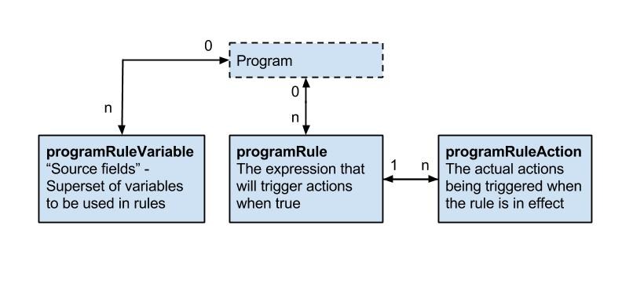

# Metadata { #webapi_metadata }

## Identifier schemes { #webapi_identifier_schemes } 

This section provides an explanation of the identifier scheme concept.
Identifier schemes are used to map metadata objects to other metadata
during import, and to render metadata as part of exports. Note
that not all schemes work for all API calls, and not all
schemes can be used for both input and output. This is outlined in the
sections explaining the various API endpoints.

The full set of identifier scheme object types available are listed
below, using the name of the property to use in queries:

  - idScheme
  - dataElementIdScheme
  - categoryOptionComboIdScheme
  - orgUnitIdScheme
  - programIdScheme
  - programStageIdScheme
  - trackedEntityIdScheme
  - trackedEntityAttributeIdScheme

The general idScheme applies to all types of objects. It can be
overridden by specific object types.

The default scheme for all parameters is UID (stable DHIS2
identifiers). The supported identifier schemes are described in the
table below.

Table: Scheme Values

| Scheme | Description |
|---|---|
| ID, UID | Match on DHIS2 stable Identifier, this is the default id scheme. |
| CODE | Match on DHIS2 Code, mainly used to exchange data with an external system. |
| NAME | Match on DHIS2 Name, please note that this uses what is available as *object.name*, and not the translated name. Also note that names are not always unique, and in that case, they can not be used. |
| ATTRIBUTE:ID | Match on metadata attribute, this attribute needs to be assigned to the type you are matching on, and also that the unique property is set to *true*. The main usage of this is also to exchange data with external systems, it has some advantages over *CODE* since multiple attributes can be added, so it can be used to synchronize with more than one system. |

Note that identifier schemes is not an independent feature but needs to
be used in combination with resources such as data value import, metadata import and
GeoJson import.

As an example, to specify CODE as the general id scheme and override
with UID for organisation unit id scheme you can use these query
parameters:

    ?idScheme=CODE&orgUnitIdScheme=UID

As another example, to specify an attribute for the organisation unit id
scheme, code for the data element id scheme and use the default UID id
scheme for all other objects you can use these parameters:

    ?orgUnitIdScheme=ATTRIBUTE:j38fk2dKFsG&dataElementIdScheme=CODE

## Browsing the Web API { #webapi_browsing_the_web_api } 

The entry point for browsing the Web API is `/api`. This resource
provides links to all available resources. Four resource representation
formats are consistently available for all resources: HTML, XML, JSON,
and JSONP. Some resources will have other formats available, like MS
Excel, PDF, CSV, and PNG. To explore the API from a web browser, navigate
to the `/api` entry point and follow the links to your desired
resource, for instance `/api/dataElements`. For all resources which
return a list of elements certain query parameters can be used to modify
the response:

Table: Query parameters

| Parameter | Option values | Default option | Description |
|---|---|---|---|
| paging | true &#124; false | true | Indicates whether to return lists of elements in pages. |
| page | number | 1 | Defines which page number to return. |
| pageSize | number | 50 | Defines the number of elements to return for each page. |
| order | property:asc/iasc/desc/idesc || Order the output using a specified order, only properties that are both persisted and simple (no collections, idObjects etc) are supported. iasc and idesc are case insensitive sorting. If it is wanted to sort for more than one property, separate them using a comma.  |

An example of how these parameters can be used to get a full list of
data element groups in XML response format is:

    /api/dataElementGroups.xml?links=false&paging=false

You can query for elements on the name property instead of returning
a full list of elements using the *query* query variable. In this example
we query for all data elements with the word "anaemia" in the name:

    /api/dataElements?query=anaemia

You can get specific pages and page sizes of objects like this:

    /api/dataElements.json?page=2&pageSize=20

You can completely disable paging like this:

    /api/indicatorGroups.json?paging=false

To order the result based on a specific property:

    /api/indicators.json?order=shortName:desc

To order the result based on created datetime property first (descending order) and then by name property (ascending order):

    /api/indicators.json?order=created:desc,name:asc

You can find an object based on its ID across all object types through
the *identifiableObjects* resource:

    /api/identifiableObjects/<id>

### Translation { #webapi_translation } 

DHIS2 supports translations of database content, such as data elements,
indicators, and programs. All metadata objects in the Web API have
properties meant to be used for display / UI purposes, which include
*displayName*, *displayShortName*, *displayDescription* and
*displayFormName* (for data elements and tracked entity attributes).

Table: Translate options

| Parameter | Values | Description |
|---|---|---|
| translate | true &#124; false | Translate display\* properties in metadata output (displayName, displayShortName, displayDescription, and displayFormName for data elements and tracked entity attributes). Default value is true. |
| locale | Locale to use | Translate metadata output using a specified locale (requires translate=true). |

### Translation API { #webapi_translation_api } 

The translations for an object is rendered as part of the object itself
in the *translations* array. Note that the *translations* array in the
JSON/XML payloads is normally pre-filtered for you, which means they
can not directly be used to import/export translations (as that would
normally overwrite locales other than current users).

Example of data element with translation array filtered on user locale:

```json
{
  "id": "FTRrcoaog83",
  "displayName": "Accute French",
  "translations": [
    {
      "property": "SHORT_NAME",
      "locale": "fr",
      "value": "Accute French"
    },
    {
      "property": "NAME",
      "locale": "fr",
      "value": "Accute French"
    }
  ]
}
```

Example of data element with translations turned off:

```json
{
  "id": "FTRrcoaog83",
  "displayName": "Accute Flaccid Paralysis (Deaths < 5 yrs)",
  "translations": [
    {
      "property": "FORM_NAME",
      "locale": "en_FK",
      "value": "aa"
    },
    {
      "property": "SHORT_NAME",
      "locale": "en_GB",
      "value": "Accute Flaccid Paral"
    },
    {
      "property": "SHORT_NAME",
      "locale": "fr",
      "value": "Accute French"
    },
    {
      "property": "NAME",
      "locale": "fr",
      "value": "Accute French"
    },
    {
      "property": "NAME",
      "locale": "en_FK",
      "value": "aa"
    },
    {
      "property": "DESCRIPTION",
      "locale": "en_FK",
      "value": "aa"
    }
  ]
}
```

Note that even if you get the unfiltered result, and are using the
appropriate type endpoint i..e `/api/dataElements` we do not allow
updates, as it would be too easy to make mistakes and overwrite the
other available locales.

To read and update translations you can use the special translations
endpoint for each object resource. These can be accessed by *GET* or
*PUT* on the appropriate `/api/<object-type>/<object-id>/translations` endpoint.

As an example, for a data element with identifier `FTRrcoaog83`, you could use
`/api/dataElements/FTRrcoaog83/translations` to get and update
translations. The fields available are `property` with options *NAME*,
*SHORT_NAME*, *FORM_NAME*, *DESCRIPTION*, `locale` which supports any valid
locale ID and the translated property `value`.

Example of NAME property for French locale:

```json
{
  "property": "NAME",
  "locale": "fr",
  "value": "Paralysie Flasque Aiguë (Décès <5 ans)"
}
```

This payload would then be added to a translation array, and sent back
to the appropriate endpoint:

```json
{
  "translations": [
    {
      "property": "NAME",
      "locale": "fr",
      "value": "Paralysie Flasque Aiguë (Décès <5 ans)"
    }
  ]
}
```

For a data element with ID *FTRrcoaog83* you can *PUT* this to
`/api/dataElements/FTRrcoaog83/translations`. Make sure to send all
translations for the specific object and not just for a single locale
(if not you will potentially overwrite existing locales for other
locales).

The status code will be `204 No Content` if the data value was successfully saved or updated, or `404 Not Found` if there was a validation error (e.g. more than one `SHORT_NAME` for the same `locale`).


### Web API versions { #webapi_api_versions } 

The Web API `/api` can be used with a DHIS2 version number, example:

    /api/42/dataElements

Versions `28`-`43` are supported. Calling an endpoint with or without a version does not change the behaviour of the API. The behaviour is the same no matter which approach is used. We aim to remove supporting API calls with versions, so please use API calls without the use of a version number.  
The support for using versions is due to legacy design, which didn't evolve as originally envisioned. 

## Metadata object filter { #webapi_metadata_object_filter } 

To filter the metadata there are several filter operations that can be
applied to the returned list of metadata. The format of the filter
itself is straight-forward and follows the pattern
*property:operator:value*, where *property* is the property on the
metadata you want to filter on, *operator* is the comparison operator
you want to perform and *value* is the value to check against (not all
operators require value). 

Please see the *schema* section to discover which properties are available. 
In addition to the listed properties filters can apply to custom attribute 
values by using the attribute's ID as property name.

Recursive filtering, ie. filtering on associated objects or collection of 
objects, is supported as well.

Table: Available Operators

| Operator | Types | Value required | Description |
|---|---|---|---|
| eq | string &#124; boolean &#124; integer &#124; float &#124; enum &#124; collection (checks for size) &#124; date | true | Equality |
| !eq | string &#124; boolean &#124; integer &#124; float &#124; enum &#124; collection (checks for size) &#124; date | true | Inequality |
| ieq | string  | true  | Case insensitive string, match exact |
| ne | string &#124; boolean &#124; integer &#124; float &#124; enum &#124; collection (checks for size) &#124; date | true | Inequality |
| like | string | true | Case sensitive string, match anywhere |
| !like | string | true | Case sensitive string, not match anywhere |
| $like | string | true | Case sensitive string, match start |
| !$like | string | true | Case sensitive string, not match start |
| like$ | string | true | Case sensitive string, match end |
| !like$ | string | true | Case sensitive string, not match end |
| ilike | string | true | Case insensitive string, match anywhere |
| !ilike | string | true | Case insensitive string, not match anywhere |
| $ilike | string | true | Case insensitive string, match start |
| !$ilike | string | true | Case insensitive string, not match start |
| ilike$ | string | true | Case insensitive string, match end |
| !ilike$ | string | true | Case insensitive string, not match end |
| gt | string &#124; boolean &#124; integer &#124; float &#124; collection (checks for size) &#124; date | true | Greater than |
| ge | string &#124; boolean &#124; integer &#124; float &#124; collection (checks for size) &#124; date | true | Greater than or equal |
| lt | string &#124; boolean &#124; integer &#124; float &#124; collection (checks for size) &#124; date | true | Less than |
| le | string &#124; boolean &#124; integer &#124; float &#124; collection (checks for size) &#124; date | true | Less than or equal |
| null | all | false | Property is null |
| !null | all | false | Property is not null |
| empty | collection | false | Collection is empty |
| token | string | true | Match on multiple tokens in search property |
| !token | string | true | Not match on multiple tokens in search property |
| in | string &#124; boolean &#124; integer &#124; float &#124; date | true | Find objects matching 1 or more values |
| !in | string &#124; boolean &#124; integer &#124; float &#124; date | true | Find objects not matching 1 or more values |

Operators will be applied as logical *and* query. If you need a *or*
query, you can have a look at the *in* filter and the section below.
The filtering mechanism allows for recursion. See below for some examples.

Get data elements with id property ID1 or ID2:

    /api/dataElements?filter=id:eq:ID1&filter=id:eq:ID2

Get data elements, ignoring case, with name property MyDataElement:

    /api/dataElements?filter=name:ieq:mydataelement

Get all data elements which have a data set with id ID1:

    /api/dataElements?filter=dataSetElements.dataSet.id:eq:ID1

Get all data elements with aggregation operator *sum* and value type
*int*:

    /api/dataElements.json?filter=aggregationOperator:eq:sum&filter=type:eq:int

You can do filtering within collections, e.g. to get data elements which
are members of the *ANC* data element group you can use the following
query using the id property of the associated data element groups:

    /api/dataElements.json?filter=dataElementGroups.id:eq:qfxEYY9xAl6

To get data elements with a particular attribute value for a metadata 
attribute, a filter for the attribute ID and the attribute value can be 
specified using the same collection query syntax:

    /api/dataElements.json?filter=attributeValues.attribute.id:eq:n2xYlNbsfko&filter=attributeValues.value:eq:AFP

Get data elements which have any option set:

    /api/dataElements?filter=optionSet:!null

Since all operators are *and* by default, you can't find a data
element matching more than one id, for that purpose you can use the *in*
operator.

    /api/dataElements.json?filter=id:in:[fbfJHSPpUQD,cYeuwXTCPkU]

### Logical operators { #webapi_metadata_logical_operator } 

As mentioned in the section before, the default logical operator applied
to the filters is *AND* which means that all object filters must be
matched. There are however cases where you want to match on one of
several filters (maybe id and code field) and in those cases, it is
possible to switch the root logical operator from *AND* to *OR*
using the *rootJunction* parameter.

Example: Normal filtering where both id and code must match to have a
result returned

    /api/dataElements.json?filter=id:in:[id1,id2]&filter=code:eq:code1

Example: Filtering where the logical operator has been switched to OR
and now only one of the filters must match to have a result
    returned

    /api/dataElements.json?filter=id:in:[id1,id2]&filter=code:eq:code1&rootJunction=OR

### Identifiable token filter

In addition to the specific property based filtering mentioned above,
we also have *token* based *AND* filtering across a set of
properties: id, code, and name (also shortName if available). These
properties are commonly referred to as *identifiable*. The idea is to
filter metadata whose id, name, code or short name containing something.

Example: Filter all data elements containing *2nd* in any of the
following: id,name,code, shortName

    /api/dataElements.json?filter=identifiable:token:2nd

It is also possible to specify multiple filtering values.

Example: Get all data elements where *ANC visit* is found in any of the *identifiable* properties. The system returns all data elements where both tokens (ANC and visit) are found anywhere in identifiable properties.

    /api/dataElements.json?filter=identifiable:token:ANC visit

It is also possible to combine the identifiable filter with property-based filter and expect the *rootJunction* to be applied.

    /api/dataElements.json?filter=identifiable:token:ANC visit&filter=displayName:ilike:tt1
    
    /api/dataElements.json?filter=identifiable:token:ANC visit
      &filter=displayName:ilike:tt1&rootJunction=OR

## Metadata field filter { #webapi_metadata_field_filter } 

In many situations, the default views of the metadata can be too
verbose. A client might only need a few fields from each object and want
to remove unnecessary fields from the response. To discover which fields
are available for each object please see the *schema* section.
In addition to the listed properties custom attributes can be included
for top level objects by using the attribute's ID as property name.

The format for include/exclude allows for infinite recursion. To filter
at the "root" level you can just use the name of the field,
i.e. `?fields=id,name` which would only display the `id` and
`name` fields for every object. For objects that are either collections or
complex objects with properties on their own, you can use the format
`?fields=id,name,dataSets[id,name]` which would return `id`, `name` of
the root, and the `id` and `name` of every data set on that object.
Negation can be done with the exclamation operator, and we have a set of
presets of field select. Both XML and JSON formats are supported.

**Example**: Get `id` and `name` on the indicators resource:

    /api/indicators?fields=id,name

**Example**: Get `id` and `name` from data elements, and `id` and `name`
from the associated data sets:

    /api/dataElements?fields=id,name,dataSets[id,name]

**Example**: Get `id`, `name` and the value of a user defined attribute 
with ID `DnrLSdo4hMl` for organisation units:

    /api/organisationUnits?fields=id,name,DnrLSdo4hMl

The attribute is then included as property `DnrLSdo4hMl` of each
matching object in the response. This can be renamed using the `rename` 
transformer as shown in the next section.

To exclude a field from the output you can use the exclamation `!`
operator. This is allowed anywhere in the query and will simply not
include that property as it might have been inserted in some of the
presets.

A few presets (selected fields groups) are available and can be applied
using the `:` operator.

Table: Property operators

| Operator | Description |
|---|---|
| <field-name\> | Include property with name, if it exists. |
| <object\>[<field-name\>, ...] | Includes a field within either a collection (will be applied to every object in that collection), or just on a single object. |
| !<field-name\>, <object\>[!<field-name\> | Do not include this field name, it also works inside objects/collections. Useful when you use a preset to include fields. |
| \*, <object\>[\*] | Include all fields on a certain object, if applied to a collection, it will include all fields on all objects on that collection. |
| :<preset\> | Alias to select multiple fields. Three presets are currently available, see the table below for descriptions. |

Table: Field presets

| Preset | Description |
|---|---|
| all | All fields of the object |
| \* | Alias for all |
| identifiable | Includes id, name, code, created, lastUpdated and lastUpdatedBy fields |
| nameable | Includes id, name, shortName, code, description, created and lastUpdated fields |
| persisted | Returns all persisted property on an object, does not take into consideration if the object is the owner of the relation. |
| owner | Returns all persisted property on an object where the object is the owner of all properties, this payload can be used to update through the API. |

**Example**: Include all fields from data sets except organisation units:

    /api/dataSets?fields=:all,!organisationUnits

**Example**: Include only id, name and the collection of organisation units from a data set, but exclude the id from organisation units:

    /api/dataSets/BfMAe6Itzgt?fields=id,name,organisationUnits[:all,!id]

**Example**: Include nameable properties from all indicators:

    /api/indicators.json?fields=:nameable

### Field transformers { #webapi_field_transformers } 

Field transforms can be used to transform properties. The syntax is described below.

    /api/dataElements/ID?fields=id~rename(i),name~rename(n)

This will rename the *id* property to *i* and *name* property to *n*.

Multiple transformers can be applied to a single property by repeating the transformer operator:

    /api/dataElementGroups.json?fields=id,displayName,dataElements~isNotEmpty~rename(haveDataElements)

The supported transformer operators are described in the table below.

Table: Available Transformers

| Name | Arguments | Description |
|---|---|---|
| size || Gives sizes of strings (length) and collections |
| isEmpty || Is string or collection empty |
| isNotEmpty || Is string or collection not empty |
| rename | Arg1: name | Renames the property name |
| paging | Arg1: page,Arg2: pageSize | Pages a collection, default pageSize is 50. |
| pluck | Optional Arg1: fieldName | Converts an array of objects to an array of a selected field of that object. By default, the first field that is returned by the collection is used (normally the ID). |
| keyBy | Optional Arg1: fieldName | Converts an array of objects to an object where the fieldName (default id) is used as the key. This can be useful for quick lookups in JavaScript for example |

#### Examples { #webapi_field_transformers_examples } 

Examples of transformer usage are found below.

Get the size of a collection:

	/api/dataElements?fields=dataSets~size

Test if a collection is empty:

	/api/dataElements?fields=dataSets~isEmpty

Test if a collection is not empty:

	/api/dataElements?fields=dataSets~isNotEmpty

Rename properties:

	/api/dataElements/ID?fields=id~rename(i),name~rename(n)

Apply paging to a collection:

	/api/dataElementGroups?fields=id,displayName,dataElements~paging(1;20)

Get array with IDs of organisation units:

	/api/categoryOptions.json?fields=id,organisationUnits~pluck

Get array with names of organisation units:

	/api/categoryOptions.json?fields=id,organisationUnits~pluck[name]

Key the dataElements array by the `id` field:

    /api/dataElementGroups.json?fields=id,name,dataElements~keyBy[id,name,valueType]

Key the dataElements array by the `valueType` field, since multiple hits this will results in arrays (of data elements):

    /api/dataElementGroups.json?fields=id,name,dataElements~keyBy(valueType)[id,name,valueType]

## Metadata create, read, update, delete, validate { #webapi_metadata_crud } 

All metadata entities in DHIS2 have their own API endpoint which supports
*CRUD* operations (create, read, update and delete). The endpoint URLs
follows this format:

    /api/<entityName>

The _entityName_ uses the camel-case notation. As an example, the endpoint
for _data elements_ is:

    /api/dataElements

> **_NOTE:_**  When updating objects, all existing property values will be overwritten, even if the new value is null. Please use [JSON Patch API](#webapi_partial_updates) in case you want do partial update to an object.

### Create / update parameters { #webapi_metadata_create_update } 

The following request query parameters are available across all metadata endpoints.

Table: Available Query Filters

| Param | Type | Required | Options (default first) | Description |
|---|---|---|---|---|
| preheatCache | boolean | false | true &#124; false | Turn cache-map preheating on/off. This is on by default, turning this off will make initial load time for importer much shorter (but will make the import itself slower). This is mostly used for cases where you have a small XML/JSON file you want to import, and don't want to wait for cache-map preheating. |
| importStrategy | enum | false | CREATE_AND_UPDATE &#124; CREATE &#124; UPDATE &#124; DELETE | Import strategy to use, see below for more information. |

### Creating and updating objects { #webapi_creating_updating_objects } 

For creating new objects you will need to know the endpoint, the type
format, and make sure that you have the required authorities. As an
example, we will create and update a *constant*. To figure out the
format, we can use the new *schema* endpoint for getting format
description. So we will start with getting that info:

    http://<server>/api/schemas/constant.json

From the output, you can see that the required authorities for create
are `F_CONSTANT_ADD`, and the important properties are: *name* and
*value*. From this, we can create a JSON payload and save it as a file
called constant.json:

```json
{
  "name": "PI",
  "value": "3.14159265359"
}
```

The same content as an XML payload:

```xml
<constant name="PI" xmlns="http://dhis2.org/schema/dxf/2.0">
  <value>3.14159265359</value>
</constant>
```

We are now ready to create the new *constant* by sending a POST request to
the `constants` endpoint with the JSON payload using curl:

```bash
curl -d @constant.json "http://server/api/constants" -X POST
  -H "Content-Type: application/json" -u user:password
```

A specific example of posting the constant to the demo server:

```bash
curl -d @constant.json "https://play.dhis2.org/api/constants" -X POST
  -H "Content-Type: application/json" -u admin:district
```

If everything went well, you should see an output similar to:

```json
{
  "status": "SUCCESS",
  "importCount": {
    "imported": 1,
    "updated": 0,
    "ignored": 0,
    "deleted": 0
  },
  "type": "Constant"
}
```

The process will be exactly the same for updating, you make your changes
to the JSON/XML payload, find out the *ID* of the constant, and then
send a PUT request to the endpoint including ID:

```bash
curl -X PUT -d @pi.json -H "Content-Type: application/json"
  -u user:password "http://server/api/constants/ID"
```

### Deleting objects { #webapi_deleting_objects } 

Deleting objects is very straight forward, you will need to know the
*ID* and the endpoint of the type you want to delete, let's continue our
example from the last section and use a *constant*. Let's assume that
the id is *abc123*, then all you need to do is the send the DELETE
request to the endpoint + id:

```bash
curl -X DELETE -u user:password "http://server/api/constants/ID"
```

A successful delete should return HTTP status 204 (no content).

### Adding and removing objects in collections { #webapi_adding_removing_objects_collections } 

The collections resource lets you modify collections of
objects.

#### Adding or removing single objects { #webapi_collections_adding_removing_single_objects } 

In order to add or remove objects to or from a collection of objects you
can use the following
    pattern:

    /api/{collection-object}/{collection-object-id}/{collection-name}/{object-id}

You should use the POST method to add, and the DELETE method to remove
an object. When there is a many-to-many relationship between objects,
you must first determine which object owns the relationship. If it isn't
clear which object this is, try the call both ways to see which works.

The components of the pattern are:

  - collection object: The type of objects that owns the collection you
    want to modify.

  - collection object id: The identifier of the object that owns the
    collection you want to modify.

  - collection name: The name of the collection you want to modify.

  - object id: The identifier of the object you want to add or remove
    from the collection.

As an example, in order to remove a data element with identifier IDB
from a data element group with identifier IDA you can do a DELETE
request:

    DELETE /api/dataElementGroups/IDA/dataElements/IDB

To add a category option with identifier IDB to a category with
identifier IDA you can do a POST
request:

    POST /api/categories/IDA/categoryOptions/IDB

#### Adding or removing multiple objects { #webapi_collections_adding_removing_multiple_objects } 

You can add or remove multiple objects from a collection in one request
with a payload like this:

```json
{
  "identifiableObjects": [{
      "id": "IDA"
    }, {
      "id": "IDB"
    }, {
      "id": "IDC"
    }
  ]
}
```

Using this payload you can add, replace or delete items:

*Adding Items:*

    POST /api/categories/IDA/categoryOptions

*Replacing Items:*

    PUT /api/categories/IDA/categoryOptions

*Delete
Items:*

    DELETE /api/categories/IDA/categoryOptions

#### Adding and removing objects in a single request { #webapi_collections_adding_removing_objects_single_request } 

You can both add and remove objects from a collection in a single POST
request to the following URL:

    POST /api/categories/IDA/categoryOptions

The payload format is:

```json
{
  "additions": [{
      "id": "IDA"
    }, {
      "id": "IDB"
    }, {
      "id": "IDC"
    }
  ],
  "deletions": [{
      "id": "IDD"
    }, {
      "id": "IDE"
    }, {
      "id": "IDF"
    }
  ]
}
```

### Validating payloads { #webapi_validating_payloads } 

DHIS 2 supports system wide validation of metadata payloads, which means
that create and update operations on the API endpoints will be checked for
valid payload before allowing changes to be made. To find out what validations
are in place for a specific endpoint, have a look at the `/api/schemas`
endpoint, i.e. to figure out which constraints a data element have, you
would go to `/api/schemas/dataElement`.

You can also validate your payload manually by sending it to the proper
schema endpoint. If you wanted to validate the constant from the create
section before, you would send it like this:

    POST /api/schemas/constant

A simple (non-validating) example would be:

```bash
curl -X POST -d "{\"name\": \"some name\"}" -H "Content-Type: application/json"
  -u admin:district "https://play.dhis2.org/dev/api/schemas/dataElement"
```

Which will yield the result:

```json
[
   {
      "message" : "Required property missing.",
      "property" : "type"
   },
   {
      "property" : "aggregationOperator",
      "message" : "Required property missing."
   },
   {
      "property" : "domainType",
      "message" : "Required property missing."
   },
   {
      "property" : "shortName",
      "message" : "Required property missing."
   }
]
```

### Partial updates { #webapi_partial_updates } 

For our API endpoints that deal with metadata, we support partial updates (PATCH) using the JSON patch [standard](https://tools.ietf.org/html/rfc6902). The payload basically outlines a set of operation you want applied to a existing metadata object. For JSON patch details and examples, see [jsonpatch.com](http://jsonpatch.com/). Three operators are supported: `add`, `remove` and `replace`.

Below is a few examples relevant to DHIS2. Note that any update to a payload should be thought of as a HTTP PUT operation, i.e. any mutation must result in a valid PUT metadata payload.

The default `importReportMode` for JSON patch is `ERRORS_NOT_OWNER` which implies that when updating any property which is not owned by that particular object (for example trying to add a indicator group directly to an indicator) you will get an error.

As per the JSON patch specification you must always use the mimetype `application/json-patch+json` when sending patches.

#### Examples

##### Update name and value type of data element

```
PATCH /api/dataElements/{id}
```

```json
[
  {"op": "add", "path": "/name", "value": "New Name"},
  {"op": "add", "path": "/valueType", "value": "INTEGER"}
] 
```

##### Add new data element to a data element group

```
PATCH /api/dataElementGroups/{id}
```

```json
[
  {"op": "add", "path": "/dataElements/-", "value": {"id": "data-element-id"}}
]
```

##### Remove all data element associations from a data element group

```
PATCH /api/dataElementGroups/{id}
```

```json
[
  {"op": "remove", "path": "/dataElements"}
]
```

##### Change domain and value type of a data element

```
PATCH /api/dataElements/{id}
```

```json
[
    {"op": "add", "path": "/domainType", "value": "TRACKER"},
    {"op": "add", "path": "/valueType", "value": "INTEGER"}
]
```

##### Remove a specific orgUnit from an orgUnit group

```
PATCH /api/organisationUnitGroups/{id}
```

```json
[
  {"op": "remove", "path": "/organisationUnits/1"}
]
```

#### Blocked add dataElementGroup to dataElement

```
PATCH /api/dataElements/{id}?importReportMode=ERRORS_NOT_OWNER
```

```json
[
    {"op": "add", "path": "/dataElementGroups/-", "value": {"id": "data-element-group-id"}}
]
```

#### Blocked update name of dataElementGroup in dataElement

```
PATCH /api/dataElements/{id}?importReportMode=ERRORS_NOT_OWNER
```

```json
[
    {"op": "add", "path": "/dataElementGroups/0", "value": {"name": "new-name"}}
]
```
#### Remove collection item by id

```
PATCH /api/dataSets/{id}?importReportMode=ERRORS_NOT_OWNER
```

```json
[
    {"op": "remove-by-id", "path": "/organisationUnits", "id": "u6CvKyF0Db5"}
]
```

#### Patch request with invalid path
If `path` property is invalid or does not exist the patch service will return an error as below


```
PATCH /api/dataSets/{id}?importReportMode=ERRORS_NOT_OWNER
```

```json
[
    {"op": "remove-by-id", "path": "/test", "id": "u6CvKyF0Db5"}
]
```
Response
```json
{
    "httpStatus": "Bad Request",
    "httpStatusCode": 400,
    "status": "ERROR",
    "message": "Invalid path /test"
}
```

### Metadata CSV export { #webapi_metadata_csv_export } 

Field filtering works almost the same for CSV (please note that using CSV on the `/api/metadata` endpoint is not supported), but not that
field fransformations are not yet supported.

For endpoints that support CSV (our metadata endpoints like `/api/dataElements` `/api/organisationUnits`) you can either use the `Accept` header with
value `text/csv` or you can use the extension `.csv`. Be aware that complex objects are not supported, and we only support id-object collections (so a list of UIDs
will be returned).

| Name | Options | Description |
|---|---|---|
| fields | Same as metadata field filter (with the caveats mentioned above) | Default filter is `id,displayName` |
| skipHeader | false/true | Should the header (with column names) be included or not
| separator | Default: `.` | Column separator
| arraySeparator | Default: `;` | If one of the field is a collection of id-objects this separator will separate all the UIDs

#### Examples

#### Get all data elements including their group associations

```
/api/dataElements.csv?fields=id,displayName,dataElementGroups
```

#### Get all org units including geometry (which will get ignored)

```
/api/organisationUnits.csv?fields=id,displayName,organisationUnitGroups,geometry
```

## Metadata export { #webapi_metadata_export } 

This section explains the metatada API which is available at
`/api/metadata`. XML and JSON resource representations are supported.

    /api/metadata

The most common parameters are described below in the "Export Parameter"
table. You can also apply this to all available types by using
`type:fields=<filter>` and `type:filter=<filter>`. You can also
enable/disable the export of certain types by setting `type=true|false`.

Table: Export parameters

| Name | Options | Description |
|---|---|---|
| fields | Same as metadata field filter | Default field filter to apply for all types, default is `:owner`. |
| filter | Same as metadata object filter | Default object filter to apply for all types, default is `none`. |
| order | Same as metadata order | Default order to apply to all types, default is `name` if available, or `created` if not. |
| translate | false/true | Enable translations. Be aware that this is turned off by default (in other endpoints this is on by default). |
| locale | <locale\> | Change from user locale, to your own custom locale. |
| defaults | INCLUDE/EXCLUDE | Should auto-generated category object be included or not in the payload. If you are moving metadata between 2 non-synced instances, it might make sense to set this to EXCLUDE to ease the handling of these generated objects. |
| skipSharing | false/true | Enabling this will strip the sharing properties from the exported objects. This includes *user*, *publicAccess*, *userGroupAccesses*, *userAccesses*, and *externalAccess*. |
| inclusionStrategy | NON_NULL, ALWAYS, NON_EMPTY | *NON_NULL* includes properties which are not null, *ALWAYS* includes all properties, *NON_EMPTY* includes non empty properties (will not include strings of 0 length or empty collections) |
| download | false/true | Enabling this will add HTTP header Content-Disposition that specifies that the data should be handled as an attachment and will be offered by web browsers as a download. |

### Metadata export examples { #webapi_metadata_export_examples } 

Export all metadata. Be careful as the response might be very large depending
on your metadata configuration:

    /api/metadata

Export all metadata ordered by lastUpdated descending:

    /api/metadata?defaultOrder=lastUpdated:desc

Export metadata only including indicators and indicator groups:

    /api/metadata?indicators=true&indicatorGroups=true

Export id and displayName for all data elements, ordered by displayName:

    /api/metadata?dataElements:fields=id,name&dataElements:order=displayName:desc

Export data elements and indicators where name starts with "ANC":

    /api/metadata?filter=name:^like:ANC&dataElements=true&indicators=true

### Metadata export with dependencies { #webapi_dataset_program_export_dependencies } 

When you want to exchange metadata for a data set, program, category combo,
dashboard, option set or data element group
from one DHIS2 instance to another instance there are six dedicated endpoints available:

```
/api/dataSets/{id}/metadata.json

/api/programs/{id}/metadata.json

/api/categoryCombos/{id}/metadata.json

/api/dashboards/{id}/metadata.json

/api/optionSets/{id}/metadata.json

/api/dataElementGroups/{id}/metadata.json
```

These exports can then be imported using `/api/metadata`.

These endpoints also support the following parameters:

Table: Export parameters

| Name | Options | Description |
|---|---|---|
| skipSharing | false/true | Enabling this will strip the sharing properties from the exported objects. This includes *user*, *publicAccess*, *userGroupAccesses*, *userAccesses*, and *externalAccess*. |
| download | false/true | Enabling this will add HTTP header Content-Disposition that specifies that the data should be handled as an attachment and will be offered by web browsers as a download. |

## Metadata import { #webapi_metadata_import } 

This section explains the metadata import API. XML and JSON resource
representations are supported. Metadata can be imported using a *POST* request.

    /api/metadata

The importer allows you to import metadata payloads which may include many
different entities and any number of objects per entity. The metadata export
generated by the metadata export API can be imported directly.

The metadata import endpoint support a variety of parameters, which are
listed below.

Table: Import parameters

| Name | Options (first is default) | Description |
|---|---|---|
| importMode | COMMIT, VALIDATE | Sets overall import mode, decides whether or not to only `VALIDATE` or also `COMMIT` the metadata, this has similar functionality as our old dryRun flag. |
| identifier | UID, CODE, AUTO | Sets the identifier scheme to use for reference matching. `AUTO` means try `UID` first, then `CODE`. |
| importReportMode | ERRORS, FULL, DEBUG | Sets the `ImportReport` mode, controls how much is reported back after the import is done. `ERRORS` only includes *ObjectReports* for object which has errors. `FULL` returns an *ObjectReport* for all objects imported, and `DEBUG` returns the same plus a name for the object (if available). |
| preheatMode | REFERENCE, ALL, NONE | Sets the preheater mode, used to signal if preheating should be done for `ALL` (as it was before with *preheatCache=true*) or do a more intelligent scan of the objects to see what to preheat (now the default), setting this to `NONE` is not recommended. |
| importStrategy | CREATE_AND_UPDATE, CREATE, UPDATE, DELETE | Sets import strategy, `CREATE_AND_UPDATE` will try and match on identifier, if it doesn't exist, it will create the object. |
| atomicMode | ALL, NONE | Sets atomic mode, in the old importer we always did a *best effort* import, which means that even if some references did not exist, we would still import (i.e. missing data elements on a data element group import). Default for new importer is to not allow this, and similar reject any validation errors. Setting the `NONE` mode emulated the old behavior. |
| flushMode | AUTO, OBJECT | Sets the flush mode, which controls when to flush the internal cache. It is *strongly* recommended to keep this to `AUTO` (which is the default). Only use `OBJECT` for debugging purposes, where you are seeing hibernate exceptions and want to pinpoint the exact place where the stack happens (hibernate will only throw when flushing, so it can be hard to know which object had issues). |
| skipSharing | false, true | Skip sharing properties, does not merge sharing when doing updates, and does not add user group access when creating new objects. |
| skipValidation | false, true | Skip validation for import. `NOT RECOMMENDED`. |
| async | false, true | Asynchronous import, returns immediately with a *Location* header pointing to the location of the *importReport*. The payload also contains a json object of the job created. |
| userOverrideMode | NONE, CURRENT, SELECTED | Allows you to override the user property of every object you are importing, the options are NONE (do nothing), CURRENT (use import user), SELECTED (select a specific user using overrideUser=X) |
| overrideUser | User ID | If userOverrideMode is SELECTED, use this parameter to select the user you want override with. |

> **NOTE** When updating objects, all property values will be overwritten even if the new values are `null`. Please use [JSON Patch API](#webapi_partial_updates) in case you want do partial update to an object.


An example of a metadata payload to be imported looks like this. Note how
each entity type have their own property with an array of objects:

```json
{
  "dataElements": [
    {
      "name": "EPI - IPV 3 doses given",
      "shortName": "EPI - IPV 3 doses given",
      "aggregationType": "SUM",
      "domainType": "AGGREGATE",
      "valueType": "INTEGER_ZERO_OR_POSITIVE"
    },
    {
      "name": "EPI - IPV 4 doses given",
      "shortName": "EPI - IPV 4 doses given",
      "aggregationType": "SUM",
      "domainType": "AGGREGATE",
      "valueType": "INTEGER_ZERO_OR_POSITIVE"
    }
  ],
  "indicators": [
    {
      "name": "EPI - ADS stock used",
      "shortName": "ADS stock used",
      "numerator": "#{LTb8XeeqeqI}+#{Fs28ZQJET6V}-#{A3mHIZd2tPg}",
      "numeratorDescription": "ADS 0.05 ml used",
      "denominator": "1",
      "denominatorDescription": "1",
      "annualized": false,
      "indicatorType": {
        "id": "kHy61PbChXr"
      }
    }
  ]
}
```

When posting this payload to the metadata endpoint, the response will contain
information about the parameters used during the import and a summary per
entity type including how many objects were created, updated, deleted and
ignored:

```json
{
  "importParams": {
    "userOverrideMode": "NONE",
    "importMode": "COMMIT",
    "identifier": "UID",
    "preheatMode": "REFERENCE",
    "importStrategy": "CREATE_AND_UPDATE",
    "atomicMode": "ALL",
    "flushMode": "AUTO",
    "skipSharing": false,
    "skipTranslation": false,
    "skipValidation": false,
    "metadataSyncImport": false,
    "firstRowIsHeader": true,
    "username": "UNICEF_admin"
  },
  "status": "OK",
  "typeReports": [
    {
      "klass": "org.hisp.dhis.dataelement.DataElement",
      "stats": {
        "created": 2,
        "updated": 0,
        "deleted": 0,
        "ignored": 0,
        "total": 2
      }
    },
    {
      "klass": "org.hisp.dhis.indicator.Indicator",
      "stats": {
        "created": 1,
        "updated": 0,
        "deleted": 0,
        "ignored": 0,
        "total": 1
      }
    }
  ],
  "stats": {
    "created": 3,
    "updated": 0,
    "deleted": 0,
    "ignored": 0,
    "total": 3
  }
}
```

!INCLUDE "geo-json.md"

## Schema { #webapi_schema } 

A resource which can be used to introspect all available DXF 2 objects
can be found on `/api/schemas`. For specific resources you can have a
look at `/api/schemas/<type>`.

To get all available schemas in XML:

    GET /api/schemas.xml

To get all available schemas in JSON:

    GET /api/schemas.json

To get JSON schema for a specific class:

    GET /api/schemas/dataElement.json


## Icons { #webapi_icons } 

DHIS2 includes a collection of icons that can be used to give visual
context to metadata. There are two different kind of icons:
  - Default icons: they are pre-installed in the application and are not possible to modify nor delete.
  - Custom icons: can be created, updated and deleted at will.

Both of them be accessed through the icons resource.

    GET /api/icons

This endpoint returns a list of information about the available default and custom icons.
By default key, description, keywords and href will be included in response. But fields parameter can be used to change this behaviour.

```json
{
  key: "mosquito_outline",
  description: "Mosquito outline",
  keywords: [
    "malaria",
    "mosquito",
    "dengue"
  ],
  "created": "2024-02-12T09:50:11.794",
  "lastUpdated": "2024-02-12T09:50:11.794",
  href: "<dhis server>/api/icons/mosquito_outline/icon.svg"
}
```

It's also possible to get a particular icon directly by filtering by its key, in the example below, the key is mosquito_outline.

    GET /api/icons/mosquito_outline

### Custom icon operations { #webapi_icons_custom }

A list of custom icons can be fetched retrieved certain request parameters

    GET /api/icons?type=CUSTOM

|Request parameter|Type|Allowed values|Description|
|---|---|---|---|
|`type`|`Text`| DEFAULT,CUSTOM,ALL |What type of icons should be retrieved. Default is ALL|
|`keys`|`Text`| | List of keys custom icons should be retrieved for | 
|`keywords`|`Text`| | List of keywords custom icons should be retrieved for| 
|`search`|`Text`| | Search for a given text across icon keys and keywords, and retrieve all icons that contain this text in their key or keywords.| 
|`createdStartDate`|`Date`| | Starting point of created date|
|`createdEndDate`|`Date`| | End point of created date| 
|`lastUpdatedStartDate`|`Date`| | Starting point of last updated date| 
|`lastUpdatedEndDate`|`Date`| | End point of last updated date| 


#### Request parameters for pagination

|Request parameter|Type|Allowed values|Description|
|---|---|---|---|
|`page`|`Integer`| Any positive integer |Page number to return. Defaults to 1 if missing|
|`pageSize`|`Integer`| Any positive integer |Page size. Defaults to 50. |
|`paging`|`Boolean`| `true`&#124;`false` |Indicates whether paging should be ignored and all rows should be returned. Defaults to `true`, meaning that by default all requests are paginated, unless `paging=false`|

#### Request parameters for ordering

|Request parameter|Type|Allowed values|Description|
|---|---|---|---|
|`order`|`Text`| created:desc | Comma-separated list of property name and sort direction pairs in format propName:sortDirection. By default icons will be ordered based on key:asc|


#### Request parameter to filter responses

The endpoints accept a `fields` parameter which controls which fields will be returned in the
JSON response. `fields` parameter accepts a comma separated list of field names. If nothing is specified, default fields will be used and those are 

`key,keywords,description,fileResourceUid,createdByUserUid,href`

A custom icon resource can be downloaded by providing the icon key:

    GET /api/icons/{key}/icon

Custom icons can be created, modified and deleted.
To create a custom icon, use the resource below.

    POST /api/icons

It expects a payload containing the icon key, description, list of keywords and the file resource uid to be linked to the data.

```json
{
    "key": "iconKey",
    "description": "description",
    "keywords": ["keyword 1","keyword 2"],
    "fileResourceUid": "ARsqBjfB2cf"
}
```

Only custom icons can be updated using below resource. 

    PUT /api/icons

With the following payload, the icon's description and keywords would be updated.

```json
{
    "key": "iconKey",
    "description": "new description",
    "keywords": ["new keyword 1", "new keyword 2"] 
}
```

Please notice that's also possible to just update one of the two. That means in case we would like to update the description while keeping the keywords, we would just need to provide the icon key and the descripton json field. Same would work the other way around, to update the keywords and leave the original description untouched.

Only custom icon can be deleted using below resource.

    DELETE /api/icons/{icon_key}


## Render type { #webapi_render_type } 

Some metadata types have a property named *renderType*. The render type
property is a map between a *device* and a *renderingType*. Applications
can use this information as a hint on how the object should be rendered
on a specific device. For example, a mobile device might want to render
a data element differently than a desktop computer.

There is currently two different kinds of renderingTypes available:

1.  Value type rendering

2.  Program stage section rendering

There is also 2 device types available:

1.  MOBILE

2.  DESKTOP

The following table lists the metadata and rendering types available.
The value type rendering has addition constraints based on the metadata
configuration, which will be shown in a second table.

Table: Metadata and RenderingType overview

| Metadata type | Available RenderingTypes |
|---|---|
| Program Stage Section | * LISTING (default)<br> * SEQUENTIAL<br> * MATRIX |
| Data element | * DEFAULT<br> * DROPDOWN<br> * VERTICAL_RADIOBUTTONS<br> * HORIZONTAL_RADIOBUTTONS<br> * VERTICAL_CHECKBOXES<br> * HORIZONTAL_CHECKBOXES<br> * SHARED_HEADER_RADIOBUTTONS<br> * ICONS_AS_BUTTONS<br> * SPINNER<br> * ICON<br> * TOGGLE<br> * VALUE<br> * SLIDER<br> * LINEAR_SCALE<br> * AUTOCOMPLETE<br> * QR_CODE<br> * BAR_CODE<br> * GS1_DATAMATRIX |

Since handling the default rendering of data elements and tracked entity
attributes are depending on the value type of the object, there is also
a DEFAULT type to tell the client it should be handled as normal.
Program Stage Section is LISTING as default.

Table: RenderingTypes allowed based on value types

| Value type               | Is object an optionset? | RenderingTypes allowed |
|--------------------------|---|---|
| TRUE_ONLY                | No | DEFAULT, VERTICAL_RADIOBUTTONS, HORIZONTAL_RADIOBUTTONS, VERTICAL_CHECKBOXES, HORIZONTAL_CHECKBOXES, TOGGLE |
| BOOLEAN                  | No ||
| -                        | Yes | DEFAULT, DROPDOWN, VERTICAL_RADIOBUTTONS, HORIZONTAL_RADIOBUTTONS, VERTICAL_CHECKBOXES, HORIZONTAL_CHECKBOXES, SHARED_HEADER_RADIOBUTTONS, ICONS_AS_BUTTONS, SPINNER, ICON |
| INTEGER                  | No | DEFAULT, VALUE, SLIDER, LINEAR_SCALE, SPINNER |
| TEXT                     | No | DEFAULT, VALUE, AUTOCOMPLETE, QR_CODE, BAR_CODE, GS1_DATAMATRIX |
| INTEGER_POSITIVE         | No ||
| INTEGER_NEGATIVE         | No ||
| INTEGER_ZERO_OR_POSITIVE | No ||
| NUMBER                   | No ||
| UNIT_INTERVAL            | No ||
| PERCENTAGE               | No ||

A complete reference of the previous table can also be retrieved using
the following endpoint:

    GET /api/staticConfiguration/renderingOptions

Value type rendering also has some additional properties that can be
set, which is usually needed when rendering some of the specific types:

Table: renderType object properties

| Property | Description | Type |
|---|---|---|
| type | The RenderingType of the object, as seen in the first table. This property is the same for both value type and program stage section, but is the only property available for program stage section. | Enum (See list in the Metadata and Rendering Type table) |
| min | Only for value type rendering. Represents the minimum value this field can have. | Integer |
| max | Only for value type rendering. Represents the maximum value this field can have. | Integer |
| step | Only for value type rendering. Represents the size of the steps the value should increase, for example for SLIDER og LINEAR_SCALE | Integer |
| decimalPoints | Only for value type rendering. Represents the number of decimal points the value should use. | Integer |

The *renderingType* can be set when creating or updating the metadata listed in the first table. An example payload for the rendering type for program stage section looks like this:

```json
{
  "renderingType": {
    "type": "MATRIX"
  }
}
```

For data element and tracked entity attribute:

```json
{
  "renderingType": {
    "type": "SLIDER",
    "min": 0,
    "max": 1000,
    "step": 50,
    "decimalPoints": 0
  }
}
```

## Object Style { #webapi_object_style } 

Most metadata have a property names "style". This property can be used
by clients to represent the object in a certain way. The properties
currently supported by style is as follows:

Table: Style properties

| Property | Description | Type |
|---|---|---|
| color | A color, represented by a hexadecimal. | String (#000000) |
| icon | An icon, represented by a icon-name. | String |

Currently, there is no official list or support for icon-libraries, so
this is currently up to the client to provide. The following list shows
all objects that support style:

  - Data element

  - Data element category option

  - Data set

  - Indicator

  - Option

  - Program

  - Program Indicator

  - Program Section

  - Program Stage

  - Program Stage Section

  - Relationship (Tracker)

  - Tracked Entity Attribute

  - Tracked Entity Type

When creating or updating any of these objects, you can include the
following payload to change the style:

```json
{
  "style": {
    "color": "#ffffff",
    "icon": "my-beautiful-icon"
  }
}
```
## Category Option

### Merge category options { #category_option_merge }

The category option merge endpoint allows you to merge a number of category options (sources) into a target category option.

#### Authorisation

The main authority required to perform a category option merge is `F_CATEGORY_OPTION_MERGE`.  
Other authorities required relate to the general sharing and access of category options, `F_CATEGORY_OPTION_PUBLIC_ADD` and `F_CATEGORY_OPTION_DELETE`.

#### Request

Merge category options with a POST request:

```
POST /api/categoryOptions/merge
```

The payload in JSON format looks like the following:

```json
{
  "sources": [
    "FbLZS3ueWbQ",
    "dPSWsKeAZNw"
  ],
  "target": "rEq3Hkd3XXH",
  "deleteSources": true
}
```

The JSON properties are described in the following table.

Table: Merge payload fields

| Field             | Required | Value                                                                                                                                                                                   |
|-------------------|----------|-----------------------------------------------------------------------------------------------------------------------------------------------------------------------------------------|
| sources           | Yes      | Array of identifiers of the category options to merge (the source category options)                                                                                                     |
| target            | Yes      | Identifier of the category option to merge the sources into (the target category option)                                                                                                |
| deleteSources     | No       | Whether to delete the source category options after the operation. Default is false.                                                                                                    |

The merge operation will merge the source category options into the target category option. One or many source category options can be specified. Only one target should be specified.

The merge operation will transfer all source category option metadata associations to the target category option.
The following metadata get updated:


| Metadata            | Property        | Action taken               |
|---------------------|-----------------|----------------------------|
| Category            | categoryOptions | remove sources, add target |
| CategoryDimension   | items           | remove sources, add target |
| CategoryOptionCombo | categoryOptions | remove sources, add target |
| CategoryOptionGroup | members         | remove sources, add target |
| OrganisationUnit    | categoryOptions | remove sources, add target |


#### Validation

The following constraints and error codes apply.

Table: Constraints and error codes

| Error code | Description                                              |
|------------|----------------------------------------------------------|
| E1530      | At least one source CategoryOption must be specified     |
| E1531      | Target CategoryOption must be specified                  |
| E1532      | Target CategoryOption cannot be a source category option |
| E1533      | Source/Target CategoryOption does not exist: `{uid}`     |


#### Response
##### Success
Sample success response looks like:

```json
{
    "httpStatus": "OK",
    "httpStatusCode": 200,
    "status": "OK",
    "response": {
        "mergeReport": {
            "mergeErrors": [],
            "mergeType": "CategoryOption",
            "sourcesDeleted": [
                "FbLZS3ueWbQ", "dPSWsKeAZNw"
            ],
            "message": "CategoryOption merge complete"
        }
    }
}
```

##### Failure
Sample error response looks like:

```json
{
    "httpStatus": "Conflict",
    "httpStatusCode": 409,
    "status": "WARNING",
    "message": "One or more errors occurred, please see full details in merge report.",
    "response": {
        "mergeReport": {
            "mergeErrors": [
                {
                    "message": "At least one source CategoryOption must be specified",
                    "errorCode": "E1530",
                    "args": []
                },
                {
                    "message": "Target CategoryOption does not exist: `abcdefg1221`",
                    "errorCode": "E1533",
                    "args": [
                        "Target",
                        "abcdefg1221"
                    ]
                }
            ],
            "mergeType": "CategoryOption",
            "sourcesDeleted": [],
            "message": "CategoryOption merge has errors"
        }
    }
}
```

## Category Option Combo

### Import Validation { #category_option_combo_import_validation }

`CategoryOptionCombo`s are unique in that they are auto-generated by the system, most of the time (imports are allowed with specific expectations, mentioned below). They are generated based on their category model:  
- `CategoryOption`
- `Category` (has category options)
- `CategoryCombo` (has categories)

There will be a `CategoryOptionCombo` created for each combination of `Category` `CategoryOption`.

#### Generated CategoryOptionCombo Example { #gen_category_option_combo_example }
- There is 1 `CategoryCombo` [CC1]  
- CC1 has 2 Categories CC1=[C1, C2]
- Each `Category` has 2 `CategoryOption`s C1=[CO1, CO2], C2=[CO3, CO4]
- The Generated `CategoryOptionCombo`s from this category model would produce 4 `CategoryOptionCombo`s:  
  - COC1=[CO1, CO3]
  - COC2=[CO1, CO4]
  - COC3=[CO2, CO3]
  - COC4=[CO2, CO4]

This is important to understand when trying to import `CategoryOptionCombo`s. Validation is performed when importing `CategoryOptionCombo`s to ensure that the provided set of `CategoryOptionCombo`s matches the expected generated set of `CategoryOptionCombo`s. This is to ensure no invalid state/relationships can enter the system, which prevent all sorts of issues (orphaned data, hidden relationships in the DB not exposed in the API etc.).

> **Note**
>
> This validation is performed using the `UID`s of the `CategoryOptionCombo`s. No other `idScheme` is supported.


### Merge category option combos { #category_option_combo_merge }

The category option combo merge endpoint allows you to merge a number of category options (sources) into a target category option. This can be used to clean up the system, removing duplicates for instance. 
> **Note**
>
> Only duplicate category option combos can be merged. There's more info about this in the validation section below.

#### Authorisation

The main authority required to perform a category option combo merge is `F_CATEGORY_OPTION_COMBO_MERGE`.  

#### Request

Merge category option combos with a POST request:

```
POST /api/categoryOptionCombos/merge
```

The payload in JSON format looks like the following:

```json
{
  "sources": [
    "FbLZS3ueWbQ",
    "dPSWsKeAZNw"
  ],
  "target": "rEq3Hkd3XXH",
  "dataMergeStrategy": "DISCARD"
}
```

The JSON properties are described in the following table.

Table: Merge payload fields

| Field             | Required | Value                                                                                                                                                                                                                       |
|-------------------|----------|-----------------------------------------------------------------------------------------------------------------------------------------------------------------------------------------------------------------------------|
| sources           | Yes      | Array of identifiers of the category option combos to merge (the source category option combos)                                                                                                                             |
| target            | Yes      | Identifier of the category option combo to merge the sources into (the target category option combo)                                                                                                                        |
| dataMergeStrategy | Yes      | How to handle merging of data values. Options are 'DISCARD' or 'LAST_UPDATED'. DISCARD will delete all source data values. LAST_UPDATED will merge all data values and use the last updated value where duplicates are met. |

The merge operation will merge the source category option combos into the target category option combo. One or many source category option combos can be specified. Only one target should be specified.

The merge operation will transfer all source category option combo metadata associations to the target category option combo.

> **Note**
>
> All source category option combos will always be deleted during a merge. The is because after all source references have been handled, empty category option combos are left. These are not seen as valid by the system.

The following metadata get updated:


| Metadata           | Property                                 | Action taken               |
|--------------------|------------------------------------------|----------------------------|
| CategoryOption     | categoryOptionCombos                     | remove sources             |
| CategoryCombo      | optionCombos                             | remove sources             |
| DataElementOperand | categoryOptionCombo                      | set as target              |
| DataDimensionItem  | dataelementoperand_categoryoptioncomboid | set as target              |
| Expression         | expression                               | replace source with target |
| Indicator          | numerator                                | replace source with target |
| Indicator          | denominator                              | replace source with target |
| MinMaxDataElement  | optionCombo                              | set as target              |
| Predictor          | outputCombo                              | set as target              |
| SMSCode            | optionId                                 | set as target              |


| Data                        | Property             | Action taken                                             |
|-----------------------------|----------------------|----------------------------------------------------------|
| DataValue                   | categoryOptionCombo  | merge strategy (DISCARD or LAST_UPDATED)                 |
| DataValue                   | attributeOptionCombo | merge strategy (DISCARD or LAST_UPDATED)                 |
| DataApproval                | attributeOptionCombo | merge strategy (DISCARD or LAST_UPDATED)                 |
| DataApprovalAudit           | attributeOptionCombo | DISCARD or leave depending if sources are deleted or not |
| Event                       | attributeOptionCombo | merge strategy (DISCARD or LAST_UPDATED)                 |
| DataValueAudit              | categoryOptionCombo  | DISCARD or leave depending if sources are deleted or not |
| DataValueAudit              | attributeOptionCombo | DISCARD or leave depending if sources are deleted or not |
| CompleteDataSetRegistration | attributeOptionCombo | merge strategy (DISCARD or LAST_UPDATED)                 |

> **Note**
>
> The following properties haven been purposely excluded from the merge as these may use references for external systems. If you encounter issues with these fields, they may need to be updated. 
>
> Indicator: aggregateExportCategoryOptionCombo & aggregateExportAttributeOptionCombo
>
> ProgramIndicator: aggregateExportCategoryOptionCombo & aggregateExportAttributeOptionCombo


#### Validation

The following constraints and error codes apply. One of the main validation points is regarding duplicate CategoryOptionCombos. 
A duplicate CategoryOptionCombo is one which satisfies the criteria: 
- has the same CategoryCombo
- has the same CategoryOptions
- has a different UID

Table: Constraints and error codes

| Error code | Description                                                                                                 |
|------------|-------------------------------------------------------------------------------------------------------------|
| E1530      | At least one source CategoryOptionCombo must be specified                                                   |
| E1531      | Target CategoryOptionCombo must be specified                                                                |
| E1532      | Target CategoryOptionCombo cannot be a source CategoryOptionCombo                                           |
| E1533      | Source/Target CategoryOptionCombo does not exist: `{uid}`                                                   |
| E1534      | dataMergeStrategy field must be specified. With value `DISCARD` or `LAST_UPDATED`                           |
| E1540      | CategoryOptionCombos must be duplicates (same cat combo, same cat options, different UID) in order to merge |

#### Database constraints
There are unique constraints in place that can prevent a successful merge. These constraints are set by DHIS2 in order to maintain a logical domain model.    
Below are a list of the known database unique key constraints at the time of writing. For example, you
can only have 1 min max data element with the same org unit, data element and category option combo.

Table: Database table unique key constraints

| Table                   | Unique key constraint                     |
|-------------------------|-------------------------------------------|
| minmaxdataelement       | orgunit, dataelement, categoryoptioncombo |


#### Response
##### Success
Sample success response looks like:

```json
{
    "httpStatus": "OK",
    "httpStatusCode": 200,
    "status": "OK",
    "response": {
        "mergeReport": {
            "mergeErrors": [],
            "mergeType": "CategoryOptionCombo",
            "sourcesDeleted": [
                "FbLZS3ueWbQ", "dPSWsKeAZNw"
            ],
            "message": "CategoryOptionCombo merge complete"
        }
    }
}
```

##### Failure
Sample error response looks like:

```json
{
    "httpStatus": "Conflict",
    "httpStatusCode": 409,
    "status": "WARNING",
    "message": "One or more errors occurred, please see full details in merge report.",
    "response": {
        "mergeReport": {
            "mergeErrors": [
                {
                    "message": "At least one source CategoryOptionCombo must be specified",
                    "errorCode": "E1530",
                    "args": []
                },
                {
                    "message": "Target CategoryOptionCombo does not exist: `abcdefg1221`",
                    "errorCode": "E1533",
                    "args": [
                        "Target",
                        "abcdefg1221"
                    ]
                }
            ],
            "mergeType": "CategoryOptionCombo",
            "sourcesDeleted": [],
            "message": "CategoryOptionCombo merge has errors"
        }
    }
}
```

A database constraint sample error response:

```json
{
  "httpStatus": "Conflict",
  "httpStatusCode": 409,
  "status": "ERROR",
  "message": "ERROR: duplicate key value violates unique constraint \"minmaxdataelement_unique_key\"\n  Detail: Key (sourceid, dataelementid, categoryoptioncomboid)=(193236, 1148617, 167661) already exists."
}
```


## Data Elements

### Merge data elements { #data_element_merge }

> **Caution**
>
> Merging DataElements should be carried out with the utmost care. Particular attention
> should be given to the merging of data values that have data element references involved in the
> merge. Knowing the potential side effects of a merge should be fully understood before performing
> the merge. The merging of DataElements has far-reaching effects. The information below
> will try to help show what's involved in a DataElement merge. A DataElement merge
> touches all the major parts of the system (metadata, data, tracker, analytics and audit).
> 
> System performance may be impacted if the source DataElements are linked to large amounts of Data/Audit records particularly.

The data element merge endpoint allows you to merge a number of data elements (sources) into a target data element.

#### Authorisation

The main authority required to perform a data element merge is `F_DATA_ELEMENT_MERGE`.  
Other authorities required relate to the general sharing and access of data elements, `F_DATAELEMENT_PUBLIC_ADD` and `F_DATAELEMENT_DELETE`.

#### Request

Merge data elements with a POST request:

```
POST /api/dataElements/merge
```

The payload in JSON format looks like the following:

```json
{
  "sources": [
    "jNb63DIHuwU",
    "WAjjFMDJKcx"
  ],
  "target": "V9rfpjwHbYg",
  "deleteSources": true,
  "dataMergeStrategy": "DISCARD"
}
```

The JSON properties are described in the following table.

Table: Merge payload fields

| Field             | Required | Value                                                                                                                                                                                                                       |
|-------------------|----------|-----------------------------------------------------------------------------------------------------------------------------------------------------------------------------------------------------------------------------|
| sources           | Yes      | Array of identifiers of the data elements to merge (the source data elements)                                                                                                                                               |
| target            | Yes      | Identifier of the data element to merge the sources into (the target data element)                                                                                                                                          |
| deleteSources     | No       | Whether to delete the source data elements after the operation. Default is false. If true is chosen, then all source audit records will also be deleted.                                                                    |
| dataMergeStrategy | Yes      | How to handle merging of data values. Options are 'DISCARD' or 'LAST_UPDATED'. DISCARD will delete all source data values. LAST_UPDATED will merge all data values and use the last updated value where duplicates are met. |

The merge operation will merge the source data elements into the target data element. One or many source data elements can be specified. Only one target should be specified.

The merge operation will transfer all source data element metadata associations to the target data element.
The following metadata get updated:


| Metadata                          | Property                  | Action taken               |
|-----------------------------------|---------------------------|----------------------------|
| DataDimensionItem                 | dataElement               | set to target              |
| EventVisualization                | dataElementValueDimension | set to target              |
| ProgramStageDataElement           | dataElement               | set to target              |
| ProgramNotificationTemplate       | recipientDataElement      | set to target              |
| ProgramRuleVariable               | dataElement               | set to target              |
| ProgramRuleAction                 | dataElement               | set to target              |
| TrackedEntityDataElementDimension | dataElement               | set to target              |
| MinMaxDataElement                 | dataElement               | set to target              |
| SMSCode                           | dataElement               | set to target              |
| SMSCode                           | dataElement               | set to target              |
| Predictor                         | output                    | set to target              |
| DataSetElement                    | dataElement               | set to target              |
| DataElementOperand                | dataElement               | set to target              |
| ProgramStageDataElement           | dataElements              | remove sources, add target |
| Section                           | dataElements              | remove sources, add target |
| DataElementGroup                  | members                   | remove sources, add target |
| Event                             | eventDataValues           | remove sources, add target |
| Indicator                         | numerator                 | replace source with target |
| Indicator                         | denominator               | replace source with target |
| Predictor                         | generator                 | replace source with target |
| Predictor                         | sampleSkipTest            | replace source with target |
| DataEntryForm                     | htmlCode                  | replace source with target |
| ProgramIndicator                  | expression                | replace source with target |
| ProgramIndicator                  | filter                    | replace source with target |
| DataValue                         | dataElement               |                            |


| Data                            | Property        | Action taken                                                                                                                                                                                             |
|---------------------------------|-----------------|----------------------------------------------------------------------------------------------------------------------------------------------------------------------------------------------------------|
| Event                           | eventDataValues | action based on merge strategy (DISCARD / LAST_UPDATED). DISCARD will delete all source event data values. LAST_UPDATED will use the event data value which was last updated, when more than one exists. |
| DataValue                       | dataElement     | action based on merge strategy (DISCARD / LAST_UPDATED). DISCARD will delete all source data values. LAST_UPDATED will use the data value which was last updated, when more than one exists.             |
| TrackedEntityDataValueChangeLog |                 | deleted if sources are being deleted, otherwise no action.                                                                                                                                               |
| DataValueAudit                  |                 | deleted if sources are being deleted, otherwise no action.                                                                                                                                               |


#### Validation

The following constraints and error codes apply.

Table: Constraints and error codes

| Error code | Description                                                                                                                                 |
|------------|---------------------------------------------------------------------------------------------------------------------------------------------|
| E1530      | At least one source DataElement must be specified                                                                                           |
| E1531      | Target DataElement must be specified                                                                                                        |
| E1532      | Target DataElement cannot be a source indicator                                                                                             |
| E1533      | Source/Target DataElement does not exist: `{uid}`                                                                                           |
| E1550      | All source ValueTypes must match target ValueType: `ValueType`. Other ValueTypes found: `ValueType`                                         |
| E1551      | All source DataElementDomains must match target DataElementDomain: `DataElementDomain`. Other DataElementDomains found: `DataElementDomain` |
| E1534      | dataMergeStrategy field must be specified. With value `DISCARD` or `LAST_UPDATED`                                                           |

#### Database constraints
There are unique constraints in place that can prevent a successful merge. These constraints are set by DHIS2 in order to maintain a logical domain model.    
Below are a list of the known database unique key constraints at the time of writing. For example, you
can only have 1 data set element with the same dataset and data element.

Table: Database table unique key constraints

| Table                   | Unique key constraint                     |
|-------------------------|-------------------------------------------|
| minmaxdataelement       | orgunit, dataelement, categoryoptioncombo |
| programstagedataelement | programstage, dataelement                 |
| datasetelement          | dataset, dataelement                      |


#### Response
##### Success
Sample success response looks like:

```json
{
    "httpStatus": "OK",
    "httpStatusCode": 200,
    "status": "OK",
    "response": {
        "mergeReport": {
            "mergeErrors": [],
            "mergeType": "DataElement",
            "sourcesDeleted": [
                "vQ0dGV9EDrw"
            ],
            "message": "DataElement merge complete"
        }
    }
}
```

##### Failure
Sample error response looks like:

```json
{
    "httpStatus": "Conflict",
    "httpStatusCode": 409,
    "status": "WARNING",
    "message": "One or more errors occurred, please see full details in merge report.",
    "response": {
        "mergeReport": {
            "mergeErrors": [
                {
                    "message": "At least one source DataElement must be specified",
                    "errorCode": "E1530",
                    "args": []
                },
                {
                    "message": "Target DataElement does not exist: `abcdefg1221`",
                    "errorCode": "E1533",
                    "args": [
                        "Target",
                        "abcdefg1221"
                    ]
                }
            ],
            "mergeType": "DataElement",
            "sourcesDeleted": [],
            "message": "DataElement merge has errors"
        }
    }
}
```

Another sample validation error response:

```json
{
    "httpStatus": "Conflict",
    "httpStatusCode": 409,
    "status": "WARNING",
    "message": "One or more errors occurred, please see full details in merge report.",
    "response": {
        "mergeReport": {
            "mergeErrors": [
                {
                    "message": "All source ValueTypes must match target ValueType: `TEXT`. Other ValueTypes found: `NUMBER`",
                    "errorCode": "E1550",
                    "args": []
                }
            ],
            "mergeType": "DataElement",
            "sourcesDeleted": [],
            "message": "DataElement merge has errors"
        }
    }
}
```

A database constraint sample error response:

```json
{
  "httpStatus": "Conflict",
  "httpStatusCode": 409,
  "status": "ERROR",
  "message": "ERROR: duplicate key value violates unique constraint \"minmaxdataelement_unique_key\"\n  Detail: Key (sourceid, dataelementid, categoryoptioncomboid)=(193236, 1148617, 167661) already exists."
}
```

## Indicators { #webapi_indicators } 

This section describes indicators and indicator expressions.

### Aggregate indicators { #webapi_aggregate_indicators } 

To retrieve indicators you can make a GET request to the indicators
resource like this:

    /api/indicators

Indicators represent expressions which can be calculated and presented
as a result. The indicator expressions are split into a numerator and
denominator. The numerators and denominators are mathematical
expressions which can contain references to data elements, other indicators, constants and
organisation unit groups. The variables will be substituted with data
values when used e.g. in reports. Variables which are allowed in
expressions are described in the following table.

Table: Indicator variables

| Variable | Object | Description |
|---|---|---|
| #{<data-element-id\>.<category-option-combo-id\>.<attribute-option-combo-id\>} | Data element operand | Refers to a combination of an aggregate data element and a category option combination. Both category and attribute option combo ids are optional, and a wildcard "\*" symbol can be used to indicate any value. |
| #{<dataelement-id\>.<category-option-group-id\>.<attribute-option-combo-id\>} | Category Option Group | Refers to an aggregate data element and a category option group, containing multiple category option combinations. |
| #{<data-element-id\>} | Aggregate data element | Refers to the total value of an aggregate data element across all category option combinations. |
| D{<program-id\>.<data-element-id\>} | Program data element | Refers to the value of a tracker data element within a program. |
| A{<program-id\>.<attribute-id\>} | Program tracked entity attribute | Refers to the value of a tracked entity attribute within a program. |
| I{<program-indicator-id\>} | Program indicator | Refers to the value of a program indicator. |
| R{<dataset-id\>.<metric\>} | Reporting rate | Refers to a reporting rate metric. The metric can be REPORTING_RATE, REPORTING_RATE_ON_TIME, ACTUAL_REPORTS, ACTUAL_REPORTS_ON_TIME, EXPECTED_REPORTS. |
| C{<constant-id\>} | Constant | Refers to a constant value. |
| N{<indicator-id\>} | Indicator | Refers to an existing Indicator. |
| OUG{<orgunitgroup-id\>} | Organisation unit group | Refers to the count of organisation units within an organisation unit group. |

Within a Data element operand or an Aggregate data element, the following substitutions may be made:

| Item | Value | Description |
|---|---|---|
| data-element-id | data-element-id | An aggregate data element |
| data-element-id | deGroup:data-element-group-id | All the aggregate data elements in a data element group |
| category-option-combo-id | category-option-combo-id | A category option combination |
| category-option-combo-id | co:category-option-id | All the category option combinations in a category option |
| category-option-combo-id | coGroup:category-option-group-id | All the category option combinations in a category option group |
| category-option-combo-id | coGroup:co-group-id1&co-group-id2... | All the category option combinations that are members of multiple category option groups |

The syntax looks like
    this:

    #{<dataelement-id>.<catoptcombo-id>} + C{<constant-id>} + OUG{<orgunitgroup-id>}

A corresponding example looks like this:

    #{P3jJH5Tu5VC.S34ULMcHMca} + C{Gfd3ppDfq8E} + OUG{CXw2yu5fodb}

Note that for data element variables the category option combo
identifier can be omitted. The variable will then represent the total
for the data element, e.g. across all category option combos. Example:

    #{P3jJH5Tu5VC} + 2

Data element operands can include any of category option combination and
attribute option combination, and use wildcards to indicate any
    value:

    #{P3jJH5Tu5VC.S34ULMcHMca} + #{P3jJH5Tu5VC.*.j8vBiBqGf6O} + #{P3jJH5Tu5VC.S34ULMcHMca.*}

An example using a data element group:

    #{deGroup:oDkJh5Ddh7d} + #{deGroup:GBHN1a1Jddh.j8vBiBqGf6O}

An example using a category option, data element group, and a category option group:

    #{P3jJH5Tu5VC.co:FbLZS3ueWbQ} + #{deGroup:GBHN1a1Jddh.coGroup:OK2Nr4wdfrZ.j8vBiBqGf6O}

An example using multiple category option groups:

    #{P3jJH5Tu5VC.coGroup:OK2Nr4wdfrZ&j3C417uW6J7&ddAo6zmIHOk}

An example using a program data element and a program attribute:

    ( D{eBAyeGv0exc.vV9UWAZohSf} * A{IpHINAT79UW.cejWyOfXge6} ) / D{eBAyeGv0exc.GieVkTxp4HH}

An example combining program indicators and aggregate indicators:

    I{EMOt6Fwhs1n} * 1000 / #{WUg3MYWQ7pt}

An example using a reporting rate:

    R{BfMAe6Itzgt.REPORTING_RATE} * #{P3jJH5Tu5VC.S34ULMcHMca}

Another reporting rate example using actual data set reports and expected reports:

    R{BfMAe6Itzgt.ACTUAL_REPORTS} / R{BfMAe6Itzgt.EXPECTED_REPORTS}

An example using an existing indicator:

    N{Rigf2d2Zbjp} * #{P3jJH5Tu5VC.S34ULMcHMca}

Expressions can be any kind of valid mathematical expression, as an
example:

    ( 2 * #{P3jJH5Tu5VC.S34ULMcHMca} ) / ( #{FQ2o8UBlcrS.S34ULMcHMca} - 200 ) * 25

### Program indicators { #webapi_program_indicators } 

To retrieve program indicators you can make a GET request to the program
indicators resource like this:

    /api/programIndicators

Program indicators can contain information collected in a program.
Indicators have an expression which can contain references to data
elements, attributes, constants and program variables. Variables which
are allowed in expressions are described in the following table.


Table: Program indicator variables

| Variable | Description |
|---|---|
| #{<programstage-id\>.<dataelement-id\>} | Refers to a combination of program stage and data element id. |
| A{<attribute-id\>} | Refers to a tracked entity attribute. |
| V{<variable-id\>} | Refers to a program variable. |
| C{<constant-id\>} | Refers to a constant. |

The syntax looks like
    this:

    #{<programstage-id>.<dataelement-id>} + #{<attribute-id>} + V{<varible-id>} + C{<constant-id>}

A corresponding example looks like
    this:

    #{A03MvHHogjR.a3kGcGDCuk6} + A{OvY4VVhSDeJ} + V{incident_date} + C{bCqvfPR02Im}

### Expressions { #webapi_expressions } 

Expressions are mathematical formulas which can contain references to
data elements, constants and organisation unit groups. To validate and
get the textual description of an expression, you can make a GET request
to the expressions resource:

    /api/expressions/description?expression=<expression-string>

The response follows the standard JSON web message format. The *status*
property indicates the outcome of the validation and will be "OK" if
successful and "ERROR" if failed. The *message* property will be "Valid"
if successful and provide a textual description of the reason why the
validation failed if not. The *description* provides a textual
description of the expression.

```json
{
  "httpStatus": "OK",
  "httpStatusCode": 200,
  "status": "OK",
  "message": "Valid",
  "description": "Acute Flaccid Paralysis"
}
```

### Merge indicators { #webapi_indicator_merge }

The indicator merge endpoint allows you to merge a number of indicators (sources) into a target indicator.

#### Authorisation

The authority `F_INDICATOR_MERGE` is required to perform indicator merges.

#### Request

Merge indicators with a POST request:

```
POST /api/indicators/merge
```

The payload in JSON format looks like the following:

```json
{
  "sources": [
    "jNb63DIHuwU",
    "WAjjFMDJKcx"
  ],
  "target": "V9rfpjwHbYg",
  "deleteSources": true
}
```

The JSON properties are described in the following table.

Table: Merge payload fields

| Field         | Required | Value                                                                         |
|---------------|----------|-------------------------------------------------------------------------------|
| sources       | Yes      | Array of identifiers of the indicators to merge (the source indicators)       |
| target        | Yes      | Identifier of the indicator to merge the sources into (the target indicator)  |
| deleteSources | No       | Whether to delete the source indicators after the operation. Default is false |

The merge operation will merge the source indicators into the target indicator. One or many source indicators can be specified. Only one target should be specified.

The merge operation will transfer all source indicator metadata associations to the target indicator. 
The following metadata get updated:


| Metadata            | Property                                   | Action taken                                                                |
|---------------------|--------------------------------------------|-----------------------------------------------------------------------------|
| IndicatorGroup      | members                                    | Source indicator removed, target indicator added                            |
| DataSet             | indicators                                 | Source indicator removed, target indicator added                            |
| DataDimensionalItem | n/a                                        | Any linked data items with sources will be linked with the target           |
| Section             | indicators                                 | Source indicator removed, target indicator added                            |
| Configuration       | infrastructuralIndicators (IndicatorGroup) | Source indicator removed, target indicator added                            |
| Indicator           | numerator / denominator                    | Replace any source reference with the target reference                      |
| DataEntryForm       | htmlCode                                   | Replace any source reference with the target reference                      |
| Visualization       | sorting                                    | Replace any source reference with the target reference as Sorting dimension |


#### Validation

The following constraints and error codes apply.

Table: Constraints and error codes

| Error code | Description                                     |
|------------|-------------------------------------------------|
| E1530      | At least one source indicator must be specified |
| E1531      | Target indicator must be specified              |
| E1532      | Target indicator cannot be a source indicator   |
| E1533      | Source/Target indicator does not exist: `{uid}` |

#### Response
##### Success
Sample success response looks like:

```json
{
    "httpStatus": "OK",
    "httpStatusCode": 200,
    "status": "OK",
    "response": {
        "mergeReport": {
            "mergeErrors": [],
            "mergeType": "Indicator",
            "sourcesDeleted": [
                "vQ0dGV9EDrw"
            ],
            "message": "Indicator merge complete"
        }
    }
}
```

Sample error response looks like:

```json
{
    "httpStatus": "Conflict",
    "httpStatusCode": 409,
    "status": "WARNING",
    "message": "One or more errors occurred, please see full details in merge report.",
    "response": {
        "mergeReport": {
            "mergeErrors": [
                {
                    "message": "At least one source Indicator must be specified",
                    "errorCode": "E1530",
                    "args": []
                },
                {
                    "message": "Target Indicator does not exist: `abcdefg1221`",
                    "errorCode": "E1533",
                    "args": [
                        "Target",
                        "abcdefg1221"
                    ]
                }
            ],
            "mergeType": "Indicator",
            "sourcesDeleted": [],
            "message": "Indicator merge has errors"
        }
    }
}
```

## Indicator Types { #webapi_indicator_types}

### Merge indicator types { #webapi_indicator_type_merge}

The indicator type merge endpoint allows you to merge a number of indicator types into a target indicator type.

#### Authorisation

The authority `F_INDICATOR_TYPE_MERGE` is required to perform indicator type merges.

#### Request

Merge indicator types with a POST request:

```
POST /api/indicatorTypes/merge
```

The payload in JSON format looks like the following:

```json
{
  "sources": [
    "jNb63DIHuwU",
    "WAjjFMDJKcx"
  ],
  "target": "V9rfpjwHbYg",
  "deleteSources": true
}
```

The JSON properties are described in the following table.

Table: Merge payload fields

| Field         | Required | Value                                                                                   |
|---------------|----------|-----------------------------------------------------------------------------------------|
| sources       | Yes      | Array of identifiers of the indicator types to merge (the source indicator types).      |
| target        | Yes      | Identifier of the indicator type to merge the sources into (the target indicator type). |
| deleteSources | No       | Whether to delete the source indicator types after the operation. Default is false.     |

The merge operation will merge the source indicator types into the target indicator type. One or many source indicator types can be specified. Only one target should be specified.

The merge operation will transfer all of the indicator metadata associations to the source indicator types over to the target indicator type.

#### Validation

The following constraints and error codes apply.

Table: Constraints and error codes

| Error code | Description                                            |
|------------|--------------------------------------------------------|
| E1530      | At least one source IndicatorType must be specified    |
| E1531      | Target IndicatorType must be specified                 |
| E1532      | Target IndicatorType cannot be a source indicator type |
| E1533      | Source/Target IndicatorType does not exist: `{uid}`    |

#### Response
##### Success
Sample success response looks like:

```json
{
    "httpStatus": "OK",
    "httpStatusCode": 200,
    "status": "OK",
    "response": {
        "mergeReport": {
            "mergeErrors": [],
            "mergeType": "IndicatorType",
            "sourcesDeleted": [
                "vQ0dGV9EDrw"
            ],
            "message": "IndicatorType merge complete"
        }
    }
}
```

Sample error response looks like:

```json
{
    "httpStatus": "Conflict",
    "httpStatusCode": 409,
    "status": "WARNING",
    "message": "One or more errors occurred, please see full details in merge report.",
    "response": {
        "mergeReport": {
            "mergeErrors": [
                {
                    "message": "At least one source IndicatorType must be specified",
                    "errorCode": "E1530",
                    "args": []
                },
                {
                    "message": "Target IndicatorType does not exist: `abcdefg1221`",
                    "errorCode": "E1533",
                    "args": [
                        "Target",
                        "abcdefg1221"
                    ]
                }
            ],
            "mergeType": "IndicatorType",
            "sourcesDeleted": [],
            "message": "IndicatorType merge has errors"
        }
    }
}
```

## Organisation units { #webapi_organisation_units } 

The *organisationUnits* resource follows the standard conventions as
other metadata resources in DHIS2. This resource supports some
additional query parameters.

### Get list of organisation units { #webapi_list_of_organisation_units } 

To get a list of organisation units you can use the following resource.

    /api/33/organisationUnits

Table: Organisation units query parameters

| Query parameter | Options | Description |
|---|---|---|
| userOnly | false &#124; true | Data capture organisation units associated with current user only. |
| userDataViewOnly | false &#124; true | Data view organisation units associated with current user only. |
| userDataViewFallback | false &#124; true | Data view organisation units associated with current user only with fallback to data capture organisation units. |
| query | string | Query against the name, code and ID properties. |
| level | integer | Organisation units at the given level in the hierarchy. |
| maxLevel | integer | Organisation units at the given max level or levels higher up in the hierarchy. |
| withinUserHierarchy | false &#124; true | Limits search and retrieval to organisation units that are within the users data capture scope. |
| withinUserSearchHierarchy | false &#124; true | Limits search and retrieval to organisation units that are within the current users search scope. Note: "withinUserHierarchy", if true, takes higher precedence. |
| memberCollection | string | For displaying count of members within a collection, refers to the name of the collection associated with organisation units. |
| memberObject | UID | For displaying count of members within a collection, refers to the identifier of the object member of the collection. |

### Get organisation unit with sub-hierarchy { #webapi_organisation_units_with_sub_hierarchy } 

To get an organisation unit including organisation units in its sub-hierarchy you can use the following resource.

    /api/33/organisationUnits/{id}

Table: Organisation unit parameters

| Query parameter | Options | Description |
|---|---|---|
| includeChildren | false &#124; true | Include immediate children of the specified organisation unit, i.e. the units at the immediate level below in the subhierarchy. |
| includeDescendants | false &#124; true | Include all children of the specified organisation unit, i.e. all units in the sub-hierarchy. |
| includeAncestors | false &#124; true | Include all parents of the specified organisation unit. |
| level | integer | Include children of the specified organisation unit at the given level of the sub-hierarchy. This is relative to the organisation unit, starting on 1 for the level immediately below the org unit. |

### Get organisation units by category option  { #webapi_organisation_units_by_category_options }

Purpose-built endpoint to retrieve associations between category options and organisation units. This endpoint is the preferred way to retrieve program organisation unit associations.

    /api/33/categoryOptions/orgUnits?categoryOptions={categoryOptionIdA},{categoryOptionIdB}

responses will have the following format:

```json
{
  "<categoryOptionIdA>": [
    "<orgUnitUid>",
    "<orgUnitUid>"
  ],
  "<categoryOptionIdB>": [
    "<orgUnitUid>",
    "<orgUnitUid>"
  ],
  "<categoryOptionIdC>": []
}
```

Category options that are accessible by all organisation units are returned with an empty array (`[]`) of organisation units.

### Get organisation units by programs { #webapi_organisation_units_by_programs } 

Purpose-built endpoint to retrieve associations between programs and organisation units. This endpoint is the preferred way to retrieve program organisation unit associations.

    /api/33/programs/orgUnits?programs={programIdA},{programIdB}

responses will have the following format:

```json
{
  "<programIdA>": [
    "<orgUnitUid>",
    "<orgUnitUid>"
  ],
  "<programIdB>": [
    "<orgUnitUid>",
    "<orgUnitUid>"
  ],
  "<programIdC>": []
}
```

Programs which are accessible by all organisation units are returned with an empty array (`[]`) of organisation units.

### Split organisation unit { #webapi_organisation_unit_split }

The organisation unit split endpoint allows you to split organisation units into a number of target organisation units. 

#### Request

Split organisation units with a POST request:

```
POST /api/organisationUnits/split
```

The payload in JSON format looks like the following:

```json
{
  "source": "rspjJHg4WY1",
  "targets": [
    "HT0w9YLMLyn",
    "rEpnzuNpRKM"
  ],
  "primaryTarget": "HT0w9YLMLyn",
  "deleteSource": true
}
```

The JSON properties are described in the following table.

Table: Split payload fields

| Field         | Required | Value |
| ------------- | -------- |------ |
| source        | Yes      | Identifier of the organisation unit to split (the source organisation unit). |
| targets       | Yes      | Array of identifiers of the organisation units to split the source into (the target organisation units). |
| primaryTarget | No       | Identifier of the organisation unit to transfer the aggregate data, events and tracked entities associated with the source over to. If not specified, the first target will be used. |
| deleteSource  | No       | Whether to delete the source organisation unit after the operation. Default is `true`. |

The split operation will split the source org unit into the target org units. It is recommended to first create new target org units before performing the split, and at a minimum ensure that no aggregate data exists for the target org units. Any number of target org units can be specified.

The split operation will transfer all of the metadata associations of the source org unit over to the target org units. This includes data sets, programs, org unit groups, category options, users, visualizations, maps and event reports.

The operation will transfer all data records of the source org unit over to the org unit specified as the primary target, or if not specified, the first specified target org unit. This includes aggregate data values, data approval records, events, tracked entities and more.

#### Validation

The following constraints and error codes apply.

Table: Constraints and error codes

| Error code | Description                                     |
| ---------- | ----------------------------------------------- |
| E1510      | Source org unit must be specified               |
| E1511      | At least two target org units must be specified |
| E1512      | Source org unit cannot be a target org unit     |
| E1513      | Primary target must be specified                |
| E1514      | Primary target must be a target org unit        |
| E1515      | Target org unit does not exist                  |

### Merge organisation units { #webapi_organisation_unit_merge}

The organisation unit merge endpoint allows you to merge a number of organisation units into a target organisation unit.

#### Request

Merge organisation units with a POST request:

```
POST /api/organisationUnits/merge
```

The payload in JSON format looks like the following:

```json
{
  "sources": [
    "jNb63DIHuwU",
    "WAjjFMDJKcx"
  ],
  "target": "V9rfpjwHbYg",
  "dataValueMergeStrategy": "LAST_UPDATED",
  "dataApprovalMergeStrategy": "LAST_UPDATED",
  "deleteSources": true
}
```

The JSON properties are described in the following table.

Table: Merge payload fields

| Field                     | Required | Value |
| ------------------------- | -------- | ----- |
| sources                   | Yes      | Array of identifiers of the organisation units to merge (the source organisation units). |
| target                    | Yes      | Identifier of the organisation unit to merge the sources into (the target organisation unit). |
| dataValueMergeStrategy    | No       | Strategy for merging data values. Options: `LAST_UPDATED` (default), `DISCARD`. |
| dataApprovalMergeStrategy | No       | Strategy for merging data approval records. Options: `LAST_UPDATED` (default), `DISCARD`. |
| deleteSources             | No       | Whether to delete the source organisation units after the operation. Default is true. |

The merge operation will merge the source org units into the target org unit. It is recommended to first create a new target org unit before performing the merge, and at a minimum ensure that no aggregate data exists for the target org unit. Any number of source org units can be specified.

The merge operation will transfer all of the metadata associations of the source org units over to the target org unit. This includes data sets, programs, org unit groups, category options, users, visualizations, maps and event reports. The operation will also transfer all event and tracker data, such as events, enrollments, ownership history, program ownership and tracked entities, over to the target org unit.

The specified data value merge strategy defines how data values are handled. For strategy `LAST_UPDATED`, data values for all source org units are transferred over to the target org unit, and in situation where data values exist for the same parameters, the last updated or created data value will be used. This is done to avoid duplication of data. For strategy `DISCARD`, data values are not transferred over to the target org unit, and simply deleted. The specified data approval merge strategy defines how data approval records are handled, and follows the same logic as data values.

#### Validation

The following constraints and error codes apply.

Table: Constraints and error codes

| Error code | Description                                     |
| ---------- | ----------------------------------------------- |
| E1500      | At least two source orgs unit must be specified |
| E1501      | Target org unit must be specified               |
| E1502      | Target org unit cannot be a source org unit     |
| E1503      | Source org unit does not exist                  |

## Data sets { #webapi_data_sets } 

The *dataSets* resource follows the standard conventions as other
metadata resources in DHIS2. This resource supports some additional
query parameters.

    /api/33/dataSets

To retrieve the version of a data set you can issue a GET request:

    GET /api/33/dataSets/<uid>/version

To bump (increase by one) the version of a data set you can issue a POST
request:

    POST /api/33/dataSets/<uid>/version

### Data set notification template { #webapi_dataset_notifications } 

The *dataset notification templates* resource follows the standard
conventions as other metadata resources in DHIS2.

    GET /api/33/dataSetNotficationTemplates

To retrieve data set notification template you can issue a GET request:

    GET /api/33/dataSetNotficationTemplates/<uid>

To add data set notification template you can issue a POST request:

    POST /api/33/dataSetNotficationTemplates

To delete data set notification template you can issue a DELETE request:

    DELETE /api/33/dataSetNotficationTemplates/<uid>

JSON payload sample is given below:

```json
{
  "name": "dataSetNotificationTemplate1",
  "dataSetNotificationTrigger": "DATA_SET_COMPLETION",
  "relativeScheduledDays": 0,
  "notificationRecipient": "ORGANISATION_UNIT_CONTACT",
  "dataSets": [{
    "id": "eZDhcZi6FLP"
  }],
  "deliveryChannels": ["SMS","EMAIL"],
  "subjectTemplate": "V{data_set_name}",
  "messageTemplate": "V{data_set_name}V{registration_period}",
  "sendStrategy": "SINGLE_NOTIFICATION"
}

```

`notificationRecipient` can be one of:
- `USER_GROUP` for internal messages
- `ORGANISATION_UNIT_CONTACT` for external messages


## Filled organisation unit levels { #webapi_filled_organisation_unit_levels } 

The *filledOrganisationUnitLevels* resource provides an ordered list of
organisation unit levels, where generated levels are injected into the
list to fill positions for which it does not exist a persisted level.

    GET /api/33/filledOrganisationUnitLevels

To set the organisation unit levels you can issue a POST request with a
JSON payload and content type `application/json` looking like this:

```json
{
  "organisationUnitLevels": [{
    "name": "National",
    "level": 1,
    "offlineLevels": 3
  }, {
    "name": "District",
    "level": 2
  }, {
    "name": "Chiefdom",
    "level": 3
  }, {
    "name": "Facility",
    "level": 4
  }]
}
```

## Predictors { #webapi_predictors } 

A predictor allows you to generate data values based on an expression.
This can be used for example to generate targets, thresholds,
or estimated values.

To retrieve predictors you can make a GET request to the predictors
resource like this:

    /api/predictors

### Creating a predictor { #webapi_create_predictor } 

You can create a predictor with a POST request to the predictors
resource:

    POST /api/predictors

A sample payload looks like this:

```json
{
  "id": "AG10KUJCrRk",
  "name": "Malaria Outbreak Threshold Predictor",
  "shortName": "Malaria Outbreak Predictor",
  "description": "Computes the threshold for potential malaria outbreaks based on the mean plus 1.5x the std dev",
  "output": {
    "id": "nXJJZNVAy0Y"
  },
  "generator": {
    "expression": "AVG(#{r6nrJANOqMw})+1.5*STDDEV(#{r6nrJANOqMw})",
    "description": "Maximum normal malaria case count",
    "missingValueStrategy": "NEVER_SKIP",
    "slidingWindow": false
  },
  "periodType": "Monthly",
  "sequentialSampleCount": 4,
  "sequentialSkipCount": 1,
  "annualSampleCount": 3,
  "organisationUnitLevels": [4]
}
```

The output element refers to the identifier of the data element for
which to saved predicted data values. The generator element refers to the
expression to use when calculating the predicted values.

### Predictor expressions { #webapi_predictor_expressions } 

A predictor always has a generator expression that describes how the
predicted value is calculated. A predictor may also have a skip test
expression returning a boolean value. When the skip test expression is
present, it is evaluated in each of the sampled periods to tell whether
values from that period should be skipped.

The following variables may be used in either a generator expression
or a skip test expression:

| Variable    | Object     | Description |
| ----------- | ---------- | ----------- |
| #{<dataelement-id>} | Aggregate data element | Refers to the total value of an aggregate data element across all category option combinations. |
| #{<dataelement-id>.<categoryoptcombo-id> | Data element operand | Refers to a combination of an aggregate data element and a category option combination. |
| D{<program-id>.<dataelement-id>} | Program data element | Refers to the value of a tracker data element within a program. |
| A{<program-id>.<attribute-id>} | Program tracked entity attribute | Refers to the value of a tracked entity attribute within a program. |
| I{<program-indicator-id>} | Program indicator | Refers to the value of a program indicator. |
| R{<dataset-id>.<metric>} | Reporting rate | Refers to a reporting rate metric. The metric can be REPORTING_RATE, REPORTING_RATE_ON_TIME, ACTUAL_REPORTS, ACTUAL_REPORTS_ON_TIME, EXPECTED_REPORTS. |
| C{<constant-id>} | Constant | Refers to a constant value. |
| OUG{<orgunitgroup-id>} | Organisation unit group | Refers to the count of organisation units within an organisation unit group. |
| [days] | Number of days | The number of days in the current period. |

### Generating predicted values { #webapi_generating_predicted_values } 

To run all predictors (generating predicted values) you can make a POST
request to the run resource:

    POST /api/predictors/run

To run a single predictor you can make a POST request to the run
resource for a predictor:

    POST /api/predictors/AG10KUJCrRk/run

## Programs { #webapi_programs }

To retrieve programs you can make a GET request to the programs resource like this:

    /api/programs

### Program category mappings { #webapi_program_category_mappings }

Starting in version 2.42, a program may optionally define one of more category mappings.
These mappings can be used to add disaggregations to program indicators for the program.
A program indicator for this program can choose which mappings to use for
the categories in its category combination and/or attribute combination.

This allows program indicator data to be viewed by category and category option
such as in the Data Visualizer.
It also allows an Aggregate data exchange to generate values from the program indicator
that contain a category option combination and/or an attribute option combination.

These category mappings can be generated by the Maintenance (Preview) App
or they can be added using the Web API.
This section describes the format of the category mappings if you are using the Web API.

A new program has no category mappings.
In the Web API this looks like:

```json
"categoryMappings": []
```

To add category mappings to the program, you can edit this part of the program
definition and then import the result back into DHIS2.
Here is an example of how the edited field could look:

```json
"categoryMappings": [
  {
    "id": "goor7Li4See",
    "categoryId": "cX5k9anHEHd",
    "mappingName": "standard Gender mapping",
    "optionMappings": [
      {
        "optionId": "apsOixVZlf1",
        "filter": "#{Zj7UnCAulEk.oZg33kd9taw} == 'Female'"
      },
      {
        "optionId": "jRbMi0aBjYn",
        "filter": "#{Zj7UnCAulEk.oZg33kd9taw} == 'Male'"
      }
    ]
  },
  {
    "id": "ESesheeva1i",
    "categoryId": "VPqYge5RB93",
    "mappingName": "standard Outcome mapping",
    "optionMappings": [
      {
        "optionId": "e3oqm527jBS",
        "filter": "#{Zj7UnCAulEk.sAg4Niej9bo} == 'Managed at PHU'"
      },
      {
        "optionId": "rSdQZYDmHJm",
        "filter": "#{Zj7UnCAulEk.sAg4Niej9bo} == 'Referred'"
      }
    ]
  },
  {
    "id": "laiHaid9eit",
    "categoryId": "fkAkrdC7eJF",
    "mappingName": "Referrals Age at event",
    "optionMappings": [
      {
        "optionId": "K4gwuiVvW3z",
        "filter": "d2:yearsBetween(#{wYTF0YCHMWr.AZLp9Shoab9},V{event_date})<5"
      },
      {
        "optionId": "oaFqxkefkPs",
        "filter": "d2:yearsBetween(#{wYTF0YCHMWr.AZLp9Shoab9},V{event_date})>=5"
      }
    ]
  },
  {
    "id": "SeNg0bohFah",
    "categoryId": "fkAkrdC7eJF",
    "mappingName": "Referrals Age at analyitcs period start",
    "optionMappings": [
      {
        "optionId": "K4gwuiVvW3z",
        "filter": "d2:yearsBetween(#{wYTF0YCHMWr.AZLp9Shoab9},V{analytics_period_start})<5"
      },
      {
        "optionId": "oaFqxkefkPs",
        "filter": "d2:yearsBetween(#{wYTF0YCHMWr.AZLp9Shoab9},V{analytics_period_start})>=5"
      }
    ]
  }
]
```

In this example, the program defines four category mappings that can be used
by the program indicators assigned to the program:
- A mapping for the `Gender` category
- A mapping for the `Outcome` category
- Two mappings for the `Referrals Age` category. A program indicator can choose which mapping
it wants to use depending on whether it wants to show the age at the event date
or the age at the analytics period start.

The `categoryMappings` fields are:

| name | description
|---|---|
| id | An 11 character UID that uniquely identifies the mapping. The first character must be an upper or lower case letter, followed by 10 characters each being an upper or lower case letter or a digit. The id should be chosen so that it is unique. This UID is used by program indicators for the mappings they choose. |
| categoryId | The UID of the category to be mapped. In this example they are the UIDs for Gender, Outcome, and Referrals Age. |
| mappingName | A name you assign to the mapping. If you define more than one mapping for a category, the name must be unique within the mappings for that category in that program. |
| optionMappings | These specify a filter for each category option within the category. |
| optionId | The UID of the category option to which this filter applies. |
| filter | The filter to use for this category option. The filter must have the same syntax as the filter expression for a program indicator in the program. **Tip:** You can use the Maintenance App to generate and validate the filter: construct it as a filter expression for a new or existing program indicator for the program, make sure it's valid, and then copy-and-paste it into the metadata. (You don't have to save the program indicator with this filter.) |

A program indicator may select which program mappings to use in its `categoryMappingIds` field.
A new program indicator has no category mapping ids.
In the Web API this looks like:

```json
"categoryMappingIds": [],
```

You can replace this with the category mappings that you want the program indicator to use.
For example, if the program indicator has selected a category combination that combines
`Gender` and `Outcome`, this field could be edited to contain the mapping ids for these
categories such as defined in the above `categoryMappings` example:

```json
"categoryMappingIds": [
    "goor7Li4See",
    "ESesheeva1i"
],
```

## Program rules { #webapi_program_rules } 

This section is about sending and reading program rules, and explains
the program rules data model. The program rules give functionality to
configure dynamic behaviour in the programs in DHIS2.

### Program rule model { #webapi_program_rule_model } 

The program rules data model consists of programRuleVariables,
programRules and programRuleActions. The programRule contains an
expression - when this expression is true, the child programRuleActions
is triggered. The programRuleVariables is used to address data elements,
tracked entity data values and other data values needed to run the
expressions. All programRules in a program share the same library of
programRuleVariables, and one programRuleVariable can be used in several
programRules' expressions.



#### Program rule model details

The following table gives a detailed overview over the programRule
model.

Table: programRule

| name | description | Compulsory |
|---|---|---|
| program | The program of which the programRule is executed in. | Compulsory |
| name | The name with which the program rule will be displayed to dhis2 configurators. Not visible to the end user of the program. | Compulsory |
| description | The description of the program rule, can be used by configurators to describe the rule. Not visible to the end user of the program. | Compulsory |
| programStage | If a programStage is set for a program rule, the rule will only be evaluated inside the specified program stage. | optional |
| condition | The expression that needs to be evaluated to true in order for the program rule to trigger its child actions. The expression is written using operators, function calls, hard coded values, constants and program rule variables. `d2:hasValue('hemoglobin') && #{hemoglobin} <= 7 `| Compulsory |
| priority | The priority to run the rule in cases where the order of the rules matters. In most cases the rules does not depend on being run before or after other rules, and in these cases the priority can be omitted. If no priority is set, the rule will be run after any rules that has a priority defined. If a priority(integer) is set, the rule with the lowest priority will be run before rules with higher priority. | optional |

#### Program rule action model details

The following table gives a detailed overview over the programRuleAction
model.

Table: programRuleAction

| name | description | Compulsory |
|---|---|---|
| programRule | The programRule that is the parent of this action. | Compulsory |
| programRule- ActionType | The type of action that is to be performed.<br>  * `DISPLAYTEXT` - Displays a text in a given widget.<br> * `DISPLAYKEYVALUEPAIR` - Displays a key and value pair(like a program indicator) in a given widget.<br> * `HIDEFIELD` - Hide a specified dataElement or trackedEntityAttribute.<br>    -         *content* - if defined, the text in *content* will be displayed to the end user in the instance where a value is previously entered into a field that is now about to be hidden (and therefore blanked). If *content* is not defined, a standard message will be shown to the user in this instance.<br>   -         *dataElement* - if defined, the HIDEFIELD action will hide this dataElement when the rule is effective.<br>   -         *trackedEntityDataValue* - if defined, the HIDEFIELD action will hide this trackedEntityDataValue when the rule is effective.<br>  * `HIDESECTION` - Hide a specified section.<br>    -         *programStageSection* - must be defined. This is the programStageSection that will be hidden in case the parent rule is effective.<br>  * `ASSIGN` - Assign a value to either a dataElement or trackedEntityAttribute or a ProgramRuleVariable. Intended to help the user calculate something or fill in an obvious value somewhere.<br>    -         *content* - if defined, the value in *data* is assigned to this variable. If content id defined, and thus a variable is assigned for use in other rules, it is important to also assign a *programRule.priority* to make sure the rule with an ASSIGN action runs before the rule that will in turn evaluate the assigned variable.<br>   -         *data* - must be defined, data forms an expression that is evaluated and assigned to either a variable(#{myVariable}), a dataElement, or both.<br>   -         *dataElement* - if defined, the value in *data* is assigned to this data element.<br>  Either the content or dataElement must be defined for the ASSIGN action to be effective.<br> * `SHOWWARNING` - Show a warning to the user, not blocking the user from completing the event or registration.<br>    -         *content* - if defined, content is a static part that is displayed at the end of the error message.<br>   -         *data* - if defined, data forms an expression that is evaluated and added to the end of the warning message.<br>   -         *dataElement* - if defined, the warning message is displayed next to this data element.<br>   -         *trackedEntityAttribute* - if defined, the warning message is displayed next to this tracked entity attribute.<br>  Either dataElement or trackedEntityAttribute must be specified.<br> * `SHOWERROR` - Show an error to the user, blocking the user from completing the event or registration.<br>    -         *content* - if defined, content is a static part that is displayed in the start of the error message.<br>   -         *data* - if defined, data forms an expression that is evaluated and added to the end of the error message.<br>   -         *dataElement* - if defined, the error message is linked to this data element.<br>   -         *trackedEntityAttribute* - if defined, the error message is linked to this tracked entity attribute.<br>  Either dataElement or trackedEntityAttribute must be specified.<br> * `WARNINGONCOMPLETE` - Show a warning to the user on the "Complete form" dialog, but allowing the user to complete the event.<br>    -         *content* - if defined, content is a static part that is displayed at the end of the error message.<br>   -         *data* - if defined, data forms an expression that is evaluated and added to the end of the warning message.<br>   -         *dataElement* - if defined, the warning message prefixed with the name/formName of the data element.<br>  * `ERRORONCOMPLETE` - Show an error to the user on in a modal window when the user tries to complete the event. The user is prevented from completing the event.<br>    -         *content* - if defined, content is a static part that is displayed in the start of the error message.<br>   -         *data* - if defined, data forms an expression that is evaluated and added to the end of the error message.<br>   -         *dataElement* - if defined, the error message is linked to this data element.<br>  * `CREATEEVENT` - Create an event within the same enrollment.<br>    -         *content*<br>   -         *data* - if defined, contains data values to assign the created event. The format is <uid\>:<data value\>. Where several values is specified, these are separated with comma.<br> AcMrnleqHqc:100,AqK1IHqCkEE:'Polyhydramnios'<br>   -         *programStage* - must be defined, and designates the program stage that the rule shall create an event of.<br>  * `SETMANDATORYFIELD` - Set a field to be mandatory.<br>    -         *dataElement* - if defined, this data element will be set to be mandatory in the data entry form.<br>   -         *trackedEntityAttribute* - if defined, this tracked entity attribute will be set to mandatory in the registration form or profile.<br>  * `SENDMESSAGE` - To send message at completion of event/enrollment or at data value update.<br>    -         *messageTemplate* - if defined, this template will be delivered either as SMS or EMAIL depending upon DeliveryChannel value in message template.<br>  * `SCHEDULEMESSAGE` - To schedule message at completion of event/enrollment or at data value update.<br>    -         *messageTemplate* - if defined, this template will be delivered either as SMS or EMAIL depending upon DeliveryChannel value in message template.<br>   -         *Date to send message* - Expression which is going to be used for evaluation of scheduled date. This expression should result in Date, any other resultant will be discarded and notification will not get scheduled. <br>  * `HIDEPROGRAMSTAGE` - Prevent adding new events to stage. <br>  * `HIDEOPTION` - Hide option (from an optionSet). <br>  * `HIDEOPTIONGROUP` - Hide option group (hide the options that belong to that option group). <br>  * `SHOWOPTIONGROUP` - Show option group (show the options that belong to that option group).| Compulsory |
| location | Used for actionType DISPLAYKEYVALUEPAIR and DISPLAYTEXT to designate which widget to display the text or keyvaluepair in. Compulsory for DISPLAYKEYVALUEPAIR and DISPLAYTEXT. | See description |
| content | Used for user messages in the different actions. See the actionType overview for a detailed explanation for how it is used in each of the action types. Compulsory for SHOWWARNING, SHOWERROR, WARNINGONCOMPLETE, ERRORONCOMPLETE, DISPLAYTEXT and DISPLAYKEYVALUEPAIR. Optional for HIDEFIELD and ASSIGN. | See description |
| data | Used for expressions in the different actions. See the actionType overview for a detailed explanation for how it is used in each of the action types. Compulsory for ASSIGN. Optional for SHOWWARNING, SHOWERROR, WARNINGONCOMPLETE, ERRORONCOMPLETE, DISPLAYTEXT, CREATEEVENT and DISPLAYKEYVALUEPAIR | See description |
| dataElement | Used for linking rule actions to dataElements. See the actionType overview for a detailed explanation for how it is used in each of the action types. Optional for SHOWWARNING, SHOWERROR, WARNINGONCOMPLETE, ERRORONCOMPLETE, ASSIGN and HIDEFIELD | See description |
| trackedEntity- Attribute | Used for linking rule actions to trackedEntityAttributes. See the actionType overview for a detailed explanation for how it is used in each of the action types. Optional for SHOWWARNING, SHOWERROR and HIDEFIELD. | See description |
| option | Used for linking rule actions to options. See the actionType overview for a detailed explanation for how it is used in each of the action types. Optional for HIDEOPTION | See description |
| optionGroup | Used for linking rule actions to optionGroups. See the actionType overview for a detailed explanation for how it is used in each of the action types. Compulsory for SHOWOPTIONGROUP, HIDEOPTIONGROUP. | See description |
| programStage | Only used for CREATEEVENT rule actions. Compulsory for CREATEEEVENT. | See description |
| programStage- Section | Only used for HIDESECTION rule actions. Compulsory for HIDESECTION | See description |

##### ProgramRuleAction Validation
There are certain validations added to ProgramRuleAction model in 2.37. Main purpose was to keep user from creating erroneous ProgramRules in order to keep the database consistent. These validations depends on program rule action type. Each action type has its own respective validation. 

Table: ProgramRuleAction Validations

| name | validation check for id existence |
|---|---|
|SENDMESSAGE| Notification template id |
|SCHEDULEMESSAGE| Notification template id |
|HIDESECTION| ProgramStage section id |
|HIDEPROGRAMSTAGE| ProgramStage id |
|HIDEFIELD| DataElement or TrackedEntityAttribute id |
|HIDEOPTION| Option id |
|HIDEOPTIONGROUP| Option group id |
|SHOWOPTIONGROUP| Option group id |
|SETMANDATORYFIELD| DataElement or TrackedEntityAttribute id |
|SHOWERROR| Always valid |
|SHOWWARNING| Always valid |
|DISPLAYTEXT| DataElement or TrackedEntityAttribute id |
|DISPLAYKEYVALUEPAIR||
|ASSIGN| DataElement or TrackedEntityAttribute id |
|WARNINGONCOMPLETE| DataElement or TrackedEntityAttribute id |
|ERRORONCOMPLETE| DataElement or TrackedEntityAttribute id |

Apart from above validations, `data` field in program rule action which normally contains expression can also be evaluated using below api endpoint.
	
	POST /api/programRuleActions/data/expression/description?programId=<uid>


```json
{
  "condition": "1 + 1"
}
```

#### Program rule variable model details

The following table gives a detailed overview over the
programRuleVariable model.

Table: programRuleVariable

| name                     | description                                                                                                                                                                                                                                                                                                                                                                                                                                                                                                                                                                                                                                                                                                                                                                                                                                                                                                                                                                                                                                                                                                                                                                                                                                                                                                                                                                                                                                                                                                                                                                                                                                                                                                                                                                                                                                                                                                                                                                                                                                                                                                                                                                                                                                                                                                                                                                                                                                                                                                                                                                                                                                                                                                                                                                                                                                                                                                                                                                                                                                                                                                                                                                                                                                                                                                                                                                                             | Compulsory      |
|--------------------------|---------------------------------------------------------------------------------------------------------------------------------------------------------------------------------------------------------------------------------------------------------------------------------------------------------------------------------------------------------------------------------------------------------------------------------------------------------------------------------------------------------------------------------------------------------------------------------------------------------------------------------------------------------------------------------------------------------------------------------------------------------------------------------------------------------------------------------------------------------------------------------------------------------------------------------------------------------------------------------------------------------------------------------------------------------------------------------------------------------------------------------------------------------------------------------------------------------------------------------------------------------------------------------------------------------------------------------------------------------------------------------------------------------------------------------------------------------------------------------------------------------------------------------------------------------------------------------------------------------------------------------------------------------------------------------------------------------------------------------------------------------------------------------------------------------------------------------------------------------------------------------------------------------------------------------------------------------------------------------------------------------------------------------------------------------------------------------------------------------------------------------------------------------------------------------------------------------------------------------------------------------------------------------------------------------------------------------------------------------------------------------------------------------------------------------------------------------------------------------------------------------------------------------------------------------------------------------------------------------------------------------------------------------------------------------------------------------------------------------------------------------------------------------------------------------------------------------------------------------------------------------------------------------------------------------------------------------------------------------------------------------------------------------------------------------------------------------------------------------------------------------------------------------------------------------------------------------------------------------------------------------------------------------------------------------------------------------------------------------------------------------------------------------|-----------------|
| name                     | the name for the programRuleVariable - this name is used in expressions. #{myVariable} \> 5                                                                                                                                                                                                                                                                                                                                                                                                                                                                                                                                                                                                                                                                                                                                                                                                                                                                                                                                                                                                                                                                                                                                                                                                                                                                                                                                                                                                                                                                                                                                                                                                                                                                                                                                                                                                                                                                                                                                                                                                                                                                                                                                                                                                                                                                                                                                                                                                                                                                                                                                                                                                                                                                                                                                                                                                                                                                                                                                                                                                                                                                                                                                                                                                                                                                                                             | Compulsory      |
| sourceType               | Defines how this variable is populated with data from the enrollment and events.<br> *DATAELEMENT_NEWEST_EVENT_PROGRAM_STAGE - This source type works the same way as DATAELEMENT_NEWEST_EVENT_PROGRAM, except that it only evaluates values from one program stage. This source type can be useful in program rules where the same data element is used in several program stages, and a rule needs to evaluate the newest data value from within one specific stage. In order to know what event is the newest, the report date (event date) is used. If you have many events with the same report date, the system choose the one with the latest `createdAt` property of the event. <br>*DATAELEMENT_NEWEST_EVENT_PROGRAM - This source type is used when a program rule variable needs to reflect the newest known value of a data element, regardless of what event the user currently has open.<br>**NB** Future dates are "newer" than current or past dates.<br>In order to know what event is the newest, the report date (event date) is used. If you have many events with the same report date, the system choose the one with the latest `createdAt` property of the event.<br>*DATAELEMENT_CURRENT_EVENT - Program rule variables with this source type will contain the data value from the same event that the user currently has open. This is the most commonly used source type, especially for skip logic (hide actions) and warning/error rules.<br>*DATAELEMENT_PREVIOUS_EVENT - Program rule variables with this source type will contain the value from a specified data element from a previous event. Only older events is evaluated, not including the event that the user currently has open. This source type is commonly used when a data element only should be collected once during an enrollment, and should be hidden in subsequent events. Another use case is making rules for validating input where there is an expected progression from one event to the next - a rule can evaluate whether the previous value is higher/lower and give a warning if an unexpected value is entered.<br>*CALCULATED_VALUE - Program rule variable with this source type is not connected directly to any form data - but will be populated as a result of some other program rules **ASSIGN** action. This variable will be used for making preliminary calculations, having a **ASSIGN** program rule action and assigning a value, this value can be used by other program rules - potentially making the expressions simpler and more maintainable. These variables will not be persisted and will stay in memory only during the execution of the set of program rules. Any program rule that assigns a data value to a preliminary calculated value would normally also have a **priority** assigned - to make sure that the preliminary caculation is done before the rule that consumes the calculated value.<br>*TEI_ATTRIBUTE - Populates the program rule variable with a specified tracked entity attribute for the current enrollment. Use this is the source type to create program rules that evaluate data values entered during registration. This source type is also useful when you create program rules that compare data in events to data entered during registration. This source type is only used for tracker programs (programs with registration). | Compulsory      |
| valueType                | valueType parameter defines the type of the value that this ProgramRuleVariable can contain. Its value is dependent on sourceType parameter. If source is DataElement or TrackedEntityAttribute<br> then valueType will be derived from valueType of the source. When the sourceType is CALCULATED_VALUE, then valueType should be provided by the user otherwise it will default <br> to ValueType.TEXT                                                                                                                                                                                                                                                                                                                                                                                                                                                                                                                                                                                                                                                                                                                                                                                                                                                                                                                                                                                                                                                                                                                                                                                                                                                                                                                                                                                                                                                                                                                                                                                                                                                                                                                                                                                                                                                                                                                                                                                                                                                                                                                                                                                                                                                                                                                                                                                                                                                                                                                                                                                                                                                                                                                                                                                                                                                                                                                                                                                                | Compulsory      |
| dataElement              | Used for linking the programRuleVariable to a dataElement. Compulsory for all sourceTypes that starts with DATAELEMENT_.                                                                                                                                                                                                                                                                                                                                                                                                                                                                                                                                                                                                                                                                                                                                                                                                                                                                                                                                                                                                                                                                                                                                                                                                                                                                                                                                                                                                                                                                                                                                                                                                                                                                                                                                                                                                                                                                                                                                                                                                                                                                                                                                                                                                                                                                                                                                                                                                                                                                                                                                                                                                                                                                                                                                                                                                                                                                                                                                                                                                                                                                                                                                                                                                                                                                                | See description |
| trackedEntity- Attribute | Used for linking the programRuleVariable to a trackedEntityAttribute. Compulsory for sourceType TEI_ATTRIBUTE.                                                                                                                                                                                                                                                                                                                                                                                                                                                                                                                                                                                                                                                                                                                                                                                                                                                                                                                                                                                                                                                                                                                                                                                                                                                                                                                                                                                                                                                                                                                                                                                                                                                                                                                                                                                                                                                                                                                                                                                                                                                                                                                                                                                                                                                                                                                                                                                                                                                                                                                                                                                                                                                                                                                                                                                                                                                                                                                                                                                                                                                                                                                                                                                                                                                                                          | See description |
| useCodeFor- OptionSet    | If checked, the variable will be populated with the code - not the name - from any linked option set. Default is unchecked, meaning that the name of the option is populated.                                                                                                                                                                                                                                                                                                                                                                                                                                                                                                                                                                                                                                                                                                                                                                                                                                                                                                                                                                                                                                                                                                                                                                                                                                                                                                                                                                                                                                                                                                                                                                                                                                                                                                                                                                                                                                                                                                                                                                                                                                                                                                                                                                                                                                                                                                                                                                                                                                                                                                                                                                                                                                                                                                                                                                                                                                                                                                                                                                                                                                                                                                                                                                                                                           |                 |
| programStage             | Used for specifying a specific program stage to retreive the programRuleVariable value from. Compulsory for DATAELEMENT_NEWEST_EVENT_PROGRAM_STAGE.                                                                                                                                                                                                                                                                                                                                                                                                                                                                                                                                                                                                                                                                                                                                                                                                                                                                                                                                                                                                                                                                                                                                                                                                                                                                                                                                                                                                                                                                                                                                                                                                                                                                                                                                                                                                                                                                                                                                                                                                                                                                                                                                                                                                                                                                                                                                                                                                                                                                                                                                                                                                                                                                                                                                                                                                                                                                                                                                                                                                                                                                                                                                                                                                                                                     | See description |

### Creating program rules { #webapi_creating_program_rules } 

- To perform crud operations, `programRules` resource is available in API.

To retrieve list of programRules you can do a GET request like this:

    /api/programRules

To retrieve single programRule you can do a GET request like this:

    /api/programRules/<program_rule_uid>

To save/add single programRule you can do a POST request like this:

    /api/programRules/<program_rule_uid>

To update single programRule you can do a PUT request like this:

    /api/programRules/<program_rule_uid>

To delete single programRule you can do a DELETE request like this:

    /api/programRules/<program_rule_uid>

To retrieve description of programRule condition you can use POST and provide condition string in the POST body.

    /api/programRules/condition/description?<program_rule_uid>

## Forms { #webapi_forms } 

To retrieve information about a form (which corresponds to a data set
and its sections) you can interact with the `form` resource. The form
response is accessible as XML and JSON and will provide information
about each section (group) in the form as well as each field in the
sections, including labels and identifiers. By supplying period and
organisation unit identifiers the form response will be populated with
data values.

Table: Form query parameters

| Parameter | Option | Description |
|---|---|---|
| pe | ISO period | Period for which to populate form data values. |
| ou | UID | Organisation unit for which to populate form data values. |
| metaData | false &#124; true | Whether to include metadata about each data element of form sections. |

To retrieve the form for a data set you can do a GET request like this:

    /api/dataSets/<dataset-id>/form.json

To retrieve the form for the data set with identifier "BfMAe6Itzgt" in
XML:

    /api/dataSets/BfMAe6Itzgt/form

To retrieve the form including metadata in JSON:

    /api/dataSets/BfMAe6Itzgt/form.json?metaData=true

To retrieve the form filled with data values for a specific period and
organisation unit in XML:

    /api/dataSets/BfMAe6Itzgt/form.xml?ou=DiszpKrYNg8&pe=201401

When it comes to custom data entry forms, this resource also allows for
creating such forms directly for a data set. This can be done through a
POST or PUT request with content type text/html where the payload is the
custom form markup such as:

```bash
curl -d @form.html "localhost/api/dataSets/BfMAe6Itzgt/form"
  -H "Content-Type:text/html" -u admin:district -X PUT
```

## Documents { #webapi_documents } 

References to files can be stored with the document resource.


Table: Document fields

| Field name | Description |
|---|---|
| name | unique name of document |
| external | flag identifying the location of the document. TRUE for external files, FALSE for internal ones |
| url | the location of the file. URL for external files. File resource id for internal ones (see [File resources](#webapi_file_resources)) |

A GET request to the documents endpoint will return all documents:

    /api/documents

A POST request to the documents endpoint will create a new document:

```bash
curl -X POST -d @document.json -H "Content-type: application/json"
  "http://dhis.domain/api/documents"
```

```json
{
  "name": "dhis home",
  "external": true,
  "url": "https://www.dhis2.org"
}
```

A GET request with the id of a document appended will return information
about the document. A PUT request to the same endpoint will update the
fields of the document:

    /api/documents/<documentId>

Appending */data* to the GET request will return the actual file content
of the document:

    /api/documents/<documentId>/data

## CSV metadata import { #webapi_csv_metadata_import } 

DHIS2 supports import of metadata in the CSV format, such as data elements, organisation units and validation rules. Properties for the various metadata objects are identified based on the column order/column index (see below for details). You can omit non-required object properties/columns, but since the column order is significant, an empty column must be included. In other words, if you would like to specify properties/columns which appear late in the column order but not specify certain columns which appear early in the order you can include empty/blank columns for them.

The first row of the CSV file is considered to be a header and is ignored during import. The _comma_ character should be used as a text delimiter. Text which contains commas must be enclosed in _double quotes_.

To upload metadata in CSV format you can make a POST request to the metadata endpoint:

    POST /api/metadata?classKey=CLASS-KEY

The following object types are supported. The `classKey` query parameter is mandatory and can be found next to each object type in the table below.

Table: Object types and keys

| Object type | Class key |
|---|---|
| Data elements | DATA_ELEMENT |
| Data element groups | DATA_ELEMENT_GROUP |
| Category options | CATEGORY_OPTION |
| Category option groups | CATEGORY_OPTION_GROUP |
| Organisation units | ORGANISATION_UNIT |
| Organisation unit groups | ORGANISATION_UNIT_GROUP |
| Validation rules | VALIDATION_RULE |
| Option sets | OPTION_SET |
| Translations | TRANSLATION |

> **Tip**
>
> If using *curl*, the `--data-binary` option should be used as it preserves line breaks and newlines, which is essential for CSV data.

As an example, to upload a file of data elements in CSV format with `curl` you can use the following command:

```bash
curl --data-binary @data_elements.csv "http://localhost/api/metadata?classKey=DATA_ELEMENT"
  -H "Content-Type:application/csv" -u admin:district
```

The formats for the currently supported object types for CSV import are listed in the following sections.

### Data elements { #webapi_csv_data_elements } 

Table: Data Element CSV Format

| Index | Column | Required | Value (default first) | Description |
|---|---|---|---|---|
| 1 | Name | Yes || Name. Max 230 char. Unique. |
| 2 | UID | No | UID | Stable identifier. Exactly 11 alpha-numeric characters, beginning with a letter. Will be generated by system if not specified. |
| 3 | Code | No || Stable code. Max 50 char. |
| 4 | Short name | No | 50 first char of name | Will fall back to first 50 characters of name if unspecified. Max 50 char. Unique. |
| 5 | Description | No || Free text description. |
| 6 | Form name | No || Max 230 char. |
| 7 | Domain type | No | AGGREGATE &#124; TRACKER | Domain type for data element, can be aggregate or tracker. Max 16 char. |
| 8 | Value type | No | INTEGER &#124; NUMBER &#124; UNIT_INTERVAL &#124; PERCENTAGE &#124; INTEGER_POSITIVE &#124; INTEGER_NEGATIVE &#124; INTEGER_ZERO_OR_POSITIVE &#124; FILE_RESOURCE &#124; COORDINATE &#124;TEXT &#124; LONG_TEXT &#124; LETTER &#124; PHONE_NUMBER &#124; EMAIL &#124; BOOLEAN &#124; TRUE_ONLY &#124; DATE &#124; DATETIME | Value type. Max 16 char. |
| 9 | Aggregation type | No | SUM &#124; AVERAGE &#124; AVERAGE_SUM_ORG_UNIT &#124; COUNT &#124; STDDEV &#124; VARIANCE &#124; MIN &#124; MAX &#124; NONE | Aggregation type indicating how to aggregate data in various dimensions. Max 16 char. |
| 10 | Category combination | No | UID | UID of category combination. Will default to default category combination if not specified. |
| 11 | Url | No || URL to data element resource. Max 255 char. |
| 12 | Zero is significant | No | false &#124; true | Indicates whether zero values will be stored for this data element. |
| 13 | Option set | No | UID | UID of option set to use for data. |
| 14 | Comment option set | No | UID | UID of option set to use for comments. |

An example of a CSV file for data elements can be seen below. The first
row will always be ignored. Note how you can skip columns and rely on
default values to be used by the system. You can also skip columns which
you do not use which appear to the right of the ones

```csv
name,uid,code,shortname,description
"Women participated skill development training",,"D0001","Women participated in training"
"Women participated community organizations",,"D0002","Women participated in organizations"
```

### Organisation units { #webapi_csv_org_units } 

Table: Organisation Unit CSV Format

| Index | Column | Required | Value (default first) | Description |
|---|---|---|---|---|
| 1 | Name | Yes || Name. Max 230 characters. Unique. |
| 2 | UID | No | UID | Stable identifier. Max 11 char. Will be generated by system if not specified. |
| 3 | Code | No || Stable code. Max 50 char. |
| 4 | Parent | No | UID | UID of parent organisation unit. |
| 5 | Short name | No | 50 first char of name | Will fall back to first 50 characters of name if unspecified. Max 50 characters. Unique. |
| 6 | Description | No || Free text description. |
| 7 | Opening date | No | 1970-01-01 | Opening date of organisation unit in YYYY-MM-DD format. |
| 8 | Closed date | No || Closed date of organisation unit in YYYY-MM-DD format, skip if currently open. |
| 9 | Comment | No || Free text comment for organisation unit. |
| 10 | Feature type | No | NONE &#124; MULTI_POLYGON &#124; POLYGON &#124; POINT &#124; SYMBOL | Geospatial feature type. |
| 11 | Coordinates | No || Coordinates used for geospatial analysis in Geo JSON format. |
| 12 | URL | No || URL to organisation unit resource. Max 255 char. |
| 13 | Contact person | No || Contact person for organisation unit. Max 255 char. |
| 14 | Address | No || Address for organisation unit. Max 255 char. |
| 15 | Email | No || Email for organisation unit. Max 150 char. |
| 16 | Phone number | No || Phone number for organisation unit. Max 150 char. |

A minimal example for importing organisation units with a parent unit
looks like this:

```csv
name,uid,code,parent
"West province",,"WESTP","ImspTQPwCqd"
"East province",,"EASTP","ImspTQPwCqd"
```

### Validation rules { #webapi_csv_validation_rules } 

Table: Validation Rule CSV Format

| Index | Column | Required | Value (default first) | Description |
|---|---|---|---|---|
| 1 | Name | Yes || Name. Max 230 characters. Unique. |
| 2 | UID | No | UID | Stable identifier. Max 11 char. Will be generated by system if not specified. |
| 3 | Code | No || Stable code. Max 50 |
| 4 | Description | No || Free text description. |
| 5 | Instruction | No || Free text instruction. |
| 6 | Importance | No | MEDIUM &#124; HIGH &#124; LOW | Importance of validation rule. |
| 7 | Rule type (ignored) | No | VALIDATION &#124; SURVEILLANCE | Type of validation rule. |
| 8 | Operator | No | equal_to &#124; not_equal_to &#124; greater_than &#124; greater_than_or_equal_to &#124; less_than &#124; less_than_or_equal_to &#124; compulsory_pair &#124; exclusive_pair | Expression operator. |
| 9 | Period type | No | Monthly &#124; Daily &#124; Weekly &#124; Quarterly &#124; SixMontly &#124; Yearly | Period type. |
| 10 | Left side expression | Yes || Mathematical formula based on data element and option combo UIDs. |
| 11 | Left side expression description | Yes || Free text. |
| 12 | Left side missing value strategy | No | SKIP_IF_ANY_VALUE_MISSING &#124; SKIP_IF_ALL_VALUES_MISSING &#124; NEVER_SKIP | Behavior in case of missing values in left side expression. |
| 13 | Right side expression | Yes || Mathematical formula based on data element and option combo UIDs. |
| 14 | Right side expression description | Yes || Free text. |
| 15 | Right side missing value strategy | No | SKIP_IF_ANY_VALUE_MISSING &#124; SKIP_IF_ALL_VALUES_MISSING &#124; NEVER_SKIP | Behavior in case of missing values in right side expression. |

### Option sets { #webapi_csv_option_sets } 

Table: Option Set CSV Format

| Index | Column | Required | Value (default first) | Description |
|---|---|---|---|---|
| 1 | OptionSetName | Yes || Name. Max 230 characters. Unique. Should be repeated for each option. |
| 2 | OptionSetUID | No | UID | Stable identifier. Max 11 char. Will be generated by system if not specified. Should be repeated for each option. |
| 3 | OptionSetCode | No || Stable code. Max 50 char. Should be repeated for each option. |
| 4 | OptionName | Yes || Option name. Max 230 characters. |
| 5 | OptionUID | No | UID | Stable identifier. Max 11 char. Will be generated by system if not specified. |
| 6 | OptionCode | Yes || Stable code. Max 50 char. |

The format for option sets is special. The three first values represent
an option set. The three last values represent an option. The first
three values representing the option set should be repeated for each
option.

```csv
optionsetname,optionsetuid,optionsetcode,optionname,optionuid,optioncode
"Color",,"COLOR","Blue",,"BLUE"
"Color",,"COLOR","Green",,"GREEN"
"Color",,"COLOR","Yellow",,"YELLOW"
"Sex",,,"Male",,"MALE"
"Sex",,,"Female",,"FEMALE"
"Sex",,,"Unknown",,"UNKNOWN"
"Result",,,"High",,"HIGH"
"Result",,,"Medium",,"MEDIUM"
"Result",,,"Low",,"LOW"
"Impact","cJ82jd8sd32","IMPACT","Great",,"GREAT"
"Impact","cJ82jd8sd32","IMPACT","Medium",,"MEDIUM"
"Impact","cJ82jd8sd32","IMPACT","Poor",,"POOR"
```

### Option group

Table: Option Group CSV Format

| Index | Column | Required | Value (default first) | Description |
|---|---|---|---|---|
| 1 | OptionGroupName | Yes || Name. Max 230 characters. Unique. Should be repeated for each option. |
| 2 | OptionGroupUid | No || Stable identifier. Max 11 char. Will be generated by system if not specified. Should be repeated for each option. |
| 3 | OptionGroupCode | No || Stable code. Max 50 char. Should be repeated for each option. |
| 4 | OptionGroupShortName | Yes || Short Name. Max 50 characters. Unique. Should be repeated for each option. |
| 5 | OptionSetUid | Yes || Stable identifier. Max 11 char. Should be repeated for each option. |
| 6 | OptionUid | No || Stable identifier. Max 11 char. |
| 7 | OptionCode | No || Stable code. Max 50 char. |

Sample OptionGroup CSV payload

```csv
optionGroupName,optionGroupUid,optionGroupCode,optionGroupShortName,optionSetUid,optionUid,optionCode
optionGroupA,,,groupA,xmRubJIhmaK,,OptionA
optionGroupA,,,groupA,xmRubJIhmaK,,OptionB
optionGroupB,,,groupB,QYDAByFgTr1,,OptionC
```
### Option Group Set


Table: Option Group Set CSV Format

| Index | Column | Required | Value (default first) | Description |
|---|---|---|---|---|
| 1 | OptionGroupSetName | Yes || Name. Max 230 characters. Unique. Should be repeated for each option. |
| 2 | OptionGroupSetUid | No || Stable identifier. Max 11 char. Will be generated by system if not specified. Should be repeated for each option. |
| 3 | OptionGroupSetCode | No || Stable code. Max 50 char. Should be repeated for each option. |
| 4 | OptionGroupSetDescription | No || Description. Should be repeated for each option. |
| 5 | DataDimension | No || TRUE, FALSE |
| 6 | OptionSetUid | No || OptionSet UID. Stable identifier. Max 11 char. |

Sample OptionGroupSet CSV payload

```csv
name,uid,code,description,datadimension,optionsetuid
optiongroupsetA,,,,,xmRubJIhmaK
optiongroupsetB,,,,false,QYDAByFgTr1
```
To add OptionGroups to an imported OptionGroupSet, follow the steps as importing collection membership

### Indicators { #webapi_csv_indicators } 

Table: Indicator CSV Format

| Index | Column | Required | Value (default first) | Description |
|---|---|---|---|---|
| 1 | Name | Yes || Name. Max 230 char. Unique. |
| 2 | UID | No | UID | Stable identifier. Exactly 11 alpha-numeric characters, beginning with a letter. Will be generated by system if not specified. |
| 3 | Code | No || Stable code. Max 50 char. |
| 4 | Short name | Yes | 50 first char of name | Will fall back to first 50 characters of name if unspecified. Max 50 char. Unique. |
| 5 | denominator | Yes || Indicator expression. |
| 6 | denominatorDescription | No || Max 230 char. |
| 5 | numerator | Yes || Indicator expression. |
| 6 | numeratorDescription | No || Max 230 char. |
| 6 | annualized | Yes ||  TRUE, FALSE |
| 6 | decimals | No || Number of decimals to use for indicator value, null implies default.
| 6 | Indicator Type | Yes || UID | UID of Indicator Type.

An example of a CSV file for Indicators can be seen below. The first
row will always be ignored. Note how you can skip columns and rely on
default values to be used by the system. You can also skip columns which
you do not use which appear to the right of the ones

```csv
Name,UID,Code,Description,shortName,denominator,denominatorDescription,numerator,numeratorDescription,annualized,decimals,indicatorType
Indicator A,yiAKjiZVoOU,CodeA,Indicator A description,Indicator A shortname,#{fbfJHSPpUQD},denominatorDescription,#{h0xKKjijTdI},numeratorDescription,false,2,sqGRzCziswD
Indicator B,Uvn6LCg7dVU,CodeB,Indicator B description,Indicator B shortname,#{fbfJHSPpUQD},denominatorDescription,#{h0xKKjijTdI},numeratorDescription,false,2,sqGRzCziswD
```

### Collection membership

In addition to importing objects, you can also choose to only import the
group-member relationship between an object and a group. Currently, the
following group and object pairs are supported

  - Organisation Unit Group - Organisation Unit

  - Data Element Group - Data Element

  - Indicator Group - Indicator

  - Option Group Set - Option Group

The CSV format for these imports are the same


Table: Collection membership CSV Format

| Index | Column | Required | Value (default first) | Description |
|---|---|---|---|---|
| 1 | UID | Yes | UID | The UID of the collection to add an object to |
| 2 | UID | Yes | UID | The UID of the object to add to the collection |

### Category Option Group

| Index | Column | Required | Value (default first) | Description |
|---|---|---|---|---|
| 1 | Name | Yes || Name. Max 230 characters. Unique. |
| 2 | UID | No | UID | Stable identifier. Max 11 chars. Will be generated by system if not specified. |
| 3 | Code | No || Stable code. Max 50 char. |
| 4 | Short name | No || Short name. Max 50 characters. |
| 5 | Data Dimension Type | Yes || Data Dimension Type, can be either DISAGGREGATION or ATTRIBUTE |

### Other objects { #webapi_csv_other_objects } 

Table: Data Element Group, Category Option, Organisation Unit Group CSV Format

| Index | Column | Required | Value (default first) | Description |
|---|---|---|---|---|
| 1 | Name | Yes || Name. Max 230 characters. Unique. |
| 2 | UID | No | UID | Stable identifier. Max 11 chars. Will be generated by system if not specified. |
| 3 | Code | No || Stable code. Max 50 char. |
| 4 | Short name | No || Short name. Max 50 characters. |

An example of category options looks like this:

```csv
name,uid,code,shortname
"Male",,"MALE"
"Female",,"FEMALE"
```

## Deleted objects { #webapi_deleted_objects } 

The deleted objects resource provides a log of metadata objects being
deleted.

    /api/deletedObjects

Whenever an object of type metadata is deleted, a log is being kept of
the uid, code, the type and the time of when it was deleted. This API is
available at `/api/deletedObjects` field filtering and object filtering
works similarly to other metadata resources.

Get deleted objects of type data elements:

    GET /api/deletedObjects.json?klass=DataElement

Get deleted object of type indicator which was deleted in 2015 and
forward:

    GET /api/deletedObjects.json?klass=Indicator&deletedAt=2015-01-01

## Favorites { #webapi_favorites } 

Certain types of metadata objects can be marked as favorites for the
currently logged in user. This applies currently for dashboards.

    /api/dashboards/<uid>/favorite

To make a dashboard a favorite you can make a *POST* request (no content
type required) to a URL like this:

    /api/dashboards/iMnYyBfSxmM/favorite

To remove a dashboard as a favorite you can make a *DELETE* request
using the same URL as above.

The favorite status will appear as a boolean *favorite* field on the
object (e.g. the dashboard) in the metadata response.

## Subscriptions { #webapi_subscription } 

A logged user can subscribe to certain types of objects. Currently
subscribable objects are those of type EventChart, EventReport,
Map, Visualization and EventVisualization.

> **Note**
>
> The EventChart and EventReport objects are deprecated. Use EventVisualization instead.

To get the subscribers of an object (return an array of user IDs) you
can make a *GET* request:

    /api/<object-type>/<object-id>/subscribers

See example as follows:

    /api/visualizations/DkPKc1EUmC2/subscribers

To check whether the current user is subscribed to an object (returns a
boolean) you can perform a *GET* call:

    /api/<object-type>/<object-id>/subscribed

See example as follows:

    /api/visualizations/DkPKc1EUmC2/subscribed

To subscribe/de-subscribe to an object you perform a *POST/DELETE*
request (no content type required):

    /api/<object-type>/<object-id>/subscriber

## File resources { #webapi_file_resources } 

*File resources* are objects used to represent and store binary content.
The *FileResource* object itself contains the file meta-data (name,
Content-Type, size, etc.) as well as a key allowing retrieval of the
contents from a database-external file store. The *FileResource* object
is stored in the database like any other but the content (file) is
stored elsewhere and is retrievable using the contained reference
*(storageKey)*.

    /api/fileResources

The contents of file resources are not directly accessible but are
referenced from other objects (such as data values) to store binary
content of virtually unlimited size.

To create a file resource that does not require a corresponding data value,
POST to the endpoint `/api/fileResources` with a multipart upload:

```bash
curl "https://server/api/fileResources" -X POST
  -F "file=@/path/to/file/name-of-file.png"
```
The `uid` of a file resource can be provided when it is created, for example:
```bash
curl "https://server/api/fileResources?uid=0123456789x" -X POST
  -F "file=@/path/to/file/name-of-file.png"
```

To create both a file resource and a data value that references the file,
POST to the `/api/dataValues/file` endpoint in DHIS 2.36 or later:

```bash
curl "https://server/api/dataValues/file?de=xPTAT98T2Jd
  &pe=201301&ou=DiszpKrYNg8&co=Prlt0C1RF0s" -X POST
  -F "file=@/path/to/file/name-of-file.png"
```

For the `api/fileResources` endpoint, the only form parameter required is
*file*, which is the file to upload. For the `api/dataValues/file`
endpoint, the parameters required are the same as for a post to
`api/dataValues`, with the addition of *file*.

The filename and content-type should also be included in the request but
will be replaced with defaults when not supplied.

On successfully creating a file resource the returned data will contain
a `response` field which in turn contains the `fileResource` like this:

```json
{
  "httpStatus": "Accepted",
  "httpStatusCode": 202,
  "status": "OK",
  "response": {
    "responseType": "FileResource",
    "fileResource": {
      "name": "name-of-file.png",
      "created": "2015-10-16T16:34:20.654+0000",
      "lastUpdated": "2015-10-16T16:34:20.667+0000",
      "externalAccess": false,
      "publicAccess": "--------",
      "user": { ... },
      "displayName": "name-of-file.png",
      "contentType": "image/png",
      "contentLength": 512571,
      "contentMd5": "4e1fc1c3f999e5aa3228d531e4adde58",
      "storageStatus": "PENDING",
      "id": "xm4JwRwke0i"
    }
  }
}
```

Note that the response is a *202 Accepted*, indicating that the returned
resource has been submitted for background processing (persisting to the
external file store in this case). Also, note the `storageStatus` field
which indicates whether the contents have been stored or not. At this
point, the persistence to the external store is not yet finished (it is
likely being uploaded to a cloud-based store somewhere) as seen by the
`PENDING` status.

Even though the content has not been fully stored yet the file resource
can now be used, for example as referenced content in a data value (see
[Working with file data values](#datavalue_file)). If we need to check
the updated *storageStatus* or otherwise retrieve the metadata of the
file, the `fileResources` endpoint can be queried.

```bash
curl "https://server/api/fileResources/xm4JwRwke0i" -H "Accept: application/json"
```

This request will return the `FileResource` object as seen in the
response of the above example.

### File resource constraints { #webapi_file_resources_constraints } 

  - File resources *must* be referenced (assigned) from another object
    in order to be persisted in the long term. A file resource which is
    created but not referenced by another object such as a data value is
    considered to be in *staging*. Any file resources which are in this
    state and are older than *two hours* will be marked for deletion
    and will eventually be purged from the system.

  - The ID returned by the initial creation of the file resource is not
    retrievable from any other location unless the file resource has
    been referenced (in which the ID will be stored as the reference),
    so losing it will require the POST request to be repeated and a new
    object to be created. The *orphaned* file resource will be cleaned
    up automatically.

  - File resource objects are *immutable*, meaning modification is not
    allowed and requires creating a completely new resource instead.

### File resource blocklist

Certain types of files are blocked from being uploaded for security reasons.

The following content types are blocked.

| Content type | Content type |
| ------------------------------------- | ---- |
| text/html                             | application/x-ms-dos-executable |
| text/css                              | application/vnd.microsoft.portable-executable |
| text/javascript                       | application/vnd.apple.installer+xml |
| font/otf                              | application/vnd.mozilla.xul+xml |
| application/x-shockwave-flash         | application/x-httpd-php  |
| application/vnd.debian.binary-package | application/x-sh |
| application/x-rpm                     | application/x-csh |
| application/java-archive              |  |

The following file extensions are blocked.

| File extension | File extension | File extension |
| ---- | ---- | ---- |
| html | deb  | xul  |
| htm  | rpm  | php  |
| css  | jar  | bin  |
| js   | jsp  | sh   |
| mjs  | exe  | csh  |
| otf  | msi  | bat  |
| swf  | mpkg |      |

## Metadata versioning { #webapi_metadata_versioning } 

This section explains the metadata versioning APIs.

  - `/api/metadata/version`: This endpoint will return the current metadata
    version of the system on which it is invoked.


Table: Query Parameters

| Name | Required | Description |
|---|---|---|
| versionName | false | If this parameter is not specified, it will return the current version of the system or otherwise it will return the details of the versionName passed as parameter. (versionName is of the syntax "Version_<id\>" |

### Get metadata version examples { #webapi_metadata_versioning_examples } 

**Example:** Get the current metadata version of this system

Request:

```
/api/metadata/version
```

Response:

```json
{
  "name": "Version_4",
  "created": "2016-06-30T06:01:28.684+0000",
  "lastUpdated": "2016-06-30T06:01:28.685+0000",
  "externalAccess": false,
  "displayName": "Version_4",
  "type": "BEST_EFFORT",
  "hashCode": "848bf6edbaf4faeb7d1a1169445357b0",
  "id": "Ayz2AEMB6ry"
}
```

**Example:** Get the details of version with name "Version_2"

Request:

```
/api/metadata/version?versionName=Version_2
```

Response:

```json
{
  "name": "Version_2",
  "created": "2016-06-30T05:59:33.238+0000",
  "lastUpdated": "2016-06-30T05:59:33.239+0000",
  "externalAccess": false,
  "displayName": "Version_2",
  "type": "BEST_EFFORT",
  "hashCode": "8050fb1a604e29d5566675c86d02d10b",
  "id": "SaNyhusVxBG"
}
```

  - `/api/metadata/version/history`: This endpoint will return the list of all
    metadata versions of the system on which it is invoked.


Table: Query Parameters

| Name | Required | Description |
|---|---|---|
| baseline | false | If this parameter is not specified, it will return list of all metadata versions. Otherwise we need to pass a versionName parameter of the form "Version_<id\>". It will then return the list of versions present in the system which were created after the version name supplied as the query parameter. |

### Get the list of all metadata versions { #webapi_get_list_of_metadata_versions } 

**Example:** Get the list of all versions in this system

Request:

```
/api/metadata/version/history
```

Response:

```json
{
  "metadataversions": [{
    "name": "Version_1",
    "type": "BEST_EFFORT",
    "created": "2016-06-30T05:54:41.139+0000",
    "id": "SjnhUp6r4hG",
    "hashCode": "fd1398ff7ec9fcfd5b59d523c8680798"
  }, {
    "name": "Version_2",
    "type": "BEST_EFFORT",
    "created": "2016-06-30T05:59:33.238+0000",
    "id": "SaNyhusVxBG",
    "hashCode": "8050fb1a604e29d5566675c86d02d10b"
  }, {
    "name": "Version_3",
    "type": "BEST_EFFORT",
    "created": "2016-06-30T06:01:23.680+0000",
    "id": "FVkGzSjAAYg",
    "hashCode": "70b779ea448b0da23d8ae0bd59af6333"
  }]
}
```

**Example:** Get the list of all versions in this system created after "Version_2"

Request:

```
/api/metadata/version/history?baseline=Version_2
```

Response:

```json
{
  "metadataversions": [{
    "name": "Version_3",
    "type": "BEST_EFFORT",
    "created": "2016-06-30T06:01:23.680+0000",
    "id": "FVkGzSjAAYg",
    "hashCode": "70b779ea448b0da23d8ae0bd59af6333"
  }, {
    "name": "Version_4",
    "type": "BEST_EFFORT",
    "created": "2016-06-30T06:01:28.684+0000",
    "id": "Ayz2AEMB6ry",
    "hashCode": "848bf6edbaf4faeb7d1a1169445357b0"
  }]
 }
```

  - `/api/metadata/version/create`: This endpoint will create the metadata
    version for the version type as specified in the parameter.


Table: Query Parameters

| Name | Required | Description |
|---|---|---|
| type | true | The type of metadata version which needs to be created.<br>  * BEST_EFFORT<br> * ATOMIC |

Users can select the type of metadata which needs to be created.
Metadata Version type governs how the importer should treat the given
version. This type will be used while importing the metadata. There are
two types of metadata.

  - *BEST_EFFORT*: This type suggests that missing references can be
    ignored and the importer can continue importing the metadata (e.g.
    missing data elements on a data element group import).

  - *ATOMIC*: This type ensures a strict type checking of the metadata
    references and the metadata import will fail if any of the references
    do not exist.

> **Note**
>
> It's recommended to have an ATOMIC type of versions to ensure that all
> systems (central and local) have the same metadata. Any missing
> reference is caught in the validation phase itself. Please see the
> importer details for a full explanation.

### Create metadata version { #webapi_create_metadata_version } 

**Example:** Create metadata version of type `BEST_EFFORT`

Request:

```bash
curl -X POST -u admin:district "https://play.dhis2.org/dev/api/metadata/version/create?type=BEST_EFFORT"
```

Response:

```json
{
  "name": "Version_1",
  "created": "2016-06-30T05:54:41.139+0000",
  "lastUpdated": "2016-06-30T05:54:41.333+0000",
  "externalAccess": false,
  "publicAccess": "--------",
  "user": {
    "name": "John Traore",
    "created": "2013-04-18T17:15:08.407+0000",
    "lastUpdated": "2016-04-06T00:06:06.571+0000",
    "externalAccess": false,
    "displayName": "John Traore",
    "id": "xE7jOejl9FI"
  },
  "displayName": "Version_1",
  "type": "BEST_EFFORT",
  "hashCode": "fd1398ff7ec9fcfd5b59d523c8680798",
  "id": "SjnhUp6r4hG"
}
```

  - `/api/metadata/version/{versionName}/data`: This endpoint will download
    the actual metadata specific to the version name passed as path
    parameter.

  - `/api/metadata/version/{versionName}/data.gz`: This endpoint will download
    the actual metadata specific to the version name passed as path
    parameter in a compressed format (gzipped).


Table: Path parameters

| Name | Required | Description |
|---|---|---|
| versionName | true | Path parameter of the form "Version_<id\>" so that the API downloads the specific version |

### Download version metadata { #webapi_download_version_metadata } 

**Example:** Get the actual metadata for "Version 5"

Request:

```bash
curl -u admin:district "https://play.dhis2.org/dev/api/metadata/version/Version_5/data"
```

Response:

```json
{
  "date": "2016-06-30T06:10:23.120+0000",
  "dataElements": [
    {
      "code": "ANC 5th Visit",
      "created": "2016-06-30T06:10:09.870+0000",
      "lastUpdated": "2016-06-30T06:10:09.870+0000",
      "name": "ANC 5th Visit",
      "id": "sCuZKDsix7Y",
      "shortName": "ANC 5th Visit ",
      "aggregationType": "SUM",
      "domainType": "AGGREGATE",
      "zeroIsSignificant": false,
      "valueType": "NUMBER",
      "categoryCombo": {
        "id": "p0KPaWEg3cf"
      },
      "user": {
        "id": "xE7jOejl9FI"
      }
    }
  ]
}
```

## Metadata synchronization { #webapi_metadata_synchronization } 

This section explains the Metadata Synchronization API available
starting 2.24

  - `/api/metadata/sync`: This endpoint performs metadata sync of the
    version name passed in the query parameter by downloading and
    importing the specified version from the remote server as defined in
    the settings app.


Table: Query parameters

| Name | Required | Description |
|---|---|---|
| versionName | true | versionName query parameter of the form "Version_<id\>" . The api downloads this version from the remote server and imports it in the local system. |

  - This API should be used with utmost care. Please note that there is
    an alternate way to achieve sync in a completely automated manner by
    leveraging the Metadata Sync Task from the "Data Administration"
    app. See Chapter 22, Section 22.17 of User Manual for more details
    regarding Metadata Sync Task.

  - This sync API can alternatively be used to sync metadata for the
    versions which have failed from the metadata sync scheduler. Due to
    its dependence on the given metadata version number, care should be
    taken for the order in which this gets invoked. E.g. If this api is
    used to sync some higher version from the central instance, then the
    sync might fail as the metadata dependencies are not present in the
    local instance.

  - Assume the local instance is at `Version_12` and if this endpoint is used
    to sync `Version_15` (of type `BEST_EFFORT`) from the central
    instance, the scheduler will start syncing metadata from
    `Version_16`. So the local instance will not have the metadata
    versions between `Version_12` and `Version_15`. You need to manually
    sync the missing versions using these endpoints only.

### Sync metadata version { #webapi_metadata_synchronization_version } 

**Example:** Sync Version_6 from central system to this system

Request:

```bash
curl -u admin:district "https://play.dhis2.org/dev/api/metadata/sync?versionName=Version_6"
```

## Metadata repository { #webapi_metadata_repository } 

DHIS2 provides a metadata repository containing metadata packages with
various content. A metadata package is a DHIS2-compliant JSON document
which describes a set of metadata objects.

To retrieve an index over available metadata packages you can issue a
GET request to the *metadataRepo* resource:

    GET /api/synchronization/metadataRepo

A metadata package entry contains information about the package and a
URL to the relevant package. An index could look like this:

```json
{
  "packages": [
    {
      "id": "sierre-leone-demo",
      "name": "Sierra Leone demo",
      "description": "Sierra Leone demo database",
      "version": "0.1",
      "href": "https://dhis2.org/metadata-repo/221/sierra-leone-demo/metadata.json"
    },
    {
      "id": "trainingland-org-units",
      "name": "Trainingland organisation units",
      "description": "Trainingland organisation units with four levels",
      "version": "0.1",
      "href": "https://dhis2.org/metadata-repo/221/trainingland-org-units/metadata.json"
    }
  ]
}
```

A client can follow the URLs and install a metadata package through a
POST request with content type *text/plain* with the metadata package
URL as the payload to the *metadataPull* resource:

    POST /api/synchronization/metadataPull

An example curl command looks like this:

```bash
curl "localhost:8080/api/synchronization/metadataPull" -X POST
  -d "https://dhis2.org/metadata-repo/221/trainingland-org-units/metadata.json"
  -H "Content-Type:text/plain" -u admin:district
```

> **Note**
>
> The supplied URL will be checked against the config property `metadata.sync.remote_servers_allowed` in the `dhis.conf` file.
> If the base URL is not one of the configured servers allowed then the operation will not be allowed. See failure example below.  
> Some examples where the config set is `metadata.sync.remote_servers_allowed=https://server1.org/,https://server2.org/`
> - supply `https://server1.org/path/to/resource` -> this will be accepted
> - supply `https://server2.org/resource/path` -> this will be accepted
> - supply `https://oldserver.org/resource/path` -> this will be rejected

Sample failure response in JSON format.

```json
 {
  "httpStatus": "Conflict",
  "httpStatusCode": 409,
  "status": "ERROR",
  "message": "Provided URL is not in the remote servers allowed list",
  "errorCode": "E1004"
}
```


## Reference to created by user

Each object created in DHIS2 will have a property named `user` which is linked to `User` who created the object.

From version 2.36 we have changed the name of this property to `createdBy` to avoid confusion.

However, in order to keep the backwards compability, the legacy `user` property is still included in the payload and works normally as before.

```json
{
  "createdBy": {
      "displayName": "John Kamara",
      "name": "John Kamara",
      "id": "N3PZBUlN8vq",
      "username": "district"
  },
  "user": {
      "displayName": "John Kamara",
      "name": "John Kamara",
      "id": "N3PZBUlN8vq",
      "username": "district"
  }
}
```

## Metadata proposal workflow { #webapi_metadata_proposal_workflow }

The metadata proposal workflow endpoint allows for a workflow of proposing and accepting changes to metadata.

```
/api/metadata/proposals
```

### Propose a metadata change { #webapi_metadata_proposal_propose }

A proposal always targets a single metadata object using:

    POST /api/metadata/proposals

Depending on the payload the proposal could:

* Add a new metadata object.
* Update an existing metadata object references by ID.
* Remove an existing metadata object referenced by ID.

To propose adding a new metadata object send a JSON payload like the following:

```json
{
  "type": "ADD",
  "target": "ORGANISATION_UNIT",
  "change": {"name":"My Unit", "shortName":"MyOU", "openingDate": "2020-01-01"}
}
```
The `change` property contains the same JSON object that could directly be posted to the corresponding endpoint to create the object.

To propose updating an existing metadata object send a JSON payload like in the below example:

```json
{
  "type": "UPDATE",
  "target": "ORGANISATION_UNIT",
  "targetId": "<id>",
  "change": [
    {"op": "replace", "path": "/name", "value": "New name"}
  ]
}
```
The `targetId` refers to the object by its ID which should be updated. The `change` property here contains a JSON patch payload. This is the same
patch payload that could be posted to the corresponding endpoint to directly apply the update.

To propose the removal of an existing object send a payload like in the last example:

```json
{
  "type": "REMOVE",
  "target": "ORGANISATION_UNIT",
  "targetId": "<id>"
}
```
The `targetId` refers to the object  by its ID which should be removed. A free text `comment` can be added to any type of comment.

Only `target` type `ORGANISATION_UNIT` is supported currently.

### Accept a metadata change proposal { #webapi_metadata_proposal_accept }
To accept an open proposal use `POST` on the proposal resource

    POST /api/metadata/proposals/<uid>

When successful the status of the proposal changes to status `ACCEPTED`. Once accepted the proposal can no longer be rejected.

Should a proposal fail to apply it changes to status `NEEDS_UPDATE`. The `reason` field contains a summary of the failures when this information is 
available.

### Oppose a metadata change proposal { #webapi_metadata_proposal_oppose }
If a proposal isn't quite right and needs adjustment this can be indicated by opposing the proposal by sending a `PATCH` for the proposal resource

    PATCH /api/metadata/proposals/<uid>

Optionally a plain text body can be added to this to give a `reason` why the proposal got opposed.

A opposed proposal must be in state `PROPOSED` and will change to state `NEEDS_UPDATE`.

### Adjust a metadata change proposal { #webapi_metadata_proposal_adjust }
A proposal in state `NEEDS_UPDATE` needs to be adjusted before it can be accepted. To adjust the proposal a `PUT` request is made for the proposal's 
resource

    PUT /api/metadata/proposals/<uid>

Such an adjustment can either be made without a body or with a JSON body containing an object with the updated `change` and `targetId` for the 
adjustment:

```json
{
  "targetId": "<id>",
  "change": ...
}
```
The JSON type of the `change` value depends on the proposal `type` analogous to when a proposal is initially made.

### Reject a metadata change proposal { #webapi_metadata_proposal_reject }
To reject an open proposal use `DELETE` on the proposal resource

    DELETE /api/metadata/proposals/<uid>

This changes the status of the proposal conclusively to `REJECTED`. No further changes can be made to this proposal. It is kept as a documentation of the events.

### List metadata change proposals { #webapi_metadata_proposal_list }
All proposals can be listed:

    GET /api/metadata/proposals/

The result list can be filtered using the `filter` parameter.
For example, to list only accepted proposals use:

    GET /api/metadata/proposals?filter=status:eq:ACCEPTED

Similarly to only show open proposals use:

    GET /api/metadata/proposals?filter=status:eq:PROPOSED

Filters can also be applied to any field except `change`. Supported filter operators are those described in the Gist Metadata API. This also includes property transformers described for Gist API.

List of available fields are:

| Field       | Description |
| ----------- | -------------------------------------------------------------- |
| id          | unique identifier of the proposal |
| type        | `ADD` a new object, `UPDATE` an existing object, `REMOVE` an existing object |
| status      | `PROPOSED` (open proposal), `ACCEPTED` (successful), `NEEDS_UPDATE` (accepting caused error or opposed), `REJECTED` |
| target      | type of metadata object to add/update/remove; currently only `ORGANISATION_UNIT` |
| targetId    | UID of the updated or removed object, not defined for `ADD` |
| createdBy   | the user that created the proposal |
| created     | the date time when the proposal was created |
| finalisedBy | the user that accepted or rejected the proposal |
| finalised   | the date time when the proposal changed to a conclusive state of either accepted or rejected |
| comment     | optional plain text comment given for the initial proposal |
| reason      | optional plain text given when the proposal was opposed or the errors occurring when accepting a proposal failed | 
| change      | JSON object for `ADD` proposal, JSON array for `UPDATE` proposal, nothing for `REMOVE` proposal |

### Viewing metadata change proposals { #webapi_metadata_proposal_show }
Individual change proposals can be viewed using 

    GET /api/metadata/proposals/<uid>

The `fields` parameter can be used to narrow the fields included for the shown object. For example:

    GET /api/metadata/proposals/<uid>?fields=id,type,status,change

## Metadata Attribute Value Type and validations
| Type | Validation
|---| --- |
| TEXT | None
| LONG_TEXT | None
| LETTER | Value length = 1 AND is a letter
| PHONE_NUMBER  | Validation is based on this regex `^[0-9+\\(\\)#\\.\\s\\/ext-]{6,50}$`. Max length is 50.  <br /> Examples: +4733987937, (+47) 3398 7937, (47) 3398 7937.123
| EMAIL | General email format abc@email.com
| BOOLEAN | `true` or `false`
| TRUE_ONLY | Only accept `true`
| DATE | Use format `yyyy-MM-dd`
| DATETIME | Use format `yyyy-MM-dd HH:mm:ssZ` or `yyyy-MM-dd'T'HH:mm:ss`
| TIME | Use fornat `HH:mm`
| NUMBER | Value must be numberic with max length = 250
| UNIT_INTERVAL | Value is numeric and inclusive between 0 and 1
| PERCENTAGE | Value is a number in the inclusive range of 0 to 100
| INTEGER | Value is an integer
| INTEGER_POSITIVE | Value is a positive integer
| INTEGER_NEGATIVE | Value is a negative integer
| INTEGER_ZERO_OR_POSITIVE | Value is an positive or zero integer
| TRACKER_ASSOCIATE | None
| USERNAME | Value is a username of an existing `User`
| COORDINATE | None
| ORGANISATION_UNIT | Value is a valid UID of an existing `OrganisationUnit`
| REFERENCE | None
| AGE | Value is date of birth. Use format as in DATE type.
| URL | Value is a valid URL
| FILE_RESOURCE | Value is a valid UID of existing `FileResource`
| IMAGE | Value is a valid UID of existing `FileResource`
| GEOJSON |Follow [GeoJson Specification](https://geojson.org)
| MULTI_TEXT | None

## Copy Program

### Introduction

A user will often want to create many `Program`s which share many of the same characteristics, and instead of having to create a new `Program` from scratch, it is efficient and beneficial to copy an existing `Program` and make modifications to it.  
A template `Program` could theoretically be setup as a base to copy from, which may help with the consistency of `Program` setups also.

### API info

#### Endpoint 

    POST /api/programs/{uid}/copy

Example with a `Program` with a `UID` of `Program123a`

    POST /api/programs/Program123a/copy

Successful response will include the new `Program` `UID` and will look like this:

```json
{
    "httpStatus": "Created",
    "httpStatusCode": 201,
    "status": "OK",
    "message": "Program created: 'Program456b'"
}
```

The response will also contain a `Location` header with a link to the newly-created `Program`. e.g. when run locally the `Location` value would be `http://localhost:9090/api/programs/Program456b`

#### Copy options

The API does allow the optional supplying of a custom prefix, which will be prefixed to the following properties.

| Object           | Property  | Info                                     |
|------------------|-----------|------------------------------------------|
| Program          | name      | Help identify the new Program            |
| ProgramIndicator | name      | Database constraint - needs to be unique |
| ProgramIndicator | shortName | Database constraint - needs to be unique |

In this example when a custom prefix is supplied, an original `Program` with a name of `My Simple Program` would be copied to a new `Program` with the name `my prefix My Simple Program` 

If no copy options are sent in the API call then the default `Copy of ` prefix will be used for the above properties.  
To send a custom prefix just add a HTTP request param `prefix` like so:  

     POST /api/programs/{uid}/copy?prefix=my prefix 

> **Note**
>
> The database does have limits for the number of characters allowed for properties. At the time of writing these limits are noted in the table below. Bear these in mind.

| Property  | character limit |
|-----------|-----------------|
| name      | 230             |
| shortName | 50              |

If a property has exceeded its character limit, then an error will be returned like so:

```json
{
    "httpStatus": "Conflict",
    "httpStatusCode": 409,
    "status": "ERROR",
    "message": "ERROR: value too long for type character varying(230)",
    "errorCode": "E1004"
}
```

If trying to copy a Program that is not found, a response like this will be returned:
```json
{
    "httpStatus": "Not Found",
    "httpStatusCode": 404,
    "status": "ERROR",
    "message": "Program with id {uid} could not be found.",
    "errorCode": "E1005"
}
```

### Authorisation

#### Authorities

A `User` will need the following authorities to be able to copy a `Program`:

- F_PROGRAM_PUBLIC_ADD
- F_PROGRAM_INDICATOR_PUBLIC_ADD

#### Access

A `Program` needs one of the following states for it to be able to be copied:

- Public `read` & `write` access
- A specific `User` to have sharing `read` & `write` access
- A `User` is part of a `UserGroup` that has sharing `read` & `write` access

If a `User` does not have the correct permissions, a `Forbidden` response is returned like so:

```json
{
    "httpStatus": "Forbidden",
    "httpStatusCode": 403,
    "status": "ERROR",
    "message": "You don't have write permissions for Program Program123a",
    "errorCode": "E1006"
}
```

### Points to note

#### Deep and shallow copy

When a `Program` is copied, certain properties of the `Program` need different kinds of copying. It is important to be aware of what has been deep-copied and what has been shallow-copied.  
First of all let's explain the difference between deep and shallow copying in this context.  

##### Deep copy

A deep copy in this context means that a completely new instance of a `Program` or `Program` property has been created with its own unique identifiers. These include amongst others:

- id
- uid  

Deep copies of `Program` properties will all belong to the newly-created `Program` copy.

##### Shallow copy

A shallow copy in this context means that an existing `Program` property will be reused by the newly-created `Program` or `Program` property.

#### Properties that get deep copied

All properties below have been deep copied. Anything not in included in this table means that it has been shallow copied.

| Object                         | Property of  |
|--------------------------------|--------------|
| Program                        |              |
| ProgramSection                 | Program      |
| ProgramIndicator               | Program      |
| ProgramRuleVariable            | Program      |
| ProgramStage                   | Program      |
| ProgramStageSection            | ProgramStage |
| ProgramStageSectionDataElement | ProgramStage |
| Enrollment                     |              |

> **Note**
>
> The following properties have been set as empty as an initial approach. This approach should keep things simple to start off with.  

| Object                        | Property          |
|-------------------------------|-------------------|
| ProgramIndicator              | groups            |
| ProgramStageSection           | programIndicators |
| Enrollment                    | events            |
