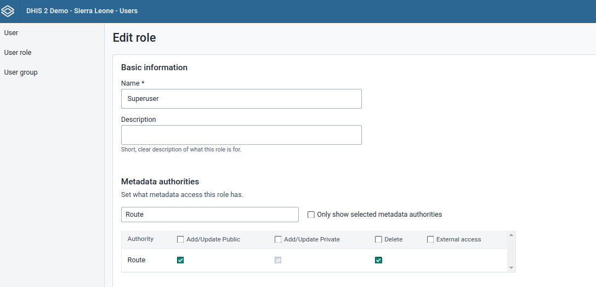
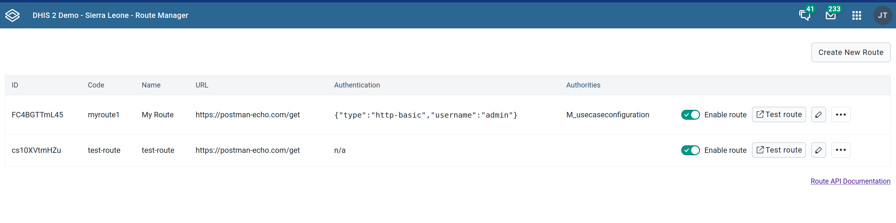

# Route

## Route { #webapi_route }

The route API permits DHIS2 web apps to communicate with external HTTP gateways and proxies. It is designed to be a lightweight solution for extending apps that need to exchange data with third-party services (e.g., civil registry). The route endpoint is available on the URL path `/api/routes`. Routes can be run by issuing an HTTP `GET` or `POST` to `/api/routes/{id}/run`. DHIS2 includes the `X-Forwarded-User` header in every request sent to the route's target. This header contains the DHIS2 username which initiated the request, allowing the target to react accordingly.

For the examples here we will be using the [Echo API](https://learning.postman.com/docs/developer/echo-api/) from Postman which just returns what you send to it (including body in the case of `POST`).

### Required permissions

In order to be able to configure and view the routes, the current user must either have `ALL` authority, or the `Route` authority should be added to the user's role. The authority can be added by heading to the User Management app -> User roles tab, then search for the word "Route" under Metadata authorities. Then you can assign the authorities to the user's role, and save the updates to the role.



In addition to authorities, route URLs can only be added or run when the URL has a corresponding entry `route.remote_servers_allowed` setting found in the `dhis.conf` as shown below:

```properties
route.remote_servers_allowed = https://server1.com/,https://server2.com/
```

`route.remote_servers_allowed` is a comma-separated URL pattern list which is set to `https://*` by default. The DHIS2 administrator should change the default value to a more restricted URL to prevent server-side request forgery (SSRF) attacks. While not recommended for security reasons, one can add wildcard entries to `route.remote_servers_allowed` which avoids having to enumerate each allowed remote server, for example:

```properties
route.remote_servers_allowed = https://*.server1.com/
```

Note that paths within the URLs are not accepted.

### Running a route

The following is an example of a JSON request creating a route:

```json
{
  "name": "Postman Echo",
  "code": "postman",
  "disabled": false,
  "url": "https://postman-echo.com/get"
}
```

The route can be run from DHIS2 after the above request is sent to the `/api/routes` API endpoint. You can run the route either with its returned ID or the code assigned to it as demonstrated below:

```
GET /api/routes/{id}/run
GET /api/routes/postman/run
```

If you want DHIS2 to _POST_ the request to the route target, use the _POST_ HTTP method when calling the `run` endpoint instead of the `GET` HTTP method:

```
POST /api/routes/postman/run
```

### Running a route with authentication

A number of authentication modes are supported when running routes. These authentication modes add headers or query parameters to the request being routed from DHIS2. DHIS2 encrypts at rest sensitive headers or query parameters when creating a route with an authentication mode. This means that the clear text secrets cannot be read from the database or the Web API. What follows are the supported authentication modes:

* `http-basic`: adds an _Authorization_ header to the route request for HTTP basic access authentication. Here is an example creating a route configured with `http-basic` authentication:

  ```json
  {
    "name": "Postman Echo",
    "code": "postman-get",
    "disabled": false,
    "url": "https://postman-echo.com/get",
    "auth": {
      "type": "http-basic",
      "username": "admin",
      "password": "admin"
    }
  }
  ```

* `api-token`: adds an _Authorization_ header for [Personal Access Token (PAT) authentication](https://docs.dhis2.org/en/use/user-guides/dhis-core-version-master/working-with-your-account/personal-access-tokens.html). It is worth noting that PAT authentication is specific to DHIS2 so you might want to consider the more general `api-headers` authentication mode (described next) should the route's target URL be a non-DHIS2 instance. Here is an example creating a route configured with `api-token` authentication:

  ```json
  {
    "name": "Postman Echo",
    "code": "postman-get",
    "disabled": false,
    "url": "https://postman-echo.com/get",
    "headers": {
      "a": "1",
      "b": "2",
      "c": "3"
    },
    "auth": {
      "type": "api-token",
      "token": "74478F79-7B85-424A-9C93-8A6F924AA9F9"
    }
  }
  ``` 
  Note that this request configures the route with static headers so that these headers are included in the request sent from DHIS2. Keep in mind that DHIS2 does not store these static headers as encrypted. 

* `api-headers`: adds user-defined headers for API authentication. Here is an example creating a route configured with `api-headers` authentication:

  ```json
  {
    "name": "Postman Echo",
    "code": "postman-get",
    "disabled": false,
    "url": "https://postman-echo.com/get",
    "auth": {
      "type": "api-headers",
      "headers": {
        "X-API-KEY": "aXJgm4Kwv1xk9UfFRYIIR8b6mEV1cQz3lcxMQlaQz9lwI35j4ZIUK5T2O2aQDfIY"
      }
    }
  }
  ```

* `api-query-params`: adds user-defined query parameters for API authentication. Here is an example to creating a route configured with `api-query-params` authentication:

  ```json
  {
    "name": "Postman Echo",
    "code": "postman-get",
    "disabled": false,
    "url": "https://postman-echo.com/get",
    "auth": {
      "type": "api-query-params",
      "queryParams": {
        "token": "aXJgm4Kwv1xk9UfFRYIIR8b6mEV1cQz3lcxMQlaQz9lwI35j4ZIUK5T2O2aQDfIY"
      }
    }
  }
  ```

* `oauth2-client-credentials`: performs [OAuth2 Client Credentials](https://datatracker.ietf.org/doc/html/rfc6749#section-4.4) flow and adds the resulting access token to the upstream request. Here is an example to creating a route configured with `oauth2-client-credentials` authentication:

  ```json
  {
    "name": "Postman Echo",
    "code": "postman-get",
    "disabled": false,
    "url": "https://postman-echo.com/get",
    "auth": {
      "type": "oauth2-client-credentials",
      "clientId": "alice",
      "clientSecret": "passw0rd",
      "tokenUri": "https://token-service/token"
    }
  }
  ```


### Running a route with authentication and custom authority

In the example shown below, we are configuring a route with `http-basic` authentication and assigning a custom authority it:

```json
{
  "name": "Postman Echo",
  "code": "postman-post",
  "disabled": false,
  "url": "https://postman-echo.com/post",
  "auth": {
    "type": "http-basic",
    "username": "admin",
    "password": "admin"
  },
  "authorities": ["MY_CUSTOM_APP"]
}
```

Custom authorities allows a DHIS2 client that does not have the rights to manage the route to still be able to run it. This enables the route to be run from your app.

### Running a route with custom response timeout

For performance reasons, the maximum transfer time for a route response is 5 minutes. When a transfer of the upstream server response body exceeds this limit, the DHIS2 server returns a bad gateway error to the client. On the other hand, the pre-configured timeout for the upstream server response when running a route is 5 seconds. This means that a network-level read taking longer than 5 seconds will result in the DHIS2 server returning a gateway timeout error to the client. However, this timeout can be adjusted when creating or updating a route as demonstrated below:

```json
{
  "name": "Postman Echo",
  "code": "postman-post",
  "disabled": false,
  "url": "https://postman-echo.com/post",
  "responseTimeoutSeconds": 10
}
```

The minimum permitted response timeout is 1 second while the maximum permitted timeout is 60 seconds. The `responseTimeoutSeconds` setting should be used with caution since concurrent, long-running routes could degrade DHIS2's overall performance. 

>IMPORTANT: The default route response timeout is 10 seconds for DHIS2 versions earlier than 42, except for:
>* 40.8 ≤ v < 40.10
>* 41.4 ≤ v < 41.6

These specific versions have a 30-second response timeout.

### Wildcard Routes

It is possible to create "wildcard routes" which support sub-path requests which are then passed through to the upstream service. To do this, the route URL must end with `/**`. Sub-paths can then be specified by appending them after `/run`.

```json
{
  "name": "Postman Wildcard",
  "code": "postman-wildcard",
  "disabled": false,
  "url": "https://postman-echo.com/**"
}
```

After you have sent this to `/api/routes` you now have your route available for you, and can run it with its returned ID or you can also use code. Note that the sub-paths `/get` and `/post` are passed in the URL of the request below, which will trigger requests to `https://postman-echo.com/get` and `https://postman-echo.com/post` respectively.

```
GET /api/routes/{id}/run/get
GET /api/routes/postman-wildcard/run/get
POST /api/routes/{id}/run/post
POST /api/routes/postman-wildcard/run/post
```

## Security Considerations

DHIS2 views the response originating from the upstream server as trusted. The implication is that a route does not validate the data produced from the upstream server. For example, the route client could still receive invalid JSON such as JavaScript code despite the route request holding the `application/json` content type in its `Accept` header. When the upstream response is untrusted, then it is the responsibility of the route client (e.g., DHIS2 app) to validate, and possibly sanitise, the data within the route response.

## Route Manager { #route_manager_app }

The [Route Manager app](https://apps.dhis2.org/app/5dbe9ab8-46bd-411e-b22f-905f08a81d78) is a DHIS2 app available from App Hub that provides a user interface for managing and testing routes:



Visit the [DHIS2 system maintenance guide](https://docs.dhis2.org/en/use/user-guides/dhis-core-version-master/maintaining-the-system/route-manager.html) to learn more about Route Manager.


