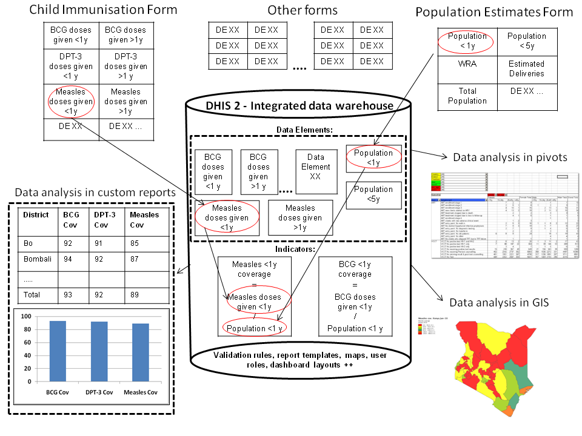
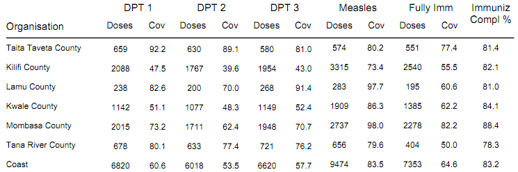

# Conceptual Design Principles

This chapter provides a introduction to some of the key conceptual
design principles behind the DHIS2 software. Understanding and being
aware of these principles will help the implementer to make better use
of the software when customising a local database. While this chapter
introduces the principles, the following chapters will detail out how
these are reflected in the database design process.

The following conceptual design principles will be presented in this
chapter:

  - All meta data can be added and modified through the user interface

  - A flexible data model supports different data sources to be
    integrated in one single data repository

  - Data Input \!= Data Output

  - Indicator-driven data analysis and reporting

  - Maintain disaggregated facility-data in the database

  - Support data analysis at any level in the health system

In the following section each principle is described in more detail.

## All meta data can be added and modified through the user interface

The DHIS2 application comes with a set of generic tools for data
collection, validation, reporting and analysis, but the contents of the
database, e.g. what data to collect, where the data comes from, and on
what format, will depend on the context of use. These meta data need to
be populated into the application before it can be used, and this can be
done through the user interface and requires no programming. This allows
for more direct involvement of the domain experts that understand the
details of the HIS that the software will support.

The software separates the key meta data that describes the raw data
being stored in the database, which is the critical meta data that
should not change much over time (to avoid corrupting the data), and the
higher level meta like indicator formulas, validation rules, and groups
for aggregation as well as the various layouts for collection forms and
reports, which are not that critical and can be changed over time
without interfering with the raw data. As this higher level meta data
can be added and modified over time without interfering with the raw
data, a continuous customisation process is supported. Typically new
features are added over time as the local implementation team learn to
master more functionality, and the users are gradually pushing for more
advanced data analysis and reporting
outputs.

## A flexible data model supports different data sources to be integrated in one single data repository

The DHIS2 design follows an integrated approach to HIS, and supports
integration of many different data sources into one single database,
sometime referred to as an integrated data repository or a data
warehouse.

The fact that DHIS2 is a skeleton like tool without predefined forms or
reports means that it can support a lot of different aggregate data
sources. There is nothing really that limits the use to the health
domain either, although use in other sectors are still very limited. As
long as the data is collected by an orgunit (organisational unit),
described as a data element (possibly with some disaggregation
categories), and can be represented by a predefined period frequency, it
can be collected and processed in DHIS2. This flexibility makes DHIS2 a
powerful tool to set up integrated systems that bring together
collection tools, indicators, and reports from multiple health programs,
departments or initiatives. Once the data is defined and then collected
or imported into a DHIS2 database, it can be analysed in correlation to
any other data in the same database, no matter how and by whom it was
collected. In addition to supporting integrated data analysis and
reporting, this integrated approach also helps to rationalise data
collection and reduce duplication.

## Data input \!= Data output

In DHIS2 there are three dimensions that describe the aggregated data
being collected and stored in the database; the where - organisation
unit, the what - data element, and the when - period. The organisation
unit, data element and period make up the three core dimensions that are
needed to describe any data value in the DHIS2, whether it is in a data
collection form, a chart, on a map, or in an aggregated summary report.
When data is collected in an electronic data entry form, sometimes
through a mirror image of the paper forms used at facility level, each
entry field in the form can be described using these three dimensions.
The form itself is just a tool to organise the data collection and is
not describing the individual data values being collected and stored in
the database. Being able to describe each data value independently
through a Data Element definition (e.g. ‘Measles doses given \<1 year’)
provides important flexibility when processing, validating, and
analysing the data, and allows for comparison of data across collection
forms and health programs.

This design or data model approach separates DHIS2 from many of the
traditional HIS software applications which treat the data collection
forms as the key unit of analysis. This is typical for systems tailored
to vertical programs’ needs and the traditional conceptualisation of the
collection form as also being the report or the analysis output. The
figure below illustrates how the more fine-grained DHIS2 design built
around the concept of Data Elements is different and how the input (data
collection) is separated from the output (data analysis), supporting
more flexible and varied data analysis and dissemination. The data
element ‘Measles doses given \<1 y’ is collected as part of a Child
Immunisation collection form, but can be used individually to build up
an Indicator (a formula) called ‘Measles coverage \<1y’ where it is
combined with the data element called ‘Population \<1y’, being collected
through another collection form. This calculated Indicator value can
then be used in data analysis in various reporting tools in DHIS2, e.g.
custom designed reports with charts, pivot tables, or on a map in the
GIS module.

## Indicator-driven data analysis and reporting

What is referred to as a Data Element above, the key dimension that
describes what is being collected, is sometimes referred to as an
indicator in other settings. In DHIS2 we distinguish between Data
Elements which describe the raw data, e.g. the counts being collected,
and Indicators, which are formula-based and describe calculated values,
e.g. coverage or incidence rates that are used for data analysis.
Indicator values are not collected like the data (element) values, but
instead calculated by the application based on formulas defined by the
users. These formulas are made up of a factor (e.g. 1, 100, 100, 100
000), a numerator and a denominator, the two latter are both expressions
based on one or more data elements. E.g. the indicator "Measles coverage
\<1 year" is defined a formula with a factor 100, a numerator ("Measles
doses given to children under 1 year") and a denominator ("Target
population under 1 year"). The indicator "DPT1 to DPT3 drop out rate" is
a formula of 100 % x ("DPT1 doses given"- "DPT3doses given") / ("DPT1
doses given"). These formulas can be added and edited through the user
interface by a user with limited training, as they are quite easy to set
up and do not interfere with the data values stored in the database (so
adding or modifying an indicator is not a critical operation).

Indicators represent perhaps the most powerful data analysis feature of
the DHIS2, and all reporting tools support the use of indicators, e.g.
as displayed in the custom report in the figure above. Being able to use
population data in the denominator enables comparisons of health
performance across geographical areas with different target populations,
which is more useful than only looking at the raw numbers. The table
below uses both the raw data values (Doses) and indicator values (Cov)
for the different vaccines. Comparing e.g. the two first orgunits in the
list, Taita Taveta County and Kilifi County, on DPT-1 immunisation, we
can see that while the raw numbers (659 vs 2088) indicate many more
doses are given in Kilifi, the coverage rates (92.2 % vs 47.5 %) show
that Taita Taveta are doing a better job immunising their target
population under 1 year. Looking at the final column (Immuniz. Compl. %)
which indicates the completeness of reporting of the immunisation form
for the same period, we can see that the numbers are more or less the
same in the two counties we compared, which tells us that the coverage
rates can be reasonably compared across the two counties.

## Maintain disaggregated facility-data in the database

When data is collected and stored in DHIS2 it will remain disaggregated
in the database with the same level of detail as it was collected. This
is a major advantage of having a database system for HIS as supposed to
a paper-based or even spreadsheet based system. The system is designed
to store large amounts of data and always allow drill-downs to the
finest level of detail possible, which is only limited by how the data
was collected or imported into the DHIS2 database. In a perspective of a
national HIS it is desired to keep the data disaggregated by health
facility level, which is often the lowest level in the orgunit
hierarchy. This can be done even without computerising this level,
through a hybrid system of paper and computer. The data can be submitted
from health facilities to e.g. district offices by paper (e.g. on
monthly summary forms for one specific facility), and then at the
district office they enter all the facility data into the DHIS2 through
the electronic data collection forms, one facility at a time. This will
enable the districts health management teams to perform facility-wise
data analysis and to e.g. provide print-outs of feedback reports
generated by the DHIS2, incl. facility comparisons, to the facility
in-charges in their district.

## Support data analysis at any level in the health system

While the name DHIS2 indicates a focus on the District, the application
provides the same tools and functionality to all levels in the health
system. In all the reporting tools the users can select which orgunit or
orgunit level to analyse and the data displayed will be automatically
aggregated up to the selected level. The DHIS2 uses the orgunit
hierarchy in aggregating data upwards and provides data by any orgunit
in this hierarchy. Most of the reports are run in such a way that the
users will be prompted to select an orgunit and thereby enable reuse of
the same report layouts for all levels. Or if desired, the report
layouts can be tailored to any specific level in the health system if
the needs differ between the levels.

In the GIS module the users can analyse data on e.g. the sub-national
level and then by clicking on the map (on e.g. a region or province)
drill down to the next level, and continue like this all the way down to
the source of the data at facility level. Similar drill-down
functionality is provided in the Excel Pivot Tables that are linked to
the DHIS2 database.

To speed up performance and reduce the response-time when providing
aggregated data outputs, which may include many calculations (e.g.
adding together 8000 facilities), DHIS2 pre-calculates all the possible
aggregate values and stores these in what is called a data mart. This
data mart can be scheduled to run (re-built) at a given time interval,
e.g. every night.

