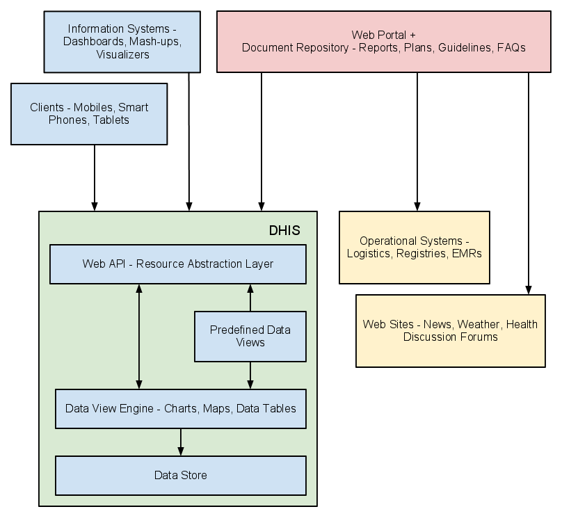

# DHIS2 as a platform

DHIS2 can be perceived as a platform on several levels. First, the
application database is designed ground-up with flexibility in mind.
Data structures such as data elements, organisation units, forms and
user roles can be defined completely freely through the application user
interface. This makes it possible for the system to be adapted to a
multitude of local contexts and use-cases. We have seen that DHIS2
supports most major requirements for routine data capture and analysis
emerging in country implementations. It also makes it possible for DHIS2
to serve as a management system for domains such as logistics, labs and
finance.

Second, due to the modular design of DHIS2 it can be extended with
additional software modules. These software modules can live side by
side with the core modules of DHIS2 and can be integrated into the DHIS2
portal and menu system. This is a powerful feature as it makes it
possible to extend the system with extra functionality when needed,
typically for country specific requirements as earlier pointed out.

The downside of the software module extensibility is that it puts
several constraints on the development process. The developers creating
the extra functionality are limited to the DHIS2 technology in terms of
programming language and software frameworks, in addition to the
constraints put on the design of modules by the DHIS2 portal solution.
Also, these modules must be included in the DHIS2 software when the
software is built and deployed on the web server, not dynamically during
run-time.

In order to overcome these limitations and achieve a looser coupling
between the DHIS2 service layer and additional software artifacts, the
DHIS2 development team decided to create a Web API. This Web API
complies with the rules of the REST architectural style. This implies
that:

  - The Web API provides a navigable and machine-readable interface to
    the complete DHIS2 data model. For instance, one can access the full
    list of data elements, then navigate using the provided hyperlink to
    a particular data element of interest, then navigate using the
    provided hyperlink to the list of forms which this data element is
    part of. E.g. clients will only do state transitions using the
    hyperlinks which are dynamically embedded in the responses.

  - Data is accessed through a uniform interface (URLs) using a
    well-known protocol. There are no fancy transport formats or
    protocols involved - just the well-tested, well-understood HTTP
    protocol which is the main building block of the Web today. This
    implies that third-party developers can develop software using the
    DHIS2 data model and data without knowing the DHIS2 specific
    technology or complying with the DHIS2 design constraints.

  - All data including meta-data, reports, maps and charts, known as
    resources in REST terminology, can be retrieved in most of the
    popular representation formats of the Web of today, such as HTML,
    XML, JSON, PDF and PNG. These formats are widely supported in
    applications and programming languages and give third-party
    developers a wide range of implementation options.

There are several scenarios where additional software artifacts may
connect to the DHIS2 Web API.

## Web portals

First, Web portals may be built on top of the Web API. A Web portal in
this regard is a web site which functions as a point of access to
information from a potential large number of data sources which
typically share a common theme. The role of the Web portal is to make
such data sources easily accessible in a structured fashion under a
common look-and-feel and provide a comprehensive data view for end
users.

Aggregate data repository: A Web portal targeted at the health domain
may use the DHIS2 as the main source for aggregate data. The portal can
connect to the Web API and communicate with relevant resources such as
maps, charts, reports, tables and static documents. These data views can
dynamically visualize aggregate data based on queries on the
organisation unit, indicator or period dimension. The portal can add
value to the information accessibility in several ways. It can be
structured in a user-friendly way and make data accessible to
inexperienced users. It can provide various approaches to the data,
including:

  - Thematic - grouping indicators by topic. Examples of such topics are
    immunization, mother care, notifiable diseases and environmental
    health.

  - Geographical - grouping data by provinces. This will enable easy
    comparison of performance and workload.

Mash-up: The Web portal is not limited to consuming data from a single
Web API - it can be connected to any number of APIs and be used to mash
up data from auxiliary systems within the health domain. If available
the portal might pull in specialized data from logistics systems
tracking and managing ARV medicines, from finance systems managing
payments to health facilities and from lab systems tracking lab tests
for communicable diseases. Data from all of these sources might be
presented in a coherent and meaningful way to provide better insight in
the situation of the health domain.

Document repository: The Web portal can act as a document repository in
itself (also referred to as content management system). Relevant
documents such as published reports, survey data, annual operational
plans and FAQs might be uploaded and managed in terms of ownership,
version control and classification. This makes the portal a central
point for document sharing and collaboration. The emergence of
high-quality, open source repository/CMS solutions such as Alfresco and
Drupal makes this approach more feasible and compelling.

Knowledge management: KM refers to practices for identifying,
materializing and distributing insight and experience. In our context it
relates to all aspects of information system implementation and use,
such as:

  - Database design

  - Information system usage and how-to

  - End-user training guidelines

  - Data use, analysis and interpretation

Knowledge and learning within these areas can be materialized in the
form of manuals, papers, books, slide sets, videos, system embedded help
text, online learning sites, forums, FAQs and more. All of these
artifacts might be published and made accessible from the Web portal.

Forum: The portal can provide a forum for hosting discussions between
professional users. The subject can range from help for performing basic
operations in the health information system to discussions over data
analysis and interpretation topics. Such a forum can act as an
interactive source for information and evolve naturally into a valuable
archive.

## Apps

Second, third-party software clients running on devices such as mobile
phones, smart phones and tablets may connect to the DHIS2 Web API and
read and write to relevant resources. For instance, third-party
developers may create a client running on the Android operating system
on mobile devices targeted at community health workers who needs to keep
track of the people to visit, register vital data for each encounter and
receive reminders of due dates for patient care while travelling freely
in the community. Such a client application might interact with the
patient and activity plan resources exposed by the DHIS2 Web API. The
developer will not be dependent on deep insight into the DHIS2 internal
implementation, rather just basic skills within HTTP/Web programming and
a bit of knowledge of the DHIS2 data model. Understanding the DHIS2 data
model is made easier by the navigable nature of the Web API.

## Information Systems

Third, information system developers aiming at creating new ways of
visualizing and presenting aggregate data can utilize the DHIS2 Web API
as the service layer of their system. The effort needed for developing
new information systems and maintaining them over time is often largely
under-estimated. Instead of starting from scratch, a new application can
be built on top of the Web API. Developer attention can be directed
towards making new, innovative and creative data representations and
visualizations, in the form of e.g. dashboards, GIS and charting
components.

