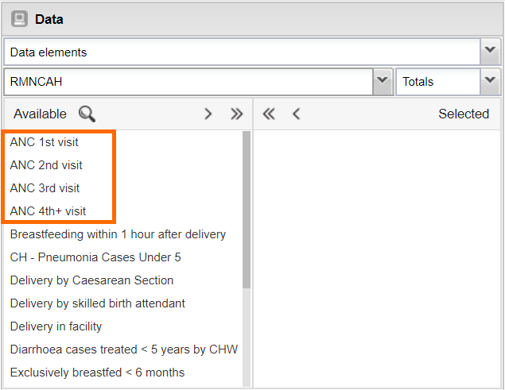
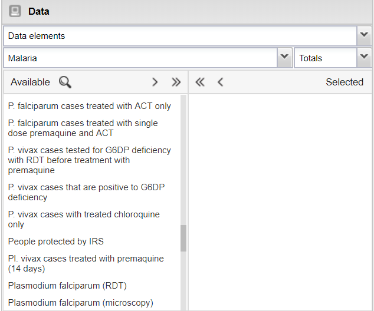
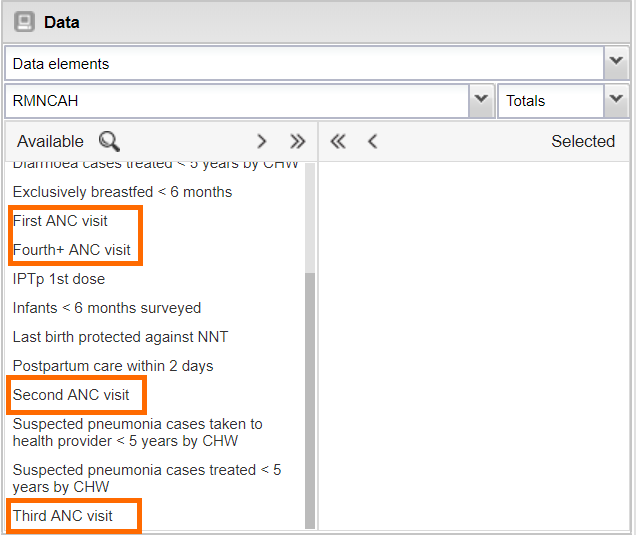
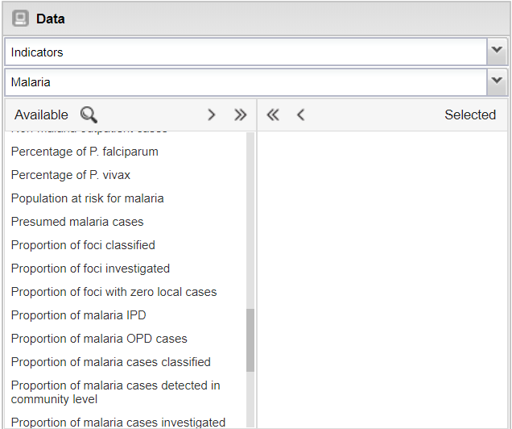
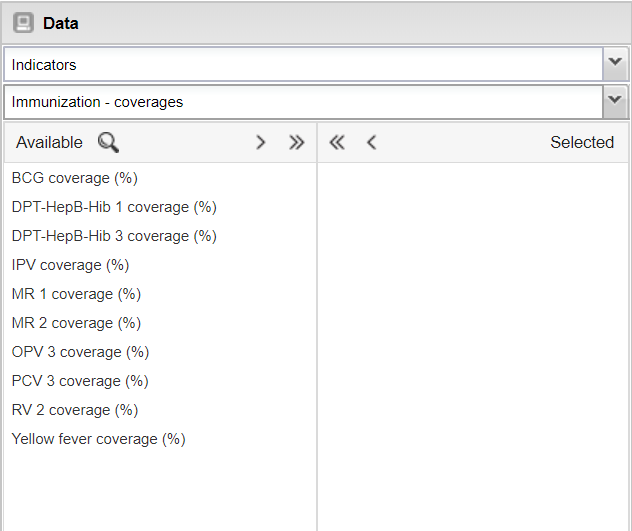

# Naming conventions

This document describes overall naming conventions and recommendations when creating DHIS2 metadata as part of an integrated HIS (tracker or aggregate). To the extent possible, these conventions are applied across UiO-developed configuration packages. 

## General guidance for naming DHIS2 objects

The general principle is to design data elements and indicators that can be effectively used for analysis. In general, the amount of end-users interacting with these items will be much higher than system administrators. As a result, making items easier to recognize and find is the general backbone of the design principles suggested.
* Shorten and simplify names/short names where possible, for example, there is in general no need to include “Number of…” and similar phrases, in particular for aggregate data elements where practically everything is numbers.
* Provide a meaningful & concise name: put the key information early in the name, as long as this can be done without making it hard to understand the meaning of the name
* Consider which users will see names/short names of various objects, and which apps they interact with. Remember: users can configure their user accounts to view long or short names in apps.
	* Names (long names) should include prefix & suffix as applicable, to facilitate ordering of metadata and filtering for analytics and admin users
	* Short names are limited to 52 characters; make these as meaningful as possible with consideration for the end user who accesses these objects through the analytics apps
	* Form names: form names for data elements should be optimized for the data entry user. These names appear in the data capture apps and should provide a sufficient level of meaning and clarify for the person entering the data guidance. The length of these names should also be considered. For Android implementations, implementers should consider how these names render on a mobile device 
	* Most analytics users primarily interact with *dashboard items, data elements, indicators, CategoryCombinations configured as a data dimension, legend sets.* 

### Programme specific vs generic/shared metadata ###
DHIS2 is broadly used as an integrated HMIS, combining data and metadata from multiple health areas and programs into a single system. It is therefore important to be explicit of what disease/programme certain metadata refer to. For example, a name like “Case incidence rate per 100 000 population” could refer to malaria, TB, cholera etc. However, it is also important to ensure that some metadata can be shared across diseases/health areas. 

To facilitate harmonization of metadata, we recommend the following prefixes to be applied to long names of metadata objects such as data elements and indicators (but not to ‘short names’ or ‘form names’’) depending on whether the metadata is specific to a certain program or shared across programs. 
* Metadata that is specific to a health program/disease should be prefixed with a consistent prefix code to represent the health programme/disease or other logical grouping of the metadata:
	* e.g. TB, MAL, HIV, EPI, RMNCAH, CRVS, etc
* Metadata that is shared across health areas/programs should have a more generic pre-fix to signify metadata that is generally considered to be re-usable or shared metadata 
	* e.g. UiO HIS metadata packages use the prefix ‘GEN’ 

### **Examples of naming** ###

Example of **good naming practice** for a data element: Ensure the most important part of the name is what is determining the order of the data elements in an ordered list:

- ANC 1st visit
- ANC 2nd visit
- ANC 3rd visit
- ANC 4th+ visit

This will allow the items to appear together within a thematic area; they are also in order from first to last as is intended.

- If it is decided to use a known nomenclature for short forms common in a program (typically for data elements or indicators), select a uniform method across all data metadata (i.e. P., Pl. or Plasmodium).

Example of **poor naming practice** for a data element: *Number of pregnant women who make first ANC visit.*

- *Number of* is generally not necessary. It is understood that it is a number being reported in a monthly report, and this increases the name length.
- Pregnant women is redundant. Only pregnant women make ANC visits.
- First ANC visit is the key information and should not be at the end of the name.
- Ideally, the first part of the name should allow you to group similar data elements in an ordered list.

If we review ANC visits 1 - 4, we could use:

- First ANC visit
- Second ANC visit
- Third ANC visit
- Fourth ANC visit

As plain language this makes sense, however when combined in an ordered list (such as what would appear in DHIS2 analysis applications) with other data elements they will not be either in order or grouped together.

### Numbers as part of names ###
- Less than (or equal): use 0–4, not 0 - 4, &lt; 5, &lt;= 4, ≤ 5 
- More than (or equal): use 15+, not &gt;14, &gt;= 15, ≥ 15 
- Intervals: use 5–14, not 5 - 14

### Data Elements
- Data element *names* should be prefixed with the acronym/code of the health program/area, e.g. TB, MAL, HIV, EPI etc.
- Data Elements typically represent a raw count of values therefore it is assumed that, if a data element has no postfix indicating what value type it is, than it is a raw number (i.e. ANC first visit - no postfix is present therefore we can assume that you are reporting the number of ANC visits).
- If you are collecting some type of rate, proportion, etc directly as a non-calculated data value (i.e. as a raw value through a data collection process) than this should be indicated by adding a short postfix in brackets at the end of the data element name.
- We can eliminate plain text when possible from a data element if it is not overtly meaningful when reviewed as an output to shorten the name (i.e. "Number of malaria cases positive with RDT" can be changed to "Malaria cases positive (RDT)") to make a more readable output in analysis.

### Indicators
- Data element *names* should be prefixed with the acronym/code of the health area/program, e.g. TB, MAL, HIV, EPI, etc.
- Indicators are calculations that use a combination of data elements to create an output for analysis.
- Naming is often differentiated from data elements by the name of the indicator itself (i.e. ANC 1st visit vs. ANC 1st visit coverage (%))
- These may be slightly longer than data element names due to the addition of a postfix indicating the type of indicator it is.
- Indicators should not start with % at the beginning of their name. In a list, they will be disorganized.
- (assets/indicator_perc_prefix.png)

- Long names such as proportion or percentage can be used in descriptions, but should not be included in the indicator name. We can see this adds additional text at the start of the name. It also groups items together by “proportion of/percentage of” rather than the identifying characteristic (i.e. foci, malaria cases, malaria species type).

- If we add % as a postfix items are organized in a more meaningful manner, the name is shortened and unnecessary spaces at the beginning of the name are removed

### Favorites
* Favorite names: Prefix favorite names with health area/program name and
colon, e.g. TB: Case notifications…, MAL: Incidence rate… 
* Favourite titles: Titles do not need prefixes, as they are not used for searching.

### Option sets
Generic/reusable option sets should have generic names as far as possible. For example, if an option set is needed for HIV test results with the options “Positive” and “Negative” it should be named “Positive/Negative” rather than “HIV test result” so that if can be reused. In cases where there is a chance that several objects could be confused or are similar but not the same, it should be made explicit, for example “TB treatment outcome”, “Malaria treatment result”.

## Codes
* All codes should be prefixed with the acronym/code of the disease programme/area and an underscore, e.g. TB\_, MAL\_, HIV\_, EPI\_ etc.
* Codes should be capitalized. 
* Where codes exists for a particular programme/disease area, those codes should be used. However, they should always prefixed with acronym/code for that area and capitalized).
* If new codes are created, they should follow these guidelines: 
	* Only alphanumeric characters and underscores should be used.
	* As far as possible, codes should be meaningful (e.g. "HIV_TEST_POS" rather than "HIV_T01_").
