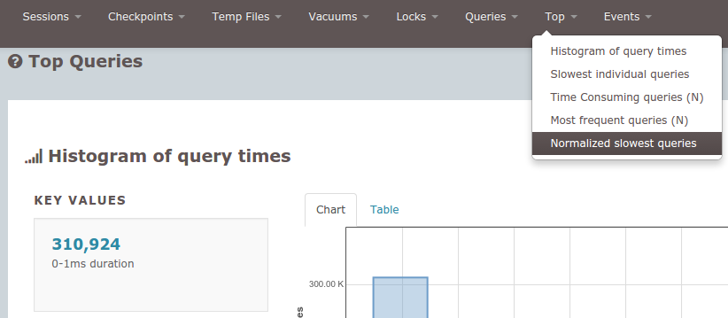

# Analysing PostgreSQL logs using pgbadger

**As a DHIS 2 system administrator, knowing what goes on with your PostgreSQL database is of great importance. Looking at the PostgreSQL logs will give you a clue, however simply browsing the logs with a text editor is difficult since the logs become very large with lots of repetitive content. This tutorials explains how the pgbadger PostgreSQL log analysis tool can help you get useful information from your logs.**

The pgbadger PostgreSQL log analysis tool is simple to install (it only has perl as a requirement) and easy to understand. It lets you analyse log files from the command line with simple commands.

First make sure you have perl installed (on Debian/Ubuntu Linux):

```
sudo apt-get install perl
```

Then download the pgbadger from the GitHub release page, extract it and install (adjust for the version in the filename):

```
tar xvf pgbadger-6.4.tar.gz
cd pgbadger-6.4
perl Makefile.PL
make && sudo make install
```

You will have to adjust your PostgreSQL configuration file to give pgbadger the information it needs. First you need to set the "log_line_prefix" setting:

```
log_line_prefix = '%t [%p]: [%l-1] '
```

Second you should enable the "log_min_duration_statement". This setting causes PostgreSQL to log all statements which run for longer than the given value in milliseconds, where a value of 0 will log everything. Make sure that the "log_statement" is set to "none", otherwise the "log_min_duration_statement" setting will not log anything ("none" is the default value anyway).

```
log_statement = 'none'
log_min_duration_statement = 0
```

Third you should enable logging of checkpoints, locks and more to get maximum value out of the log analysis:

```
log_checkpoints = on
log_connections = on
log_disconnections = on
log_lock_waits = on
log_temp_files = 0
log_autovacuum_min_duration = 0
```

You can also get the config snippet here. Note that you do not need to restart PostgreSQL to make the changes take effect, simply log into the psql command line and invoke the following (the same way you run SQL statements):

```
select pg_reload_conf();
```

Of course, logging all statements has a performance impact on your system, so you could enable it for enough time to give you between 50 and 200 Mb worth of logs, then disable it again.

Now with DHIS 2 we already know the analytics table generation and indexing process has some very long-running queries. We do not want those to take all attention from pgbadger so we create a new log file where we omit these statements with the following command in a terminal:

```
cat pg.log | grep -viE "create index|insert into analytics|vacuum analyze analytics" > pg_clean.log
```

We are now ready to do the analysis. Invoke:

```
pgbadger -j 4 pg_clean.log
```

Here the "-j" option refers to the number of CPUs you would like to use for the process - by default it uses 1 but allowing more CPUs speeds up the process a lot. Finally, "pg_clean.log" refers to your log file.

Note that if you are on Amazon RDS (managed database hosting), it does not let you change the "log_line_prefix" setting. Instead, you can run pgbadger with the "-p" option which lets you specify a custom prefix for the analysis:

```
pgbadger -j 4 -p '%t:%r:%u@%d:[%p]:' pg_clean.log
```

The pgbdager tool will now create a nice presentation of the analysis in a HTML file called "out.html". Just open the file in a Web browser of your choice.

The most interesting part might be the "Top" menu item. It provides very useful statistics including individual slowest queries and normalized most time-consuming queries, most frequent queries and slowest queries. Here, "normalized" means that the SQL query parameters are ignored. This is useful to understand which queries are the slowest. Without the normalization, your single slowest query would dominate the statistics entirely if it is run with many different query parameters.

From doing analysis on a specific DHIS 2 instance I learned that the validation functionality causes quite long-running queries which could be optimized. You are encouraged to analyze your own DHIS 2 instance to see which queries take long. Based on this you could optimize the database with indexes or provide feedback to the DHIS 2 development team on potential bottlenecks and expensive queries.



Happy monitoring!
