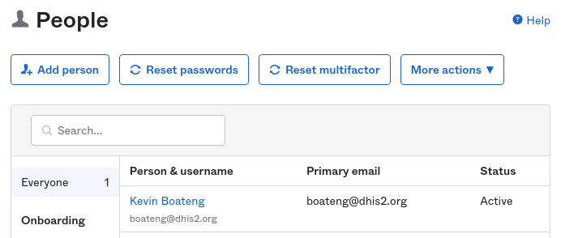
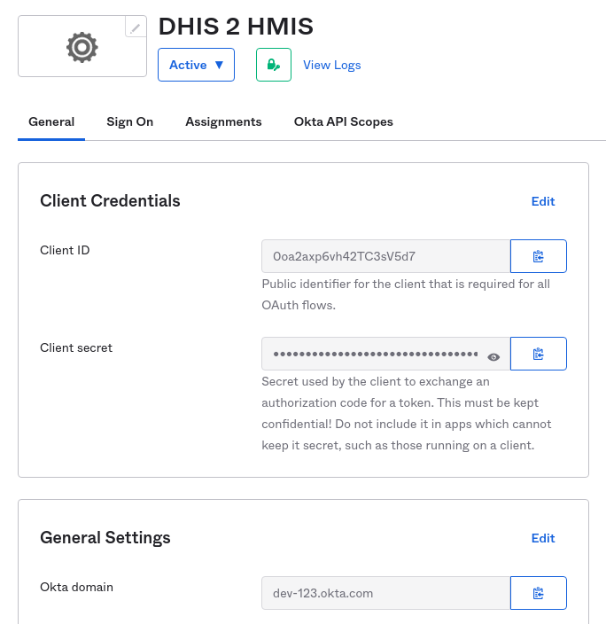
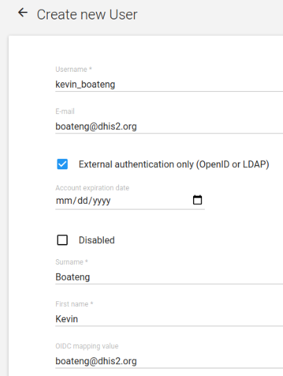
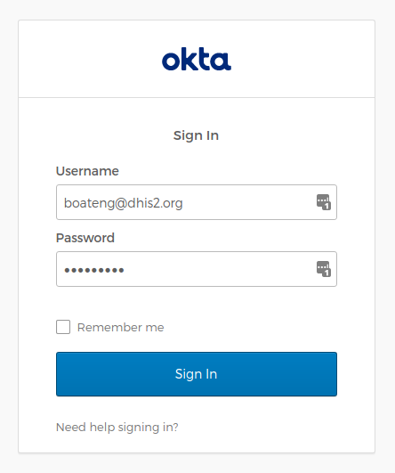

# Configure OpenID Connect with Okta

**OpenId Connect (OIDC) is an identity and authorization layer built on top of the OAuth2 authorization framework. This guide explains how to set up OIDC with Okta as identity platform for DHIS 2.**

OIDC is useful for _Single Sign-On_ across multiple applications and systems, where a user can sign in once and then access many DHIS 2 instances and other type of systems. For sysadmins, OIDC allows for maintaining usernames, passwords and user deactivation in a single place. 

OIDC is supported by DHIS 2 and can be configured in the `dhis.conf` configuration file. Dedicated configuration syntax is available for specific identity providers including Google, Azure and WSO2. In this guide, the _generic_ provider will be used to configure Okta.

[Okta](https://www.okta.com/) is a popular identity and access management platform which supports the OIDC protocol. This tutorial will explain how to set up OIDC with Okta for DHIS 2. Refer to the DHIS 2 OIDC [installation guide](https://docs.dhis2.org/en/manage/performing-system-administration/dhis-core-version-236/installation.html#install_oidc_configuration) for details.

This guide assumes a **DHIS 2 instance** running at `http://localhost:8080`. The guide refers to a **provider key** which in this case is **okta**.

### Sign up for an Okta developer account

* To test OIDC with Okta, sign up for their free developer trial access: https://developer.okta.com/signup/
* Enter your work email, first name, last name and country. Note that the email you enter will become the Okta username.
* After signing in, navigate to **Directory** > **People** and observe that a person (user) exists for the name and email you used when signing up. The email will later be used to map to a DHIS 2 user. You can create additional users later.



### Create Okta application integration

In this step we will create an Okta web app integration.


* Navigate to **Applications** > **Applications**.
* Click **Create app integration**.
* For **Sign-in Method**, select *OIDC - OpenID Connect*.
* For **Application type**, select *Web application*, and click **Next**.
* For **App integration name**, enter a descriptive name like the name of your DHIS 2 instance, such as _DHIS 2 HMIS_.
* For **Grant type** > **Client acting on behalf of itself**, enable *Client Credentials*.
* For **Client acting on behalf of a user**, do nothing and make sure *Authorization Code* is enabled and other options are disabled.
* For **Sign-in redirect URIs**, enter `http://localhost:8080/oauth2/code/okta`. The pattern is `{dhis2-base-URL}/oauth2/code/{provider-key}`. The DHIS 2 base URL is `http://localhost:8080` and the provider key is `okta`.
* Leave **Trusted Origins** blank.
* For **Assignments**, select *Allow everyone in your organization to access*.
* Click **Save**.
* In the **Assignments** tab in the application overview, ensure that the relevant people are assigned.

### Take note of Okta settings

In this step we will take note of the relevant Okta settings and credentials.



* Navigate to **General** tab in the application overview screen.
* Take note of the following settings by clicking the _Copy to clipboard_ buttons. These settings will be used in the DHIS 2 configuration file later. The settings should be considered secrets and stored in a secure way.
    * Client ID  
    * Client secret  
    * Okta domain
* Log out of the Okta portal, to allow logging back in later.

### Create DHIS 2 user

To be able to log in to DHIS 2, a DHIS 2 user must be created for each Okta person. The DHIS 2 user is mapped to the Okta person through the DHIS 2 user **OIDC mapping value** field. User roles, user groups and organisation units can be granted to the DHIS 2 user as usual.



* Log in to DHIS 2 using a regular, local user with authority to create users.
* Navigate to **Apps** > **Users** > **Users**.
* Create a new DHIS 2 user, or update an existing user.
* The username can be any username. For new DHIS 2 users, it is recommended (but not required) to use the Okta username.
* Enable **External authentication only (OpenID or LDAP)**.
* Enter the **Surname** and **First name** of the user.
* For **OIDC mapping value**, enter the Okta username (email). This value is used to map the DHIS 2 user to the Okta user.
* Select appropriate user roles and organisation units.
* Click **Save**.

### Configure DHIS 2

* Look up the Okta settings noted previously. Note that `okta` in the property keys refers to the provider key specified in the Okta application integration.
* For this tutorial, we will assume the following fictional Okta setting values. **Note:** Replace these with the real values for your account.
    * Client domain: `dev-123.okta.com`
    * Client ID: `0kh6yTgRg45191j97H6y`
    * Client secret: `xJh6ybgh5yajTku7qE35F5h8hj8km7yG-Hj61j49`
* Locate the `dhis.conf` configuration file for DHIS 2, and enter the following properties.

```properties
# Enable OIDC
oidc.oauth2.login.enabled = on

# Okta OIDC settings
oidc.provider.okta.client_id = 0kh6yTgRg45191j97H6y
oidc.provider.okta.client_secret = xJh6ybgh5yajTku7qE35F5h8hj8km7yG-Hj61j49
oidc.provider.okta.mapping_claim = email
oidc.provider.okta.display_alias = Sign in with Okta
oidc.provider.okta.enable_logout = true
oidc.provider.okta.scopes = email
oidc.provider.okta.authorization_uri = https://dev-123.okta.com/oauth2/v1/authorize
oidc.provider.okta.token_uri = https://dev-123.okta.com/oauth2/v1/token
oidc.provider.okta.user_info_uri = https://dev-123.okta.com/oauth2/v1/userinfo
oidc.provider.okta.jwk_uri = https://dev-123.okta.com/oauth2/v1/keys
oidc.provider.okta.end_session_endpoint = https://dev-123.okta.com/oauth2/v1/logout
```

* Restart the DHIS 2 instance for the changes to take effect.
* _Tip:_ These values can be retrieved from Okta with the URL path `/.well-known/openid-configuration`, e.g. `https://dev-123-admin.okta.com/.well-known/openid-configuration`.

### Sign in to DHIS 2 with Okta

In this step we will test the setup and log in to DHIS 2 using Okta.



* Navigate to the DHIS 2 login page. A button labelled *Sign in with Okta* should appear on the login page.
* Click the **Sign in with Okta** button. You should be redirected to the Okta sign in page. Note that if you are still logged in to Okta, you will be automatically logged in to DHIS 2.
* Enter the Okta username and password for the account created previously, and click **Sign In**. You should be redirected to the DHIS 2 instance and be automatically logged in as the DHIS 2 user created previously.

### Summary

At this point you should be automatically logged into DHIS 2 throgh Okta, without having entered any DHIS 2 credentials.

This guide has explained how to set up an Okta application and an Okta user, set up a DHIS 2 user mapped to the Okta user, how to configure DHIS 2 for Okta OIDC and how to log in using Okta. You can repeat the DHIS 2 user and configuration steps for additional DHIS 2 instances in order to include them in the Single Sign-On setup.
