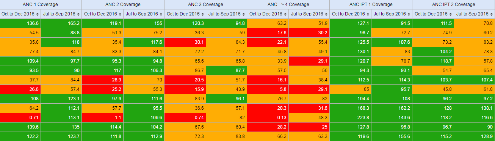
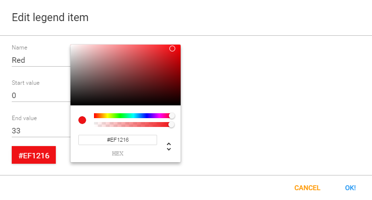
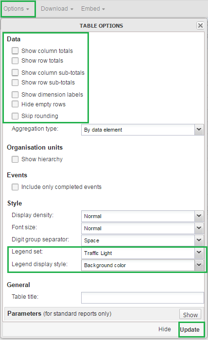

# Creating Scorecards using the Pivot Table app

**In public health settings such as Ministries of Health, scorecards offer a useful and standardized method for combining related indicators into one table. A scorecard gives an overall view of the performance of a health program such as a vaccination program, highlighting successes, weaknesses, and areas for improvement.**

This tutorial explains how to create a scorecard in the DHIS2 Pivot Table app. There are several advantages to using the Pivot Table to create a scorecard, such as:

*   You can save the scorecard on the dashboard and use it offline.
*   You can share the scorecard with other DHIS2 users.

Here's what a scorecard looks like: 

_Let's get started!_

1. Create a legend for your scorecard

  First, we’ll create a 3-color “traffic light” legend for the scorecard. With three basic colors, the scorecard is easy to scan and easy to understand.

  

  *   In the **Legend Management** page, scroll to the bottom of the page and create a new legend by clicking the blue + button.

  

  *   Enter a name for the legend such as “Traffic light”, a start value and an end value in the fields. The values you enter here depend on the performance ratings you wish to set for the scorecard.
  *   Change **Number of legend items** to 3 to display three colors in the scorecard. To change the legend item colors, click the blue + button and then edit the colors.

  

2. Create a scorecard in the Pivot Table app

  

  *   Click **Update**. This button is in the menu at the top of the workspace.
  *   Go to **Periods** and select a period for which you want to display data. In this “traffic light” example, we’ll use the relative period section. In **Quarters**, select **This quarter** and **Last quarter**. Clear any other checkboxes and click **Update**.

  

  *   Go to **Organisation Units** in the same left side pane, and click the arrow next to the gear button.
  *   Select **Select levels**.

  

  *   Select **District** from the list (next to the gear button). Click **Update**.

   As you can see, the scorecard is starting to take shape in the workspace. Now it’s time to fine-tune the look and feel.

3. Organise the layout and display of your scorecard

  

  *   In **Table layout**, drag **Organisation units** down to the **Row dimensions** section.
  *   Drag **Data** to the **Column dimensions** section.
  *   In the **Column dimensions** pane, drag **Periods** below **Data**, and click **Update**.
  *   In the workspace, click **Options**

  

  *   Go to **Data** and clear all the checkboxes.
  *   Go to **Style** > **Legend set** and from the list, select the legend you created in the Maintenance app. In this example, we called it Traffic light.
  *   Go to **Style** > **Legend display style** and select **Background color**.
  *   Click **Update**.

  _The Scorecard is ready!_

  

4. Save and share your scorecard

  1.  In the workspace, go to the **Favorites** menu.
  2.  Click **Save as**. Enter a name for your Scorecard.
  3.  To share your Scorecard, select **Favorites**.
  4.  Enter the name of a user group name, and click **Save**.

   Your scorecard can be viewed by people that you share a dashboard with.
