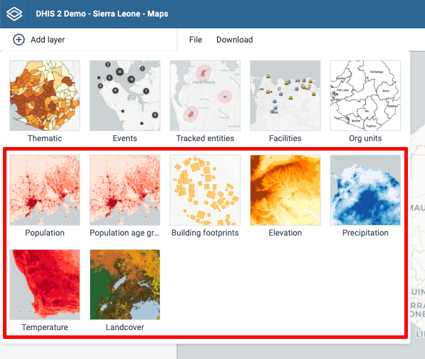

# Accessing map layers from Google Earth Engine

DHIS2 has a powerful integration with [Google Earth Engine](https://earthengine.google.com/) allowing you to access detailed datasets for population (WorldPop), building footprints, elevation, land use and climate. These datasets can be freely used by governments and non-profit organisations.

To access these layers, ask your system administrators to send an email to maps@dhis2.org saying you need access to Google Earth Engine for your DHIS2 instance(s). Please specify the name of your organization. We will generate a key file allowing all your DHIS2 users to access the Earth Engine map layers.

The key file should be placed in the same folder as the “dhis.conf” file, and the same key can be used for multiple DHIS2 instances that are maintained by the same organisation.
