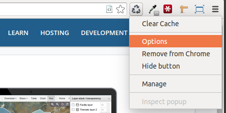

# How to really clear the cache

DHIS 2 is heavily utilizing the offline storage features that come with the HTML5 specification, such as local storage and indexed database, enabling you for instance to capture data even while being disconnected from the Internet. However, most browsers do not clear the offline content (local storage, indexed database) by default when clearing the cache. To really clear cache including offline content in the Chrome browser we recommend the [Clear Cache](https://chrome.google.com/webstore/detail/clear-cache/cppjkneekbjaeellbfkmgnhonkkjfpdn) app found in Chrome Web Store. To use it do the following:

*   Install the app from [here](https://chrome.google.com/webstore/detail/clear-cache/cppjkneekbjaeellbfkmgnhonkkjfpdn).
*   An icon will be added to the top right corner. Right-click it and select "Options".
*   Under "Data to remove" select everything except "Cookies".
*   Under "Time period" select "Everything", and close the browser tab.
*   Click the Clear cache icon in the top-right corner.

All cached data, including offline content, will now be cleared, and you will get a fresh view of the system. Happy customization. 
