# About data dimensions { #data_dimensions } 

## Data dimensions: Core building blocks in DHIS2

A data value in DHIS2 is described by at least three dimensions: 1) data
element, 2) organisation unit, and 3) period. These dimensions form the
core building blocks of the data model.

As an example, if you want to know how many children that were immunised
for measles in Gerehun CHC in December 2014, the three dimensions which
describe that value are the data element "Measles doses given", the
organisation unit "Gerehun CHC", and the period "December 2014". All
data values have at least these three dimensions describing *what*,
*where*, and *when*.

In addition to the data element, organisation unit, and period
dimensions, data values may also be associated with additional data
dimensions. A common use of this feature is to describe data values
which are reported by multiple partners in the same location for the
same data element and time period. In principle, it can be used as a
"free-form" dimension, to describe multiple observations of the same
phenomena at the same place and time. For more information about this,
see Chapter 34: Additional data dimensions.

| Organisation Unit | Data Element | Period | Value |
|---|---|---|---|
| Gerehun CHC | Measles doses given | Dec-09 | 22 |
| Tugbebu CHP | Measles doses given | Dec-09 | 18 |

## Data elements: the *what* dimension

### Data element categories

The data element mentioned above ,"Measles doses given", can be further
disaggregated into by combinations of data element categories. Each
system administrator of DHIS2 is free to define any data element
category dimensions for data elements. There are however, certain best
practices which should generally be followed.

Given the example of Measles vaccination, if you want to know whether
these vaccines were given at the facility (fixed) or out in the
community as part of the outreach services then you could add a
dimension called—e.g., "Place of service", with the two possible options
"Fixed" and "Outreach". Then all data collected on measles immunisation
would have to be disaggregated along these to options. In addition to
this you might be interested in knowing how many of these children who
were under 1 year or above 1 year of age. If so you can add an Age
dimension to the data element with the two possible options "\<1 y" and
"\>1 y". This implies further detail on the data collection process. You
can also apply both categories "Place of service" and "Age" and combine
these into a data element category combination e.g. called "EPI
disaggregation". You would then be able to look at four different more
detailed values in stead of only one as in the example above for the
data element "Measles doses given": 1) "Fixed and \<1 y, 2) Fixed and
\>1 y, 3) Outreach and \<1 y, and 4) Outreach and \>1 y. This adds
complexity to how data is collected by the health facilities, but at the
same time opens up for new possibilities of detailed data analysis of
Measles immunisation.

Table: Example of detailed storage of data values when using data element categories "Place of Service" and "Age" (simplified for readability compared to the actual database table)

| Organisation Unit | Data Element | Place of service | Age | Period | Value |
|---|---|---|---|---|---|
| Gerehun CHC | Measles doses given | Fixed | \<1 y | Dec-09 | 12 |
| Gerehun CHC | Measles doses given | Outreach | \<1 y | Dec-09 | 4 |
| Gerehun CHC | Measles doses given | Fixed | \>1 y | Dec-09 | 4 |
| Gerehun CHC | Measles doses given | Outreach | \>1 y | Dec-09 | 2 |
| Tugbebu CHP | Measles doses given | Fixed | \<1 y | Dec-09 | 10 |
| Tugbebu CHP | Measles doses given | Outreach | \<1 y | Dec-09 | 4 |
| Tugbebu CHP | Measles doses given | Fixed | \>1 y | Dec-09 | 3 |
| Tugbebu CHP | Measles doses given | Outreach | \>1 y | Dec-09 | 1 |

### Data element group sets

While the data element categories and their options described above
provide the level of detail (disaggregation) at the point of data
collection and how data values get stored in the database, the data
element group sets and groups can be used to add more information to
data elements after data collection. As an example, if you are analysing
many data elements at the same time in a report, you would want to group
these based on some criteria. Instead of looking at all the data
captured in a form for immunisation and nutrition, you might want to
separate or group data elements along a programme dimension (known as a
data element group set in DHIS2) where "Immunisation" (or EPI) and
"Nutrition" would be the two groups.

Expanding the report to include data from other programs or larger
themes of health data would mean more groups to such a group set
dimension, like "Malaria", "Reproductive Health", "Stocks". For this
example, you would create a data element group set called "Programme"
(or whatever name you find appropriate), and to represent the different
programmes in this dimension you would define data elements groups
called "EPI", "Nutrition", "Malaria", "Reproductive health" and so on,
and add all these groups to the "Programme" group set. To link or tag
the data element "Measles doses given" to such a dimension you must (in
our example) add it to the "EPI" group. Which groups you add "Measles
doses given" to does not affect how health facilities collect the data,
but adds more possibilities to your data analysis. So for the group set
dimensions there are three levels; the group set (e.g. "Programme"), the
group (e.g. "EPI"), and the data element (e.g. "Measles doses given").

Indicators can be grouped into indicator groups and further into
indicator group sets (dimensions) in exactly the same way as data
elements.

| Organisation Unit | Data Element | Programme | Period | Value |
|---|---|---|---|---|
| Gerehun CHC | Measles doses given | EPI | Dec-09 | 22 |
| Gerehun CHC | Vitamin A given | Nutrition | Dec-09 | 16 |
| Tugbebu CHP | Measles doses given | EPI | Dec-09 | 18 |
| Tugbebu CHP | Vitamin A given | Nutrition | Dec-09 | 12 |
| Gerehun CHC | Malaria new cases | Malaria | Dec-09 | 32 |
| Tugbebu CHP | Malaria new cases | Malaria | Dec-09 | 23 |

## Organisation units: the *where* dimension

Organisation units in DHIS2 should typically represent a location, such
as a Community Health Centre or referral hospitals, or an administrative
unit like "MoHS Sierra Leone", "Bo District" or "Baoma Chiefdom". In
non-health sector applications, they could be "schools" or "water
points". Orgunits are represented in a default hierarchy, usually the
default administrative hierarchy of a country or region, and are
therefore assigned an organisational level. As an example, Sierra Leone
has four organisation unit levels; National, District, Chiefdom, and
Facility, and all orgunits are linked to one of these levels. An orgunit
hierarchy in DHIS2 can have any number of levels. Normally data is
collected at the lowest level, at the health facility, but can be
collected at any level within the hierarchy, such as both the districts
as well as the facility level.

When designing reports at higher levels with data aggregated at the
district or province level, DHIS2 will use the hierarchy structure to
aggregate all the health facilities' data for any given unit at any
level. The organisation unit level capturing the data always represents
the lowest level of detail that is possible to use in data analysis, and
the organisational levels define the available levels of aggregation
along a geographical dimension.

### Organisation unit group sets and groups

While facility level is typically the lowest geographical level for
disaggregation in DHIS2, there are ways to flexibly group organisation
units into any number of dimensions by using the organisation unit
groups and group set functionality. As an example, if all facilities are
given an official type like "Community health center" or "District
Hospital, it is possible to create an organisation unit group set called
"Type" and add groups with the names of the types mentioned above. In
order for the group sets to function properly in analysis, each
organisation unit should be a member of a single group (compulsory and
exclusive) within a group set. Stated somewhat differently, a facility
should not be both a "Community health center" as well as a "District
hospital".

#### Inherit the values of an organisation unit group set

You can improve the completeness of your aggregated data by inheriting
the settings of a "parent" organisation unit in your organisation unit
hierarchy. This is particularly helpful if you are aggregating the data
of more than 100 organisation units. See the
[Maintenance](https://docs.dhis2.org/master/en/user/html/manage_organisation_unit.html#create_organisation_unit_group_set)
app documentation for more
details.

#### Alternative organisation unit hierarchies - advanced use of group sets and groups

A more advanced use of organisation unit group sets is to create
alternative hierarchies e.g. use administrative borders from other
ministries. In Sierra Leone that could mean an alternative hierarchy of
1:MoHS, 2:Districts, and 3: Local councils, instead of the four-level
hierarchy with chiefdoms and facilities. For instance, if all facilities are linked
to a specific local council, it would be possible to look at data
aggregated by local council instead of chiefdom. Then you would first
need to create a group set called "Local council" and then create one
organisation unit group for every local council, and finally link all
facilities to their corresponding local council group.

| District | OrgUnit Type | Data Element | Period | Value |
|---|---|---|---|---|
| Bo | CHC | Measles doses given | Dec-09 | 121 |
| Bo | CHP | Measles doses given | Dec-09 | 98 |
| Bo | MCHP | Measles doses given | Dec-09 | 87 |
| Bombali | CHC | Measles doses given | Dec-09 | 110 |
| Bombali | CHP | Measles doses given | Dec-09 | 67 |
| Bombali | MCHP | Measles doses given | Dec-09 | 59 |

### Best practice on the use of group sets and groups

As mentioned above, all organisation units should be a member of a
single group within a group set. If an organisation unit is not present
in any group or is present in multiple group members in a group set,
this can lead to unexpected results in the analysis modules. DHIS2 has
integrity checks to identify organisation units which are not present in
any organisation unit group set member, or which is present in multiple
groups.

## Period: the *when* dimension { #period_types } 

The period dimension becomes an important factor when analysing data
over time e.g. when looking at cumulative data, when creating quarterly
or annual aggregated reports, or when doing analysis that combines data
with different characteristics like monthly routine data, annual
census/population data or six-monthly staff data.

### Period types

In DHIS2, periods are organised according to a set of fixed period types
described below. The following list is for the default ISO 8601 calendar
type.

1.  Daily

2.  Weekly: The system supports various weekly period types, with
    Monday, Wednesday, Thursday, Saturday and Sunday as the first day of
    the week. You collect data through data sets configured to use the
    desired weekly period type. The analytics engine will attribute
    weekly data to the month which contains four days or more of the
    week.

3.  Bi-weekly: Two week periods beginning with the first week of the
    year.

4.  Monthly: Refers to standard calendar months.

5.  BiMonthly: Two-month periods beginning in January.

6.  Quarterly: Standard ISO quarters, beginning in January.

7.  SixMonthly: Six-month periods beginning in January

8.  Yearly: This refers to a calendar year.

9.  Financial April: Financial year period beginning on April 1st and
    ending on March 31st of the calendar next year

10. Financial July: Financial year period beginning on July 1st and
    ending on June 31st of the calendar next year

11. Financial Oct: Financial year period beginning on October 1st and
    ending on September 31st of the calendar next year

12. Six-monthly April: Six-month periods beginning on April 1st with a
    duration of six calendar months.

As a general rule, all organisation units should collect the same data
using the same frequency or periodicity. A data entry form therefore is
associated with a single period type to make sure data is always
collected according to the correct and same periodicity across the
country.

It is possible however to collect the same data elements using different
period types by assigning the same data elements to multiple data sets
with different period types, however then it becomes crucial to make
sure no organisation unit is collecting data using both data sets/period
types as that would create overlap and duplication of data values. If
configured correctly the aggregation service in DHIS2 will aggregate the
data together, e.g. the monthly data from one part of the country with
quarterly data from another part of the country into a national
quarterly report. For simplicity and to avoid data duplication it is
advised to use the same period type for all organisation units for the
same data elements when possible.

### Relative periods

In addition to the fixed period types described in the previous section,
DHIS2 also support relative periods for use in the analysis modules.

When creating analytical resources within DHIS2 it is possible to make
use of the relative periods functionality. The simplest scenario is when
you want to design a monthly report that can be reused every month
without having to make changes to the report template to accommodate for
the changes in period. The relative period called "Last month" allows
for this, and the user can at the time of report generation through a
report parameter select the month to use in the report.

A slightly more advanced use case is when you want to make a monthly
summary report for immunisation and want to look at the data from the
current (reporting) month together with a cumulative value for the year
so far. The relative period called "This year" provides such a
cumulative value relative to the reporting month selecting when running
the report. Other relative periods are the last 3,6, or 12 months
periods which are cumulative values calculated back from the selected
reporting month. If you want to create a report with data aggregated by
quarters (the ones that have passed so far in the year) you can select
"Last four quarters". Other relative periods are described under the
reporting table section of the manual.

| Organisation Unit | Data Element | Reporting month | So far this year | Reporting month name |
|---|---|---|---|---|
| Gerehun CHC | Measles doses given | 15 | 167 | Oct-09 |
| Tugbebu CHP | Measles doses given | 17 | 155 | Oct-09 |

### Aggregation of periods

While data needs to be collected on a given frequency to standardise
data collection and management, this does not put limitations on the
period types that can be used in data analysis and reports. Just like
data gets aggregated up the organisational hierarchy, data is also
aggregated according to a period hierarchy, so you can create quarterly
and annual reports based on data that is being collected on a Monthly
basis. The defined period type for a data entry form (data set) defines
the lowest level of period detail possible in a report.

#### Sum and average aggregation along the period dimension

When aggregating data on the period dimension there are two options for
how the calculation is done, namely sum or average. This option is
specified on a per data element in DHIS2 through the use of the
'aggregation operator' attribute in the Add/Edit Data Elements dialog.

Most of the data collected on a routinely basis should be aggregated by
summing up the months or weeks, for instance to create a quarterly
report on Measles immunisation one would sum up the three monthly values
for "Measles doses given".

Other types of data that are more permanently valid over time like
"Number of staff in the facility" or an annual population estimate of
"Population under 1 year" need to be aggregated differently. These
values are static for all months as long as there are valid data. For
example, the "Estimated population under 1", calculated from the census
data ,is the same for all months of a given year, or the number of
nurses working in a given facility is the same for every month in the 6
months period the number is reported for.

This difference becomes important when calculating an annual value for
the indicator morbidity service burden for a facility. The monthly
head-counts are summed up for the 12 months to get the annual headcount,
while the number of staff for the facility is calculated as the average of
the two 6-monthly values reported through the 6-monthly staff report. So
in this example the data element "OPD headcount" would have the
aggregation operator "SUM" and the data element "Number of staff" would
have it set to "AVERAGE".

Another important feature of average data elements is the validity
period concept. Average data values are standing values for any period
type within the borders of the period they are registered for. For
example, an annual population estimate following the calendar year, will
have the same value for any period that falls within that year no matter
what the period type. If the population under 1 for a given facility is
250 for the year of 2015 that means that the value will be 250 for
Jan-15, for Q3-15, for Week 12 of 2015 and for any period within 2015.
This has implications for how coverage indicators are calculated, as the
full annual population will be used as denominator value even when doing
monthly reports. If you want to look at an estimated annual coverage
value for a given month, then you will have the option of setting the
indicator to "Annualised" which means that a monthly coverage value will
be multiplied by a factor of 12, a quarterly value by 4, in order to
generate an effective yearly total. The annualised indicator feature can
therefore be used to mimic the use of monthly population estimates.

## Data collection vs. data analysis

### Data collection and storage

Datasets determine what raw data that is available in the system, as
they describe how data is collected in terms of periodicity as well as
spatial extent. Data sets define the building blocks of the data to be
captured and stored in DHIS2. For each data dimension we decide what
level of detail the data should be collected at namely 1) the data
element (e.g. diagnosis, vaccine, or any event taking place) and its
categories (e.g. age and gender), 2) the period/frequency dimension, and
3) the organisation unit dimension. For any report or data analysis you
can never retrieve more detailed data than what is defined in the data
sets, so the design of the datasets and their corresponding data entry
forms (the data collection tools) dictate what kind of data analysis
will be possible.

### Input does not equal Output

It is important to understand that the data entry forms or datasets
themselves are not intrinsically linked to the underlying data value and
that the meaning of data is only described by the data element (and its
categories). This makes it perfectly safe to modify datasets and forms
without altering the data (as long as the data elements stay the same).
This loose coupling between forms and data makes DHIS2 flexible when it
comes to designing and changing new forms and in providing exactly the
form the users want.

Another benefit of only linking data to data elements and not to forms,
is the flexibility of creating indicators and validation rules based on
data elements, and also in providing any kind of output report (in pivot
tables, charts, maps etc.) that can combine data individually or across
forms, e.g. to correlate data from different health programs. Due to
this flexibility of enabling integration of data from various programs
(forms) and sources (routine and semi permanent (population, staff,
equipment)) a DHIS2 database is used as an integrated data repository
for many or all parts of the aggregated data in a larger HIS. The figure
below illustrates this flexibility.

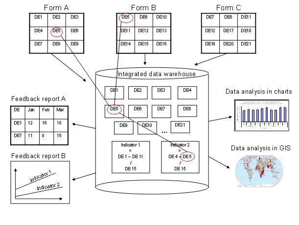

In this example, we see that data elements from multiple forms can be
combined to create a given indicator. As a more concrete example, one
might collect "Population under one year of age" in an annual data set
by district, and then collect a data element like "Fully immunized
children" by month at the facility level. By annualizing the population,
we can generate an approximation of the effective monthly population,
and combining this with the aggregate total of the number of fully
immunized children by month, it would be possible to generate an
indicator "Fully immunized coverage", consisting of the aggregated
total of children who are fully immunized, divided by the effective
monthly population.

## Extended examples of data elements and forms

The table below combines data element the two group sets Diagnosis (all
the diseases) and Morbidity/Mortality (New cases, Follow-ups, Referrals,
Deaths) with the data element category PHU/Community. Deaths are
captured in a separate form with other dimensions (e.g. the
PHU/Community) than morbidity.

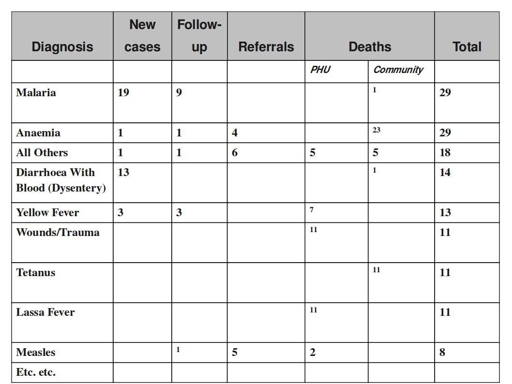

This output table combines the two data element categories HIV\_Age and
Gender with the data element group set ART Group. The group enables
subtotals for staging and entry points summing up the data elements in
that group. Subtotals for either age groups and gender would be other
possible columns to easily include here.

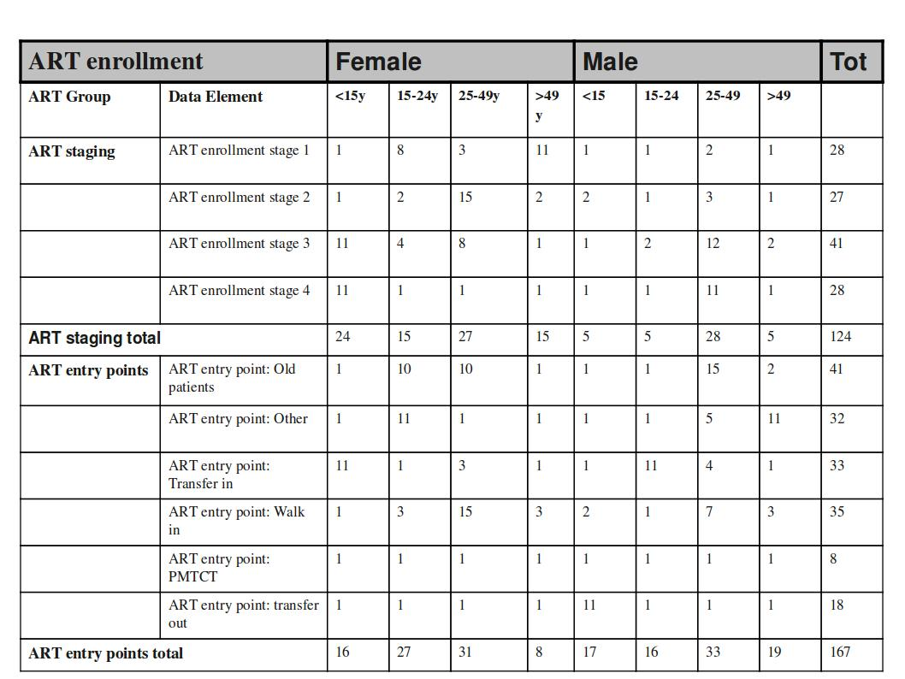

## How this works in pivot tables

When doing data analysis in Excel pivot tables or any other OLAP based
tool the dimensions become extremely powerful in providing many
different views into the data. Each data element category or group set
become a pivot field, and the options or groups become values within
each of these fields. In fact categories and groupsets are treated
exactly the same way in pivot tables, and so are orgunits, periods, and
data elements. All these become dimensions to the data value that can be
used to rearrange, pivot, filter, and to drill down into the data. Here
we will show some examples of how the data dimensions are used in pivot
tables.

Using the example of morbidity and mortality data, a pivot table can
show how the dimensions can be used to view data for different
aggregation levels.

The completely aggregated number is viewed when none of the pivot fields
are arranged in the table area, as column or row fields, but are listed
above the table itself as page field (filter).

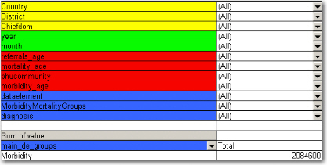

Here we have selected to look at the Morbidity total. The various data
elements on morbidity have been ordered into the main\_de\_groups
Morbidity (we will get back to Mortality later). The fields above the
table itself are all set to "All", meaning that the totals in the table
will contain data from all Countries, Districts, Chiefdom, ou\_type,
year, months, the various categories as listed in the red fields, and
all data elements in the Morbidity group.

As we have seen, this is not a very useful representation, as Morbidity
is organized into new cases, follow-ups, referrals, and then again in
age groups. Also, we do not see the various diagnoses. The first step is
to include the diagnoses field (which is a group set), which is done by
dragging the "diagnosis" field down to be a row field, as shown in the
figure below, and to add the group set called "morbiditymortality" in
the column field to display new cases, follow-up, and referrals.

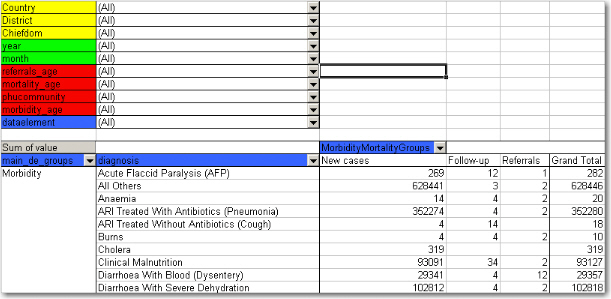

Contrast this figure above to the one below.

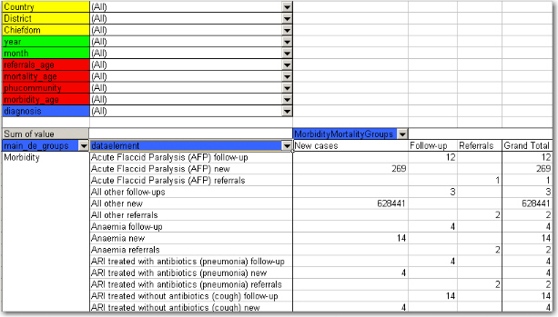

They both show the same data (some of the rows have been cut in the
screenshot due to image size), albeit in a different way.

  - The "dataelement" field, used in the bottom figure, displays each
    diagnosis as three elements; one follow-up, one new, and one
    referrals. This is the way the data elements have been defined in
    DHIS2, as this makes sense for aggregation. You would not like to
    aggregate follow-ups and new, thus these have not been made as
    categories, the whole point of is to ease aggregation and
    disaggregation.

  - The "diagnosis" group set has instead been made to lump these three
    (follow-up, new, referrals) together, which can then be split with
    another group set, namely the one called "morbiditymortality". This
    allows us to organize the data as in the first of the two figures,
    where we have the single diagnosis per row, and the groups new,
    follow-up, referrals as rows.

The idea of using group sets is that you can combine, in any set,
different data elements. Thus, if we add the mortality data (by checking
it from the drop-down menu of the main\_de\_groups field, and moving
this field out of the table) we can see also the deaths, since the
mortality data elements have been included as a "death" group in the
"morbiditymortality" group set. The result is shown below.

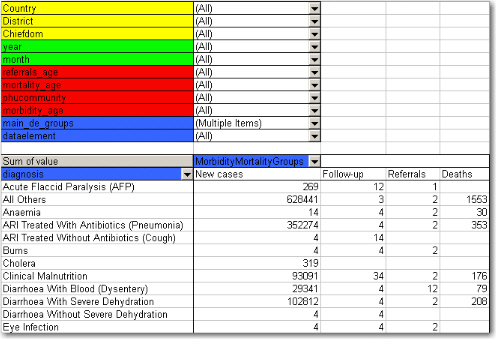

The result is a much more user-friendly pivot table. Now, another figure
shows the relationship between the group sets and elements (these are
fake data values).

This small detail of the pivot table show how the actual data elements
link to the group sets:

  - The four data elements, as defined in DHIS2, are Measles death,
    Measles follow-up, Measles new, and Measles referrals

  - They all belong to the group set "diagnosis", where they have been
    lumped together in the group Measles

  - The group set "morbiditymortality" contains the groups New cases,
    Follow-up, Referrals, and Deaths.

  - Only the data element Measles deaths has data related to the group
    Deaths, thus this is where the data value (20) is shown, at the
    upper right corner. The same for Measles new; the value (224) is
    shown at the intersection of the data element Measles new and the
    group New cases (in the group set morbiditymortality)

  - All the intersections where the data element does not link with the
    groups in morbiditymortality are left blank. Thus in this case we
    would get a nice table if we excluded the data element from the
    table, and just had diagnosis and the group set morbiditymortality,
    as in the figure shown earlier

Now lets see how the data element categories can be used. In the data
entry form for Morbidity the new cases and follow-ups use one age
category, the referral data another,, and the mortality data a third age
breakup, so these are available as three individual age group fields in
the pivot tables called morbidity\_age, referrals\_age and
mortality\_age. It doesn't make sense to use these while looking at
these data together (as in the examples above), but e.g. if we only want
to look at the only the new cases we can put the MobidityMortalityGroups
field back up as a page field and there select the New cases group as a
filter. Then we can drag the Morbidity\_age field down to the column
area and we get the following view:

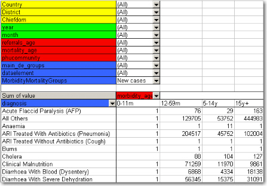

The following table illustrates the benefits of reusing data element
categories across datasets and category combinations. The VCCT, ART and
PMTCT data are collected in three different datasets, the first two with
both gender and age breakdown, and the PMTCT only age (gender is given).
All three share the same age groups and therefore it is possible to view
data elements from all these three datasets in the same table and use
the age dimension. In the previous example with morbidity and mortality
data this was not possible since new cases, referrals and deaths all
have different age groups.

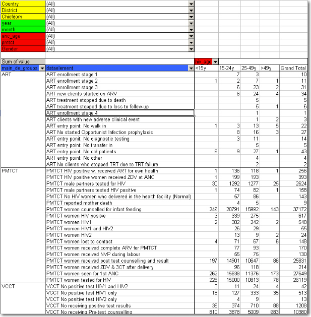

In the table below PMTCT data has been removed from the table and the
gender category added to the column area so that you can analyse the
data for VCCT and ART by age and gender. An optional subtotal for gender
has also been added, as well as a grand total for all age and
gender.

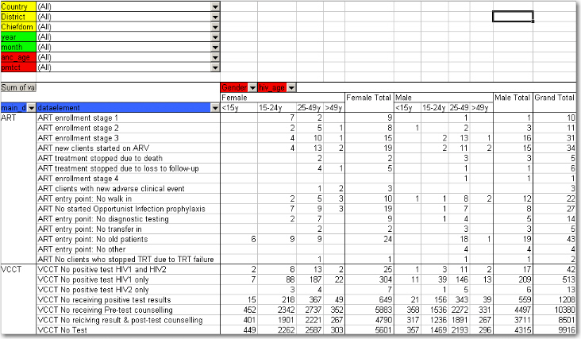

## Case study: From paper forms to multidimensional datasets - lessons learned

Typically the design of a DHIS2 dataset is based on some requirements
from a paper form that is already in use. The logic of paper forms are
not the same as the data element and data set model of DHIS2, e.g. often
a field in a tabular paper form is described both by column headings and
text on each row, and sometimes also with some introductory table
heading that provides more context. In the database this is captured in
one atomic data element with no reference to a position in a visual
table format, so it is important to make sure the data element with the
optional data element categories capture the full meaning of each
individual field in the paper form.

Another important thing to have in mind while designing datasets is that
the dataset and the corresponding data entry form (which is a dataset
with layout) is a data collection tool and not a report or analysis
tool. There are other far more sophisticated tools for data output and
reporting in DHIS2 than the data entry forms. Paper forms are often
designed with both data collection and reporting in mind and therefore
you might see things such as cumulative values (in addition to the
monthly values), repetition of annual data (the same population data
reported every month) or even indicator values such as coverage rates in
the same form as the monthly raw data. When you store the raw data in
DHIS2 every month and have all the processing power you need within the
computerised tool there is no need (in fact it would be stupid and most
likely cause inconsistency) to register manually calculated values such
as the ones mentioned above. You only want to capture the raw data in
your datasets/forms and leave the calculations to the computer, and
presentation of such values to the reporting tools in
DHIS2.

### From tables to category combinations - designing multi-dimensional data sets

As we have seen in the examples above, data element categories and
category options are helpful in representing tabular data, when adding
dimensions to a field in a paper form. We have also seen how the data
element is one of the required dimensions which describe data in DHIS2.
As we will see in the example below there are often more than one way to
represent a paper form in DHIS2 , and it can be difficult to know which
dimension to represent with a data element name and which to represent
as categories, or even as groups as we have seen above. Here are some
general lessons learned from working with data element and category
combinations:

  - Design your dimensions with data use in mind, not data collection.
    This means that disaggregation of data values at collection time
    should be easily aggregated up along the various dimensions, as in
    adding up to a meaningful total.

  - Reuse dimensions as much as possible as this increases the ability
    to compare disaggregated data (e.g. age groups, fixed/outreach,
    gender).

  - Disaggregation dimensions should add up to a total. In certain
    cases, data elements may be collected a subsets of each other. In
    this case, use of categories to disaggregate the data element should
    not be used. As an example, we might collect "Number of confirmed
    malaria cases" and disaggregate this by "Under 5" and "Over 5". A
    third data element "Number of confirmed malaria cases under 1" might
    also exist on the form. It would seem reasonable then to create
    three age groups : Under 1, Under 5 and Over 5, to describe the
    disaggregation. However, the Under 1 is actually a subset of the
    Under 5 group, and when totalled, would result in duplication. Thus,
    categories should be generally be composed of mutually exclusive
    category options, such that the sum of individual category options
    results in a coherent total.

  - Different levels of dimensions; 1) disaggregation and 2) grouping.
    Disaggregation dimensions dictate how you collect and how detailed
    you store your data, so plan these carefully. The group dimension is
    more flexible and can be changed and added to even after data
    collection (think of it as tagging).

  - It is best to think of how the data would be used in an integrated
    data repository and not how it will actually be collected on forms
    or by programs when designing the meta-data model. Ideally, the same
    type of disaggregation should be used across forms and datasets for
    data elements which will be analysed together, or used to build
    indicators. Reuse definitions so that the database can integrate
    even though the forms themselves might be duplicated (which in
    practice, is often the case).

In order to better explain the approach and the possibilities we present
an example paper form and will walk through it step by step and design
data elements, categories, category options and category combinations.

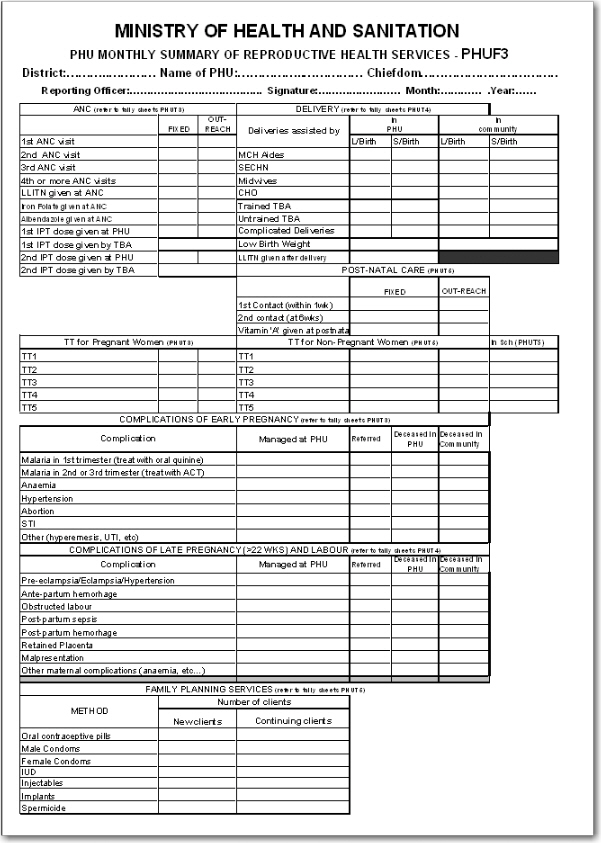

This form has many tables and each of them potentially represent a data
element category combination (from now on referred to as a catcombo). As
such there is no restriction on a dataset to only have one set of
dimensions or catcombo, it can have many and as we see above this is
necessary as the dimensions are very different from table to table. In
the following paragraphs, we will analyse how to break down this form
into its component pieces and suggest an implementation pathway in
DHIS2.

**ANC table**. This table in the top left corner is one the simpler ones
in this form. It has two dimensions, the first column with the ANC
activity or service (1st visit, IPT 2nd dose etc) and the second and
third column which represent the place where the service was given with
the two options "Fixed" and "Outreach". Since the ANC service is the key
phenomena to analyse here, and often there is a need for looking at the
total of "ANC 1st visits" no matter where they actually took placed, it
makes a lot of sense to use this dimension as the data element
dimension.

Thus, all items on the first column from "1st ANC" visit to "2nd IPT
dose given by TBA" are represented as individual data elements. The
*where* dimension is represented as a data element category (from now on
referred to as category) with the name "fixed/outreach" with the two
data element category options (from now on catoptions) "fixed" and
"outreach". There is no other dimension here so we add a new catcombo
with the name "Fixed/Outreach" with one category "Fixed/Outreach".
Strictly speaking there is another dimension in this table, and that is
the at PHU or by TBA dimension which is repeated for the two doses of
IPT, but since none of the other ANC services listed have this dimension
it does not seem like a good idea to separate out two data elements from
this table and give them another catcombo with both fixed/outreach and
at PHU/by TBA. reusing the same catcombo for all the ANC services makes
more sense since it will be easier to look at these together in reports
etc. and also the fact that there is not much to lose by repeating the
at PHU or by TBA information as part of the data element name when it is
only for four data elements in a table of eleven data elements.

**DELIVERY table.** This table is more tricky as it has a lot of
information and you can see that not all the rows have the same columns
(some columns are merged and a one field is greyed out/disabled.). If we
start by looking at the first column "Deliveries assisted by" that seems
to be one dimension, but only down to the "Untrained TBA" row, as the
remaining three rows are not related to who assisted the delivery at
all. Another dimension is the place of delivery, either In PHU or in
Community as stated on the top column headings. These deliveries are
further split into the outcome of the delivery, whether it is a live or
still birth, which seems to be another dimension. So if we disregard the
three bottom rows for a moment there seems to be 3 dimensions here, 1)
assisted by, 2) place of delivery, and 3) delivery outcome. The key
decision to make is what to use as the data element, the main dimension,
the total that you will most often use and want easily available in
reports and data analysis.

In this case, the outcome dimension as "Total live births" is a very
commonly used value in many indicators (maternal mortality ratio, births
attended by skilled health personnel etc.). In this case the "Assisted
By" dimension could also have been used without any problem, but the
added value of easily getting the total live births information was the
decisive point for us. This means that from this table (or sub-table of
row 1 to 6) there are only two data elements; "Live births" and "Still
births".

Next, there are two more dimensions, the "PHU/Community" with its two
options and a "Births attended by" with options ("MCH Aides", "SECHN",
"Midwives", "CHO", "Trained TBA", "Untrained TBA"). These two categories
make up the catcombo "Births" which is assigned to the two data elements
"Live births" and "Still births". Considering the final three rows of
the delivery table we can see that "Complicated Deliveries" does not
have the assisted by dimension, but has the place and the outcome. "Low
birth weight" also does not have the assisted by dimension and not the
outcome either. The LLITN given after delivery does not have any
additional dimension at all. Since not any of the three rows can share
catcombo with any other row we decided to represent these fields as so
called flat data elements, meaning data elements with no categories at
all, and simply adding the additional information from the column
headings to the data element name, and therefore ended up with the
following data elements with the default (same as none) catcombo;
"Complicated deliveries in PHU live birth", "Complicated deliveries in
PHU still births", "Complicated deliveries in community live birth",
"Complicated deliveries in community still births", "Low birth weight in
PHU", "Low birth weight in community", and "LLITN given after delivery".

**POST-NATAL CARE table** This table is simple and we used the same
approach as for the ANC table. 3 data elements listed in the first
column and then link these to the catcombo called "fixed/outreach".
Reusing the same category fixed/outreach for these data elements enables
analysis on fixed/outreach together with ANC data and other data using
the same category.

**TT table** This table is somewhat more complex than the previous
examples.We decided to use "TT1", "TT2" ... "TT5" as data elements which
makes it easy to get the total of each one of these. There is
fixed/outreach dimension here, but there is also the "In school place"
that is only applied to the Non-Pregnant, or more correctly to any of
the two as the school immunisation is done whether the girls are
pregnant or not. We consulted the program people behind the form and
found out that it would be OK to register all school TT immunisations as
non-pregnant, which simplifies the model a bit since we can reuse the
"TT1" to "TT5" data elements. So we ended up with a new category called
"TT place" with the three options (Fixed, Outreach, In School), and
another category called "Pregnant/Non-pregnant" with two options. The
new catcombo "TT" is then a combination of these two and applied to the
5 TT data elements. Since we agreed to put all In Schools immunisations
under Non-pregnant in means that the combination of options (Pregnant+In
School) will never be used in any data entry form, and hence become a
possible optioncombo, which is OK. As long as the form is custom
designed then you can choose which combinations of options to use or
not, and therefore it is not a problem to have such passive or unused
catoptions. Having school as one option in the TT place category
simplifies the model and therefore we thought it was worth it. The
alternative would be to create 5 more data elements for "TT1 in school"
... "TT5 in school", but then it would be a bit confusing to add these
together with the "TT1" ..."TT5" plus TT catcombo. Having school as a
place in the TT place category makes it a lot easier to get the total of
TT1.. TT5 vaccines given, which are the most important numbers and most
often used values for data analysis.

**Complications of early and late pregnancy and labour tables** We treat
these two tables as one, and will explain why. These two tables are a
bit confusing and not the best design. The most important data coming
out of these tables are the pregnancy complications and the maternal
deaths. These data elements contain further detail on the cause of the
complication or death (the first column in both tables), as well as a
place of death (in PHU or community), and an outcome of the complication
(when its not a death) that can be either "Managed at PHU" or "
Referred". We decided to create two data elements for these two tables;
"Pregnancy complications", and "Maternal Deaths", and two category
combinations, one for each of the data elements. For the Pregnancy
Complications data element there are two additional dimensions, the
cause of the complication (the combined list of the first column in the
two tables) and the outcome (managed at PHU or Referred), so these are
the categories and options that make up that category combination. For
the "Maternal deaths" data element the same category with the different
causes are used and then another category for the place of death (in PHU
or In community). This way the two data elements can share one category
and it will be easy to derive the total number of pregnancy
complications and maternal deaths. While the list of complications on
the paper form is divided into two (early and late/labour) you can see
that e.g. the malaria in 2nd and 3rd trimester are listed under early,
but in fact are for a later phase of the pregnancy. There is no clear
divide between early and late complications in the form, and therefore
we gave up trying to make this distinction in the database.

**Family Planning Services table** This table has 2 dimensions, the
family planning method (contraceptive) and whether the client is new or
continuing. We ended up with one data element only "Family planning
clients" and then added two categories "FP method" with all the
contraceptives as options, and another category "FP client type" with
new or continuing as options. This way it will be easy to get the total
number of family planning clients which is the major value to look at in
data analysis, and from there you can easily get the details on method
or how many new clients there are.

### Step-by-step approach to designing datasets

1.  Identify the different tables (or sub datasets) in the paper form
    that share the same dimensions

2.  For each table identify the dimensions that describe the data fields

3.  Identify the key dimension, the one that makes most sense to look at
    in isolation (when the others are collapsed, summed up). This is
    your data element dimension, the starting point and core of your
    multidimensional model (sub dataset). The data element dimension can
    be a merger of two or more dimensions if that makes more sense for
    data analysis. The key is to identify which total that makes most
    sense to look at alone when the other dimensions are collapsed.

4.  For all other/additional dimensions identify their options, and come
    up with explanatory names for dimensions and their options.

5.  Each of these additional dimensions will be a data element category
    and their options will be category options.

6.  Combine all categories for each sub dataset into one category
    combination and assign this to all the data elements in your table
    (or sub dataset if you like).

7.  When you are done with all the tables (sub datasets), create a
    new dataset and add all the data elements you have identified (in
    the whole paper form) to that dataset.

8.  Your dataset will then consist of a set of data elements that
    are linked to one or more category combinations.
