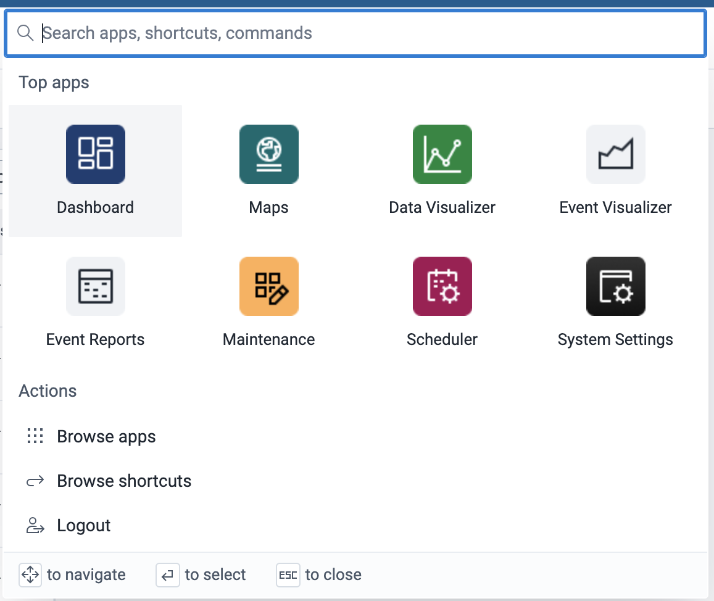
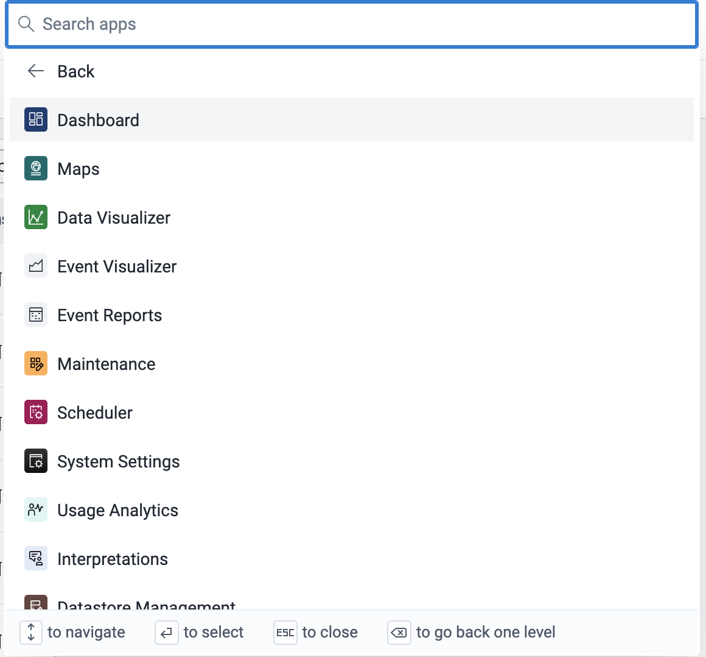
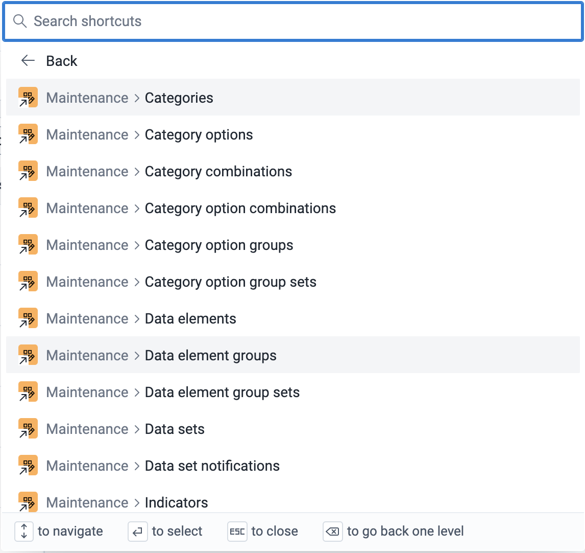

# Command Palette { #command_palette } 

The command palette is a one stop search for apps, shortcuts, and commands in the DHIS2 instance. It is available within the entire instance across all users. 

## Open the command palette
There are 3 ways to open the command palette. 

1. Click on the apps-icon (9 dots grid) to display it.

{ width=30% }

2. Or tab to the icon, and press the **Enter** button.
3. Or, press **CMD/CTRL + K** while anywhere within the DHIS2 instance.

## Interface

{ width=50% }

On launch, the command palette's interface has 4 distinct features, i.e.

1. A search bar at the top that allows you to search across all items
2. A grid of the logged in user's top 8 apps
3. A list of select actions, including those that open category list views, and the logout action, i.e.

    - **Browse Apps** - opens the list of all available apps
    - **Browse Commands** - opens the list of all available commands. Only shows if there are any commands
    - **Browse Shortcuts** - opens the list of all available shortcuts. Only shows if there are any shortcuts. 
    - **Logout** - logs the user out

4. A key legend at the bottom that shows you what key to use while navigating the command palette.

## Search in the command palette
- You can search for any item in the search bar by typing into it. 
- You can clear the search bar by using the **Backspace**/**Delete** key or clicking the clear icon.

## Browse Apps

{ width=50% }

- To see a list of all the apps available on the instance, go to the **Browse Apps** action and click on it.
- You can search for only apps within that section
- To go back to the main page, click on the **Back** arrow

## Browse Shortcuts

{ width=50% }

- To see a list of all the shortcuts available on the instance, go to the **Browse Shortcuts** action and click on it.
- You can search for only shortcuts within that section
- To go back to the main page, click on the **Back** arrow

## Browse Commands
- To see a list of all the commands available on the instance, go to the **Browse Commands** action and click on it.
- You can search for only commands within that section
- To go back to the main page, click on the **Back** arrow

## Opening an item
- Clicking on **action** or **command** activates it
- Clicking on an **app** or **shortcut** opens it. 
- You can also open an app or shortcut in a new tab by pressing **CMD/CTRL** + clicking the item

## Navigating the command palette
You can use your keyboard to navigate the command palette. They include:

- **Right**, **Left**, **Up** and **Down** arrow keys for the grid
- **Up** and **Down** arrow keys for the list items
- Pressing **Enter** on an item opens/activates it. 
- When on a category view (Apps, Commands, Shortcuts), pressing the **Backspace** button when the search bar is clear goes back one level. 

## Close the command palette
You can close the command palette in 3 ways:

- Press the **Esc** key, 
- Or, click anywhere outside the command palette,
- Or, press **CMD/CTRL + K** while anywhere within the DHIS2 instance.
