# Configure metadata (Metadata Management app) { #metadata_management_app }

> **Note**
>
> This section documents the **Metadata Management app**, which replaces the functionality of the Maintenance app.
> The Metadata Management app is available from the [DHIS2 App Hub](https://apps.dhis2.org/app/3c6d0723-904c-4c7a-bbd6-35f3c3aa356b) and is compatible with DHIS2 core V41 and above.
>
>
> If you are using DHIS2 without the Metadata Management app installed, see [Configure metadata](#maintenance_app) for the Maintenance app instead.

## About the Metadata Management app { #mm_about_metadata_management_app }

In the **Metadata Management** app you configure all the metadata objects you need to collect and analyze data:

* Categories
* Data elements
* Data sets and data entry forms
* Indicators and Predictors
* Organisation units
* Programs
* Option sets
* Validations
* Data Approvals
* Attributes
* Constants
* Legends
* SQL views
* Locales
* Analytics table hooks

> **Note**
>
> The functions you have access to depend on your user role's access permissions.

> **Note**
>
> The Metadata Management app is released on a continuous release cycle, meaning new sections and features are added regularly. If a section listed above is not yet visible in your installed version of the app, it may not yet have been implemented. You can update the app from the App Hub to get the latest features.

The Metadata Management app is a complete modernisation of the legacy Maintenance app. Key improvements include:

* **Merging duplicate metadata** — You can merge duplicate metadata objects (currently: category options, indicators, indicator types) directly from the list view. This supports ongoing metadata cleanup.
* **Advanced filtering and search** — Each object list has improved filtering options to help you find objects by name, code, or other attributes.
* **Bulk sharing** — You can update sharing settings for multiple objects at once.

### Navigating metadata objects { #mm_navigating_metadata }

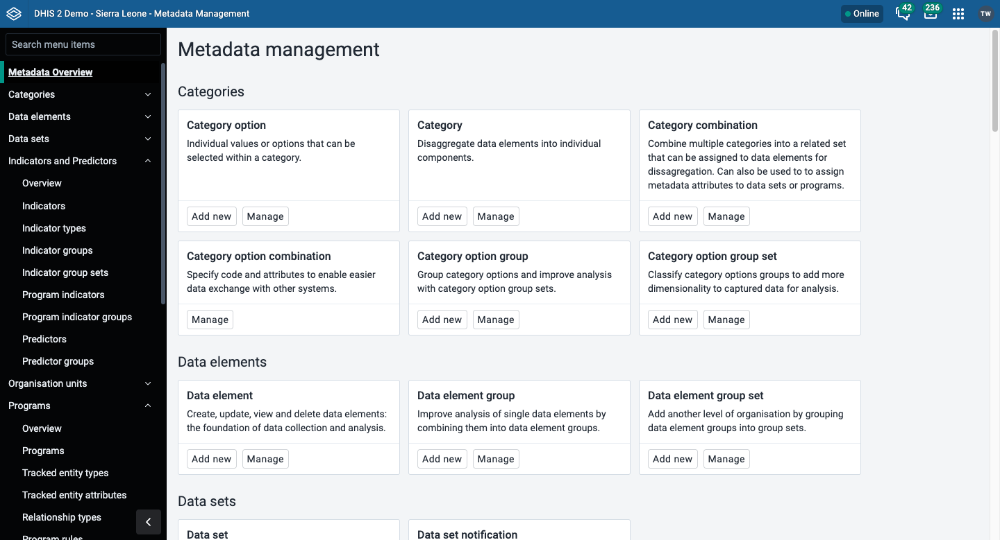

The left-hand sidebar lists all available metadata sections. Click any section to expand it and see the individual object types it contains, as shown below.

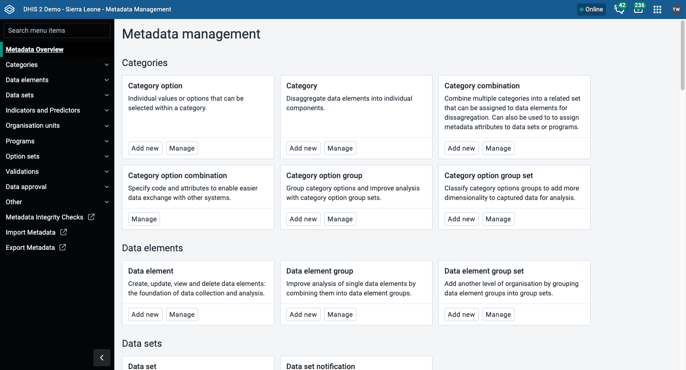

When you open the **Metadata Management** app, the left-hand sidebar displays the metadata object categories. Click a category to expand its object types, then click an object type to view its list.

Metadata objects are presented in a list with predefined columns relevant to each object. You can customise which columns are shown in the list for the current object. These customisations are per user and will not affect other users. Note that these changes do not edit any metadata — they only affect how the list is presented.

#### Managing visible columns


1. Click the **Manage View** button above the list of objects you want to configure.
2. A dialog appears with two tabs: **Columns** and **Filters**. Select the **Columns** tab.
3. The default selected columns are shown on the right.
4. Click any column name in the list of **Available columns** on the left to move it to the selected list.
5. Use the arrow buttons to move columns between the Available and Selected lists.
6. Reorder selected columns using the up and down arrow buttons.
7. Click **Update view** once you are satisfied with your changes.

Click **Reset to default** to restore the default column configuration.

#### Filtering and searching { #mm_filtering_searching }

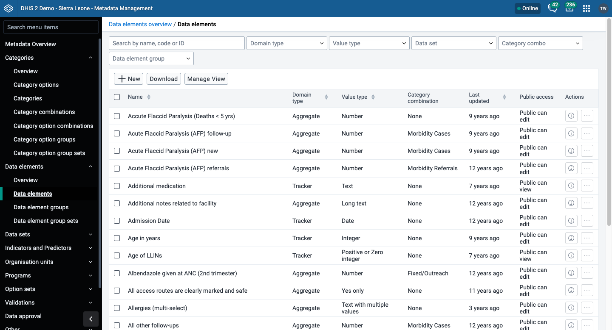

Each object list includes a search bar and a row of filter dropdowns at the top of the list. The available filters are specific to each object type — for example, the data elements list can be filtered by Domain type, Value type, Data set, Category combo and Data element group.

You can also customise which filters appear using the **Manage View** button:

1. Click **Manage View** above the list.
2. Select the **Filters** tab.
3. Move filters between **Available filters** and **Selected filters** as needed.
4. Click **Update view**.

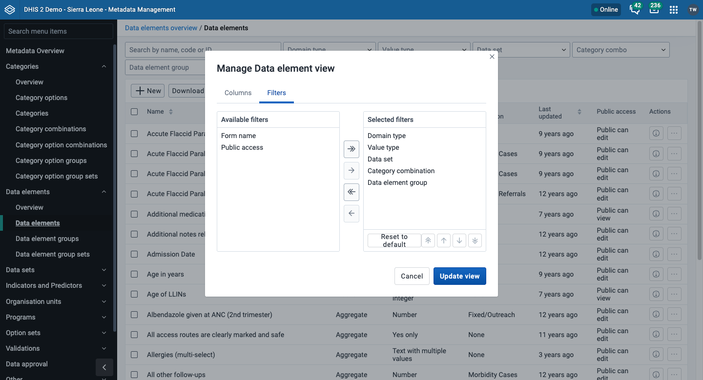

#### Download metadata { #mm_download_metadata }

You can download the metadata for the object you are currently viewing. The download will respect any active filters.

1. Click the **Manage View** button above the list.
2. In the dropdown, select **Download**.
3. In the dialog that appears, select your preferred format and compression.
4. Optionally select **With sharing** to include sharing data for the metadata.
5. Click **Download**.

---
### All Metadata view { #mm_all_metadata_view }

The new **All metadata** view allows you to search for keywords across a range of metadata types. Typing in the search box filters the results automatically, and the metadata types dropdown lets you narrow down which types of metadata are displayed. Expanding a type shows five results initially, with the option to load more.

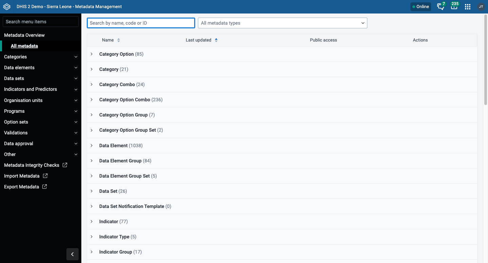

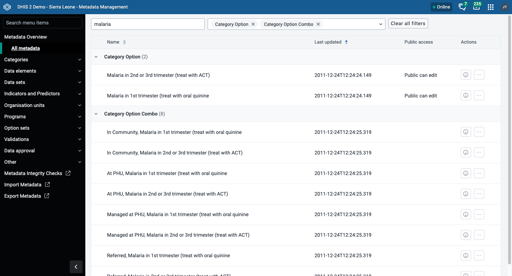

---
### Bulk update sharing { #mm_bulk_sharing }

In the **Metadata Management** app you can select multiple entries in the list view and update the sharing settings of all of them at once. First select the items you want to update. In the example below, the view has been filtered to show only category options in the category **Labour complications**, and all of them have been selected.

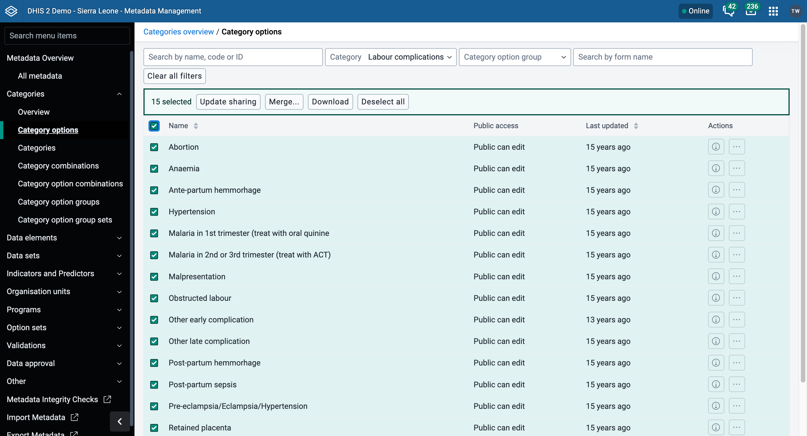

Clicking **Update sharing** opens a dialog where you choose which sharing settings to add to the selected objects.

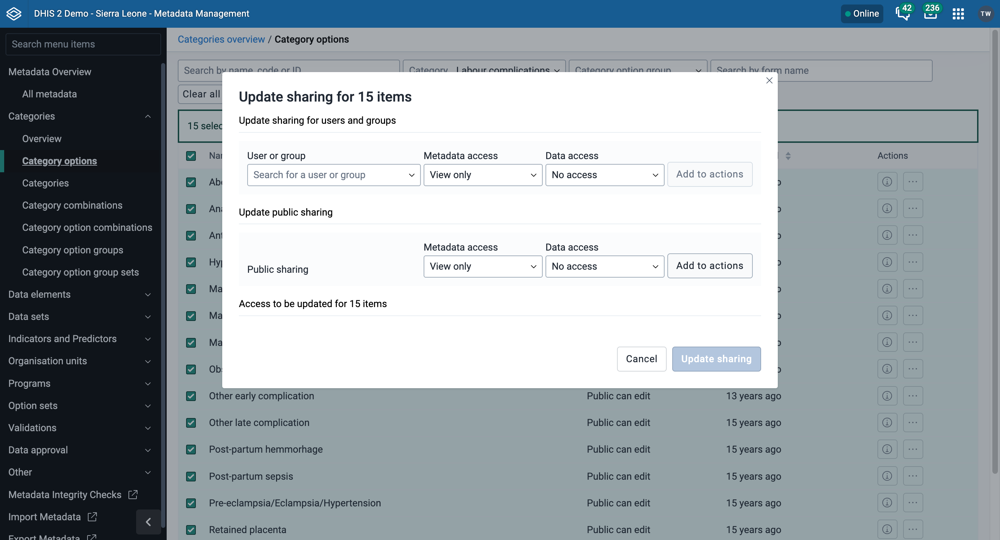

Further options for editing objects' existing sharing settings are under development.

## Common metadata object fields { #mm_common_metadata_fields }

Many metadata objects in the sections below share the same handful of fields. This table explains what each one is for and any format constraints, so the individual procedures don't have to repeat it. Where a step below names one of these fields with no further explanation, this table is the reference — sections only add their own explanation for fields that are unique to that object type.

Table: Common metadata object fields

| Field | Used on | Purpose and best practice |
| --- | --- | --- |
| Name | All objects | The full display name shown throughout the app, in lists and in most reports. Must usually be unique within the object type. |
| Short name | Most objects | A shorter version of Name, often with a character limit (commonly 50, sometimes fewer — the form tells you if you exceed it). Used wherever space is tight, for example Pivot Table column headers or mobile apps. |
| Code | All objects | An optional identifier made of letters, numbers, dots, dashes and underscores (no spaces). Codes are how external systems and data exchanges reference DHIS2 objects, so changing a code once it's in use elsewhere can break integrations. Agree on a coding convention before creating objects at scale rather than retrofitting one later. |
| Form name | Data elements, category options and similar objects | An alternative name shown as a column header in data entry forms instead of the display Name. Use it when the display Name is too long or phrased differently from what should appear on a data entry form. |
| Description | All objects | Worth filling in even where marked optional. Explain what the object measures or represents and why, in enough detail that someone unfamiliar with the project could understand it without asking you. |
| Start date / End date | Category options and other time-bound objects | Restricts when the object is available, for example a category option that only applies during a specific project phase. |
| Color / Icon | Data elements, indicators, options | Optional visual styling shown in data capture apps (Tracker Capture, Event Capture) to help users tell objects apart at a glance. |
| Data dimension / Data dimension type | Categories, category combinations, category option groups and sets, data element and indicator group sets | Controls whether the object becomes available as a selectable dimension in analytics apps such as Pivot Table and Data Visualizer, alongside built-ins like Period and Organisation unit. Where the object offers a choice such as **Disaggregation** vs **Attribute**, that choice is specific to how the object is used — see the object's own section below. |

---

## Common actions { #mm_common_actions }

Show details, Sharing settings, Translate, Delete and Clone work the same way for almost every object type covered in this chapter, regardless of whether it's a category, a data element, a predictor or something else. This section documents each action once. Each object type's own section below only notes where it deviates from this — for example an object type that doesn't support one of these actions, or has an object-specific detail worth knowing before you use it.

### Show details { #mm_common_actions_details }

1. Open the **Metadata Management** app and find the type of metadata object you want to view.
2. In the object list, click the options menu and select **Show details**.

### Change sharing settings { #mm_common_actions_sharing }

You can assign different sharing settings to metadata objects to control which users and user groups can view or edit them, for example organisation units and tracked entity attributes.

Some metadata objects also allow you to change the sharing setting of data entry for the object. These additional settings control who can view or enter data in form fields using the metadata.

> **Note**
>
> The default setting is that everyone (**Public access**) can find, view and edit metadata objects.

1. Open the **Metadata Management** app and find the type of metadata object you want to modify.
2. In the object list, click the options menu and select **Sharing settings**.
3. (Optional) Add users or user groups: search for a user or user group and select it.
4. Change sharing settings for the access groups you want to modify:
   * **Can edit and view**: The access group can view and edit the object.
   * **Can view only**: The access group can view the object.
   * **No access** (only applicable to **Public access**): The public will not have access to the object.
5. Change data sharing settings where applicable:
   * **Can capture data**: The access group can view and capture data for the object.
   * **Can view data**: The access group can view data for the object.
   * **No access**: The access group will not have access to data for the object.
6. Click **Close**.

### Translate { #mm_common_actions_translate }

DHIS2 provides functionality for translations of database content. You can translate a metadata object into any number of locales. A locale represents a specific geographical, political, or cultural region.

> **Tip**
>
> To activate a translation for yourself, open the **System Settings** app, click **Appearance** and select a language.

1. Open the **Metadata Management** app and find the type of metadata object you want to translate.
2. In the object list, click the options menu and select **Translate**.

   > **Tip**
   >
   > Organisation unit levels don't have an options menu — click directly on the **Translate** icon next to the list item instead.

3. Select a locale.
4. Type a **Name** and optionally a **Short name** and **Description** in the chosen locale.
5. Click **Save**.

### Delete { #mm_common_actions_delete }

> **Note**
>
> You can only delete a metadata object if no data is associated with it.

If a metadata object has data attached, deletion isn't just discouraged — DHIS2 blocks it outright, with no built-in way to force it. If you need to stop people from seeing it, use [Sharing settings](#mm_common_actions_sharing) to restrict access instead of trying to delete it; the object and its data will still exist, but users without access won't see them.

> **Warning**
>
> Deleting objects from DHIS2 is not recommended. In almost all cases it is better to deactivate or close an object rather than deleting it, as deletion is irrevocable.

1. Open the **Metadata Management** app and find the type of metadata object you want to delete.
2. In the object list, click the options menu and select **Delete**.
3. Click **Confirm**.

One object type carries an extra risk beyond the general note above:

* **Data sets** — deleting a data set also irrevocably deletes any data entry forms and section forms built for it. Make sure you have a backup of your database before deleting a data set, in case you need to restore it later.

<!-- This data-set-specific warning was previously duplicated, word for word, into the Delete sections for Organisation units, Constants, Option sets, Legends and Predictor groups -- none of which are data sets, and none of which have data entry/section forms. Consolidated here, to its correct home. If Organisation units, Constants, Option sets, Legends or Predictor groups turn out to have their own genuine object-specific deletion caveats, those still need to be verified against the live app rather than assumed -- the previous text was a copy-paste error, not a verified caveat for those object types. -->

### Clone { #mm_common_actions_clone }

Cloning a metadata object can save time when you need to create many similar objects.

1. Open the **Metadata Management** app and find the type of metadata object you want to clone.
2. In the object list, click the options menu and select **Clone**.
3. All values from the original object are copied. Values that must be unique, such as Name and Code, need to be updated. Modify the other values you want to change.
4. Click **Save**.

Clone is available for most object types in this chapter. It is **not** available for: Category option combination, Data set, Section, Section form, Custom form, and Organisation unit level.

### Merge { #mm_common_actions_merge }

Merging consolidates two duplicate objects into one: it reassigns all references from a source object to a target object, then deletes the source. Unlike the actions above, merge is only available for a small number of object types, and the navigation path and required authority differ by object type, so each has its own procedure:

* [Merge category options](#mm_merge_category_options)
* [Merge indicators](#mm_merge_indicators)
* [Merge indicator types](#mm_merge_indicator_types)

---

## Using a transfer list component { #mm_transfer_list_component }

Many sections below ask you to assign one type of object to another — category options to a category, say, or data elements to a data element group — using the two-panel selector shown below. Wherever a procedure tells you to "select X and assign them", this is the component it means.

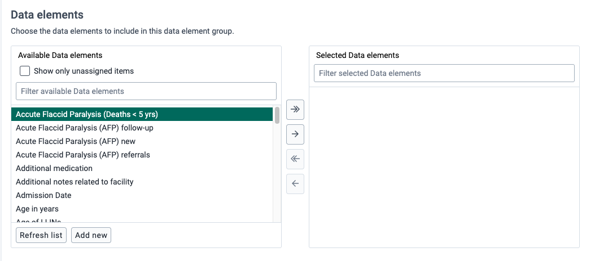

<!-- Screenshot is cropped above the arrow buttons and both list bodies -- needs a fuller capture showing the arrows, double-arrows and populated lists before this goes to PR. -->

**Available (left) panel**

* Lists every object of that type that could be assigned, whether or not it's already assigned elsewhere.
* Some object types add a **Show only unassigned items** checkbox above this list, which narrows the choice to items that do not already belong to another object of the same type. It is most useful when assigning members to groups.
* Each panel also has its own filter box above the list, so you can search the Available and Selected lists independently.

<!-- VERIFY IN APP: the checkbox was confirmed live on data element groups and predictor
     groups (31 July 2026). It is believed to appear on the other group-assignment
     transfers too (category option groups, indicator groups, organisation unit groups,
     option groups), but that has not been checked one by one -- hence "some object
     types" rather than a definitive list. Confirm and name them at the next
     screenshot pass. -->

**Moving items to Selected**

* Double-click a single item in the Available list to move it to the Selected list immediately.
* Click an item to select it, or hold **Shift** or **Ctrl** while clicking to select a range or several individual items, then click the single right-pointing arrow to move the selection across.
* Click the double right-pointing arrow to move every item in the Available list to Selected, regardless of what's selected.

**Removing items from Selected**

* Double-click a single item in the Selected list to move it back to Available.
* Click an item to select it, or hold **Shift** or **Ctrl** while clicking to select a range or several individual items, then click the single left-pointing arrow to move the selection back.
* Click the double left-pointing arrow to move every item in the Selected list back to Available.

**Add new**

Where a transfer list offers an **Add new** button, clicking it opens a drawer with a blank form for creating a new item. Complete the form and click **Save and close**. The new item then appears in the Available list, ready to be assigned. This lets you create a missing item without leaving the parent object you are editing.

---

## Manage categories { #mm_manage_category }

### About categories { #mm_about_category }

Categories are typically a concept, for example "Gender", "Age" or "Disease Status". Data elements such as "Number of cases of confirmed malaria" are often broken into smaller component parts to determine, for example, the number of confirmed malaria cases of particular age groups.

Use categories to disaggregate data elements into individual components. You can also use categories to assign metadata attributes to all data recorded in a specific data set, such as "Implementing partner" or "Funding agency."

For example, create a category called "Age" with three category options: "Under 1", "1-5" and "Over 5". Assign that category to the data element through a category combination. This creates three separate fields for the data element in the data entry forms:

* Number of confirmed malaria cases (Under 1)
* Number of confirmed malaria cases (1-5)
* Number of confirmed malaria cases (Over 5)

Without categories, you would have had to create each of the data elements listed above separately.

In the **Metadata Management** app, you manage the following category objects:

Table: Category objects in the Metadata Management app

| Object type | Available functions |
| --- | --- |
| Category option | Create, edit, clone, share, merge, delete, show details and translate |
| Category | Create, edit, clone, share, delete, show details and translate |
| Category combination | Create, edit, clone, share, delete, show details and translate |
| Category option combination | Edit and show details |
| Category option group | Create, edit, clone, share, delete, show details and translate |
| Category option group set | Create, edit, clone, share, delete, show details and translate |

### Workflow { #mm_workflow_category }

1. Create all category options.
2. Create categories composed of the multiple category options you have created.
3. Create category combinations composed of either one or multiple categories.
4. Create data elements and assign them to a category combination.

### Create or edit a category option { #mm_create_category_option }

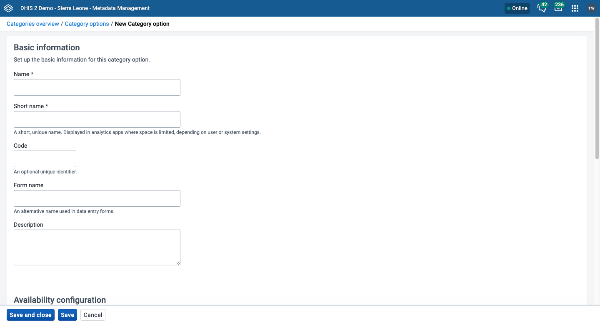

When possible, reuse category options. For instance, there might be two categories which share a particular category option (for example "< 1 year of age"). When creating the categories, this category option can be reused. This is important if particular category options (or category option combinations) need to be analysed together.

1. Open the **Metadata Management** app and click **Category** > **Category option**.
2. Click the **+ New** button to add a new category option, or click the options menu next to an existing one and select **Edit**.
3. Fill in **Name**, **Short name**, **Code**, **Form name**, **Description**, **Start date** and **End date** — see [Common metadata object fields](#mm_common_metadata_fields). Only **Name** is required.
4. Select organisation units and assign them.

   > **Tip**
   >
   > You can automatically select all organisation units that belong to an organisation unit level or organisation unit group, for example "Chiefdom" or "Urban". Select an **Organisation unit level** or **Organisation unit group** and click **Select**.

5. Click **Save**.

### Create or edit a category { #mm_create_category }

When you have created all category options for a particular category, you can create that category.

1. Open the **Metadata Management** app and click **Category** > **Category**.
2. Click the **+ New** button.
3. Fill in **Name**, **Short name**, **Code** and **Description** — see [Common metadata object fields](#mm_common_metadata_fields).
4. Select a **Data dimension type** — **Disaggregation** for a category used to break data elements into components, or **Attribute** to let the category be used to assign a combination of categories to data recorded through a data set.
5. (Optional) Select **Data dimension** to make the category available as a dimension in analytics apps.
6. Select category options and assign them.
7. Click **Save**.

### Create or edit a category combination { #mm_create_category_combination }

Category combinations let you combine multiple categories into a related set.

You can disaggregate the data element "Number of new HIV infections" into the following categories:

 - HIV Service: "Other", "PMTCT", "TB"
 - Gender: "Male", "Female"

In this example, there are two levels of disaggregation that consist of two separate data element categories. Each data element category consists of several data element category options.

In DHIS2, different data elements are disaggregated according to a common set of categories. By combining these different categories into a category combination and assigning these combinations to data elements, you can apply the appropriate disaggregation levels quickly to a large number of data elements.

1. Open the **Metadata Management** app and click **Category** > **Category combination**.
2. Click the **+ New** button.
3. Fill in **Name** and **Code** — see [Common metadata object fields](#mm_common_metadata_fields).
4. Select a **Data dimension type** — **Disaggregation** or **Attribute**.
5. (Optional) Select **Skip category total in reports**.
6. Select categories and assign them.
7. Click **Save**.

### Create or edit a category option group { #mm_create_category_option_group }

You can group and classify category options by using category option groups. The main purpose of the category option group set is to add more dimensionality to your captured data for analysis in for example the **Pivot table** or **Data Visualizer** apps.

Consider a system where data is collected by "projects", and projects are modelled as category options. The system must be able to analyse data based on which donor supports the project. In this case, create a category option group set called "Donor". Each donor can be created as a category option group, where each category option / project is put in the appropriate group. In the data analysis applications, the "Donor" group set appears as a data dimension and each donor appears as a dimension item, ready to be included in reports.

Category option groups allow you to classify category options into groups that work together.

1. Open the **Metadata Management** app and click **Category** > **Category option group**.
2. Click the **+ New** button.
3. Fill in **Name**, **Short name**, **Code** and **Description** — see [Common metadata object fields](#mm_common_metadata_fields).
4. Select a **Category option group usage** — **Disaggregation** or **Attribute**. This works the same way as Data dimension type; see [Common metadata object fields](#mm_common_metadata_fields).
5. Select category options and assign them.
6. Click **Save**.

### Create or edit a category option group set { #mm_create_category_option_group_set }

You can group category option groups in category option group sets. The main purpose of the category option group set is to add more dimensionality to your captured data for analysis in for example the **Pivot table** or **Data Visualizer** apps.

1. Open the **Metadata Management** app and click **Category** > **Category option group set**.
2. Click the **+ New** button.
3. Fill in the **Name** and **Description** fields — see [Common metadata object fields](#mm_common_metadata_fields).
4. Select a **Data dimension type**.
5. Select category option groups and assign them.
6. Click **Save**.

### Use category combinations for data sets { #mm_use_category_combo_for_data_set }

If you use a category combination for a data set, the category combination applies to the whole form. This requires the categories and the category combination to have the data dimension type "Attribute". Used as an attribute, a category combination serves as another dimension — similar to "Period" and "Organisation unit" — which you can use in your analysis. When a data set is linked to a category combination, those categories are displayed as drop-down boxes in the **Data entry** app, and each data value captured in the form is linked to the category options selected in those boxes.

Suppose that an NGO is providing ART services in a given facility. They
would need to report each month on the "ART monthly summary", which
would contain a number of data elements. The NGO and project could
potentially change over time. In order to attribute data to a given NGO
and project at any point in time, you need to record this information
with each data value at the time of data entry.

1.  Create two categories with the data dimension type "Attribute":
    "Implementing partner" and "Projects".

2.  Create a category combination with the data dimension type
    "Attribute": "Implementing partners and projects".

3.  Assign the categories you've created to the category combination.

4.  Create a data set called "ART monthly summary" and select the
    "Implementing partners and projects" category combination.

When you enter data in the **Data entry** app, you can select an
"Implementing partner" and a "Project". Each recorded data value is
assigned a specific combination of these categories as an attribute.
These attributes (when specified as a dimension) can be used in the
analysis applications similar to other dimensions, for example the
period and organisation unit.

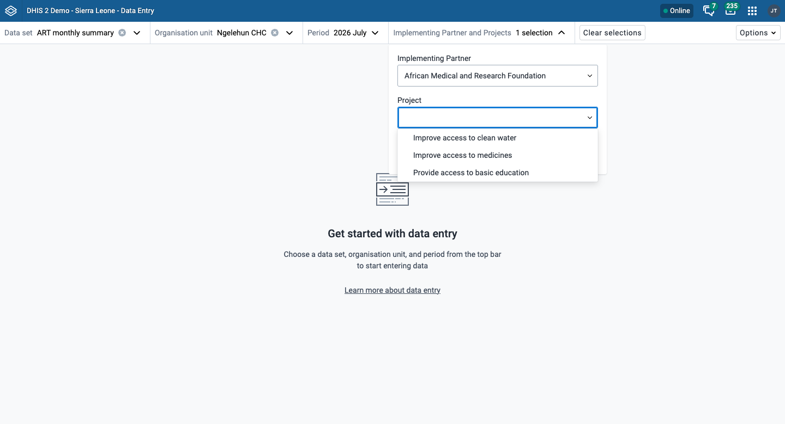

See the [Manage data sets](#mm_manage_data_set) section for more on assigning a category combination to a data set.

### Assign a code to a category option combination { #mm_assign_code_category_option_combo }

The system creates the category option combinations automatically, so they do not need to be created. You can assign a code to category option combinations. This makes data exchange between DHIS2 and external systems easier.

1. Open the **Metadata Management** app and click **Category** > **Category option combination**.
2. In the object list, click the options menu and select **Edit**.
3. In the **Code** field, type a code.
4. Click **Save**.

### Merge category options { #mm_merge_category_options }

Merging allows you to consolidate two duplicate category options into one, reassigning all references from the source object to the target object and then deleting the source.

> **Note**
>
> You must have the `F_CATEGORY_OPTION_MERGE` authority to access the merge page or see the merge button on the list view.

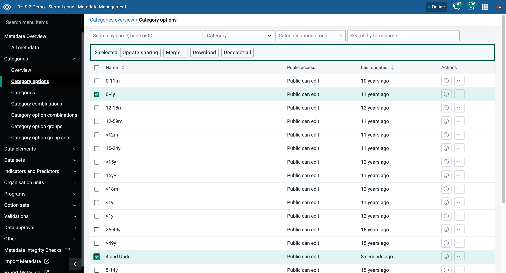

1. Open the **Metadata Management** app and click **Category** > **Category option**.
2. Navigate to **Category options** > **Merge Category options** (or go directly to `#/categoryOptions/merge`).
3. Search for and select the **source** category option (the one to be removed).
4. Search for and select the **target** category option (the one to keep).
5. Review the summary of changes.
6. Click **Confirm merge**.

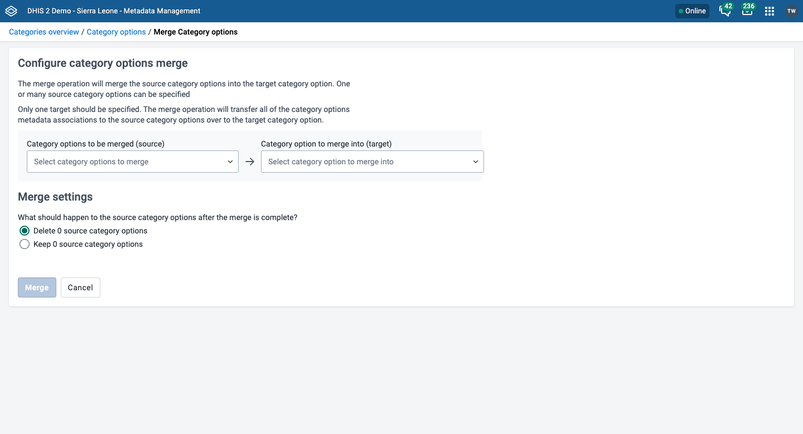

> **Warning**
>
> Merging is irreversible. The source category option will be permanently deleted and all references will be updated to point to the target.

For Show details, Sharing settings, Translate, Delete and Clone, see [Common actions](#mm_common_actions). All category objects support these except **Category option combination**, which only supports Edit and Show details — it's generated automatically by the system rather than created directly. Category options are one of only three object types in this chapter that support merging; see [Merge category options](#mm_merge_category_options) above.

---

## Manage data elements { #mm_manage_data_element }

### About data elements { #mm_about_data_element }

Data elements are the base of DHIS2. Data elements define what is actually recorded in the system, for example number of immunisations or number of cases of malaria.

Data elements such as "Number of cases of confirmed malaria" are often broken into smaller component parts to determine, for example, the number of confirmed malaria cases of particular age groups.

In the **Metadata Management** app, you manage the following data element objects:

Table: Data element objects in the Metadata Management app

| Object type | Available functions |
| --- | --- |
| Data element | Create, edit, clone, share, delete, show details and translate |
| Data element group | Create, edit, clone, share, delete, show details and translate |
| Data element group set | Create, edit, clone, share, delete, show details and translate |

### Workflow { #mm_workflow_data_element }

1. Create all category options.
2. Create categories composed of the multiple category options you have created.
3. Create category combinations composed of either one or multiple categories.
4. Create data elements and assign them to a category combination.

### Create or edit a data element { #mm_create_data_element }

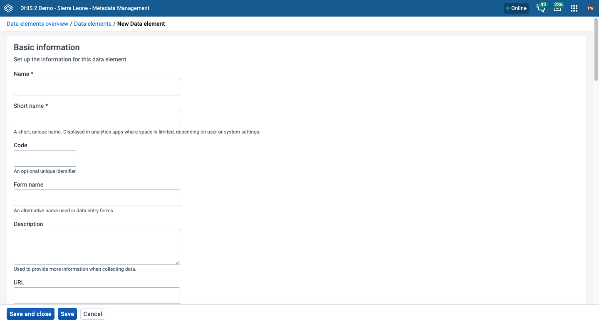

1. Open the **Metadata Management** app and click **Data elements** > **Data element**.
2. Click the **+ New** button to add a new data element, or click the options menu next to an existing one and select **Edit**.
3. In the **Name** field, define the precise name of the data element. Each data element must have a unique name.
4. In the **Short name** field, define a short name for the data element. Typically, the short name is an abbreviation of the full data element name. This attribute is often used in reports where space is limited.
5. (Optional) In the **Code** field, assign a code.
6. (Optional) In the **Color** field, assign a color which will be used for this data element in data capture apps.
7. (Optional) In the **Icon** field, assign an icon which will be used for this data element in data capture apps.
8. In the **Description** field, type a description of the data element. Be as precise as possible and include complete information about how the data element is measured and what its purpose is.
9. (Optional) In the **Field mask** field, type a template that provides hints for correct formatting of the data element.

   > **Note**
   >
   > Field masks are currently implemented in the DHIS2 Android Capture app; not in the Capture and Tracker Capture web apps.

   The following special characters can be used in the mask:

   | Character | Match |
   | --- | --- |
   | \d | digit |
   | \x | lower case letter |
   | \X | capital letter |
   | \w | any alphanumeric character |

   For example, the pattern `\d\d\d-\d\d\d-\d\d\d` would show a hyphen for every third digit.

10. In the **Form name** field, type an alternative name of the data element. This name can be used in either section or automatic data entry forms.
11. In the **Domain type** field, select whether the data element is an aggregate or tracker type of data element.
12. In the **Value type** field, select the type of data that the data element will record.

    Table: Value types

    | Value type | Description |
    | --- | --- |
    | Text | Textual value. The maximum number of allowed characters per value is 50,000. |
    | Long text | Textual value. Renders as a text area with no length constraint in forms. |
    | Letter | A single letter. |
    | Phone number | Phone number. |
    | Email | Email address. |
    | Yes/No | Boolean values rendered as drop-down lists in data entry. |
    | Yes only | Boolean values rendered as check boxes in data entry. |
    | Date | Dates rendered as calendar widget in data entry. |
    | Date & time | Combination of the **Date** and **Time** value types. |
    | Time | Time rendered as hours and minutes in HH:MM format. |
    | Number | Any real numeric value with a single decimal point. |
    | Unit interval | Any real number greater than or equal to 0 and less than or equal to 1. |
    | Percentage | Whole numbers inclusive between 0 and 100. |
    | Integer | Any whole number (positive and negative), including zero. |
    | Positive integer | Any whole number greater than (but not including) zero. |
    | Negative integer | Any whole number less than (but not including) zero. |
    | Positive or zero integer | Any whole number greater than or equal to zero. |
    | Username | DHIS2 user. Renders as a dialog for searching for and selecting a user. |
    | Coordinate | A point coordinate specified as longitude and latitude in decimal degrees. All coordinates should be specified in the format `[-19.23, 56.42]`. |
    | Organisation unit | Organisation units rendered as a hierarchy tree widget. If the user has assigned "search organisation units", these will be displayed instead of the assigned organisation units.|
    | Reference | Stores a reference (UID) to another DHIS2 object, allowing a data value to link to a specific record elsewhere in the system. |
    | Age | Dates rendered as calendar widget OR by entering number of years, months and/or days which calculates the date value based on current date. |
    | URL | Enables manual entry of a URL. |
    | File | A file resource where you can store external files, for example documents and photos. |
    | Image | A file resource where you can store photos. Unlike **File**, the **Image** type can display the uploaded image directly in forms. |
    | GeoJSON | Stores geographic geometry data in GeoJSON format, for example boundary polygons or catchment areas for organisation units. |

13. In the **Aggregation type** field, select the default aggregation operation that will be used for the data element.

    Table: Aggregation operators

    Every aggregation type answers two separate questions: how the shorter periods
    inside the reporting period combine, and how child organisation units combine
    into their parent. Read the names as *"what happens over time (what happens over
    organisation units)"* — where the organisation unit half is not stated, it is Sum.

    | Aggregation operator | Over periods | Over the organisation unit hierarchy |
    | --- | --- | --- |
    | Sum | Sum | Sum |
    | Average | Average | Average |
    | Average (sum in org unit hierarchy) | Average | Sum |
    | Count | Count of values | Sum |
    | Min | Minimum | Minimum |
    | Max | Maximum | Maximum |
    | Min (sum in org unit hierarchy) | Minimum | Sum |
    | Max (sum in org unit hierarchy) | Maximum | Sum |
    | First value | Earliest value in the period | Sum |
    | First value (average in org unit hierarchy) | Earliest value in the period | Average |
    | Last value | Most recent value in the period | Sum |
    | Last value (average in org unit hierarchy) | Most recent value in the period | Average |
    | Last value in period | Most recent value, counting only periods inside the requested period | Sum |
    | Last value in period (average in org unit hierarchy) | Most recent value, counting only periods inside the requested period | Average |
    | Standard deviation | Standard deviation (population-based) | Standard deviation |
    | Variance | Variance (population-based) | Variance |
    | None | No aggregation | No aggregation |

    Two further entries are not aggregation behaviours at all:

    * **Default** — defer to the aggregation type implied by the data element's value type.
    * **Custom** — the aggregation is supplied elsewhere rather than by one of the operators above.

    > **Tip**
    >
    > The two-axis split is what makes **Sum** and **Average (sum in org unit hierarchy)**
    > give different district totals from the same facility data, and it is why **Last value**
    > at district level gives you the sum of each facility's latest value rather than any one
    > facility's. If a total looks wrong, work out which axis you actually meant.

    > **Note**
    >
    > Choose **Last value** for data that is a running total or a snapshot rather than a
    > count of events — stock on hand, staff in post, population. Summing snapshots across
    > periods double-counts them.

    <!-- VERIFY IN APP (13 Aug 2026): the two-axis behaviour in columns 2 and 3 comes from the
         AggregationType enum in dhis2-core and is not in doubt. The operator *labels* in
         column 1 are the legacy chapter's wording for the common ones and the enum's own
         naming for the six org-unit-hierarchy variants (Min/Max sum in org unit hierarchy,
         First/Last average in org unit hierarchy, Last value in period x2), which were not
         read off the app's dropdown -- so the exact wording may differ. Confirm at the next
         screenshot pass.

         The enum also contains LAST_LAST_ORG_UNIT and FIRST_FIRST_ORG_UNIT, which take a
         "first/last" along the organisation unit axis. That axis has no inherent order the
         way periods do, so what DHIS2 actually does there has NOT been established. Those
         two are deliberately omitted rather than guessed. Establish the behaviour from the
         analytics SQL or a live test before adding rows for them. -->

14. In the **Store zero data values** field, select if you want to save zero values, or if the system should ignore them.

    By default, DHIS2 does not store zero values. If you have a data element where a zero value is meaningful, for example if you want to track the number of vaccine doses administered and zero is a valid entry, select this option.

15. (Optional) In the **Category combination** field, define which category combination the data element belongs to. This is the disaggregation applied to the data element.

16. (Optional) Assign the data element to one or more **Data element groups**.

17. Click **Save**.

### Create or edit a data element group { #mm_create_data_element_group }

Data element groups allow you to group related data elements for reporting and analysis purposes.

1. Open the **Metadata Management** app and click **Data elements** > **Data element group**.
2. Click the **+ New** button.
3. Fill in the **Name** and (optionally) **Short name** and **Code** fields — see [Common metadata object fields](#mm_common_metadata_fields).
4. Select data elements and assign them.
5. Click **Save**.

### Create or edit a data element group set { #mm_create_data_element_group_set }

Data element group sets allow you to classify multiple data element groups.

1. Open the **Metadata Management** app and click **Data elements** > **Data element group set**.
2. Click the **+ New** button.
3. Fill in the **Name** and **Description** fields — see [Common metadata object fields](#mm_common_metadata_fields).
4. If you want to use the data element group set in analytics, select **Data dimension**.
5. Select data element groups and assign them.
6. Click **Save**.

For Show details, Sharing settings, Translate, Delete and Clone, see [Common actions](#mm_common_actions).

---

## Manage data sets and data entry forms { #mm_manage_data_set }

### About data sets and data entry forms { #mm_about_dataset_dataform }

All data entry in DHIS2 is organised in data sets. A data set is a collection of data elements grouped together for data entry and data export between instances of DHIS2. To use a data set to collect data for a specific organisation unit, you must assign the organisation unit to the data set. Once you have assigned the data set to an organisation unit, that data set is available in the **Data entry** app. Only the organisation units you have assigned the data set to can use the data set for data entry.

A category combination can link to both data elements and data sets. If you use a category combination for a data set, the category combination is applicable for the whole form. This means that you can use categories to capture information which is common to an entire form, for example the name of a project or grant. When a data set is linked to a category combination, those categories are displayed as drop-down boxes in the **Data entry** app.

You create and edit data sets in the **Metadata Management** app. Here you define, for example, which data elements you want to include in the data set and the data collection frequency.

You enter data in the **Data entry** app. The **Data entry** app uses data entry forms to display the data sets. There are three types of data entry forms:

Table: Data entry form types

| Data entry form type | Description |
| --- | --- |
| Default form | Once you have assigned a data set to an organisation unit, a default form is created automatically. A default form consists of a list of the data elements belonging to the data set together with a column for inputting the values. If your data set contains data elements with a non-default category combination, additional columns are automatically created in the default form. |
| Section form | If the default form doesn't meet your needs, you can modify it to create a section form. Section forms give you more flexibility when using tabular forms. In a section form you can, for example, create multiple tables with subheadings and disable (grey out) cells in a table. |
| Custom form | If the form you want to design is too complex for default or section forms, you can create a custom form. A custom form takes more time to create than a section form, but you have full control over the design. You can, for example, mimic an existing paper aggregation form with a custom form. |

> **Note**
>
> If a data set has both a section form and a custom form, the system displays the custom form during data entry. Users who enter data cannot select which form they want to use. In web-based data entry the order of display preference is:
>
> 1. Custom form (if it exists)
> 2. Section form (if it exists)
> 3. Default form
>
> Mobile devices do not support custom forms. In mobile-based data entry the order of display preference is:
>
> 1. Section form (if it exists)
> 2. Default form

In the **Metadata Management** app, you manage the following data set objects:

Table: Data set objects in the Metadata Management app

| Object type | Available functions |
| --- | --- |
| Data set | Create, assign to organisation units, edit, share, delete, show details and translate; edit compulsory data elements; add data sets to, and remove them from, multiple organisation units at once |
| Section form | Create, edit and manage grey fields |
| Section | Change display order, delete and translate |
| Custom form | Create, edit and script |

### Workflow { #mm_workflow_data_set }

You need to have data elements and categories before creating data sets and data entry forms.

1. Create a data set.
2. Assign the data set to organisation units. A default form is created automatically.
3. Create a section form or a custom form.

   Now you can register data in the **Data entry** app.

### Create or edit a data set { #mm_create_data_set }

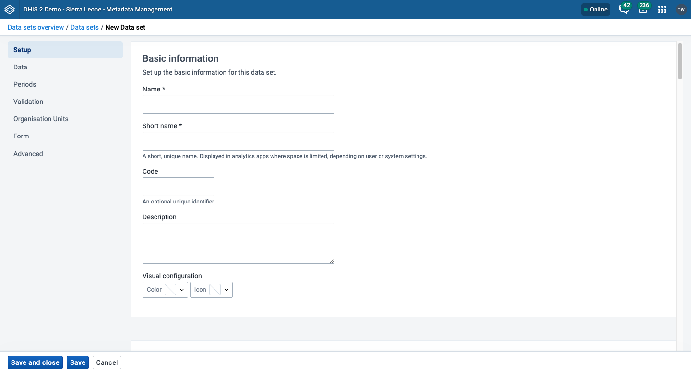

1. Open the **Metadata Management** app and click **Data set** > **Data set**.
2. Click the **+ New** button.
3. In the **Name** field, type the precise name of the data set.
4. In the **Short name** field, type a short name for the data set. The short name must be unique.
5. (Optional) In the **Code** field, assign a code.
6. In the **Description** field, type a description of the data set.
7. In the **Expiry days** field, enter the number of days after which you cannot edit the data set. If set to 0, users can always edit.
8. In the **Open future periods for data entry** field, enter the number of future periods to make available for data entry.
9. In the **Days after period to qualify for timely submission** field, enter the number of days after the end of a period by which a report is considered submitted on time.
10. (Optional) In the **Category combination** field, select the category combination to use for the data set.
11. In the **Period type** field, select the frequency of data entry for this data set.
12. If applicable, in the **Notification recipients** field, select who should receive data set completion notifications.
13. (Optional) Select **Complete allowed only if validation passes** to prevent completing the data entry form if there are active validation rule violations.
14. (Optional) Select **Complete allowed if compulsory fields are filled** to prevent completing the data entry form until all data elements marked as compulsory (see [Edit compulsory data elements in a data set](#mm_edit_compulsory_dataelement_in_dataset)) have a value.
15. (Optional) Select **Skip offline** if you want the data set to only be available when the user is connected to the Internet.
16. In the data elements section, search for and add the data elements to include in the data set.
17. Assign the data set to one or more organisation units.
18. Click **Save**.

### Create or edit a data set notification { #mm_create_data_set_notification }

Data set notifications are sent to notify users when a data set is completed or is about to expire. You can configure notification templates that determine what is sent, when, and to whom.

#### What to send?

In the **Metadata Management** app you can configure a message template and a subject for the notification. The template can include variables such as `{organisationUnit.name}` and `{period}` to personalise messages.

#### When to send?

You can configure notifications to send:
* **On completion** — when the data set is marked as complete.
* **Scheduled days** — a set number of days relative to the reporting period end date.

#### Who to send?

Notifications can be sent to:
* **User groups**
* **Organisation unit contacts**

### Override data elements' category combinations in a data set { #mm_override_dataelement_catcombo_in_dataset }

You can override the category combination of a data element within a specific data set. This allows you to use a different disaggregation for the same data element in different data sets.

1. Open the **Metadata Management** app and click **Data set** > **Data set**.
2. In the object list, click the options menu and select **Edit**.
3. In the **Data elements** section, click the override option next to the data element whose category combination you want to override.
4. Select the replacement category combination.
5. Click **Save**.

### Edit compulsory data elements in a data set { #mm_edit_compulsory_dataelement_in_dataset }

You can mark specific data elements in a data set as compulsory. Users will be prompted before completing the data set if compulsory data elements have not been filled in.

1. Open the **Metadata Management** app and click **Data set** > **Data set**.
2. In the object list, click the options menu and select **Edit compulsory data elements**.
3. Select the data elements you want to mark as compulsory.
4. Click **Save**.

### Manage section forms { #mm_manage_section_form }

#### Create a section form

1. Open the **Metadata Management** app and click **Data set** > **Data set**.
2. In the object list, open the relevant data set and navigate to **Manage sections**.
3. Click **+ New** to add a new section.
4. Enter a **Name** for the section, and (optionally) a **Code** and a **Description**.
5. Select the data elements to include in this section.
6. Click **Save section**.

<!-- FOLLOW-UP (found while fixing DHIS2-20720, not part of that ticket): the real
     section form also has an indicators transfer, row/column totals checkboxes,
     an automatic-grouping checkbox, a display mode choice, and before/after
     content text areas. None of these are documented in this section yet --
     worth a fuller pass. -->

> **Note**
>
> Repeat for each section in the form. Each data element should belong to only one section.

#### Edit a section form

1. Open the **Metadata Management** app and click **Data set** > **Data set**.
2. In the object list, open the relevant data set and navigate to **Manage sections**.
3. Click the section you want to edit.
4. Modify the section as needed.
5. Click **Save section**.

#### Manage grey fields in a section form

You can disable (grey out) specific cells in a section form to prevent data entry for particular combinations.

1. Open the **Metadata Management** app and click **Data set** > **Data set**.
2. In the object list, open the relevant data set and navigate to **Manage sections**.
3. Click **Manage grey fields** for the section you want to modify.
4. Click on the cells you want to grey out.
5. Click **Save**.

#### Change section display order in a section form

1. Open the **Metadata Management** app and click **Data set** > **Data set**.
2. In the object list, open the relevant data set and navigate to **Manage sections**.
3. Drag and drop the sections to reorder them.

#### Delete a section in a section form

1. Open the **Metadata Management** app and click **Data set** > **Data set**.
2. In the object list, open the relevant data set and navigate to **Manage sections**.
3. Click the delete icon next to the section you want to remove.

#### Translate a section in a section form

1. Open the **Metadata Management** app and click **Data set** > **Data set**.
2. In the object list, open the relevant data set and navigate to **Manage sections**.
3. Click the translate icon next to the section.
4. Select a locale and enter a translated name.
5. Click **Save**.

### Manage custom forms { #mm_manage_customform }

> **Note**
>
> Custom forms use an HTML editor. While powerful, custom forms require more time to create and maintain than section forms.

#### Create a custom form

1. Open the **Metadata Management** app and click **Data set** > **Data set**.
2. In the object list, open the relevant data set and navigate to **Manage form**.
3. Select **Custom** as the form type.
4. Use the HTML editor to design your custom form. Data elements can be inserted as input fields.
5. Click **Save**.

#### Scripting in custom forms

Custom forms support JavaScript for advanced interactions and validation. Scripts are embedded directly in the HTML of the custom form.

##### Events

| Event | Description |
| --- | --- |
| `dhis2.de.event.dataValueSaved` | Fired after a data value has been saved successfully. |
| `dhis2.de.event.completed` | Fired when a data set is completed. |
| `dhis2.de.event.unCompleted` | Fired when a data set completion is reverted. |
| `dhis2.de.event.validationSuccess` | Fired when validation completes without errors. |
| `dhis2.de.event.validationError` | Fired when validation returns errors. |

##### Functions

| Function | Description |
| --- | --- |
| `dhis2.de.getDataValue( dataElementId, optionComboId )` | Retrieves the current value for a data element + option combo. |
| `dhis2.de.setDataValue( dataElementId, optionComboId, value )` | Sets the value for a data element + option combo. |

For Show details, Sharing settings, Translate and Delete, see [Common actions](#mm_common_actions) — note the extra risk called out there for deleting a data set specifically. Data sets do not support Clone.

---

## Manage indicators { #mm_manage_indicator }

### About indicators { #mm_about_indicator }

An indicator is a formula that can consist of multiple data elements, constants, organisation unit group counts and mathematical operators. Indicators typically consist of a numerator and denominator. You use indicators to calculate coverage rates, incidence and other values that are a result of data element values that have been entered into the system. Calculated totals do not have a denominator.

> **Note**
>
> You never enter indicator values directly in DHIS2 — they are always calculated.

An indicator formula can consist of mathematical operators (for example plus and minus), functions, and the following elements:

Table: Indicator elements

| Indicator element | Type | Description |
| --- | --- | --- |
| Constant | Component | Constants are numerical values that remain the same for all indicator calculations. This is useful in order to have a single place to change values that might change over time. Constants are applied AFTER data element values have been aggregated. |
| Data elements | Component | Data elements are substituted by the data value captured for the data element. |
| Days | Operator | "Days" is a special operator that always provides the number of days for a given indicator calculation. For example, if you want to calculate the "Percentage of time vaccine refrigerator was non-functional", you could define the numerator as: (`Days` – "Number of days vaccine refrigerator was available") / `Days`. |
| Organisation unit counts | Component | You can use organisation unit groups in formulas. They will be replaced by the number of organisation units in the group. During aggregation, the organisation units in the group will be intersected with the part of the organisation unit hierarchy being requested. |
| Reporting rates | Component | You can use a data set's reporting rate, actual reports or expected reports as a component in a formula, for example to calculate an indicator that is itself weighted by how completely a data set was reported. |
| Indicators | Component | An indicator formula can reference another indicator, so you can build a composite indicator on top of ones you have already defined instead of repeating their formulas. This is the only expression type in DHIS2 that can reference indicators — predictors and validation rules cannot. |
| Programs | Component | Click **Programs** and select a program to view all data elements, attributes and indicators related to a specific program. |

You can use the following functions in an indicator formula:

<!-- This table was rebuilt on 13 Aug 2026 against the authoritative source: the
     INDICATOR_EXPRESSION_ITEMS map in dhis2-core
     (dhis-2/dhis-services/dhis-service-core/.../expression/DefaultExpressionService.java)
     plus COMMON_EXPRESSION_ITEMS in ParserUtils.java, cross-checked against the
     published master user guide. The previous version of this table listed
     abs, acos, asin, atan, avg, ceil, cos, count, exp, floor, max, min,
     percentileCont, round, sin, sqrt, stddev, sum, tan, variance and zcScore --
     none of which exist as indicator functions in DHIS2. Several real functions
     (containsItems, is, null, [periodInYear], .aggregationType, .maxDate,
     .minDate, .periodOffset, .yearToDate) were missing. Do not reintroduce the
     old list. -->

Table: Indicator functions

| Indicator function | Arguments | Description |
| --- | --- | --- |
| contains | (expr, sub1, ...) | Searches an expression for one or more substrings. Returns true if the expression contains all the substrings. For example, the following are all true: `contains("abcd", "abcd")`, `contains("abcd", "b")` and `contains("abcd", "ab", "bc")`. Comparisons are case-sensitive. |
| containsItems | (expr, item1, ...) | Searches an expression for one or more items. The expression is made up of comma-separated elements. `containsItems` returns true if every item exactly matches an element in the expression. For example, `containsItems("abcd", "abcd")` and `containsItems("ab,cd", "ab", "cd")` are true, but `containsItems("abcd", "b")` and `containsItems("abcd", "ab", "bc")` are false. Comparisons are case-sensitive. Use it with multi-valued data elements to check whether an item is one of the recorded values. |
| if | (boolean-expr, true-expr, false-expr) | Evaluates the boolean expression. If it is true, returns the true expression value; if false, returns the false expression value. The arguments must follow the rules for any indicator expression. |
| is | (expr1 in expression [, expression ...]) | Returns true if expr1 is equal to any of the expressions that follow, otherwise false. |
| isNull | (element) | Returns true if the element value is missing (null), otherwise false. |
| isNotNull | (element) | Returns true if the element value is not missing (not null), otherwise false. |
| firstNonNull | (element [, element ...]) | Returns the value of the first element that is not missing (not null). Can be given any number of arguments. An argument may also be a numeric or string literal, which is returned if all the preceding items have missing values. |
| greatest | (expression [, expression ...]) | Returns the greatest (highest) value of the expressions given. Can be given any number of arguments. |
| least | (expression [, expression ...]) | Returns the least (lowest) value of the expressions given. Can be given any number of arguments. |
| log | (expression [, base]) | Returns the natural logarithm (base e) of the numeric expression. If an integer is given as a second argument, returns the logarithm using that base. |
| log10 | (expression) | Returns the common logarithm (base 10) of the numeric expression. |
| null | | Returns no result. For example, `if( #{FH8ab5Rog83} < 0, null, 1 )` returns nothing if the data element value is less than 0, otherwise 1. |
| removeZeros | (expression) | Returns nothing if the expression value is 0, otherwise returns the expression value. |
| subExpression | (expression) | Evaluates part of an expression before aggregating. See [Indicator SubExpressions](#mm_indicator_subexpressions). |
| `[periodInYear]` | | The number of this period within the year (1, 2, 3, ...). See [Indicator Year-to-date](#mm_indicator_yeartodate). |
| `[yearlyPeriodCount]` | | The count of periods of this type within the year. See [Indicator Year-to-date](#mm_indicator_yeartodate). |
| .aggregationType | (aggregation type) | Overrides the default data element aggregation type for aggregate data (not for program data). |
| .maxDate | (yyyy-mm-dd) | For a data element (not program data), value from periods ending on or before a maximum date. |
| .minDate | (yyyy-mm-dd) | For a data element (not program data), value from periods starting on or after a minimum date. |
| .periodOffset | (integer constant) | Placed after a data value or expression, returns the value from a period offset relative to the reported period. It can be nested. Note that this shifts data only for aggregate data, not tracker or event data. See the examples below. |
| .yearToDate() | | Sums the values of all periods from the start of the year through the current period. A weekly period counts as part of a year if it has four or more days in that year. See [Indicator Year-to-date](#mm_indicator_yeartodate). |

Alongside these functions you can use:

* the mathematical operators `+`, `-`, `*`, `/`, `%` (modulus) and `^` (power), with parentheses to group parts of an expression
* the comparison operators `==`, `!=`, `>`, `<`, `>=` and `<=`
* the logical operators `&&` (or the keyword `and`), `||` (or `or`) and `!` (or `not`)

> **Note**
>
> DHIS2 parses indicator, predictor, validation rule and program indicator expressions
> with one shared grammar, but each expression type only *accepts* its own subset of
> functions. A function that belongs to another type is recognised by the parser and
> then rejected when the expression is validated, which is why an expression can look
> plausible and still fail to save. In particular:
>
> * Aggregation functions — `avg()`, `sum()`, `count()`, `min()`, `max()`, `median()`, `stddev()`, `stddevPop()`, `stddevSamp()` and `percentileCont()` — and the distribution functions `normDistCum()` and `normDistDen()` belong to **predictor** generator expressions. See [Create or edit a predictor](#mm_create_predictor). To evaluate part of an indicator expression before it is aggregated, use `subExpression` instead, and to override how an item aggregates use `.aggregationType()`.
> * The `orgUnit.ancestor()`, `orgUnit.dataSet()`, `orgUnit.group()` and `orgUnit.program()` functions belong to **validation rule** and **predictor** expressions.
> * The `d2:` functions and `V{...}` variables belong to **program indicator** expressions and **program rules**. See [Reference information: Functions, variables and operators to use in program indicator expressions and filters](#program_indicator_functions_variables_operators).
> * `subExpression()`, `.aggregationType()`, `.periodOffset()`, `.yearToDate()`, `[periodInYear]`, `[yearlyPeriodCount]` and indicator references are accepted **only** in indicator expressions.

<!-- The per-type subsets above are taken from the four registration maps in dhis2-core
     (BASE / VALIDATION_RULE / PREDICTOR / INDICATOR _EXPRESSION_ITEMS in
     DefaultExpressionService, plus ExpressionMapBuilder for program indicators),
     verified identical on branch 2.43 and master on 13 Aug 2026. The shared grammar is
     the separate org.hisp.dhis.parser:dhis-antlr-expression-parser artifact, pinned at
     1.0.39 in both branches -- so "in the grammar" is not the same as "allowed here",
     which is the trap this note exists to head off. -->

The aggregation types you can pass to `.aggregationType()` are:

Table: Aggregation types for .aggregationType()

| Aggregation type | Description |
| --- | --- |
| SUM | Sum of values in both the period and organisation unit dimensions |
| AVERAGE | Average value in both the period and organisation unit dimensions |
| AVERAGE_SUM_ORG_UNIT | Average value in the period dimension, sum in the organisation unit hierarchy |
| COUNT | Count of values |
| STDDEV | Standard deviation (population-based) of values |
| VARIANCE | Variance (population-based) of values |
| MIN | Minimum value |
| MAX | Maximum value |
| MIN_SUM_ORG_UNIT | Minimum value in the period dimension, sum in the organisation unit hierarchy |
| MAX_SUM_ORG_UNIT | Maximum value in the period dimension, sum in the organisation unit hierarchy |
| FIRST | First value, sum in the organisation unit hierarchy |
| FIRST_AVERAGE_ORG_UNIT | First value, average in the organisation unit hierarchy |
| FIRST_FIRST_ORG_UNIT | First value in both the period and organisation unit dimensions |
| LAST | Last value, sum in the organisation unit hierarchy |
| LAST_AVERAGE_ORG_UNIT | Last value, average in the organisation unit hierarchy |
| LAST_LAST_ORG_UNIT | Last value in both the period and organisation unit dimensions |
| LAST_IN_PERIOD | Last value in the period, sum in the organisation unit hierarchy |
| LAST_IN_PERIOD_AVERAGE_ORG_UNIT | Last value in the period, average in the organisation unit hierarchy |
| NONE | No aggregation is performed in any dimension |

Examples of `.aggregationType`, `.maxDate`, `.minDate` and `.periodOffset`:

Table: Indicator expression examples

| Indicator expression | Means |
| --- | --- |
| `#{FH8ab5Rog83}.aggregationType(COUNT)` | Count of values |
| `#{FH8ab5Rog83}.aggregationType(LAST) - #{FH8ab5Rog83}.aggregationType(FIRST)` | The difference between the first and last values |
| `#{FH8ab5Rog83}.maxDate(2021-6-30)` | Values until 30-Jun-2021 |
| `#{FH8ab5Rog83}.minDate(2021-1-1)` | Values from 1-Jan-2021 onwards |
| `#{FH8ab5Rog83}.minDate(2021-1-1).maxDate(2021-6-30)` | Values between 1-Jan-2021 and 30-Jun-2021 |
| `#{FH8ab5Rog83}.periodOffset(-1)` | Value from the period before |
| `#{FH8ab5Rog83}.periodOffset(1)` | Value from the period after |
| `#{FH8ab5Rog83} - 2 * D{IpHINAT79UW.uf3svrmp8Oj}.periodOffset(-1)` | Data element FH8ab5Rog83 from the reported period, minus twice program data element IpHINAT79UW.uf3svrmp8Oj from the period before |
| `( #{FH8ab5Rog83} - #{QOlfIKgNJ3D2} ).periodOffset(-2)` | Data element FH8ab5Rog83 from two periods before, minus data element QOlfIKgNJ3D2 from two periods before |
| `( #{FH8ab5Rog83}.periodOffset(-1) + #{FH8ab5Rog83} ).periodOffset(-1)` | Data element FH8ab5Rog83 from two periods before plus its value from one period before — note that the functions are nested |
| `N{IndicatorID}.periodOffset(-1)` | Indicator value from the period before (applies to the aggregate data in the indicator) |

### Indicator SubExpressions { #mm_indicator_subexpressions }

Normally an indicator aggregates a data element's values first and then evaluates the expression. For example, in the expression:

```
if( #{nYahlae7fe6} > 10, 1, 0 )
```

if the data element has aggregation type SUM, DHIS2 sums all of that data element's values for the relevant period and then tests whether the *sum* is greater than 10.

Sometimes you need the opposite: evaluate each value *before* it is aggregated. For example, to show how many facilities in a district recorded a value greater than 10, wrap the test in `subExpression`:

```
subExpression( if( #{nYahlae7fe6} > 10, 1, 0 ) )
```

Each individual data value is tested, returning 1 or 0, and (assuming the data element aggregates with SUM) the 1s and 0s are then summed — giving a count of how many values exceeded 10.

Notes on SubExpressions:

-   The 1s and 0s are only summed if the data element's aggregation type is SUM. If it has a different aggregation type and you want them summed, override the aggregation type inside the sub-expression:

```
subExpression( if( #{nYahlae7fe6} > 10, 1, 0 ) ).aggregationType(SUM)
```

-   A sub-expression may reference only one data element, but it may reference it more than once. For example:

```
subExpression( if( #{nYahlae7fe6} > 10 && #{nYahlae7fe6} <= 20, 1, 0 ) )
```

-   A sub-expression may reference a data element with a category option combination and/or an attribute option combination, but it must be exactly the same reference each time. For example:
```
subExpression( if( #{nYahlae7fe6.beec4Dewah8} > 10 && #{nYahlae7fe6.beec4Dewah8} <= 20, 1, 0 ) )
```

-   To evaluate an expression before aggregation that involves program data, or more than one data element, category option combination or attribute option combination, use a [predictor](#mm_manage_predictor) instead and store the result as a separate data element. You can then reference that predicted data element in an indicator or directly in analytics.

### Indicator Year-to-date { #mm_indicator_yeartodate }

Indicators can compute year-to-date values using three expression elements: `.yearToDate()`, `[periodInYear]` and `[yearlyPeriodCount]`.

| Element | Returns |
| --- | --- |
| `.yearToDate()` | The sum of the values of every period from the start of the year through the current period |
| `[periodInYear]` | The number of the current period within the year — 1, 2, 3, and so on. For monthly data in May this is 5; for quarterly data in Q3 it is 3 |
| `[yearlyPeriodCount]` | The total count of periods of this type in the year — 12 for monthly, 4 for quarterly, 52 or 53 for weekly. This does not change as the year progresses |

In the examples below, `#{a}` can be `#{dataElementUID}` or any valid indicator expression item that returns a data value, such as `#{dataElementUID.catOptionComboUid}`, `I{programIndicatorUID}` or `N{indicatorUID}`.

Table: Year-to-date indicator expressions

| Indicator expression | Means |
| --- | --- |
| `#{a}` | Current period value |
| `#{a}.yearToDate()` | Sum of values year to date. If the period is March, this gives Jan + Feb + Mar |
| `#{a}.yearToDate() / [periodInYear]` | Average year-to-date value. If the period is March, this gives (Jan + Feb + Mar) / 3 |
| `#{a} - #{a}.yearToDate() / [periodInYear]` | The difference between the current period and the year-to-date average |
| `#{b} * [periodInYear] / [yearlyPeriodCount]` | If `#{b}` is an annual target — say the number of people who should be vaccinated this year — this gives the number who should have been vaccinated by the current period. In February, for monthly data, that is `#{b} * 2 / 12` |

> **Note**
>
> A weekly period is treated as part of a year if four or more of its days fall in that year.

#### Notes on missing data

If data is missing for some of the periods in a year-to-date calculation, the result is based only on the periods that have data. Bear this in mind when interpreting year-to-date figures — a low value may mean under-performance or may simply mean a period has not been reported yet.

### Workflow { #mm_workflow_indicator }

1. Create indicator types (unless using the default types).
2. Create indicators.
3. (Optional) Create indicator groups.
4. (Optional) Create indicator group sets.

### Create or edit an indicator type { #mm_create_indicator_type }

Indicator types define the factor by which indicator values are multiplied when shown in reports or exported to analytics. A "Per cent" indicator type, for example, multiplies values by 100.

1. Open the **Metadata Management** app and click **Indicator** > **Indicator type**.
2. Click the **+ New** button.
3. In the **Name** field, type the name of the indicator type, for example "Per cent".
4. In the **Factor** field, type the factor. For a percentage indicator, type 100.
5. If the indicator type does not have a denominator (for example a count), select **Number (without denominator)**.
6. Click **Save**.

### Create or edit an indicator { #mm_create_indicator }

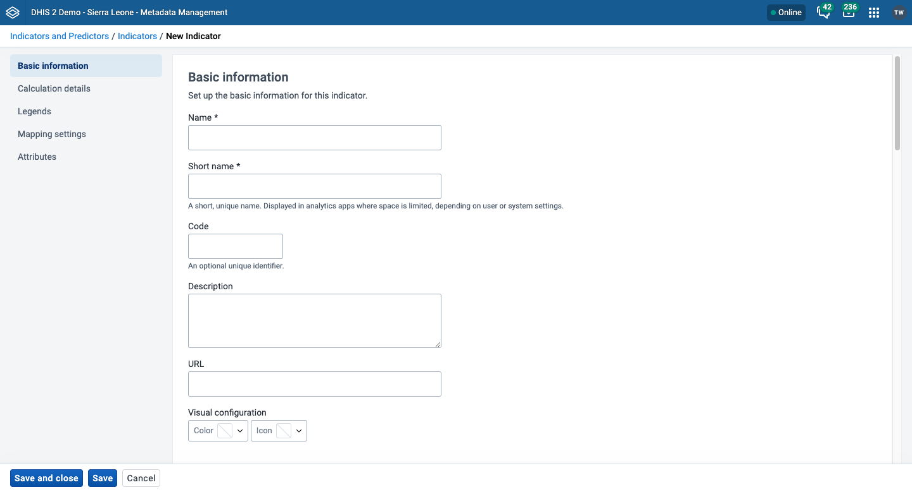

1. Open the **Metadata Management** app and click **Indicator** > **Indicator**.
2. Click the **+ New** button, or click the options menu next to an existing indicator and select **Edit**.
3. In the **Name** field, type the full name of the indicator, for example "Incidence of confirmed malaria cases per 1000 population".
4. In the **Short name** field, type an abbreviated name, for example "Inc conf. malaria per 1000 pop". The short name must be unique.

   <!-- VERIFY IN APP: the legacy Maintenance chapter claimed a 25-character limit here.
        The API schema (BaseNameableObject.getShortName, @PropertyRange max = 50) and the
        CSV import reference both give 50 characters for indicator short names, so the
        25-character figure looks like stale legacy text. The specific number has been
        removed rather than replaced with an unverified one -- confirm what the
        Metadata Management app's form actually enforces at the next screenshot pass,
        then state it here. -->
5. (Optional) In the **Code** field, assign a code.
6. (Optional) In the **Color** field, assign a color to represent the indicator.
7. (Optional) In the **Icon** field, assign an icon to illustrate the meaning of the indicator.
8. In the **Description** field, type a brief, informative description of the indicator and how it is calculated.
9. If you want to apply an annualization factor during calculation, select **Annualized**. This scales the numerator up to a yearly equivalent so it can be compared against a denominator that is already annual, such as a population figure. Typically the numerator is multiplied by 365 divided by the number of days in the reporting period.
10. Select the number of **Decimals in data output**.
11. Select an **Indicator type**. This field determines a factor that is automatically applied during calculation.
12. (Optional) Assign one or multiple **Legends**.
13. (Optional) In the **URL** field, enter a link — for example to an indicator registry — where a full metadata description of the indicator is available.
14. (Optional) Enter a **Category option combination for aggregate data export** and an **Attribute option combination for aggregate data export**. These settings are used when mapping aggregated data exported to another server.
15. (Optional) Enter values for any custom attributes.
16. Click **Edit numerator**:
    1. Type a clear description of the numerator.
    2. Define the numerator by double-clicking components in the right-hand field. Add mathematical operators by double-clicking the icons below the formula field.
    3. Click **Done**.
17. Click **Edit denominator**:
    1. Type a clear description of the denominator.
    2. Define the denominator using the formula editor as above.
    3. Click **Done**.
18. (Optional) Assign the indicator to any compulsory indicator group sets.
19. Click **Save**.

### Create or edit an indicator group { #mm_create_indicator_group }

1. Open the **Metadata Management** app and click **Indicator** > **Indicator group**.
2. Click the **+ New** button.
3. Type a **Name**.
4. Select indicators and assign them.
5. Click **Save**.

### Create or edit an indicator group set { #mm_create_indicator_group_set }

1. Open the **Metadata Management** app and click **Indicator** > **Indicator group set**.
2. Click the **+ New** button.
3. Fill in the **Name**, **Short name** and **Description** fields — see [Common metadata object fields](#mm_common_metadata_fields).
4. If you want to use the indicator group set as a dimension in analytics, select **Data dimension**.
5. Select **Compulsory** if every indicator should be required to belong to a group in this group set.
6. Select indicator groups and assign them.
7. Click **Save**.

### Merge indicators { #mm_merge_indicators }

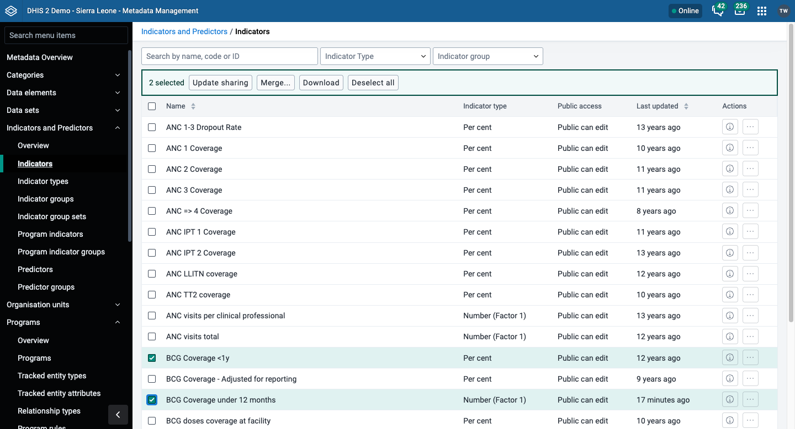

Merging consolidates two duplicate indicators into one, reassigning all references from the source to the target and then deleting the source.

> **Note**
>
> You must have the `F_INDICATOR_MERGE` authority to access this page.

1. Open the **Metadata Management** app and navigate to **Indicators** > **Merge Indicators** (or go directly to `#/indicators/merge`).
2. Search for and select the **source** indicator (the one to be removed).
3. Search for and select the **target** indicator (the one to keep).
4. Review the summary of changes.
5. Click **Confirm merge**.

> **Warning**
>
> Merging is irreversible. The source indicator will be permanently deleted.

### Merge indicator types { #mm_merge_indicator_types }

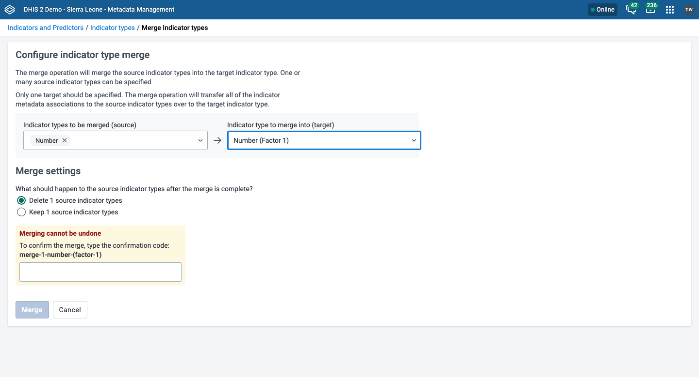

> **Note**
>
> You must have the `F_INDICATOR_TYPE_MERGE` authority to access this page.

1. Open the **Metadata Management** app and navigate to **Indicator types** > **Merge Indicator types** (or go directly to `#/indicatorTypes/merge`).
2. Search for and select the **source** indicator type (the one to be removed).
3. Search for and select the **target** indicator type (the one to keep).
4. Review the summary of changes.
5. Click **Confirm merge**.

For Show details, Sharing settings, Translate, Delete and Clone, see [Common actions](#mm_common_actions). Indicators and indicator types are the other two object types in this chapter that support merging; see [Merge indicators](#mm_merge_indicators) and [Merge indicator types](#mm_merge_indicator_types) above.

---

## Manage organisation units { #mm_manage_organisation_unit }

In this section you will learn how to:

* Create a new organisation unit and build up the organisation unit hierarchy
* Create organisation unit groups, group sets, and assign organisation units to them
* Modify the organisation unit hierarchy

### About organisation units { #mm_about_organisation_unit }

The organisation unit hierarchy defines the organisation structure of DHIS2, for example how health facilities, administrative areas and other geographical areas are arranged with respect to each other. It is the *where* dimension of DHIS2, similar to how periods represent the *when* dimension.

The organisation unit hierarchy is built up by parent-child relations. In DHIS2, each of these nodes is an organisation unit. A country might for example have eight provinces, and each province might have a number of districts as children. Normally, the lowest levels consist of facilities where data is collected. Data collecting facilities can also be located at higher levels, for example national or provincial hospitals. You can therefore create skewed organisation trees in DHIS2.

* You can only have one organisation hierarchy at a time.
* You can have any number of levels in a hierarchy. Typically national organisation hierarchies in public health have four to six levels.
* You can create additional classifications by using organisation unit groups and organisation unit group sets, for example to create parallel administrative boundaries to the health care sector.
* It is recommended to use organisation unit groups to create a non-geographical hierarchy.
* An organisation unit can only be a member of a single organisation unit group within an organisation unit group set.
* An organisation unit group can be part of multiple organisation unit group sets.
* The organisation unit hierarchy is the main vehicle for data aggregation on the geographical dimension.
* When you close an organisation unit, you cannot register or edit events to this organisation unit in the **Event Capture** and **Tracker Capture** apps.

> **Important**
>
> You can change the organisation unit hierarchy after you have created it, even if organisation units are collecting data. However, DHIS2 always uses the latest hierarchy for data aggregation. So if you change the hierarchy, you lose the temporal representation of the hierarchy over time.
>
> For example: District A is sub-divided into District B and District C. Facilities that belonged to District A are reassigned to District B and C. Any historical data entered before the split is still registered as belonging to District B and C, not to the obsolete District A.

In the **Metadata Management** app, you manage the following organisation unit objects:

Table: Organisation unit objects in the Metadata Management app

| Object type | Available functions |
| --- | --- |
| Organisation unit | Create, edit, clone, delete, show details and translate |
| Organisation unit group | Create, edit, clone, share, delete, show details and translate |
| Organisation unit group set | Create, edit, clone, share, delete, show details and translate |
| Organisation unit level | Assign names |

### Workflow { #mm_workflow_organisation_unit }

1. Create organisation units (representing the hierarchy nodes, top to bottom).
2. Create organisation unit groups.
3. Create organisation unit group sets.
4. Assign organisation units to groups.
5. Assign organisation unit groups to group sets.

### Create or edit an organisation unit { #mm_create_organisation_unit }

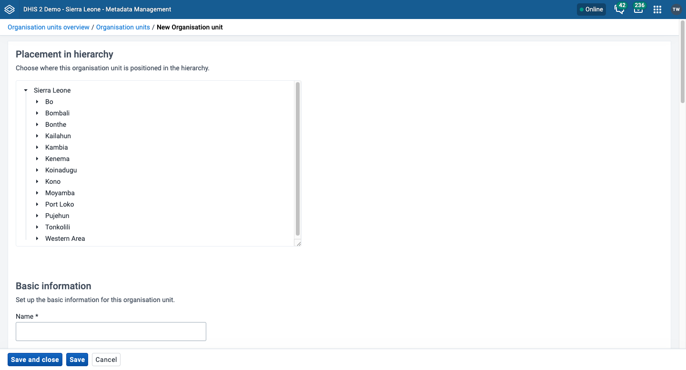

1. Open the **Metadata Management** app and click **Organisation unit** > **Organisation unit**. 
   On the left side of the screen, a tree displays the existing organisation unit hierarchy. Click on an organisation unit in the tree to select it; it will be highlighted. When you add a new organisation unit, it is created as a child of the currently selected organisation unit.

2. Click the **+ New** button.
3. Fill in **Name**, **Short name**, **Code**, **Description**, **Comment** and contact details (**Contact person**, **Address**, **Phone number**, **Email**) — see [Common metadata object fields](#mm_common_metadata_fields). Only **Name** is required.
4. Set an **Opening date** — the date from which the organisation unit is active. Organisation units with a future opening date will not appear in analytics or data entry unless explicitly requested.
5. (Optional) Set a **Closed date** — the date from which the organisation unit is no longer active. See [Close an organisation unit](#mm_close_organisation_unit).
6. (Optional) Add **Geometry** — point or polygon coordinates for the organisation unit.
7. Click **Save**.

### Create or edit an organisation unit group { #mm_create_organisation_unit_group }

Organisation unit groups allow you to classify organisation units for analysis and reporting.

1. Open the **Metadata Management** app and click **Organisation unit** > **Organisation unit group**.
2. Click the **+ New** button.
3. Fill in the **Name**, **Short name** and (optionally) **Code** and **Description** fields — see [Common metadata object fields](#mm_common_metadata_fields).
4. (Optional) Assign a **Symbol** for use on maps.
5. (Optional) Select a **Color**, used to display the group on maps and in group set reporting.
6. Select organisation units and assign them.
7. Click **Save**.

### Create or edit an organisation unit group set { #mm_create_organisation_unit_group_set }

Organisation unit group sets allow you to classify multiple organisation unit groups into a single dimension, for example "Type of facility" (comprising groups such as "Hospital", "Health centre" and "Community health post").

1. Open the **Metadata Management** app and click **Organisation unit** > **Organisation unit group set**.
2. Click the **+ New** button.
3. Fill in the **Name** and **Description** fields — see [Common metadata object fields](#mm_common_metadata_fields).
4. Select **Compulsory** if you want every organisation unit to be required to be a member of a group in this group set.
5. Select **Data dimension** to make this group set available as a dimension in analytics.
6. Select organisation unit groups and assign them.
7. Click **Save**.

### Assign names to organisation unit levels { #mm_name_organisation_unit_level }

When you have created your organisation unit hierarchy, you can assign names to each level. For example, in a national hierarchy, Level 1 might be named "National", Level 2 "Province", Level 3 "District" and Level 4 "Facility".

1. Open the **Metadata Management** app and click **Organisation unit** > **Organisation unit level**.
2. For each level in the list, type a name.
3. Click **Save**.

### Move organisation units within a hierarchy { #mm_move_organisation_unit }

You can move organisation units within the hierarchy by changing the parent of a selected organisation unit. This is done on a dedicated page rather than in the main organisation unit list.

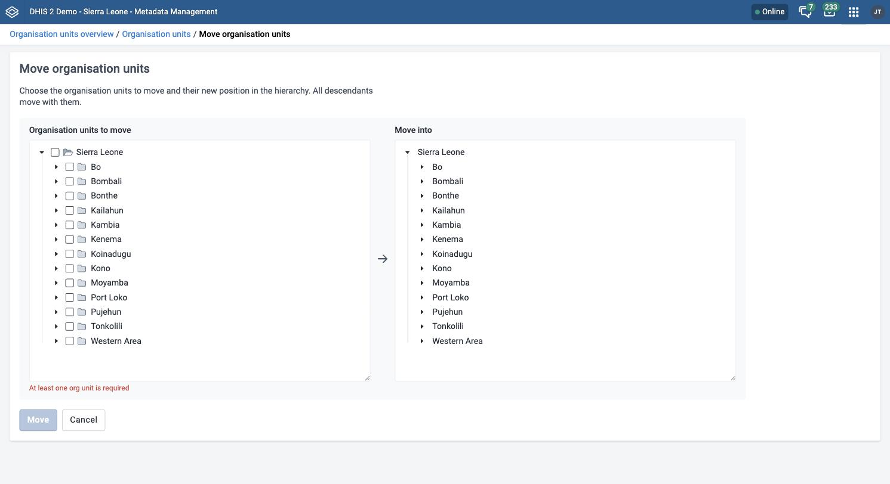

1. Open the **Metadata Management** app and click **Organisation unit** > **Hierarchy operations** in the left-hand sidebar.
2. In the left-hand **Organisation units to move** tree, select the organisation unit or units you want to move. Hold **Shift** or **Ctrl** to select more than one.

   > **Note**
   >
   > If a selected organisation unit has children, all of them move with it to the new parent.

3. In the right-hand **Move into** tree, select the organisation unit you want to move the selection to.
4. Click **Move x organisation units**, where *x* is the number of organisation units you selected.

   Your changes are reflected in the hierarchy tree immediately.

### Close an organisation unit { #mm_close_organisation_unit }

When you close an organisation unit, you cannot register or edit events for this organisation unit in the **Event Capture** and **Tracker Capture** apps.

1. Open the **Metadata Management** app and click **Organisation unit** > **Organisation unit**.
2. In the object list, click the options menu and select **Edit**.
3. Enter a **Closed date**.
4. Click **Save**.

For Show details, Sharing settings, Translate, Delete and Clone, see [Common actions](#mm_common_actions). Organisation unit levels are the exception — they only support assigning names and translating (via the Translate icon directly, since they have no options menu); they don't support Show details, Sharing settings, Delete or Clone.

<!-- The Delete note/warning previously here ("You can only delete a data element..."; "Any data set you delete...") was a copy-paste error -- it described data elements and data sets, not organisation units, and has been removed. The data-set-specific version of that warning now lives at Common actions > Delete. Organisation units may have their own genuine delete caveat (e.g. what happens to data recorded against a deleted org unit) but that hasn't been verified against the live app, so nothing has been invented here to replace it. -->

---

<!-- ============================================================
     All 18 sections are ported. The three former stubs at the end of the
     file were resolved on 13 Aug 2026: Manage push reports now states that
     push analytics does not exist in this app, Manage external map layers
     points at the planned move to the Maps app, and Edit multiple object
     groups at once has been rewritten as "Manage group membership" -- the
     Metadata group editor screen is not being replaced.
     ============================================================ -->

## Manage validation rules { #mm_manage_validation_rule }

### About validation rules { #mm_about_validation_rule }

A validation rule is based on an expression. The expression defines a
relationship between data element values. The expression forms a
condition with certain logical criteria.

The expression consists of:

  - A left side

  - A right side

  - An operator

A validation rule asserting that the total number of vaccines given to
infants is less than or equal to the total number of infants.

The left and right sides must return numeric values.

In the **Metadata Management** app, you manage the following validation rule
objects:

Table: Validation rule objects in the Metadata Management app

| Object type | Available functions |
|---|---|
| Validation rule | Create, edit, clone, delete, show details and translate |
| Validation rule group | Create, edit, clone, share, delete, show details and translate |
| Validation notification | Create, edit, clone, delete, show details and translate |

#### About sliding windows { #mm_sliding_windows }

You can use sliding windows to group data *across multiple periods* as
opposed to selecting data for *a single period*. Sliding windows have a
size, that is to say, the number of days to cover, a starting point and
an end point. The example below shows disease surveillance data:

  - The data in the orange section, selects data based on the current
    period. There is a threshold, which is calculated once for each week
    or period, and this is shown in the "Result" section.

  - The data in the blue section is the sliding window. It selects data
    from the past 7 days. The "Result" shows the total number of
    confirmed cases of a disease.

  - The validation rule makes sure users are notified when the total
    number of cases breaks the threshold for the period.

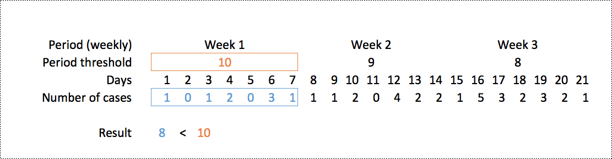

Table: Different behaviour of validation rules

| With sliding windows | Without sliding windows |
|---|---|
| Used only for event data. | Used for event data and aggregate data. |
| Data selection is based on a fixed number of days (periodType). | Data selection is always based on a period. |
| The position of the sliding window is always *relative to* the period being compared. | Data is always selected for the *same period* as the period being compared. |

See also: How to use sliding windows when you're [Creating or editing a
validation
rule](#mm_create_validation_rule).

#### About validation rule groups

A validation rule group allows you to group related validation rules.
When you run a [validation rule analysis](#validation_rule_analysis),
you can choose to run all of the validation rules in your system, or
just the validation rules in one group.

#### About validation notifications { #mm_validation_notifications }

You can configure a validation rule analysis to automatically send
notifications about validation errors to selected user groups. These
messages are called *validation notifications*. They are sent via the
internal DHIS2 messaging system.

You can send validation rule notifications as individual messages or as
message summaries. This is useful, for example, if you want to send
individual messages for high-priority disease outbreaks, and summaries
for low-priority routine data validation errors.

#### About validation rule functions

<!-- DHIS2-20720 flagged that contains, containsItems, removeZeros, orgUnit.ancestor,
     orgUnit.dataSet, orgUnit.group and orgUnit.program don't appear to be
     selectable from the in-app expression-builder function list, and asked for
     clarification on whether they're deprecated. These are documented, supported
     validation rule functions (confirmed against the DHIS2 developer manual), so
     they're kept in the table below -- but whether the app's function picker
     surfaces all of them is worth confirming at the next screenshot run-through. -->

You can use the following functions in a validation rule left side
or right side:

Table: Validation Rule functions

| Validation Rule Function | Arguments | Description |
|---|---|---|
| contains | (expr, sub1, ...) | Searches an expression for one or more substrings. Returns true if the expression contains all the substrings. For example, the following are all true: contains("abcd", "abcd"); contains("abcd", "b"); and contains("abcd", "ab", "bc"). Comparisons are case-sensitive. |
| containsItems | (expr, item1, ...) | Searches an expression for one or more items. The expression is made up of comma-separated elements. containsItems returns true if every item exactly matches an element in the expression. For example, containsItems("abcd", "abcd") and containsItems("ab,cd", "ab", "cd") are true, but containsItems("abcd", "b") and containsItems("abcd", "ab", "bc") are false. Comparisons are case-sensitive. containsItems can be used for multi-valued data elements to see if an item is contained in the data element values. |
| if | (boolean-expr, true-expr, false-expr) | Evaluates the boolean expression and if true returns the true expression value, if false returns the false expression value. The arguments must follow the rules for any indicator expression. |
| is | (expr1 in expression [, expression ...]) | Returns true if expr1 is equal to any of the following expressions, otherwise false. |
| isNull | (element) | Returns true if the element value is missing (null), otherwise false. |
| isNotNull | (element) | Returns true if the element value is not missing (not null), otherwise false. |
| firstNonNull | (element [, element ...]) | Returns the value of the first element that is not missing (not null). Can be provided any number of arguments. Any argument may also be a numeric or string literal, which will be returned if all the previous objects have missing values. |
| greatest | (expression [, expression ...]) | Returns the greatest (highest) value of the expressions given. Can be provided any number of arguments. |
| least | (expression [, expression ...]) | Returns the least (lowest) value of the expressions given. Can be provided any number of arguments. |
| log | (expression [, base ]) | Returns the natural logarithm (base e) of the numeric expression. If an integer is given as a second argument, returns the logarithm using that base. |
| log10 | (expression) | Returns the common logarithm (base 10) of the numeric expression. |
| null | | Returns no result. For example, _if( #{FH8ab5Rog83}<0, null, 1 )_ returns nothing if the data element value is less than 0, otherwise 1. |
| orgUnit.ancestor | (orgUnitUid [, orgUnitUid ...]) | Returns true if the organisation unit is a descendant of any of the (1 or more) organisation units, otherwise false. |
| orgUnit.dataSet | (dataSetUid [, dataSetUid ...]) | Returns true if the organisation unit is assigned to any of the (1 or more) data sets, otherwise false. |
| orgUnit.group | (ouGroupUid [, ouGroupUid ...]) | Returns true if the organisation unit is a member of any of the (1 or more) organisation unit groups, otherwise false. |
| orgUnit.program | (programUid [, programUid ...]) | Returns true if the organisation unit is assigned to any of the (1 or more) programs, otherwise false. |
| removeZeros | (expression) | Returns nothing if the expression value is 0, otherwise returns the expression value. |

### Create or edit a validation rule { #mm_create_validation_rule }

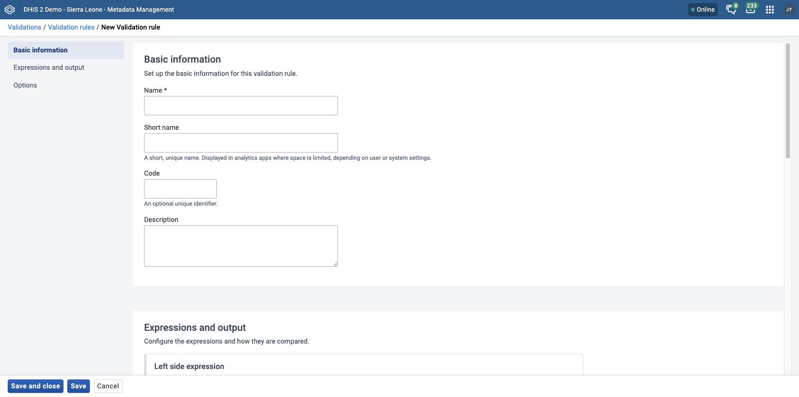

1.  Open the **Metadata Management** app and click **Validations** \>
    **Validation rules** in the left-hand sidebar.

2.  Click the **+ New** button.

3.  Type a **Name**.

    The name must be unique among the validation rules.

4.  (Optional) In the **Code** field, assign a code.

5.  (Optional) Type a **Description**.

6.  (Optional) Type an **Instruction**. This is what users will see, both
    in validation analysis and when reviewing rule violations during data
    entry, so it's recommended to always provide an instruction that
    makes it clear what action a user should take when the rule is
    triggered.

7.  Select an **Importance**: **High**, **Medium** or **Low**.

8.  Select a **Period type**.

9.  Select an **Operator**: **Compulsory pair**, **Equal to**,
    **Exclusive pair**, **Greater than**, **Greater than or equal to**
    or **Not equal to**.

    The **Compulsory pair** operator allows to require that data values
    must be entered for a form for both left and right sides of the
    expression, or for neither side. This means that you can require
    that if one field in a form is filled, then one or more other fields
    must also be filled.

    The **Exclusive pair** allows to assert that if any value exist on
    the left side then there should be no values on the right side (or
    vice versa). This means that data elements which compose the rule on
    either side should be mutually exclusive from each other, for a
    given time period / organisation unit /attribute option combo.

10. Create the left side of the expression:

    1.  Click **Left side**.

    2.  Select **Sliding window** if you want to view data relative to
        the period you are comparing. See also [About validation
        rules](#mm_about_validation_rule).

    3.  Select a **Missing value strategy**. This selection sets how the
        system evaluates a validation rule if data is missing.

        | Option | Description |
        |---|---|
        | Skip if any value is missing | The validation rule will be skipped if any of the values which compose the expression are missing. This is the default option.<br>         <br>Always select this option when you use the **Exclusive pair** or **Compulsory pair** operator. |
        | Skip if all values are missing | The validation rule will be skipped only if all of the operands which compose it are missing. |
        | Never skip | The validation rule will never be skipped in case of missing data, and all missing operands will be treated effectively as a zero. |

    4.  Type a **Description**.

    5.  Build an expression based on the available data elements,
        program objects, organisation units, counts and constants.

        In the right pane, double-click the data objects you want to
        include in the expression. Combine with the mathematical
        operators located below the left pane.

    6.  Click **Save**.

11. Create the right side of the expression:

    1.  Click **Right side**.

    2.  Select a **Missing value strategy**. This selection sets how the
        system evaluates a validation rule if data is missing.

        | Option | Description |
        |---|---|
        | Skip if any value is missing | The validation rule will be skipped if any of the values which compose the expression are missing. This is the default option.<br>         <br>Always select this option when you use the **Exclusive pair** or **Compulsory pair** operator. |
        | Skip if all values are missing | The validation rule will be skipped only if all of the operands which compose it are missing. |
        | Never skip | The validation rule will never be skipped in case of missing data, and all missing operands will be treated effectively as a zero. |

    3.  Select **Sliding window** if you want to view data relative to
        the period you are comparing. See also [About validation
        rules](#mm_about_validation_rule).

    4.  Type a **Description**.

    5.  Build an expression based on the available data elements,
        program objects, organisation units, counts and constants.

        In the right pane, double-click the data objects you want to
        include in the expression. Combine with the mathematical
        operators located below the left pane.

    6.  Click **Save**.

12. (Optional) Choose which **Organisation unit levels** this rule
    should be evaluated for. Leaving this empty will cause the
    validation rule to be evaluated at all levels.

13. (Optional) Select **Skip this rule during form validation** to stop
    this rule from being triggered during data entry.

14. Click **Save**.

### Create or edit a validation rule group { #mm_create_validation_rule_group }

1.  Open the **Metadata Management** app and click **Validations** \>
    **Validation rule groups** in the left-hand sidebar.

2.  Click the **+ New** button.

3.  Type a **Name**.

4.  (Optional) In the **Code** field, assign a code.

5.  (Optional) Type a **Description**.

6.  Double-click the **Validation rules** you want to assign to the
    group.

7.  Click **Save**.

### Create or edit a validation notification { #mm_create_validation_notification }

1.  Open the **Metadata Management** app and click **Validations** \>
    **Validation notifications** in the left-hand sidebar.

2.  Click the **+ New** button.

3.  Type a **Name**.

4.  (Optional) In the **Code** field, assign a code.

5.  Select **Validation rules**.

6.  Select **Recipient user groups**.

7.  (Optional) Select **Notify users in hierarchy only**.

    If you select this option, the system will filter the recipient
    users. (The system derives the recipient users from the recipient
    user groups.) The filter is based on which organisation unit the
    recipient user belongs to. The users linked to organisation units
    which are ancestors of the organisation unit where the violation
    took place will receive validation notifications. The system will
    ignore other users and these users won't receive validation
    notifications.

8.  Create the message template:

    1.  Create the **Subject template**.

        Double-click the parameters in the **Template variables** field
        to add them to your subject.

    2.  Create the **Message template**.

        Double-click the parameter names in the **Template variables**
        field to add them to your message.

9.  Click **Save**.

For Show details, Translate, Delete and Clone, see [Common actions](#mm_common_actions). Validation rule groups additionally support Sharing settings (also in [Common actions](#mm_common_actions)).

<!-- The object table above ("What you can do") doesn't list Sharing settings for Validation rule or Validation notification, only for Validation rule group -- kept as-is rather than assumed to be an omission, since it wasn't verified live this pass. Worth confirming at the next screenshot run-through. -->

## Manage attributes { #mm_manage_attribute }

### About attributes { #mm_about_attribute }

You can use metadata attributes to add additional information to
metadata objects. In addition to the standard attributes for each of
these objects it may be useful to store information for additional
attributes, for example the collection method for a data element.

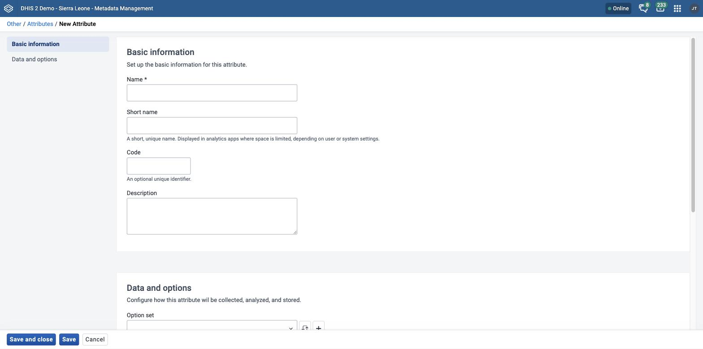

In the **Metadata Management** app, you manage the following attribute objects:

Table: Attribute objects in the Metadata Management app

| Object type | Available functions |
|---|---|
| Attribute | Create, edit, clone, delete, show details and translate |

### Create or edit an attribute

1.  Open the **Metadata Management** app and click **Other** \> **Attributes** in the left-hand sidebar.

2.  Click the **+ New** button.

3.  In the **Name** field, type the name of the attribute.

    Each attribute must have a unique name.

4.  (Optional) In the **Code** field, assign a code.

5.  Select a **Value type**.

    If the value supplied for the attribute does not match the value
    type you will get a warning.

6.  (Optional) Select an **Option set** to restrict the attribute's values to a
    predefined list.

7.  (Optional) In the **Sort order** field, type a number to control
    where this attribute appears relative to other attributes when
    editing an object's form. Attributes without a sort order are shown
    afterwards, in alphabetical order.

8.  Select the options you want, for example:

      - Select **Mandatory** if you want an object to always have the
        dynamic attribute.

      - Select **Unique** if you want the system to enforce that values
        are unique for a specific object type.

9.  Click **Save**.

    The dynamic attribute is now available for the objects you assigned
    it to.

For Show details, Translate, Delete and Clone, see [Common actions](#mm_common_actions). Attributes do not support Sharing settings.

## Manage constants { #mm_manage_constant }

### About constants { #mm_about_constant }

Constants are static values which can be made available to users for use
in data elements and indicators. Some indicators, such as "Couple year
protection rate" depend on constants which usually do not change over
time.

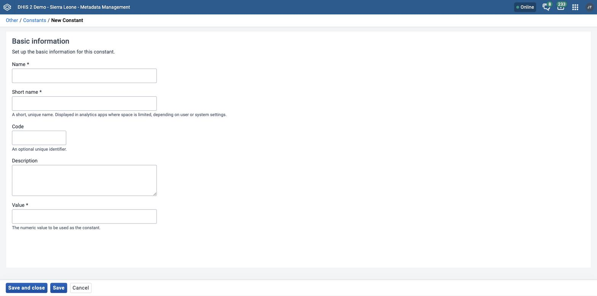

In the **Metadata Management** app, you manage the following constant objects:

Table: Constant objects in the Metadata Management app

| Object type | Available functions |
|---|---|
| Constant | Create, edit, clone, share, delete, show details and translate |

### Create or edit a constant { #mm_create_constant }

1.  Open the **Metadata Management** app and click **Other** \> **Constants** in the left-hand sidebar.

2.  Click the **+ New** button.

3.  In the **Name** field, type the name of the constant.

4.  In the **Short name** field, type an abbreviated name of
    the constant.

5.  (Optional) In the **Code** field, assign a code.

6.  In the **Description** field, type a brief, informative description
    of the constant.

7.  In the **Value** field, define the constant's value.

8.  Click **Save**.

    The constant is now available for use.

For Show details, Sharing settings, Translate, Delete and Clone, see [Common actions](#mm_common_actions).

## Manage option sets { #mm_manage_option_set }

<!-- Nav path and screenshots verified 31 July 2026 against stable-2-43-0-1. -->

### About option sets { #mm_about_option_set }

Option sets provide a pre-defined drop-down (enumerated) list for use in
DHIS2. You can define any kind of options.

An option set called "Delivery type" would have the options: "Normal",
"Breach", "Caesarian" and "Assisted".

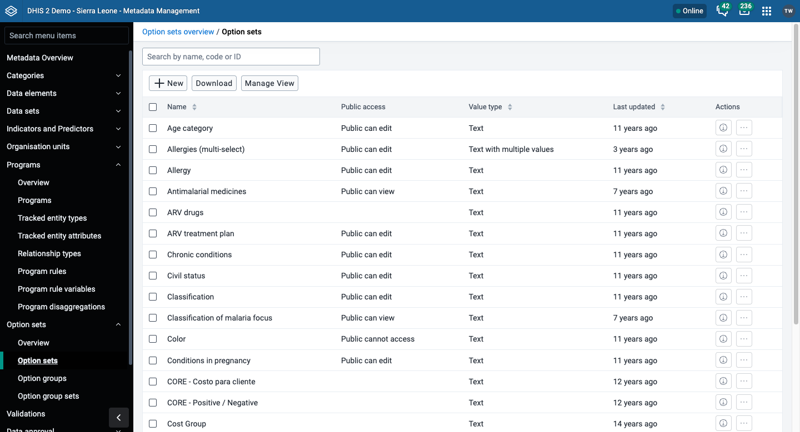

Table: Option set objects in the Metadata Management app

| Object type | Available functions |
|---|---|
| Option set | Create, edit, clone, share, delete, show details and translate |
| Option group | Create, edit, clone, share, delete, show details and translate |
| Option group set | Create, edit, clone, share, delete, show details and translate |

### Create or edit an option set { #mm_create_option_set }

> **Important**
>
> Option sets must have a code as well as a name. You can change the
> names but you can't change the codes. Both names and codes of all
> options must be unique, even across different option sets.

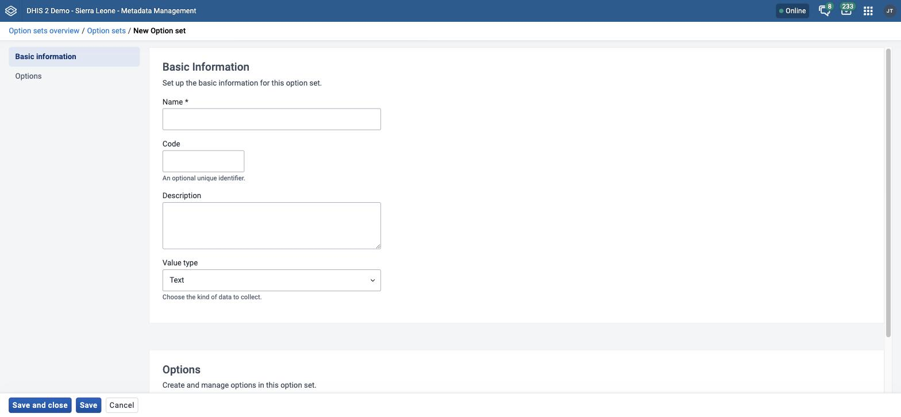

1.  Open the **Metadata Management** app and click **Option sets** \> **Option sets** in the left-hand sidebar.

2.  Click the **+ New** button.

3.  In the **Primary details** tab, fill in **Name**, **Code** and (optionally) **Description** — see [Common metadata object fields](#mm_common_metadata_fields) — select a **Value type**, then click **Save**.

4.  For each option you need, perform the following tasks:

    1.  Click the **Options** tab.

    2.  Click the **+ New** button.

    3.  Type a **Name** and a **Code**. Optionally also select a
        **Color** and an **Icon** which will be used for this option in
        the data capture apps.

    4.  Sort the options by name, code/value or manually.

    5.  Click **Save**.

### Create or edit an option group { #mm_create_option_group }

You can group and classify **options** within an **option set** by using **option groups**.
This way you can create a subset of options in an option set. The main purpose of this is to be able to filter huge option sets into smaller, related parts.

Options that are grouped can be hidden or shown together in tracker and event capture through program rules.

> **Note**
>
> You cannot change the **Option set** selected in an **Option group** once it has been created.

1. Open the **Metadata Management** app and click **Option sets** \> **Option groups** in the left-hand sidebar.
2. Click the **+ New** button.
3. Fill in **Name**, **Short name** and **Code** — see [Common metadata object fields](#mm_common_metadata_fields).
4. Select the **Option set** this group belongs to.
5. Once an **Option set** is selected, assign the **Options** you want to group.
6. Click **Save**.

### Create or edit an option group set { #mm_create_option_group_set }

**Option group sets** allow you to categorise multiple **option groups** into a set.
The main purpose of the option group set is to add more dimensionality to your captured data for analysis.

> **Note**
>
> You cannot change the **Option set** selected in an **Option group set** once it has been created.

1. Open the **Metadata Management** app and click **Option sets** \> **Option group sets** in the left-hand sidebar.
2. Click the **+ New** button.
3. Fill in **Name**, **Code** and **Description** — see [Common metadata object fields](#mm_common_metadata_fields).
4. Select the **Option set** this group set belongs to.
5. (Optional) Select **Data dimension** to make the group set available to analytics as another dimension, in addition to the standard dimensions of "Period" and "Organisation unit".
6. Select option groups and assign them. Available option groups are displayed in the left panel. Option groups that are currently members of the option group set are displayed in the right hand panel.

7. Click **Save**.

For Show details, Sharing settings, Translate, Delete and Clone, see [Common actions](#mm_common_actions).

## Manage legends { #mm_manage_legend }

<!-- Nav path and screenshot verified 31 July 2026 against stable-2-43-0-1. -->

### About legends { #mm_about_legend }

You can create, edit, clone, share, delete, show details for and translate legends,
to make the maps you set up for your users meaningful. You create the maps
themselves in the **Maps** app.

> **Note**
>
> Continuous legends must consist of legend items that end and start
> with the same value, for example: 0-50 and 50-80. Do not set legend
> items like this: 0-50 and 51-80. This will create gaps in your legend.

### Create or edit a legend { #mm_create_legend }

> **Note**
>
> It is not allowed to have gaps in a legend.
>
> It is not allowed to have overlapping legend items.

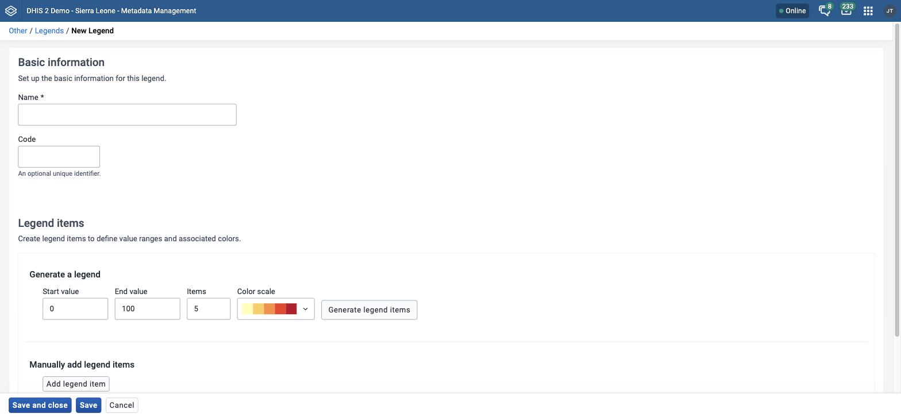

1.  Open the **Metadata Management** app and click **Other** \> **Legends** in the left-hand sidebar.

2.  Click the **+ New** button.

3.  In the **Name** field, type the legend name.

4.  (Optional) In the **Code** field, assign a code.

5.  Create the legend items you want to have in your legend:

    1.  Select **Start value** and **End value**.

    2.  Select **Number of legend items**.

    3.  Select a color scheme.

    4.  Click **Create legend items**.

    > **Tip**
    >
    > Click the options menu to edit or delete a legend item.

6.  (Optional) Add more legend items:

    1.  Click the **+ New** button.

    2.  Enter a name and select a start value, an end value and a color.

    3.  Click **OK**.

7.  (Optional) Change the color scales.

    1.  Click the color scale to view a list of color scale options,
        and select one.

    2.  To customise a color scale, click the **+ New** button. In the **Edit
        legend item** dialog, click the color scale button and hand-pick
        colors, or enter your color values.

8.  Click **Save**.

A finished legend with four items looks like this:

Table: Example legend items

| Legend item | Start value | End value |
|---|---|---|
| Low bad | 0 | 50 |
| Medium | 50 | 80 |
| High good | 80 | 100 |
| Too high | 100 | 1000 |

### Assign a legend to an indicator or data element { #mm_assign_legend }

You can assign a legend to an indicator or a data element in the
**Metadata Management** app, either when you create the object or when you edit
it. When you then select that indicator or data element in the **Maps** app, the
system automatically selects the assigned legend.

For Show details, Sharing settings, Translate, Delete and Clone, see [Common actions](#mm_common_actions).

### See also { #mm_see_also_legend }

  - [Using the GIS app](#using_gis)

## Manage predictors { #mm_manage_predictor }

<!-- Nav path verified 31 July 2026 against stable-2-43-0-1. The app's generator
     expression editor has Org unit counts and Reporting rates panels that the legacy
     text did not mention; the "Organisation unit counts are not yet supported" line
     has been removed from Create or edit a predictor accordingly (13 Aug 2026). -->

### About predictors

A predictor defines how to generate an aggregate data value from an expression
containing aggregate and/or event data. The predicted value may be based on:

- Data from the same period as the predicted value, and/or

- Data from periods previous to the predicted value

#### Data from the same period { #mm_data_from_the_same_period }

A predictor can use data from the same period as the predicted value.
For example, you can count the number of organisation units having
a non-zero value of a data element by using a predictor expression such as:

<pre><code>if( #{ji7o0ILHuU2} != 0, 1, 0 )</code></pre>

When you run this predictor at the organisation unit level where the data is
collected, it will store 1 as the predicted value if the data element has a
nonzero value for that organisation unit, otherwise 0.
(If the data element that you predict into does not store zeros, then
zeros will not be stored in the database, to save space.)
You can then sum this predicted value in analytics at a higher
organisation unit level, to count the number of organisation units
with a nonzero value that are under each organisation unit in the report.

#### Data from previous periods { #mm_data_from_previous_periods }

A predictor will use data from previous periods when you specify an aggregation
function such as sum() or avg(). For example, the following generator expression
identifies a value that is the average plus twice the standard deviation of
previous period data:

<pre><code>avg( #{ji7o0ILHuU2} ) + 2 * stddev( #{ji7o0ILHuU2} )</code></pre>

#### Data from the same and previous periods { #mm_data_from_the_same_and_previous_periods }

A predictor expression can access data both from same period as the
prediction and previous periods by accessing data both within an
aggregate function (for previous periods), and outside any aggregate function
(for the same period). For example, an expression like the following can be
used to take a balance of something from the previous period (#{KOh02hHko7C}),
add to that the net change in this period (#{ji7o0ILHuU2}),
resulting in the balance for this period:

<pre><code>sum( #{KOh02hHko7C} ) + #{ji7o0ILHuU2}</code></pre>

The first data value is inside an aggregate expression (sum) to indicate that
it is sampling previous period data (even if there is only one previous period),
while the second data value is not in an aggregate function to indicate that it
is referencing data from the same period.

If you want to, a predictor's output data element can be referenced in the same
predictor's expression. For instance, the expression in this example could
be used to predict the balance in a period, and then combine that value with
the change in the next period to compute the balance for the next period.
When a predictor is run across multiple periods, the periods are processed in
chronological order, and the result from an earlier period may be used
as input for a later period.

#### Predictor organisation unit levels { #mm_predictor_organisation_unit_levels }

You need to select one or more organisation unit levels for a predictor's output.
All values generated by the predictor are stored for organisation units at the
level(s) you select. Each item in the predictor expression is the sum of the value
stored for that organisation unit (if any) plus any values stored in organisation
units below that one (if any).

> **Note**
>
> In configuring a predictor, you must choose one or more organisation unit levels
> at which predicted data will be output. If no level is selected, no predicted
> values will be generated.

> **Warning**
>
> If you want to use the predicted values in analytics reporting, or to make
> other predictions, *do not select more than one organisation unit level*.
> When you select more than one level, predictions at the higher level(s) will
> also include any data used in lower level(s) predictions. If the predictions
> from multiple levels are subsequently used in analytics, or in the expressions
> of other predictors, this can result in double counting because the predicted
> values for a higher level include the predicted values from a lower level.

You may select multiple organisation unit levels if you use the predicted
values only in validation rules. For example in disease surveillance, you
could have a validation rule alert if an actual value is higher than the
range of expected values for that period based on previous period data.
To do this, you could create a predictor to compute the average plus twice the
standard deviation of previous period data. You could use a validation
rule to compare this highest expected value with the actual value.
You could run the predictor and validation rule at multiple levels
to detect different outbreak scenarios. In one scenario, there might be
a significant increase in one facility that exceeds its expected range, but
the district containing that facility might not exceed its expected range
because the district values are combined with many other facilities.
Yet in another scenario, there may be a moderate increase in several
facilities that does not exceed the expected range for each facility (because
the standard deviation for each facility may be high), but it does exceed
the expected range for the district (because the
standard deviation for the district as a whole may be lower).

If you want to generate predictions at multiple levels, you could also
use different predictors at different levels. For example, you might want to
be alerted if the value at one level exceeds the average plus twice the standard
deviation, but alerted at another level if it exceeds the average plus 1.8 times
the standard deviation. If you want, you could configure the different predictors
to have the same output data element. If you use the same output data element,
this will still work with validation rules at different organisation unit levels,
but you also must be careful not to use the results in analytics or in other
predictor calculations to avoid double counting.

In the **Metadata Management** app, you manage the following predictor objects:

Table: Predictor objects in the Metadata Management app

| Object type | Available functions |
|---|---|
| Predictor | Create, edit, clone, delete, show details and translate |

### Sampling previous periods

Predictors can generate data values for periods that are in the past,
present, or future. These values are based on data from the predicted period,
and/or sampled data from periods previous to the predicted period.

If you need data only from the same period in which the prediction is made,
then you don't need to read this section. This section describes how to
sample data from periods previous to the predicted period.

Three fields control which previous periods are sampled — **Sequential sample count**,
**Annual sample count** and **Sequential skip count** — and a fourth, the
**Sample skip test**, can exclude individual periods that would otherwise be included.
They appear together in the predictor's Logic section:

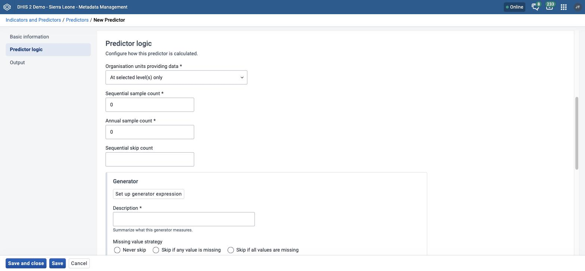

The rest of this section explains what each one does. In the diagrams, the period being
predicted is marked in one colour and the periods that get sampled in another.

#### Sequential sample count { #mm_sequential_sample_count }

A predictor's *Sequential sample count* gives the number of immediate
previous periods to sample. For example, if a predictor's period type is
*Weekly* and the *Sequential sample count* is 4, this means to sample
four previous weeks immediately preceding the predicted value week. So the
predicted value for week 9 would use samples from weeks 5, 6, 7, and 8:

{.center width=50% }

If a predictor's period type is *Monthly* and the *Sequential sample
count* is 4, this means to sample four previous months immediately
preceding the predicted value month. So the predicted value for May
would use samples from January, February, March and April:

{.center width=51% }

The *Sequential sample count* can be greater than the number of periods
in a year. For example, if you want to sample the 24 months immediately
preceding the predicted value month, set the *Sequential sample count*
to 24:

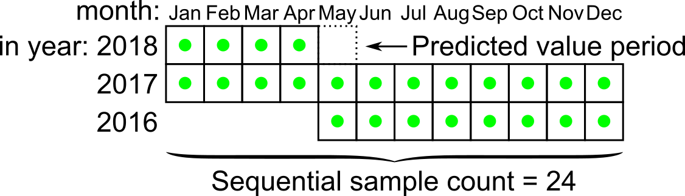{.center width=57% }

#### Sequential skip count { #mm_sequential_skip_count }

A predictor's *Sequential skip count* tells how many periods should be
skipped immediately previous to the predicted value period, within the
*Sequential sample count*. This could be used, for instance, in outbreak
detection to skip one or more immediately preceding samples that might
in fact contain values from the beginning of an outbreak that you are
trying to detect.

For example, if the *Sequential sample count* is 4, but the *Sequential
skip count* is 2, then the two samples immediately preceding the
predicted period will be skipped, resulting in only two periods being
sampled:

{.center width=50% }

#### Annual sample count { #mm_annual_sample_count }

A predictor's *Annual sample count* gives the number of previous years for
which samples should be collected at the same time of year. This could
be used, for instance, for disease surveillance in cases where the
expected incidence of the disease varies during the year and can best be
compared with the same relative period in previous years. For example,
if the *Annual sample count* is 2 (and the *Sequential sample count* is
zero), then samples would be collected from periods in the immediately
preceding two years, at the same time of year.

{.center width=53% }

#### Sequential and annual sample counts together { #mm_sequential_annual_sample_count }

You can use the sequential and annual sample counts together to collect
samples from a number of sequential periods over a number of past years.
When you do this, samples will be collected in previous years during the
period at the same time of year as the predicted value period, and also
in previous years both before and after the same time of year, as
determined by the *Sequential sample count* number.

For example, if the *Sequential sample count* is 4 and the *Annual
sample count* is 2, samples will be collected from the 4 periods
immediately preceding the predicted value period. In addition samples
will be collected in the previous 2 years for the corresponding period, as
well as 4 periods on either side:

{.center width=66% }

#### Sequential, annual, and skip sample counts together { #mm_sequential_annual_skip_sample_count }

You can use the *Sequential skip count* together with the sequential and
annual sample counts. When you do this, the *Sequential skip count*
tells how many periods to skip in the same year as the predicted value
period. For example, if the *Sequential sample count* is 4 and the
*Sequential skip count* is 2, then the two periods immediately preceding
the predicted value period will be skipped, but the two periods
before that will be sampled:

{.center width=66% }

If the *Sequential skip count* is equal to or greater than the
*Sequential sample count*, then no samples will be collected for the
year containing the predicted value period; only periods from past years
will be sampled:

{.center width=66% }

#### Sample skip test { #mm_sample_skip_test }

You can use the *Sample skip test* to skip samples from certain periods
that would otherwise be included, based on the results of testing an
expression within those periods. This could be used, for instance, in
disease outbreak detection, where the sample skip test could identify
previous disease outbreaks, to exclude those samples from the prediction
of a non-outbreak baseline expected value.

The *Sample skip test* is an expression that should return a value of
true or false, to indicate whether or not the period should be skipped.
It can be an expression that tests any data values in the previous period.
For example, it could test for a data value that was explicitly entered
to indicate that a previous period should be skipped. Or it could
compare a previously predicted value for a period with the actual value
recorded for that period, to determine if that period should be skipped.

Any periods for which the *Sample skip test* is *true* will not be
sampled. For example:

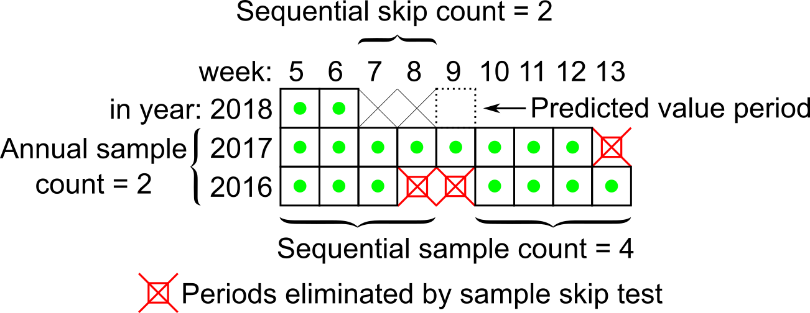{.center width=66% }

### Predictors and category option combinations (disaggregations)

The category option combination (disaggregation) for predictor output data
is chosen in one of three ways:

1. Default category option combination.

   If the predictor's output data element has no disaggregations (category combination "None",
also known as the default category combination), then all predictor output data will be made in
the default category option combination. In this case, predictor output data is not disaggregated.

2. Fixed category option combination

   If the predictor's output data element has a category combination other than "None", you can
choose a fixed disaggregation for the predictor "Output category option combo". If you do so,
all output from this predictor will have this category option combination.

   For example, if the output data element has a category combination of "Sex and Age", you can
decide that all predictor output will go to a category option combination such as "Female under 5",
"Male 5 - 10", or any other.

3. Use the input category option combo (available in v40.1 and following)

   If the predictor's output data element has a category combination other than "None", you can choose
"Predict according to input category option combo" as the value for "Output category option combo".
If you do so, a different prediction is made for each category option combo in the output data element's
category combination (that is, one prediction for "Female under 5", a second for "Male under 5",
a third for "Female 5 - 10", and so on).

   (In v40.1, this feature is enabled by selecting the choice "\<no value\>" for "Output category option combo".)

    > **Tip**
    >
    > In some installations, the options in a category may have changed over time.
    For example, a category "Age" may have had three options "1-5", "6-10", and "over 10",
    but then was changed to only have two options "10 and under" and "over 10".
    Historical data may have values with any of these options.
    To use a predictor with such data, you can define another category
    such as "Reporting Age" with all the options ever used, such as "1-5", "6-10",
    "10 and under", and "over 10". Use this category in the category combination
    for the predictor's output data element. This means that all the input category
    options will be reflected in the output.
    >
    > If you then want a single report for the output data that covers
    all the disaggregations, you can use category option groups
    in a category option group set. For example use a category option group
    "10 and under" that contains category options "1-5", "6-10", and "10 and under".

### Predictors and attribute option combinations

If the input data to a prediction has attribute option combinations, a different prediction
will be made for each attribute option combination where there is data.

For example, you could use attribute option combinations to represent different projects
on your system. The predictor will generate a value with the attribute option combination
for Project A when it finds input data for Project A; it will generate a value with the
attribute option combination for Project B when it finds input data for Project B; and so on.

For any input data without attribute option combinations (in other words, with the
default attribute option combination), predictions are generated using the default
attribute option combination. If you don't use attribute option combinations in the data,
they will not be used in predictor output data.

If you use attribute option combinations and also "Predict according to input category option combo",
there will be a separate prediction for each combination of disaggregation and attribute option combination.
For example, there could be a prediction for Project A data for "Female under 5", a prediction for
Project A data for "Male under 5", a prediction for Project B data for "Female under 5", and so on.

### Create or edit a predictor { #mm_create_predictor }

1.  Open the **Metadata Management** app and click **Indicators and Predictors** \> **Predictors** in the left-hand sidebar.

2.  Click the **+ New** button.

3.  In the **Name** field, type the predictor name.

4.  In the **Short name** field, type a short name for the predictor.

5.  (Optional) In the **Code** field, assign a code.

6.  (Optional) Type a **Description**.

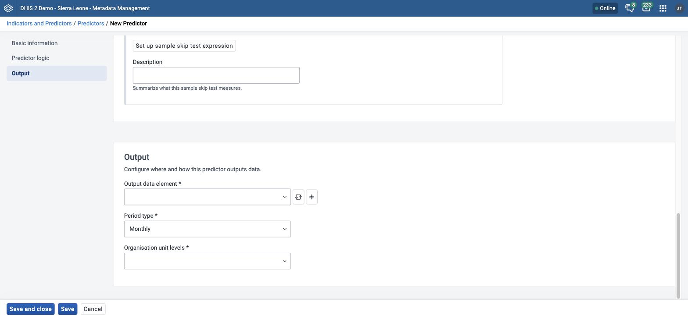

7.  Select an **Output data element**. Values generated by this
    predictor are stored as aggregate data associated with this data
    element and the predicted period.

    The value is rounded according to the value type of the data
    element: If the value type is an integer type, the predicted value
    is rounded to the nearest integer. For all other value types, the
    number is rounded to four significant digits. (However if there are
    more than four digits to the left of the decimal place, they are not
    replaced with zeros.)

8.  (Optional) Select an **Output category option combo**. This dropdown will only show
    if the selected data element has a category combination other than "None".
    If so, you can select which disaggregation category option combo you would like to output to,
    or you can select "Predict according to input category option combo" (see the discussion above).

9.  Select a **Period type**.

10. Assign one or more **organisation unit levels**. The output value will be
    assigned to an organisation unit at this level (or these levels).
    For **aggregate** data, the input values depend on the **Organisation units providing data** setting described below.
    For **tracker**-based data, the input values come from the organisation unit to which the
    output is assigned, or from any level lower under the output
    organisation unit.

11. **Organisation units providing data** controls where the input values come from for **aggregate** data. If "at selected levels only", only organisation units at the selected levels are included. If "At selected levels and all levels below" is selected, organisation units at the selected level(s) and all organisation units below are also included.

12. Create a **Generator**. The generator is the expression that is used to calculate the predicted value.

    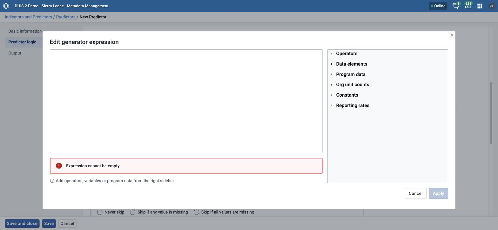

    1.  Type a **Description** of the generator expression.

    2.  Select a **Missing value strategy**. This sets whether the system evaluates the
        generator expression at all when some of the data it references is missing.

        |Option|Description|
        |--- |--- |
        |Skip if any value is missing|The expression is not evaluated if any of the values which compose it are missing, so no value is predicted. This is the default option.|
        |Skip if all values are missing|The expression is not evaluated only if *every* value which composes it is missing. If at least one value is present, the expression runs and the missing values are treated as zero.|
        |Never skip|The expression is always evaluated, and every missing value is treated as zero.|

        The strategy decides whether the expression runs. That is separate from what the
        expression does with a missing value once it *is* running:

        | Situation | Skip if any value is missing | Skip if all values are missing | Never skip |
        | --- | --- | --- | --- |
        | The only item referenced is missing | No value predicted | No value predicted | Treated as 0 |
        | One item missing, others have values | No value predicted | Missing item treated as 0 | Missing item treated as 0 |
        | `isNull( item )` where item is missing | Never evaluated | `true` | `true` |
        | `isNotNull( item )` where item is missing | Never evaluated | `false` | `false` |
        | `firstNonNull( item, fallback )` where item is missing | Never evaluated | Returns `fallback` | Returns `fallback` |

        > **Note**
        >
        > A missing value and a zero are not the same thing. DHIS2 does not store zeros for a
        > data element unless **Store zero data values** is switched on for it, so a field
        > that looks like it holds zero may hold no value at all. If your expression needs to
        > tell "reported zero" apart from "not reported", test with `isNull()` and use
        > **Skip if all values are missing** or **Never skip** — under **Skip if any value is
        > missing** the expression never runs, so the test can never fire.

    3.  Enter the generator expression. You can build the expression by
        selecting data elements for aggregate data, program data elements,
        attributes or indicators, organisation unit counts, constants or
        reporting rates.

        <!-- The legacy Maintenance chapter said "Organisation unit counts are not yet
             supported." The Metadata Management app's generator expression editor has
             both an Org unit counts and a Reporting rates panel (observed live on
             stable-2-43-0-1, 31 July 2026), and the backend has always accepted OUG{}
             and R{} in predictor expressions (see the Predictors section of the
             developer manual). The stale limitation has been removed. -->

        To use sampled, past period data, you should enclose any items you select in one of the following aggregate functions (note that these function names are case-sensitive):

        | Aggregate function | Means |
        |---|---|
        | avg(x) | Average (mean) value of x |
        | count(x) | Count of the values of x |
        | max(x) | Maximum value of x |
        | median(x) | Median value of x |
        | min(x) | Minimum value of x |
        | percentileCont(p, x) | Continuous percentile of x, where p is the percentile as a floating point number between 0 and 1. For example, p = 0 will return the lowest value, p = 0.5 will return the median, p = 0.75 will return the 75th percentile, p = 1 will return the highest value, etc. Continuous means that the value will be interpolated if necessary. For example, percentileCont( 0.5, #{FTRrcoaog83} ) will return 2.5 if the sampled values of data element FTRrcoaog83 are 1, 2, 3, and 4. |
        | stddev(x) | Standard deviation of x. This function is equivalent to stddevSamp. It's suggested that you use the function stddevSamp instead for greater clarity. |
        | stddevPop(x) | Population standard deviation of x: sqrt( sum( (x - avg(x))^2 ) / n ) |
        | stddevSamp(x) | Sample standard deviation of x: sqrt( sum( (x - avg(x))^2 ) / ( n - 1 ) ). Note that this value is not computed when there is only one sample. |
        | sum(x) | Sum of the values of x |

        > **Note**
        >
        > Any items inside an aggregate function will be evaluated for all
        > sampled past periods, and then combined according to the formula
        > inside the aggregate function. Any items outside an aggregate
        > function will be evaluated for the period in which the
        > prediction is being made.

        You can build more complex expressions by clicking on (or
        typing) any of the elements below the expression field:
        ( ) \* / + - Days.
        Constant numbers may be added by typing them. The Days
        option inserts \[days\] into the expression which resolves to
        the number of days in the period from which the data came.

        You can also use the following non-aggregating functions in your
        expression, either inside aggregate functions, or containing
        aggregate functions, or independent of aggregate functions:

        | Function | Means |
        |---|---|
        | contains(expr, sub1, ...) | Searches an expression for one or more substrings. Returns true if the expression contains all the substrings. For example, the following are all true: contains("abcd", "abcd"); contains("abcd", "b"); and contains("abcd", "ab", "bc"). Comparisons are case-sensitive. |
        | containsItems(expr, item1, ...) | Searches an expression for one or more items. The expression is made up of comma-separated elements. containsItems returns true if every item exactly matches an element in the expression. For example, containsItems("abcd", "abcd") and containsItems("ab,cd", "ab", "cd") are true, but containsItems("abcd", "b") and containsItems("abcd", "ab", "bc") are false. Comparisons are case-sensitive. containsItems can be used for multi-valued data elements to see if an item is contained in the data element values. |
        | if(test, valueIfTrue, valueIfFalse) | Evaluates **test** which is an expression that evaluates to a boolean value -- see **Boolean expression notes** below. If the test is **true**, returns the **valueIfTrue** expression. If it is **false**, returns the **valueIfFalse** expression. |
        | is(expr1 in expression [, expression ...]) | Returns true if expr1 is equal to any of the following expressions, otherwise false. |
        | isNull(item) | Returns the boolean value **true** if the **item** is null (missing), otherwise returns **false**. The **item** can be any selected item from the right (data element, program data element, etc.). |
        | isNotNull(item) | Returns **true** if the **item** value is not missing (not null), otherwise **false**. |
        | firstNonNull(item [, item ...]) | Returns the value of the first **item** that is not missing (not null). Can be provided any number of arguments. Any argument may also be a numeric or string literal, which will be returned if all the previous items have missing values. |
        | greatest(expression [, expression ...]) | Returns the greatest (highest) value of the expressions given. Can be provided any number of arguments. |
        | least(expression [, expression ...]) | Returns the least (lowest) value of the expressions given. Can be provided any number of arguments. |
        | log(expression [, base ]) | Returns the natural logarithm (base e) of the numeric expression. If an integer is given as a second argument, returns the logarithm using that base. |
        | log10(expression) | Returns the common logarithm (base 10) of the numeric expression. |
        | normDistCum(x [,mean [,stddev]]) | Returns the cumulative distribution function (CDF) value for x given the normalized distribution described by the mean and stddev. Equivalent to Excel NORM.DIST(x,mean,stddev,TRUE) or LibreOffice NORMDIST(x,mean,stddev,1). If stddev is not given, it is computed from past sampled values of x. If neither mean nor stddev are given, they are computed from past sampled values of x. See examples. |
        | normDistDen(x [,mean [,stddev]]) | Returns the probability density function (PDF) value for x given the normalized distribution described by the mean and stddev. Equivalent to Excel NORM.DIST(x,mean,stddev,FALSE) or LibreOffice NORMDIST(x,mean,stddev,0). If stddev is not given, it is computed from past sampled values of x. If neither mean nor stddev are given, they are computed from past sampled values of x. See examples. |
        | null | Returns no result. For example, _if( #{FH8ab5Rog83}<0, null, 1 )_ returns nothing if the data element value is less than 0, otherwise 1. |
        | orgUnit.ancestor(orgUnitUid [, orgUnitUid ...]) | Returns true if the organisation unit is a descendant of any of the (1 or more) organisation units, otherwise false. |
        | orgUnit.dataSet(dataSetUid [, dataSetUid ...]) | Returns true if the organisation unit is assigned to any of the (1 or more) data sets, otherwise false. |
        | orgUnit.group(ouGroupUid [, ouGroupUid ...]) | Returns true if the organisation unit is a member of any of the (1 or more) organisation unit groups, otherwise false. |
        | orgUnit.program(programUid [, programUid ...]) | Returns true if the organisation unit is assigned to any of the (1 or more) programs, otherwise false. |
        | removeZeros(expression) | Returns nothing if the expression value is 0, otherwise returns the expression value. |
        | .maxDate(yyyy-mm-dd) | For a data element (not program data), value from periods ending on or before a maximum date. |
        | .minDate(yyyy-mm-dd) | For a data element (not program data), value from periods starting on or after a minimum date. |

        **Boolean expression notes:** A boolean expression must evaluate
        to **true** or **false**. The following operators may be used to
        compare two values resulting in a boolean expression: \<, \>,
        \!=, ==, \>=, and \<=. The following operators may be used to
        combine two boolean expressions: && or the keyword _and_ (logical and), and || or the keyword _or_
        (logical or). The unary operator \! or the keyword _not_ may be used to negate a
        boolean expression.

        **Generator expression examples:**

        | Generator expression | Means |
        |---|---|
        | sum(#{FTRrcoaog83.tMwM3ZBd7BN}) | Sum of the sampled values of data element FTRrcoaog83 and category option combination (disaggregation) tMwM3ZBd7BN |
        | avg(I{GSae40Fyppf}) + 2 \* stddevSamp(I{GSae40Fyppf}) | Average of the sampled values of program indicator GSae40Fyppf plus twice its sample standard deviation |
        | sum(D{IpHINAT79UW.eMyVanycQSC}) / sum([days]) | Sum of all sampled values of data element eMyVanycQSC from program IpHINAT79UW divided by the number of days in all sample periods (resulting in the overall average daily value) |
        | sum(#{FTRrcoaog83}) + #{T7OyqQpUpNd} | Sum of all sampled values of data element FTRrcoaog83 plus the value of data element T7OyqQpUpNd in the period being predicted for (includes all disaggregations) |
        | 1.2 \* A{IpHINAT79UW.RKLKz1H20EE} | 1.2 times the value of attribute RKLKz1H20EE of program IpHINAT79UW, in the period being predicted for |
        | if(isNull(#{T7OyqQpUpNd}), 0, 1) | If the data element T7OyqQpUpNd is null in the period being predicted, then 0, otherwise 1 |
        | if(is(#{jeiTh8ahyae} in 'NEGATIVE','UNKNOWN'), 0, 1) | If the data element jeiTh8ahyae has value 'NEGATIVE' or 'UNKNOWN' then 0, otherwise 1 |
        | percentileCont(0.5, #{T7OyqQpUpNd}) | Continuous 50th percentile of the sampled values for data element T7OyqQpUpNd. Note that this is the same as median(#{T7OyqQpUpNd}) |
        | if(count(#{T7OyqQpUpNd}) == 1, 0, stddevSamp(#{T7OyqQpUpNd})) | If there is one sample value present for data element T7OyqQpUpNd, then 0, otherwise the sample standard deviation of these sample values. (Note that if no samples are present then the stddevSamp returns no value, so no value is predicted.) |
        | normDistCum(#{T7OyqQpUpNd}) | The cumulative distribution function for the current period value of data element T7OyqQpUpNd based on the normalized distribution defined by the mean and standard deviation of past sampled periods of data element T7OyqQpUpNd |
        | normDistCum( #{T7OyqQpUpNd}, median(#{T7OyqQpUpNd}) ) | The cumulative distribution function for the current period value of data element T7OyqQpUpNd based on the distribution defined by the median (instead of the mean) and standard deviation of past sampled periods of data element T7OyqQpUpNd |
        | normDistCum( #{T7OyqQpUpNd}, avg(#{T7OyqQpUpNd}), stddev(#{T7OyqQpUpNd}) ) | Same as normDistCum( #{T7OyqQpUpNd} ) |
        | normDistDen( #{T7OyqQpUpNd}, avg(#{IKahz1Quie3}), stddev(#{IKahz1Quie3}) ) | The probability density function for the current period value of data element T7OyqQpUpNd based on the distribution defined by the mean and standard deviation of past sampled periods of the different data element IKahz1Quie3 |
        | normDistDen( median(#{T7OyqQpUpNd}), avg(#{IKahz1Quie3}), stddev(#{IKahz1Quie3}) ) | The probability density function for the median of past sampled values of data element T7OyqQpUpNd based on the distribution defined by the mean and standard deviation of past sampled periods of the different data element IKahz1Quie3 |
        | #{T7OyqQpUpNd}.minDate(2022-10-1) | Value on or after 1-Oct-2022 |
        | #{T7OyqQpUpNd}.maxDate(2022-12-31) | Value on or before 31-Dec-2022 |
        | #{T7OyqQpUpNd}.minDate(2022-10-1).maxDate(2022-12-31) | Value between 1-Oct-2022 and 31-Dec-2022 |

13. (Optional) Create a **Sample skip test**. The sample skip test tells
    which previous periods if any to exclude from the sample.

    1.  Type a **Description** of the skip test.

    2.  Enter the sample skip test expression. You can build the
        expression from the same items as the generator expression. As
        with the generator, you may click on (or type) any of the
        elements below the expression field: ( ) \* / + - Days.

        The non-aggregating functions described above for generator expressions may also be used
        in skip tests.

        The expression must evaluate to a boolean value of **true** or
        **false**. See **Boolean expression notes** above.

        Skip test expression examples:

        | Skip test expression | Means |
        |---|---|
        | #{FTRrcoaog83} \> #{M62VHgYT2n0} | The value of data element FTRrcoaog83 (sum of all disaggregations) is greater than the value of data element M62VHgYT2n0 (sum of all disaggregations) |
        | #{uF1DLnZNlWe} \> 0 | The value of data element uF1DLnZNlWe (sum of all disaggregations) is greater than zero |
        | #{FTRrcoaog83} \> #{M62VHgYT2n0} &#124;&#124; #{uF1DLnZNlWe} \> 0 | The value of data element FTRrcoaog83 (sum of all disaggregations) is greater than the value of data element M62VHgYT2n0 (sum of all disaggregations) or the value of data element uF1DLnZNlWe (sum of all disaggregations) is greater than zero |

14. Enter a **Sequential sample count** value.

    This is for how many sequential periods the calculation should go
    back in time to sample data for the calculations.

15. Enter an **Annual sample count** value.

    This is for how many years the calculation should go back in time to
    sample data for the calculations.

16. (Optional) Enter a **Sequential skip count** value.

    This is how many sequential periods, immediately preceding the
    predicted value period, should be skipped before sampling the data.

17. Click **Save**.

### Predictions by Data Element Group { #mm_predictions_by_data_element_group }

You can use a single predictor to operate on all the data elements in a group instead of a different predictor for each data element. This can be used, for example, in logistics management when a data element is used for each commodity and a category option combination is used for each count related to that commodity.

The syntax is:

    forEach ?de in :DEG:degUid --> main expression

where:

| part | means |
|---|---|
| forEach | required keyword at the start of the expression |
| ?_de_ | any variable name starting with '?', then one letter, then optionally any number of additional letters or digits (case sensitive). Examples: ?de, ?X, ?dataElement, etc. |
| in | required keyword |
| :DEG:_degUid_ | the notation :DEG: followed by the UID of the data element group containing the data elements to be processed |
| --> | required before the main expression |
| _main expression_ | the expression to operate on each data element in the group. Within this expression use the variable name (such as ?de) as a placeholder for each data element |

The predictor will execute once for each data element in the data element group.
For each data element, instances of the variable in the main expression are replaced by that data element. The same data element is also used as the predictor output data element.
The predicted value will be written to that data element using the configured output category option combination.

The predictor must be configured with an output data element, but it is effectively ignored when the predictor is run.
It is suggested that you configure the predictor with one of the data elements in the data element group that the predictor will use.
That way you can select a valid output category option combination for that data element.

At the time the predictor is created, the data element group must contain at least one data element of the type that you will use. (The data type of the data element is used during syntax checking of the predictor.)

#### Example 1

You have data elements that represent various commodities, all belonging to a data element group with UID <code>aIMu0nieph7</code>.

You have category option combinations with the following UIDs:

| category option combo | means |
|---|---|
| <code>Gvoecom5muL</code> | Stock balance at start of period |
| <code>CWa6eew5uco</code> | Restock during period |
| <code>nthohhie8Ba</code> | Used during period |
| <code>Faey8Iphooy</code> | Lost, damaged, expired, or stolen during period |

The following predictor generator expression will compute the stock balance at the beginning of the next period as ( starting balance + restock - used - lost ):

<pre><code>forEach ?de in :DEG:aIMu0nieph7 -->
sum( #{?de.Gvoecom5muL} + #{?de.CWa6eew5uco} - #{?de.nthohhie8Ba} - #{?de.Faey8Iphooy} )</code></pre>

The predictor configuration includes:

| property | value |
|---|---|
| Output data element | one of the data elements in the group |
| Output category option combo | Stock balance at start of period (<code>Gvoecom5muL</code>) |
| Organisation units providing data | At selected level(s) only |
| Sequential sample count | 1 |
| Annual sample count | 0 |

The predictor will execute once for each data element in the data element group. Because the aggregation function <code>sum()</code> is used in the predictor generator expression, all the values in the expression will be fetched from the previous period (since the sequential sample count is 1). The predictor will write out the starting balance for each data element for the periods within the predictor run start and end date, for organisation units at the selected level(s).

Predictions are always made forward through time. The starting balance predicted for one period can be used as an input to compute the starting balance of the following period.

#### Example 2

If you want to make predictions for the same period as the input data, just omit the aggregation function such as <code>sum()</code>. Adding to the previous example, say you have another category option combination that computes the net inventory change during the period:

| category option combo | means |
|---|---|
| <code>Hpiek8IefoS</code> | Stock change during the period |

You can use the following expression to compute the inventory change as ( restock - used - lost ):

<pre><code>forEach ?de in :DEG:aIMu0nieph7 -->
#{?de.CWa6eew5uco} - #{?de.nthohhie8Ba} - #{?de.Faey8Iphooy}</code></pre>

The output category option combo is:

| property | value |
|---|---|
| Output category option combo | Stock change during the period (<code>Hpiek8IefoS</code>) |

Since there is no aggregation function such as <code>sum()</code> around the expression elements, the input data is taken from the same period as the predictor output.

For Show details, Sharing settings, Translate, Delete and Clone, see [Common actions](#mm_common_actions).

### Create or edit a predictor group { #mm_create_predictor_group }

1.  Open the **Metadata Management** app and click **Indicators and Predictors**
    \> **Predictor groups** in the left-hand sidebar.

2.  Click the **+ New** button.

3.  Type a **Name**. This field needs to be unique.

4.  (Optional) In the **Code** field, assign a code. This field needs to
    be unique.

5.  (Optional) Type a **Description**.

6.  Double-click the **Predictors** you want to assign to the group.

7.  Click **Save**.

For Show details, Sharing settings, Translate, Delete and Clone, see [Common actions](#mm_common_actions). (Sharing settings for predictor groups wasn't previously documented anywhere in this file, even though it's confirmed available live — same set of actions as individual predictors: Edit, Clone, Show details, Run now, Sharing settings, Translate, Delete.)

## Manage push reports { #mm_manage_push_report }

> **Note**
>
> Push reports are not available in the Metadata Management app. If your DHIS2 instance still uses push reports,
> configure them in the legacy Maintenance app — see
> [Manage push reports](#manage_push_report).

<!-- OPEN QUESTION for David before PR: is push analytics being retired, moved to
     another app, or simply not ported yet? If it is retired, delete this section
     outright rather than shipping a pointer to the legacy chapter. The wording above
     is deliberately factual about what was observed rather than making a claim about
     the roadmap. -->

## Manage external map layers { #mm_manage_external_maplayer }

> **Note**
>
> The functionality to manage external is planned to move to withing the **Maps** app and will not be replicated in the Metadata Management app. External map layers can still be configured in the legacy Maintenance app — see [Manage external map layers](#manage_external_maplayer).

## Manage SQL views { #mm_manage_sql_view }

<!-- Nav path and screenshot verified 31 July 2026 against stable-2-43-0-1. The app added a "Cache strategy" field not documented in the legacy text -- worth a follow-up sentence. -->

The SQL View functionality of DHIS2 will store the SQL view definition
internally, and then materialize the view when requested.

Database administrators must be careful about creating database views
directly in the DHIS2 database. For instance, when the resource tables
are generated, all of them will first be dropped and then re-created. If
any SQL views depend on these tables, an integrity violation exception
will be thrown and the process will be aborted.

The SQL views are dropped in reverse alphabetical order based on their
names in DHIS2, and created in regular alphabetical order. This allows
you to have dependencies between SQL views, given that views only depend
on other views which come earlier in the alphabetical order. For
instance, "ViewB" can safely depend on "ViewA". Otherwise, having views
depending on other view result in an integrity violation error.

### Creating a new SQL view

To create a new SQL view, open the **Metadata Management** app and click
**Other** \> **SQL views** in the left-hand sidebar, then click the **+ New** button.

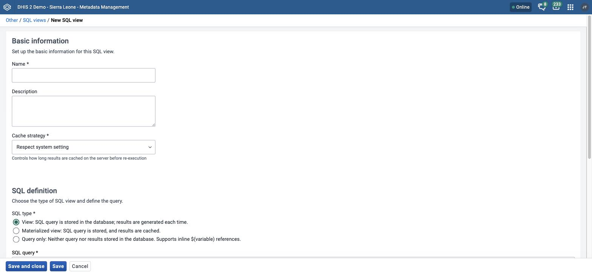

The "Name" attribute of the SQL view will be used to determine the name
of the table that DHIS2 will create when the view is materialized by the
user. The "Description" attribute allows one to provide some descriptive
text about what the SQL view actually does.

The "SQL type" attribute allows the creation of three kinds of views:
  - A "View" is stored in the database and regenerated when queried
  - A "Materialized View" is stored in the database and its results
    are cached in the database
  - A "Query" is not stored in the database

Finally, the "SQL query" should contain the SQL view definition.

Only SQL "SELECT" statements are allowed and certain sensitive tables
(i.e., user information) are not accessible.

Press "Save" to store the SQL view definition. If you created a "View"
or a "Materialized View", you must also run **Run query** to finish the
creation of the SQL view.

Keep in mind that the columns returned by the used SELECT statement
become table columns, that means they must be of a valid table column
type. When functions are used it might be necessary to explicitly cast
the result to a type by adding `::{TYPE}` after the function.

For example, instead of `jsonb_each` (which would return a record type
that cannot be a column type) use `jsonb_each_text` and cast the result
to `text`, like in the below sample:

```sql
select jsonb_each_text(eventdatavalues)::text from ...
```

### SQL views that call other SQL views

If you wish to make a SQL view that can be called be other SQL views,
then its **SQL type** must be either "View" or a "Materialized View"
(not "Query"). It also must have **Run query** run on it before
being called.

For instance, if you created a view named **Data element count**
with SQL type "View" and this SQL:

```sql
select count(*) as count from dataelement;
```

...then you could run **Run query** from the options menu and
create a second SQL view named **More than 100 data elements** with
this SQL:

```sql
select case when count > 100 then 1 else 0 end as result from _view_data_element_count;
```

### SQL View management

In order to utilize the SQL views, simply click the view and from the
options menu, choose **Run query**. Once the process is completed, you
will be informed that a table has been created. The name of the table
will be provided, and is composed from the "Description" attribute
provided in the SQL view definition. Once the view has been generated,
you can view it by clicking the view again, and selecting **View
results**.

For Clone, see [Common actions](#mm_common_actions).

<!-- Show details, Sharing settings, Translate and Delete for SQL views aren't documented anywhere in this file. SQL views do have a sharing schema (confirmed via DHIS2-20987, which lists SqlView among the object types affected by the externalAccess removal), so Sharing settings almost certainly applies the same as in Common actions; Show details, Translate and Delete are standard on effectively every other object type in this chapter. None of the four has been verified live for SQL views specifically though, so nothing has been added here beyond Clone -- worth a quick live check at the next screenshot run-through. -->

> **Tip**
>
> If you have a view which depends on another view, be careful about how the
> views are named. When analytics is run on the DHIS2 server, all views are
> dropped and then recreated: they are dropped in *reverse* alphabetical order
> and recreated in *regular* alphabetical order. So a view must come *after*
> the view it depends on alphabetically — for example "ViewB" can safely depend
> on "ViewA". If you name them the other way round, analytics may fail because
> the dependency will not exist yet when the dependent view is recreated.

<!-- Corrected 13 Aug 2026. This Tip previously stated the opposite ordering
     ("dropped in alphabetical order, then recreated in reverse alphabetical order")
     and so directly contradicted the paragraph at the top of this section. Verified
     against dhis2-core DefaultResourceTableService: createAllSqlViews() sorts with
     .sorted() (natural/alphabetical) and dropAllSqlViews() sorts with
     .sorted(reverseOrder()). The paragraph at the top of the section was right. -->

## Manage analytics table hooks { #mm_manage_analytics_table_hooks }

<!-- Nav path verified 31 July 2026 against stable-2-43-0-1. -->

The Analytics Table Hooks functionality of DHIS2 stores SQL code that
is run during different phases of the analytics table generation process.

See also [<code>/api/analyticsTableHooks</code> in the Developer documentation](#webapi_analytics_table_hooks).

### Creating a new analytics table hook

To create a new analytics table hook, open the **Metadata Management** app and
click **Other** \> **Analytics table hooks** in the left-hand sidebar, then click
the **+ New** button.

Press "Save" to store the analytics table hook.

## Manage Locales { #mm_manage_locale_management }

<!-- Nav path and screenshot verified 31 July 2026 against stable-2-43-0-1. -->

It is possible to create custom locales in DHIS2. In addition to the
locales available through the system, you might want to add a custom
locale such as "English" and "Zambia" to the system. This would allow
you to translate metadata objects to local languages, or to account for
slight variants between countries which use a common metadata
definition.

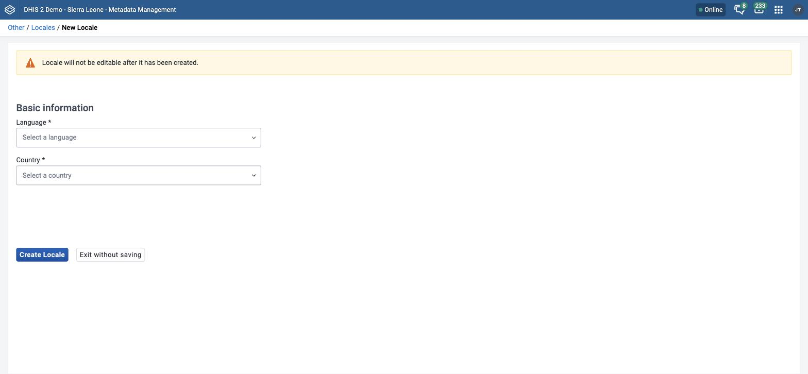

The locale is composed of a language along with a country. Open the
**Metadata Management** app and click **Other** \> **Locales** in the
left-hand sidebar, then click the **+ New** button. Select the desired values and
click **Create Locale**. This custom locale will now be available as one of
the translation locales in the system.

> **Note**
>
> A locale cannot be edited once created.

## Manage group membership { #mm_edit_multiple_object_groups }

The legacy Maintenance app had a separate **Metadata group editor** screen for adding
objects to groups in bulk. The Metadata Management app does not have an equivalent
screen, and one is not planned. Group membership is instead edited from whichever side
of the relationship you happen to be working on, using the standard
[transfer list](#mm_transfer_list_component):

* **One object into many groups** — open the object's own edit screen and assign it to
  groups there. For example, the **Data element groups** field in
  [Create or edit a data element](#mm_create_data_element) puts one data element into
  as many data element groups as you need, without leaving the data element.
* **Many objects into one group** — open the group's edit screen and assign the members
  there. For example, [Create or edit a data element group](#mm_create_data_element_group)
  assigns any number of data elements to a single group in one pass.

The same pattern applies to the other grouped object types in this chapter: category
option groups, indicator groups, organisation unit groups, option groups and predictor
groups, and their corresponding group sets.

To see or change which objects are currently in a group, open the group's list from the
left-hand sidebar — for example **Data elements** > **Data element group** — and edit the
group you want.

> **Tip**
>
> When you are assigning members to a group, use the **Show only unassigned items**
> checkbox above the Available list, where it is offered, to hide objects that already
> belong to another group of the same type. See
> [Using a transfer list component](#mm_transfer_list_component).
