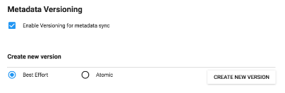
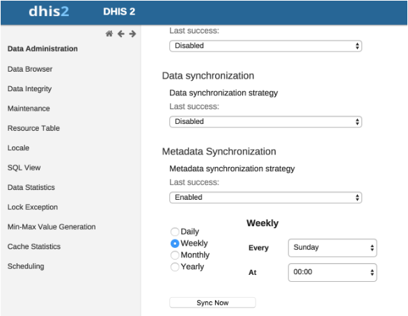

# Configure metadata synchronizing { #metadata_sync } 

## About data and metadata synchronization

You can synchronize data and metadata between different DHIS2 instances.
Given two instances in a central-local deployment strategy, metadata
created at the central system can be synchronized with the local system
and the data created at local system can be synchronized with the
central system. This can be useful when you've multiple stand-alone
instances of DHIS2 and global metadata needs to be created at all the
local instances.

If metadata creation and update take place at the central system and if
the metadata synchronisation task is enabled, the metadata gets
synchronized down to all the local instances which are bound to the
central instance. These local instances will in turn push data values
and complete data registration sets to the central instance. Enabling or
disabling versioning of metadata synchronization at local instance, will
not hinder the metadata synchronization process. This is because the
metadata synchronization interacts with versioning end points of the
central instance and not with end points of the local instance.

Each snapshot of metadata export generated is referred to a metadata
version. A new metadata version contains only the changes between the
previous version and the current version, that is it's an export between
two timestamps. All metadata versions are maintained in the DHIS2
database and are available to all local instances that connect to it.
You can schedule each of the local instances to download new metadata
versions. It is recommended to keep the metadata versions' sizes small
and logical.

> **Warning**
>
> Each instance of DHIS2, whether central or local, can create metadata
> versions. The local instance is meant to synchronize metadata from a
> central system and not create metadata on its own.
>
> If a new metadata version is created on the local instance, this
> instance can't receive new metadata versions from the central
> instance, since the content of the metadata versions will be out of
> synchronization.
>
> If you've created metadata versions on a local instance, you must
> manually deleted these versions from the database before you can
> synchronize with the central instance.
>
> Assume the central and local DHIS2 instances have identical metadata
> snapshots until version 10. Then the local instance creates a new
> snapshot called version 11. After that, the central instance creates a
> new snapshot called version 11. When the local instance attempts to
> synchronize metadata, version 11 is not downloaded. However, the
> content of version 11 on the local instance is not identical to the
> content of version 11 on the central instance.

> **Note**
>
> You can also use the **Import-Export** app to synchronize metadata
> manually.

## Workflow

1.  On the central instance, configure metadata versioning. You should
    do this once the central instance contains metadata.

2.  Connect local instance(s) to the central instance.

3.  On local instance(s), configure automatic synchronization.

## Configure metadata versioning on central instance

> **Note**
>
> To synchronize metadata, the user account of the central system must
> have the following authority:
>
> **F\_METADATA\_MANAGE**
>
> Only users with this authority will then be able to create and
> download metadata. This is to ensure security of the central system
> where the metadata is created. Instead of giving the credentials of
> user having ALL authority to the field instances, you need to create a
> user having this specific authority only.

1.  On the central instance, open the **System Settings** app and click
    **Synchronization**.

2.  Go to the **Metadata versioning** section and select **Enable
    versioning for metadata
    sync**.

    

3.  (Optional) Select **Don't sync metadata if DHIS2 versions differ**.

4.  Select a type of metadata version: **Best effort** or **Atomic**.

      - *Best effort* means that if the metadata import encounters
        missing references (for example missing data elements on a data
        element group import) it ignores the errors and continues the
        import.

      - *Atomic* means all or nothing - the metadata import will fail if
        any of the references do not exist.

        > **Note**
        >
        > Each metadata entity is associated with a "User" object. If
        > this "User" reference is missing while importing metadata
        > version of type ATOMIC, the import will fail at the validation
        > phase itself. This means that the user who creates metadata
        > also needs to synchronize down to local instances to
        > successfully import the metadata version of type ATOMIC.

5.  Click **Create new version**. The new version is added to the
    versioning table.

## Connect local instance to central instance

To enable metadata synchronization, you must configure the connection
between the local instance and the central instance.

1.  On the local instance, open the **System Settings** app and click
    **Synchronization**.

2.  Add the central DHIS2 instance's details to the local instance:

      - **Remote server URL**

      - **Remote server user name**

      - **Remote server password**

3.  Go to the **Metadata versioning** section and select **Enable
    versioning for metadata sync**.

4.  (Optional) Select **Don't sync metadata if DHIS2 versions differ**.

    The metadata schema changes between versions of DHIS2 which could
    make different metadata versions incompatible.

    When enabled, this option will not allow metadata synchronization to
    occur if the central and local instance(s) have different DHIS2
    versions. This apply to metadata synchronization done both via the
    user interface and the API.

    The only time it might be valuable to disable this option is when
    synchronizing basic entities, for example data elements, that have
    not changed across DHIS2 versions.

5.  (Optional) Configure email notifications to notify users about
    successful or unsuccessful metadata synchronization:

    1.  Open the **System Settings** app and click **Email**.

    2.  Enter **Host name**, **Port**, **User name**, **Password** and
        **Email sender**.

    3.  Click **Server** and enter a **System notifications email
        address**.

        This email address will receive notifications about the metadata
        synchronization status.

    > **Tip**
    >
    > When you receive email notification about a metadata
    > synchronization failure, check which metadata version that causes
    > the error and resolve it. Then you avoid future errors when the
    > system downloads new metadata versions.

## Configure automatic metadata synchronization on local instance

Once you have configured automatic metadata synchronization (scheduling)
on local instance(s), the scheduler will run at that specific time and
synchronize (download and import) the metadata from the central
instance. No manual intervention is required from the users at the local
instance(s).

After the scheduler has completed the metadata synchronization, the
local instance will have the metadata exactly as created on the central
system.

> **Note**
>
> Passwords of users are not synchronized. They are nullified for
> security reasons. After metadata synchronization, the Admin user must
> reset these passwords.

1.  On the local instance, open the **Data Administration** app and
    click **Scheduling**.

2.  In the **Metadata Synchronization** section, select **Enabled**.

3.  Select a time period: **Daily**, **Weekly**, **Monthly** or
    **Yearly**.

    

4.  Click **Start**.

## Create a new metadata version manually on central or local instance

1.  Open the **System Settings** app and click **Synchronization**.

2.  Go to the **Metadata versioning** section and select **Enable
    versioning for metadata sync**.

3.  (Optional) Select **Don't sync metadata if DHIS2 versions differ**.

4.  Select **Best effort** or **Atomic**.

5.  Click **Create new version**. The new version is added to the
    versioning table.

When the system is a *central instance*, you'll see three columns in the
versioning table:

| Object | Description |
|---|---|
| Master version | The latest version in the system. |
| Version | Name of the version. The name is automatically generated by system. |
| When | The timestamp of the metadata version creation at the central instance. |
| Type | Type of metadata version. |

When system is a *local instance*, you'll see four columns in the
versioning
table:

| Object | Description |
|---|---|
| Master version | The latest version of the central instance.            **Note**           The master version information is the central instance's latest version. This is important to look at the difference between the versions of metadata that exist at central and at local. |
| Last sync attempt | If the last sync attempt is a failure, this will be displayed. |
| Version | Name of the version. The name is automatically generated by system. |
| When | The timestamp of the metadata version creation at the central instance. |
| Type | Type of metadata version. |
| Last sync | Timestamp of when the last sync happened for this version in this system. |

## Reference information: metadata synchronization configuration parameters

The process which performs metadata synchronization is called Metadata
Sync Task. This task performs a series of steps before syncing of
metadata:

  - Push data (aggregate data and anonymous events data) from local
    instance to central instance.

  - Gets the current metadata version of the local instance. Then uses
    this version information as a baseline to fetch the list of metadata
    versions created after the baseline.

  - If there are new versions created at central instance, it performs
    the synchronization of metadata versions one after the other. A mail
    will be sent to the configured user (if any) after each successful
    synchronization of metadata version at the local instance.

Once the Metadata Sync Task has run at the scheduled time, the task can
retry (if any of the steps fail) based on the configuration of the
following parameters defined in `dhis.conf` file:

| Parameter | Default value |
|---|---|
| `metadata.sync.retry` | 3 |
| `metadata.sync.retry.time.frequency.millisec` | 30000 |

Each retry will be made after the time (in millisecond) as specified. If
the steps still fail even after all the retries, then the scheduler
stops its execution and then a mail will be sent to the configured user
(if any). If no values are specified then the default values will be
used.

`metadata.sync.retry` = 5

`metadata.sync.retry.time.frequency.millisec` = 10000
