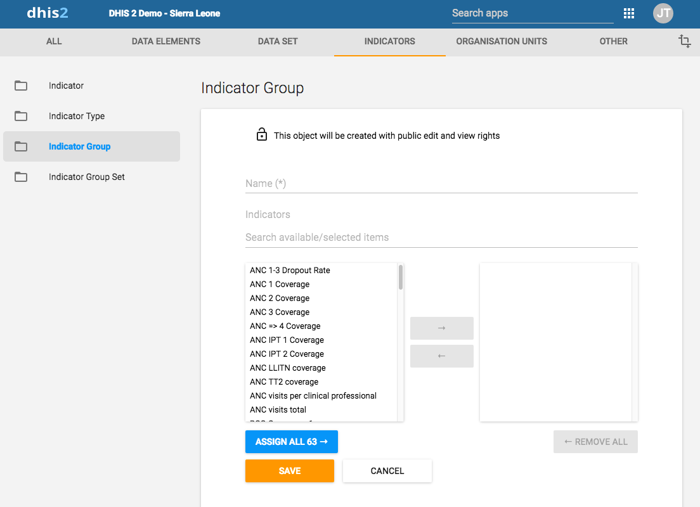
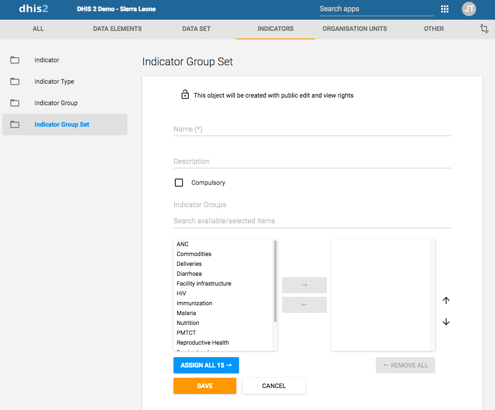
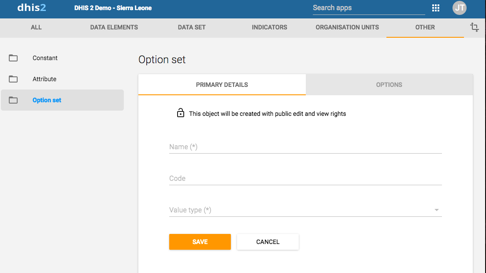

# Configure metadata { #maintenance_app } 

## About the Maintenance app { #about_maintenance_app } 

In the **Maintenance** app you configure all the metadata objects you
need to collect and analyze data:

  - Categories

  - Data elements

  - Data sets and data entry forms

  - Indicators

  - Organisation units

  - Program metadata: tracked entity, tracked entity attribute and
    relationship type

  - Validation rules

  - Attributes

  - Constants

  - Options sets

  - Legends

  - Predictors

  - Push reports

  - External map layers

> **Note**
>
> The functions you have access to depend on your user role's access
> permissions.


### Navigating metadata objects { #navigating_metadata } 

Metadata objects are presented in a list with predefined columns that are relevant for each object.
You may customize which columns are shown in the list for the current object. These customizations are per user, and therefore will not affect other users. Note that these changes do not edit any metadata, just how the list is presented.

#### Managing visible columns


1. Click the  icon to the top right of the list of objects you want to configure.
2. A dropdown-menu will appear, select **Manage columns**.
3. A dialog will appear, with the default columns selected.
3. Click any column-name in the list of **Available columns** to add them to the list of selected columns.
4. You may reorder the selected columns by drag-and-dropping the  icon.
5. You may also remove any column from the view by clicking the X-icon next to the name.
6. Click **Save** once you are satisified with your changes.

You may easily reset to the default values by clicking the **Reset to default** button.

##### Download metadata

You can download the metadata for the object you are currently viewing. The metadata download will respect any filters you have active for the list.

1. Click the  icon to the top right of the list of objects you want to configure.
2. A dropdown-menu will appear, select **Download**.
3. A dialog will appear, where you can select the desired format and compression.
4. **With sharing** can be selected to include sharing-data for the metadata.

## Manage categories { #manage_category } 

### About categories { #about_category } 

Categories are typically a concept, for example "Gender", "Age" or
"Disease Status". Data elements such as "Number of cases of confirmed
malaria" are often broken into smaller component parts to determine, for
example, the number of confirmed malaria cases of particular age groups.

Use categories to disaggregate data elements into individual components.
You can also use categories to assign metadata attributes to all data
recorded in a specific dataset, such as "Implementing partner" or
"Funding agency."

Create three categories: "Under 1", "1-5" and "Over 5". Assign them as
categories to the data element. This creates three separate fields for
this data in the data entry forms:

  - Number of confirmed malaria cases (Under 1)

  - Number of confirmed malaria cases (1-5)

  - Number of confirmed malaria cases (Over 5)

Without categories, you would have had to create each of the data
elements listed above separately.

In the **Maintenance** app, you manage the following and category
objects:


Table: Category objects in the Maintenance app

| Object type | Available functions |
|---|---|
| Category option | Create, edit, clone, share, delete, show details and translate |
| Category | Create, edit, clone, share, delete, show details and translate |
| Category combination | Create, edit, clone, share, delete, show details and translate |
| Category option combination | Edit and show details |
| Category option group | Create, edit, clone, share, delete, show details and translate |
| Category option group set | Create, edit, clone, share, delete, show details and translate |

### Workflow { #workflow_category } 

1.  Create all category options.

2.  Create categories composed by the multiple category options you've
    created.

3.  Create category combinations composed by either one or multiple
    categories.

4.  Create data elements and assign them to a category combination.

### Create or edit a category option { #create_category_option } 

When possible, recycle category options. For instance, there might be
two categories which might share a particular category option (for
example \<1 year of age). When creating the categories, this category
option could be reused. This is important if particular category options
(or category option combinations) that need to be analyzed together.

1.  Open the **Maintenance** app and click **Category** \> **Category
    option**.

2.  Click the add button.

3.  Fill in the form:

    1.  **Name**

    2.  **Short name** (optional)

    3.  **Code** (optional)

    4.  **Form name** (optional)
        Category options can have a form name. These will be displayed in the
        data entry app as a column header instead of the display name for the
        respective category option.

    5.  **Description**

    6.  **Start date** (optional)

    7.  **End date** (optional)

4.  Select organisation units and assign them.

    > **Tip**
    >
    > You can automatically select all organisation units that belong to
    > an organisation unit level or organisation unit group, for example
    > "Chiefdom" or "Urban. To do this:
    >
    > Select an **Organisation unit level** or **Organisation unit
    > group** and click **Select**.

5.  Click **Save**.

### Create or edit a category { #create_category } 

When you have created all category options for a particular category,
you can create that category.

1.  Open the **Maintenance** app and click **Category** \> **Category**.

2.  Click the add button.

3.  Fill in the form:

    1.  **Name**

    2.  **Short name**

    3.  **Code**

    4.  **Description**

    5.  **Data dimension type**

        A category can either be of type "Disaggregation" or "Attribute".
        For disaggregation of data elements, you select
        **Disaggregation**. The data dimension type "Attribute" allows
        the category to be used to assign a combination of categories to
        data recorded through a data set.

    6.  **Data dimension**

        If you select **Data dimension**, the category will be available
        to the analytics as another dimension, in addition to the
        standard dimensions of "Period" and "Organisation unit".

4.  Select category options and assign them.

5.  Click **Save**.

### Create or edit a category combination { #create_category_combination } 

Category combinations lets you combine multiple categories into a
related set.

You can disaggregate the data element "Number of new HIV infections"
into the following categories:

  - HIV Service: "Other", "PMTCT", "TB"

  - Gender: "Male", "Female"

In this example, there are two levels of disaggregation that consist of
two separate data element categories. Each data element category consist
of several data element category options.

In DHIS2, different data elements are disaggregated according to a
common set of categories. By combining these different categories into a
category combination and assigning these combinations to data elements,
you can apply the appropriate disaggregation levels quickly to a large
number of data elements.

1.  Open the **Maintenance** app and click **Category** \> **Category
    combination**.

2.  Click the add button.

3.  Fill in the form:

    1.  **Name**

    2.  **Code**

    3.  **Data dimension type**

    4.  **Skip category total in reports**

4.  Select categories and assign them.

5.  Click **Save**.

### Create or edit a category option group { #create_category_option_group } 

You can group and classify category options by using category option
groups. The main purpose of the category option group set is to add more
dimensionality to your captured data for analysis in for example the
**Pivot table** or **Data Visualizer** apps.

Consider a system where data is collected by "projects", and projects are modelled
as category options. The system must be able to analyse data based on
which donor supports the project. In this case, create a category
option group set called "Donor". Each donor can be created as a category
option group, where each category option / project is put in the
appropriate group. In the data analysis applications, the "Donor" group
set will appear as a data dimension, while each donor appear as
dimension items, ready to be included in reports.

To create a category option group:

1.  Open the **Maintenance** app and click **Category** \> **Category
    option group**.

2.  Click the add button.

3.  Fill in the form:

    1.  **Name**

    2.  **Short name**: Define a short name for the data element.

    3.  **Code**

    4.  **Description**

    5.  **Data dimension type**

4.  Select **Category options** and assign them.

5.  Click **Save**.

### Create or edit a category option group set { #create_category_option_group_set } 

You can group category option groups in category option group sets. The
main purpose of the category option group set is to add more
dimensionality to your captured data for analysis in for example the
**Pivot table** or **Data Visualizer** apps.

1.  Open the **Maintenance** app and click **Category** \> **Category
    option group set**.

2.  Click the add button.

3.  Fill in the form:

    1.  **Name**

    2.  **Short name**

    3.  **Description**

    4.  **Data dimension**

    5.  **Data dimension type**

4.  Select **Category option groups** and assign them.

5.  Click **Save**.

### Use category combinations for data sets { #use_category_combo_for_data_set } 

When categories and category combinations have the data dimension type
"Attribute", they can apply a common set of attributes to a related set
of data values contained in a data set. When category combinations are
used as a attribute, they serve as another dimension (similar to
"Period" and "Organisation unit") which you can use in your analysis.

Suppose that a NGO is providing ART services in a given facility. They
would need to report each month on the "ART monthly summary", which
would contain a number of data elements. The NGO and project could
potentially change over time. In order to attribute data to a given NGO
and project at any point in time, you need to record this information
with each data value at the time of data entry.

1.  Create two categories with the data dimension type "Attribute":
    "Implementing partner" and "Projects".

2.  Create a category combination with the data dimension type
    "Attribute": "Implementing partners and projects".

3.  Assign the categories you've created to the category combination.

4.  Create a data set called "ART monthly summary" and select the
    "Implementing partners and projects" category combination.

When you enter data in the **Data entry** app, you can select an
"Implementing partner" and a "Project". Each recorded data value, is
assigned a specific combination of these categories as an attribute.
These attributes (when specified as a dimension) can be used in the
analysis applications similar to other dimensions, for example the
period and organisation unit.


### Assign a code to a category option combination { #assign_code_category_option_combo } 

You can assign a code to category option combinations. This makes data
exchange between DHIS2 and external systems easier. The system creates
the category option combinations automatically.

1.  Open the **Maintenance** app and click **Category** \> **Category
    option combination**.

2.  In the list, find the object you want to modify.

3.  Click the options menu and select **Edit**.

4.  Enter a code.

5.  Click **Save**.

### Clone metadata objects { #clone_metadata } 

Cloning a data element or other objects can save time when you create
many similar objects.

1.  Open the **Maintenance** app and find the type of metadata object
    you want to clone.

2.  In the object list, click the options menu and select **Clone**.

3.  Modify the options you want.

4.  Click **Save**.

### Change sharing settings for metadata objects

You can assign different sharing settings to metadata objects, for
example organisation units and tracked entity attributes. These sharing
settings control which users and users groups that can view or edit a
metadata object.

Some metadata objects also allows you to change the sharing setting of
data entry for the object. These additional settings control who can
view or enter data in form fields using the metadata.

> **Note**
>
> The default setting is that everyone (**Public access**) can find,
> view and edit metadata objects.

1.  Open the **Maintenance** app and find the type of metadata object
    you want to modify.

2.  In the object list, click the context menu and select **Sharing
    settings**.

3.  (Optional) Add users or user groups: search for a user or a user
    group and select it. The user or user group is added to the list.

4.  Change sharing settings for the access groups you want to modify.

      - **Can edit and view**: The access group can view and edit the
        object.

      - **Can view only**: The access group can view the object.

      - **No access** (only applicable to **Public access**): The public
        won't have access to the object.

5.  Change data sharing settings for the access groups you want to
    modify.

      - **Can capture data**: The access group can view and capture data
        for the object.

      - **Can view data**: The access group can view data for the
        object.

      - **No access**: The access group won't have access to data for
        the object.

6.  Click **Close**.

### Delete metadata objects

> **Note**
>
> You can only delete a data element and other data element objects if
> no data is associated to the data element itself.

> **Warning**
>
> Any data set that you delete from the system is irrevocably lost. All
> data entry forms, and section forms which may have been developed will
> also be removed. Make sure that you have made a backup of your
> database before deleting any data set in case you need to restore it
> at some point in time.

1.  Open the **Maintenance** app and find the type of metadata object
    you want to delete.

2.  In the object list, click the options menu and select **Delete**.

3.  Click **Confirm**.

### Display details of metadata objects

1.  Open the **Maintenance** app and find the type of metadata object
    you want to view.

2.  In the object list, click the options menu and select **Show
    details**.

### Translate metadata objects

DHIS2 provides functionality for translations of database content, for
example data elements, data element groups, indicators, indicator groups
or organisation units. You can translate these elements to any number of
locales. A locale represents a specific geographical, political, or
cultural region.

> **Tip**
>
> To activate a translation, open the **System Settings** app, click \>
> **Appearance** and select a language.

1.  Open the **Maintenance** app and find the type of metadata object
    you want to translate.

2.  In the object list, click the options menu and select **Translate**.

    > **Tip**
    >
    > If you want to translate an organisation unit level, click
    > directly on the **Translate** icon next to each list item.

3.  Select a locale.

4.  Type a **Name**, **Short name** and **Description**.

5.  Click **Save**.

## Manage data elements { #manage_data_element } 

### About data elements { #about_data_element } 

Data elements are the base of DHIS2. Data elements define what is
actually recorded in the system, for example number of immunisations or
number of cases of malaria.

Data elements such as "Number of cases of confirmed malaria" are often
broken into smaller component parts to determine, for example, the
number of confirmed malaria cases of particular age groups.

In the **Maintenance** app, you manage the following data elements
objects:


Table: Data element objects in the Maintenance app

| Object type | Available functions |
|---|---|
| Data element | Create, edit, clone, share, delete, show details and translate |
| Data element group | Create, edit, clone, share, delete, show details and translate |
| Data element group set | Create, edit, clone, share, delete, show details and translate |

### Workflow { #workflow_data_element } 

1.  Create all category options.

2.  Create categories composed by the multiple category options you've
    created.

3.  Create category combinations composed by either one or multiple
    categories.

4.  Create data elements and assign them to a category combination.

### Create or edit a data element { #create_data_element } 


1.  Open the **Maintenance** app and click **Data elements** \> **Data
    element**.

2.  Click the add button.

3.  In the **Name** field, define the precise name of the data element.

    Each data element must have a unique name.

4.  In the **Short name** field, define a short name for the data
    element.

    Typically, the short name is an abbreviation of the full data
    element name. This attribute is often used in reports to display the
    name of the data element, where space is limited.

5.  (Optional) In the **Code** field, assign a code.

    In many countries data elements are assigned a code.

6.  (Optional) In the **Color** field, assign a color which will be used
    for this data element in the data capture apps.

7.  (Optional) In the **Icon** field, assign an icon which will be used
    for this data element in the data capture apps.

8.  In the **Description** field, type a description of the data
    element. Be as precise as possible and include complete information
    about how the data element is measured and what its purpose is.

8. (Optional) In the **Field mask** field, you may type a template that's used to provide
   hints for correct formatting of the data element.

     > **NOTE**
     >
     > So far this is only implemented in the DHIS2 Android Capture app; not in the Capture and Tracker Capture web apps.

   The following are special characters that can be used in the mask. The special characters match exactly one character of the given type.

   | Character     |    Match       |
   | ------------- |----------------|
   |      \\d      |     digit      |
   |      \\x      |lower case letter|
   |      \\X      | capital letter |
   |      \\w      |any alphanumeric character|

   For example, the pattern can be used to show hyphens as needed in the input field of the data element. E.g "\d\d\d-\d\d\d-\d\d\d, would
   show a hyphen for every third digit.

9.  In the **Form name** field, type an alternative name of the data
    element. This name can be used in either section or automatic data
    entry forms. The form name is applied automatically.

10. In the **Domain type** field, select whether the data element is an
    aggregate or tracker type of data element.

11. In the **Value type** field, select the type of data that the data
    element will record.


    Table: Value types
    
    | Value type | Description |
    |---|---|
    | Age | Dates rendered as calendar widget OR by entering number of years, months and/or days which calculates the date value based on current date. The date will be saved in the backend. |
    | Coordinate | A point coordinate specified as longitude and latitude in decimal degrees. All coordinate should be specified in the format [-19.23 , 56.42] with brackets and a comma separating the longitude and latitude. |
    | Date | Dates rendered as calendar widget in data entry. |
    | Date & time | Is a combination of the **DATE** and **TIME** data elements. |
    | Email | Email. |
    | File | A file resource where you can store external files, for example documents and photos. |
    | Image | A file resource where you can store photos.<br>     <br>Unlike the **FILE** data element, the **IMAGE** data element can display the uploaded image directly in forms. |
    | Integer | Any whole number (positive and negative), including zero. |
    | Letter | A single letter. |
    | Long text | Textual value. Renders as text area with no length constraint in forms. |
    | Negative integer | Any whole number less than (but not including) zero. |
    | Number | Any real numeric value with a single decimal point. Thousands separators and scientific notation is not supported. |
    | Percentage | Whole numbers inclusive between 0 and 100. |
    | Phone number | Phone number. |
    | Positive integer | Any whole number greater than (but not including) zero. |
    | Positive or zero integer | Any positive whole number, including zero. |
    | Organisation unit | Organisation units rendered as a hierarchy tree widget.<br>     <br>If the user has assigned "search organisation units", these will be displayed instead of the assigned organisation units. |
    | Unit interval | Any real number greater than or equal to 0 and less than or equal to 1. |
    | Text | Textual value. The maximum number of allowed characters per value is 50,000. |
    | Time | Time is stored in HH:mm format.<br>     <br>HH is a number between 0 and 23<br>     <br>mm is a number between 00 and 59 |
    | Tracker associate | Tracked entity instance. Rendered as dialog with a list of tracked entity instances and a search field. |
    | Username | DHIS2 user. Rendered as a dialog with a list of users and a search field. The user will need the "View User" authority to be able to utilise this data type |
    | Yes/No | Boolean values, renders as drop-down lists in data entry. |
    | Yes only | True values, renders as check-boxes in data entry. |

12. In the **Aggregation type** field, select the default aggregation
    operation that will be used on the data element.

    Most data elements should have the **Sum** operator. This includes
    all data elements which should be added together. Other data
    elements, such as staffing levels, should be set to use the
    **Average** operator, when values along the time dimension should
    not be added together, but rather averaged.


    Table: Aggregation operators
    
    | Aggregation operator | Description |
    |---|---|
    | Average | Average the values in both the period as and the organisation unit dimensions. |
    | Average (sum in organisation unit hierarchy) | Average of data values in the period dimension, sum in the organisation unit dimensions. |
    | Count | Count of data values. |
    | Min | Minimum of data values. |
    | Max | Maximum of data values. |
    | None | No aggregation is performed in any dimension. |
    | Sum | Sum of data values in the period and organisation unit dimension. |
    | Standard deviation | Standard deviation (population-based) of data values. |
    | Variance | Variance (population-based) of data values. |

13. If you want to save zeros for a particular reason, select **Store
    zero data values**. By default, DHIS2 does not store zeros entered
    in the data entry module.

14. In the **URL** field, enter a link to an in-depth description of the
    data element.

    For example a link to a metadata repository or registry that
    contains detailed technical information about the definition and
    measurement of the data element.

15. In the **Category combination** field, define which category
    combination the data element should have. This is also known as the
    "disaggregation".

16. Select an **Option set**.

    Option sets are predefined lists of options which can be used in
    data entry.

17. Select an **Option set for comments**.

    Option sets for comments are predefined lists of options which can
    be used to specify standardized comments for data values in data
    entry.

18. Assign one or multiple **Legends**.

    Legends are used in for example the **Maps** app to display certain
    data elements with certain icons.

19. Set the **Aggregation levels** to allow the data element to be
    aggregated at one or more levels:

    1.  In the left pane, select the levels you want to assign to the
        data element.

    2.  Click the right arrow to assign the aggregation levels.

    By default, the aggregation will start at the lowest assigned
    organisation unit. If you for example select "Chiefdom", it means
    that "Chiefdom", "District", and "National" aggregates use
    "Chiefdom" (the highest aggregation level available) as the data
    source, and PHU data will not be included. PHU data will still be
    available for the PHU level, but not included in aggregations to the
    levels above.

    If you select both "District" and "Chiefdom", it means that the
    "District" and "National" level aggregates use District data as
    their source, "Chiefdom" will use Chiefdom, and "PHU" will use PHU.

20. If applicable, enter custom attributes values, for example
    **Classification** or **Collection method**.

    > **Note**
    >
    > You create custom attributes in the **Maintenance** app: **Other**
    > \> **Attributes**.

21. If applicable, select compulsory data element group sets, for
    example **Main data element group** or **Tracker-based data**.

    > **Note**
    >
    > You'll only see data element group sets in this form if you've
    > created them and set them to **Compulsory**.
    >
    > You create data element group sets in the **Maintenance** app:
    > **Data element** \> **Date element group set**.

22. Click **Save**.

### Create or edit a data element group { #create_data_element_group } 

Data element groups lets you classify related data elements into a
common theme. For example, two data elements "Measles immunisation" and
"BCG Immunisation" might be grouped together into a data element group
"Childhood immunisation".

To create a data element group:

1.  Open the **Maintenance** app and click **Data elements** \> **Data
    element group**.

2.  Click the add button.

3.  Fill in the form:

    1.  **Name**

    2.  **Short name**

    3.  **Code**

4.  Select data elements and assign them.

5.  Click **Save**.

### Create or edit a data element group set { #create_data_element_group_set } 

Data element group sets allows you to categorise multiple data element
groups into a set. The system uses data element group sets during
analysis and reporting to combine similar data element groups into a
common theme. A data element group can be part of multiple data element
group sets.

1.  Open the **Maintenance** app and click **Data elements** \> **Data
    element group set**.

2.  Click the add button.

3.  Fill in the form:

    1.  **Name**
    2.  **Short name**
    3.  **Code**
    4.  **Description**
    5.  **Compulsory**
    5.  **Data dimension**

4.  Select data element groups and assign them.

    Available data element groups are displayed in the left panel. Data
    element groups that are currently members of the data element group
    set are displayed in the right hand panel.

5.  Click **Save**.

### Clone metadata objects { #clone_metadata } 

Cloning a data element or other objects can save time when you create
many similar objects.

1.  Open the **Maintenance** app and find the type of metadata object
    you want to clone.

2.  In the object list, click the options menu and select **Clone**.

3.  Modify the options you want.

4.  Click **Save**.

### Change sharing settings for metadata objects

You can assign different sharing settings to metadata objects, for
example organisation units and tracked entity attributes. These sharing
settings control which users and users groups that can view or edit a
metadata object.

Some metadata objects also allows you to change the sharing setting of
data entry for the object. These additional settings control who can
view or enter data in form fields using the metadata.

> **Note**
>
> The default setting is that everyone (**Public access**) can find,
> view and edit metadata objects.

1.  Open the **Maintenance** app and find the type of metadata object
    you want to modify.

2.  In the object list, click the context menu and select **Sharing
    settings**.

3.  (Optional) Add users or user groups: search for a user or a user
    group and select it. The user or user group is added to the list.

4.  Change sharing settings for the access groups you want to modify.

      - **Can edit and view**: The access group can view and edit the
        object.

      - **Can view only**: The access group can view the object.

      - **No access** (only applicable to **Public access**): The public
        won't have access to the object.

5.  Change data sharing settings for the access groups you want to
    modify.

      - **Can capture data**: The access group can view and capture data
        for the object.

      - **Can view data**: The access group can view data for the
        object.

      - **No access**: The access group won't have access to data for
        the object.

6.  Click **Close**.

### Delete metadata objects

> **Note**
>
> You can only delete a data element and other data element objects if
> no data is associated to the data element itself.

> **Warning**
>
> Any data set that you delete from the system is irrevocably lost. All
> data entry forms, and section forms which may have been developed will
> also be removed. Make sure that you have made a backup of your
> database before deleting any data set in case you need to restore it
> at some point in time.

1.  Open the **Maintenance** app and find the type of metadata object
    you want to delete.

2.  In the object list, click the options menu and select **Delete**.

3.  Click **Confirm**.

### Display details of metadata objects

1.  Open the **Maintenance** app and find the type of metadata object
    you want to view.

2.  In the object list, click the options menu and select **Show
    details**.

### Translate metadata objects

DHIS2 provides functionality for translations of database content, for
example data elements, data element groups, indicators, indicator groups
or organisation units. You can translate these elements to any number of
locales. A locale represents a specific geographical, political, or
cultural region.

> **Tip**
>
> To activate a translation, open the **System Settings** app, click \>
> **Appearance** and select a language.

1.  Open the **Maintenance** app and find the type of metadata object
    you want to translate.

2.  In the object list, click the options menu and select **Translate**.

    > **Tip**
    >
    > If you want to translate an organisation unit level, click
    > directly on the **Translate** icon next to each list item.

3.  Select a locale.

4.  Type a **Name**, **Short name** and **Description**.

5.  Click **Save**.

## Manage data sets and data entry forms { #manage_data_set } 

### About data sets and data entry forms { #about_dataset_dataform } 

All data entry in DHIS2 is organised in data sets. A data set is a
collection of data elements grouped together for data entry and data
export between instances of DHIS2. To use a data set to collect data for
a specific organisation unit, you must assign the organisation unit to
the data set. Once you have assigned the data set to an organisation
unit, that data set is available in the **Data entry** app. Only the
organisation units that you have assigned the data set to can use the
data set for data entry.

A category combination can link to both data elements and data sets. If
you use a category combination for a data set, the category combinations
is applicable for the whole form. This means that you can use categories
to capture information which is common to an entire form, for example
the name of the a project or grant. When a data set is linked to a
category combination, those categories will be displayed as drop-down
boxes in the **Data entry** app. Data captured in the form will then be
linked to the selected category options from those drop-down boxes. For
information about how to create categories and category combinations,
see section "Manage data elements and categories". Make sure that you
set the type of categories and category combinations to "Attribute".

An scenario for when categories are useful is when you need to capture a
data entry form for a implementing partner organisation and a project.
In that case:

1.  Create category options and categories for all partner organisations
    and projects and link them in a new category combination.

2.  Assign the category combination to the data set (form) for which you
    need to capture this information.

    When opening this data set in data entry module, the partner
    organisation and project categories will automatically be rendered
    as drop-down boxes, allowing you to select a specific implementing
    partner organisation and project before continuing to do data entry.

You create and edit data sets in the **Maintenance** app. Here you
define, for example, which data elements you want to include in the data
set and the data collection frequency.

You enter data in the **Data entry** app. The **Data entry** app uses
data entry forms to display the data sets. There are three types of data
entry forms:


Table: Data entry form types

| Data entry form type | Description |
|---|---|
| Default form | Once you have assigned a data set to an organisation unit, a default form is created automatically. The default form is then available in the **Data entry** app for the organisation units you have assigned it to.<br> <br>A default form consist of a list of the data elements belonging to the data set together with a column for inputting the values. If your data set contains data elements with a non-default category combination, for example age groups or gender, additional columns are automatically created in the default form based on the different categories.<br> <br>If you use more than one category combination you get multiple columns in the default form with different column headings for the options. |
| Section form | If the default form doesn't meet your needs, you can modify it to create a section form. Section forms give you more flexibility when it comes to using tabular forms.<br> <br>In a section form you can, for example, create multiple tables with subheadings and disable (grey out) cells in a table.<br> <br>When you have added a section form to a data set, the section form is available in the **Data entry** app. |
| Custom form | If the form you want to design is too complicated for default or section forms, you can create a custom form. A custom form takes more time to create than a section form, but you have full control over the design.<br> <br>You can, for example, mimic an existing paper aggregation form with a custom form. This makes data entry easier, and should reduce the number incorrectly entered data elements.<br> <br>When you have added a custom form to a data set, the custom form is available in the **Data entry** app. |

> **Note**
>
> If a data set has both a section form and a custom form, the system
> displays the custom form during data entry. Users who enter data can't
> select which form they want to use. In web-based data entry the order
> of display preference is:
>
> 1.  Custom form (if it exists)
>
> 2.  Section form (if it exists)
>
> 3.  Default form
>
> Mobile devices do not support custom forms. In mobile-based data entry
> the order of display preference is:
>
> 1.  Section form (if it exists)
>
> 2.  Default form

In the **Maintenance** app, you manage the following data set objects:


Table: Data set objects in the Maintenance app

| Object type | Available functions |
|---|---|
| Data set | Create, assign to organisation units, edit, share, delete, show details and translate<br> <br>Edit compulsory data elements<br> <br>Add and remove multiple data sets to organisation units at once |
| Section form | Create, edit and manage grey fields |
| Section | Change display order, delete and translate |
| Custom form | Create, edit and script |

### Workflow { #workflow_data_set } 

You need to have data elements and categories to create data sets and
data entry forms.

1.  Create a data set.

2.  Assign the data set to organisation units.

    A default form is created automatically.

3.  Create a section form or a custom form.

    Now you can register data in the **Data entry** app.

### Create or edit a data set { #create_data_set } 


1.  Open the **Maintenance** app and click **Data set** \> **Data set**.

2.  Click the add button.

3.  In the **Name** field, type the precise name of the data set.

4.  In the **Short name** field, define a short name for the data set.

    Typically, the short name is an abbreviation of the full data set
    name. This attribute is often used to display the name of the data
    set where space is limited.

5.  (Optional) In the **Code** field, assign a code.

6.  In the **Description** field, type a description of the data set.

7.  Enter the number of **Expiry days**.

    The number of expiry days controls for how long it should be
    possible to enter data in the **Data entry** app for this data set.
    Expiry days refer to the number of days after the end date of the
    selected data entry period where the data entry form should be open
    for entry. After the number of days has expired, the data set will
    be locked for further entry.

    You can set manual exceptions to this using the lock exception
    functionality in the **Data Administration** app.

    > **Note**
    >
    > To allow data entry into all possible historical time periods, set
    > the number of expiry days to zero.

8.  If you want it to be possible to enter data for future periods, type
    the number of periods in the **Open future periods for data entry**
    field.

    The value is the number of future periods which are available for
    data entry.

    For a monthly data set a value of 2 allows you to enter data for 2
    months in advance. This is useful for, by example, population,
    target and planning data.

9.  In the **Days after period to qualify for timely submission** field,
    type the number of days in which data can be entered to be
    considered reported on time.

    To verify the number of timely reports submitted, go to **Reports**
    \> **Reporting rate summary**.

10. Select a **Period type**.

    The period type defines the frequency of reporting for the
    particular data set. The frequency can for example be daily,
    quarterly or yearly.

11. Select a **Category combination** to assign it to the data set.

    > **Tip**
    >
    > Click **Add new** to create category combinations that you're
    > missing. In the form that opens, create the category combinations
    > you need. When you're done, click **Refresh values**.

12. If you selected a category combination other than **None**,
    you may enter zero or a positive number for **Open periods after
    category option end date**. This lets you enter data in this data
    set for a category option up to the specified number of periods
    after that category option's end date.

13. In the **Complete notification recipients** list, select a user
    group that should receive a message when the data set is marked as
    complete in the **Data Entry** app.

    The message is delivered through the DHIS2 messaging system.

14. If you want the user who entered the data to receive a message when
    the data set is marked as complete in the **Data entry** app, select
    **Send notification to completing user**.

    The message is delivered through the DHIS2 messaging system.

15. If applicable, select, a **Data approval workflow**.

16. If you want it to be possible to use the data set within the Java
    mobile DHIS2 application, select **Enable for Java mobile client**.

17. If you want it to be mandatory to fill all values for a data element
    in data entry if one or more values have been filled, select **All
    fields for data elements required**.

    This means that if you enter one data value for a data element in an
    entry field (that is for a category option combination), then you
    must enter data for all fields belonging to that data element (that
    is all category option combinations).

18. If you want it to be possible to mark a data entry form as complete
    only if the validation of that form is successful, select **Complete
    allowed only if validation passes**.

    If you select this option, you can't mark the form as complete if
    validation fails.

19. If you want it to be mandatory that any missing values require a
    comment to justify their absence, select **Missing values requires
    comment on complete**.

20. (Optional) Assign one or multiple **Legends**.

21. If applicable, select **Skip offline**.

    This option controls whether this data entry form should be
    downloaded and saved in the user's web browser. Normally you
    shouldn't select **Skip offline**. This is the default setting. If
    you have big forms which are rarely used you can consider selecting
    this option to speed up initial loading in the data entry module.

22. If applicable, select **Data element decoration**

    If you select this option, descriptions of data elements render in
    call-outs in downloaded data sets in offline mode in the **Data
    entry** app.

23. If applicable, select **Render sections as tabs**.

    This option is only applicable for section forms. The option allows
    you to render each section as a tab horizontally above the data set.
    This is useful for long data sets as it allows appropriate sections
    to be selected quickly without going through the entire form.

24. If applicable, select **Render vertically**.

    This option is only applicable for section forms that are multi-organisation unit forms.

25. Select data elements and assign them.

    You can override the category combination for each selected data set
    by clicking on the gear icon above the list of selected data
    elements. This allows you to utilize a specific category combination
    (disaggregation) within the current data set instead of the category
    combination associated directly with the data element itself.

26. Select indicators and assign them.

27. In the organisation unit tree, select the organisation units you
    want to assign the data set to.

    > **Tip**
    >
    >   - Click **Organisation unit level** to select all organisation
    >     units that belong to a certain organisation level.
    >
    >   - Click **Organisation unit group** to select all organisation
    >     units that belong to a certain organisation unit group.

28. Click **Save**.

You can now use the data set in the **Data Entry** app for the
organisation units that you have assigned to and for periods according
to the selected frequency (period type).

### Create or edit Data set Notification { #create_data_set_notification } 

1.  Open the **Maintenance** app and click **Data set** \> **Data set
    notification**.

2.  Click the add button.

#### What to send?


1.  In the **Name** field, type the precise name of the data set
    notification.

2.  (Optional) In the **Code** field, assign a code.

3.  Enter **Data sets**.

    These data sets will be associated to this notification. In case any
    of them is completed for a certain period and organisation unit,
    notification will be generated by the system.

    > **Note**
    >
    > Nothing will happen if no data set is selected

4.  In **Message template** section there are two parameters.

      - **Subject template** subject of the notification sent in
        notification. It can have values from the list of variables
        available on the right side.

      - **Message template** actual message sent in notification. It can
        have values from the list of variables available on the right
        side.

    > **Note**
    >
    > Subject is only relevant in case of Email and internal DHIS2
    > messages. It is ignored in case of SMS.

#### When to send?


1.  **Data set notification trigger** field determine when to send
    notification.

      - **Data Set Completion** will trigger notification as soon as
        data set is completed.

      - **Schedule Days** will schedule notification based on number days
        relative to scheduled date. Schedule date will be decided by
        Period associated with Data set.

          - **Send notification as** provides two different types of
            notifications

              - **Collective summary** send notification in summary mood

              - **Single notification** sends notification in single
                mood

    > **Note**
    >
    > **Send notification as** option is only available in case of
    > scheduled notification. This option is set to default which is
    > **Single notification** in case of completion notification

#### Who to send?


1.  **Notification recipient** field determine recipients of the
    notification.

      - **Organisation Unit contact** will send notification to contact
        assigned to organisation unit which the data has been collected
        from.

      - **UserGroup** will send notification to all the member of the
        selected UserGroup.

    > **Note**
    >
    > An internal DHIS2 message will be sent in case if recipient is
    > UserGroup. Moreover user will also receive SMS/EMAIL if phone
    > number and email address exist for that user and SMS/EMAIL
    > notifications are enabled in SystemSettings

### Override data elements' category combinations in a data set { #override_dataelement_catcombo_in_dataset } 

You can override which category combination to use for a data element
within the context of a data set. This means that a data element can use
different category combinations within different data sets. This is
useful when you want to reuse a data element since you don't have to
replicate the data element to allow multiple category combinations.

If different regions within your organisation unit hierarchy use
different disaggregations, or if the disaggregations change over time,
you can represent this by creating different data sets with the
appropriate category combinations.

1.  Open the **Maintenance** app and click **Data set** \> **Data set**.

2.  In the list, find the data set you want to modify.

3.  Click the options menu and select **Edit**.

4.  Go to the data elements section and click the spanner icon.

5.  Select new category combinations and click **Close**.

6.  Click **Save**.

### Edit compulsory data elements in a data set { #edit_compulsory_dataelement_in_dataset } 

You can add or remove data elements which will be marked as compulsory
during data entry.

1.  Open the **Maintenance** app and click **Data set** \> **Data set**.

2.  In the list, find the data set you want to edit.

3.  Click the options menu and select **Edit compulsory data elements**.

4.  Assign the compulsory data elements.

5.  Click **Save**.

### Download default data forms in PDF format { #download_defaultform_pdf } 

You can download a default data from in PDF format for offline data
entry.

1.  Open the **Maintenance** app and click **Data set** \> **Data set**.

2.  In the list, find the object you want to download.

3.  Click the options menu and select **Get PDF for data entry**.

### Manage section forms { #manage_section_form } 

#### Create a section form

Section forms are separated automatically by data element category
combinations, which produce a spreadsheet like data entry form for each
section.

1.  Open the **Maintenance** app and click **Data set** \> **Data set**.

2.  In the list, find the data set you want to create a section form
    for.

3.  Click the options menu and select **Manage sections**.

4.  Click the add button.

5.  (Optional) In the **Name** field, type the name of the section.

6.  (Optional) In the **Description** field, type a description of the
    section.

7.  (Optional) To display totals for rows in the section form during
    data entry, select **Show row totals**.

8.  (Optional) To display totals for columns in the section form during
    data entry, select **Show column totals**.

9.  (Optional) To prevent automatic grouping of data of data elements with the same category combo, 
    select **Disable automatic grouping of data elements**. This is useful if you want the order of the data elements
    to be respected regardless of differing category combos.

10.  Assign data elements to the section:

    1.  (Optional) Select a **Category combination filter**.

        > **Note**
        >
        > You can only use one category combination per section.


        | Option | Description |
        |---|---|
        | **None** | Displays all data elements that don't have a category combination. |
        | **<No filter\>** | Displays all data elements. |
    
    2.  Select data elements and assign them.

11. (Optional) Sort the data elements within the section by using the up
    and down arrows to the left of the assigned data elements field.

12. Click **Save**.

13. Repeat add section steps for each section you want to have in your
    section form.

    In the **Data Entry** app you can now use the section form. The
    section form appears automatically when sections are available for
    the selected data set. Data sets which have section forms will
    automatically display the section form.

Note how each data element category has been separated into a separate
section, and a data entry table has been automatically generated by the
system. Use of section forms in combination with data element categories
can drastically reduce the amount of time which is required to create
data entry forms for data sets.


#### Edit a section form

1.  Open the **Maintenance** app and click **Data set** \> **Data set**.

2.  In the list, find the data set you want to edit the section form
    for.

3.  Click the options menu and select **Manage sections**.

4.  In the list, find the section you want to edit.

5.  Click the options menu and select **Edit**.

6.  Edit the section and click **Save**.

7.  Repeat edit section steps for each section you want to edit.

#### Manage grey fields in a section form

You can disable data elements and category options for data entry. That
means it wont be possible to enter data into these fields during data
entry.


1.  Open the **Maintenance** app and click **Data set** \> **Data set**.

2.  In the list, find the data set you want to edit the section form
    for.

3.  Click the options menu and select **Manage sections**.

4.  In the list, find the section you want to edit.

5.  Click the options menu and select **Manage grey fields**.

6.  Select which fields you want to disable.

    > **Note**
    >
    > If you've sections that contain data elements assigned to multiple
    > category combinations, switch between the category combinations to
    > view all fields.

7.  Click **Save**.

#### Change section display order in a section form

You can control in which order sections are displayed in a section form.

1.  Open the **Maintenance** app and click **Data set** \> **Data set**.

2.  In the list, find the data set you want to edit the section form
    for.

3.  Click the options menu and select **Manage sections**.

4.  In the list, find the section you want to move.

5.  Click the options menu and select **Move up** or **Move down**.

    If the section you want to move is the first or last section in the
    list, you'll only see one of the move options.

#### Delete a section in a section form

1.  Open the **Maintenance** app and click **Data set** \> **Data set**.

2.  In the list, find the data set you want to edit the section form
    for.

3.  Click the options menu and select **Manage sections**.

4.  In the list, find the section you want to delete.

5.  Click the options menu and select **Delete**.

#### Translate a section in a section form

1.  Open the **Maintenance** app and click **Data set** \> **Data set**.

2.  In the list, find the data set you want to edit the section form
    for.

3.  Click the options menu and select **Translate**.

4.  Select a locale.

5.  Enter the required information.

6.  Click **Close**.

#### Form Configuration options

In version 41, we have added extra form configuration options that change how a section form is displayed in the new **Data Entry App (beta)**. These options allow users to apply functionality that was not possible before without custom forms. We will be adding more options in the future releases.


The options available in v41 are:

##### Transpose (pivot) functionality
Users are able to choose to transpose (pivot) a form when displayed in the new Data Entry (beta) app. They are able to either fully transpose the form, i.e. move categories to be displayed as rows and data elements as columns, or move a certain category to be displayed as rows. The default display mode is for data elements to be displayed as rows and categories as columns.

##### Content before and after a section
Users are able to display custom text before and/or after a section. This is helpful for adding help text, for example. For security reasons, only basic styling and HTML link elements are allowed, specifically these tags: `a` for adding a link, `u` for underlining a text, `b`, `strong` for styling text in bold format, or `em` to style it in italic.

### Manage custom forms { #manage_customform } 

#### Create a custom form

You design custom forms in a built-in WYSIWYG HTML editor. If you select
**Source**, you can paste HTML code directly in the editing area. For a
complete guide on how to use the editor, refer to
<http://docs.ckeditor.com/>.


To create a custom form:

1.  Open the **Maintenance** app and click **Data set**.

2.  In the list, find the data set you want to add a custom form to.

3.  Click the options menu and select **Design data entry form**.

4.  In the editing area, create the custom form.

      - Double-click on a object in the left-hand list to insert it in
        the form.

      - If you already have the HTML code for your form, click
        **Source** and paste the code.

5.  Select a **Form display style**.

6.  Click **Save**.

#### Scripting in custom forms

In custom data entry form you can use JavaScript to create dynamic
behaviour and customizations. As an example, you can hide form sections
based on specific user input for data elements, or show specific
information when a form loads.

##### Events

The DHIS2 data entry module provides a range of events which you can
register for and use to perform actions at certain times. The events are
registered on the document element. The jQuery event object and the data
set identifier are always the first two arguments provided to the
callback functions. The table below provides an overview of the events
and when they are triggered.


Table: Data entry events

| Key | Description | Arguments |
|---|---|---|
| dhis2.de.event.formLoaded | Triggered after the data entry form is rendered, but before data values are set in entry fields. | Event &#124; Data set ID |
| dhis2.de.event.dataValuesLoaded | Triggered after data values are set in entry fields. | Event &#124; Data set ID |
| dhis2.de.event.formReady | Triggered when the data entry form is completely rendered and loaded with all elements. | Event &#124; Data set ID |
| dhis2.de.event.dataValueSaved | Triggered when a data value is saved successfully. | Event &#124; Data set ID &#124; Data value object |
| dhis2.de.event.completed | Triggered when a data set is successfully marked as complete. | Event &#124; Data set ID &#124; Complete registration object |
| dhis2.de.event.validationSuccess | Triggered when validation is done and there were no violations. | Event &#124; Data set ID |

To register for an event:

    <script type="text/javascript">
    
    dhis2.util.on( 'dhis2.de.event.formReady', function( event, ds ) {
      console.log( 'The form with id: ' + ds + ' is loaded!' );
    } );
    
    dhis2.util.on( 'dhis2.de.event.dataValueSaved', function( event, ds, dv ) {
      console.log( 'Data value: ' + dv.value + ' was saved with data element: ' + dv.de );
    } );
    
    dhis2.util.on( 'dhis2.de.event.completed', function( event, ds, cr ) {
      console.log( 'Form was completed for org unit: ' + cr.ou );
    } );
    
    </script>

> **Note**
>
> Be careful to only use "namespaced" events like the ones in the
> example above and not general ones like "click" as the dhis2.util.on
> method will deregister the event first.

If your function only applies to certain data sets you can use the
supplied data set identifier and shortcut your function for unwanted
data sets like
    this:

    dhis2.de.on( 'dhis2.de.event.validationSuccess', function( event, ds ) {
      if ( $.inArray( ds, ['utXOiGbEj14', 'Re7qzHEThSC'] ) == -1 ) {
        return false;
      }
      console.log( 'Form with id: ' + ds + ' validated successfully!' );
    } );

The identifiers of the input fields in the data entry form is on the
format described below. This format can be used to select the input
fields in your script and perform actions on them:

    <dataelementid>-<optioncomboid>-val

Since the data set identifier is provided for all events a feasible
alternative is to utilize the "files" Web API resource and keep your
callback functions in a single file, where you let the JavaScript code
take action based on which data set is currently loaded.

##### Functions

The DHIS2 data entry module contains JavaScript API functions which can
be accessed from custom data entry forms.

**dhis2.de.api.getSelections**: This function returns a JavaScript
object which contains properties for all dimensions with corresponding
values for the identifiers of the selected options. It contains
properties for "ds" (data set), "pe" (period), "ou" (organisation unit)
and identifiers for all data set categories.

An example response looks like this:

    {
     +  ds: "lyLU2wR22tC",
     +  pe: "201605",
     +  ou: "g8upMTyEZGZ",
     +  LFsZ8v5v7rq: "CW81uF03hvV",
     +  yY2bQYqNt0o: "yMj2MnmNI8L"
     +}

Example JavaScript usage of this function:

    var sel = dhis2.de.api.getSelections();
     +var orgUnit = sel["ou"];
     +var partner = sel["LFsZ8v5v7rq"];

### Change sharing settings for metadata objects

You can assign different sharing settings to metadata objects, for
example organisation units and tracked entity attributes. These sharing
settings control which users and users groups that can view or edit a
metadata object.

Some metadata objects also allows you to change the sharing setting of
data entry for the object. These additional settings control who can
view or enter data in form fields using the metadata.

> **Note**
>
> The default setting is that everyone (**Public access**) can find,
> view and edit metadata objects.

1.  Open the **Maintenance** app and find the type of metadata object
    you want to modify.

2.  In the object list, click the context menu and select **Sharing
    settings**.

3.  (Optional) Add users or user groups: search for a user or a user
    group and select it. The user or user group is added to the list.

4.  Change sharing settings for the access groups you want to modify.

      - **Can edit and view**: The access group can view and edit the
        object.

      - **Can view only**: The access group can view the object.

      - **No access** (only applicable to **Public access**): The public
        won't have access to the object.

5.  Change data sharing settings for the access groups you want to
    modify.

      - **Can capture data**: The access group can view and capture data
        for the object.

      - **Can view data**: The access group can view data for the
        object.

      - **No access**: The access group won't have access to data for
        the object.

6.  Click **Close**.

### Delete metadata objects

> **Note**
>
> You can only delete a data element and other data element objects if
> no data is associated to the data element itself.

> **Warning**
>
> Any data set that you delete from the system is irrevocably lost. All
> data entry forms, and section forms which may have been developed will
> also be removed. Make sure that you have made a backup of your
> database before deleting any data set in case you need to restore it
> at some point in time.

1.  Open the **Maintenance** app and find the type of metadata object
    you want to delete.

2.  In the object list, click the options menu and select **Delete**.

3.  Click **Confirm**.

### Display details of metadata objects

1.  Open the **Maintenance** app and find the type of metadata object
    you want to view.

2.  In the object list, click the options menu and select **Show
    details**.

### Translate metadata objects

DHIS2 provides functionality for translations of database content, for
example data elements, data element groups, indicators, indicator groups
or organisation units. You can translate these elements to any number of
locales. A locale represents a specific geographical, political, or
cultural region.

> **Tip**
>
> To activate a translation, open the **System Settings** app, click \>
> **Appearance** and select a language.

1.  Open the **Maintenance** app and find the type of metadata object
    you want to translate.

2.  In the object list, click the options menu and select **Translate**.

    > **Tip**
    >
    > If you want to translate an organisation unit level, click
    > directly on the **Translate** icon next to each list item.

3.  Select a locale.

4.  Type a **Name**, **Short name** and **Description**.

5.  Click **Save**.

## Manage indicators { #manage_indicator } 

### About indicators { #about_indicator } 

An indicator is a formula that can consist of multiple data elements,
constants, organisation unit group counts and mathematical operators.
The indicator consist typically of a numerator and denominator. You use
indicators to calculate coverage rates, incidence and other values that
are a result of data element values that have been entered into the
system. Calculated totals do not have a denominator.

> **Note**
>
> You never enter indicator values directly in DHIS2, you calculate them.

An indicator formula can consist of mathematical operators, for example
plus and minus; functions (see below); and of the following elements:


Table: Indicator elements

| Indicator element | Type | Description |
|---|---|---|
| Constant | Component | Constants are numerical values which remain the same for all indicator calculations. This is useful in order to have a single place to change values that might change over time.<br> <br>Constants are applied AFTER data element values have been aggregated. |
| Data elements | Component | Data elements are substituted by the data value captured for the data element. |
| Days | Operator | "Days" is special operator that always provides the number of days for a given indicator calculation.<br> <br>For example: if you want to calculate the "Percentage of time vaccine refrigerator was non-functional", you could define the numerator as:<br> <br>("Days-"Number of days vaccine refrigerator was available"")/"Days"<br> <br>If the fridge was available 25 days in June, the indicator would be calculated as:<br> <br>(30-25/25)\*100 = 17 %<br> <br>If you want to calculate the total for Quarter 1, the number of days ("Days") would be:<br> <br>31+28+31 = 90<br> <br>The "Days" parameter will always be the number of days in the period of interest. |
| Organisation unit counts | Component | You can use organisation unit groups in formulas. They will be replaced by the number of organisation units in the group. During aggregation, the organisation units in the group will be intersected with the part of the organisation unit hierarchy being requested.<br> <br>This lets you use the number of public facilities in a specific district in indicators. This is useful for example when you create facility infrastructure surveys and reports. |
| Programs | Component | Click **Programs** and select a program to view all data elements, attributes and indicators related to a specific program.<br> <br>The program components you include in your formula will have a program tag assigned to them. |

You can use the following functions in an indicator formula:


Table: Indicator functions

| Indicator Function | Arguments | Description |
|---|---|---|
| contains | (expr, sub1, ...) | Searches an expression for one or more substrings. Returns true if the expression contains all the substrings. For example, the following are all true: contains("abcd", "abcd"); contains("abcd", "b"); and contains("abcd", "ab", "bc"). Comparisons are case-sensitive. |
| containsItems | (expr, item1, ...) | Searches an expression for one or more comma-separated items. Returns true if the expression contains all the items. For example, containsItems("abcd", "abcd") and containsItems("ab,cd", "ab", "cd") are true, but containsItems("abcd", "b") and containsItems("abcd", "ab", "bc") are false. Comparisons are case-sensitive. |
| if | (boolean-expr, true-expr, false-expr) | Evaluates the boolean expression and if true returns the true expression value, if false returns the false expression value. The arguments must follow the rules for any indicator expression. |
| is | (expr1 in expression [, expression ...]) | Returns true if expr1 is equal to any of the following expressions, otherwise false. |
| isNull | (element) | Returns true if the element value is missing (null), otherwise false. |
| isNotNull | (element) | Returns true if the element value is not missing (not null), otherwise false. |
| firstNonNull | (element [, element ...]) | Returns the value of the first element that is not missing (not null). Can be provided any number of arguments. Any argument may also be a numeric or string literal, which will be returned if all the previous objects have missing values. |
| greatest | (expression [, expression ...]) | Returns the greatest (highest) value of the expressions given. Can be provided any number of arguments. |
| least | (expression [, expression ...]) | Returns the least (lowest) value of the expressions given. Can be provided any number of arguments. |
| log | (expression [, base ]) | Returns the natural logarithm (base e) of the numeric expression. If an integer is given as a second argument, returns the logarithm using that base. |
| log10 | (expression) | Returns the common logarithm (base 10) of the numeric expression. |
| null | | Returns no result. For example, _if( #{FH8ab5Rog83}<0, null, 1 )_ returns nothing if the data element value is less than 0, otherwise 1. |
| removeZeros | (expression) | Returns nothing if the expression value is 0, otherwise returns the expression value. |
| subExpression | (expression) | Evaluates part of an expression before aggregating. See Indicator SubExpressions below. |
| [periodInYear] | | The number of this period within the year (1, 2, 3, ...). For examples, see the Indicator Year-to-date section below. |
| [yearlyPeriodCount] | | The count of periods of this type within the year. For examples, see the Indicator Year-to-date section below. |
| .aggregationType | (aggregation type) | Overrides the default data element aggregation type for aggregate data (not for program data). |
| .maxDate | (yyyy-mm-dd) | For a data element (not program data), value from periods ending on or before a maximum date. |
| .minDate | (yyyy-mm-dd) | For a data element (not program data), value from periods starting on or after a minimum date. |
| .periodOffset | (integer constant) | Placed after a data value or expression, returns the value from a period offset relative to the reported period. It can be nested. Note that this shifts data only for aggregate data, not tracker or event data. See examples below. |
| .yearToDate() | | Summs the values of all periods from the start of the yaer through the current period. Note that any weekly period is considered to be part of the current year if it has four or more days in the year. For examples, see the Indicator Year-to-date section below. |

Valid aggregation types:

| Aggregation type | Description |
|---|---|
| AVERAGE | Average value in both period and organisation unit hierarchy |
| AVERAGE_SUM_ORG_UNIT | Average value, sum in organisation unit hierarchy |
| COUNT | Count of values |
| FIRST | First value, sum in organisation unit hierarchy |
| FIRST_AVERAGE_ORG_UNIT | First value, average in organisation unit hierarchy |
| LAST | Last value, sum in organisation unit hierarchy |
| LAST_AVERAGE_ORG_UNIT | Last value, average in organisation unit hierarchy |
| LAST_IN_PERIOD | Last value in period, sum in organisation unit hierarchy
| LAST_IN_PERIOD_AVERAGE_ORG_UNIT | Last value in period, average in organisation unit hierarchy |
| MAX | Maximum value |
| MIN | Minimum value |
| NONE | No aggregation is performed in any dimension |
| SUM | Sum of values in both period and organisation unit hierarchy |
| STDEEV | Standard deviation (population-based) of values |
| VARIANCE | Variance (population-based) of values |

Examples of .aggregationType, .maxDate, .minDate, and .periodOffset functions:

| Indicator expression            | Means                                           |
| ------------------------------- | ----------------------------------------------- |
| #{FH8ab5Rog83}.aggregationType(COUNT) | count of  values |
| #{FH8ab5Rog83}.aggregationType(LAST) - #{FH8ab5Rog83}.aggregationType(FIRST) | the difference between first and last values |
| #{FH8ab5Rog83}.maxDate(2021-6-30) | values until 30-Jun-2021 |
| #{FH8ab5Rog83}.minDate(2021-1-1) | values from 1-Jan-2021 onwards |
| #{FH8ab5Rog83}.minDate(2021-1-1)<br />.maxDate(2021-6-30) | values between 1-Jan-2021 and 30-Jun-2021 |
| #{FH8ab5Rog83}.periodOffset(-1) | value from the period before |
| #{FH8ab5Rog83}.periodOffset(+1) | value from the period after  |
| #{FH8ab5Rog83}.periodOffset(1)  | value from the period after  |
| #{FH8ab5Rog83} - 2 * D{IpHINAT79UW.uf3svrmp8Oj}.periodOffset(-1)  | data element FH8ab5Rog83 from the reported period minus twice program data element IpHINAT79UW.uf3svrmp8Oj from the period before |
| ( #{FH8ab5Rog83} - <br /> #{QOlfIKgNJ3D2} ).periodOffset(-2) | data element FH8ab5Rog83 from 2 periods before minus data element QOlfIKgNJ3D2 from 2 periods before |
| #{FH8ab5Rog83}.periodOffset(-2) + <br /> #{FH8ab5Rog83}.periodOffset(-1) | data element FH8ab5Rog83 from 2 periods before plus the value from 1 period before |
| ( #{FH8ab5Rog83}.periodOffset(-1) + <br /> #{FH8ab5Rog83} ).periodOffset(-1) | data element FH8ab5Rog83 from 2 periods before plus the value from 1 period before (note that the functions are nested) |
| N{IndicatorID}.periodOffset(-1) | indicator value from the period before (applies to aggregate data in the indicator) |

### Indicator SubExpressions { #indicator_subexpressions }

When fetching data for a data element, indicators usually aggregate the data before evaluating it in the expression. For example, consider the indicator expression:

    if( #{nYahlae7fe6} > 10, 1, 0 )

If the data element has aggregation type SUM, this will sum all the values of the data element nYahlae7fe6 for the relevant period and then test to see if the sum is greater than 10. It will return 1 if the sum of all the data element values is greater than 10, otherwise it will return 0.

Sometimes you may wish to evaluate a data value in an expression before aggregating it. For example, you may want to show at a district level how many facilities within the district have a data value greater than 10. This can be done by using the `subExpression` function as follows:

    subExpression( if( #{nYahlae7fe6} > 10, 1, 0 ) )

This will test each data element value to see if it is greater than 10. If it is greater than 10, the _if_ statement will return 1, otherwise 0. Then, assuming that data element nYahlae7fe6 has aggregation type SUM, it will sum the 1's and 0's, resulting in a count of how many data elements had a value greater than 10.

SubExpression notes:

1. An example such as the one above will sum the 1's and 0's only if the data element has an aggregation type of SUM. If the data element has a different aggregation type and you want to sum the 1's and 0's, you can override the aggregation type inside the subexpression by using the `.aggregationType()` function as follows:

       subExpression( if( #{nYahlae7fe6} > 10, 1, 0 ) ).aggregationType(SUM)

2. A SubExpression may reference only one data element, but it may reference it multiple times. For example:

       subExpression( if( #{nYahlae7fe6} > 10 && #{nYahlae7fe6} <= 20, 1, 0 ) )

3. A SubExpression may reference a data element with a category option combination and/or an attribute option combination, but it must be exactly the same reference each time. For example:

       subExpression( if( #{nYahlae7fe6.beec4Dewah8} > 10 && #{nYahlae7fe6.beec4Dewah8} <= 20, 1, 0 ) )

4. If you wish to evaluate an expression before aggregating that involves other types of data such as program data, or that involves more than one data element, category option combination or attribute option combination, you can use a Predictor to do so and store the result as a different data element. Then you can reference the predicted data element in an indicator or directly in analytics.

### Indicator Year-to-date { #indicator_yeartodate }

Indicators can compute year-to-date values using the expression elements _yearToDate()_, _[periodInYear]_, and _[yearlyPeriodCount]_.

In the examples below, #{a} can be: #{dataElementUID}, or any valid indicator expression item that returns a data value such as  #{dataElementUID.catOptionComboUid}, I{programIndicatorUID}, N{indicatorUID}, etc.

| Indicator expression | Means |
| --- | --- |
| #{a} | current period value |
| #{a}.yearToDate() | sum of values year to date. For example, if the period is March gives the value for Jan+Feb+Mar  |
| #{a}.yearToDate() / [periodInYear] | average year-to-date value. For example, if the period is March gives the value for Jan+Feb+Mar / 3 |
| #{a} - <nobr>#{a}.yearToDate()</nobr> / [periodInYear] | difference between current period and average year to date |
| #{b} * [periodInYear] / [yearlyPeriodCount] | If #{b} represents the annual target population (for example, the number of people who should be vaccinated during this year), then this can show the number of people who should be vaccinated by the current period. For example, in February this gives #{b} * 2 / 12.

#### Notes on [yearlyPeriodCount]

For monthly periods, [yearlyPeriodCount] is always 12, for quarters is always 4, etc. There are two advantages of using [yearlyPeriodCount] rather than hard-coding numbers like 12 or 4:

1. For weekly periods [yearlyPeriodCount] will be 52 or 53 depending on the year. For biweekly periods it will be 26 or 27.

2. If the user chooses a different period type in analytics, [periodInYear] and [yearlyPeriodCount] will adjust accordingly. For example if monthly data is collected, the user can choose to report monthly where [periodInYear] is 1: Jan, 2: Feb, ..., and [yearlyPeriodCount] is 12; or the user can report quarterly where [periodInYear] is 1: Q1, 2: Q2, ..., and [yearlyPeriodCount] is 4.

#### Notes on missing data

.yearToDate() returns a value if there is any data in the year before or during the period.
For example, if the values of #{a} are:

    Jan: (no data)
    Feb: 1
    Mar: 2
    Apr: (no data)
    May: 3
    Jun: (no data)

then the values of #{a}.yearToDate() are:

    Jan: (no data)
    Feb: 1
    Mar: 3
    Apr: 3
    May: 6
    Jun: 6

<br />

In the **Maintenance** app, you manage the following indicator objects:


Table: Indicator objects in the Maintenance app

| Object type | Available functions |
|---|---|
| Indicator | Create, edit, clone, share, delete, show details and translate |
| Indicator type | Create, edit, clone, delete, show details and translate |
| Indicator group | Create, edit, clone, share, delete, show details and translate |
| Indicator group set | Create, edit, clone, share, delete, show details and translate |

### Workflow { #workflow_indicator } 

1.  Create indicator types.

2.  Create indicators.

3.  Create indicator groups.

4.  Create indicator group sets.

### Create or edit an indicator type { #create_indicator_type } 


Indicator types define a factor that is applied during aggregation.
Indicator values that are calculated during a data mart export or report
table generation process will appear properly formatted, and will
therefore not require an additional multiplier (for example 100 in the
case of percent) for the values to appear correctly formatted.

> **Note**
>
> As of version 2.4 of DHIS2, the "Calculated data element" object has
> been deprecated. Instead, you can create a calculated data element by
> creating an indicator type with a factor of "1" and by setting the
> "Number" option to "Yes". The effect of setting the "Number" option to
> "Yes" will be that the indicator will effectively not have a
> denominator. You will therefore only be able to define a numerator,
> which will serve as the formula of the calculated data element.

1.  Open the **Maintenance** app and click **Indicator** \> **Indicator
    type**.

2.  Click the add button.

3.  In the **Name** field, type the name of the indicator type, for
    example "Per cent", "Per thousand", "Per ten thousand".

4.  Type a **Factor**.

    The factor is the numeric factor that will be multiplied by the
    indicator formula during the calculation of the indicator.

5.  Click **Save**.

### Create or edit an indicator { #create_indicator } 


1.  Open the **Maintenance** app and click **Indicator** \>
    **Indicator**.

2.  Click the add button.

3.  In the **Name** field, type the full name of the indicator, for
    example "Incidence of confirmed malaria cases per 1000 population".

4.  In the **Short name** field, type an abbreviated name of the
    indicator, for example "Inc conf. malaria per 1000 pop".

    The short name must be less than or equal to 25 characters,
    including spaces.

5.  (Optional) In the **Code** field, assign a code.

    In many countries indicators are assigned a code.

5.  (Optional) In the **Color** field, assign a color to reprersent the indicator.

5.  (Optional) In the **Icon** field, assign an icon to illustrate the meaning of the indicator.

6.  In the **Description** field, type a brief, informative description
    of the indicator and how it is calculated.

7.  If you want to apply an annualization factor during the calculation
    of the indicator, select **Annualized**.

    Typically, an annualized indicator's numerator is multiplied by a
    factor of 12, and the denominator is for instance a yearly
    population figure. This allows for monthly coverage values to be
    calculated with yearly population figures.

8.  Select the number of **Decimals in data output**.

9.  Select an **Indicator type**.

    This field determines a factor that will automatically be applied
    during the calculation of the indicator. Possible choices are
    determined by the indicator types. For example, a "Percent"
    indicator will automatically be multiplied by a factor of 100 when
    exported to the data mart, so that it will display as a percentage.

10. (Optional) Assign one or multiple **Legends**.

11. In the **URL** field, enter a link, for example a link to an
    indicator registry, where a full metadata description of the
    indicator can be made available.

12. (Optional) Enter a **Category option combination for aggregate data
    export.**.

    You use this setting to map aggregated data exported as raw data to
    another server. Typically you do this type of data exchange mapping
    when you want to create anonymous aggregated data from patient data
    recorded in programs (event data).

13. (Optional) Enter an **Attribute option combination for aggregate
    data export.**.

    You use this setting to map aggregated data exported as raw data to
    another server. Typically you do this type of data exchange mapping
    when you want to create anonymous aggregated data from patient data
    recorded in programs (event data).

14. If applicable, enter custom attributes values, for example
    **Classification** or **Collection method**.

    > **Note**
    >
    > You create custom attributes in the **Maintenance** app: **Other**
    > \> **Attributes**.

15. Click **Edit numerator**.

    1.  Type a clear description of the numerator.

    2.  Define the numerator by double-clicking components in the
        right-hand field. The components then appears as part of the
        formula in the left-hand field. Add mathematical operators by
        double-clicking the icons below the left-hand field.

        You formula must be mathematically valid. This includes correct
        use of parentheses when necessary.

    3.  Click **Done** to save all changes to the numerator.

16. Click **Edit denominator**.

    1.  Type a clear description of the denominator.

    2.  Define the denominator by double-clicking components in the
        right-hand field. The components then appears as part of the
        formula in the left-hand field. Add mathematical operators by
        double-clicking the icons below the left-hand field.

        You formula must be mathematically valid. This includes correct
        use of parentheses when necessary.

    3.  Click **Done** to save all changes to the denominator.

17. If applicable, select compulsory indicator group sets, for example
    **Human resources**.

    > **Note**
    >
    > You'll only see indicator group sets in this form if you've
    > created them and set them to **Compulsory**.
    >
    > You create indicator group sets in the **Maintenance** app:
    > **Indicator** \> **Indicator group set**.

18. Click **Save**.

### Create or edit an indicator group { #create_indicator_group } 



1.  Open the **Maintenance** app and click **Indicator** \> **Indicator
    group**.

2.  Click the add button.

3.  Type a name.

4.  Select indicators and assign them.

5.  Click **Save**.

### Create or edit an indicator group set { #create_indicator_group_set } 



Indicator group sets create combined groups of similar indicators. For
example, you might have a group of indicators called "Malaria" and
"Leishmaniasis". Both of these groups could be combined into a group set
called "Vector-borne diseases". Indicator groups sets are used during
analysis of data to combine similar themes of indicators.

1.  Open the **Maintenance** app and click **Indicators** \> **Indicator
    group**.

2.  Click the add button.

3.  Fill in the form:

    1.  **Name**
2.  **Short name**
    3.  **Code**
4.  **Description**
    3.  **Compulsory**

4.  Select indicator groups and assign them.

    Available indicator groups are displayed in the left panel.
    Indicator groups that are currently members of the indicator group
    set are displayed in the right hand panel.

5.  Click **Save**.

### Clone metadata objects { #clone_metadata } 

Cloning a data element or other objects can save time when you create
many similar objects.

1.  Open the **Maintenance** app and find the type of metadata object
    you want to clone.

2.  In the object list, click the options menu and select **Clone**.

3.  Modify the options you want.

4.  Click **Save**.

### Change sharing settings for metadata objects

You can assign different sharing settings to metadata objects, for
example organisation units and tracked entity attributes. These sharing
settings control which users and users groups that can view or edit a
metadata object.

Some metadata objects also allows you to change the sharing setting of
data entry for the object. These additional settings control who can
view or enter data in form fields using the metadata.

> **Note**
>
> The default setting is that everyone (**Public access**) can find,
> view and edit metadata objects.

1.  Open the **Maintenance** app and find the type of metadata object
    you want to modify.

2.  In the object list, click the context menu and select **Sharing
    settings**.

3.  (Optional) Add users or user groups: search for a user or a user
    group and select it. The user or user group is added to the list.

4.  Change sharing settings for the access groups you want to modify.

      - **Can edit and view**: The access group can view and edit the
        object.

      - **Can view only**: The access group can view the object.

      - **No access** (only applicable to **Public access**): The public
        won't have access to the object.

5.  Change data sharing settings for the access groups you want to
    modify.

      - **Can capture data**: The access group can view and capture data
        for the object.

      - **Can view data**: The access group can view data for the
        object.

      - **No access**: The access group won't have access to data for
        the object.

6.  Click **Close**.

### Delete metadata objects

> **Note**
>
> You can only delete a data element and other data element objects if
> no data is associated to the data element itself.

> **Warning**
>
> Any data set that you delete from the system is irrevocably lost. All
> data entry forms, and section forms which may have been developed will
> also be removed. Make sure that you have made a backup of your
> database before deleting any data set in case you need to restore it
> at some point in time.

1.  Open the **Maintenance** app and find the type of metadata object
    you want to delete.

2.  In the object list, click the options menu and select **Delete**.

3.  Click **Confirm**.

### Display details of metadata objects

1.  Open the **Maintenance** app and find the type of metadata object
    you want to view.

2.  In the object list, click the options menu and select **Show
    details**.

### Translate metadata objects

DHIS2 provides functionality for translations of database content, for
example data elements, data element groups, indicators, indicator groups
or organisation units. You can translate these elements to any number of
locales. A locale represents a specific geographical, political, or
cultural region.

> **Tip**
>
> To activate a translation, open the **System Settings** app, click \>
> **Appearance** and select a language.

1.  Open the **Maintenance** app and find the type of metadata object
    you want to translate.

2.  In the object list, click the options menu and select **Translate**.

    > **Tip**
    >
    > If you want to translate an organisation unit level, click
    > directly on the **Translate** icon next to each list item.

3.  Select a locale.

4.  Type a **Name**, **Short name** and **Description**.

5.  Click **Save**.

## Manage organisation units { #manage_organisation_unit } 

In this section you will learn how to:

  - Create a new organisation unit and build up the organisation unit
    hierarchy

  - Create organisation unit groups, group sets, and assign organisation
    units to them

  - Modify the organisation unit hierarchy

### About organisation units { #about_organisation_unit } 

The organisation unit hierarchy defines the organisation structure of
DHIS2, for example how health facilities, administrative areas and other
geographical areas are arranged with respect to each other. It is the
*where* dimension of DHIS2, similar to how periods represent the *when*
dimension.

The organisation unit hierarchy is built up by parent-child relations.
In DHIS2, each of these nodes is an organisation unit. A country might
for example have eight provinces, and each province might have a number
of districts as children. Normally, the lowest levels consist of
facilities where data is collected. Data collecting facilities can also
be located at higher levels, for example national or provincial
hospitals. Therefore, you can create skewed organisation trees in DHIS2.

  - You can only have one organisation hierarchy at the same time.

  - You can have any number of levels in a hierarchy.

    Typically national organisation hierarchies in public health have
    four to six levels.

  - You can create additional classifications by using organisation
    groups and organisation group sets.

    For example to create parallel administrative boundaries to the
    health care sector.

  - It is recommended to use organisation unit groups to create a
    non-geographical hierarchy.

  - An organisation unit can only be a member of a single organisation
    unit group within an organisation unit group set.

  - An organisation unit group can be part of multiple organisation unit
    group sets.

  - The organisation unit hierarchy is the main vehicle for data
    aggregation on the geographical dimension.

  - When you close an organisation unit, you can't register or edit
    events to this organisation unit in the **Event Capture** and
    **Tracker Capture** apps.

> **Important**
>
> You can change the organisation unit hierarchy after you've created
> it, even organisation units that collect data. However, DHIS2 always
> uses the latest hierarchy for data aggregation. So if you change the
> hierarchy, you loose the temporal representation of the hierarchy
> across time.
>
> District A is sub-divided into District B and District C. Facilities
> which belonged to District A are reassigned to District B and C. Any
> historical data, which you entered before the split occurred, is still
> registered as belonging to District B and C, not to the obsolete
> District A.

In the **Maintenance** app, you manage the following organisation unit
objects:


Table: Organisation unit objects in the Maintenance app

| Object type | Available functions |
|---|---|
| Organisation unit | Create, edit, clone, delete, show details and translate |
| Organisation unit group | Create, edit, clone, share, delete, show details and translate |
| Organisation unit group set | Create, edit, clone, share, delete, show details and translate |
| Organisation unit level | Edit and translate |
| Hierarchy operations | Move organisation units |

### Workflow { #workflow_organisation_unit } 

The recommended workflow is:

1.  Create organisation units.

2.  Create organisation unit groups.

3.  Create organisation unit group sets.

### Create or edit an organisation unit { #create_organisation_unit } 


You add organisation units to the hierarchy one by one, either as a root
unit or as a child of a selected organisation unit. You can only have
one root unit.

1.  Open the **Maintenance** app and click **Organisation unit** \>
    **Organisation unit**.

2.  Click the add button.

3.  Select which organisation unit your new organisation unit will
    belong to:

    1.  Click **Parent organisation unit**.

    2.  In the organisation unit tree, locate the parent organisation
        unit and select it. Your selection is marked in yellow.

        > **Tip**
        >
        > Click the arrows to expand the organisation unit tree.

    3.  Click **Select**.

4.  Enter a **Name** of the organisation unit.

    Each organisation unit must have an unique name.

5.  Enter a **Short name** for the organisation unit.

    Typically, the short name is an abbreviation of the full
    organisation unit name. This attribute is often used in reports to
    display the name of the organisation unit, where space is limited.

6.  (Optional) Assign a **Code**.

    In many countries organisation units are assigned a code.

7.  (Optional) Upload a / remove the **Organisation unit image**

8.  (Optional) Type a **Description** of the organisation unit.

9.  Select an **Opening date**.

    The opening dates control which organisation units that existed at a
    point in time, for example when analysing historical data.

10. If applicable, select a **Closed date**.

11. In the **Comment** field, enter any additional information that you
    would like to add.

12. (Optional) In the **URL** field, enter a link to an external web
    site that has additional information about the organisation unit.

13. Enter contact information:

      - Contact person

      - Address

      - E-mail

      - Phone number

14. (Optional) Enter **Latitude** and **Longitude**.

    You must have latitude and longitude values to create maps in the
    **Maps** app. Then your organisation units can be represented as
    points on a map, for example a health facility. Without this
    information, the **Maps** app will not work.

    It might be more efficient to import coordinates later as a batch
    job for all organisation units using the **Import-Export** app. You
    also use the **Import-Export** app to create polygons. A polygon is
    an organisation unit that represent an administrative boundary.

15. If applicable, select **Data sets** and assign them.

    > **Note**
    >
    > You control whether a user should be able to assign data sets to
    > an organisation unit in the **System Settings** app:
    >
    > Open the **System Settings** app, click **Access** and select
    > **Allow assigning object to related objects during add or
    > update**.

16. If applicable, select **Programs** and assign them.

    > **Note**
    >
    > You control whether a user should be able to assign programs to an
    > organisation unit in the **System Settings** app:
    >
    > Open the **System Settings** app, click **Access** and select
    > **Allow assigning object to related objects during add or
    > update**.

17. If applicable, enter custom attributes values, for example **HR
    identifier**.

    > **Note**
    >
    > You configure the custom attributes in the **Maintenance** app:
    >
    > Open the **Maintenance** app and click **Other** \> **Attribute**.

18. Click **Save**.

### Create or edit an organisation unit group { #create_organisation_unit_group } 

Organisation unit groups allow you to classify related organisation
units into a common theme. You can for example group all organisation
units that are hospitals in an **Hospital** group.

1.  Open the **Maintenance** app and click **Organisation unit** \>
    **Organisation unit group**.

2.  Click the add button.

3.  Fill in the form:

    1.  **Name**: Provide a precise, unique and descriptive name for the
        organisation unit group.

    2.  **Short name**: The short name should be less than 25
        characters. Typically, the short name is an abbreviation of the
        full organisation unit name. This attribute is used in certain
        places in DHIS2 where space is limited.

    3.  **Code**

    4.  **Symbol**: Select a symbol which will be used to display the
        organisation unit (points only) when the layer is displayed in
        the **Maps** app.

4.  In the organisation tree, click the organisation units you want to
    add to the organisation unit group.

    You can locate an organisation unit in the tree by expanding the
    branches (click on the arrow symbol), or by searching for it by
    name.

    The selected organisation units display in orange.

5.  Click **Save**.

### Create or edit an organisation unit group set { #create_organisation_unit_group_set } 

Organisation unit group sets allows you to create additional
classifications of organisation units. The group sets create new
dimensions so that you can make a more detailed data analysis. You an
easily filter, organise or aggregate data by groups within a group set.

  - You can have any number of organisation unit group sets.

  - The default organisation unit group sets are **Type** and
    **Ownership**.

  - An organisation unit can only be a member of a single organisation
    unit group within an organisation unit group set.

  - An organisation unit group can be part of multiple organisation unit
    group sets.

  - You can define whether an organisation unit group set is compulsory
    or not, which will affect the completeness of the data. Compulsory
    means that all organisation units must be member of a group in that
    group set.

> **Note**
>
> In the **Data integrity** part of the **Data administration** app you
> can verify if you've accidentally assigned the same organisation unit
> to multiple groups within the same group set. In this app you also
> find information about organisation units that are not members of a
> compulsory organisation unit group set.

1.  Open the **Maintenance** app and click **Organisation unit** \>
    **Organisation unit group set**.

2.  Click the add button.

3.  Fill in:

    1.  **Name**: Provide a precise name for the organisation unit group
        set.

    2.  **Short name**: Provide a short name for the organisation unit group
        set.

    3.  **Code**

    4.  **Description**: Describe what the organisation unit group set
        measures or captures.

4.  If you want all organisation units to be members of a group within
    the group set, select **Compulsory**.

5.  (Optional) Select **Data dimension**.

        If you select **Data dimension**, the group set will be available to the analytics as another dimension, in addition to the standard dimensions of Period and Organisation unit.

6.  (Optional) Select **Include subhierarchy in analytics**.

    If you select this, a sub-organisation unit will inherit the
    organisation unit group property from its closest "parent"
    organisation unit. Any property on the sub-organisation unit will
    override the inherit value.

    If an organisation unit have no associated organisation unit group,
    the organisation unit can inherit its closest parent's organisation
    unit group. If none of the parent organisation unit groups have an
    organisation unit group for a given org unit group set, the result
    will still be "blank", but if at least one parent has an
    organisation unit group, sub-organisation unit will inherit it.

    include subhierarchy in analytics" is enabled, which means the org
    units inherit their closest parents org unit group IF the org unit
    is white (no org unit group associated with it).

7.  Select organisation unit groups and assign them.

    In the left-hand list, you find the available organisation unit
    groups. Use the arrows to move selected groups between the two
    lists.

    If there are no organisation unit groups in the left-hand list,
    click **Add new**. In the form that opens, create the organisation
    units group you need. When you're done, click **Refresh values**.

    > **Note**
    >
    > An organisation unit can only be a member of a single organisation
    > unit group within an organisation unit group set.

8.  Click
**Save**.


You want to analyse data based on the ownership of the facilities. All
facilities have an owner so you need to make sure that all organisation
units get this classification. To do that you can use the **Compulsory**
option:

1.  Create a group for each ownership type, for example "MoH", "Private"
    and "Faith-based".

2.  Assign all facilities in the database to one of these groups.

3.  Create an organisation unit group set called "Ownership" and select
    **Compulsory**.

4.  Assign the organisation unit groups "MoH", "Private" and
    "Faith-based" to the "Ownership" organisation group
    set.


Group you organisation unit in two ways and aggregate data on these two
parallel hierarchies

Use to aggregate data (only in analytics apps)

An additional setting to the organisation unit group set, creates a
dynamic "membership" to a organisation unit group set.

You don't change the organisation unit hierarchy

Scalable and dynamic

Dynamic inclusion of hierarchy

Dynamic additional classification

### Assign names to organisation unit levels { #name_organisation_unit_level } 

When you add children to an organisation unit, DHIS2 automatically
creates a new organisation unit level if necessary. The system also
assigns a generic name to this level, for example "Level 5". You can
replace the generic name with a contextual name, for example "Country",
"Province", "District" or "Health Facility". DHIS2 uses the contextual
names anywhere levels are referred to, for example in the **Maps** app.

1.  Open the **Maintenance** app and click **Organisation unit** \>
    **Organisation unit level**.

    The loading time of the list depends on the depth of the
    organisation unit hierarchy tree.

2.  For the organisation unit levels you want to modify, type a name.

3.  Select the number of offline levels.

    > **Note**
    >
    > You configure the default value in the **System Settings** app:
    >
    > Open the **System Settings** app, click **General** and select a
    > level in the **Max offline organisation unit levels** list.

4.  Click **Save**.

### Move organisation units within a hierarchy { #move_organisation_unit } 

You can move organisation units within in the hierarchy by changing the
parent of a selected organisation unit.

1.  Open the **Maintenance** app and click **Organisation unit** \>
    **Hierarchy operations**.

2.  In the left-hand hierarchy tree, select the organisation unit(s) you
    want to move.

    > **Note**
    >
    > If the selected organisation unit is has sub-organisation units,
    > all of them move to the new parent organisation unit.

3.  In the right-hand hierarchy tree, select which organisation unit you
    want to move the selected organisation unit(s) to.

4.  Click **Move x organisation units**, where x stands for the number
    of organisation units you have selected.

    Your changes are immediately reflected in the left-hand side
    hierarchy tree.

### Close an organisation unit { #close_organisation_unit } 

When you close an organisation unit, you can't register or edit events
to this organisation unit in the **Event Capture** and **Tracker
Capture** apps.

1.  Open the **Maintenance** app and click **Organisation unit** \>
    **Organisation unit**.

2.  In the object list, click the options menu and select **Edit**.

3.  Select a **Closed date**.

4.  Click **Save**.

### Clone metadata objects { #clone_metadata } 

Cloning a data element or other objects can save time when you create
many similar objects.

1.  Open the **Maintenance** app and find the type of metadata object
    you want to clone.

2.  In the object list, click the options menu and select **Clone**.

3.  Modify the options you want.

4.  Click **Save**.

### Change sharing settings for metadata objects

You can assign different sharing settings to metadata objects, for
example organisation units and tracked entity attributes. These sharing
settings control which users and users groups that can view or edit a
metadata object.

Some metadata objects also allows you to change the sharing setting of
data entry for the object. These additional settings control who can
view or enter data in form fields using the metadata.

> **Note**
>
> The default setting is that everyone (**Public access**) can find,
> view and edit metadata objects.

1.  Open the **Maintenance** app and find the type of metadata object
    you want to modify.

2.  In the object list, click the context menu and select **Sharing
    settings**.

3.  (Optional) Add users or user groups: search for a user or a user
    group and select it. The user or user group is added to the list.

4.  Change sharing settings for the access groups you want to modify.

      - **Can edit and view**: The access group can view and edit the
        object.

      - **Can view only**: The access group can view the object.

      - **No access** (only applicable to **Public access**): The public
        won't have access to the object.

5.  Change data sharing settings for the access groups you want to
    modify.

      - **Can capture data**: The access group can view and capture data
        for the object.

      - **Can view data**: The access group can view data for the
        object.

      - **No access**: The access group won't have access to data for
        the object.

6.  Click **Close**.

### Delete metadata objects

> **Note**
>
> You can only delete a data element and other data element objects if
> no data is associated to the data element itself.

> **Warning**
>
> Any data set that you delete from the system is irrevocably lost. All
> data entry forms, and section forms which may have been developed will
> also be removed. Make sure that you have made a backup of your
> database before deleting any data set in case you need to restore it
> at some point in time.

1.  Open the **Maintenance** app and find the type of metadata object
    you want to delete.

2.  In the object list, click the options menu and select **Delete**.

3.  Click **Confirm**.

### Display details of metadata objects

1.  Open the **Maintenance** app and find the type of metadata object
    you want to view.

2.  In the object list, click the options menu and select **Show
    details**.

### Translate metadata objects

DHIS2 provides functionality for translations of database content, for
example data elements, data element groups, indicators, indicator groups
or organisation units. You can translate these elements to any number of
locales. A locale represents a specific geographical, political, or
cultural region.

> **Tip**
>
> To activate a translation, open the **System Settings** app, click \>
> **Appearance** and select a language.

1.  Open the **Maintenance** app and find the type of metadata object
    you want to translate.

2.  In the object list, click the options menu and select **Translate**.

    > **Tip**
    >
    > If you want to translate an organisation unit level, click
    > directly on the **Translate** icon next to each list item.

3.  Select a locale.

4.  Type a **Name**, **Short name** and **Description**.

5.  Click **Save**.

## Manage validation rules { #manage_validation_rule } 

### About validation rules { #about_validation_rule } 

A validation rule is based on an expression. The expression defines a
relationship between data element values. The expression forms a
condition with certain logical criteria.

The expression consists of:

  - A left side

  - A right side

  - An operator

A validation rule asserting that the total number of vaccines given to
infants is less than or equal to the total number of infants.

The left and right sides must return numeric values.

In the **Maintenance** app, you manage the following validation rule
objects:


| Object type | What you can do |
|---|---|
| Validation rule | Create, edit, clone, delete, show details, and translate |
| Validation rule group | Create, edit, clone, delete, share, show details, and translate |
| Validation notification | Create, edit, clone, delete, show details, and translate |

#### About sliding windows { #sliding_windows } 

You can use sliding windows to group data *across multiple periods* as
opposed to selecting data for *a single period*. Sliding windows have a
size, that is to say, the number of days to cover, a starting point and
an end point. The example below shows disease surveillance data:.

  - The data in the orange section, selects data based on the current
    period. There is a threshold, which is calculated once for each week
    or period, and this is shown in the "Result" section.

  - The data in the blue section is the sliding window. It selects data
    from the past 7 days. The "Result" shows the total number of
    confirmed cases of a disease.

  - The validation rule makes sure users are notified when the total
    number of cases breaks the threshold for the period.


Table: Different behaviour of validation rules

| With sliding windows | Without sliding windows |
|---|---|
| Used only for event data. | Used for event data and aggregate data. |
| Data selection is based on a fixed number of days (periodType). | Data selection is always based on a period. |
| The position of the sliding window is always *relative to* the period being compared. | Data is always selected for the *same period* as the period being compared. |

See also: How to use sliding windows when you're [Creating or editing a
validation
rule](https://docs.dhis2.org/master/en/user/html/manage_validation_rule.html#create_validation_rule).

#### About validation rule groups

A validation rule group allows you to group related validation rules.
When you run a *[validation rule
analysis](https://docs.dhis2.org/master/en/user/html/validation_rule_analysis.html)*,
you can choose to run all of the validation rules in your system, or
just the validation rules in one group.

#### About validation notifications { #validation_notifications } 

You can configure a validation rule analysis to automatically send
notifications about validation errors to selected user groups. These
messages are called *validation notifications*. They are sent via the
internal DHIS2 messaging system.

You can send validation rule notifications as individual messages or as
message summaries. This is useful, for example, if you want to send
individual messages for high-priority disease outbreaks, and summaries
for low-priority routine data validation errors.

#### About validation rule functions

You can use the following functions in a validation rule left side
or right side:


Table: Validation Rule functions

| Validation Rule Function | Arguments | Description |
|---|---|---|
| contains | (expr, sub1, ...) | Searches an expression for one or more substrings. Returns true if the expression contains all the substrings. For example, the following are all true: contains("abcd", "abcd"); contains("abcd", "b"); and contains("abcd", "ab", "bc"). Comparisons are case-sensitive. |
| containsItems | (expr, item1, ...) | Searches an expression for one or more comma-separated items. Returns true if the expression contains all the items. For example, containsItems("abcd", "abcd") and containsItems("ab,cd", "ab", "cd") are true, but containsItems("abcd", "b") and containsItems("abcd", "ab", "bc") are false. Comparisons are case-sensitive. |
| if | (boolean-expr, true-expr, false-expr) | Evaluates the boolean expression and if true returns the true expression value, if false returns the false expression value. The arguments must follow the rules for any indicator expression. |
| is | (expr1 in expression [, expression ...]) | Returns true if expr1 is equal to any of the following expressions, otherwise false. |
| isNull | (element) | Returns true if the element value is missing (null), otherwise false. |
| isNotNull | (element) | Returns true if the element value is not missing (not null), otherwise false. |
| firstNonNull | (element [, element ...]) | Returns the value of the first element that is not missing (not null). Can be provided any number of arguments. Any argument may also be a numeric or string literal, which will be returned if all the previous objects have missing values. |
| greatest | (expression [, expression ...]) | Returns the greatest (highest) value of the expressions given. Can be provided any number of arguments. |
| least | (expression [, expression ...]) | Returns the least (lowest) value of the expressions given. Can be provided any number of arguments. |
| log | (expression [, base ]) | Returns the natural logarithm (base e) of the numeric expression. If an integer is given as a second argument, returns the logarithm using that base. |
| log10 | (expression) | Returns the common logarithm (base 10) of the numeric expression. |
| null | | Returns no result. For example, _if( #{FH8ab5Rog83}<0, null, 1 )_ returns nothing if the data element value is less than 0, otherwise 1. |
| orgUnit.ancestor | (orgUnitUid [, orgUnitUid ...]) | Returns true if the organisation unit is a descendant of any of the (1 or more) organisation units, otherwise false. |
| orgUnit.dataSet | (dataSetUid [, dataSetUid ...]) | Returns true if the organisation unit is assigned to any of the (1 or more) data sets, otherwise false. |
| orgUnit.group | (ouGroupUid [, ouGroupUid ...]) | Returns true if the organisation unit is a member of any of the (1 or more) organisation unit groups, otherwise false. |
| orgUnit.program | (programUid [, programUid ...]) | Returns true if the organisation unit is assigned to any of the (1 or more) programs, otherwise false. |
| removeZeros | (expression) | Returns nothing if the expression value is 0, otherwise returns the expression value. |

### Create or edit a validation rule { #create_validation_rule } 

1.  Open the **Maintenance** app and click **Validation** \>
    **Validation rule**.

2.  Click the add button.

3.  Type a **Name**.

    The name must be unique among the validation rules.

4.  (Optional) In the **Code** field, assign a code.

5.  (Optional) Type a **Description**.

6.  Select an **Importance**: **High**, **Medium** or **Low**.

7.  Select a **Period type**.

8.  Select an **Operator**: **Compulsory pair**, **Equal to**,
    **Exclusive pair**, **Greater than**, **Greater than or equal to**
    or **Not equal to**.

    The **Compulsory pair** operator allows to require that data values
    must be entered for a form for both left and right sides of the
    expression, or for neither side. This means that you can require
    that if one field in a form is filled, then one or more other fields
    must also be filled.

    The **Exclusive pair** allows to assert that if any value exist on
    the left side then there should be no values on the right side (or
    vice versa). This means that data elements which compose the rule on
    either side should be mutually exclusive from each other, for a
    given time period / organisation unit /attribute option combo.

9.  Create the left side of the expression:

    1.  Click **Left side**.

    2.  Select **Sliding window** if you want to view data relative to
        the period you are comparing. See also [About validation
        rules](https://docs.dhis2.org/master/en/user/html/manage_validation_rule.html#about_validation_rule).

    3.  Select a **Missing value strategy**. This selection sets how the
        system evaluates a validation rule if data is missing.


        | Option | Description |
        |---|---|
        | Skip if any value is missing | The validation rule will be skipped if any of the values which compose the expression are missing. This is the default option.<br>         <br>Always select this option you use the **Exclusive pair** or **Compulsory pair** operator. |
        | Skip if all values are missing | The validation rule will be skipped only if all of the operands which compose it are missing. |
        | Never skip | The validation rule will never be skipped in case of missing data, and all missing operands will be treated effectively as a zero. |
    
    4.  Type a **Description**.
    
    5.  Build an expression based on the available data elements,
        program objects, organisation units, counts and constants.
    
        In the right pane, double-click the data objects you want to
        include in the expression. Combine with the mathematical
        operators located below the left pane.
    
    6.  Click **Save**.

10. Create the right side of the expression:

    1.  Click **Right side**.

    2.  Select a **Missing value strategy**. This selection sets how the
        system evaluates a validation rule if data is missing.


        | Option | Description |
        |---|---|
        | Skip if any value is missing | The validation rule will be skipped if any of the values which compose the expression are missing. This is the default option.<br>         <br>Always select this option you use the **Exclusive pair** or **Compulsory pair** operator. |
        | Skip if all values are missing | The validation rule will be skipped only if all of the operands which compose it are missing. |
        | Never skip | The validation rule will never be skipped in case of missing data, and all missing operands will be treated effectively as a zero. |
    
    3.  Select **Sliding window** if you want to view data relative to
        the period you are comparing. See also [About validation
        rules](https://docs.dhis2.org/master/en/user/html/manage_validation_rule.html#about_validation_rule).
    
    4.  Type a **Description**.
    
    5.  Build an expression based on the available data elements,
        program objects, organisation units, counts and constants.
    
        In the right pane, double-click the data objects you want to
        include in the expression. Combine with the mathematical
        operators located below the left pane.
    
    6.  Click **Save**.

11. (Optional) Choose which **Organisation unit levels** this rule
    should be evaluated for. Leaving this empty will cause the
    validation rule to be evaluated at all levels.

12. (Optional) Click **Skip this rule during form validation** to avoid
    triggering this rule while doing data entry

13. Click **Save**.

### Create or edit a validation rule group { #create_validation_rule_group } 

1.  Open the **Maintenance** app and click **Validation** \>
    **Validation rule group**.

2.  Click the add button.

3.  Type a **Name**.

4.  (Optional) In the **Code** field, assign a code.

5.  (Optional) Type a **Description**.

6.  Double-click the **Validation rules** you want to assign to the
    group.

7.  Click **Save**.

### Create or edit a validation notification { #create_validation_notification } 

1.  Open the **Maintenance** app and click **Validation** \>
    **Validation notification**.

2.  Click the add button.

3.  Type a **Name**.

4.  (Optional) In the **Code** field, assign a code.

5.  Select **Validation rules**.

6.  Select **Recipient user groups**.

7.  (Optional) Select **Notify users in hierarchy only**.

    If you select this option, the system will filter the recipient
    users. (The system derives the recipient users from the recipient
    user groups.) The filter is based on which organisation unit the
    recipient user belongs to. The users linked to organisation units
    which are ancestors of the organisation unit where the violation
    took place will receive validation notifications. The system will
    ignore other users and these users won't receive validation
    notifications.

8.  Create the message template:

    1.  Create the **Subject template**.

        Double-click the parameters in the **Template variables** field
        to add them to your subject.

    2.  Create the **Message template**.

        Double-click the parameter names in the **Template variables**
        field to add them to your message.

9.  Click **Save**.

### Clone metadata objects { #clone_metadata } 

Cloning a data element or other objects can save time when you create
many similar objects.

1.  Open the **Maintenance** app and find the type of metadata object
    you want to clone.

2.  In the object list, click the options menu and select **Clone**.

3.  Modify the options you want.

4.  Click **Save**.

### Change sharing settings for metadata objects

You can assign different sharing settings to metadata objects, for
example organisation units and tracked entity attributes. These sharing
settings control which users and users groups that can view or edit a
metadata object.

Some metadata objects also allows you to change the sharing setting of
data entry for the object. These additional settings control who can
view or enter data in form fields using the metadata.

> **Note**
>
> The default setting is that everyone (**Public access**) can find,
> view and edit metadata objects.

1.  Open the **Maintenance** app and find the type of metadata object
    you want to modify.

2.  In the object list, click the context menu and select **Sharing
    settings**.

3.  (Optional) Add users or user groups: search for a user or a user
    group and select it. The user or user group is added to the list.

4.  Change sharing settings for the access groups you want to modify.

      - **Can edit and view**: The access group can view and edit the
        object.

      - **Can view only**: The access group can view the object.

      - **No access** (only applicable to **Public access**): The public
        won't have access to the object.

5.  Change data sharing settings for the access groups you want to
    modify.

      - **Can capture data**: The access group can view and capture data
        for the object.

      - **Can view data**: The access group can view data for the
        object.

      - **No access**: The access group won't have access to data for
        the object.

6.  Click **Close**.

### Delete metadata objects

> **Note**
>
> You can only delete a data element and other data element objects if
> no data is associated to the data element itself.

> **Warning**
>
> Any data set that you delete from the system is irrevocably lost. All
> data entry forms, and section forms which may have been developed will
> also be removed. Make sure that you have made a backup of your
> database before deleting any data set in case you need to restore it
> at some point in time.

1.  Open the **Maintenance** app and find the type of metadata object
    you want to delete.

2.  In the object list, click the options menu and select **Delete**.

3.  Click **Confirm**.

### Display details of metadata objects

1.  Open the **Maintenance** app and find the type of metadata object
    you want to view.

2.  In the object list, click the options menu and select **Show
    details**.

### Translate metadata objects

DHIS2 provides functionality for translations of database content, for
example data elements, data element groups, indicators, indicator groups
or organisation units. You can translate these elements to any number of
locales. A locale represents a specific geographical, political, or
cultural region.

> **Tip**
>
> To activate a translation, open the **System Settings** app, click \>
> **Appearance** and select a language.

1.  Open the **Maintenance** app and find the type of metadata object
    you want to translate.

2.  In the object list, click the options menu and select **Translate**.

    > **Tip**
    >
    > If you want to translate an organisation unit level, click
    > directly on the **Translate** icon next to each list item.

3.  Select a locale.

4.  Type a **Name**, **Short name** and **Description**.

5.  Click **Save**.

## Manage attributes { #manage_attribute } 

### About attributes { #about_attribute } 

You can use metadata attributes to add additional information to
metadata objects. In addition to the standard attributes for each of
these objects it may be useful to store information for additional
attributes, for example the collection method for a data element.


In the **Maintenance** app, you manage the following attribute objects:


Table: Attribute objects in the Maintenance app

| Object type | Available functions |
|---|---|
| Attribute | Create, edit, clone, delete, show details and translate |

### Create or edit an attribute

1.  Open the **Maintenance** app and click **Attribute**.

2.  Click the add button.

3.  In the **Name** field, type the name of the attribute.

    Each attribute must have a unique name

4.  (Optional) In the **Code** field, assign a code.

5.  Select a **Value type**.

    If the value supplied for the attribute does not match the value
    type you will get a warning.

6.  Select an **Option set**.

7.  Select the options you want, for example:

      - Select **Mandatory** if you want an object to always have the
        dynamic attribute.

      - Select **Unique** if you want the system to enforce that values
        are unique for a specific object type.

8.  Click **Save**.

    The dynamic attribute is now available for the objects you assigned
    it to.

### Clone metadata objects { #clone_metadata } 

Cloning a data element or other objects can save time when you create
many similar objects.

1.  Open the **Maintenance** app and find the type of metadata object
    you want to clone.

2.  In the object list, click the options menu and select **Clone**.

3.  Modify the options you want.

4.  Click **Save**.

### Delete metadata objects

> **Note**
>
> You can only delete a data element and other data element objects if
> no data is associated to the data element itself.

> **Warning**
>
> Any data set that you delete from the system is irrevocably lost. All
> data entry forms, and section forms which may have been developed will
> also be removed. Make sure that you have made a backup of your
> database before deleting any data set in case you need to restore it
> at some point in time.

1.  Open the **Maintenance** app and find the type of metadata object
    you want to delete.

2.  In the object list, click the options menu and select **Delete**.

3.  Click **Confirm**.

### Display details of metadata objects

1.  Open the **Maintenance** app and find the type of metadata object
    you want to view.

2.  In the object list, click the options menu and select **Show
    details**.

### Translate metadata objects

DHIS2 provides functionality for translations of database content, for
example data elements, data element groups, indicators, indicator groups
or organisation units. You can translate these elements to any number of
locales. A locale represents a specific geographical, political, or
cultural region.

> **Tip**
>
> To activate a translation, open the **System Settings** app, click \>
> **Appearance** and select a language.

1.  Open the **Maintenance** app and find the type of metadata object
    you want to translate.

2.  In the object list, click the options menu and select **Translate**.

    > **Tip**
    >
    > If you want to translate an organisation unit level, click
    > directly on the **Translate** icon next to each list item.

3.  Select a locale.

4.  Type a **Name**, **Short name** and **Description**.

5.  Click **Save**.

## Manage constants { #manage_constant } 

### About constants { #about_constant } 

Constants are static values which can be made available to users for use
in data elements and indicators. Some indicators, such as "Couple year
protection rate" depend on constants which usually do not change over
time.


In the **Maintenance** app, you manage the following constant objects:


Table: Constant objects in the Maintenance app

| Object type | Available functions |
|---|---|
| Constant | Create, edit, clone, share, delete, show details and translate |

### Create or edit a constant { #create_constant } 

1.  Open the **Maintenance** app and click **Other** \> **Constant**.

2.  Click the add button.

3.  In the **Name** field, type the name of the constant.

4.  (Optional) In the **Short name** field, type an abbreviated name of
    the constant.

5.  (Optional) In the **Code** field, assign a code.

6.  In the **Description** field, type a brief, informative description
    of the constant.

7.  In the **Value** field, define the constant's value.

8.  Click **Save**.

    The constant is now available for use.

### Clone metadata objects { #clone_metadata } 

Cloning a data element or other objects can save time when you create
many similar objects.

1.  Open the **Maintenance** app and find the type of metadata object
    you want to clone.

2.  In the object list, click the options menu and select **Clone**.

3.  Modify the options you want.

4.  Click **Save**.

### Change sharing settings for metadata objects

You can assign different sharing settings to metadata objects, for
example organisation units and tracked entity attributes. These sharing
settings control which users and users groups that can view or edit a
metadata object.

Some metadata objects also allows you to change the sharing setting of
data entry for the object. These additional settings control who can
view or enter data in form fields using the metadata.

> **Note**
>
> The default setting is that everyone (**Public access**) can find,
> view and edit metadata objects.

1.  Open the **Maintenance** app and find the type of metadata object
    you want to modify.

2.  In the object list, click the context menu and select **Sharing
    settings**.

3.  (Optional) Add users or user groups: search for a user or a user
    group and select it. The user or user group is added to the list.

4.  Change sharing settings for the access groups you want to modify.

      - **Can edit and view**: The access group can view and edit the
        object.

      - **Can view only**: The access group can view the object.

      - **No access** (only applicable to **Public access**): The public
        won't have access to the object.

5.  Change data sharing settings for the access groups you want to
    modify.

      - **Can capture data**: The access group can view and capture data
        for the object.

      - **Can view data**: The access group can view data for the
        object.

      - **No access**: The access group won't have access to data for
        the object.

6.  Click **Close**.

### Delete metadata objects

> **Note**
>
> You can only delete a data element and other data element objects if
> no data is associated to the data element itself.

> **Warning**
>
> Any data set that you delete from the system is irrevocably lost. All
> data entry forms, and section forms which may have been developed will
> also be removed. Make sure that you have made a backup of your
> database before deleting any data set in case you need to restore it
> at some point in time.

1.  Open the **Maintenance** app and find the type of metadata object
    you want to delete.

2.  In the object list, click the options menu and select **Delete**.

3.  Click **Confirm**.

### Display details of metadata objects

1.  Open the **Maintenance** app and find the type of metadata object
    you want to view.

2.  In the object list, click the options menu and select **Show
    details**.

### Translate metadata objects

DHIS2 provides functionality for translations of database content, for
example data elements, data element groups, indicators, indicator groups
or organisation units. You can translate these elements to any number of
locales. A locale represents a specific geographical, political, or
cultural region.

> **Tip**
>
> To activate a translation, open the **System Settings** app, click \>
> **Appearance** and select a language.

1.  Open the **Maintenance** app and find the type of metadata object
    you want to translate.

2.  In the object list, click the options menu and select **Translate**.

    > **Tip**
    >
    > If you want to translate an organisation unit level, click
    > directly on the **Translate** icon next to each list item.

3.  Select a locale.

4.  Type a **Name**, **Short name** and **Description**.

5.  Click **Save**.

## Manage option sets { #manage_option_set } 

### About option sets { #about_option_set } 

Option sets provide a pre-defined drop-down (enumerated) list for use in
DHIS2. You can define any kind of options.

An option set called "Delivery type" would have the options: "Normal",
"Breach", "Caesarian" and "Assisted".





Table: Option set objects in the Maintenance app

| Object type | Available functions |
|---|---|
| Option set | Create, edit, clone, share, delete, show details and translate |
| Option group | Create, edit, clone, share, delete, show details and translate |
| Option group set | Create, edit, clone, share, delete, show details and translate |

### Create or edit an option set { #create_option_set } 

> **Important**
>
> Option sets must have a code as well as a name. You can change the
> names but you can't change the codes. Both names and codes of all
> options must be unique, even across different option sets.

1.  Open the **Maintenance** app and click **Other** \> **Option set**.

2.  Click the add button.

3.  In the **Primary details** tab, define the option set:

    1.  In the **Name** field, type the name of the constant.

    2.  In the **Code** field, assign a code.

    3.  Select a **Value type**.

    4.  Click **Save**.

4.  For each option you need, perform the following tasks:

    1.  Click the **Options** tab.

    2.  Click the add button.

    3.  Type a **Name** and a **Code**. Optionally also select a
        **Color** and an **Icon** which will be used for this option in
        the data capture apps.

    4.  Sort the options by name, code/value or manually.

    5.  Click **Save**.


### Create or edit an option group { #create_option_group } 

You can group and classify **options** within an **option set** by using **option groups**.
This way you can create a subset of options in an option set. The main purpose of this is to be able to filter huge option sets into smaller, related parts.

Options that are grouped can be hidden or shown together in tracker and event capture through program rules.

> **Note**
>
> You cannot change the **Option set** selected in an **Option group** once it has been created.

1. Open the **Maintenance** app and click **Other** \> **Option group**.

2. Click the add button.

3. Fill in the form:
    1. **Name**
    2. **Short name**
    2. **Code**
    4. **Option set**

4. Once an **Option set** is selected, you can assign the **Options** you want to group.

6. Click **Save**.

### Create or edit an option group set { #create_option_group_set } 

**Option group sets** allows you to categorise multiple **option groups** into a set.
The main purpose of the option group set is to add more dimensionality to your captured data for analysis.

> **Note**
>
> You cannot change the **Option set** selected in an **Option group set** once it has been created.

1. Open the **Maintenance** app and click **Other** \> **Option group set**.

2. Click the add button.

3. Fill in the form:
    1. **Name**
    2. **Code**
    3. **Description**
    4. **Option set**
    5. **Data dimension**

        If you select **Data dimension**, the group set will be available to the analytics as another dimension, in addition to the standard dimensions of Period and Organisation unit.

4. Select option groups and assign them.

    Available option groups are displayed in the left panel. Option groups that are currently members of the option group set are displayed in the right hand panel.

5. Click **Save**.

### Clone metadata objects { #clone_metadata } 

Cloning a data element or other objects can save time when you create
many similar objects.

1.  Open the **Maintenance** app and find the type of metadata object
    you want to clone.

2.  In the object list, click the options menu and select **Clone**.

3.  Modify the options you want.

4.  Click **Save**.

### Change sharing settings for metadata objects

You can assign different sharing settings to metadata objects, for
example organisation units and tracked entity attributes. These sharing
settings control which users and users groups that can view or edit a
metadata object.

Some metadata objects also allows you to change the sharing setting of
data entry for the object. These additional settings control who can
view or enter data in form fields using the metadata.

> **Note**
>
> The default setting is that everyone (**Public access**) can find,
> view and edit metadata objects.

1.  Open the **Maintenance** app and find the type of metadata object
    you want to modify.

2.  In the object list, click the context menu and select **Sharing
    settings**.

3.  (Optional) Add users or user groups: search for a user or a user
    group and select it. The user or user group is added to the list.

4.  Change sharing settings for the access groups you want to modify.

      - **Can edit and view**: The access group can view and edit the
        object.

      - **Can view only**: The access group can view the object.

      - **No access** (only applicable to **Public access**): The public
        won't have access to the object.

5.  Change data sharing settings for the access groups you want to
    modify.

      - **Can capture data**: The access group can view and capture data
        for the object.

      - **Can view data**: The access group can view data for the
        object.

      - **No access**: The access group won't have access to data for
        the object.

6.  Click **Close**.

### Delete metadata objects

> **Note**
>
> You can only delete a data element and other data element objects if
> no data is associated to the data element itself.

> **Warning**
>
> Any data set that you delete from the system is irrevocably lost. All
> data entry forms, and section forms which may have been developed will
> also be removed. Make sure that you have made a backup of your
> database before deleting any data set in case you need to restore it
> at some point in time.

1.  Open the **Maintenance** app and find the type of metadata object
    you want to delete.

2.  In the object list, click the options menu and select **Delete**.

3.  Click **Confirm**.

### Display details of metadata objects

1.  Open the **Maintenance** app and find the type of metadata object
    you want to view.

2.  In the object list, click the options menu and select **Show
    details**.

### Translate metadata objects

DHIS2 provides functionality for translations of database content, for
example data elements, data element groups, indicators, indicator groups
or organisation units. You can translate these elements to any number of
locales. A locale represents a specific geographical, political, or
cultural region.

> **Tip**
>
> To activate a translation, open the **System Settings** app, click \>
> **Appearance** and select a language.

1.  Open the **Maintenance** app and find the type of metadata object
    you want to translate.

2.  In the object list, click the options menu and select **Translate**.

    > **Tip**
    >
    > If you want to translate an organisation unit level, click
    > directly on the **Translate** icon next to each list item.

3.  Select a locale.

4.  Type a **Name**, **Short name** and **Description**.

5.  Click **Save**.

## Manage legends { #manage_legend } 

### About legends { #about_legend } 

You can create, edit, clone, delete, show details and translate legends
to make the maps you're setting up for your users meaningful. You create
maps in the **Maps** app.

> **Note**
>
> Continuous legends must consist of legend items that end and start
> with the same value, for example: 0-50 and 50-80. Do not set legend
> items like this: 0-50 and 51-80. This will create gaps in your legend.

### Create or edit a legend { #create_legend } 

> **Note**
>
> It is not allowed to have gaps in a legend.
>
> It is not allowed to have overlapping legend items.

1.  Open the **Maintenance** app and click **Other** \> **Legend**.

2.  Click the add button.

3.  In the **Name** field, type the legend name.

4.  (Optional) In the **Code** field, assign a code.

5.  Create the legend items you want to have in your legend:

    1.  Select **Start value** and **End value**.

    2.  Select **Number of legend items**.

    3.  Select a color scheme.

    4.  Click **Create legend items**.

    > **Tip**
    >
    > Click the options menu to edit or delete a legend item.

6.  (Optional) Add more legend items:

    1.  Click the add button.

    2.  Enter a name and select a start value, an end value and a color.

    3.  Click **OK**.

7.  (Optional) Change the color scales.

    1.  Click the colour scale to view a list of color scale options,
        and select a color scale.

    2.  To customize a color scale, click the add button. In the **Edit
        legend item** dialog, click the color scale button and hand-pick
        colors, or enter your color values.

8.  Click **Save**.


| Legend item | Start value | End value |
|---|---|---|
| Low bad | 0 | 50 |
| Medium | 50 | 80 |
| High good | 80 | 100 |
| Too high | 100 | 1000 |

### Clone metadata objects { #clone_metadata } 

Cloning a data element or other objects can save time when you create
many similar objects.

1.  Open the **Maintenance** app and find the type of metadata object
    you want to clone.

2.  In the object list, click the options menu and select **Clone**.

3.  Modify the options you want.

4.  Click **Save**.

### Change sharing settings for metadata objects

You can assign different sharing settings to metadata objects, for
example organisation units and tracked entity attributes. These sharing
settings control which users and users groups that can view or edit a
metadata object.

Some metadata objects also allows you to change the sharing setting of
data entry for the object. These additional settings control who can
view or enter data in form fields using the metadata.

> **Note**
>
> The default setting is that everyone (**Public access**) can find,
> view and edit metadata objects.

1.  Open the **Maintenance** app and find the type of metadata object
    you want to modify.

2.  In the object list, click the context menu and select **Sharing
    settings**.

3.  (Optional) Add users or user groups: search for a user or a user
    group and select it. The user or user group is added to the list.

4.  Change sharing settings for the access groups you want to modify.

      - **Can edit and view**: The access group can view and edit the
        object.

      - **Can view only**: The access group can view the object.

      - **No access** (only applicable to **Public access**): The public
        won't have access to the object.

5.  Change data sharing settings for the access groups you want to
    modify.

      - **Can capture data**: The access group can view and capture data
        for the object.

      - **Can view data**: The access group can view data for the
        object.

      - **No access**: The access group won't have access to data for
        the object.

6.  Click **Close**.

### Delete metadata objects

> **Note**
>
> You can only delete a data element and other data element objects if
> no data is associated to the data element itself.

> **Warning**
>
> Any data set that you delete from the system is irrevocably lost. All
> data entry forms, and section forms which may have been developed will
> also be removed. Make sure that you have made a backup of your
> database before deleting any data set in case you need to restore it
> at some point in time.

1.  Open the **Maintenance** app and find the type of metadata object
    you want to delete.

2.  In the object list, click the options menu and select **Delete**.

3.  Click **Confirm**.

### Display details of metadata objects

1.  Open the **Maintenance** app and find the type of metadata object
    you want to view.

2.  In the object list, click the options menu and select **Show
    details**.

### Translate metadata objects

DHIS2 provides functionality for translations of database content, for
example data elements, data element groups, indicators, indicator groups
or organisation units. You can translate these elements to any number of
locales. A locale represents a specific geographical, political, or
cultural region.

> **Tip**
>
> To activate a translation, open the **System Settings** app, click \>
> **Appearance** and select a language.

1.  Open the **Maintenance** app and find the type of metadata object
    you want to translate.

2.  In the object list, click the options menu and select **Translate**.

    > **Tip**
    >
    > If you want to translate an organisation unit level, click
    > directly on the **Translate** icon next to each list item.

3.  Select a locale.

4.  Type a **Name**, **Short name** and **Description**.

5.  Click **Save**.

### Assign a legend to indicator or data element

You can assign a legend to an indicator or a data element in the
**Maintenance** app, either when you create the object or edit it. When
you then select the indicator or data element in the **Maps** app, the
system automatically selects the assigned legend.

### See also { #see_also_legend } 

  - [Using the GIS
    app](https://docs.dhis2.org/master/en/user/html/using_gis.html)

## Manage predictors { #manage_predictor } 

### About predictors

A predictor defines how to generate an aggregate data value from an expression
containing aggregate and/or event data. The predicted value may be based on:

- Data from the same period as the predicted value, and/or

- Data from periods previous to the predicted value

#### Data from the same period { #data_from_the_same_period } 

A predictor can use data from the same period as the predicted value.
For example, you can count the number of organisation units having
a non-zero value of a data element by using a predictor expression such as:

<pre><code>if( #{ji7o0ILHuU2} != 0, 1, 0 )</code></pre>

When you run this predictor at the organisation unit level where the data is
collected, it will store 1 as the predicted value if the data element has a
nonzero value for that organisation unit, otherwise 0.
(If the data element that you predict into does not store zeros, then
zeros will not be stored in the database, to save space.)
You can then sum this predicted value in analytics at a higher
organisation unit level, to count the number of organisation units
with a nonzero value that are under each organisation unit in the report.

#### Data from previous periods { #data_from_previous_periods } 

A predictor will use data from previous periods when you specify an aggregation
function such as sum() or avg(). For example, the following generator expression
identifies a value that is the average plus twice the standard deviation of
previous period data:

<pre><code>avg( #{ji7o0ILHuU2} ) + 2 * stddev( #{ji7o0ILHuU2} )</code></pre>

#### Data from the same and previous periods { #data_from_the_same_and_previous_periods } 

A predictor expression can access data both from same period as the
prediction and previous periods by accessing data both within an
agregate function (for previous periods), and outside any aggregate function
(for the same period). For example, an expression like the following can be
used to take a balance of something from the previous period (#{KOh02hHko7C}),
add to that the net change in this period (#{ji7o0ILHuU2}),
resulting in the balance for this period:

<pre><code>sum( #{KOh02hHko7C} ) + #{ji7o0ILHuU2}</code></pre>

The first data value is inside an aggregate expression (sum) to indicate that
it is sampling previous period data (even if there is only one previous period),
while the second data value is not in an aggreate function to indicate that it
is referencing data from the same period.

If you want to, a predictor's output data element can be referenced in the same
predictor's expression. For instance, the expression in this example could
be used to predict the balance in a period, and then combine that value with
the change in the next period to compute the balance for the next period.
When a predictor is run across multiple periods, the periods are processed in
chronological order, and the result from an earlier period may be used
as input for a later period.

#### Predictor organisation unit levels { #predictor_organisation_unit_levels } 

You need to select one or more organisation unit levels for a predictor's output.
All values generated by the predictor are stored for organisation units at the
level(s) you select. Each item in the predictor expression is the sum of the value
stored for that organisation unit (if any) plus any values stored in organisation
units below that one (if any).

> **Note**
>
> In configuring a predictor, you must choose one or more organisation unit levels
> at which predicted data will be output. If no level is selected, no predicted
> values will be generated.

> **Warning**
>
> If you want to use the predicted values in analytics reporting, or to make
> other predictions, *do not select more than one organisation unit level*.
> When you select more than one level, predictions at the higher level(s) will
> also include any data used in lower level(s) predictions. If the predictions
> from multiple levels are subsequently used in analytics, or in the expressions
> of other predictors, this can result in double counting because the predicted
> values for a higher level include the predicted values from a lower level.

You may select multiple organisation unit levels if you use the predicted
values only in validation rules. For example in disease surveillance, you
could have a validation rule alert if an actual value is higher than the
range of expected values for that period based on previous period data.
To do this, you could create a predictor to compute the average plus twice the
standard deviation of previous period data. You could use a validation
rule to compare this higest expected value with the actual value.
You could run the predictor and validation rule at multiple levels
to detect different outbreak scenarios. In one scenario, there might be
a significant increase in one facility that exceeds its expected range, but
the district containing that facility might not exceed its expected range
because the district values are combined with many other facilities.
Yet in another scenario, there may be a moderate increase in several
facilities that does not exceed the expected range for each facility (because
the standard deviation for each facility may be high), but it does exceed
the expected range for the district (because the
standard deviation for the district as a whole may be lower).

If you want to generate predictions at multiple levels, you could also
use different predictors at different levels. For example, you might want to
be alerted if the value at one level exceeds the average plus twice the standard
deviation, but alerted at another level if it exceeds the average plus 1.8 times
the standard deviation. If you want, you could configure the different predictors
to have the same output data element. If you use the same output data element,
this will still work with validaiton rules at different organisaiton unit levels,
but you also must be careful not to use the results in analytics or in other
predictor calculations to avoid double counting.

In the **Maintenance** app, you manage the following predictor objects:


Table: Predictor objects in the Maintenance app

| Object type | Available functions |
|---|---|
| Predictor | Create, edit, clone, delete, show details and translate |

### Sampling previous periods

Predictors can generate data values for periods that are in the past,
present, or future. These values are based on data from the predicted period,
and/or sampled data from periods previous to the predicted period.

If you need data only from the same period in which the prediction is made,
then you don't need to read this section. This section describes how to
sample data from periods previous to the predicted period.

#### Sequential sample count { #sequential_sample_count } 

A predictor's *Sequential sample count* gives the number of immediate
previous periods to sample. For example, if a predictor's period type is
*Weekly* and the *Sequential sample count* is 4, this means to sample
four previous weeks immediately preceding the predicted value week. So the
predicted value for week 9 would use samples from weeks 5, 6, 7, and 8:

{.center width=50% }

If a predictor's period type is *Monthly* and the *Sequential sample
count* is 4, this means to sample four previous months immediately
preceding the predicted value month. So the predicted value for May
would use samples from weeks January, February, March, and April:

{.center width=51% }

The *Sequential sample count* can be greater than the number of periods
in a year. For example, if you want to sample the 24 months immediately
preceding the predicted value month, set the *Sequential sample count*
to 24:

{.center width=57% }

#### Sequential skip count { #sequential_skip_count } 

A predictor's *Sequential skip count* tells how many periods should be
skipped immediately previous to the predicted value period, within the
*Sequential sample count*. This could be used, for instance, in outbreak
detection to skip one or more immediately preceding samples that might
in fact contain values from the beginning of an outbreak that you are
trying to detect.

For example, if the *Sequential sample count* is 4, but the *Sequential
skip count* is 2, then the two samples immediately preceding the
predicted period will be skipped, resulting in only two periods being
sampled:


{.center width=50% }

#### Annual sample count { #annual_sample_count } 

A predictor's *Annual sample count* gives the number of previous years for
which samples should be collected at the same time of year. This could
be used, for instance, for disease surveillance in cases where the
expected incidence of the disease varies during the year and can best be
compared with the same relative period in previous years. For example,
if the *Annual sample count* is 2 (and the *Sequential sample count* is
zero), then samples would be collected from periods in the immediately
preceding two years, at the same time of year.


{.center width=53% }

#### Sequential and annual sample counts together { #sequential_annual_sample_count } 

You can use the sequential and annual sample counts together to collect
samples from a number of sequential periods over a number of past years.
When you do this, samples will be collected in previous years during the
period at the same time of year as the predicted value period, and also
in previous years both before and after the same time of year, as
determined by the *Sequential sample count* number.

For example, if the *Sequential sample count* is 4 and the *Annual
sample count* is 2, samples will be collected from the 4 periods
immediately preceding the predicted value period. In addition samples
will be collected in the previous 2 years for the corresponding period, as
well as 4 periods on either side:


{.center width=66% }

#### Sequential, annual, and skip sample counts together { #sequential_annual_skip_sample_count } 

You can use the *Sequential skip count* together with the sequential and
annual sample counts. When you do this, the *Sequential skip count*
tells how many periods to skip in the same year as the predicted value
period. For example, if the *Sequential sample count* is 4 and the
*Sequential skip count* is 2, then the two periods immediately preceding
the predicted value period period will be skipped, but the two periods
before that will be sampled:


{.center width=66% }

If the *Sequential skip count* is equal to or greater than the
*Sequential sample count*, then no samples will be collected for the
year containing the predicted value period; only periods from past years
will be sampled:

{.center width=66% }

#### Sample skip test { #sample_skip_test } 

You can use the *Sample skip test* to skip samples from certain periods
that would otherwise be included, based on the results of testing an
expression within those periods. This could be used, for instance, in
disease outbreak detection, where the sample skip test could identify
previous disease outbreaks, to exclude those samples from the prediction
of a non-outbreak baseline expected value.

The *Sample skip test* is an expression that should return a value of
true or false, to indicate whether or not the period should be skipped.
It can be an expression that tests any data values in the previous period.
For example, it could test for a data value that was explicitly entered
to indicate that a previous period should be skipped. Or it could
compare a previously predicted value for a period with the actual value
recorded for that period, to determine if that period should be skipped.

Any periods for which the *Sample skip test* is *true* will not be
sampled. For example:


{.center width=66% }

### Predictors and category option combinations (disaggregations)

The category option combination (disaggregation) for predictor output data
is chosen in one of three ways:

1. Default category option combination.

   If the predictor's output data element has no disaggregations (category combination "None",
also known as the default category combination), then all predictor output data will be made in
the default category option combination. In this case, predictor output data is not disaggregated.

2. Fixed category option combination

   If the predictor's output data element has a category combination other than "None", you can
choose a fixed disaggregation for the predictor "Output category option combo". If you do so,
all output from this predictor will have this category option combination.

   For example, if the output data element has a category combination of "Sex and Age", you can
decide that all predictor output will go to a category option combination such as "Female under 5",
"Male 5 - 10", or any other.

3. Use the input category option combo (available in v40.1 and following)

   If the predictor's output data element has a category combination other than "None", you can choose
"Predict according to input category option combo" as the value for "Output category option combo".
If you do so, a different prediction is made for each category option combo in the output data element's
category combination (that is, one prediction for "Female under 5", a second for "Male under 5",
a third for "Female 5 - 10", and so on).

   (In v40.1, this feature is enabled by selecting the choice "\<no value\>" for "Output category option combo".)

    > **Tip**
    >
    > In some installations, the options in a category may have changed over time.
    For example, a category "Age" may have had three options "1-5", "6-10", and "over 10",
    but then was changed to only have two options "10 and under" and "over 10".
    Historical data may have values with any of these options.
    To use a predictor with such data, you can define another category
    such as "Reporting Age" with all the options ever used, such as "1-5", "6-10",
    "10 and under", and "over 10". Use this category in the category combination
    for the predictor's output data element. This means that all the input category
    options will be reflected in the output.
    >
    > If you then want a single report for the output data that covers
    all the disaggregations, you can use category option groups
    in a category option group set. For example use a category option group
    "10 and under" that contains category options "1-5", "6-10", and "10 and under".

### Predictors and attribute option combinations

If the input data to a prediction has attribute option combinations, a different prediction 
will be made for each attribute option combination where there is data.

For example, you could use attribute option combinations to represent different projects
on your system. The predictor will generate a value with the attribute option combination
for Project A when it finds input data for Project A; it will generate a value with the 
attribute option combination for Project B when it finds input data for Project B; and so on.

For any input data without attribute option combinations (in other words, with the
default attribute option combination), predictions are generated using the default
attribute option combination. If you don't use attribute option combinations in the data,
they will not be used in predictor output data.

If you use attribute option combinations and also "Predict according to input category option combo",
there will be a separate prediction for each combination of disaggregation and attribute option combination.
For example, there could be a prediction for Project A data for "Female under 5", a prediction for 
Project A data for "Male under 5", a prediction for Project B data for "Female under 5", and so on.

### Create or edit a predictor { #create_predictor } 

1.  Open the **Maintenance** app and click **Other** \> **Predictor**.

2.  Click the add button.

3.  In the **Name** field, type the predictor name.

4.  (Optional) In the **Code** field, assign a code.

5.  (Optional) Type a **Description**.

6.  Select an **Output data element**. Values generated by this
    predictor are stored as aggregate data associated with this data
    element and the predicted period.

    The value is rounded according to the value type of the data
    element: If the value type is an integer type, the predicted value
    is rounded to the nearest integer. For all other value types, the
    number is rounded to four significant digits. (However if there are
    more than four digits to the left of the decimal place, they are not
    replaced with zeros.)

7.  (Optional) Select an **Output category option combo**. This dropdown will only show
    if the selected data element has a category combination other than "None".
    If so, you can select which disaggregation category option combo you would like to output to,
    or you can select "Predict according to input category option combo" (see the discussion above).

8.  Select a **Period type**.

9.  Assign one or more **organisation unit levels**. The output value will be
    assigned to an organisation unit at this level (or these levels).
    For **aggregate** data, the input values depends on the selection below; **organisation units providing data**.
    For **tracker** based data,  the input values will come from the organisation unit to which the
    output is assigned, or from any level lower under the output
    organisation unit.

10. **Organisation units providing data** controls where the input values comes from for **aggregate** data. If "at selected levels only", only organisation units at the selected levels are included. If "At selected levels and all levels below" is selected, organisation units at the selected level(s) and all organisation units below are also included.

11. Create a **Generator**. The generator is the expression that is used to calculate the predicted value.

    1.  Type a **Description** of the generator expression.

    2.  Select a **Missing value strategy**. This selection sets how the system evaluates a validation rule if data is missing.

        |Option|Description|
        |--- |--- |
        |Skip if any value is missing|The validation rule will be skipped if any of the values which compose the expression are missing. This is the default option.<br><br>Always select this option you use the **Exclusive pair** or **Compulsory pair** operator.|
        |Skip if all values are missing|The validation rule will be skipped only if all of the values which compose it are missing.|
        |Never skip|The validation rule will never be skipped in case of missing data, and all missing values will be treated effectively as a zero.|

    3.  Enter the generator expression. You can build the expression by selecting data elements for aggregate data, or program data elements, attributes or indicators. Organisation unit counts are not yet supported.

        To use sampled, past period data, you should enclose any items you select in one of the following aggregate functions (note that these function names are case-sensitive):

        | Aggregate function | Means |
        |---|---|
        | avg(x) | Average (mean) value of x |
        | count(x) | Count of the values of x |
        | max(x) | Maximum value of x |
        | median(x) | Median value of x |
        | min(x) | Minimum value of x |
        | percentileCont(p, x) | Continuous percentile of x, where p is the percentile as a floating point number between 0 and 1. For example, p = 0 will return the lowest value, p = 0.5 will return the median, p = 0.75 will return the 75th percentile, p = 1 will return the highest value, etc. Continuous means that the value will be interpolated if necessary. For example, percentileCont( 0.5, #{FTRrcoaog83} ) will return 2.5 if the sampled values of data element FTRrcoaog83 are 1, 2, 3, and 4. |
        | stddev(x) | Standard deviation of x. This function is eqivalent to stddevSamp. It's suggested that you use the function stddevSamp instead for greater clarity. |
        | stddevPop(x) | Population standard deviation of x: sqrt( sum( (x - avg(x))^2 ) / n ) |
        | stddevSamp(x) | Sample standard deviation of x: sqrt( sum( (x - avg(x))^2 ) / ( n - 1 ) ). Note that this value is not computed when there is only one sample. |
        | sum(x) | Sum of the values of x |

        > **Note**
        >
        > Any items inside an aggregate function will be evaluated for all
        > sampled past periods, and then combined according to the formula
        > inside the aggregate function. Any items outside an aggregate
        > function will be evaluated for the period in which the
        > prediction is being made.

        You can build more complex expressions by clicking on (or
        typing) any of the elements below the expression field:
        ( ) \* / + - Days.
        Constant numbers may be added by typing them. The Days
        option inserts \[days\] into the expression which resolves to
        the number of days in the period from which the data came.

        You can also use the following non-aggregating functions in your
        expression, either inside aggregate functions, or containing
        aggregate functions, or independent of aggregate functions:


        | Function | Means |
        |---|---|
        | contains(expr, sub1, ...) | Searches an expression for one or more substrings. Returns true if the expression contains all the substrings. For example, the following are all true: contains("abcd", "abcd"); contains("abcd", "b"); and contains("abcd", "ab", "bc"). Comparisons are case-sensitive. |
        | containsItems(expr, item1, ...) | Searches an expression for one or more comma-separated items. Returns true if the expression contains all the items. For example, containsItems("abcd", "abcd") and containsItems("ab,cd", "ab", "cd") are true, but containsItems("abcd", "b") and containsItems("abcd", "ab", "bc") are false. Comparisons are case-sensitive. |
        | if(test, valueIfTrue, valueIfFalse) | Evaluates **test** which is an expression that evaluates to a boolean value -- see **Boolean expression notes** below. If the test is **true**, returns the **valueIfTrue** expression. If it is **false**, returns the **valueIfFalse** expression. |
        | is(expr1 in expression [, expression ...]) | Returns true if expr1 is equal to any of the following expressions, otherwise false. |
        | isNull(item) | Returns the boolean value **true** if the **item** is null (missing), otherwise returns **false**. The **item** can be any selected item from the right (data element, program data element, etc.). |
        | isNotNull(item) | Returns **true** if the **item** value is not missing (not null), otherwise **false**. |
        | firstNonNull(item [, item ...]) | Returns the value of the first **item** that is not missing (not null). Can be provided any number of arguments. Any argument may also be a numeric or string literal, which will be returned if all the previous items have missing values. |
        | greatest(expression [, expression ...]) | Returns the greatest (highest) value of the expressions given. Can be provided any number of arguments. |
        | least(expression [, expression ...]) | Returns the least (lowest) value of the expressions given. Can be provided any number of arguments. |
        | log(expression [, base ]) | Returns the natural logarithm (base e) of the numeric expression. If an integer is given as a second argument, returns the logarithm using that base. |
        | log10(expression) | Returns the common logarithm (base 10) of the numeric expression. |
        | normDistCum(x [,mean [,stddev]]) | Returns the cumulative distribution function (CDF) value for x given the normalized distribution described by the mean and stddev. Equivalent to Excel NORM.DIST(x,mean,stddev,TRUE) or LibreOffice NORMDIST(x,mean,stddev,1). If stddev is not given, it is computed from past sampled values of x. If neither mean nor stddev are given, they are computed from past sampled valeus of x. See examples. |
        | normDistDen(x [,mean [,stddev]]) | Returns the probability density function (PDF) value for x given the normalized distribution described by the mean and stddev. Equivalent to Excel NORM.DIST(x,mean,stddev,FALSE) or LibreOffice NORMDIST(x,mean,stddev,0). If stddev is not given, it is computed from past sampled values of x. If neither mean nor stddev are given, they are computed from past sampled valeus of x. See examples. |
        | null | Returns no result. For example, _if( #{FH8ab5Rog83}<0, null, 1 )_ returns nothing if the data element value is less than 0, otherwise 1. |
        | orgUnit.ancestor(orgUnitUid [, orgUnitUid ...]) | Returns true if the organisation unit is a descendant of any of the (1 or more) organisation units, otherwise false. |
        | orgUnit.dataSet(dataSetUid [, dataSetUid ...]) | Returns true if the organisation unit is assigned to any of the (1 or more) data sets, otherwise false. |
        | orgUnit.group(ouGroupUid [, ouGroupUid ...]) | Returns true if the organisation unit is a member of any of the (1 or more) organisation unit groups, otherwise false. |
        | orgUnit.program(programUid [, programUid ...]) | Returns true if the organisation unit is assigned to any of the (1 or more) programs, otherwise false. |
        | removeZeros(expression) | Returns nothing if the expression value is 0, otherwise returns the expression value. |
        | .maxDate(yyyy-mm-dd) | For a data element (not program data), value from periods ending on or before a maximum date. |
        | .minDate(yyyy-mm-dd) | For a data element (not program data), value from periods starting on or after a minimum date. |

        **Boolean expression notes:** A boolean expression must evaluate
        to **true** or **false**. The following operators may be used to
        compare two values resulting in a boolean expression: \<, \>,
        \!=, ==, \>=, and \<=. The following operators may be used to
        combine two boolean expressions: && or the keyword _and_ (logical and), and || or the keyword _or_
        (logical or). The unary operator \! or the keyword _not_ may be used to negate a
        boolean expression.
    
        **Generator expression examples:**


        | Generator expression | Means |
        |---|---|
        | sum(#{FTRrcoaog83.tMwM3ZBd7BN}) | Sum of the sampled values of data element FTRrcoaog83 and category option combination (disaggregation) tMwM3ZBd7BN |
        | avg(I{GSae40Fyppf}) + 2 \* stddevSamp(I{GSae40Fyppf}) | Average of the sampled values of of program indicator GSae40Fyppf plus twice its sample standard deviation |
        | sum(D{IpHINAT79UW.eMyVanycQSC}) / sum([days]) | Sum of all sampled values of data element eMyVanycQSC from porgram IpHINAT79UW divided by the number of days in all sample periods (resulting in the overall average daily value) |
        | sum(#{FTRrcoaog83}) + #{T7OyqQpUpNd} | Sum of all sampled values of data element FTRrcoaog83 plus the value of data element T7OyqQpUpNd in the period being predicted for (includes all disaggregations) |
        | 1.2 \* A{IpHINAT79UW.RKLKz1H20EE} | 1.2 times the value of attribute RKLKz1H20EE of program IpHINAT79UW, in the period being predicted for |
        | if(isNull(#{T7OyqQpUpNd}), 0, 1) | If the data element T7OyqQpUpNd is null in the period being predicted, then 0, otherwise 1 |
        | if(is(#{jeiTh8ahyae} in 'NEGATIVE','UNKNOWN'), 0, 1) | If the data element jeiTh8ahyae has value 'NEGATIVE' or 'UNKNOWN' then 0, otherwise 1 |
        | percentileCont(0.5, #{T7OyqQpUpNd}) | Continuous 50th percentile of the sampled values for data element T7OyqQpUpNd. Note that this is the same as median(#{T7OyqQpUpNd}) |
        | if(count(#{T7OyqQpUpNd}) == 1, 0, stddevSamp(#{T7OyqQpUpNd})) | If there is one sample value present for data element T7OyqQpUpNd, then 0, otherwise the sample standard deviation of these sample values. (Note that if no samples are present then the stddevSamp returns no value, so no value is predicted.) |
        | normDistCum(#{T7OyqQpUpNd}) | The cumulative distribution function for the current period value of data element T7OyqQpUpNd based on the normalized distribution defined by the mean and standard deviation of past sampled periods of data element T7OyqQpUpNd |
        | normDistCum( #{T7OyqQpUpNd}, median(#{T7OyqQpUpNd}) ) | The cumulative distribution function for the current period value of data element T7OyqQpUpNd based on the distribution defined by the median (instead of the mean) and standard deviation of past sampled periods of data element T7OyqQpUpNd |
        | normDistCum( #{T7OyqQpUpNd}, median(#{T7OyqQpUpNd}) ) | The cumulative distribution function for the current period value of data element T7OyqQpUpNd based on the distribution defined by the median (instead of the mean) and standard deviation of past sampled periods of data element T7OyqQpUpNd |
        | normDistCum( #{T7OyqQpUpNd}, avg(#{T7OyqQpUpNd}), stddev(#{T7OyqQpUpNd}) ) | Same as normDistCum( #{T7OyqQpUpNd} ) |
        | normDistDen( #{T7OyqQpUpNd}, avg(#{IKahz1Quie3}), stddev(#{IKahz1Quie3}) ) | The probability density function for the current period value of data element T7OyqQpUpNd based on the distribution defined by the mean and standard deviation of past sampled periods of the different data element IKahz1Quie3 |
        | normDistDen( median(#{T7OyqQpUpNd}), avg(#{IKahz1Quie3}), stddev(#{IKahz1Quie3}) ) | The probability density function for the median of past sampled values of data element T7OyqQpUpNd based on the distribution defined by the mean and standard deviation of past sampled periods of the different data element IKahz1Quie3 |
        | #{T7OyqQpUpNd}.minDate(2022-10-1) | Value on or after 1-Oct-2022 |
        | #{T7OyqQpUpNd}.maxDate(2022-12-31) | Value on or before 31-Dec-2022 |
        | #{T7OyqQpUpNd}.minDate(2022-10-1).maxDate(2022-12-31) | Value bewteen 1-Oct-2022 and 31-Dec-2022 |

12. (Optional) Create a **Sample skip test**. The sample skip test tells
    which previous periods if any to exclude from the sample.

    1.  Type a **Description** of the skip test.

    2.  Enter the sample skip test expression. You can build the
        expression by selecting data elements for aggregate data, or
        program data elements, attributes or indicators. Organisation
        unit counts are not yet supported. As with the generator
        function, you may click on (or type) any of the elements below
        the expression field: ( ) \* / + - Days.

        The non-aggregating functions described above for generator expressions may also be used
        in skip tests.

        The expression must evaluate to a boolean value of **true** or
        **false**. See **Boolean expression notes** above.

        Skip test expression examples:


        | Skip test expression | Means |
        |---|---|
        | #{FTRrcoaog83} \> #{M62VHgYT2n0} | The value of data element FTRrcoaog83 (sum of all disaggregations) is greater than the value of data element M62VHgYT2n0 (sum of all disaggregations) |
        | #{uF1DLnZNlWe} \> 0 | The value of data element uF1DLnZNlWe (sum of all disaggregations) is greater than the zero |
        | #{FTRrcoaog83} \> #{M62VHgYT2n0} &#124;&#124; #{uF1DLnZNlWe} \> 0 | The value of data element FTRrcoaog83 (sum of all disaggregations) is greater than the value of data element M62VHgYT2n0 (sum of all disaggregations) or the value of data element uF1DLnZNlWe (sum of all disaggregations) is greater than the zero |

13. Enter a **Sequential sample count** value.

    This is for how many sequential periods the calculation should go
    back in time to sample data for the calculations.

14. Enter an **Annual sample count** value.

    This is for how many years the calculation should go back in time to
    sample data for the calculations.

15. (Optional) Enter a **Sequential skip count** value.

    This is how many sequential periods, immediately preceding the
    predicted value period, should be skipped before sampling the data.

16. Click **Save**.

### Predictions by Data Element Group { #predictions_by_data_element_group }

You can use a single predictor to operate on all the data elements in a group instead of a different predictor for each data element. This can be used, for example, in logistics management when a data element is used for each commodity and a category option combination is used for each count related to that commodity.

The syntax is:

    forEach ?de in :DEG:degUid --> main expression

where:

| part | means |
|---|---|
| forEach | required keyword at the start of the expression |
| ?_de_ | any variable name starting with '?', then one letter, then optionally any number of additional letters or digits (case sensitive). Examples: ?de, ?X, ?dataElement, etc. |
| in | required keyword |
| :DEG:_degUid_ | the notation :DEG: followed by the UID of the data element group containing the data elements to be processed |
| --> | required before the main expression |
| _main expression_ | the expression to operate on each data element in the group. Within this expression use the variable name (such as ?de) as a placeholder for each data element |

The predictor will execute once for each data element in the data element group.
For each data element, instances of the variable in the main expression are replaced by that data element. The same data element is also used as the predictor output data element.
The predicted value will be written to that data element using the configured output category option combination.

The predictor must be configured with an output data element, but it is effectively ignored when the predictor is run.
It is suggested that you configure the predictor with one of the data elements in the data element group that the predictor will use.
That way you can select a valid output category option combination for that data element.

At the time the predictor is created, the data element group must contain at least one data element of the type that you will use. (The data type of the data element is used during syntax checking of the predictor.)

#### Example 1

You have data elements that represent various commodities, all belonging to a data element group with UID <code>aIMu0nieph7</code>.

You have category option combinations with the following UIDs:

| category option combo | means |
|---|---|
| <code>Gvoecom5muL</code> | Stock balance at start of period |
| <code>CWa6eew5uco</code> | Restock during period |
| <code>nthohhie8Ba</code> | Used during period |
| <code>Faey8Iphooy</code> | Lost, damaged, expired, or stolen during period |

The following predictor generator expression will compute the stock balance at the beginning of the next period as ( starting balance + restock - used - lost ):

<pre><code>forEach ?de in :DEG:aIMu0nieph7 -->
sum( #{?de.Gvoecom5muL} + #{?de.CWa6eew5uco} - #{?de.nthohhie8Ba} - #{?de.Faey8Iphooy} )</code></pre>

The predictor configuration includes:

| property | value |
|---|---|
| Output data element | one of the data elements in the group |
| Output category option combo | Stock balance at start of period (<code>Gvoecom5muL</code>) |
| Organisation units providing data | At selected level(s) only |
| Sequential sample count | 1 |
| Annual sample count | 0 |

The predictor will execute once for each data element in the data element group. Because the aggregation function <code>sum()</code> is used in the predictor generator expression, all the values in the expression will be fetched from the previous period (since the sequential sample count is 1). The predictor will write out the starting balance for each data element for the periods within the predictor run start and end date, for organisation units at the selected level(s).

Predictions are always made forward through time. The starting balance predicted for one period can be used as an input to compute the starting balance of the following period.

#### Example 2

If you want to make predictions for the same period as the input data, just omit the aggregation function such as <code>sum()</code>. Adding to the previous example, say you have another category option combination that computes the net inventory change during the period:

| category option combo | means |
|---|---|
| <code>Hpiek8IefoS</code> | Stock change during the period |

You can use the following expression to compute the inventory change as ( restock - used - lost ):

<pre><code>forEach ?de in :DEG:aIMu0nieph7 -->
#{?de.CWa6eew5uco} - #{?de.nthohhie8Ba} - #{?de.Faey8Iphooy}</code></pre>

The output category option combo is:

| property | value |
|---|---|
| Output category option combo | Stock change during the period (<code>Hpiek8IefoS</code>) |

Since there is no aggregation function such as <code>sum()</code> around the expression elements, the input data is taken from the same period as the predictor output.

### Create or edit a predictor group { #create_predictor_group } 

1.  Open the **Maintenance** app and click **Other** \> **Predictor
    group**.

2.  Click the add button.

3.  Type a **Name**. This field needs to be unique.

4.  (Optional) In the **Code** field, assign a code. This field needs to
    be unique.

5.  (Optional) Type a **Description**.

6.  Double-click the **Predictors** you want to assign to the group.

7.  Click **Save**.

### Clone metadata objects { #clone_metadata } 

Cloning a data element or other objects can save time when you create
many similar objects.

1.  Open the **Maintenance** app and find the type of metadata object
    you want to clone.

2.  In the object list, click the options menu and select **Clone**.

3.  Modify the options you want.

4.  Click **Save**.

### Delete metadata objects

> **Note**
>
> You can only delete a data element and other data element objects if
> no data is associated to the data element itself.

> **Warning**
>
> Any data set that you delete from the system is irrevocably lost. All
> data entry forms, and section forms which may have been developed will
> also be removed. Make sure that you have made a backup of your
> database before deleting any data set in case you need to restore it
> at some point in time.

1.  Open the **Maintenance** app and find the type of metadata object
    you want to delete.

2.  In the object list, click the options menu and select **Delete**.

3.  Click **Confirm**.

### Display details of metadata objects

1.  Open the **Maintenance** app and find the type of metadata object
    you want to view.

2.  In the object list, click the options menu and select **Show
    details**.

### Translate metadata objects

DHIS2 provides functionality for translations of database content, for
example data elements, data element groups, indicators, indicator groups
or organisation units. You can translate these elements to any number of
locales. A locale represents a specific geographical, political, or
cultural region.

> **Tip**
>
> To activate a translation, open the **System Settings** app, click \>
> **Appearance** and select a language.

1.  Open the **Maintenance** app and find the type of metadata object
    you want to translate.

2.  In the object list, click the options menu and select **Translate**.

    > **Tip**
    >
    > If you want to translate an organisation unit level, click
    > directly on the **Translate** icon next to each list item.

3.  Select a locale.

4.  Type a **Name**, **Short name** and **Description**.

5.  Click **Save**.

## Manage push reports { #manage_push_report } 

### About push reports { #about_push_report } 

Push reports allows you to increase awareness and usage of data analysis
by sending reports with charts, tables and maps directly to users e-mail
addresses.

  - A push report gets its content from existing dashboards.

  - A push report lists the dashboard items in the same order as on the
    dashboard.

  - A push report can only contain dashboard items with charts, maps or
    tables.

  - You create the push report and its schedule in the **Maintenance**
    app.

  - The **Title** and **Message** parameters you set up in the
    **Maintenance** app, are included in each report. The **Name** you
    give the report is not included in the report. Instead, the name is
    used to identify the push analysis object in the system. This way a
    report can be named one thing, and the title of the report can be
    another.

  - When you run a push report job, the system compiles a list of
    recipients from the user groups you've selected. The system then
    generates a report for each member of the selected user groups. Each
    of the dashboard items are generated specifically for each user.
    This means that the data included in the report reflects the data
    the user has access to. All users could therefore get the same
    report (if all the data is "static") or custom reports (if all the
    data is "dynamic"), or a combination of the two.

  - Push reports are sent by e-mail to the recipients, not through the
    internal DHIS2 messaging system. If a user doesn't have a valid
    e-mail, or if the job fails, no e-mails are sent. In this case, the
    problem is logged on the server.

> **Note**
>
> The data generated in the push reports is public so verify that you
> don't include any sensitive data.


In the **Maintenance** app, you manage the following push reports
objects:


Table: Push reports objects in the Maintenance app

| Object type | Available functions |
|---|---|
| Push analysis | Create, edit, clone, delete, show details, translate, preview and run |

### Create or edit a push report { #create_push_report } 

1.  Open the **Maintenance** app and click **Other** \> **Push
    analysis**.

2.  Click the add button.

3.  In the **Name** field, type the name of the scheduled report.

    This name is not included in the report e-mail. Instead, the name is
    used to identify the push analysis object in the system.

4.  (Optional) In the **Code** field, assign a code.

5.  Add a report **Title**.

    This title is included in the report e-mail.

6.  (Optional) Add a **Message**.

    This message is included in the report e-mail.

7.  Select a **Dashboard** to base the report on.

8.  Select and assign the user groups you want to send the report to.

9.  Select a **Scheduling frequency**: **Daily**, **Weekly** or
    **Monthly**.

    > **Note**
    >
    > If you schedule a push report to "Monthly" and "31", the scheduled
    > report job will not run if the month has less than 31 days.

10. (Optional) Select **Enable** to activate the push report job.

    The job won't run until you activate it.

11. Click **Save**.

### Preview push reports { #preview_push_report } 

1.  Open the **Maintenance** app and click **Other** \> **Push
    analysis**.

2.  In the push report list, locate the push report you want to preview.

3.  Click the options menu and select **Preview**.

    A preview of the push report opens in a new window.

### Run push report jobs { #run_push_report } 

1.  Open the **Maintenance** app and click **Other** \> **Push
    analysis**.

2.  In the push report list, locate the push report you want to run.

3.  Click the options menu and select **Run now**.

    The push report job runs immediately.

### Clone metadata objects { #clone_metadata } 

Cloning a data element or other objects can save time when you create
many similar objects.

1.  Open the **Maintenance** app and find the type of metadata object
    you want to clone.

2.  In the object list, click the options menu and select **Clone**.

3.  Modify the options you want.

4.  Click **Save**.

### Delete metadata objects

> **Note**
>
> You can only delete a data element and other data element objects if
> no data is associated to the data element itself.

> **Warning**
>
> Any data set that you delete from the system is irrevocably lost. All
> data entry forms, and section forms which may have been developed will
> also be removed. Make sure that you have made a backup of your
> database before deleting any data set in case you need to restore it
> at some point in time.

1.  Open the **Maintenance** app and find the type of metadata object
    you want to delete.

2.  In the object list, click the options menu and select **Delete**.

3.  Click **Confirm**.

### Display details of metadata objects

1.  Open the **Maintenance** app and find the type of metadata object
    you want to view.

2.  In the object list, click the options menu and select **Show
    details**.

### Translate metadata objects

DHIS2 provides functionality for translations of database content, for
example data elements, data element groups, indicators, indicator groups
or organisation units. You can translate these elements to any number of
locales. A locale represents a specific geographical, political, or
cultural region.

> **Tip**
>
> To activate a translation, open the **System Settings** app, click \>
> **Appearance** and select a language.

1.  Open the **Maintenance** app and find the type of metadata object
    you want to translate.

2.  In the object list, click the options menu and select **Translate**.

    > **Tip**
    >
    > If you want to translate an organisation unit level, click
    > directly on the **Translate** icon next to each list item.

3.  Select a locale.

4.  Type a **Name**, **Short name** and **Description**.

5.  Click **Save**.

## Manage external map layers { #manage_external_maplayer } 

### About external map layers { #about_gis_map_layers } 

You can customize GIS by including map layers from various sources and
combine them with your own data in DHIS2. DHIS2 supports these common map
service formats: Web Map Service (WMS), Tile Map Service (TMS), XYZ tiles and Vector tiles (Vector Style).

### Create or edit an external map layer { #create_external_map_layer } 

> **Note**
>
> DHIS2 only supports the Web Mercator projection
> ([EPSG:3857](https://epsg.io/3857)) so make sure that the external
> service supports this projection.


Table: External map layer objects in the Maintenance app

| Object type | Available functions |
|---|---|
| External map layer | Create, edit, clone, delete, show details and translate |

1.  Open the **Maintenance** app and click **Other** \> **External map
    layer**.

2.  Click the add button.

3.  In the **Name** field, type a name that describes the content of the
    external map layer.

    This is the name you'll see in the **Maps** app.

4.  (Optional) In the **Code** field, assign a code.

5.  Select a **Map service** format.

    DHIS2 supports four common map service formats:

      - Web Map Service (WMS)

        **Image format**: PNG format allows layers to be transparent,
        JPG format offers better compression and is often faster to
        load.

        **Layers**: A WMS can contain several individual layers, and you
        can specify which you want to include (comma separated). Refer
        to the WMS GetCapabilities document to see the available layers.

      - Tile Map Service (TMS)

      - XYZ tiles (can also be used for WMTS)

      - Vector tiles (Vector Style)

      When Vector Style is chosen, you can then add a value for "Before layer id". It indicates the layer id in the Vector tile (layer) stack at which the user's layers (such as Thematic, Events) will be inserted. If this value isn't set, then the user's layers will be placed on top of the layers in the Vector Style. The map service URL should be to a JSON document that follows the [Mapbox GL Style Spec](https://docs.mapbox.com/mapbox-gl-js/style-spec/). 

6.  Enter the **URL** to the map service.

    > **Note**
    >
    > XYZ and TMS URLs must contain placeholders {}, for example:
    > http://{s}.tile.osm.org/{z}/{x}/{y}.png.

7.  (Optional) Enter **Source** of the map layers. The field can contain
    HTML tags if you want to link to the source.

    When you use an external map service it is important to highlight
    where the data comes from.

8.  Select a **Placement**:

      - **Bottom - basemap**: For the Maps app, this makes the external map layer
        selectable as the basemap (i.e. as an alternative to the DHIS2
        basemaps).

      - **Top - overlay**: For the Maps app, this allows the external map to
        be added from the Add Layer selection and placed anywhere above
        the basemap.

    Note that Vector Style layers can only be added as a basemap.

9.  (Optional) Add a legend.

    You can add a legend in two ways:

      - Select a predefined **Legend** to describe the colors of the map
        layer.

        > **Tip**
        >
        > Click **Add new** to create legends that you're missing. In
        > the form that opens, create the legends you need. When you're
        > done, click **Refresh values**.

      - Enter a link to an external image legend in **Legend image
        URL**.

        These are often provided for WMS. See under LegendURL in the WMS
        GetCapabilites document.

10. Click **Save**.

### Clone metadata objects { #clone_metadata } 

Cloning a data element or other objects can save time when you create
many similar objects.

1.  Open the **Maintenance** app and find the type of metadata object
    you want to clone.

2.  In the object list, click the options menu and select **Clone**.

3.  Modify the options you want.

4.  Click **Save**.

### Delete metadata objects

> **Note**
>
> You can only delete a data element and other data element objects if
> no data is associated to the data element itself.

> **Warning**
>
> Any data set that you delete from the system is irrevocably lost. All
> data entry forms, and section forms which may have been developed will
> also be removed. Make sure that you have made a backup of your
> database before deleting any data set in case you need to restore it
> at some point in time.

1.  Open the **Maintenance** app and find the type of metadata object
    you want to delete.

2.  In the object list, click the options menu and select **Delete**.

3.  Click **Confirm**.

### Display details of metadata objects

1.  Open the **Maintenance** app and find the type of metadata object
    you want to view.

2.  In the object list, click the options menu and select **Show
    details**.

### Translate metadata objects

DHIS2 provides functionality for translations of database content, for
example data elements, data element groups, indicators, indicator groups
or organisation units. You can translate these elements to any number of
locales. A locale represents a specific geographical, political, or
cultural region.

> **Tip**
>
> To activate a translation, open the **System Settings** app, click \>
> **Appearance** and select a language.

1.  Open the **Maintenance** app and find the type of metadata object
    you want to translate.

2.  In the object list, click the options menu and select **Translate**.

    > **Tip**
    >
    > If you want to translate an organisation unit level, click
    > directly on the **Translate** icon next to each list item.

3.  Select a locale.

4.  Type a **Name**, **Short name** and **Description**.

5.  Click **Save**.

## Manage SQL Views { #maintenance_sql_view } 

The SQL View functionality of DHIS2 will store the SQL view definition
internally, and then materialize the view when requested.

Database administrators must be careful about creating database views
directly in the DHIS2 database. For instance, when the resource tables
are generated, all of them will first be dropped and then re-created. If
any SQL views depend on these tables, an integrity violation exception
will be thrown and the process will be aborted.

The SQL views are dropped in reverse alphabetical order based on their
names in DHIS2, and created in regular alphabetical order. This allows
you to have dependencies between SQL views, given that views only depend
on other views which come earlier in the alphabetical order. For
instance, "ViewB" can safely depend on "ViewA". Otherwise, having views
depending on other view result in an integrity violation error.

### Creating a new SQL view

To create a new SQL view, click **Apps** \> **Maintenance**
\> **Other** \> **SQL View** and click the Add **+** button.


The "Name" attribute of the SQL view will be used to determine the name
of the table that DHIS2 will create when the view is materialized by the
user. The "Description" attribute allows one to provide some descriptive
text about what the SQL view actually does.

The "SQL type" attribute allows the creation of three kinds of views:
  - A "View" is stored in the database and regenerated when queried
  - A "Materialized View" is stored in the database and its results
    are cached in the database
  - A "Query" is not stored in the database

Finally, the "SQL query" should contain the SQL view definition.

Only SQL "SELECT" statements are allowed and certain sensitive tables 
(i.e., user information) are not accessible.

Press "Save" to store the SQL view definition. If you created a "View"
or a "Materialized View", you must also "Execute query" to finish the
creation of the SQL view.

Keep in mind that the the columns returned by the used SELECT statement
become table columns, that means they must be of a valid table column
type. When functions are used it might be necessary to explicitly cast
the result to a type by adding `::{TYPE}` after the function.

For example, instead of `jsonb_each` (which would return a record type
that cannot be a column type) use `jsonb_each_text` and cast the result
to `text`, like in the below sample:

```sql
select jsonb_each_text(eventdatavalues)::text from ...
```

### SQL views that call other SQL views

If you wish to make a SQL view that can be called be other SQL views,
then its **SQL type** must be either "View" or a "Materialized View"
(not "Query"). It also must have **Execute query** run on it before
being called.

For instance, if you created a view named **Data element count**
with SQL type "View" and this SQL:

```sql
select count(*) as count from dataelement;
```

...then you could run **Execute query** from the context menu and
create a second SQL view named **More than 100 data elements** with
this SQL:

```sql
select case when count > 100 then 1 else 0 end as result from _view_data_element_count;
```

### SQL View management

In order to utilize the SQL views, simply click the view and from the
context menu, choose "Execute query". Once the process is completed, you
will be informed that a table has been created. The name of the table
will be provided, and is composed from the "Description" attribute
provided in the SQL view definition. Once the view has been generated,
you can view it by clicking the view again, and selecting "Show SQL
View".

> **Tip**
>
> If you have a view which depends on another view, you should be
> careful about how the views are named. When analytics is run on the
> DHIS2 server, all views must be dropped, and are recreated. When
> analytics starts, the views are dropped in alphabetical order, and
> then recreated in reverse alphabetical order. Thus, if view A depends
> on view B, it must appear before view B in alphabetical order. If it
> appears after view B in alphabetical order, analytics may fail, as the
> view with dependencies will not be dropped in the correct order.

## Manage Locales { #maintenance_locale_management } 

It is possible to create custom locales in DHIS2. In addition to the
locales available through the system, you might want to add a custom
locale such as "English" and "Zambia" to the system. This would allow
you to translate metadata objects to local languages, or to account for
slight variants between countries which use a common metadata
definition.


The locale is composed of a language along with a country. Select the
desired values and press "Add". This custom locale will now be available
as one of the translation locales in the system.

## Edit multiple object groups at once { #edit_multiple_object_groups } 

The **Metadata group editor** in the **Maintenance** app allows you to
edit multiple object groups at the same time. You can edit the following
objects types:


Table: Object types in the Metadata group editor

| Object type | Available functions |
|---|---|
| Category option ||
| Category option group ||
| Data element | Add one data element to multiple data element groups<br> <br>Remove one data element from multiple data element groups |
| Data element group | Add multiple data elements to one data element group<br> <br>Remove multiple data elements from one data element group |
| Indicator | Add one indicator to multiple indicator groups<br> <br>Remove one indicator from multiple indicator groups |
| Indicator group | Add multiple indicators to one indicator group<br> <br>Remove multiple indicators from one indicator group |

### Edit multiple objects in an object group

1.  Open the **Maintenance** app and click **Metadata group editor**.

2.  Click **Manage items in group**.

3.  Select an object group type, for example **Indicator groups**.

4.  Select an object group, for example **HIV**.

5.  In the left-hand list, select the object(s) you want to add to the
    object group and click the right arrow.

6.  In the right-hand list, select the object(s) you want to remove from
    the object group and click the left arrow.

### Edit an object in multiple object groups

1.  Open the **Maintenance** app and click **Metadata group editor**.

2.  Click **Manage groups for item**.

3.  Select an object type, for example **Indicators**.

4.  Select an object, for example **ANC LLITN coverage**.

5.  In the left-hand list, select the objects group(s) you want to add
    the object to and click the right arrow.

6.  In the right-hand list, select the object group(s) you want to
    remove the object from and click the left arrow.
