# Configure programs in the Maintenance app { #configure_programs_in_maintenance_app } 

## About programs { #about_program_maintenance_app } 

Traditionally, public health information systems have been reporting
aggregated data of service provision across its health programs. This
does not allow you to trace the people provided with these services. In
DHIS2, you can define your own programs with stages. These programs are
a essential part of the "tracker" functionality which lets you track
individual records. You can also track other ‘entities’ such as wells or
insurances. You can create two types of programs:

Table: Program types

| Program type | Description | Examples of use |
|---|---|---|
| Event program | Single event *without* registration program (anonymous program or SEWoR)   Anonymous, individual events are tracked through the health system. No person or entity is attached to these individual transactions.   Has only one program stage. | To record health cases without registering any information into the system.   To record survey data or surveillance line-listing. |
| Single stage Tracker program | Single event *with* registration program (SEWR)   An entity (person, commodity, etc.) is tracked through each individual transaction with the health system   Has only one program stage.   A tracked entity instance (TEI) can only enroll in the program once. | To record birth certificate and death certificate. |
| Multi-stage Tracker program | Multi events *with* registration program (MEWR)   An entity (person, commodity, etc.) is tracked through each individual transaction with the health system   Has multiple program stages. | Mother Health Program with stages as ANC Visit (2-4+), Delivery, PNC Visit. |

To create a program, you must first configure several types of metadata
objects. You create these metadata objects in the **Maintenance** app.

Table: Program metadata objects in the Maintenance app

| Object type | Description | Available functions |
|---|---|---|
| Event program | A program to record single event without registration | Create, edit, share, delete, show details and translate |
| Tracker program | A program to record single or multiple events with registration | Create, edit, share, delete, show details and translate |
| Program indicator | An expression based on data elements and attributes of tracked entities which you use to calculate values based on a formula. | Create, edit, clone, share, delete, show details and translate |
| Program rule | Allows you to create and control dynamic behaviour of the user interface in the **Tracker Capture** and **Event Capture** apps. | Create, edit, clone, delete, show details and translate |
| Program rule variable | Variables you use to create program rule expressions. | Create, edit, clone, delete, show details and translate |
| Relationship type | Defines the relationship between tracked entity A and tracked entity B, for example mother and child. | Create, edit, clone, share, delete, show details and translate |
| Tracked entity type | Types of entities which can be tracked through the system. Can be anything from persons to commodities, for example a medicine or a person.   A program must have one tracked entity. To enrol a tracked entity instance into a program, the tracked entity of an entity and tracked entity of a program must be the same.            **Note**           A program must be specified with only one tracked entity. Only tracked entity as same as the tracked entity of program can enroll into that program. | Create, edit, clone, share, delete, show details and translate |
| Tracked entity attribute | Used to register extra information for a tracked entity.   Can be shared between programs. | Create, edit, clone, share, delete, show details and translate |
| Program | A program consist of program stages. | Create, edit, share, delete, assign to organisation units, show details and translate |
| Program stage | A program stage defines which actions should be taken at each stage. | Create, edit, share, change sort order, delete, show details and translate |
| Program indicator group | A group of program indicators | Create, edit, clone, share, delete, show details and translate |
| Validation rule | A validation rule is based on an expression which defines a relationship between data element values. | Create, edit, clone, share, delete, show details and translate |
| Program notification | Automated message reminder   Set reminders to be automatically sent to enrolled tracked entity instances before scheduled appointments and after missed visits. | Create, edit and delete |
| Program stage notification | Automated message reminder   Set reminders to be automatically sent whenever a program stage is completed, or before or after the due date. | Create, edit and delete |

## Configure event programs in the Maintenance app { #configure_event_program_in_maintenance_app } 

### About event programs { #about_event_program } 

Single event *without* registration programs are called event programs.
You configure them in the **Maintenance** app. Event programs can have
three types of data entry forms:

Table: Types of data entry forms for event programs

| Form type | Description |
|---|---|
| Basic | Lists all data elements which belong to the program. You can change the order of the data elements. |
| Section | A section groups data elements. You can then arrange the order of the sections to create the desired layout of the data entry form. |
| Custom | Defines the data entry form as HTML page. |

> **Note**
>
>   - Custom forms takes precedence over section forms if both are
>     present.
>
>   - If no custom or section form are defined, the basic form will be
>     used.
>
>   - The Android apps only supports section forms.

You can create *program notifications* for event programs. The
notifications are sent either via the internal DHIS2 messaging system,
via e-mail or via text messages (SMS). You can use program notifications
to, for example, send an automatic reminder to a tracked entity 10 days
before a scheduled appointment. You use the program’s tracked entity
attributes (for example first name) and program parameters (for example
enrollment date) to create a notification template. In the
**Parameters** field, you'll find a list of available tracked entity
attributes and program parameters.

### Workflow: Create an event program { #workflow_event_program } 

1.  Enter the event program details.

2.  Assign data elements.

3.  Create data entry form(s): **Basic**, **Section** or **Custom**.

4.  Assign the program to organisation unit(s).

5.  Create program notification(s).

### Create or edit an event program { #create_event_program } 

#### Enter event program details

1.  Open the **Maintenance** app and click **Program** \> **Program**.

2.  Click the add button and select **Event Program** in the popup menu.

3.  Enter program details, then click next.

    | Field | Description |
    |---|---|
    | **Name** | The name of the program. |
    | **Color** | Color used for this program in the data capture apps. |
    | **Icon** | Icon used for this program in the data capture apps. |
    | **Short name** | A short name of the program. The short name is used as the default chart or table title in the analytics apps. |
    | **Description** | A detailed description of the program. |
    | **Version** | The version of the program. This is used for example when people collect data offline in an Android implementation. When they go online and synchronize their metadata, they should get the latest version of the program. |
    | **Category combination** | The category combination you want to use. The default setting is **None**. |
    | **Open days after category option end date** | If you selected a category combination other than None, you may enter zero or a positive number. This lets you enter data for this program for a category option up to the specified number of days after that category option's end date.    |
    | **Data approval workflow** | The data approval workflow you want to use. The default setting is **No value**. |
    | **Completed events expiry date** | Defines the number of days for which you can edit a completed event. This means that when an event is completed and the specified number of expiry days has passed, the event is locked.       If you set "Completed events expiry days" to 10", an event is locked ten days after the completion date. After this date you can no longer edit the event. |
    | **Expiry period type**       **Expiry days** | The expiry days defines for how many days after the end of the previous period, an event can be edited. The period type is defined by the expiry period type. This means that when the specified number of expiry days has passed since the end date of the previous period, the events from that period are locked.       If you set the expiry type to "Monthly" and the expiry days to "10" and the month is October, then you can't add or edit an event to October after the 10th of November. |
    | **Block entry form after completed** | Select checkbox to block the entry form after completion of the event of this program.       This means that the data in the entry form can't be changed until you reset the status to incomplete. |
    | **Feature type** | Sets whether the program is going to capture a geographical feature type or not.  - **None**   Nothing is captured.  - **Polygon**   An area is captured. For single event programs the area will be the area representing the event being captured. For tracker programs, the area will represent the area of the enrollment.  - **Point**   A point/coordinate is captured. For single event programs the point will be representing the event being captured. For tracker programs, the point will represent the enrollment.      |
    | **Validation strategy** | Sets the server and client side validation requirement.   Data type validation is always performed regardless of the validation strategy. An integer field is never stored containing text, for example.  - **On complete**  This option will enforce required field and error messages to be fixed when completing the event, but the event can be saved to the server without passing these validation requirements. For legacy reasons, this is always the validation strategy for tracker programs, where each data value in the event is stored to the server while entering data.  - **On update and insert**   This option will enforce required field validation when saving the event to the server regardless of the completion status. When using this option no events can be stored without passing validations. |
    | **Pre-generate event UID** | Select checkbox to pre-generate unique event id numbers. |
    | **Custom label for report date** | Type a description of the report date.       This description is displayed in the case entry form. |

1.  Click next.

#### Assign data elements { #assign_data_elements } 

1.  Click **Assign data elements**.

2.  In the list of available items, double-click the data elements you
    want to assign to the event program.

3.  (Optional) For each data element, add additional settings:

    | Setting | Description |
    |---|---|
    | **Compulsory** | The value of this data element must be filled into data entry form before you can complete the event. |
    | **Allow provided elsewhere** | Specify if the value of this data element comes from other facility, not in the facility where this data is entered. |
    | **Display in reports** | Displays the value of this data element into the single event without registration data entry function. |
    | **Date in future** | Will allow user to select a date in future for date data elements. |
    | **Mobile render type** | Can be used to select different render types for mobile devices. Available options vary depending on the data element's value type. For example, for a numerical value you may select "Default", "Value", "Slider", "Linear scale", and "Spinner". |
    | **Desktop render type** | WARNING: NOT IMPLEMENTED YET.       Can be used to select different render types for desktop (i.e. the web interface). Available options vary depending on the data element's value type. For example, for a numerical value you may select "Default", "Value", "Slider", "Linear scale", and "Spinner". |

4.  Click next.

#### Create data entry forms { #create_data_entry_forms } 

The data entry forms decide how the data elements will be displayed to
the user in the **Event Capture** app.

1.  Click **Create data entry form**.

2.  Click **Basic**, **Section** or **Custom**.

3.  To create a **Basic** data entry form: Drag and drop the data
    elements in the order you want.

4.  To create a **Section** data entry form:

    1.  Click the add button and enter a section's name, description and
        render type for desktop and mobile.

    2.  Click the section so it's highlighted by a black line.

    3.  Add data elements by clicking the plus sign next to the data
        elements' names.

    4.  Repeat above steps until you've all the sections you need.

    5.  Change the section order: click the options menu, then drag the
        section to the place you want.

5.  To create a **Custom** data entry from: Use the WYSIWYG editor to
    create a completely customized form. If you select **Source**, you
    can paste HTML code directly in the editing area. You can also
    insert images for example flags or logos.

6.  Click next.

#### Access { #access } 

Access options decide who can capture data for the program or view/edit
the program's metadata. A program can be shared to organisation units,
and in addition, the main program and any program stages' access options
can be configured through the **Sharing dialog**. Access options are
available in the **Access** tab.

Assign organization units:

1.  In the organisation tree, double-click the organisation units you
    want to add to the program to.

    You can locate an organisation unit in the tree by expanding the
    branches (click on the arrow symbol), or by searching for it by
    name. The selected organisation units display in orange.

Change roles and access:

1.  Scroll down to the **Roles and access** section.

    The first row shows the main program's access options, and each
    subsequent row shows the options of one program stage. Program
    stages with a warning icon (exclamation mark) contain access options
    that deviate from the main program, meaning they are accessed by a
    different combination of users.

2.  Click on either of the rows and the **Sharing dialog** will show.

3.  Modify the access options accordingly. See documentation on the
    sharing dialog for details.

4.  Click the **Apply** button.

5.  Repeat the process for each program/program stage. You can also copy
    all access options from the main program to your child programs:

    1.  Select the program stages you want to have similar access
        options as the main program by toggling the checkboxes on the
        right hand side of the program stages. You can also choose to
        **Select all** program stages, **Deselect all** program stages
        or **Select similar** stages, in terms of access options, to
        that of the main program. Similar stages are toggled by default.

    2.  Click **Apply to selected stages**

#### Create program notifications { #create_program_notifications } 

1.  Create the message you want to send:

    1.  Click **What to send?**.

    2.  Enter a **Name**.

    3.  Create the **Subject template**: Double-click the parameters in
        the **Template variables** field to add them to your subject.

        > **Note**
        >
        > The subject is not included in text messages.

    4.  Create the **Message template**: Double-click the parameter
        names in the **Template variables** list to add them to your
        message.

        Dear A{w75KJ2mc4zz}, You're now enrolled in V{program\_name}.

2.  Define *when* you want to send the message:

    1.  Click **When to send it?**.

    2.  Select a **Notification trigger**.

        | Notification trigger | Description |
        |---|---|
        | Program stage completion | The program stage notification is sent when the program stage is completed |
        | Days scheduled (due date) | The program stage notification is sent XX number of days before or after the due date           You need to enter the number of days before or after the scheduled date that the notification will be sent. |

3.  Define *who* you want to send the message to:

    1.  Click **Who to send it to?**.

    2.  Select a **Notification recipient**.

        | Notification recipient | Description |
        |---|---|
        | Tracked entity instance | Receives program notifications via e-mail or text message.           To receive a program notification, the recipient must have an e-mail address or a phone number attribute. |
        | Organisation unit contact | Receives program notifications via e-mail or text message.           To receive a program notification, the receiving organisation unit must have a registered contact person with e-mail address and phone number. |
        | Users at organisation unit | All users registered to the selected organisation unit receive program notifications via the internal DHIS2 messaging system. |
        | User group | All members of the selected user group receive the program notifications via the internal DHIS2 messaging system |
        | Program | TBA |

    3.  Click **Save**.

4.  Repeat above steps to create all the program notifications you need.

5.  Click **Save**.

> **Note**
>
> You configure when the program notifications are sent in the **Data
> Administration** app \> **Scheduling** \> **Program notifications
> scheduler**.
>
>   - Click **Run now** to send the program notifications immediately.
>
>   - Select a time and click **Start** to schedule the program
>     notifications to be send at a specific
time.

### Reference information: Program notification parameters { #reference_information_event_program_notification_parameters } 

Table: Program notification parameters to use in program notifications

| Notification type | Variable name | Variable code |
|---|---|---|
| Program | Current date | `V{current_date}` |
|| Days since enrollment date | `V{days_since_enrollment_date}` |
|| Enrollment date | `V{enrollment_date}` |
|| Incident date | `V{incident_date}` |
|| Organisation unit name | `V{org_unit_name}` |
|| Program name | `V{program_name}` |
| Program stage | Current date | `V{current_date}` |
|| Days since due date | `V{days_since_due_date}` |
|| Days until due date | `V{days_until_due_date}` |
|| Due date | `V{due_date}` |
|| Organisation unit name | `V{org_unit_name}` |
|| Program name | `V{program_name}` |
|| Program stage name | `V{program_stage_name}` |
|| Event status | `V{event_status}` |

## Configure tracker programs in the Maintenance app { #configure_tracker_program_in_Maintenance_app } 

### About Tracker programs
Single or multiple event programs *with* registration are called Tracker programs. A program must be specified with only one tracked entity. Only tracked entities that are the same as the tracked entity of program can enroll into that
program. A program needs several types of metadata that you create in the **Maintenance** apps.

### Workflow: Create a tracker program { #workflow_tracker_program } 

1.  Enter the tracker program details.

2.  Enter enrollment details.

3.  Assign attributes and create  **section** or **custom** registration form.

4. Create program stages.

5. Configure access, and assign to organisation units.

6. Create program and program stage notification(s).

### Create or edit a Tracker program

1. Open the **Maintenance** app and click **Program** \> **Program**.

2. Click the add button and select **Tracker Program** in the popup menu.

#### Enter program details { #tracker_enter_programs_details } 

| Field | Description |
|---|---|
| **Name** | The name of the program. |
| **Color** | Color used for this program in Tracker capture. |
| **Icon** | Icon used for this program in Tracker capture |
| **Short name** |  A short name of the program. The short name is used as the default chart or table title in the analytics apps.  |
| **Description** | A detailed description of the program. |
| **Version** |  The version of the program. This is used for example when people collect data offline in an Android implementation. When they go online and synchronize their metadata, they should get the latest version of the program.  |
| **Tracked Entity Type** |  The tracked entity type you want to use. A program can only have one type of tracked entity.  |
| **Category combination** |  The category combination you want to use. The default setting is **None**.  |
| **Open days after category option end date** | If you selected a category combination other than None, you may enter zero or a positive number. This lets you enter data for this program for a category option up to the specified number of days after that category option's end date.    |
| **Display front page list** |  Select checkbox to display a list of Tracked Entity Instances in Tracker Capture. If not selected, the Search will be displayed.  |
| **First stage appears on registration page** |  Select checkbox to display the first program stage together with the registration (enrollment).  |
| **Access level** | Choose the access level of the program. |
| **Completed events expiry days** |  Defines the number of days for which you can edit a completed event. This means that when an event is completed and the specified number of expiry days has passed, the event is locked.     If you set "Completed events expiry days" to 10", an event is locked ten days after the completion date. After this date you can no longer edit the event.  |
| **Expiry period type**   **Expiry days** |  The expiry days defines for how many days after the end of the previous period, an event can be edited. The period type is defined by the expiry period type. This means that when the specified number of expiry days has passed since the end date of the previous period, the events from that period are locked.     If you set the expiry type to "Monthly" and the expiry days to "10" and the month is October, then you can't add or edit an event to October after the 10th of November.  |
| **Minimum number of attributes required to search** |  Specify the number of tracked entity attributes that needs to be filled in to search for Tracked Entities in the Program.  |
| **Maximum number of tracked entity instances to return in search** |  Specify the maximum number of tracked entity instances that should be returned in a search. Enter 0 for no limit.  |

#### Enter enrollment details { #enter_enrollment_details } 

| Field | Description |
|---|---|
| **Allow future enrollment dates** |Select checkbox if you want to allow tracked entity instances to be enrolled in the program on a future date.|
| **Allow future incident dates** |Select checkbox if you want to allow the incident date in the program to be on a future date.|
| **Only enroll once (per tracked entity instance lifetime)** |Select checkbox if you want a tracked entity to be able to enroll only once in a program. This setting is useful for example in child vaccination or post-mortem examination programs where it wouldn’t make sense to enroll a tracked entity more than once.|
| **Show incident date** |This setting allows you to show or hide the incident date field when a tracked entity enroll in the program.|
| **Custom label for incident date** | Type a description of the incident date   For example:   In an immunization program for child under 1 year old, the incident date is the child's birthday.    In a maternal program, the incident date is the date of last menstrual period.  |
| **Custom label for enrollment date** |The date when the tracked entity is enrolled into the program|
| **Custom label for:**  - **enrollment**   - **event**   - **program stage**   - **follow-up**   - **registering unit**   - **relationship**   - **note**   - **tracked entity attribute** | These custom labels will, on a program-specific level, replace these terms in certain DHIS2 apps. It is important to note that this configuration does not distinguish between singular and plural, so the label should consider this. Currently, these custom labels are only used by the DHIS2 Android app.
| **Ignore overdue events** |When a tracked entity enrolls into the program, the events corresponding to the program stages are created. If you select this checkbox, the system will not generate overdue events.|
| **Feature type** |Sets whether the program is going to capture a geographical feature type or not.   * **None:** Nothing is captured.  * **Polygon:** An area is captured. For single event programs the area will be the area representing the event being captured. For tracker programs, the area will represent the area of the enrollment.   * **Point:** A point/coordinate is captured. For single event programs the point will be representing the event being captured. For tracker programs, the point will represent the enrollment. |
| **Related program** |Choose a Tracker program which is related to the program you are creating, for example an ANC and a Child program.|

#### Assign tracked entity attributes. { #assign_tracked_entity_attributes } 

  1. In the list of **Available program tracked entity attributes**, double-click the
        attributes you want to assign to the program.

  2. (Opptional) For each assigned attribute, add additional settings:

| Setting | Description |
|---|---|
| **Display in list** |                          Displays the value of this attribute in the list of tracked                         entity instances in Tracker capture.                      |
| **Skip Individual Analytics** |                This attribute will not be included in the Tracker Analytics process; however, it will still be considered as part of the Aggregate Analytics process.                      |
| **Mandatory** |                          The value of this attribute must be filled into data entry                         form before you can complete the event.                      |
| **Date in future** |                          Will allow user to select a date in future for date                         attributes.                      |
| **Mobile render type** |                          Can be used to select different render types for mobile                         devices. Available options vary depending on the attribute's                         value type. For example, for a numerical value you may                         select "Default", "Value",                         "Slider", "Linear scale", and                         "Spinner".                      |
| **Desktop render type** | WARNING: NOT IMPLEMENTED YET.                                                Can be used to select different render types for desktop                         (i.e. the web interface). Available options vary depending                         on the attribute's value type. For example, for a numerical                         value you may select "Default", "Value",                         "Slider", "Linear scale", and                         "Spinner".                      |

3. Create registration form

    The registration form defines how the attributes will be displayed to the user in consuming apps, such as Android and Tracker Capture.

    1. Click **Create registration form**.

    2. Click **Section** or **Custom**.

    3. To create a **Section** form:

        1. Click the add button and enter a section’s name, description and render type for desktop and mobile.
        2. Click the section so it is highlighted by a black border.
        3. Add data elements by clicking the plus sign next to the name of the data elements you wish to add.
        4. Repeat above steps until you have all the sections you need.
            To change the section order: click the options menu, then drag the section to the place you want.  

    4. To create a **Custom** registration form: Use the WYSIWYG editor to create a completely customized form. If you select Source, you can paste HTML code directly in the editing area. You can also insert images for example flags or logos.

    5. Click add stage.

#### Create program stages { #create_program_stages } 

A program consist of program stages. A program stage defines which
actions should be taken at each stage.

> **Note**
>
> Changes to a program stage is not saved until you save the program.

1. Click the plus sign to create a program stage.
2. Enter program stage details:
    1. Enter a **Name**.
    2.  (Optional) select a **Color** and an **Icon** that will be used
by the data capture apps to identify this program stage.
    3. Enter a **Description**.
    4. Enter the required number of days into the **Scheduled days from start** field: The first event in this program stage will be scheduled this many days after the enrollment or the incident date, depending on the configuration. If **Show incident date** in **Enrollment details** is configured, the system will use incident date as start. If **Genereate events based on enrollment date** in **Program stage details** is configured the system will use enrollment date as start.
3. Enter repeatable program stage details.
    1. Specify if the program stage is **Repeatable** or not.
    2. Select a **Period type**.
    3. Clear **Display generate event box after completed** if you
    don't want to display *Create new event box* to create new event
    for a repeatable stage after you click *Complete* for an event
    of the stage in data entry form. This field is selected by
    default.
    5. Enter **Standard interval days**. This value will be the suggested interval between the last event in a repeatable stage and the scheduled date of the next event.
    6. (Optional) Select a  **Default next scheduled date**. This will show a list of assigned data elements of type **date**. If an element is selected, the Tracker client will use this as the default scheduled date. The data element can be used by program rules to dynamically schedule intervals between events.
4. Enter form details

  | Option | Action |
 |---|---|
 | **Auto-generate event** |  Clear check box to prevent creating an event of this program  stage automatically when a entity is enrolled in the program.  |
 | **Open data entry form after enrollment** |  Select check box to automatically open the event of this  stage as soon as the entity has enrolled into the program.  |
 | **Report date to use** | If you have selected the  **Open data entry form after enrollment** check  box, also select a **Report date to use**:  **Date of incident** or  **Date of enrollment**.     This is the date used as report date for an event that has  been opened automatically.        If the **Report date to use** is selected as  one of those two ('incident date'/'enrollment date'), in  Dashboard, the 'Report date' of the event will be set as one  of those two.  |
 | **User assignment of events** |  Select check box to enable user assignment of the program  stage.        This means that in Tracker capture there will be a list of  users to which the event can be assigned.  |
 | **Block entry form after completed** |  Select check box to block the entry form after completion of  the event of this stage.        This means that the data in the entry form can't be changed  until you reset the status to incomplete.  |
 | **Ask user to complete program when stage is   completed** |  Select check box to trigger a pop-up which asks the user if  he/she wants to create the event of next stage.  |
 | **Ask user to create new event when stage is   complete** |  Select check box to trigger a pop-up which asks the users if  he/she wants to create a new event of this stage when an  event of this stage is completed.        This property is active only if you have selected  **Repeatable**.  |
 | **Generate events by enrollment date** |  Check on it for auto-generating due dates of events from  program-stages of this program based on the enrollment date.  If it is not checked, the due dates are generated based on  incident date.  |
 | **Hide due dates** | Select checkbox to hide due dates for events. |
 | **Feature type** |  Sets whether the program is going to capture a geographical  feature type or not.     * **None:** Nothing is captured.  * **Polygon:** An area is captured. For single  event programs the area will be the area representing the  event being captured. For tracker programs, the area will  represent the area of the enrollment.   * **Point:** A point/coordinate is captured. For  single event programs the point will be representing the  event being captured. For tracker programs, the point will  represent the enrollment. |
 | **Pre-generate event UID** | Select check box to pre-generate unique event id numbers. |
 | **Custom label for report date** | Type a description of the report date.    This description is displayed in the data entry form. |
 | **Custom label for due date** | Type a description of the due date. |
 | **Custom label for:**  - **program stage**   - **event** | These custom labels will, on a program-specific level, replace these terms in certain DHIS2 apps. It is important to note that this configuration does not distinguish between singular and plural, so the label should consider this. Currently, these custom labels are only used by the DHIS2 Android app. |

5.  Assign data elements to program stage:

    1.  In the list of **Available data elements**, double-click the
        data elements you want to assign to the program stage.

    2.  For each assigned data element, review the properties. You can
        select:

| Option | Action |
|---|---|
| **Compulsory** |                      The value of this data element must be filled into data                     entry form before completing the event.                  |
| **Allow provided elsewhere** |                      Specify if the value of this data element comes from other                     facility, not in the facility where this data is entered.                  |
| **Display in reports** |                      Display the value of this data element into the single event                     without registration data entry function.                  |
| **Date in future** | Allow to select a date in future for date data elements. |
| **Skip synchronization** |                      Allow data element to be skipped when running data                     synchronization jobs.                  |
| **Mobile render type** |                      Can be used to select different render types for mobile                     devices. Available options vary depending on the attribute's                     value type. For example, for a numerical value you may                     select "Default", "Value",                     "Slider", "Linear scale", and                     "Spinner".                  |
| **Desktop render type** | WARNING: NOT IMPLEMENTED YET.                                        Can be used to select different render types for desktop                     (i.e. the web interface). Available options vary depending                     on the attribute's value type. For example, for a numerical                     value you may select "Default", "Value",                     "Slider", "Linear scale", and                     "Spinner".                  |

6. Create data entry forms for program stage

    The data entry forms decide how the data elements will be displayed to
    the user in the **Tracker Capture** app.

   1.  Click **Create data entry form**.

   2.  Click **Basic**, **Section** or **Custom**.

   3.  To create a **Basic** data entry form: Drag and drop the data
       elements in the order you want.

   4.  To create a **Section** data entry form:

       1.  Click the add button and enter a section's name, description and
           render type for desktop and mobile.

       2.  Click the section so it's highlighted by a black border.

       3.  Add data elements by clicking the plus sign next to the data
           elements' names.

       4.  Repeat above steps until you've all the sections you need.

       5.  Change the section order: click the options menu, then drag the
           section to the place you want.

   5.  To create a **Custom** data entry from: Use the WYSIWYG editor to
           create a completely customized form. If you select **Source**, you
           can paste HTML code directly in the editing area. You can also
           insert images for example flags or logos.

   6.  Click add stage.

#### Access { #tracker_program_access } 

Access options decide who can capture data for the program or view/edit
the program's metadata. A program can be shared to organisation units,
and in addition, the main program and any program stages' access options
can be configured through the **Sharing dialog**. Access options are
available in the **Access** tab.

Assign organization units:

1.  In the organisation tree, double-click the organisation units you
    want to add to the program to.

    You can locate an organisation unit in the tree by expanding the
    branches (click on the arrow symbol), or by searching for it by
    name. The selected organisation units display in orange.

Change roles and access:

1.  Scroll down to the **Roles and access** section.

    The first row shows the main program's access options, and each
    subsequent row shows the options of one program stage. Program
    stages with a warning icon (exclamation mark) contain access options
    that deviate from the main program, meaning they are accessed by a
    different combination of users.

2.  Click on either of the rows and the **Sharing dialog** will show.

3.  Modify the access options accordingly. See documentation on the
    sharing dialog for details.

4.  Click the **Apply** button.

5.  Repeat the process for each program/program stage. You can also copy
    all access options from the main program to your child programs:

    1.  Select the program stages you want to have similar access
        options as the main program by toggling the checkboxes on the
        right hand side of the program stages. You can also choose to
        **Select all** program stages, **Deselect all** program stages
        or **Select similar** stages, in terms of access options, to
        that of the main program. Similar stages are toggled by default.

    2.  Click **Apply to selected stages**

#### Create program notifications { #create_tracker_program_notifications } 

You can create program notifications for programs with registration and
their program stages. The notifications are sent either via the internal
DHIS2 messaging system, via e-mail or via text messages (SMS). You can
use program notifications to, for example, send an automatic reminder to
a tracked entity 10 days before a scheduled appointment. You use the
program’s tracked entity attributes (for example first name) and program
parameters (for example enrollment date) to create a notification
template.

1.  Open the **Maintenance** app and click **Program and then
    notifications**.

    A list of existing program notifications for the selected program
    opens. If the program doesn't have any program notifications, the
    list is empty.

2.  Click on add button and select **Program notification**.

    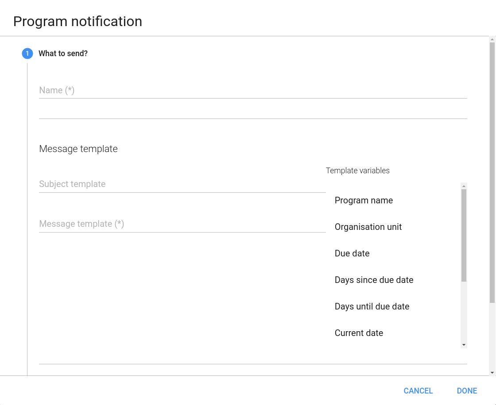
    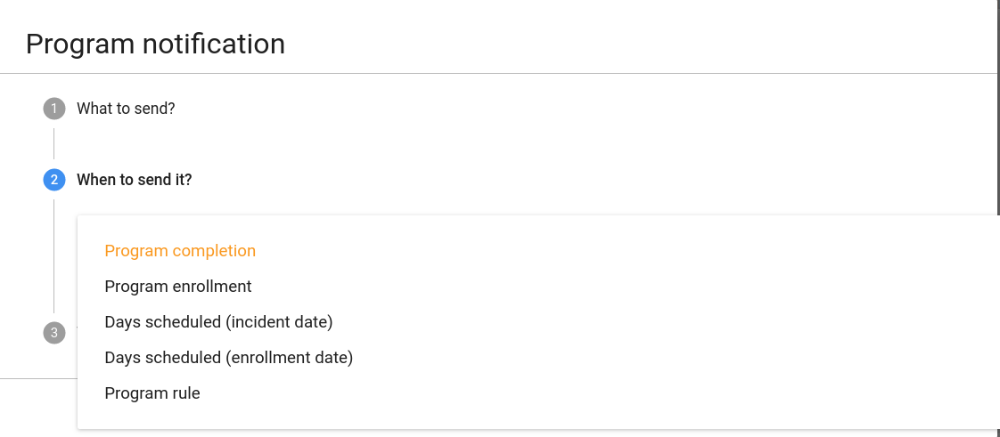
    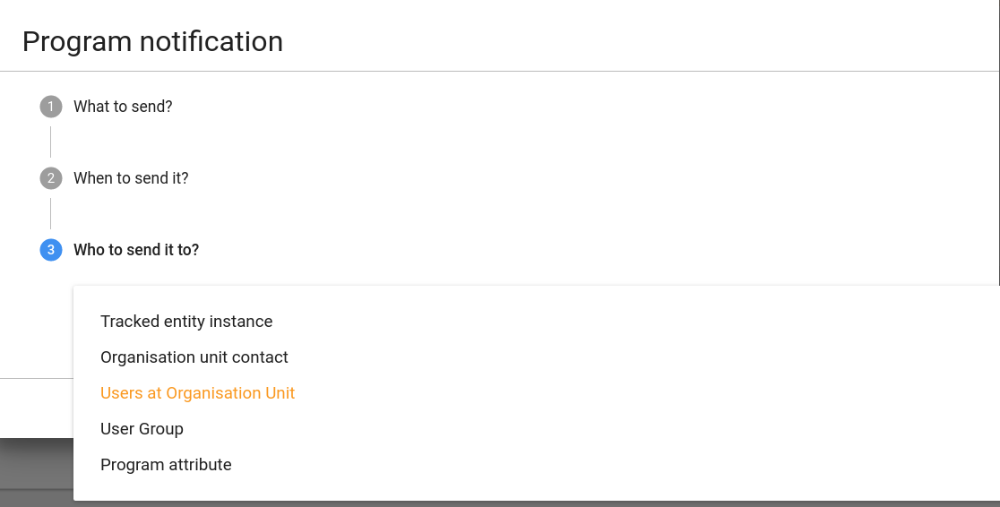

3.  Enter a **Name**.

4.  Create the **Subject template**.

    Double-click the parameters in the **Parameters** field to add them
    to your subject.

    > **Note**
    >
    > The subject is not included in text messages.

5.  Create the **Message template**.

    Double-click the parameter names in the **Parameters** field to add
    them to your message.

    Dear A{w75KJ2mc4zz}, You're now enrolled in V{program\_name}.

6.  In the **When-to-send it** field, select what should trigger the
    notification.

    | Trigger | Description | Note |
    |---|---|---|
    | Program enrollment | The program notification is sent when the TEI enrols in the program. | - |
    | Program completion | The program notification is sent when the program of TEI is completed | - |
    | Days scheduled (incident date) | The program notification is sent XX number of days before or after the incident date | You need to enter the number of days before or after the scheduled date that the notification will be send. |
    | Days scheduled (enrollment date) | The program notification is sent XX number of days before or after the enrollment date | You need to enter the number of days before or after the scheduled date that the notification will be send. |
    | Program Rule | Notification will be triggered as a result of program rule exeuction. | Program rule with ProgramRuleActionType.SENDMESSAGE need to be in place to make this trigger successful. |

7.  In the **Who-to-send-it** field, select who should receive the
    program notification.

    | Recipient type | Description | Note |
    |---|---|---|
    | Tracked entity instance | Receives program notifications via e-mail or text message. | To receive a program notification, the recipient must have an e-mail address or a phone number attribute. |
    | Organisation unit contact | Receives program notifications via e-mail or text message. | To receive a program notification, the receiving organisation unit must have a registered contact person with e-mail address and phone number. |
    | Users at organisation unit: | All users registered to the selected organisation unit receive program notifications via the internal DHIS2 messaging system. | - |
    | User group | All members of the selected user group receive the program notifications via the internal DHIS2 messaging system | - |
    | Limit To Hierarchy | Send notification only to those users who belong to any of the organisation unit in the hierarchy. | This option is only available when User Group is selected as recipient. |
    | Parent OrgUnit Only | Send notification only to those users who belong to parent organisation unit. | This option is only available when User Group is selected as recipient. |
    | Program Attribute | TrackedEntityAttribute can also be selected as recipient. | This parameter will only be effective if TrackedEntityAttribute value type is PHONE_NUMBER/EMAIL. |

8.  Click **Save**.

### Create a program stage notification

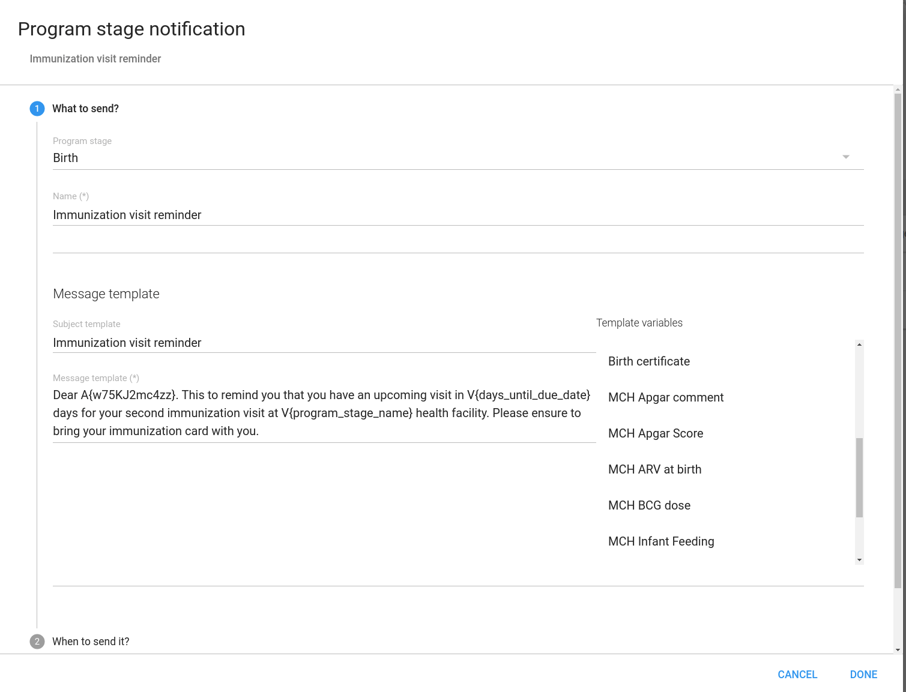

1.  Open the **Maintenance** app and click **Program and then
    notifications**.

    A list of existing program stage notifications for the selected
    program stage opens. If the program stage doesn't have any program
    stage notifications, the list is empty.

2.  Click on add button and select **Program stage notification**.

3.  Click **Add new**.

4.  Enter a **Name**.

5.  Create the **Subject template**.

    Double-click the parameter names in the **Parameters** field to add
    them to your subject.

    > **Note**
    >
    > The subject is not included in text messages.

6.  Create the **Message template**.

    Double-click the parameter names in the **Parameters** field to add
    them to your message.

    Dear A{w75KJ2mc4zz}, please come to your appointment the
    V{due\_date}.

7.  In the **When-to-send-it** field, select what should trigger the
    notification.

    | Trigger | Description | Note |
    |---|---|---|
    | Program stage completion | The program stage notification is sent when the program stage is completed | - |
    | Days scheduled (due date) | The program stage notification is sent XX number of days before or after the due date | You need to enter the number of days before or after the scheduled date that the notification will be send. |
    | Program Rule | Notification will be triggered as a result of program rule execution. | Program rule with ProgramRuleActionType.SENDMESSAGE need to be in place to make this trigger successful. |

    1. **Allow notification to be sent multiple times**

        This flag can be used if notification is required to be sent multiple times. For example in case of repeatable program stage, same notification will be sent as many times as the stage is repeated.

8.  In the **Recipients** field, select who should receive the program
    stage notification. You can select:

    | Recipient type | Description | Note |
    |---|---|---|
    | Tracked entity instance | Receives program notifications via e-mail or text message. | To receive a program stage notification, the recipient must have an e-mail address or a phone number attribute. |
    | Organisation unit contact | Receives program notifications via e-mail or text message. | To receive a program stage notification, the receiving organisation unit must have a registered contact person with e-mail address and phone number.       The system selects the same organisation unit as where the event took place. |
    | Users at organisation unit: | All users registered to the selected organisation unit receive program notifications via the internal DHIS2 messaging system. | - |
    | User group | All members of the selected user group receive the program notifications via the internal DHIS2 messaging system | - |
    | Limit To Hierarchy | Send notification only to those users who belong to any of the organisation unit in the hierarchy. | - |
    | Parent OrgUnit Only | Send notification only to those users who belong to parent organisation unit. | - |
    | Data Element | Data Element associated with ProgramStage can be selected as recipient. | Data Element will only be effective if DataElement has value type PHONE_NUMBER/EMAIL. |
    | Tracked Entity Attribute | Tracked Entity Attribute associated with ProgramInstance/Enrollment can be selected as recipient. | Attribute will only be effective if it has value type PHONE_NUMBER/EMAIL. |
    | Web Hook | Web hooks are automated HTTP messages sent to an external URL configured in web hook URL field. Notificaiton template variables will be sent as key-value pairs in the HTTP request. | - |

10.  Click **Save**.

### Reference information: Program notification parameters { #reference_information_event_program_notification_parameters } 

Table: Program notification parameters to use in program notifications

| Notification type | Variable name | Variable code |
|---|---|---|
| Program | Current date | `V{current_date}` |
|| Days since enrollment date | `V{days_since_enrollment_date}` |
|| Enrollment date | `V{enrollment_date}` |
|| Incident date | `V{incident_date}` |
|| Organisation unit name | `V{org_unit_name}` |
|| Program name | `V{program_name}` |
| Program stage | Current date | `V{current_date}` |
|| Days since due date | `V{days_since_due_date}` |
|| Days until due date | `V{days_until_due_date}` |
|| Due date | `V{due_date}` |
|| Organisation unit name | `V{org_unit_name}` |
|| Program name | `V{program_name}` |
|| Program stage name | `V{program_stage_name}` |
|| Event organisation unit | `V{event_org_unit_id}` |
|| Enrollment organisation unit | `V{enrollment_org_unit_id}` |
|| Program stage id | `V{program_stage_id}` |
|| Program id | `V{program_id}` |
|| Program instance id/Enrollment id | `V{enrollment_id}` |
|| Tracked entity id | `V{tracked_entity_id}` |
|| Event/Execution date | `V{event_date}` |

## Configure program indicators { #configure_program_indicator } 

### About program indicators { #about_program_indicators } 

Program indicators are expressions based on data elements and attributes
of tracked entities which can be used to calculate values based on a
formula. Program indicators consist of an aggregation type, an analytics
type, an expression and a filter.

Program indicators are evaluated based on the assigned aggregation type,
expression and filter. The order of evaluation is:

1.  The *filter* will filter the events which become part of the
    evaluation/aggregation routine.

2.  The *expression* will be evaluated per event.

3.  All evaluated expression values will be *aggregated* according to
    the aggregation type of the program indicator.

Table: Program indicator components

| Program rule component | Description |
|---|---|
| Aggregation type | The aggregation type determines how the program indicator will be aggregated. The following aggregation types are available:  * Average  * Average (number)  * Average (number, disaggregation)  * Average (sum in organisation unit hierarchy)  * Average (sum of numbers)  * Average (sum of numbers, disaggregation)  * Average (Yes/No)  * Count  * Custom  The "custom" aggregation type allows you to specify the aggregation type in-line in the expression. All other aggregation types are applied to the entire expression.  Using the "custom" aggregation type might lead to an exception of the order of evaluation described above where individual parts of the expression can be evaluated and aggregated, as opposed to the entire expression being evaluated prior to aggregation.  * Default  * Max  * Min  * None  * Standard deviation  * Sum  * Variance |
| Analytics type | The available analytics types are *event* and *enrollment*.   The analytics type defines whether the program indicator is calculated based on events or program enrollments. This has an impact on what type of calculations can be made.  * Events implies a data source where each event exists as an independent row. This is suitable for performing aggregations such as counts and sums.  * Enrollments implies a data source where all events for a single enrollment is combined on the same row. This allows for calculations which can compare event data from various program stages within a program enrollment. |
| Organisation unit field | Determines which organisation unit is assigned to program indicator values.   For Event programs (without registration) the options are:  * Event organisation unit (default): where the event took place  * any data elements of value type Organisation Unit (if any) assigned to the program   For Tracker programs (with registration) and analytics type *Enrollment* the options are:  * Registration organisation unit: where the tracked entity instance was created  * Enrollment organisation unit (default): where the tracked entity instance was enrolled in this program  * Owner at start organisation unit: where the tracked entity instance was owned at the start of the reporting period  * Owner at end organisation unit: where the tracked entity instance was owned at the end of the reporting period   For Tracker programs (with registration) and analytics type *Event* the options are:  * Event organisation unit (default): where the event took place   * any data elements of value type Organisation Unit (if any) assigned to the program  * Registration organisation unit: where the tracked entity instance was created  * Enrollment organisation unit: where the tracked entity instance was enrolled in this program  * Owner at start organisation unit: where the tracked entity instance was owned at the start of the reporting period  * Owner at end organisation unit: where the tracked entity instance was owned at the end of the reporting period |
| Analytics period boundaries | Defines the boundaries for the program indicator calculation. The boundaries determine which events or enrollments gets included in aggregations, always relative to the aggregate reporting period start and end. When creating the program indicator, the default boundaries will get preselected based on analytics type.  * For analytics type *event*, the default boundaries will be configured to encapsulate any events with an event date after the reporting period starts and before the reporting period ends.  * For analytics type *enrollment*, the default boundaries will encapsulate all enrollments with an enrollment date after the reporting date starts and before the reporting period ends. In addition, the default enrollment program indicator evaluates the newest event for all program stages regardless of date.   It is possible to change the upper and lower boundaries to include a longer or shorter period relative to the reporting period, or delete one of the boundaries - in effect returning all data before or after a certain period. It is also possible to add more constraints, for example to make an enrollment program indicator only include event data up to a given point in time.  * Boundary target: Can be *incident date*, *event date*, *enrollment date* or *custom*. Designates what is being constrained by the boundary.    *custom* is used make boundary that target either a date data element, tracked entity attribute or the presence of an event in a program stage. This is done with a custom expression on the form:  - Data element of type date: #{programStageUid.dataElementUid}.  `#{A03MvHHogjR.a3kGcGDCuk6}`   - Tracked entity attribute of type date: #{attributeUid}.  `A{GPkGfbmArby}`   - Presence of one event in a specific program stage: PS_EVENTDATE:programStageUid.  `PS_EVENTDATE:A03MvHHogjR`    **Note**  This boundary target is only applicable to  Analytics type Enrollment   * Analytics period boundary type: Defines whether the boundary is an end boundary - starting with "before...", or a start boundary - "after...". Also defines whether the boundary relates to the end of the aggregate reporting period or the start of the aggregate reporting period.  * Offset period by amount: In some cases, for example cohort analytics, the boundary should be offset relative to the aggregate reporting period when running pivots and reports. The offset period by amount is used to move the current boundary either back(negative) or forward(positive) in time. The amount and period type together will determine how big the offset will be. An example can be when making a simple enrollment cohort program indicator for a 1 year cohort, it might be enough to offset each boundary of the program indicator with "-1" and "Years"  * Period type: See above. Can be any period, e.g. *Weekly* or *Quarterly*. |
| Expression | The expression defines how the indicator is being calculated. The expression can contain references to various entities which will be substituted with a related values when the indicator is calculated:  * Data elements: Will be substituted with the value of the data element for the time period and organisation unit for which the calculation is done. Refers to both program stage and data element.  * Attributes: Will be substituted with the value of the attribute for the person / tracked entity for which the calculation is done.  * Variables: Will be substituted with special values linked to the program, including incident date and date of enrollment for the person, current date and count of values in the expression for the time period and organisation unit for which the calculation is done.  * Constants: Will be substituted with the value of the constant.   The expression is a mathematical expression and can also contain operators.   For single event programs and tracker programs with analytics type *event*, the expression will be evaluated *per event*, then aggregated according to its aggregation type.   For tracker programs with analytics type *enrollment*, the expression will be evaluated *per enrollment*, then aggregated according to its aggregation type. |
| Filter | The filter is applied to events and filters the data source used for the calculation of the indicator. I.e. the filter is applied to the set of events before the indicator expression is being evaluated. The filter must evaluate to either true or false. It filter is applied to each individual event. If the filter evaluates to true then the event is included later in the expression evaluation, if not it is ignored. The filter can, in a similar way as expressions, contain references to data elements, attributes and constants.   The program indicator filter can in addition use logical operators. These operators can be used to form logical expressions which ultimately evaluate to either true or false. For example you can assert that multiple data elements must be a specific value, or that specific attributes must have numerical values less or greater than a constant. |

In the **Maintenance** app, you manage the following program indicator
objects:

| Object type | Available functions |
|---|---|
| Program indicator | Create, edit, clone, share, delete, show details and translate |
| Program indicator group | Create, edit, clone, share, delete, show details and translate |

### Create or edit a program indicator { #create_program_indicator } 

> **Note**
>
> A program indicator belongs to exactly one program.

1.  Open the **Maintenance** app and click **Indicator** \> **Program
    indicator**.

2.  Click the add button.

3.  Select a **Program** and enter:

      - **Name**

      - **Short name**

      - **Code**

      - **Color**

      - **Icon**

      - **Description**
4.  Select number of **Decimals in data output**.

5.  Select an **Aggregation type**.

6.  Select a if you want to **Display in form**.

7.  Assign one or multiple **Legend**s.

8.  (Optional) Enter a **Category option combination for aggregate data
    export**.

9.  (Optional) Enter an **Attribute option combination for aggregate
    data export**.

10. Create the expression.

    1.  Click **Edit expression**.

    2.  Create the expression based on mathematical operators and the
        attributes, variables and constants listed to the right.

11. Create the filter.

    1.  Click **Edit filter**.

    2.  Create the expression based on mathematical operators and the
        attributes, variables and constants listed to the right.

12. Click **Save**.

### Create or edit a program indicator group { #create_program_indicator_group } 

1.  Open the **Maintenance** app and click **Indicator** \> **Program
    indicator group**.

2.  Click the add button.

3.  Enter **Name** and **Code**.

4.  In the list of available program indicators, double-click the
    program indicators you want to assign to your group.

5.  Click **Save**.

### Reference information: Expression and filter examples per value type { #reference_information_program_indicator } 

The table below shows examples of how to write expressions and filters
for different data element and attribute value types:

Table: Expression and filter examples per value type

| Value types | Example syntax |
|---|---|
| Integer   Negative integer   Positive or zero integer   Positive integer   Number   Percentage | Numeric fields, can be used for aggregation as an expression, or in filters:  `#{mCXR7u4kNBW.K0A4BauXJDl} >= 3` |
| Yes/No   Yes only | Boolean fields. Yes is translated to numeric 1, No to numeric 0. Can be used for aggregation as an expression, or in filters:  `#{mCXR7u4kNBW.Popa3BauXJss} == 1` |
| Text   Long text   Phone number   Email | Text fields. Can be checked for equality in filters:  `#{mCXR7u4kNBW.L8K4BauIKsl} == 'LiteralValue'` |
| Date   Age | Date fields. Most useful when combined with a d2:daysBetween function, which produces a number that can be aggregated as an expression or used in filters:  `d2:daysBetween(#{mCXR7u4kNBW.JKJKBausssl},V{enrollment_date}) > 100`  Can also directly be checked for equality in filters:  `#{mCXR7u4kNBW.JKJKBausssl} == '2011-10-28'` |

### Reference information: Functions, variables and operators to use in program indicator expressions and filters { #program_indicator_functions_variables_operators } 

An expression that includes both attributes, data elements and constants
looks like this:

    (A{GPkGfbmArby} + #{mCXR7u4kNBW.NFkjsNiQ9PH}) * C{bCqvfPR02Im}

An expression which uses the custom aggregation type and hence can use
inline aggregation types looks like
    this:

    (sum(#{mCXR7u4kNBW.K0A4BauXJDl} * #{mCXR7u4kNBW.NFkjsNiQ9PH}) / sum(#{mCXR7u4kNBW.NFkjsNiQ9PH})) * 100

Note how the "sum" aggregation operator is used inside the expression
itself.

#### Adding comments in program indicator expression or filter
Uniform syntax is supported for both singleline and multiline comments

    d2:hasValue(#{mCXR7u4kNBW.NFkjsNiQ9PH}) /* this is comment */
    
    d2:hasValue(#{mCXR7u4kNBW.NFkjsNiQ9PH}) && /* this is 
    comment */
    d2:daysBetween(V{enrollment_date},PS_EVENTDATE:mCXR7u4kNBW)
    
#### Functions to use in a program indicator expression or filter

The program indicator expression and filter support a range of
functions. The functions can be applied to data elements and attributes:

 

Table: Functions to use in a program indicator expression or filter

| Function | Arguments | Description |
|---|---|---|
| d2:hasValue | (object) | Returns true if the data element/attribute has a value. Can be used in filters to distinguish between the number 0 and no value, and to distinguish between explicit "No" and no selection for a Yes/No field. |
| d2:minutesBetween | (datetime, datetime) | Produces the number of minutes between two data elements/attributes of type "date and time". When the first argument datetime comes before the second argument datetime, the number will be positive - in the opposite case, the number will be negative. The static datetime format is 'yyyy-MM-dd hh:mm'. Any of the arguments can be replaced with PS_EVENTDATE:(programStageUid) to compare the latest event date from a given program stage. |
| d2:daysBetween | (date, date) | Produces the number of days between two data elements/attributes of type date. When the first argument date comes before the second argument date, the number will be positive - in the opposite case, the number will be negative. The static date format is 'yyyy-MM-dd'. Any of the arguments can be replaced with PS_EVENTDATE:(programStageUid) to compare the latest event date from a given program stage. |
| d2:weeksBetween | (date, date) | Produces the number of full weeks between two data elements/attributes of type date. When the first argument date comes before the second argument date, the number will be positive - in the opposite case, the number will be negative. The static date format is 'yyyy-MM-dd'. Any of the arguments can be replaced with PS_EVENTDATE:(programStageUid) to compare the latest event date from a given program stage. |
| d2:monthsBetween | (date, date) | Produces the number of full months between two data elements/attributes of type date. When the first argument date comes before the second argument date, the number will be positive - in the opposite case, the number will be negative. The static date format is 'yyyy-MM-dd'. Any of the arguments can be replaced with PS_EVENTDATE:(programStageUid) to compare the latest event date from a given program stage. |
| d2:yearsBetween | (date, date) | Produces the number of full years between two data elements/attributes of type date. When the first argument date comes before the second argument date, the number will be positive - in the opposite case, the number will be negative. The static date format is 'yyyy-MM-dd'. Any of the arguments can be replaced with PS_EVENTDATE:(programStageUid) to compare the latest event date from a given program stage. |
| d2:condition | (boolean-expr, true-expr, false-expr) | Evaluates the boolean expression and if true returns the true expression value, if false returns the false expression value. The conditional expression must be quoted. The true-expr and false-expr arguments must follow the rules of any program indicator expression (including functions). |
| d2:zing | (expression) | Returns zero if the expression is negative, otherwise returns the expression value. The expression must follow the rules of any program indicator expression (including functions). |
| d2:oizp | (expression) | Returns one if the expression is zero or positive, otherwise returns zero. The expression must follow the rules of any program indicator expression (including functions). |
| d2:zpvc | (object, [,object ...]) | Returns the number of numeric zero and positive values among the given object arguments. Can be provided any number of arguments. |
| d2:relationshipCount | ([relationshipTypeUid]) | Produces the number of relationships of the given type that is connected to the enrollment or event. When no type is given, all types are counted. |
| d2:count | (dataElement) | Useful only for enrollment program indicators. Counts the number of data values that has been collected for the given program stage and data element in the course of the enrollment. The argument data element is supplied with the #{programStage.dataElement} syntax. |
| d2:countIfValue | (dataElement, value) | Useful only for enrollment program indicators. Counts the number of data values that matches the given literal value for the given program stage and data element in the course of the enrollment. The argument data element is supplied with the #{programStage.dataElement} syntax. The value can be a hard coded text or number, for example 'No_anemia' if only the values containing this text should be counted. |
| d2:countIfCondition | (dataElement, condition) | Useful only for enrollment program indicators. Counts the number of data values that matches the given condition criteria for the given program stage and data element in the course of the enrollment. The argument data element is supplied with the #{programStage.dataElement} syntax. The condition is supplied as a expression in single quotes, for example '<10' if only the values less than 10 should be counted. |
| if | (boolean-expr, true-expr, false-expr) | Evaluates the boolean expression and if true returns the true expression value, if false returns the false expression value. This is identical to the d2:condition function except that the boolean-expr is not quoted. |
| is | (expr1 in expression [, expression ...]) | Returns true if expr1 is equal to any of the following expressions, otherwise false. |
| isNull | (object) | Returns true if the object value is missing (null), otherwise false. |
| isNotNull | (object) | Returns true if the object value is not missing (not null), otherwise false. |
| firstNonNull | (object [, object ...]) | Returns the value of the first object that is not missing (not null). Can be provided any number of arguments. Any argument may also be a numeric or string literal, which will be returned if all the previous objects have missing values. |
| greatest | (expression [, expression ...]) | Returns the greatest (highest) value of the expressions given. Can be provided any number of arguments. Each expression must follow the rules of any program indicator expression (including functions). |
| least | (expression [, expression ...]) | Returns the least (lowest) value of the expressions given. Can be provided any number of arguments. Each expression must follow the rules of any program indicator expression (including functions). |
| log | (expression [, base ]) | Returns the natural logarithm (base e) of the numeric expression. If an integer is given as a second argument, returns the logarithm using that base. |
| log10 | (expression) | Returns the common logarithm (base 10) of the numeric expression. |

A filter that uses the "hasValue" function looks like this:

    d2:hasValue(#{mCXR7u4kNBW.NFkjsNiQ9PH})

A filter that uses the "relationshipCount(relationshipTypeUid)" function looks like this:

    d2:relationshipCount('KLkjshoQ90U')

A filter that uses the "is( x in y, z )" function looks like this:

    is(#{oahc9ooVema} in 'New', 'Relapse')

An expression that uses the "zing" and "oizp" functions looks like this:

    d2:zing(A{GPkGfbmArby}) + d2:oizp(#{mCXR7u4kNBW.NFkjsNiQ9PH}))

An expression that uses the "daysBetween" function looks like this:

    d2:daysBetween(#{mCXR7u4kNBW.k8ja2Aif1Ae},'2015-06-01')

An expression that uses the "yearBetween" function to compare the latest event of the program stage 'mCXR7u4kNBW' to the enrollment date looks like this:

    d2:daysBetween(V{enrollment_date},PS_EVENTDATE:mCXR7u4kNBW)

An expression that uses the "condition" function looks like this:

    d2:condition('#{mCXR7u4kNBW.NFkjsNiQ9PH} > 100',150,50)

An expression that uses the "countIfValue" function to only count the number of times the value 10 has been collected looks like this:

    d2:countIfValue(#{mCXR7u4kNBW.NFkjsNiQ9PH}),10)

An expression that uses the "zpvc" function looks like this:

    d2:zpvc(A{GPkGfbmArby}),#{mCXR7u4kNBW.NFkjsNiQ9PH}),4,-1)

An expression that uses the "if" and "isnull" functions looks like this:

    if(isNull(A{GPkGfbmArby}),10,20)

An expression that uses the "firstNonNull" function looks like this:

    firstNonNull(A{GPkGfbmArby}),#{mCXR7u4kNBW.NFkjsNiQ9PH},44)

An expression that uses the "greatest" function looks like this:

    greatest(#{mCXR7u4kNBW.k8ja2Aif1Ae},#{mCXR7u4kNBW.NFkjsNiQ9PH},1)

#### Variables to use in a program indicator expression or filter

The program indicator expression and filter support a range of
variables:

Table: Variables to use in a program indicator expression or filter

| Variable | Description |
|---|---|
| event_date | The date of when the event or the last event in the enrollment took place. |
| creation_date | The date of when an event or enrollment was created in the system. |
| due_date | The date of when an event is due. |
| sync_date | The date of when the event or enrollment was last synchronized with the Android app. |
| incident_date | The date of the incidence of the event. |
| enrollment_date | The date of when the tracked entity instance was enrolled in the program. |
| enrollment_status | Can be used to include or exclude enrollments in certain statuses.   When calculating the haemoglobin improvement/deterioration throughout a pregnancy, it might make sense to only consider completed enrollments. If non-completed enrollments is not filtered out, these will represent half-finished ANC followups, where the final improvement/deterioration is not yet established. |
| current_date | The current date. |
| value_count | The number of non-null values in the expression part of the event. |
| zero_pos_value_count | The number of numeric positive values in the expression part of the event. |
| event_count | The count of events (useful in combination with filters). Aggregation type for the program indicator must be COUNT. |
| enrollment_count | The count of enrollments (useful in combination with filters). Aggregation type for the program indicator must be COUNT.  |
| tei_count | The count of tracked entity instances (useful in combination with filters). Aggregation type for the program indicator must be COUNT. |
| org_unit_count | The count of organisation units (useful in combination with filters). Aggregation type for the program indicator must be COUNT. |
| program_stage_name | Can be used in filters for including only certain program stages in a filter for tracker programs. Uses the name of the program stage:  `V{program_stage_name} == 'ANC first visit'` |
| program_stage_id | Can be used in filters for including only certain program stages in a filter for tracker programs. Uses the unique identifier of the program stage:  `V{program_stage_id} == 'YPSSfbmAtt1'` |
| analytics_period_start | Can be used in filters or expressions for comparing any date to the first date in each reporting period.  `d2:daysBetween(#{WZbXY0S00lP.w4ky6EkVahL}, V{analytics_period_start})` |
| analytics_period_end | Can be used in filters or expressions for comparing any date to the last inclusive date in each reporting period. |
| event_status | Can be used in filters or expressions for comparing event status.  `V{event_status} == 'COMPLETED'` |
| completed_date | Contains completion date of the event. If the event is not yet complete, then "completed_date" contains nothing. |

A filter that uses the "Analytics period end" variable to only include
women who has an LMP that would be in the first
    trimester:

    d2:daysBetween(#{WZbXY0S00lP.w4ky6EkVahL}, V{analytics_period_end}) <= 84

An expression that uses the "value count" variable looks like
    this:

    (#{A03MvHHogjR.a3kGcGDCuk6} + #{A03MvHHogjR.wQLfBvPrXqq}) / V{value_count}

An expression that uses the "event\_date" and "incident\_date" variables
looks like this:

    d2:daysBetween(V{incident_date},V{event_date})

#### Operators to use in a program indicator filter

Table: Operators to use in a program indicator filter

| Operator | Description |
|---|---|
| and | Logical AND |
| or | Logical OR |
| == | Equal to |
| != | Not equal to |
| < | Less than |
| <= | Less than or equal to |
| > | Greater than |
| >= | Greater than or equal to |

These operators can be used to form logical expressions which ultimately
evaluate to either true or false. For example you can assert that
multiple data elements must be a specific value, or that specific
attributes must have numerical values less or greater than a constant.

A filter that uses both attributes and data elements looks like this:

    A{cejWyOfXge6} == 'Female' and #{A03MvHHogjR.a3kGcGDCuk6} <= 2

> **Tip**
>
> DHIS2 is using the JEXL library for evaluating expressions which
> supports additional syntax beyond what is covered in this
> documentation. See the reference at the [project home
> page](http://commons.apache.org/proper/commons-jexl/reference/syntax.html)
> to learn how you can create more sophisticated expressions

## Configure program rules { #configure_program_rule } 

### About program rules { #about_program_rules } 

Program rules allows you to create and control dynamic behaviour of the
user interface in the **Tracker Capture** and **Event Capture** apps.
During data entry, the program rules expressions are evaluated each time
the user interface is displayed, and each time a data element is
changed. Most types of actions will take effect immediately when the
user enters values in the **Tracker Capture** and **Event Capture**
apps.

Table: Program rule components

| Program rule component | Description |
|---|---|
| Program rule action | Each program rule contains one or multiple actions. These are the behaviours that are triggered in the user interface when the expression is true. Actions will be applied at once if the expression is true, and will be reverted if the expression is no longer true. There are several types of actions and you can have several actions in one program rule. |
| Program rule expression | Each program rule has a single expression that determines whether the program rule actions should be triggered, if the expression evaluates to true. If the expression is true the program rule is in effect and the actions will be executed. If the expression is false, the program rule is no longer in effect and the actions will no longer be applied.   You create the expression with standard mathematical operators, custom functions, user-defined static values and program rule variables. The program rule variables represent attribute and data element values which will be evaluated as part of the expression. |
| Program rule variable | Program rule variables lets you include data values and attribute values in program rule expressions. Typically, you'll have to create one or several program rule variables before creating a program rule. This is because program rules expressions usually contain at least one data element or attribute value to be meaningful.   The program rule variables are shared between all rules in your program. When you create multiple program rules for the same program, these rules will share the same library of program rule variables. |

In the **Maintenance** app, you manage the following program rule
objects:

| Object type | Available functions |
|---|---|
| Program rule | Create, edit, clone, delete, show details and translate |
| Program rule variable | Create, edit, clone, share, delete, show details and translate |

### Workflow { #workflow_program_rule } 

1.  In the **Maintenance** app, create program rule variable(s) if
    needed.

2.  In the **Maintenance** app, create the program rule:

    1.  Enter the program rule details.

    2.  Create the program rule expression.

    3.  Define the program rule actions.

3.  In the **Tracker Capture** or **Event Capture** apps, verify that
    the program rule behaves as expected.

### Create or edit a program rule variable { #create_program_rule_variable } 

1.  Open the **Maintenance** app and click **Program** \> **Program rule
    variable**.

2.  Click the add button.

3.  Select a **Program** and enter a **Name**

    Please note that the name of the program may not contain any of the following exlcuded keywords:
    - `and`
    - `or`
    - `not`
      
4.  Select if you want to **Use code for option set**.

    This option is only effective when the data element or tracked
    entity attribute is connected to an option set. If you don't select
    this option, the program rule variable will be populated with the
    option set's name. If you select the option, the program rule
    variable will be populated with the option set's code instead.

5.  Select a **Source type** and enter the required information.

    Depending on the source type, you'll have to select, for example, a
    **Program stage,** **Data element** or **Tracked entity attribute**.

    The source types determine how the program rule variable is
    populated with a value.

    | Source type | Description |
    |---|---|
    | **Data element from the newest event for a program stage** | This source type works the same way as **Data element from the newest event in the current program**, except that it only evaluates values from one program stage.       This source type can be useful in program rules where the same data element is used in several program stages, and a rule needs to evaluate the newest data value from within one specific stage. |
    | **Data element from the newest event in the current program** | This source type is used when a program rule variable needs to reflect the newest known value of a data element, regardless of what event the user currently has open.       This source type is populated slightly differently in **Tracker Capture** and **Event Capture** apps:       **Tracker Capture**: the program rule variable will be populated with the newest data value collected for the given data element within the enrollment.       **Event Capture**: the program rule variable will be populated with the current events data.  **NB** Future dates are "newer" than current or past dates. |
    | **Data element in current event** | Program rule variables with this source type will contain the data value from the same event that the user currently has open.       This is the most commonly used source type, especially for skip logic (hide actions) and warning/error rules. |
    | **Data element from previous event** | Program rule variables with this source type will contain the value from a specified data element from a previous event. Only older events is evaluated, not including the event that the user currently has open.       This source type is commonly used when a data element only should be collected once during an enrollment, and should be hidden in subsequent events.       Another use case is making rules for validating input where there is an expected progression from one event to the next - a rule can evaluate whether the previous value is higher/lower and give a warning if an unexpected value is entered. |
    | **Calculated value** | Program rule variable with this source type is not connected directly to any form data - but will be populated as a result of some other program rules **ASSIGN** action.       This variable will be used for making preliminary calculations, having a **ASSIGN** program rule action and assigning a value, this value can be used by other program rules - potentially making the expressions simpler and more maintanable.       These variables will not be persisted and will stay in memory only during the exectution of the set of program rules. Any program rule that assigns a data value to a preliminary calculated value would normally also have a **priority** assigned - to make sure that the preliminary caculation is done before the rule that consumes the calculated value. |
    | **Tracked entity attribute** | Populates the program rule variable with a specified tracked entity attribute for the current enrollment.       Use this is the source type to create program rules that evaluate data values entered during registration.       This source type is also useful when you create program rules that compare data in events to data entered during registration.       This source type is only used for tracker programs (programs with registration). |

6.  Click **Save**.

### Create or edit a program rule { #create_program_rule } 

> **Note**
>
> A program rule belongs to exactly one program.

1.  Open the **Maintenance** app and click **Program** \> **Program
    rule**.

2.  Click the add button.

3.  Enter the program rule details. These fields are not shown to the
    end user, they are only meant for the program administrator.

      - **Program**

      - **Trigger rule only for program stage**

        If a program stage is selected, the program rule will only run for the selected program stage,
        as opposed to being run for every program stage in the program.

      - **Name**

      - **Description**

      - **Priority**

        Let's say you have 16 program rules in your program. You
        configure the program rules with the following priority
        settings:

          - Priority 1 for program rule A

          - Priority 2 for program rules B - K

          - No priority for program rules L - P

        Result: the system runs the program rules in the following
        order:

        1.  Program rule A

        2.  Program rules B - K (you can't find out or configure in
            which order the system runs these program rules)

        3.  Program rules L - P.

4.  Click **Enter program rule expression** and create the program rule
    expression with the help of variables, functions and operators.

5.  Click **Define program rule actions** and create the actions
    executed when the expression is true.

    1.  Click the add button, select an **Action** and enter the
        required information.

        Depending on the action type, you'll have to perform different
        types of settings. For some action types, you must also enter
        free text or create expressions.

        | Action type | Required settings | Description |
        |---|---|---|
        ||||
        | **Assign value** | **Data element to assign value to**           **Program rule variable to assign value to**           **Expression to evaluate and assign** | Used to help the user calculate and fill out fields in the data entry form. The idea is that the user shouldn’t have to fill in values that the system can calculate, for example BMI.           When a field is assigned a value, the user sees the value but the user can't edit it.           Example from Immunization stock card i Zambia: The data element for vaccine stock outgoing balance is calculated based on the data element for incoming stock balance minus the data elements for consumption and wastage.           Advanced use: configure an 'assign value' to do a part of a calculation and then assign the result of the calculation to a program rule variable. This is the purpose with the "Calculated value" program rule variable. |
        | **Display text** | **Display widget**           **Static text**           **Expression to evaluate and display after static text** | Used to display information that is not an error or a warning, for example feedback to the user. You can also use this action to display important information, for example the patient's allergies, to the user. |
        | **Display key/value pair** | **Display widget**           **Key label**           **Expression to evaluate and display as value** | Used to display information that is not an error or a warning.           Example: calculate number of weeks and days in a pregnancy and display it in the format the clinician is used to see it in. The calculation is based on previous recorded data. |
        | **Error on complete** | **Data element to display error next to**           **Tracked entity attribute to display error next to**           **Static text**           **Expression to evaluate and display after static text** | Used whenever you've cross-consistencies in the form that must be strictly adhered to. This action prevents the user from continuing until the error is resolved.           This action differs from the regular **Show error** since the error is not shown until the user tries to actually complete the form.           If you don't select a data element or a tracked entity attribute to display the error next to, make sure you write a comprehensive error message that helps the user to fix the error. |
        | **Hide field** | **Data element to hide**           **Tracked entity attribute to hide**           **Custom message for blanked field** | Used when you want to hide a field from the user.           **Custom message for blanked field** allows you to define a custom message displayed to the user in case the program rule hides and blanks out the field after the user typed in or selected a value.           If a hide field action hides a field that contains a value, the field will always removed. If no message is defined, a standard message will be displayed to alert the user. |
        | **Hide section** | **Program stage section to hide** | Used when you want to hide a section in a program stage from the user.  |
        | **Prevent adding new events to stage** | **Program stage where users will not be able to add new events** | Used when you do not want users to add any more events to a program stage. Existing events will not be hidden. |
        | **Make field mandatory** | **Data element to make mandatory**           **Tracked entity attribute to make mandatory** | Used when you want to make a data element or tracked entity attribute mandatory so they have to be filled out before the form can be saved. |
        | **Show error** | **Data element to display error next to**           **Tracked entity attribute to display error next to**           **Static text**           **Expression to evaluate and display after static text** | Used whenever there are rules which must strictly be adhered to. The show error action prevents the user from continuing until the error is resolved.           Such a strict validation should only be used when it's certain that the evaluated expression is never true unless the user has made a mistake in data entry.           It's mandatory to define a message that is shown to the user when the expression is true and the action is triggered.           You can select which data element or tracked entity attribute to link the error to. This will help the user to fix the error.           In case several data elements or attributes are involved, select the one that is most likely that the user would need to change. |
        | **Show warning** | **Data element to display warning next to**           **Tracked entity attribute to display warning next to**           **Static text**           **Expression to evaluate and display after static text** | Used to give the user a warning about the entered data, but at the same time to allow the user to save and continue.           You can use warnings to help the user avoid errors in the entered data, while at the same time allow the user to consciously disregard the warnings and save a value that is outside preset expectations.           **Static text** defines the message shown to the user when the expression is true and the action is triggered.           You can select which data element or tracked entity attribute to link the error to. This will help the user to fix the error.           In case several data elements or attributes are involved, select the one that is most likely that the user would need to change. |
        | **Warning on complete** | **Data element to display warning next to**           **Tracked entity attribute to display warning next to**           **Static text**           **Expression to evaluate and display after static text** | Used to give the user a warning if he/she tries to complete inconsistent data, but at the same time to allow the user to continue. The warning is shown in a dialog when the user completes the form.           **Static text** defines the message shown to the user when the expression is true and the action is triggered. This field is mandatory.           You can select which data element or tracked entity attribute to link the error to. This will help the user to fix the error.           If you don't select a data element or a tracked entity attribute to display the error next to, make sure you write a comprehensive error message that helps the user to fix the error. |
        | **Send Message** | **Message template to send** | Send Message triggers a notification based on provided message template. This action will be taken immediately. The message template will be parsed and variables will be substituted with actual values. |
        | **Schedule Message** | **Message template to send**           **Data field which contains expression to evaluate the date which notification should be sent at. If this expression results in any value other than Date, then resultant will be discarded and notification will not get scheduled.** | Schedule Message will schedule notification at date provided by Expression in the data field. Sample expression is given below          d2:addDays( '2018-04-20', '2' )          Message template will be parsed and variables will be substituted with actual values. |
        | **Hide option** | **Data element to hide option for**           **Tracked entity attribute to hide option for**           **Option that should be hidden** | Used to selectively hide a single option for an option set in a given data element/tracked entity attribute.           When combined with **show option group** the **hide option** takes presedence. |
        | **Hide option group** | **Data element to hide option group for**           **Tracked entity attribute to hide option group for**           **Option group that should be hidden** | Used to hide all options in a given option group and data element/tracked entity attribute.           When combined with **show option group** the **hide option group** takes precedence. |
        | **Show option group** | **Data element to show option group for**           **Tracked entity attribute to show option group for**           **Option group that should be shown** | Used to show only options from a given option group in a given data element/tracked entity attribute. To show an option group implicitly hides all options that is not part of the group(s) that is shown. |

    2.  Click **Save**.

    3.  (Optional) Repeat above steps to add more actions.

6.  Click **Save**.

### Example: Program rules { #program_rule_examples } 

> **Note**
>
> You can view all examples on the demo server:
> <https://play.dhis2.org/dev/dhis-web-maintenance/#/list/programSection/programRule>

This example shows how to configure a program rule which calculate
number of weeks and days in a pregnancy and display the result in the
format the clinician is used to see it in. The calculation is based on
previous recorded
    data.

1.  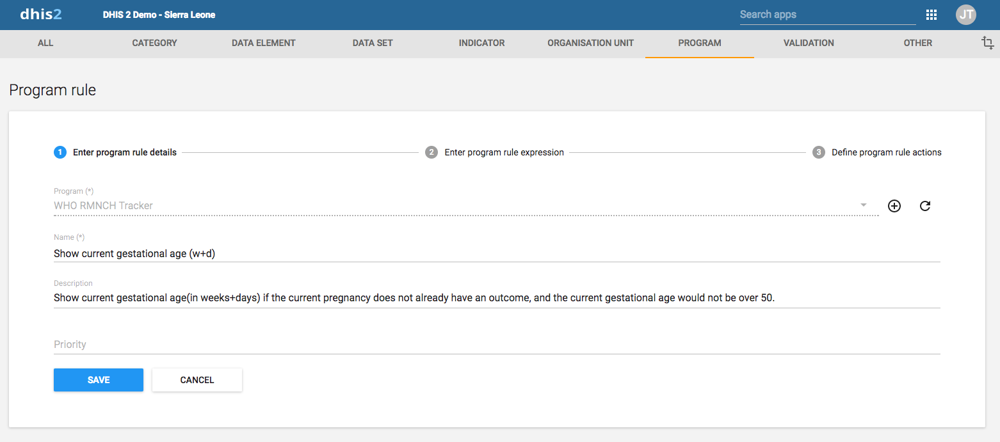

2.  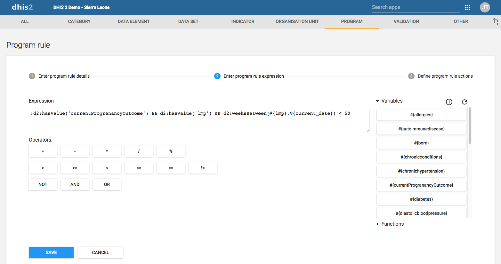

3.  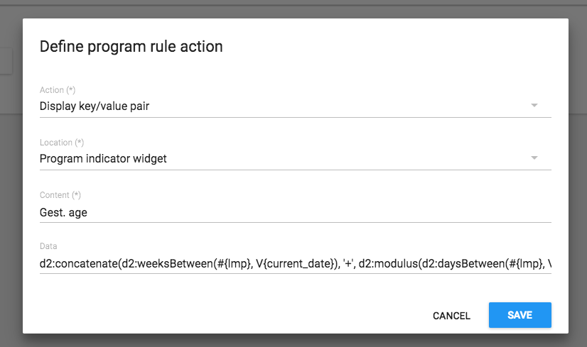

    The full expression in the **Data** field:

        d2:concatenate(d2:weeksBetween(#{lmp}, V{current_date}), '+',
        d2:modulus(d2:daysBetween(#{lmp}, V{current_date}), 7))

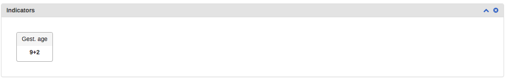

This example shows how to configure a program rule to display text in
the Feedback widget in the **Tracker Capture**
    app.

1.  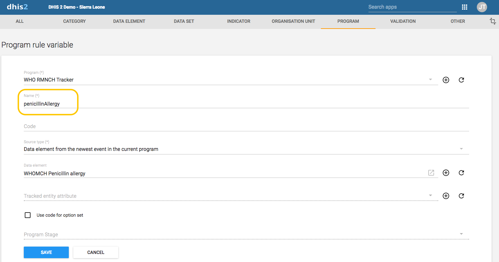

2.  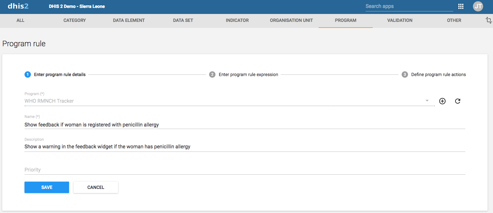

3.  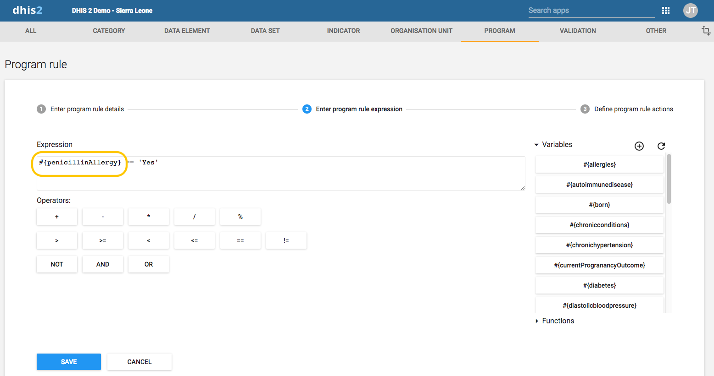

4.  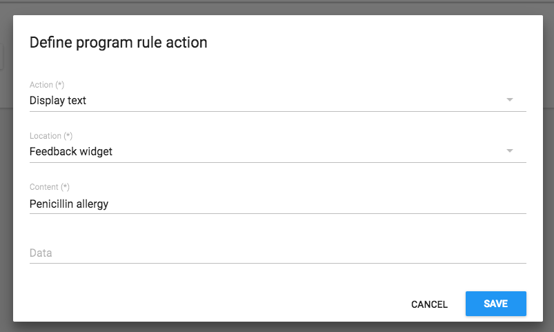

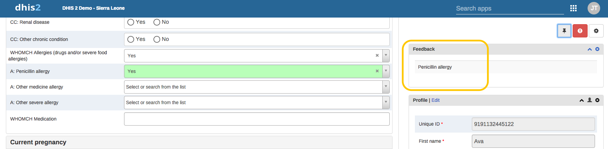

This example shows how to configure a program rule to always display
certain data in the Feedback widget in the **Tracker Capture** app. This
is useful when you want to make sure that vital data, for example
medicine allergies, is always
    visible.

1.  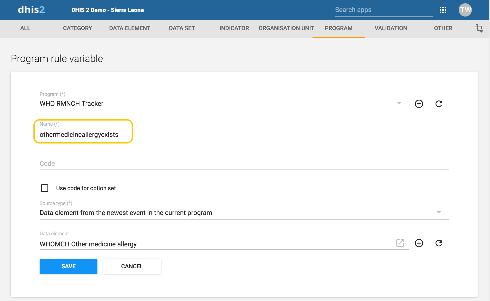

2.  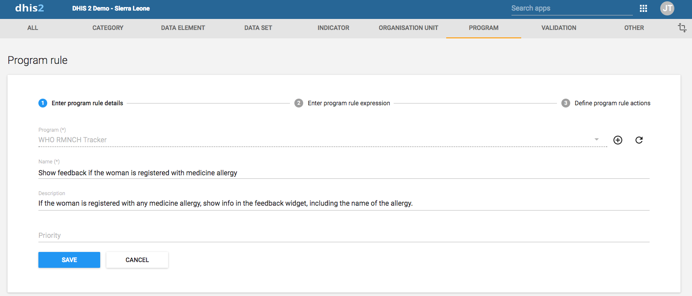

3.  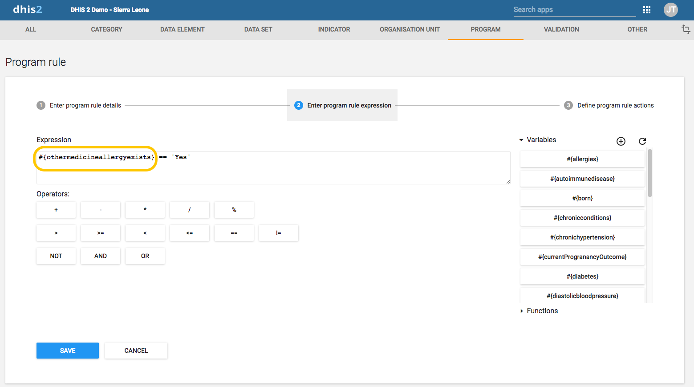

4.  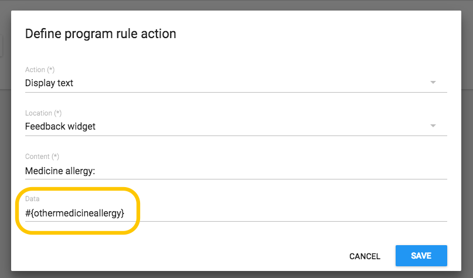

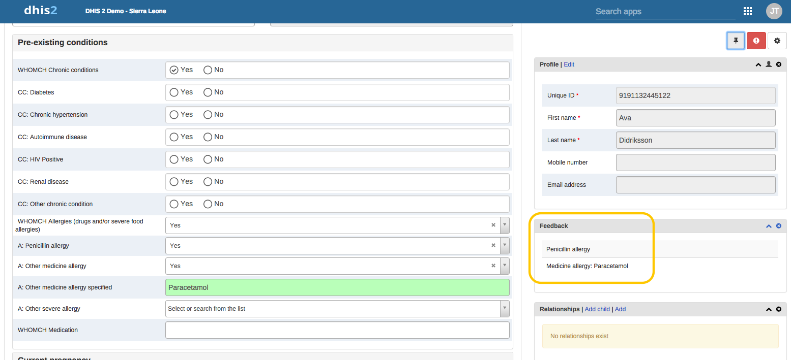

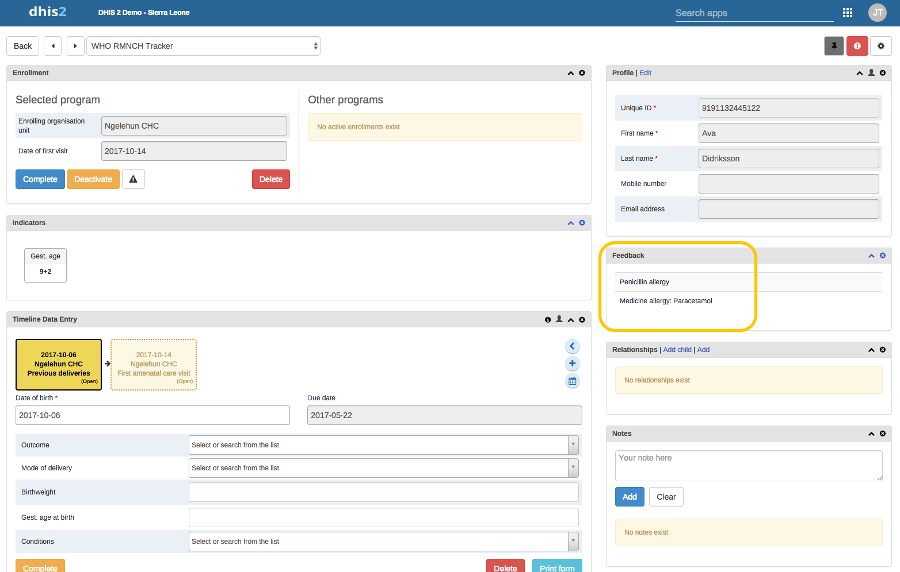

By using a program rule of type "Assign value" you can calculate the
"Gestational age at visit" value and fill it in the data entry form. You
configure the program rule to calculate "Gestational age at visit" based
on either "LMP date" or "Ultrasound estimated due
date".

1.  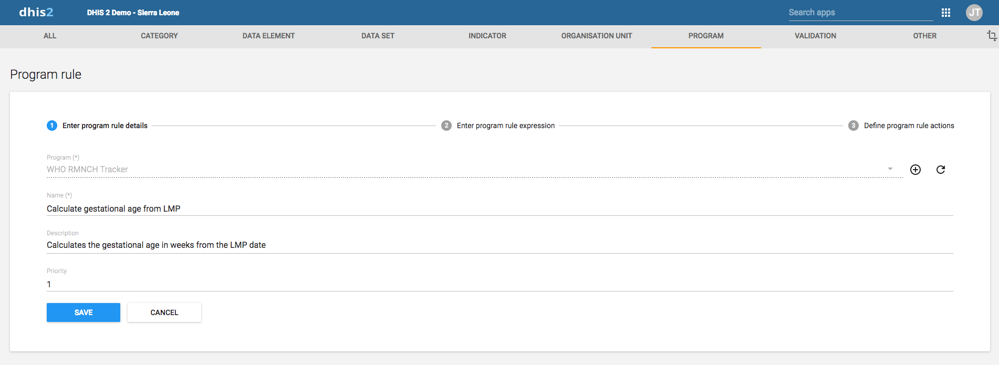

2.  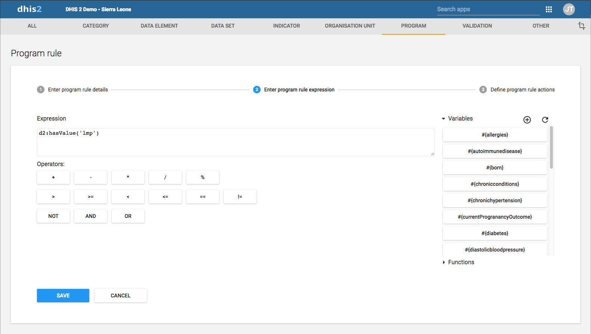

3.  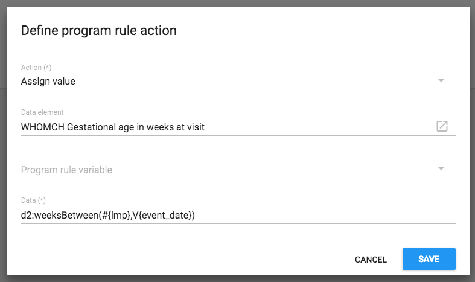

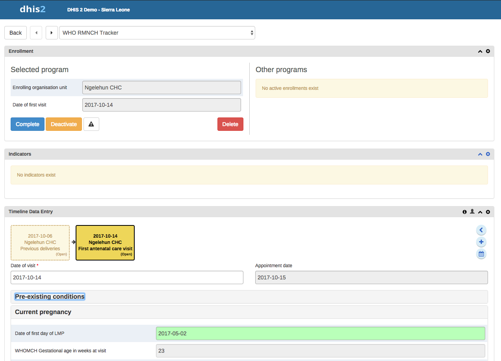

### Reference information: Operators and functions to use in program rule expression { #program_rules_operators_functions } 

> **Tip**
>
> You can nest functions within each other and with sub-expressions to
> form more complex conditions. An example that produces the gestational
> age in weeks, based on last menstrual date:
>
>     d2:floor( d2:daysBetween(#{lastMenstrualDate},V{event_date}) / 7 )

> **Tip**
>
> The source type will determine how the d2: function calls will
> evaluate a (sourcefield) parameter.
>
> Example: where \#{hemoglobinCurrent} is set to source type **Data
> element in current event**. The following function call with evaluate
> whether haemoglobin is entered in the current event.
>
>     d2:hasValue( 'hemoglobinCurrent' )
>
> Example: where \#{hemoglobin} is set to source type **Data element
> from the newest event in the current program**. The following function
> call with evaluate whether there exists a value for the haemoglobin in
> any event in the enrollment.
>
>     d2:hasValue( 'hemoglobin' )
>
> Example: where \#{hemoglobinPrevious} is set to source type **Data
> element from previous event** . The following function call with
> evaluate whether there exists a value for the haemoglobin among the
> events preceding the current event.
>
>     d2:hasValue( 'hemoglobinPrevious' )

Table: Possible operators to use in a program rule expression

| Operator | Description |
|---|---|
| + | Add numbers together |
| - | Subtract numbers from each other |
| \* | Multiply two numbers |
| / | Divide two numbers |
| % | The modulus of two numbers |
| && | Logical AND. True only when the expression on the left and right side is true. The left and right side can be yes/no, yes only or a sub-expression in parenthesis. |
| &#124;&#124; | Logical OR. True when either the expression on the left or the expression on the right side is true. The left and right side can be yes/no, yes only or a sub-expression in parenthesis. |
| > | Left number greater than right number |
| >= | Left number greater than or equal to right number |
| < | Left number less than right number |
| <= | Left number less than or equal to right number. |
| == | Left side equal to right side. Supports numbers, text, yes/no and yes only. |
| != | Left side not equal to right side. Supports numbers, text, yes/no and yes only. |
| ! | Negates the following value. Can be used for yes/no, yes only or a sub-expression in parenthesis. |
| () | Parenthesis is used to group sub-expressions. |

Table: Custom functions to use in a program rule expression

| Function | Arguments | Description |
|---|---|---|
| d2:addDays | (date, number) | Produces a date based on the first argument date, adding the second argument number of days.  An example calculating the pregnancy due date based on the last menstrual period:  `d2:addDays(#{lastMenstrualDate},'283')` |
| d2:ceil | (number) | Rounds the input argument **up** to the nearest whole number.  Example:  `d2:ceil(#{hemoglobinValue})` |
| d2:concatenate | (object, [,object, object,...]) | Produces a string concatenated string from the input parameters. Supports any number of parameters. Will mainly be in use in future action types, for example to display gestational age with d2:concatenate('weeks','+','gestationalageDays'). |
| d2:contains | (text,text, ...) | Searches an expression for one or more substrings. Returns true if the expression contains all the substrings. For example, the following are all true: contains("abcd", "abcd"); contains("abcd", "b"); and contains("abcd", "ab", "bc"). Comparisons are case-sensitive. |
| d2:containsItems | (text,text, ...) | Searches an expression for one or more items. The expression is made up of comma-separated elements. containsItems returns true if every item exactly matches an element in the expression. For example, containsItems("abcd", "abcd") and containsItems("ab,cd", "ab", "cd") are true, but containsItems("abcd", "b") and containsItems("abcd", "ab", "bc") are false. Comparisons are case-sensitive. containsItems can be used for multi-valued data elements to see if an item is contained in the data element values. |
| d2:count | (sourcefield) | Counts the number of values that is entered for the source field in the argument. The source field parameter is the name of one of the defined source fields in the program - see example  Example usage where #{previousPregnancyOutcome} is one of the source fields in a repeatable program stage "previous pregnancy":  `d2:count('previousPregnancyOutcome')` |
| d2:countIfValue | (sourcefield,text) | Counts the number of matching values that is entered for the source field in the first argument. Only occurrences that matches the second argument is counted. The source field parameter is the name of one of the defined source fields in the program - see example.  Example usage where #{previousPregnancyOutcome} is one of the source fields in a repeatable program stage "previous pregnancy". The following function will produce the number of previous pregnancies that ended with abortion:  `d2:countIfValue('previousPregnancyOutcome','Abortion')` |
| d2:countIfZeroPos | (sourcefield) | Counts the number of values that is zero or positive entered for the source field in the argument. The source field parameter is the name of one of the defined source fields in the program - see example.  Example usage where #{fundalHeightDiscrepancy} is one of the source fields in program, and it can be either positive or negative. The following function will produce the number of positive occurrences:  `d2:countIfZeroPos('fundalHeightDiscrepancy')` |
| d2:daysBetween | (date, date) | Produces the number of days between the first and second argument. When the first argument date comes before the second argument date, the number will be positive - in the opposite case, the number will be negative. The static date format is 'yyyy-MM-dd'.  Example, calculating the gestational age(in days) of a woman, based on the last menstrual period and the current event date:  `d2:daysBetween(#{lastMenstrualDate},V{event_date})` |
| d2:extractDataMatrixValue | Get GS1 value based on application identifier |  Given a field value formatted with the gs1 data matrix standard and a string key from the GS1 application identifiers. The function looks and returns the value linked to the provided key.  Example expression:  `d2:extractDataMatrixValue( 'gtin', A{GS1 Value} )` |
| d2:floor | (number) | Rounds the input argument **down** to the nearest whole number.  An example producing the number of weeks the woman is pregnant. Notice that the sub-expression #{gestationalAgeDays}/7 is evaluated before the floor function is executed:  `d2:floor(#{gestationalAgeDays}/7)` |
| d2:hasUserRole | (user role) | Returns true if current user has this role otherwise false  Example expression:  d2:hasUserRole('UYXOT4A3ASA') |
| d2:hasValue | (sourcefield) | Evaluates to true of the argument source field contains a value, false if no value is entered.  Example usage, to find if the source field #{currentPregnancyOutcome} is yet filled in:  `d2:hasValue('currentPregnancyOutcome')` |
| d2:inOrgUnitGroup | (text) | Evaluates whether the current organisation unit is in the argument group. The argument can be defined with either ID or organisation unit group code. The current organisation unit will be the event organisation unit when the rules is triggered in the context of an event, and the enrolling organisation unit when the rules is triggered in the event of a TEI registration form.  Example expression:  `d2:inOrgUnitGroup('HIGH_RISK_FACILITY')` |
| d2:lastEventDate | Get the last event date for entered data | Gets the event date when the underlying data element was entered in the previous event in a program stage |
| d2:left | (text, num-chars) | Evaluates to the left part of a text, num-chars from the first character.  The text can be quoted or evaluated from a variable:  `d2:left(#{variableWithText}, 3)` |
| d2:length | (text) | Find the length of a string.  Example:  `d2:length(#{variableWithText})` |
| d2:maxValue | Get maximum value for provided item | Function gets maximum value of provided data element across entire enrollment.  Example expression:  `d2:maxValue( 'blood-pressure' )` |
| d2:minValue | Get minimum value for provided item | Function gets minimum value of provided data element across entire enrollment.  Example expression:  `d2:minValue( 'blood-pressure' )` |
| d2:modulus | (number,number) | Produces the modulus when dividing the first with the second argument.  An example producing the number of days the woman is into her current pregnancy week:  `d2:modulus(#{gestationalAgeDays},7)` |
| d2:monthsBetween | (date, date) | Produces the number of full months between the first and second argument. When the first argument date comes before the second argument date, the number will be positive - in the opposite case, the number will be negative. The static date format is 'yyyy-MM-dd'. |
| d2:oizp | (number) | Evaluates the argument of type number to one if the value is zero or positive, otherwise to zero. |
| d2:right | (text, num-chars) | Evaluates to the right part of a text, num-chars from the last character.  The text can be quoted or evaluated from a variable:  `d2:right(#{variableWithText}, 2)` |
| d2:round | (number [, decimals]) | Rounds the input argument to the nearest integer. An optional second argument can be provided to specify a number of decimal places to which the number is to be rounded.  Example: d2:round(1.25, 1) = 1.3 |
| d2:substring | (text, start-char-num, end-char-num) | Evaluates to the part of a string specified by the start and end character number.  Example expression:  `d2:substring(#{variableWithText}, 1, 3)` If the #{variableWithText} in the above example was 'ABCD', then the result of the evaluation would be 'BC' |
| d2:split | (text, delimiter, element-num) | Split the text by delimiter, and keep the nth element(0 is the first).  The text can be quoted or evaluated from a variable, the delimiter must be quoted:  `d2:split(#{variableWithText}, '-', 1)`  Note: comma delimiter(,) is not supported. |
| d2:validatePattern | (text, regex-pattern) | Evaluates to true if the input text is an exact match with the supplied regular expression pattern. The regular expression needs to be escaped.  Example expression, triggering actions if a number is not on the pattern 9999/99/9:  `!d2:validatePattern(A{nrc},'\\d{6}\/\\d{2}\/\\d')`  Example expression, triggering actions that if the address is not consisting of letters or white spaces, then a white space, then a number:  `!d2:validatePattern(A{registrationAddress},'[\\w ]+ \\d+')`  Example, triggering actions if a name contains any numbers:  `!d2:validatePattern(A{name},'[^\\d]*')`  Example expression, triggering actions if a mobile number contains the illegal number sequence 555:  `d2:validatePattern(A{mobile} ,'.*555.*')` |
| d2:weeksBetween | (date, date) | Produces the number of full weeks between the first and second argument. When the first argument date comes before the second argument date, the number will be positive - in the opposite case, the number will be negative. The static date format is 'yyyy-MM-dd'. |
| d2:yearsBetween | (date, date) | Produces the number of years between the first and second argument. When the first argument date comes before the second argument date, the number will be positive - in the opposite case, the number will be negative. The static date format is 'yyyy-MM-dd'. |
| d2:zing | (number) | Evaluates the argument of type number to zero if the value is negative, otherwise to the value itself. |
| d2:zpvc | (object, [,object, object,...]) | Returns the number of numeric zero and positive values among the given object arguments. Can be provided with any number of arguments. |
| d2:zScoreWFA | Z-Score weight for age indicator | Calculates z-score based on data provided by WHO weight-for-age indicator. e varies between -3.5 to 3.5 depending upon the value of weight.  Example expression:  `d2:zScoreWFA( ageInMonths, weight, gender )`    **Gender** > Gender is considered female by default. Any of the following codes can > be used to denote male: 'Male', 'MALE', 'male', 'ma', 'm', 'M', 0, false |
| d2:zScoreHFA | Z-Score height for age indicator | Calculates z-score based on data provided by WHO height-for-age indicator. Its value varies between -3.5 to 3.5 depending upon the value of height.  Example expression:  `d2:zScoreHFA( ageInMonths, height, gender )` |
| d2:zScoreWFH | Z-Score weight for height indicator | Calculates z-score based on data derived from the WHO weight-for-length and weight-for-height indicators. The data used for girls can be found [here](https://github.com/dhis2/dhis2-docs/blob/master/src/commonmark/en/content/user/resources/txt-files/zScoreWFH-girls-table.txt) and for boys [here](https://github.com/dhis2/dhis2-docs/blob/master/src/commonmark/en/content/user/resources/txt-files/zScoreWFH-boys-table.txt). Its value varies between -3.5 to 3.5 depending upon the value of the weight.  Example expression:  `d2:zScoreWFH( height, weight, gender )` |

Table: Data matrix codes

| AI    | Data Title | Description | Fixed Length |
|----|----|----|----|
|  00   | SSCC                      | SSCC (Serial Shipping Container Code)                                                                                                      | 20           |
|  01   | GTIN                      | Global Trade Item Number                                                                                                                   | 16           |
|  02   | CONTENT                   | GTIN of Trade Items Contained in a logistic unit                                                                                          | 16           |
|  10   | LOT_NUMBER                | Batch or lot number                                                                                                                       | Variable     |
|  11   | PROD_DATE                 | Production date (YYMMDD)                                                                                                                   | 8            |
|  12   | DUE_DATE                  | Due date (YYMMDD)                                                                                                                         | 8            |
|  13   | PACK_DATE                 | Packaging date (YYMMDD)                                                                                                                   | 8            |
|  15   | BEST_BEFORE_DATE          | Best before date (YYMMDD)                                                                                                                  | 8            |
|  16   | SELL_BY                   | Sell by date (YYMMDD)                                                                                                                     | 8            |
|  17   | EXP_DATE                  | Expiration date (YYMMDD)                                                                                                                   | 8            |
|  20   | VARIANT                   | Internal Product variant                                                                                                                  | 4            |
|  21   | SERIAL_NUMBER             | Serial number                                                                                                                             | Variable     |
|  22   | CPV                       | Consumer product variant                                                                                                                   | Variable     |
|  235  | TPX                       | Third Party Controlled, Serialised Extension of Global Trade Item Number (GTIN) (TPX)                                                      | Variable     |
|  240  | ADDITIONAL_ID             | Additional product identification assigned by the manufacturer                                                                             | Variable     |
|  241  | CUSTOMER_PART_NUMBER      | Customer part number                                                                                                                       | Variable     |
|  242  | MTO_VARIANT_NUMBER        | Made-to-Order Variation Number                                                                                                             | Variable     |
|  243  | PCN                       | Packaging component number                                                                                                                 | Variable     |
|  250  | SECONDARY_SERIAL          | Secondary serial number                                                                                                                   | Variable     |
|  251  | REF_TO_SOURCE             | Reference to source entity                                                                                                                | Variable     |
|  253  | GDTI                      | Global Document Type Identifier                                                                                                           | Variable     |
|  254  | GLN_EXTENSION_COMPONENT   | GLN Extension component                                                                                                                    | Variable     |
|  255  | GCN                       | Global Coupon Number (GCN)                                                                                                                 | Variable     |
|  30   | VAR_COUNT                 | Variable count                                                                                                                            | Variable     |
|  310* | NET_WEIGHT_KG             | Net weight, kilograms (variable measure trade item                                                                                         | Variable     |
|  311* | LENGTH_M                  | Length or first dimension, metres (variable measure trade item)                                                                            | Variable     |
|  312* | WIDTH_M                   | Width, diameter, or second dimension, metres (variable measure trade item)                                                                 | Variable     |
|  313* | HEIGHT_M                  | Depth, thickness, height, or third dimension, metres (variable measure trade item)                                                        | Variable     |
|  314* | AREA_M2                   | Area, square metres (variable measure  trade item)                                                                                         | Variable     |
|  315* | NET_VOLUME_L              | Net volume, litres (variable measure trade item)                                                                                           | Variable     |
|  316* | NET_VOLUME_M3             | Net volume, cubic metres (variable measure trade item)                                                                                     | Variable     |
|  320* | NET_WEIGHT_LB             | Net weight, pounds (variable measure trade item)                                                                                           | Variable     |
|  321* | LENGTH_I                  | Length or first dimension, inches (variable measure trade item)                                                                            | Variable     |
|  322* | LENGTH_F                  | Length or first dimension, feet (variable measure trade item)                                                                              | Variable     |
|  323* | LENGTH_Y                  | Length or first dimension, yards (variable measure trade item)                                                                             | Variable     |
|  324* | WIDTH_I                   | Width, diameter, or second dimension, inches (variable measure trade item)                                                                 | Variable     |
|  325* | WIDTH_F                   | Width, diameter, or second dimension, feet (variable measure trade item)                                                                   | Variable     |
|  326* | WIDTH_Y                   | Width, diameter, or second dimension, yards(variable measure trade item)                                                                   | Variable     |
|  327* | HEIGHT_I                  | Depth, thickness, height, or third dimension, inches (variable measure trade item)                                                         | Variable     |
|  328* | HEIGHT_F                  | Depth, thickness, height, or third dimension, feet (variable measure trade item)                                                           | Variable     |
|  329* | HEIGHT_Y                  | Depth, thickness, height, or third dimension, yards (variable measure trade item)                                                          | Variable     |
|  330* | GROSS_WEIGHT_GF           | Logistic weight, kilograms                                                                                                                 | Variable     |
|  331* | LENGTH_M_LOG              | Length or first dimension, metres                                                                                                          | Variable     |
|  332* | WIDTH_M_LOG               | Width, diameter, or second dimension, metres                                                                                               | Variable     |
|  333* | HEIGHT_M_LOG              | Depth, thickness, height, or third dimension, metres                                                                                       | Variable     |
|  334* | AREA_M2_LOG               | Area, square metres                                                                                                                       | Variable     |
|  335* | VOLUME_L_LOG              | Logistic volume, litres                                                                                                                    | Variable     |
|  336* | VOLUME_M3_LOG             | Logistic volume, cubic metres                                                                                                              | Variable     |
|  337* | KG_PER_M2                 | Kilograms per square metre                                                                                                                | Variable     |
|  340* | GROSS_WHEIGHT_LB          | Logistic weight, pounds                                                                                                                    | Variable     |
|  341* | LENGTH_I_LOG              | Length or first dimension, inches                                                                                                          | Variable     |
|  342* | LENGTH_F_LOG              | Length or first dimension, feet                                                                                                            | Variable     |
|  343* | LENGTH_Y_LOG              | Length or first dimension, yards                                                                                                           | Variable     |
|  344* | WIDTH_I_LOG               | Width, diameter, or second dimension, inches                                                                                               | Variable     |
|  345* | WIDTH_F_LOG               | Width, diameter, or second dimension, feet                                                                                                 | Variable     |
|  346* | WIDTH_Y_LOG               | Width, diameter, or second dimension, yards                                                                                               | Variable     |
|  347* | HEIGHT_I_LOG              | Depth, thickness, height, or third dimension, inches                                                                                       | Variable     |
|  348* | HEIGHT_F_LOG              | Depth, thickness, height, or third dimension, feet                                                                                         | Variable     |
|  349* | HEIGHT_Y_LOG              | Depth, thickness, height, or third dimension, yards                                                                                        | Variable     |
|  350* | AREA_I2                   | Area, square inches (variable measure trade item)                                                                                          | Variable     |
|  351* | AREA_F2                   | Area, square feet (variable measure trade item)                                                                                            | Variable     |
|  352* | AREA_Y2                   | Area, square yards (variable measure trade item)                                                                                          | Variable     |
|  353* | AREA_I2_LOG               | Area, square inches                                                                                                                        | Variable     |
|  354* | AREA_F2_LOG               | Area, square feet                                                                                                                          | Variable     |
|  355* | AREA_Y2_LOG               | Area, square yards                                                                                                                         | Variable     |
|  356* | NET_WEIGHT_T              | Net weight, troy ounces (variable measure trade item)                                                                                      | Variable     |
|  357* | NET_VOLUME_OZ             | Net weight (or volume), ounces (variable measure trade item)                                                                               | Variable     |
|  360* | NET_VOLUME_Q              | Net volume, quarts (variable measure trade item)                                                                                           | Variable     |
|  361* | NET_VOLUME_G              | Net volume, gallons U.S. (variable measure trade item)                                                                                     | Variable     |
|  362* | VOLUME_Q_LOG              | Logistic volume, quarts                                                                                                                    | Variable     |
|  363* | VOLUME_G_LOG              | Logistic volume, gallons U.S.                                                                                                              | Variable     |
|  364* | VOLUME_I3                 | Net volume, cubic inches (variable measure trade item)                                                                                     | Variable     |
|  365* | VOLUME_F3                 | Net volume, cubic feet (variable measure trade item)                                                                                       | Variable     |
|  366* | VOLUME_Y3                 | Net volume, cubic yards (variable measure trade item)                                                                                      | Variable     |
|  367* | VOLUME_I3_LOG             | Logistic volume, cubic inches                                                                                                               | Variable     |
|  368* | VOLUME_F3_LOG             | Logistic volume, cubic feet                                                                                                                 | Variable     |
|  369* | VOLUME_Y3_LOG             | Logistic volume, cubic yards                                                                                                                | Variable     |
|  37   | COUNT                     | Count of trade items or trade item pieces contained in a logistic unit                                                                     | Variable     |
|  390* | AMOUNT                    | Applicable amount payable or Coupon value, local currency                                                                                  | Variable     |
|  391* | AMOUNT_ISO                | Applicable amount payable with ISO currency code                                                                                           | Variable     |
|  392* | PRICE                     | Applicable amount payable, single monetary area (variable measure trade item)                                                              | Variable     |
|  393* | PRICE_ISO                 | Applicable amount payable with ISO currency code (variable measure trade item)                                                             | Variable     |
|  394* | PRCNT_OFF                 | Percentage discount of a coupon                                                                                                            | Variable     |
|  395* | PRICE_UOM                 | Amount Payable per unit of measure single monetary area (variable measure trade item)                                                      | N4+N6        | Variable     |
|  400  | ORDER_NUMBER              | Customers purchase order number                                                                                                            | Variable     |
|  401  | GINC                      | Global Identification Number for Consignment (GINC)                                                                                        | Variable     |
|  403  | ROUTE                     | Routing code                                                                                                                               | Variable     |
|  410  | SHIP_TO_GLOB_LOC          | Ship to / Deliver to Global Location Number (GLN)                                                                                          | Variable     |
|  411  | BILL_TO_LOC               | Bill to / Invoice to Global Location Number (GLN)                                                                                          | Variable     |
|  412  | PURCHASED_FROM            | Purchased from Global Location Number (GLN)                                                                                                | Variable     |
|  413  | SHIP_FOR_LOG              | Ship for / Deliver for - Forward to Global Location Number (GLN)                                                                           | Variable     |
|  414  | LOC_NUMBER                | Identification of a physical location - Global Location Number (GLN)                                                                       | Variable     |
|  415  | PAY_TO                    | Global Location Number (GLN) of the invoicing party                                                                                        | Variable     |
|  416  | PROD_SERV_LOC             | Global Location Number (GLN) of the production or service location                                                                         | Variable     |
|  417  | PARTY                     | Party Global Location Number (GLN)                                                                                                         | Variable     |
|  420  | SHIP_TO_POST              | Ship to / Deliver to postal code within a single postal authority                                                                          | Variable     |
|  421  | SHIP_TO_POST_ISO          | Ship to / Deliver to postal code with ISO country code                                                                                     | Variable     |
|  422  | ORIGIN                    | Country of origin of a trade item                                                                                                          | Variable     |
|  423  | COUNTRY_INITIAL_PROCESS   | Country of initial processing                                                                                                              | Variable     |
|  424  | COUNTRY_PROCESS           | Country of processing                                                                                                                      | Variable     |
|  425  | COUNTRY_DISASSEMBLY       | Country of disassembly                                                                                                                     | Variable     |
|  426  | COUNTRY_FULL_PROCESS      | Country covering full process chain                                                                                                        | Variable     |
|  427  | ORIGIN_SUBDIVISION        | Country subdivision Of origin                                                                                                              | Variable     |
|  4300 | SHIP_TO_COMP              | Ship-to / Deliver-to company name                                                                                                          | Variable     |
|  4301 | SHIP_TO_NAME              | Ship-to / Deliver-to contact                                                                                                               | Variable     |
|  4302 | SHIP_TO_ADD1              | Ship-to / Deliver-to address line 1                                                                                                        | Variable     |
|  4303 | SHIP_TO_ADD2              | Ship-to / Deliver-to address line 2                                                                                                        | Variable     |
|  4304 | SHIP_TO_SUB               | Ship-to / Deliver-to suburb                                                                                                                 | Variable     |
|  4305 | SHIP_TO_LOCALITY          | Ship-to / Deliver-to locality                                                                                                               | Variable     |
|  4306 | SHIP_TO_REG               | Ship-to / Deliver-to region                                                                                                                 | Variable     |
|  4307 | SHIP_TO_COUNTRY           | Ship-to / Deliver-to country code                                                                                                          | Variable     |
|  4308 | SHIP_TO_PHONE             | Ship-to / Deliver-to telephone number                                                                                                      | Variable     |
|  4310 | RTN_TO_COMP               | Return-to company name                                                                                                                     | Variable     |
|  4311 | RTN_TO_NAME               | Return-to contact                                                                                                                          | Variable     |
|  4312 | RTN_TO_ADD1               | Return-to address line 1                                                                                                                   | Variable     |
|  4313 | RTN_TO_ADD2               | Return-to address line 2                                                                                                                   | Variable     |
|  4314 | RTN_TO_SUB                | Return-to suburb                                                                                                                           | Variable     |
|  4315 | RTN_TO_LOCALITY           | Return-to locality                                                                                                                         | Variable     |
|  4316 | RTN_TO_REG                | Return-to region                                                                                                                           | Variable     |
|  4317 | RTN_TO_COUNTRY            | Return-to country code                                                                                                                     | Variable     |
|  4318 | RTN_TO_POST               | Return-to postal code                                                                                                                      | Variable     |
|  4319 | RTN_TO_PHONE              | Return-to telephone number                                                                                                                 | Variable     |
|  4320 | SRV_DESCRIPTION           | Service code description                                                                                                                   | Variable     |
|  4321 | DANGEROUS_GOODS           | Dangerous goods flag                                                                                                                      | Variable     |
|  4322 | AUTH_LEAV                 | Authority to leave                                                                                                                         | Variable     |
|  4323 | SIG_REQUIRED              | Signature required flag                                                                                                                    | Variable     |
|  4324 | NBEF_DEL_DT               | Not before delivery date time                                                                                                              | Variable     |
|  4325 | NAFT_DEL_DT               | Not after delivery date time                                                                                                               | Variable     |
|  4326 | REL_DATE                  | Release date                                                                                                                               | Variable     |
|  7001 | NSN                       | NATO Stock Number (NSN)                                                                                                                   | Variable     |
|  7002 | MEAT_CUT                  | UN/ECE meat carcasses and cuts classification                                                                                              | Variable     |
|  7003 | EXP_TIME                  | Expiration date and time                                                                                                                   | Variable     |
|  7004 | ACTIVE_POTENCY            | Active potency                                                                                                                             | Variable     |
|  7005 | CATCH_AREA                | Catch area                                                                                                                                 | Variable     |
|  7006 | FIRST_FREEZE_DATE         | First freeze date                                                                                                                          | Variable     |
|  7007 | HARVEST_DATE              | Harvest date                                                                                                                               | Variable     |
|  7008 | AQUATIC_SPECIES           | Species for fishery purposes                                                                                                               | Variable     |
|  7009 | FISHING_GEAR_TYPE         | Fishing gear type                                                                                                                          | Variable     |
|  7010 | PROD_METHID               | Production method                                                                                                                          | Variable     |
|  7020 | REFURB_LOT                | Refurbishment lot ID                                                                                                                       | Variable     |
|  7021 | FUNC_STAT                 | Functional status                                                                                                                          | Variable     |
|  7022 | REV_STAT                  | Revision status                                                                                                                            | Variable     |
|  7023 | GIAI_ASSEMBLY             | Global Individual Asset Identifier (GIAI) of an assembly                                                                                   | Variable     |
|  703* | PROCESSOR_NUMBER          | Number of processor with ISO Country Code                                                                                                  | Variable     |
|  7040 | UIC_EXT                   | GS1 UIC with Extension 1 and Importer index                                                                                                | Variable     |
|  710  | NHRN_PZN                  | National Healthcare Reimbursement Number (NHRN) - Germany PZN                                                                              | Variable     |
|  711  | NHRN_CIP                  | National Healthcare Reimbursement Number (NHRN) - France CIP                                                                               | Variable     |
|  712  | NHRN_CN                   | National Healthcare Reimbursement Number (NHRN) - Spain CN                                                                                 | Variable     |
|  713  | NHRN_DRN                  | National Healthcare Reimbursement Number (NHRN) - Brasil DRN                                                                               | Variable     |
|  714  | NHRN_AIM                  | National Healthcare Reimbursement Number (NHRN) - Portugal AIM                                                                             | Variable     |
|  723* | CERT_NUMBER               | Certification reference                                                                                                                    | Variable     |
|  7240 | PROTOCOL                  | Protocol ID                                                                                                                                | Variable     |
|  8001 | DIMENSIONS                | Roll products (width, length, core diameter, direction, splices)                                                                           | Variable     |
|  8002 | CMT_NUMBER                | Cellular mobile telephone identifier                                                                                                       | Variable     |
|  8003 | GRAI                      | Global Returnable Asset Identifier (GRAI)                                                                                                  | Variable     |
|  8004 | GIAI                      | Global Individual Asset Identifier (GIAI)                                                                                                  | Variable     |
|  8005 | PRICE_PER_UNIT            | Price per unit of measure                                                                                                                  | Variable     |
|  8006 | ITIP                      | Identification of an individual trade item piece (ITIP)                                                                                    | Variable     |
|  8007 | IBAN                      | International Bank Account Number (IBAN)                                                                                                   | Variable     |
|  8008 | PROD_TIME                 | Date and time of production                                                                                                                | Variable     |
|  8009 | OPTSEN                    | Optically Readable Sensor Indicator                                                                                                        | Variable     |
|  8010 | CPID                      | Component/Part Identifier (CPID)                                                                                                           | Variable     |
|  8011 | CPID_SERIAL               | Component/Part Identifier serial number (CPID SERIAL)                                                                                      | Variable     |
|  8012 | VERSION                   | Software version                                                                                                                           | Variable     |
|  8013 | GMN                       | Global Model Number (GMN)                                                                                                                  | Variable     |
|  8017 | GSRN_PROVIDER             | Global Service Relation Number (GSRN) to identify the relationship between an organisation offering services and the provider of services  | Variable     |
|  8018 | GSRN_RECIPIENT            | Global Service Relation Number (GSRN) to identify the relationship between an organisation offering services and the recipient of services | Variable     |
|  8019 | SRIN                      | Service Relation Instance Number (SRIN)                                                                                                    | Variable     |
|  8020 | REF_NUMBER                | Payment slip reference number                                                                                                              | Variable     |
|  8026 | ITIP_CONTENT              | Identification of pieces of a trade item (ITIP) contained in a logistic unit                                                               | Variable     |
|  8110 | COUPON_USA                | Coupon code identification for use in North America                                                                                        | Variable     |
|  8111 | POINTS                    | Loyalty points of a coupon                                                                                                                 | Variable     |
|  8121 | POSITIVE_OFFER_COUPON_USA | Paperless coupon code identification for use in North America                                                                              | Variable     |
|  8200 | PRODUCT_URL               | Extended Packaging URL                                                                                                                     | Variable     |
|  90   | AGREEMENT_INTERNAL        | Information mutually agreed between trading partners                                                                                       | Variable     |
|  91   | COMPANY_INTERNAL_1        | Company internal information                                                                                                              | Variable     |
|  92   | COMPANY_INTERNAL_2        | Company internal information                                                                                                              | Variable     |
|  93   | COMPANY_INTERNAL_3        | Company internal information                                                                                                              | Variable     |
|  94   | COMPANY_INTERNAL_4        | Company internal information                                                                                                              | Variable     |
|  95   | COMPANY_INTERNAL_5        | Company internal information                                                                                                              | Variable     |
|  96   | COMPANY_INTERNAL_6        | Company internal information                                                                                                              | Variable     |
|  97   | COMPANY_INTERNAL_7        | Company internal information                                                                                                              | Variable     |
|  98   | COMPANY_INTERNAL_8        | Company internal information                                                                                                              | Variable     |
|  99   | COMPANY_INTERNAL_9        | Company internal information                                                                                                              | Variable     |

Table: Standard variables to use in program rule expressions

| Variable | Type | Description |
|---|---|---|
| V{current_date} | (date) | Contains the current date whenever the rule is executed.  Example expression:  `d2:daysBetween(#{symptomDate},V{current_date}) < 0 `|
| V{event_date} | (date) | Contains the event date of the current event execution. Will not have a value at the moment the rule is executed as part of the registration form. |
| V{event_status} | (string) | Contains status of the current event or enrollment.  Example expression to check status is:  `V{event_status} == 'COMPLETED'` |
| V{due_date} | (date) | This variable will contain the current date when the rule is executed. Note: This means that the rule might produce different results at different times, even if nothing else has changed. |
| V{event_count} | (number) | Contains the total number of events in the enrollment. |
| V{enrollment_date} | (date) | Contains the enrollment date of the current enrollment. Will not have a value for single event programs. |
| V{incident_date} | (date) | Contains the incident date of the current enrollment. Will not have a value for single event programs. |
| V{enrollment_id} | (string) | Universial identifier string(UID) of the current enrollment. Will not have a value for single event programs. |
| V{event_id} | (string) | Universial identifier string(UID) of the current event context. Will not have a value at the moment the rule is executed as part of the registration form. |
| V{orgunit_code} | (string) | Contains the code of the orgunit that is linked to the current enrollment. For single event programs the code from the current event orgunit will be used instead.  Example expression to check whether orgunit code starts with WB_:  `d2:left(V{orgunit_code},3) == 'WB_'` |
| V{environment} | (string) | Contains a code representing the current runtime environment for the rules. The possible values is "WebClient", "AndroidClient" and "Server". Can be used when a program rule is only supposed to run in one or more of the client types. |
| V{program_stage_id} | (string) | Contains the ID of the current program stage that triggered the rules. This can be used to run rules in specific program stages, or avoid execution in certain stages. When executing the rules in the context of a TEI registration form the variable will be empty. |
| V{program_stage_name} | (string) | Contains the name of the current program stage that triggered the rules. This can be used to run rules in specific program stages, or avoid execution in certain stages. When executing the rules in the context of a TEI registration form the variable will be empty. |
| V{completed_date} | (string) | This variable contains completion date of event which triggered this rule. If event is not yet complete then "completed_date" contains nothing. |

## Configure relationship types { #configure_relationship_type } 

### About relationship types { #about_relationship_types } 

A relationship represents a link between two entities in the Tracker-model. A relationship is considered data in DHIS2 and is based on a Relationship Type, similar to how a Tracked Entity Instance is based on a Tracked Entity Type.

Relationships always include two entities, and these entities can include Tracked Entity Instances, Enrollments and Events, and any combination of these. Note that not all of these combinations are available in the current apps.

In addition, relationships can be defined as unidirectional or bidirectional. The only functional difference is currently that these requires different levels of access to create. Unidirectional relationships requires the user to have data write access to the “from” entity and data read access for the “to” entity, while bidirectional relationships require data write access for both sides.

For more information about configuration and the meaning of 'From constraint' and 'To constraint', see [Relationship model](#relationship_model_relationship_type).

### Create or edit a relationship type { #create_relationship_type } 

1.  Open the **Maintenance** app and click **Program** \> **Relationship
    type**.

2.  Click the add button.

3.  Type a **Name** of the relationship type.

4.  (Optional) Assign a **Code**.

5.  (Optional) Provide a **Description** of the relationship.

6. (Optional) Select whether the relationship should be bidirectional

7. Provide **Relationship name seen from inititating entity**. This is the name of the relationship that will be shown in the Data Entry app at the 'left' side of the relationship. E.g. in a Mother-child relationship this could be 'Mother of'.

8. (Optional) Provide **Relationship name seen from receiving entity**. This is the name of the relationship that will be shown at the 'right' side of the relationship in the Data Entry app. E.g. in a Mother-child relationship this could be 'Mother'.

9.  Select a 'From constraint'. This limits what kind of entities can be included in the relationship. [Relationship model](#relationship_model_relationship_type). After selecting a 'From constraint', you have the option to choose which attributes or data elements should be shown in the relationship widget in Tracker Capture and Capture for the "From constraint". The list will vary based on the constraint:
    * When selecting “Tracked Entity Instance”, then a Tracked Entity Type only, choose between the configured Tracked Entity Type Attributes
    * When selecting “Tracked Entity Instance”, then a Tracked Entity Type and a Program, choose between the the attributes that have been configured for both the Tracked Entity Type and for the Program
    * When selecting “Enrollment in program”, choose between the attributes that have been configured for the Program
    * When selecting “Event in program or program stage”, choose between the data elements that have been configured for that Event program or Program stage

10. Select a 'To constraint'. This limits what kind of entities that can be included in the relationship. [Relationship model](#relationship_model_relationship_type). Repeat the selection of attributes or data elements that should be shown in the relationship widget for the "To constraint".

11. Click **Save**.

## Configure tracked entity types { #configure_tracked_entity } 

### About tracked entity types { #about_tracked_entity } 

A tracked entity is a types of entities which can be tracked through the
system. It can be anything from persons to commodities, for example a
medicine or a person.

A program must have one tracked entity. To enroll a tracked entity
instance into a program, the tracked entity type and tracked
entity type of a program must be the same.

Tracked entity attributes are used to register extra information for a
tracked entity. Tracked entity attributes can be shared between
programs.

### Create or edit a tracked entity attribute { #create_tracked_entity_attribute } 

1.  Open the **Maintenance** app and click **Program** \> **Tracked
    entity attribute**.

2.  Click the add button.

3.  In the **Name** field, type the tracked entity attribute name.

4.  (Optional) Type a **Short name**.

4.  (Optional) Type a **Form name**.

5.  (Optional) In the **Code** field, assign a code.

6.  (Optional) Type a **Description**.

7. (Optional) In the **Field mask** field, you may type a template that's used to provide
   hints for correct formatting of the attribute. **NOTE: So far only implemented in the DHIS2 Android Capture app, not in the Capture and Tracker Capture web apps.**
   The following are special characters that can be used in the mask. The special characters match exactly one character of the given type.

   | Character     |    Match       |
   | ------------- |----------------|
   |      \\d      |     digit      |
   |      \\x      |lower case letter|
   |      \\X      | capital letter |
   |      \\w      |any alphanumeric character|

  For example, the pattern can be used to show hyphens as needed in the input field of the data element. E.g "\d\d\d-\d\d\d-\d\d\d, would
  show an hyphen for every third digit.

8.  Select an **Option set**.

9.  In the **Value type** field, select the type of data that the
    tracked entity attribute will record.

    Table: Value types

    | Value type | Description |
    |---|---|
    | Age | Dates rendered as calendar widget OR by entering number of years, months and/or days which calculates the date value based on current date. The date will be saved in the backend. |
    | Coordinate | A point coordinate specified as longitude and latitude in decimal degrees. All coordinate should be specified in the format "-19.23 , 56.42" with a comma separating the longitude and latitude. |
    | Date | Dates render as calendar widget in data entry. |
    | Date & time | Is a combination of the **DATE** and **TIME** data elements.  |
    | E-mail | Valid email address. |
    | File | A file resource where you can store external files, for example documents and photos. |
    | Image | A file resource where you can store photos.       Unlike the **FILE** data element, the **IMAGE** data element can display the uploaded image directly in forms. |
    | Integer | Any whole number (positive and negative), including zero. |
    | Letter | A single letter. |
    | Long text | Textual value. Renders as text area with no length constraint in forms. |
    | Negative integer | Any whole number less than (but not including) zero. |
    | Number | Any real numeric value with a single decimal point. Thousands separators and scientific notation is not supported. |
    | Percentage | Whole numbers inclusive between 0 and 100. |
    | Phone number | Phone number.|
    | Positive integer | Any whole number greater than (but not including) zero. |
    | Positive of zero integer | Any positive whole number, including zero. |
    | Organisation unit | Organisation units rendered as a hierarchy tree widget.       If the user has assigned "search organisation units", these will be displayed instead of the assigned organisation units.  |
    | Unit interval | Any real number greater than or equal to 0 and less than or equal to 1. |
    | Text | Textual value. The maximum number of allowed characters per value is 50,000. |
    | Time | Time is stored in HH:mm format.       HH is a number between 0 and 23       mm is a number between 00 and 59 |
    | Tracker associate | - |
    | Username |  DHIS2 user. Rendered as a dialog with a list of users and a search field. The user will need the "View User" authority to be able to utilise this data type. |
    | Yes/No | Boolean values, renders as drop-down lists in data entry. |
    | Yes only | True values, renders as check-boxes in data entry. |

9.  Select an **Aggregation type**.

    Table: Aggregation operators

    | Aggregation operator | Description |
    |---|---|
    | Average | Average the values in both the period as and the organisation unit dimensions. |
    | Average (sum in organisation unit hierarchy) | Average of data values in the period dimension, sum in the organisation unit dimensions. |
    | Count | Count of data values. |
    | Min | Minimum of data values. |
    | Max | Maximum of data values. |
    | None | No aggregation is performed in any dimension. |
    | Sum | Sum of data values in the period and organisation unit dimension. |
    | Standard deviation | Standard deviation (population-based) of data values. |
    | Variance | Variance (population-based) of data values. |

10. Select **Unique** to specify that the values of the tracked entity
    attribute is unique.

    There are two options for the unique setting:

      - **Entire system**: The values of the tracked entity attribute
        can duplicate with values which belong to other tracked entity
        attributes. But the values in this tracked entity attribute must
        not duplicate.

        Select **Automatically generated** to allow automatic generation
        of the tracked entity attribute value. When the generate setting
        is selected on, an optional field for specifying pattern also
        displays. This field should contain a pattern based on the
        TextPattern syntax. When the value is automatically generated,
        it will be unique for this attribute for the entire system. See
        the TextPattern section for more information on how it works.

      - **Organisation unit**: The values of the tracked entity
        attribute must not duplicate in the same organisation unit.

11. Select **Inherit** to registry a new entity for relationship with an
    available entity, all inherit entity attribute values of the entity
    will be pre-filled in the registration form.

12. (Optional) Select **Confidential**.

    This option is only available if you have configured encryption for
    the system.

13. (Optional) Select **Display in list without program**.

14. (Optional) Assign one or multiple **Legends**.

15. Click **Save**.

### Create or edit a tracked entity type { #create_tracked_entity } 

1.  Open the **Maintenance** app and click **Program** \> **Tracked
    entity type**.

2.  Click the add button or an already existing **tracked entity
    type**.

3.  Type a **Name** of the tracked entity.

4.  (Optional) select a **Color** and an **Icon** that will be used by
    the data capture apps to identify this tracked entity type.

5.  (Optional) Enter a **Description** of the tracked entity.

6.  (Optional) Enter a **Minimum number of attributes required to
    search**. This specifies the amount of attributes that need to be
    filled out in order to be able to search for this **tracked entity
    type** in a *global search*. See [Configure
    Search](#configure_search) for more information.

7.  (Optional) Enter a **Maximum number of tracked entity instances to
    return in search**. This specifies the amount of tracked entity
    instances that will be returned in a *global search*. See [Configure
    Search](#configure_search) for more information.

8.  (Optional) Add **Tracked entity type attributes**. This is used to
    configure search, see [Configure
    Search](#configure_search) for more information.

9.  (Optional) Enter an **Alternative name** of the tracked entity.

10. Click **Save**.

## Configure search { #configure_search } 

Users can be given search organisation units, which makes it possible to
search for tracked entity instances outside their data capture
organisation units.

Searching can be done either in the context of a program, or in the
context of a tracked entity type. To be give users the option of
searching in the context of a program, it is necessary to configure
which of the programs tracked entity attributes is searchable. To give
users the option of searching in the context of a tracked entity type,
you will have to configure which of the tracked entity type attributes
is searchable.

### Configure search for tracker program

To be able to search with a program, you will have to make some of the
program attributes searchable. Unique program attributes will always be
searchable.

1.  Open **Maintenance app** and click **Program**

2.  Open or create a Tracker program

3.  Go to **Attributes**

4.  If you have no attributes, add one

5.  Set the attribute searchable

Searchable program attributes will assigned to a search group.

  - Unique group. One group per unique program attribute. Unique
    attributes cannot be combined with other program attributes in a
    search. The result from the search can only be 0 or 1 tracked entity
    instance.

  - Non-unique group. This group contains all non-unique program
    attributes and makes it possible to combine multiple attributes in a
    search.

There are two limits that can be set for a program search, as part of
the **Program details** configuration.

  - Minimum number of attributes required to search: This property
    defines how many of the non-unique attributes that must be entered
    before a search can be performed.

<!-- end list -->

  - Maximum number of tracked entity instances to return: This property defines how specific a search must be, by limiting the number of matching tracked entity instances a user is allowed to get for her search criteria. If the number of matching records is larger than this maximum, they will not be returned. The user must provide more specific search criteria, in order to reduce the number of matching records, before they are returned.

    > **NOTE**
    >
    > This maximum is only applied to search results outside the users capture org unit. Within the capture scope, the user can see any number of results.

### Configure search for tracked entity type

> **Note**
>
> TET = Tracked entity type

To be able to search without a program, you will have to make some of
the TET attributes searchable. Unique TET attributes will always be
searchable.

1.  Open **Tracked entity type app**

2.  Open a Tracked entity type

3.  If the TET has no attributes, add one

4.  Set the attribute searchable

Searchable TET attributes will assigned to a search group.

  - Unique group. One group per unique TET attribute. Unique attributes
    cannot be combined with other TET attributes in a search. The result
    from the search can only be 0 or 1 tracked entity instance.

  - Non-unique group. This group contains all non-unique TET attributes
    and makes it possible to combine multiple attributes in a search.

There are two limits that can be set for a TET search

  - Minimum number of attributes required to search: This property
    defines how many of the non-unique attributes that must be entered
    before a search can be performed.

<!-- end list -->

  - Maximum number of tracked entity types to return: This property defines how specific a search must be, by limiting the number of matching tracked entity types a user is allowed to get for her search criteria. If the number of matching records is larger than this maximum, they will not be returned. The user must provide more specific search criteria, in order to reduce the number of matching records, before they are returned.

    > **NOTE**
    >
    > This maximum is only applied to search results outside the users capture org unit. Within the capture scope, the user can see any number of results.

### Configure search organisation units for a user

To be able to search in other organisation units than the users data
capture organisation units, the user must be assigned with search
organisation units. Giving a user a search organisation unit will also
give it access to search in all children of that organisation unit.

1.  Open **Users app**

2.  Click on a user

3.  Open **Assign search organisation units**

4.  Select organisation units

5.  Click **Save**

## Clone metadata objects { #clone_metadata } 

Cloning a data element or other objects can save time when you create
many similar objects.

1.  Open the **Maintenance** app and find the type of metadata object
    you want to clone.

2.  In the object list, click the options menu and select **Clone**.

3.  Modify the options you want.

4.  Click **Save**.

## Delete metadata objects

> **Note**
>
> You can only delete a data element and other data element objects if
> no data is associated to the data element itself.

> **Warning**
>
> Any data set that you delete from the system is irrevocably lost. All
> data entry forms, and section forms which may have been developed will
> also be removed. Make sure that you have made a backup of your
> database before deleting any data set in case you need to restore it
> at some point in time.

1.  Open the **Maintenance** app and find the type of metadata object
    you want to delete.

2.  In the object list, click the options menu and select **Delete**.

3.  Click **Confirm**.

## Change sharing settings for metadata objects

You can assign different sharing settings to metadata objects, for
example organisation units and tracked entity attributes. These sharing
settings control which users and users groups that can view or edit a
metadata object.

Some metadata objects also allows you to change the sharing setting of
data entry for the object. These additional settings control who can
view or enter data in form fields using the metadata.

> **Note**
>
> The default setting is that everyone (**Public access**) can find,
> view and edit metadata objects.

1.  Open the **Maintenance** app and find the type of metadata object
    you want to modify.

2.  In the object list, click the context menu and select **Sharing
    settings**.

3.  (Optional) Add users or user groups: search for a user or a user
    group and select it. The user or user group is added to the list.

4.  Change sharing settings for the access groups you want to modify.

      - **Can edit and view**: The access group can view and edit the
        object.

      - **Can view only**: The access group can view the object.

      - **No access** (only applicable to **Public access**): The public
        won't have access to the object.

5.  Change data sharing settings for the access groups you want to
    modify.

      - **Can capture data**: The access group can view and capture data
        for the object.

      - **Can view data**: The access group can view data for the
        object.

      - **No access**: The access group won't have access to data for
        the object.

6.  Click **Close**.

## Display details of metadata objects

1.  Open the **Maintenance** app and find the type of metadata object
    you want to view.

2.  In the object list, click the options menu and select **Show
    details**.

## Translate metadata objects

DHIS2 provides functionality for translations of database content, for
example data elements, data element groups, indicators, indicator groups
or organisation units. You can translate these elements to any number of
locales. A locale represents a specific geographical, political, or
cultural region.

> **Tip**
>
> To activate a translation, open the **System Settings** app, click \>
> **Appearance** and select a language.

1.  Open the **Maintenance** app and find the type of metadata object
    you want to translate.

2.  In the object list, click the options menu and select **Translate**.

    > **Tip**
    >
    > If you want to translate an organisation unit level, click
    > directly on the **Translate** icon next to each list item.

3.  Select a locale.

4.  Type a **Name**, **Short name** and **Description**.

5.  Click **Save**.
