# Configure programs (Metadata Management app) { #mmp_configure_programs }

> **Note**
>
> This section documents the **Programs** section of the **Metadata Management app**, which replaces the Program-related functionality of the legacy Maintenance app. The Metadata Management app is available from the [DHIS2 App Hub](https://apps.dhis2.org/app/3c6d0723-904c-4c7a-bbd6-35f3c3aa356b) and is compatible with DHIS2 core V41 and above.
>
> If you are using DHIS2 without the Metadata Management app installed, see [Configure programs in the Maintenance app](#configure_programs_in_maintenance_app) for the Maintenance app instead.

Public health information systems traditionally report aggregated data about service provision across their health programs. This does not allow you to trace the people provided with these services. In DHIS2, you can define your own programs with stages. These programs are an essential part of the "tracker" functionality which lets you track individual records. You can also track other 'entities' such as wells or insurances.

The Metadata Management app groups all program-related metadata under the **Programs** section of its sidebar:

* Overview
* Programs
* Program stages
* Tracked entity types
* Tracked entity attributes
* Relationship types
* Program rules
* Program rule variables
* Program disaggregations

Two related object types are **not** under the Programs section. They live under **Indicators and Predictors** instead, in both the old and new app:

* Program indicators
* Program indicator groups

> **Note**
>
> The functions you have access to depend on your user role's access permissions.

## What changed from the Maintenance app { #mmp_what_changed }

The way programs are created and edited changed more fundamentally than most other object types covered in [Configure metadata (Metadata Management app)](#metadata_management_app). The underlying program model (event vs. tracker programs, program stages, tracked entity types, program rules) is unchanged. The editing experience, however, is not a like-for-like port of the Maintenance app's screens. The main differences:

Table: Programs, Maintenance app vs. Metadata Management app

| | Maintenance app | Metadata Management app |
|---|---|---|
| Editing pattern | A numbered step-by-step **wizard**. For tracker programs, the steps are Program details → Enrollment details → Attributes → Program stages → Access → Notifications. Event programs use a shorter version of the same wizard. You move forward and backward through numbered steps. | A single **scrollable page** with a left-hand section list that acts as an in-page anchor menu (Program Details, Program Settings/Enrollment: Settings, Data/Enrollment: Data, Form/Enrollment: Form, Program Stages, Notifications, Access and Sharing, Customization). Clicking a section scrolls the page to it. There is no forward/back flow. |
| Choosing the program type | Two separate creation actions from a speed-dial floating button: **Event Program** and **Tracker Program**. | A single **New** button opens a **Choose program type** dialog with two options: **Single event** ("Collect standalone events with no person or entity attached") and **Tracker** ("Collect events for a person or other entity over time"). The underlying `programType` values (`WITHOUT_REGISTRATION` / `WITH_REGISTRATION`) are unchanged, but the labels shown to the user are new. |
| Access level (Open / Audited / Protected / Closed) | Part of the first wizard step, **Program details**, alongside version, tracked entity type and category combination. | Moved out of Program Details and into the **Access and Sharing** section, next to organisation unit and role access. |
| Custom label overrides (report date, due date, program stage, event, incident date, enrollment date, enrollment) | Mixed into the **Program details** and **Enrollment details** wizard steps as ordinary fields. | Pulled out into their own dedicated **Customization** section, both at the program level and, separately, at the program stage level. |
| Notifications | Two separate lists reached from wizard step 6, on two tabs: **Program stage notifications** and **Program notifications**. | One unified **Notifications** section and **Add a notification** flow, where you pick **Program** ("send when there is activity in the program or enrollment") or **Stage** ("send when there is activity in a specific stage") as a `Notification type` radio choice inside the same dialog. |
| Program stages | A table you can only populate once the program itself has been saved (wizard step 4 shows "Save"/"Cancel" until the program exists). | A **Program Stages** section listing existing stages, with an **Add a program stage** action that opens a dedicated stage editor (its own left-hand section list: Basic information, Data entry options, Creation and scheduling, Data, Program stage form, Customization). The app explicitly warns that saving a stage does not save other changes to the program. Stage edits and program edits are separate save actions. |
| Program rules / program rule variables | A 3-step wizard (program rule details → expression → actions) reached from the **PROGRAM** top tab. | A 3-section scrollable page (Basic information, Expression, Actions) reached from **Programs → Program rules**. Same fields, same wizard-to-scroll pattern change as programs themselves. |
| Program disaggregations | Documented in this chapter as ["Setting up new program disaggregation mappings"](#mmp_program_disaggregation_mapping). Reached indirectly. | A first-class **Program disaggregations** page under the Programs section, listing programs that already have a mapping (with **Edit**/**Delete** actions) and a **Select a Program** picker to add one. |
| Program indicators, program rule expression/filter reference (functions, variables, operators) | Documented in this chapter, under **INDICATOR** in the Maintenance app. | Unchanged: still under **Indicators and Predictors**, not Programs, in both apps. The expression language itself (functions, variables, operators) has not changed. See the reference tables under [Program indicators](#mmp_program_indicators) below. |

None of this changes what a program *is* - a program still has the same settings, the same program stage model, and the same rule engine. What changed is where each setting lives on the screen and whether you reach it through a wizard or a scrolling page.

## About programs { #mmp_about_program_maintenance_app } 

Traditionally, public health information systems have been reporting
aggregated data of service provision across their health programs. This
does not allow you to trace the people provided with these services. In
DHIS2, you can define your own programs with stages. These programs are
an essential part of the "tracker" functionality which lets you track
individual records. You can also track other ‘entities’ such as wells or
insurances. You can create two types of programs:

Table: Program types

| Program type | Description | Examples of use |
|---|---|---|
| Event program | Single event *without* registration program (anonymous program or SEWoR)   Anonymous, individual events are tracked through the health system. No person or entity is attached to these individual transactions.   Has only one program stage. | To record health cases without registering any information into the system.   To record survey data or surveillance line-listing. |
| Single stage Tracker program | Single event *with* registration program (SEWR)   An entity (person, commodity, etc.) is tracked through each individual transaction with the health system   Has only one program stage.   A tracked entity instance (TEI) can only enroll in the program once. | To record birth certificate and death certificate. |
| Multi-stage Tracker program | Multi events *with* registration program (MEWR)   An entity (person, commodity, etc.) is tracked through each individual transaction with the health system   Has multiple program stages. | Mother Health Program with stages as ANC Visit (2-4+), Delivery, PNC Visit. |

To create a program, you must first configure several types of metadata
objects. You create these metadata objects in the **Metadata Management** app.

Table: Program metadata objects in the Metadata Management app

| Object type | Description | Available functions |
|---|---|---|
| Event program | A program to record single event without registration | Create, edit, share, delete, show details and translate |
| Tracker program | A program to record single or multiple events with registration | Create, edit, share, delete, show details and translate |
| Program indicator | An expression based on data elements and attributes of tracked entities which you use to calculate values based on a formula. | Create, edit, clone, share, delete, show details and translate |
| Program rule | Allows you to create and control dynamic behaviour of the user interface in the **Capture** app. | Create, edit, clone, delete, show details and translate |
| Program rule variable | Variables you use to create program rule expressions. | Create, edit, clone, delete, show details and translate |
| Relationship type | Defines the relationship between tracked entity A and tracked entity B, for example mother and child. | Create, edit, clone, share, delete, show details and translate |
| Tracked entity type | Types of entities which can be tracked through the system. Can be anything from persons to commodities, for example a medicine or a person.   A program must have one tracked entity. To enrol a tracked entity instance into a program, the tracked entity of an entity and tracked entity of a program must be the same.            **Note**           A program must be specified with only one tracked entity. Only tracked entity as same as the tracked entity of program can enroll into that program. | Create, edit, clone, share, delete, show details and translate |
| Tracked entity attribute | Used to register extra information for a tracked entity.   Can be shared between programs. | Create, edit, clone, share, delete, show details and translate |
| Program | A program consist of program stages. | Create, edit, share, delete, assign to organisation units, show details and translate |
| Program stage | A program stage defines which actions should be taken at each stage. | Create, edit, share, change sort order, delete, show details and translate |
| Program indicator group | A group of program indicators | Create, edit, clone, share, delete, show details and translate |
| Validation rule | A validation rule is based on an expression which defines a relationship between data element values. | Create, edit, clone, share, delete, show details and translate |
| Program notification | Automated message reminder   Set reminders to be automatically sent to enrolled tracked entity instances before scheduled appointments and after missed visits. | Create, edit and delete |
| Program stage notification | Automated message reminder   Set reminders to be automatically sent whenever a program stage is completed, or before or after the due date. | Create, edit and delete |
| Program disaggregation | Define expressions to map individual data to category options   Create disaggregation category mappings for a program and assign to program indicators| Create, edit and delete |

## Configure event programs in the Metadata Management app { #mmp_configure_event_program_in_mma_app } 

### About event programs { #mmp_about_event_program } 

Single event *without* registration programs are called event programs.
You configure them in the **Metadata Management** app. Event programs can have
three types of data entry forms:

Table: Types of data entry forms for event programs

| Form type | Description |
|---|---|
| Basic | Lists all data elements which belong to the program. You can change the order of the data elements. |
| Section | A section groups data elements. You can then arrange the order of the sections to create the desired layout of the data entry form. |
| Custom | Defines the data entry form as HTML page. |

> **Note**
>
>   - Custom forms take precedence over section forms if both are
>     present.
>
>   - If no custom or section form is defined, the basic form will be
>     used.
>
>   - The Android apps only supports basic and section forms.

You can create *program notifications* for event programs. The
notifications are sent either via the internal DHIS2 messaging system,
via e-mail or via text messages (SMS). You can use program notifications
to, for example, send an automatic reminder to a tracked entity 10 days
before a scheduled appointment. You use the program’s tracked entity
attributes (for example first name) and program parameters (for example
enrollment date) to create a notification template. In the
**Parameters** field, you'll find a list of available tracked entity
attributes and program parameters.

## Creating a single event program { #mmp_create_single_event_program }

### Workflow: Create a single event program { #mmp_workflow_single_event_program }

1. Open the **Metadata Management** app.
2. In the sidebar, click **Programs**, then **Programs**.
3. Click **New**.
4. In the **Choose program type** dialog, select **Single event**, then click **Continue**.
5. Fill in **Program Details**.
6. Fill in **Program Settings**.
7. Assign data elements under **Data**.
8. Click **Save** (notifications, full sharing options, and the **Section form** / **Custom form** types under **Form** only become available once the program has been saved at least once).
9. Choose a form type under **Form**, if you want something other than the default **Basic form**.
10. Add notifications, if needed.
11. Set organisation unit and role access under **Access and Sharing**.
12. Override labels under **Customization**, if needed.
13. Click **Save and close**.

### Program Details { #mmp_single_event_program_details }

Set up the basic information for the program:

* **Name** and **Short name** (required). See [Common metadata object fields](#mm_common_metadata_fields).
* **Code**, **Description**, **Visual configuration** (color and icon). As described in [Common metadata object fields](#mm_common_metadata_fields).
* **Version**. A manually incremented number. Click **New version** to increment it. This is informational only and is not used to enforce compatibility.
* **Location type**. **Point**, **Polygon/Area**, or **Do not collect location data**, for the event's location. In the Maintenance app, this field was called **Feature type**.
* **Event category combination**. Assign a category combination to disaggregate this program's events. The default is **None**. In the Maintenance app, this field was called **Category combination**.

The following two checkboxes are always available, letting you close data entry and lock events on a schedule. A third checkbox appears only after you pick an event category combination other than **None**:

* **Close data entry a number of days after a period ends**. Reveals a **Number of days** field and an **Expiry period type** field (for example **Daily** or **Monthly**). In the Maintenance app, these were the **Expiry period type** and **Expiry days** fields.
* **Lock events a number of days after completion**. Reveals a **Number of days** field. Once that many days pass after an event is completed, you can no longer edit it. In the Maintenance app, this was **Completed events expiry days**.
* **Close data entry a number of days after end date of *[category combination name]***. Named after the event category combination you picked, for example **Close data entry a number of days after end date of Implementing Partner**. Reveals a **Number of days** field. In the Maintenance app, this was **Open days after category option end date**.

Once an event falls outside one of these windows, it can no longer be edited. Only a user with the **Edit expired data** authority can still change it.

### Program Settings { #mmp_single_event_program_settings }

Configure how data is collected for events in this program:

* **Allow events to be assigned to users**. Lets a user role assign individual events to a specific user. This also adds an **Assigned to** column to this program's working lists.
* **Block data entry after completion**. Once an event is marked complete, its values can no longer be edited.
* **Generate offline event IDs**. Generates event identifiers locally when working offline, instead of requesting them from the server.
* **Validation strategy**. Choose whether validation rules run **On update and insert** or **On complete**.

### Data { #mmp_single_event_program_data }

1. Use the **Available data elements** / **Selected data elements** transfer list to choose which data elements this program collects. See [Using a transfer list component](#mm_transfer_list_component).
2. In the **Configure data items** table below the transfer list, set, per data element, the options described below.
3. Click **Add new** in the footer of the available data elements list, next to **Refresh list**, to create a new data element without leaving the program editor.

Data elements can be collected in different ways, with different options:

Table: Configure data items, column reference

| Column | Description |
|---|---|
| **Name** | The data element's display name; not editable, shown for identification only. |
| **Required** | Under the **On update and insert** validation strategy, a required data element blocks every save. Under **On complete**, it only blocks completing the event; a plain save is still allowed with it empty. |
| **Allow provided elsewhere** | Marks that this value can come from a facility other than the one where the event is entered, rather than from this facility's own data entry. |
| **Display in reports** | Controls whether this data element shows as a column in working lists and similar list views. |
| **Skip in analytics** | Excludes the data element from analytics tables. |
| **Skip sync** | Excludes the data element's values from data synchronization jobs, for example when running the Android app offline. |
| **Allow future dates** | Appears in the table once any selected data element is of Date type; the checkbox is shown disabled on rows for other value types. Allows a user to pick a date in the future. |
| **Desktop Display** | Chooses how the field renders in the web Capture app. |
| **Mobile Display** | Chooses how the field renders in the Android Capture app. |

The **Desktop Display** and **Mobile Display** options offered for a data element depend on its value type. A few examples:

* A **Yes/No** data element offers **Default**, **Vertical radiobuttons**, **Horizontal radiobuttons**, **Vertical checkboxes** and **Horizontal checkboxes**.
* A **Number** data element offers **Default**, **Value**, **Slider** and **Linear scale**.
* An **option set**-backed data element offers **Default**, **Dropdown**, **radio button and checkbox layouts**, **Shared header radiobuttons**, and **Icons as buttons**.

If the option is not supported by a client, it falls back to its own default.

Other value types (for example plain text) may offer only **Default**. In the Maintenance app, these same per-data-element settings were labelled **Compulsory**, **Allow provided elsewhere**, **Display in reports**, **Date in future**, **Skip synchronization**, **Mobile render type** and **Desktop render type** - the Metadata Management app renames a few of them but keeps the same underlying options.

### Form { #mmp_single_event_program_form }

Choose how the data entry form for this program's events is laid out:

* **Basic form**. An auto-generated list of the data elements defined for the program, in the order they were added. Use **Edit or rearrange the data elements** to change that order.
* **Section form**. Group data elements into named sections.
* **Custom form**. Write your own HTML/CSS form layout.

These three options replace the Maintenance app's separate "Create data entry forms" step. The underlying form types (basic, section, custom) are unchanged.

Once the program has been saved and has at least one data element assigned, an info box at the top of the section reports which form type is currently in effect, separately for **Web** and **Android**.

### Notifications { #mmp_single_event_program_notifications }

The program must be saved at least once before notifications can be added. Click **Add a notification** to open the notification editor, which has its own section list:

* **Basic information**. Name (required) and Code. A single event program has no stage to notify about, so there is no notification type choice here.
* **Message content**. The message subject and body templates, with variables you can insert.
* **Notification timing**. Select when the notification fires, under **When to send notification**:

    | Trigger | Description |
    |---|---|
    | Program stage completion | Sent when the event is completed. |
    | Scheduled days (due date) | Sent a set number of days before or after the event's due date. Reveals **Before**/**After** and a **Number of days** field. |
    | Program rule | Sent as a result of a program rule's **Send message** or **Schedule message** action. |

    Also select **Allow notification to be sent multiple times** if the notification should fire again every time a repeated event triggers it.
* **Recipient**. Select who receives the notification, under **Recipient type**:

    | Recipient type | Description |
    |---|---|
    | Tracked entity instance | Sent by e-mail or SMS to the tracked entity, if it has a Phone number or Email attribute. Also choose the delivery channel(s). |
    | Organisation unit contact | Sent by e-mail or SMS to the organisation unit's registered contact person, if one exists. Also choose the delivery channel(s). |
    | Users at organisation unit | Sent through the DHIS2 messaging system to every user assigned to the organisation unit. |
    | User group | Sent through the DHIS2 messaging system to every member of the selected **User Group Recipient**. Optionally restrict this to **Notify users in hierarchy only** or **Notify parent organisation unit only**. |
    | Data element | Sent to whichever Phone number or Email data element in this stage you pick as **Data element recipient**. |
    | Web hook | Posted as an HTTP request to the URL entered in **Web hook message URL**. |

The footer warns that **"Saving a notification does not save other changes to the program"**.

### Access and Sharing { #mmp_single_event_program_access }

1. Under **Organisation unit access**, select which organisation units can collect data for this program, using the tree, the search box, or **Select/deselect by group or level**.
2. Under **Role access**, click **Edit access** to open the sharing dialog (equivalent to the Maintenance app's sharing dialog) and choose which user roles can access this program. The whole **Role access** panel is disabled until the program has been saved at least once, showing **"Save the program first to set up sharing."**

### Customization { #mmp_single_event_program_customization }

Override default labels with program-specific terms. For a single event program, this is limited to a custom label for **"report date"** (the label shown for the event date in the Capture app).

## Creating a tracker program { #mmp_create_tracker_program }

### Workflow: Create a tracker program { #mmp_workflow_tracker_program }

1. Open the **Metadata Management** app.
2. In the sidebar, click **Programs**, then **Programs**.
3. Click **New**.
4. In the **Choose program type** dialog, select **Tracker**, then click **Continue**.
5. Fill in **Program Details**.
6. Fill in **Enrollment: Settings**, including the required **Tracked entity type**.
7. Assign tracked entity attributes under **Enrollment: Data**.
8. Click **Save** (program stages, notifications, full sharing options, and the **Section form** / **Custom form** enrollment form types only become available once the program has been saved at least once).
9. Choose an enrollment form type under **Enrollment: Form**, if you want something other than the default **Basic form**.
10. Add one or more program stages under **Program Stages**. See [Create or edit a program stage](#mmp_create_program_stage).
11. Add notifications, if needed.
12. Set the access level, organisation unit access and role access under **Access and Sharing**.
13. Override labels under **Customization**, if needed.
14. Click **Save and close**.

### Program Details { #mmp_tracker_program_details }

Set up the basic information for the program:

* **Name** and **Short name** (required). See [Common metadata object fields](#mm_common_metadata_fields).
* **Code**, **Description**, **Visual configuration** (color and icon). As described in [Common metadata object fields](#mm_common_metadata_fields).
* **Version**. A manually incremented number. Click **New version** to increment it. This is informational only and is not used to enforce compatibility.
* **Event category combination**. Assign a category combination to disaggregate this program's events. The default is **None**. In the Maintenance app, this field was called **Category combination**.

A tracker program has no **Location type** field at this level. The **Tracked entity type** field, and the location type for the enrollment itself, sit in **Enrollment: Settings** instead.

The following two checkboxes are always available, letting you close data entry and lock events on a schedule. A third checkbox appears only after you pick an event category combination other than **None**:

* **Close data entry a number of days after a period ends**. Reveals a **Number of days** field and an **Expiry period type** field (for example **Daily** or **Monthly**). In the Maintenance app, these were the **Expiry period type** and **Expiry days** fields.
* **Lock events a number of days after completion**. Reveals a **Number of days** field. Once that many days pass after an event is completed, you can no longer edit it. In the Maintenance app, this was **Completed events expiry days**.
* **Close data entry a number of days after end date of *[category combination name]***. Named after the event category combination you picked, for example **Close data entry a number of days after end date of Implementing Partner**. Reveals a **Number of days** field. In the Maintenance app, this was **Open days after category option end date**.

Once an event falls outside one of these windows, it can no longer be edited. Only a user with the **Edit expired data** authority can still change it.

A tracker program also has three fields to manage tracked entity search options:

* **Minimum number of attributes required to search**. How many tracked entity attributes a user must fill in before they can search for a tracked entity. In the Maintenance app, this field had the same name.
* **Maximum number of search results to display.** For a search outside the user's capture scope, the server rejects the search with an error if it would match more tracked entities than this, rather than returning a partial list. It has no effect on searches within capture scope. Enter **0** to disable the limit. In the Maintenance app, this was **Maximum number of tracked entities to return in search**.
* **Start page in web Capture app**. **Search form** or **List of enrolled tracked entities**. In the Maintenance app, this was a checkbox, **Display front page list**.

### Enrollment: Settings { #mmp_tracker_enrollment_settings }

* **Tracked entity type** (required). The type of entity (Person, and so on) this program enrolls. Use the **+** button to create a new tracked entity type without leaving the program editor.
* **Location type**. **Point**, **Polygon/Area**, or **Do not collect location data**, for the enrollment location. In the Maintenance app, this field was called **Feature type**.
* **Limit to one lifetime enrollment**. A tracked entity instance can only enroll in the program once, ever.
* **Allow enrollment dates in the future**.
* **Collect an incident date**. A date distinct from the enrollment date, for example date of onset of a condition.
* **Allow incident dates in the future**. Only shown once **Collect an incident date** is ticked; unticking it clears this setting again.
* **Show first program stage during enrollment**. This embeds that program stage's own data entry form directly on the registration page, so its first event can be captured alongside the enrollment.
* **Do not create overdue events when automatically creating program stage events**.

### Enrollment: Data { #mmp_tracker_enrollment_data }

1. Use the **Available Tracked entity attributes** / **Selected Tracked entity attributes** transfer list to choose which attributes are collected at enrollment. See [Using a transfer list component](#mm_transfer_list_component). Attributes already assigned to the tracked entity type appear pre-selected and greyed out.
2. In the **Manage attributes** table, each row shows the attribute's **Name** alongside **Required**, **Searchable**, **Display in list**, **Desktop Display** and **Mobile Display**. For an attribute that is mandatory at the tracked entity type level, **Required** is already checked and disabled; for one marked unique at the tracked entity type level, **Searchable** is already checked and disabled. An **Allow future dates** column also appears once any selected attribute is of Date type.

### Enrollment: Form { #mmp_tracker_enrollment_form }

Choose how the data entry form for enrollment is laid out:

* **Basic form**. An auto-generated list of the tracked entity attributes assigned to enrollment, in the order they were added. Use **Manage attributes** to change that order.
* **Section form**. Group attributes into named sections.
* **Custom form**. Write your own HTML/CSS form layout.

Once the program has been saved and has at least one tracked entity attribute assigned, an info box at the top of the section reports which form type is currently in effect, separately for **Web** and **Android**.

### Program Stages { #mmp_tracker_program_stages }

The **Program Stages** section lists the program's existing stages, each with a **...** menu offering **Edit**, **Translate**, **Copy ID** and **Delete**. Click **Add a program stage** to create a new one, or **Reorder stages** to open a dialog where you move stages up or down one at a time and confirm with **Save program stage ordering**.

#### Create or edit a program stage { #mmp_create_program_stage }

Adding or editing a stage opens a dedicated editor with its own left-hand section list, separate from the program's own sections:

* **Basic information**. Name (required), Description, Visual configuration (color and icon).

**Data entry options**:

* **Location type**. **Point**, **Polygon/Area**, or **Do not collect location data**, for this stage's events. In the Maintenance app, this field was called **Feature type**.
* **Allow events to be assigned to users**. Adds an assigned-user field to events in this stage, so a specific user can be made responsible for it. This also adds an **Assigned to** column to this stage's working lists.
* **Allow multiple events in this stage**. Once ticked, reveals **Standard interval days** (the number of days between repeated events) and **Default next scheduled date** (pick one of the stage's Date-type data elements to seed the next event's scheduled date, or **None**).
* **Period type**. Restricts events in this stage to one per period (for example one per month) rather than one per exact date.
* **Validation strategy** (DHIS2 2.42 and later). **On complete**, or **On update and insert**.
* **Generate offline event IDs**.
* **Completion options**. Three independent checkboxes controlling what happens after a user completes this event: **Ask user to create a new event after completion**, **Ask user to complete enrollment after completion**, and **Block data entry after completion**.

* **Creation and scheduling**:
  * **Create an event in this stage on enrollment**. Once ticked, reveals **Open data entry form after enrollment**, which in turn reveals **Date to use for created event report date** (**Enrollment date**, **Incident date**, or **None**, leaving the report date empty). **Open data entry form after enrollment** opens straight into this event's form right after enrollment; if more than one stage in the program has this ticked, only the first one (in the program's stage order) is opened this way.
  * **Scheduled days from reference date**. How many days after the reference date the event should be scheduled. Defaults to 0. This fixed offset is only the last of three ways a schedule date can be suggested for a repeat event in this stage: it first looks at the previous event's **Default next scheduled date** data element if one is set, then at **Standard interval days** added to the previous event's date, and only falls back to this fixed offset if neither of those apply.
  * **Reference date for scheduling**. **Enrollment date** or **Incident date**.
  * **Hide scheduled date**. In the web Capture app, this replaces the editable schedule date field with a read-only label reading **"Scheduled automatically for [date]"**, and removes the due-date field from the event editor entirely, rather than merely disabling it. Android Capture disables all scheduling.

* **Data**. Use the **Available data elements** / **Selected data elements** transfer list to choose which data elements this stage collects. See [Using a transfer list component](#mm_transfer_list_component). The **Configure data items** table below the transfer list shows, per data element, its **Name** (for identification only), then lets you set: **Required** (blocks every save under the **On update and insert** validation strategy, or only blocks completing under **On complete**), **Display in reports** (shows as a column in working lists and similar list views), **Skip in analytics**, **Skip sync**, **Allow future dates** (appears once any selected data element is of Date type), **Desktop Display** and **Mobile Display** (how the field renders in the web and Android Capture apps respectively). There is no **Allow provided elsewhere** column here. Click **Add new** in the footer of the available data elements list to create a new data element; this opens the full data element creation page in a new tab.

* **Program stage form**. The same Basic / Section / Custom form choice as elsewhere. On **Basic form**, use **Edit or rearrange the data elements** to jump to this stage's **Data** section. Once the program has been saved and has at least one data element assigned, an info box at the top of the section reports which form type is currently in effect, separately for **Web** and **Android**.

* **Customization**. Custom labels for **"report date"**, **"due date"**, **"program stage"** and **"event"**, scoped to this stage. DHIS2 2.43.2 and later also adds a plural label for **"event"**.

The editor's footer reads **"Saving a stage does not save other changes to the program"**. Use **Save stage** or **Save stage and close** to save the stage on its own. This action does not save other pending changes elsewhere on the program page. Save those changes separately, using the program's own **Save** or **Save and close** buttons.

### Notifications { #mmp_tracker_program_notifications }

The program must be saved at least once before notifications can be added. Click **Add a notification** to open the notification editor, which has its own section list:

* **Basic information**. Name (required), Code, and **Notification type**: **Program** ("Send when there is activity in the program or enrollment") or **Stage** ("Send when there is activity in a specific stage"). This single choice replaces the Maintenance app's two separate tabs, **Program notifications** and **Program stage notifications**.
* **Message content**. The message subject and body templates, with variables you can insert.
* **Notification timing**. Select when the notification fires, under **When to send notification**. For a **Program** notification:

    | Trigger | Description |
    |---|---|
    | Enrollment | Sent when the tracked entity enrols in the program. |
    | Completion | Sent when the enrollment is completed. |
    | Scheduled days (incident date) | Sent a set number of days before or after the incident date. Reveals **Before**/**After** and a **Number of days** field. |
    | Scheduled days (enrollment date) | Sent a set number of days before or after the enrollment date. Reveals **Before**/**After** and a **Number of days** field. |
    | Program rule | Sent as a result of a program rule's **Send message** or **Schedule message** action. |

    For a **Stage** notification, the choices are **Program stage completion**, **Scheduled days (due date)**, and **Program rule** instead, and an **Allow notification to be sent multiple times** checkbox also appears, for repeatable stages.
* **Recipient**. Select who receives the notification, under **Recipient type**:

    | Recipient type | Description |
    |---|---|
    | Tracked entity instance | Sent by e-mail or SMS to the tracked entity, if it has a Phone number or Email attribute. Also choose the delivery channel(s). |
    | Organisation unit contact | Sent by e-mail or SMS to the organisation unit's registered contact person, if one exists. Also choose the delivery channel(s). |
    | Users at organisation unit | Sent through the DHIS2 messaging system to every user assigned to the organisation unit. |
    | User group | Sent through the DHIS2 messaging system to every member of the selected **User Group Recipient**. Optionally restrict this to **Notify users in hierarchy only** or **Notify parent organisation unit only**. |
    | Program attribute | Sent to whichever Phone number or Email tracked entity attribute you pick as **Program attribute recipient**. |
    | Data element | Sent to whichever Phone number or Email data element in that stage you pick as **Data element recipient**. Only offered for a **Stage** notification. |
    | Web hook | Posted as an HTTP request to the URL entered in **Web hook message URL**. |

The footer warns that **"Saving a notification does not save other changes to the program"**.

### Access and Sharing { #mmp_tracker_program_access }

This section covers three things that were split across different places in the Maintenance app:

* **Access level**. **Open** (users can open tracked entities in their search or capture scope), **Audited** (same as Open, but opening a tracked entity outside the capture scope is logged), **Protected** (users must give a reason for temporary access to open a tracked entity outside their capture scope but within their search scope. All access is logged), or **Closed** (users can only open tracked entities within their capture scope). In the Maintenance app, this setting was part of the first wizard step, **Program details**. Here, it opens the **Access and Sharing** section instead. Access level also determines what happens to a user's access after a tracked entity's ownership is transferred out of their capture scope: under **Open** or **Audited**, the user never loses access; under **Protected**, they only lose access if they held capture (not just search) access before the transfer; under **Closed**, they lose access whenever the destination falls outside their capture scope, even if they only had search access before.
* **Organisation unit access**. Select which organisation units can collect data for this program, using the tree, the search box, or **Select/deselect by group or level**.
* **Role access**. Choose which user roles can access this program and its stages. The whole **Role access** panel is disabled until the program has been saved at least once, showing **"Save the program first to set up sharing."** Once saved, it shows one sharing box per program stage in addition to the program's own: the program's box has an **Edit access** button (opens the sharing dialog, equivalent to the Maintenance app's sharing dialog) and an **Apply to all stages** button that copies its sharing onto every stage; each stage's box has **Edit data access** and **Apply program access rules** (copies the program's sharing onto that one stage only).

### Customization { #mmp_tracker_program_customization }

Override default labels with program-specific terms. For a tracker program this includes labels for **"incident date"**, **"enrollment date"**, **"enrollment"**, **"event"**, **"program stage"**, **"follow-up"**, **"registering unit"**, **"relationship"**, **"note"** and **"attribute"**. DHIS2 2.43.2 and later adds a plural label for each of **"enrollment"**, **"event"**, **"program stage"**, **"relationship"**, **"note"** and **"attribute"**. Custom labels for **"report date"** and **"due date"** are set separately, per stage, in that stage's own **Customization** tab, since each stage can use its own terms for its own dates. See [Create or edit a program stage](#mmp_create_program_stage) above.

## Program rules { #mmp_program_rules }

Reached from **Programs → Program rules** and **Programs → Program rule variables**. Program rules let you create and control dynamic behaviour of the user interface in the Capture app. Program rule variables are the values you reference from a program rule expression. The concepts, the expression language, and the available operators and functions are covered below.

### About program rules { #mmp_about_program_rules } 

Program rules allow you to create and control dynamic behaviour of the
user interface in the Capture app. During data entry, the program rule
expressions are evaluated each time the user interface is displayed,
and each time a data element is changed. Most types of actions take
effect immediately as the user enters values.

Table: Program rule components

| Program rule component | Description |
|---|---|
| Program rule action | Each program rule contains one or multiple actions. These are the behaviours that are triggered in the user interface when the expression is true. Actions will be applied at once if the expression is true, and will be reverted if the expression is no longer true. There are several types of actions and you can have several actions in one program rule. |
| Program rule expression | Each program rule has a single expression that determines whether the program rule actions should be triggered, if the expression evaluates to true. If the expression is true the program rule is in effect and the actions will be executed. If the expression is false, the program rule is no longer in effect and the actions will no longer be applied.   You create the expression with standard mathematical operators, custom functions, user-defined static values and program rule variables. The program rule variables represent attribute and data element values which will be evaluated as part of the expression. |
| Program rule variable | Program rule variables lets you include data values and attribute values in program rule expressions. Typically, you'll have to create one or several program rule variables before creating a program rule. This is because program rules expressions usually contain at least one data element or attribute value to be meaningful.   The program rule variables are shared between all rules in your program. When you create multiple program rules for the same program, these rules will share the same library of program rule variables. |

You manage the following program rule objects:

| Object type | Available functions |
|---|---|
| Program rule | Create, edit, clone, delete, show details and translate |
| Program rule variable | Create, edit, clone, share, delete, show details and translate |

### Create or edit a program rule { #mmp_create_program_rule } 
> **Note**
>
> A program rule belongs to exactly one program.

The editing pattern for program rules has also changed from a horizontal layout in the Maintenance app to a vertical layout in the Metadata Management App:

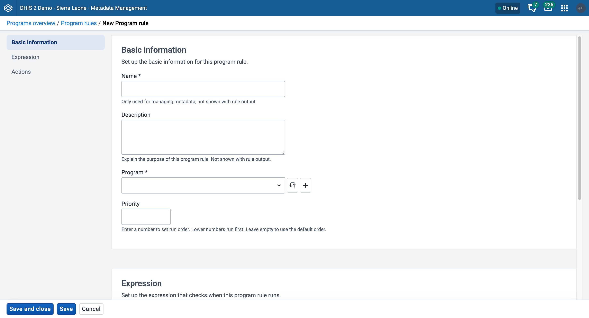

* **Basic information**. Name, Description, **Program** (required), **Program stage to trigger rule** (tracker programs only), Priority.
* **Expression**. Click **Set up condition expression** to open the expression editor. As in the Maintenance app, the rule must be saved before actions can be added.
* **Actions**. Set up the actions the rule triggers when its expression evaluates to true.

<!-- -->

1. Open the **Metadata Management** app and click **Programs** \> **Program rules**.

2. Click the + New button.

3. Enter the program rule Basic information. These fields are not shown to the
    end user, they are only meant for the program administrator.

      - **Name**

      - **Description**

      - **Program** (required)

      - **Program stage to trigger rule**. Only shown for tracker programs. If a program stage is selected, the program rule only runs for that stage, instead of running for every stage in the program.

      - **Priority**

        Let's say you have 16 program rules in your program. You
        configure the program rules with the following priority
        settings:

          - Priority 1 for program rule A

          - Priority 2 for program rules B - K

          - No priority for program rules L - P

        Result: the system runs the program rules in the following
        order:

        1.  Program rule A

        2.  Program rules B - K (you can't find out or configure in
            which order the system runs these program rules)

        3.  Program rules L - P.

4.  Click **Set up condition expression** and create the program rule
    expression with the help of variables, functions and operators.

5.  Click **Add action** and create the actions
    executed when the expression is true.

    1.  Click the add button, select an **Action type** and enter the
        required information.

        Depending on the action type, you'll have to perform different
        types of settings. For some action types, you must also enter
        free text or create expressions.

        | Action type | Required settings | Description |
        |---|---|---|
        | **Assign value** | **Data element to assign value to**    **Tracked entity attribute to assign value to**            **Program rule variable to assign value to**           **Expression to evaluate and assign** | Used to help the user calculate and fill out fields in the data entry form. The idea is that the user shouldn’t have to fill in values that the system can calculate, for example BMI.           When a field is assigned a value, the user sees the value but the user can't edit it.     NOTE: To assign a value to a tracked entity attribute, the user needs to open the tracked entity profile widget for the rule to trigger.          Example from Immunization stock card i Zambia: The data element for vaccine stock outgoing balance is calculated based on the data element for incoming stock balance minus the data elements for consumption and wastage.           Advanced use: configure an 'assign value' to do a part of a calculation and then assign the result of the calculation to a program rule variable. This is the purpose with the "Calculated value" program rule variable.           If several **Assign value** actions target the same field, only the one with the highest rule priority applies; the others are ignored. If the assigned value is not a valid option of the field's option set, it is silently replaced with no value. |
        | **Display text** | **Display widget**           **Static text**           **Expression to evaluate and display after static text** | Used to display information that is not an error or a warning, for example feedback to the user. You can also use this action to display important information, for example the patient's allergies, to the user. |
        | **Display key-value pair** | **Display widget**           **Key label**           **Expression to evaluate and display as value** | Used to display information that is not an error or a warning.           Example: calculate number of weeks and days in a pregnancy and display it in the format the clinician is used to see it in. The calculation is based on previous recorded data. |
        | **Error on complete** | **Data element to display error next to**           **Tracked entity attribute to display error next to**           **Static text**           **Expression to evaluate and display after static text** | Used whenever you've cross-consistencies in the form that must be strictly adhered to.           This action differs from the regular **Show error** since the error is not shown until the user tries to actually complete the form.           If you don't select a data element or a tracked entity attribute to display the error next to, make sure you write a comprehensive error message that helps the user to fix the error. |
        | **Hide field** | **Data element to hide**           **Tracked entity attribute to hide**           **Custom message for blanked field** | Used when you want to hide a field from the user. A field that is required (natively, or made mandatory by a **Set mandatory field** action) is never hidden by this action.           **Custom message for blanked field** allows you to define a custom message displayed to the user in case the program rule hides and blanks out the field after the user typed in or selected a value.           If a hide field action hides a field that contains a value, the field will always removed. If no message is defined, a standard message will be displayed to alert the user. |
        | **Hide section** | **Program stage section to hide** | Hides every field in the section. The section itself disappears only once none of its fields remain visible; a section that still contains a required field stays visible, with that field showing. |
        | **Hide program stage** | **Program stage where users will not be able to add new events** | Used when you do not want users to add any more events to a program stage. Existing events will not be hidden. |
        | **Set mandatory field** | **Data element to make mandatory**           **Tracked entity attribute to make mandatory** | Used when you want to make a data element or tracked entity attribute mandatory so they have to be filled out before the form can be saved. |
        | **Show error** | **Data element to display error next to**           **Tracked entity attribute to display error next to**           **Static text**           **Expression to evaluate and display after static text** | Used whenever there are rules which must strictly be adhered to.           Whether this blocks the user depends on the program's **Validation strategy**: under **On complete** it blocks only an attempt to complete the record; under **On update and insert** it blocks every save attempt.           Such a strict validation should only be used when it's certain that the evaluated expression is never true unless the user has made a mistake in data entry.           It's mandatory to define a message that is shown to the user when the expression is true and the action is triggered.           You can select which data element or tracked entity attribute to link the error to. This will help the user to fix the error.           In case several data elements or attributes are involved, select the one that is most likely that the user would need to change. |
        | **Show warning** | **Data element to display warning next to**           **Tracked entity attribute to display warning next to**           **Static text**           **Expression to evaluate and display after static text** | Used to give the user a warning about the entered data, but at the same time to allow the user to save and continue.           You can use warnings to help the user avoid errors in the entered data, while at the same time allow the user to consciously disregard the warnings and save a value that is outside preset expectations.           **Static text** defines the message shown to the user when the expression is true and the action is triggered.           You can select which data element or tracked entity attribute to link the error to. This will help the user to fix the error.           In case several data elements or attributes are involved, select the one that is most likely that the user would need to change. |
        | **Warning on complete** | **Data element to display warning next to**           **Tracked entity attribute to display warning next to**           **Static text**           **Expression to evaluate and display after static text** | Used to give the user a warning if he/she tries to complete inconsistent data, but at the same time to allow the user to continue. The warning is shown in a dialog when the user completes the form.           **Static text** defines the message shown to the user when the expression is true and the action is triggered. This field is mandatory.           You can select which data element or tracked entity attribute to link the error to. This will help the user to fix the error.           If you don't select a data element or a tracked entity attribute to display the error next to, make sure you write a comprehensive error message that helps the user to fix the error. |
        | **Send message** | **Message template to send** | Executed on the server, not by a client app: sends a notification based on the provided message template as soon as the rule condition is true. The message template is parsed and variables are substituted with actual values. |
        | **Schedule message** | **Message template to send**           **Data field which contains expression to evaluate the date which notification should be sent at. If this expression results in any value other than Date, then resultant will be discarded and notification will not get scheduled.** | Executed on the server, not by a client app: schedules a notification for the date returned by the expression in the data field. Sample expression:          d2:addDays( '2018-04-20', '2' )          Message template will be parsed and variables will be substituted with actual values. |
        | **Schedule event** | **Program stage**           **Expression to evaluate the scheduled date** (the field is captioned **Program rule variable for scheduled date**, but it still opens the same expression editor used elsewhere) | Unlike most other actions, this one is not evaluated live in the client: it is applied by the server when the enrollment or event is saved. Automatically schedules a new event for the specified program stage on the date returned by the expression. The expression must evaluate to a valid date; if it does not, no event will be scheduled.           The event is only scheduled once. If the rule condition evaluates to true again, no duplicate event is created.           Useful for programs where the timing of the next visit or follow-up can be derived from existing data, for example scheduling a second vaccination dose a fixed number of days after the first.           Example expression that schedules an event 28 days after a recorded date:          `d2:addDays(#{dateOfFirstDose}, 28)` |
        | **Hide option** | **Data element to hide option for**           **Tracked entity attribute to hide option for**           **Option that should be hidden** | Used to selectively hide a single option for an option set in a given data element/tracked entity attribute.           When combined with **show option group** the **hide option** takes precedence. |
        | **Hide option group** | **Data element to hide option group for**           **Tracked entity attribute to hide option group for**           **Option group that should be hidden** | Used to hide all options in a given option group and data element/tracked entity attribute.           When combined with **show option group** the **hide option group** takes precedence. |
        | **Show option group** | **Data element to show option group for**           **Tracked entity attribute to show option group for**           **Option group that should be shown** | Used to show only options from a given option group in a given data element/tracked entity attribute. To show an option group implicitly hides all options that is not part of the group(s) that is shown. |

        The **Display widget** setting used by **Display text** and **Display key-value pair** must be exactly **Feedback** or **Indicators**, the two widgets Capture supports for these actions. Whichever widget is chosen disappears from the form entirely whenever no active rule currently targets it.

        On DHIS2 2.43 and later, each action also has its own **Priority** field, setting the order actions run in within the same rule; leave it empty to use the default order.

    2.  Click **Add action**.

    3.  (Optional) Repeat above steps to add more actions.

6.  Click **Save**.

### Create or edit a program rule variable { #mmp_create_program_rule_variable } 

1. Open the **Metadata Management** app and click **Programs** > **Program rule variables**.

2. Click the **+ New** button.

3.  Under **Basic information**, enter a **Name**.

    Please note that the name of the program rule variable may not contain any of the following excluded keywords:
    - `and`
    - `or`
    - `not`

    The name can only contain letters, numbers, space, dash, dot and underscore.

4.  Under **Configuration**, select a **Program** and a **Source type**, then enter the information that source type requires (for example a **Program stage**, **Data element** or **Tracked entity attribute**). The source type determines how the program rule variable is populated with a value.

    | Source type | Description |
    |---|---|
    | **Data element in newest event in program stage** | This source type works the same way as **Data element in newest event in program**, except that it only evaluates values from one program stage.       This source type can be useful in program rules where the same data element is used in several program stages, and a rule needs to evaluate the newest data value from within one specific stage.        In order to know what event is the newest, the report date (event date) is used. If you have many events with the same report date, the system choose the one with the latest createdAt property of the event.|
    | **Data element in newest event in program** | This source type is used when a program rule variable needs to reflect the newest known value of a data element, regardless of what event the user currently has open. It is populated with the newest data value collected for the given data element across the whole enrollment (or, for a single event program, with the current event's data). Future dates are "newer" than current or past dates.       In order to know what event is the newest, the report date (event date) is used. If you have many events with the same report date, the system choose the one with the latest createdAt property of the event.|
    | **Data element from current event** | Program rule variables with this source type will contain the data value from the same event that the user currently has open.       This is the most commonly used source type, especially for skip logic (hide actions) and warning/error rules. |
    | **Data element from previous event** | Program rule variables with this source type will contain the value from a specified data element from a previous event. Only older events is evaluated, not including the event that the user currently has open.       This source type is commonly used when a data element only should be collected once during an enrollment, and should be hidden in subsequent events.       Another use case is making rules for validating input where there is an expected progression from one event to the next - a rule can evaluate whether the previous value is higher/lower and give a warning if an unexpected value is entered. |
    | **Calculated value** | Program rule variable with this source type is not connected directly to any form data - but will be populated as a result of some other program rule's **Assign value** action.       This variable will be used for making preliminary calculations, having an **Assign value** program rule action and assigning a value, this value can be used by other program rules - potentially making the expressions simpler and more maintainable.       These variables will not be persisted and will stay in memory only during the execution of the set of program rules. Any program rule that assigns a data value to a preliminary calculated value would normally also have a **priority** assigned - to make sure that the preliminary calculation is done before the rule that consumes the calculated value. |
    | **Tracked entity attribute** | Populates the program rule variable with a specified tracked entity attribute for the current enrollment.       Use this is the source type to create program rules that evaluate data values entered during registration.       This source type is also useful when you create program rules that compare data in events to data entered during registration.       This source type is only used for tracker programs (programs with registration). |

    For **Data element in newest event in program stage**, **Data element in newest event in program**, and **Data element from previous event**, only an event with a report date and a status of **Completed**, **Active**, or **Visited** is eligible to be picked as the "newest" or "previous" event. A scheduled or skipped event is never considered, regardless of its date.

    If **Source type** is **Calculated value**, also select a **Value type**. Every other source type takes its value type from the data element or attribute it is linked to, but a calculated value has no such source of its own; it defaults to **Text**.

5.  Select **"Show option set code instead of display name (when selection is linked to an option set)"** if you want the program rule variable populated with an option's code rather than its display name.

    This option is only effective when the data element or tracked
    entity attribute is connected to an option set.

6.  Click **Save**.

### Example: Program rules { #mmp_program_rule_examples }

> **Note**
>
> You can view all examples on the demo server, under **Programs > Program rules**
> and **Programs > Program rule variables** for the **WHO RMNCH Tracker** program.

This example shows how to configure a program rule which calculates the number of
weeks and days in a pregnancy and displays the result in the format the clinician
is used to seeing it in. The calculation is based on previously recorded data.

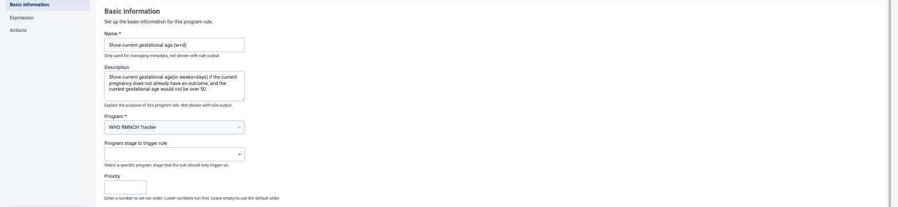

The full expression in the **Data** field:

    d2:concatenate(d2:weeksBetween(#{lmp}, V{current_date}), '+',
    d2:modulus(d2:daysBetween(#{lmp}, V{current_date}), 7))

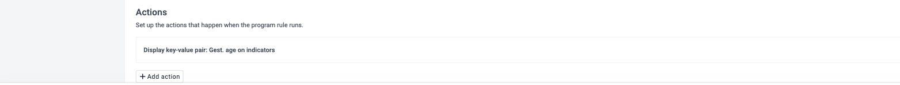

This example shows how to configure a program rule to display text in the
Feedback widget in the **Capture** app.

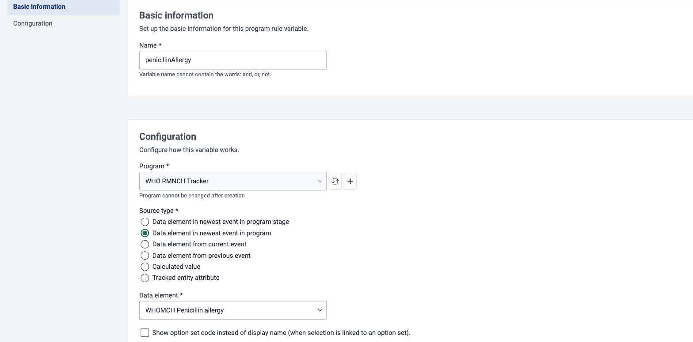

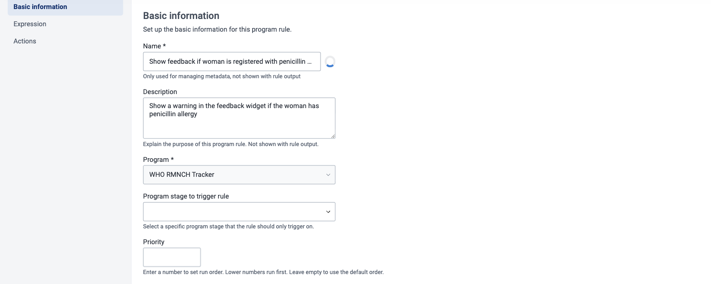

This example shows how to configure a program rule to always display certain
data in the Feedback widget in the **Capture** app. This is useful when you want
to make sure that vital data, for example medicine allergies, is always visible.

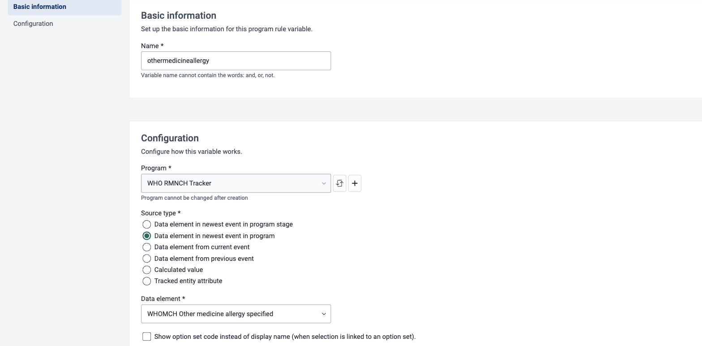

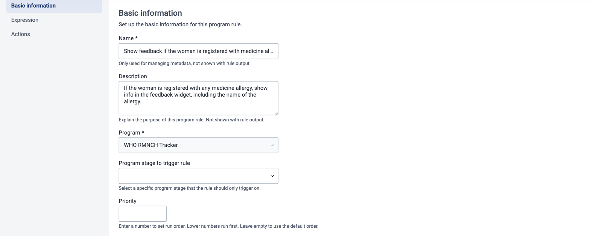

Both feedback messages together, as they appear in the Capture app:

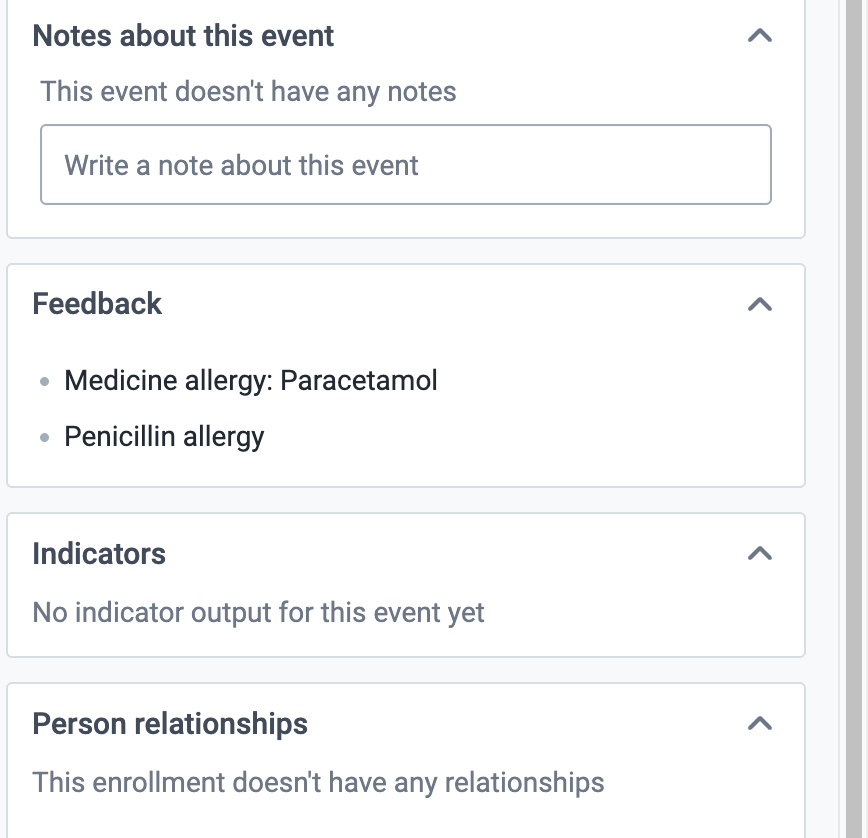{ .center width=30% }

By using a program rule of type "Assign value" you can calculate the
"Gestational age at visit" value and fill it in the data entry form. You
configure the program rule to calculate "Gestational age at visit" based on
either "LMP date" or "Ultrasound estimated due date".

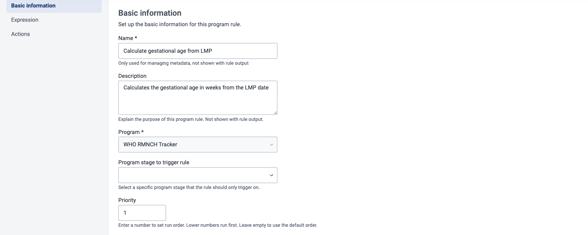

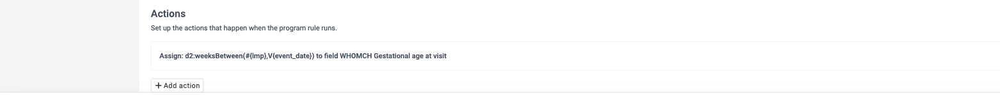

The calculated value filled into the data entry form:

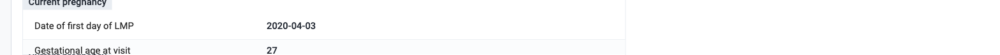

### Reference information: Operators and functions to use in program rule expression { #mmp_program_rules_operators_functions } 

> **Note**
>
> When using absolute dates in program rule expressions, always use
> 'YYYY-MM-DD' date format irrespective of the System Date format setting.

> **Tip**
>
> You can nest functions within each other and with sub-expressions to
> form more complex conditions. An example that produces the gestational
> age in weeks, based on last menstrual date:
>
>     d2:floor( d2:daysBetween(#{lastMenstrualDate},V{event_date}) / 7 )

> **Tip**
>
> The source type will determine how the d2: function calls will
> evaluate a (sourcefield) parameter.
>
> Example: where \#{hemoglobinCurrent} is set to source type **Data
> element in current event**. The following function call with evaluate
> whether haemoglobin is entered in the current event.
>
>     d2:hasValue( 'hemoglobinCurrent' )
>
> Example: where \#{hemoglobin} is set to source type **Data element
> from the newest event in the current program**. The following function
> call with evaluate whether there exists a value for the haemoglobin in
> any event in the enrollment.
>
>     d2:hasValue( 'hemoglobin' )
>
> Example: where \#{hemoglobinPrevious} is set to source type **Data
> element from previous event** . The following function call with
> evaluate whether there exists a value for the haemoglobin among the
> events preceding the current event.
>
>     d2:hasValue( 'hemoglobinPrevious' )

Table: Possible operators to use in a program rule expression

| Operator | Description |
|---|---|
| + | Add numbers together |
| - | Subtract numbers from each other |
| \* | Multiply two numbers |
| / | Divide two numbers |
| ^ | Exponentiation. Has higher precedence than `*` and `/`. |
| % | The modulus of two numbers |
| && | Logical AND. True only when the expression on the left and right side is true. The left and right side can be yes/no, yes only or a sub-expression in parenthesis. |
| &#124;&#124; | Logical OR. True when either the expression on the left or the expression on the right side is true. The left and right side can be yes/no, yes only or a sub-expression in parenthesis. |
| > | Left number greater than right number |
| >= | Left number greater than or equal to right number |
| < | Left number less than right number |
| <= | Left number less than or equal to right number. |
| == | Left side equal to right side. Supports numbers, text, yes/no and yes only. |
| != | Left side not equal to right side. Supports numbers, text, yes/no and yes only. |
| ! | Negates the following value. Can be used for yes/no, yes only or a sub-expression in parenthesis. |
| () | Parenthesis is used to group sub-expressions. |

Table: Custom functions to use in a program rule expression

| Function | Arguments | Description |
|---|---|---|
| d2:addDays | (date, number) | Produces a date based on the first argument date, adding the second argument number of days.  An example calculating the pregnancy due date based on the last menstrual period:  `d2:addDays(#{lastMenstrualDate},'283')` |
| d2:ceil | (number) | Rounds the input argument **up** to the nearest whole number.  Example:  `d2:ceil(#{hemoglobinValue})` |
| d2:concatenate | (object, [,object, object,...]) | Produces a string concatenated string from the input parameters. Supports any number of parameters. Will mainly be in use in future action types, for example to display gestational age with `d2:concatenate('weeks','+','gestationalageDays')`. |
| d2:condition | (boolean-expr, true-expr, false-expr) | Evaluates the first argument; if true, evaluates to the second argument, otherwise to the third.  Example:  `d2:condition(#{age} > 18, 'Adult', 'Minor')` |
| d2:contains | (text,text, ...) | Searches an expression for one or more substrings. Returns true if the expression contains all the substrings. For example, the following are all `true`: `contains("abcd", "abcd")`; `contains("abcd", "b")`; and `contains("abcd", "ab", "bc")`. Comparisons are case-sensitive. |
| d2:containsItems | (text,text, ...) | Searches an expression for one or more items. The expression is made up of comma-separated elements. containsItems returns true if every item exactly matches an element in the expression. For example, `containsItems("abcd", "abcd")` and `containsItems("ab,cd", "ab", "cd")` are `true`, but `containsItems("abcd", "b")` and `containsItems("abcd", "ab", "bc")` are `false`. Comparisons are case-sensitive. containsItems can be used for multi-valued data elements to see if an item is contained in the data element values. |
| d2:count | (sourcefield) | Counts the number of values that is entered for the source field in the argument. The source field parameter is the name of one of the defined source fields in the program - see example  Example usage where `#{previousPregnancyOutcome}` is one of the source fields in a repeatable program stage "previous pregnancy":  `d2:count('previousPregnancyOutcome')` |
| d2:countIfValue | (sourcefield,text) | Counts the number of matching values that is entered for the source field in the first argument. Only occurrences that matches the second argument is counted. The source field parameter is the name of one of the defined source fields in the program - see example.  Example usage where `#{previousPregnancyOutcome}` is one of the source fields in a repeatable program stage "previous pregnancy". The following function will produce the number of previous pregnancies that ended with abortion:  `d2:countIfValue('previousPregnancyOutcome','Abortion')` |
| d2:countIfZeroPos | (sourcefield) | Counts the number of values that is zero or positive entered for the source field in the argument. The source field parameter is the name of one of the defined source fields in the program - see example.  Example usage where `#{fundalHeightDiscrepancy}` is one of the source fields in program, and it can be either positive or negative. The following function will produce the number of positive occurrences:  `d2:countIfZeroPos('fundalHeightDiscrepancy')` |
| d2:daysBetween | (date, date) | Produces the number of days between the first and second argument. When the first argument date comes before the second argument date, the number will be positive - in the opposite case, the number will be negative. The static date format is 'yyyy-MM-dd'.  Example, calculating the gestational age(in days) of a woman, based on the last menstrual period and the current event date:  `d2:daysBetween(#{lastMenstrualDate},V{event_date})` |
| d2:exponent | (base, exponent) | Raises the first argument to the power of the second argument.  Example, taking the square root of 49:  `d2:exponent(49, 0.5)` |
| d2:extractDataMatrixValue | Get GS1 value based on application identifier |  Given a field value formatted with the gs1 data matrix standard and a string key from the GS1 application identifiers. The function looks and returns the value linked to the provided key.  Example expression:  `d2:extractDataMatrixValue( 'gtin', A{GS1 Value} )` |
| d2:floor | (number) | Rounds the input argument **down** to the nearest whole number.  An example producing the number of weeks the woman is pregnant. Notice that the sub-expression `#{gestationalAgeDays}/7` is evaluated before the floor function is executed:  `d2:floor(#{gestationalAgeDays}/7)` |
| d2:hasUserRole | (user role) | Returns true if current user has this role otherwise false  Example expression:  `d2:hasUserRole('UYXOT4A3ASA')` |
| d2:hasValue | (sourcefield) | Evaluates to true of the argument source field contains a value, false if no value is entered.  Example usage, to find if the source field #{currentPregnancyOutcome} is yet filled in:  `d2:hasValue('currentPregnancyOutcome')` |
| d2:inOrgUnitGroup | (text) | Evaluates whether the current organisation unit is in the argument group. The argument can be defined with either ID or organisation unit group code. The current organisation unit will be the event organisation unit when the rules is triggered in the context of an event, and the enrolling organisation unit when the rules is triggered in the event of a TEI registration form.  Example expression:  `d2:inOrgUnitGroup('HIGH_RISK_FACILITY')` |
| d2:inUserGroup | (text) | Returns true if current user is part of this user group otherwise false. The user group is defined by the ID.  Example expression:  `d2:inUserGroup('HrXOT4trAFG')` |
| d2:lastEventDate | Get the last event date for entered data | Gets the event date when the underlying data element was entered in the previous event in a program stage |
| d2:left | (text, num-chars) | Evaluates to the left part of a text, num-chars from the first character.  The text can be quoted or evaluated from a variable:  `d2:left(#{variableWithText}, 3)` |
| d2:length | (text) | Find the length of a string.  Example:  `d2:length(#{variableWithText})` |
| d2:log | (number [, base]) | Produces the natural logarithm of the argument number. If a second argument is given, produces the logarithm of the first argument to that base instead.  Example, the logarithm of 8 to base 2:  `d2:log(8, 2)` |
| d2:maxValue | Get maximum value for provided item | Function gets maximum value of provided data element across entire enrollment.  Example expression:  `d2:maxValue( 'blood-pressure' )` |
| d2:minValue | Get minimum value for provided item | Function gets minimum value of provided data element across entire enrollment.  Example expression:  `d2:minValue( 'blood-pressure' )` |
| d2:modulus | (number,number) | Produces the modulus when dividing the first with the second argument.  An example producing the number of days the woman is into her current pregnancy week:  `d2:modulus(#{gestationalAgeDays},7)` |
| d2:monthsBetween | (date, date) | Produces the number of full months between the first and second argument. When the first argument date comes before the second argument date, the number will be positive - in the opposite case, the number will be negative. The static date format is 'yyyy-MM-dd'. |
| d2:oizp | (number) | Evaluates the argument of type number to one if the value is zero or positive, otherwise to zero. |
| d2:right | (text, num-chars) | Evaluates to the right part of a text, num-chars from the last character.  The text can be quoted or evaluated from a variable:  `d2:right(#{variableWithText}, 2)` |
| d2:round | (number [, decimals]) | Rounds the input argument to the nearest integer. An optional second argument can be provided to specify a number of decimal places to which the number is to be rounded.  Example: `d2:round(1.25, 1)` = 1.3 |
| d2:substring | (text, start-char-num, end-char-num) | Evaluates to the part of a string specified by the start and end character number.  Example expression:  `d2:substring(#{variableWithText}, 1, 3)` If the #{variableWithText} in the above example was 'ABCD', then the result of the evaluation would be 'BC' |
| d2:split | (text, delimiter, element-num) | Split the text by delimiter, and keep the nth element(0 is the first).  The text can be quoted or evaluated from a variable, the delimiter must be quoted:  `d2:split(#{variableWithText}, '-', 1)`  Note: comma delimiter(,) is not supported. |
| d2:validatePattern | (text, regex-pattern) | Evaluates to true if the input text is an exact match with the supplied regular expression pattern. The regular expression needs to be escaped.  Example expression, triggering actions if a number is not on the pattern 9999/99/9:  `!d2:validatePattern(A{nrc},'\\d{6}\/\\d{2}\/\\d')`  Example expression, triggering actions that if the address is not consisting of letters or white spaces, then a white space, then a number:  `!d2:validatePattern(A{registrationAddress},'[\\w ]+ \\d+')`  Example, triggering actions if a name contains any numbers:  `!d2:validatePattern(A{name},'[^\\d]*')`  Example expression, triggering actions if a mobile number contains the illegal number sequence 555:  `d2:validatePattern(A{mobile} ,'.*555.*')` |
| d2:weeksBetween | (date, date) | Produces the number of full weeks between the first and second argument. When the first argument date comes before the second argument date, the number will be positive - in the opposite case, the number will be negative. The static date format is 'yyyy-MM-dd'. |
| d2:yearsBetween | (date, date) | Produces the number of years between the first and second argument. When the first argument date comes before the second argument date, the number will be positive - in the opposite case, the number will be negative. The static date format is 'yyyy-MM-dd'. |
| d2:zing | (number) | Evaluates the argument of type number to zero if the value is negative, otherwise to the value itself. |
| d2:zpvc | (object, [,object, object,...]) | Returns the number of numeric zero and positive values among the given object arguments. Can be provided with any number of arguments. |
| d2:zScoreWFA | Z-Score weight for age indicator | Calculates z-score based on data provided by WHO weight-for-age indicator. e varies between -3.5 to 3.5 depending upon the value of weight.  Example expression:  `d2:zScoreWFA( ageInMonths, weight, gender )`    **Gender** > Gender is considered female by default. Any of the following codes can > be used to denote male: 'Male', 'MALE', 'male', 'ma', 'm', 'M', 0, false |
| d2:zScoreHFA | Z-Score height for age indicator | Calculates z-score based on data provided by WHO height-for-age indicator. Its value varies between -3.5 to 3.5 depending upon the value of height.  Example expression:  `d2:zScoreHFA( ageInMonths, height, gender )` |
| d2:zScoreWFH | Z-Score weight for height indicator | Calculates z-score based on data derived from the WHO weight-for-length and weight-for-height indicators. The data used for girls can be found [here](https://github.com/dhis2/dhis2-docs/blob/master/src/commonmark/en/content/user/resources/txt-files/zScoreWFH-girls-table.txt) and for boys [here](https://github.com/dhis2/dhis2-docs/blob/master/src/commonmark/en/content/user/resources/txt-files/zScoreWFH-boys-table.txt). Its value varies between -3.5 to 3.5 depending upon the value of the weight.  Example expression:  `d2:zScoreWFH( height, weight, gender )` |

Table: Data matrix codes

| AI    | Data Title | Description | Fixed Length |
|----|----|----|----|
|  00   | SSCC                      | SSCC (Serial Shipping Container Code)                                                                                                      | 20           |
|  01   | GTIN                      | Global Trade Item Number                                                                                                                   | 16           |
|  02   | CONTENT                   | GTIN of Trade Items Contained in a logistic unit                                                                                          | 16           |
|  10   | LOT_NUMBER                | Batch or lot number                                                                                                                       | Variable     |
|  11   | PROD_DATE                 | Production date (YYMMDD)                                                                                                                   | 8            |
|  12   | DUE_DATE                  | Due date (YYMMDD)                                                                                                                         | 8            |
|  13   | PACK_DATE                 | Packaging date (YYMMDD)                                                                                                                   | 8            |
|  15   | BEST_BEFORE_DATE          | Best before date (YYMMDD)                                                                                                                  | 8            |
|  16   | SELL_BY                   | Sell by date (YYMMDD)                                                                                                                     | 8            |
|  17   | EXP_DATE                  | Expiration date (YYMMDD)                                                                                                                   | 8            |
|  20   | VARIANT                   | Internal Product variant                                                                                                                  | 4            |
|  21   | SERIAL_NUMBER             | Serial number                                                                                                                             | Variable     |
|  22   | CPV                       | Consumer product variant                                                                                                                   | Variable     |
|  235  | TPX                       | Third Party Controlled, Serialised Extension of Global Trade Item Number (GTIN) (TPX)                                                      | Variable     |
|  240  | ADDITIONAL_ID             | Additional product identification assigned by the manufacturer                                                                             | Variable     |
|  241  | CUSTOMER_PART_NUMBER      | Customer part number                                                                                                                       | Variable     |
|  242  | MTO_VARIANT_NUMBER        | Made-to-Order Variation Number                                                                                                             | Variable     |
|  243  | PCN                       | Packaging component number                                                                                                                 | Variable     |
|  250  | SECONDARY_SERIAL          | Secondary serial number                                                                                                                   | Variable     |
|  251  | REF_TO_SOURCE             | Reference to source entity                                                                                                                | Variable     |
|  253  | GDTI                      | Global Document Type Identifier                                                                                                           | Variable     |
|  254  | GLN_EXTENSION_COMPONENT   | GLN Extension component                                                                                                                    | Variable     |
|  255  | GCN                       | Global Coupon Number (GCN)                                                                                                                 | Variable     |
|  30   | VAR_COUNT                 | Variable count                                                                                                                            | Variable     |
|  310* | NET_WEIGHT_KG             | Net weight, kilograms (variable measure trade item                                                                                         | Variable     |
|  311* | LENGTH_M                  | Length or first dimension, metres (variable measure trade item)                                                                            | Variable     |
|  312* | WIDTH_M                   | Width, diameter, or second dimension, metres (variable measure trade item)                                                                 | Variable     |
|  313* | HEIGHT_M                  | Depth, thickness, height, or third dimension, metres (variable measure trade item)                                                        | Variable     |
|  314* | AREA_M2                   | Area, square metres (variable measure  trade item)                                                                                         | Variable     |
|  315* | NET_VOLUME_L              | Net volume, litres (variable measure trade item)                                                                                           | Variable     |
|  316* | NET_VOLUME_M3             | Net volume, cubic metres (variable measure trade item)                                                                                     | Variable     |
|  320* | NET_WEIGHT_LB             | Net weight, pounds (variable measure trade item)                                                                                           | Variable     |
|  321* | LENGTH_I                  | Length or first dimension, inches (variable measure trade item)                                                                            | Variable     |
|  322* | LENGTH_F                  | Length or first dimension, feet (variable measure trade item)                                                                              | Variable     |
|  323* | LENGTH_Y                  | Length or first dimension, yards (variable measure trade item)                                                                             | Variable     |
|  324* | WIDTH_I                   | Width, diameter, or second dimension, inches (variable measure trade item)                                                                 | Variable     |
|  325* | WIDTH_F                   | Width, diameter, or second dimension, feet (variable measure trade item)                                                                   | Variable     |
|  326* | WIDTH_Y                   | Width, diameter, or second dimension, yards(variable measure trade item)                                                                   | Variable     |
|  327* | HEIGHT_I                  | Depth, thickness, height, or third dimension, inches (variable measure trade item)                                                         | Variable     |
|  328* | HEIGHT_F                  | Depth, thickness, height, or third dimension, feet (variable measure trade item)                                                           | Variable     |
|  329* | HEIGHT_Y                  | Depth, thickness, height, or third dimension, yards (variable measure trade item)                                                          | Variable     |
|  330* | GROSS_WEIGHT_GF           | Logistic weight, kilograms                                                                                                                 | Variable     |
|  331* | LENGTH_M_LOG              | Length or first dimension, metres                                                                                                          | Variable     |
|  332* | WIDTH_M_LOG               | Width, diameter, or second dimension, metres                                                                                               | Variable     |
|  333* | HEIGHT_M_LOG              | Depth, thickness, height, or third dimension, metres                                                                                       | Variable     |
|  334* | AREA_M2_LOG               | Area, square metres                                                                                                                       | Variable     |
|  335* | VOLUME_L_LOG              | Logistic volume, litres                                                                                                                    | Variable     |
|  336* | VOLUME_M3_LOG             | Logistic volume, cubic metres                                                                                                              | Variable     |
|  337* | KG_PER_M2                 | Kilograms per square metre                                                                                                                | Variable     |
|  340* | GROSS_WHEIGHT_LB          | Logistic weight, pounds                                                                                                                    | Variable     |
|  341* | LENGTH_I_LOG              | Length or first dimension, inches                                                                                                          | Variable     |
|  342* | LENGTH_F_LOG              | Length or first dimension, feet                                                                                                            | Variable     |
|  343* | LENGTH_Y_LOG              | Length or first dimension, yards                                                                                                           | Variable     |
|  344* | WIDTH_I_LOG               | Width, diameter, or second dimension, inches                                                                                               | Variable     |
|  345* | WIDTH_F_LOG               | Width, diameter, or second dimension, feet                                                                                                 | Variable     |
|  346* | WIDTH_Y_LOG               | Width, diameter, or second dimension, yards                                                                                               | Variable     |
|  347* | HEIGHT_I_LOG              | Depth, thickness, height, or third dimension, inches                                                                                       | Variable     |
|  348* | HEIGHT_F_LOG              | Depth, thickness, height, or third dimension, feet                                                                                         | Variable     |
|  349* | HEIGHT_Y_LOG              | Depth, thickness, height, or third dimension, yards                                                                                        | Variable     |
|  350* | AREA_I2                   | Area, square inches (variable measure trade item)                                                                                          | Variable     |
|  351* | AREA_F2                   | Area, square feet (variable measure trade item)                                                                                            | Variable     |
|  352* | AREA_Y2                   | Area, square yards (variable measure trade item)                                                                                          | Variable     |
|  353* | AREA_I2_LOG               | Area, square inches                                                                                                                        | Variable     |
|  354* | AREA_F2_LOG               | Area, square feet                                                                                                                          | Variable     |
|  355* | AREA_Y2_LOG               | Area, square yards                                                                                                                         | Variable     |
|  356* | NET_WEIGHT_T              | Net weight, troy ounces (variable measure trade item)                                                                                      | Variable     |
|  357* | NET_VOLUME_OZ             | Net weight (or volume), ounces (variable measure trade item)                                                                               | Variable     |
|  360* | NET_VOLUME_Q              | Net volume, quarts (variable measure trade item)                                                                                           | Variable     |
|  361* | NET_VOLUME_G              | Net volume, gallons U.S. (variable measure trade item)                                                                                     | Variable     |
|  362* | VOLUME_Q_LOG              | Logistic volume, quarts                                                                                                                    | Variable     |
|  363* | VOLUME_G_LOG              | Logistic volume, gallons U.S.                                                                                                              | Variable     |
|  364* | VOLUME_I3                 | Net volume, cubic inches (variable measure trade item)                                                                                     | Variable     |
|  365* | VOLUME_F3                 | Net volume, cubic feet (variable measure trade item)                                                                                       | Variable     |
|  366* | VOLUME_Y3                 | Net volume, cubic yards (variable measure trade item)                                                                                      | Variable     |
|  367* | VOLUME_I3_LOG             | Logistic volume, cubic inches                                                                                                               | Variable     |
|  368* | VOLUME_F3_LOG             | Logistic volume, cubic feet                                                                                                                 | Variable     |
|  369* | VOLUME_Y3_LOG             | Logistic volume, cubic yards                                                                                                                | Variable     |
|  37   | COUNT                     | Count of trade items or trade item pieces contained in a logistic unit                                                                     | Variable     |
|  390* | AMOUNT                    | Applicable amount payable or Coupon value, local currency                                                                                  | Variable     |
|  391* | AMOUNT_ISO                | Applicable amount payable with ISO currency code                                                                                           | Variable     |
|  392* | PRICE                     | Applicable amount payable, single monetary area (variable measure trade item)                                                              | Variable     |
|  393* | PRICE_ISO                 | Applicable amount payable with ISO currency code (variable measure trade item)                                                             | Variable     |
|  394* | PRCNT_OFF                 | Percentage discount of a coupon                                                                                                            | Variable     |
|  395* | PRICE_UOM                 | Amount Payable per unit of measure single monetary area (variable measure trade item)                                                      | N4+N6        |
|  400  | ORDER_NUMBER              | Customers purchase order number                                                                                                            | Variable     |
|  401  | GINC                      | Global Identification Number for Consignment (GINC)                                                                                        | Variable     |
|  403  | ROUTE                     | Routing code                                                                                                                               | Variable     |
|  410  | SHIP_TO_GLOB_LOC          | Ship to / Deliver to Global Location Number (GLN)                                                                                          | Variable     |
|  411  | BILL_TO_LOC               | Bill to / Invoice to Global Location Number (GLN)                                                                                          | Variable     |
|  412  | PURCHASED_FROM            | Purchased from Global Location Number (GLN)                                                                                                | Variable     |
|  413  | SHIP_FOR_LOG              | Ship for / Deliver for - Forward to Global Location Number (GLN)                                                                           | Variable     |
|  414  | LOC_NUMBER                | Identification of a physical location - Global Location Number (GLN)                                                                       | Variable     |
|  415  | PAY_TO                    | Global Location Number (GLN) of the invoicing party                                                                                        | Variable     |
|  416  | PROD_SERV_LOC             | Global Location Number (GLN) of the production or service location                                                                         | Variable     |
|  417  | PARTY                     | Party Global Location Number (GLN)                                                                                                         | Variable     |
|  420  | SHIP_TO_POST              | Ship to / Deliver to postal code within a single postal authority                                                                          | Variable     |
|  421  | SHIP_TO_POST_ISO          | Ship to / Deliver to postal code with ISO country code                                                                                     | Variable     |
|  422  | ORIGIN                    | Country of origin of a trade item                                                                                                          | Variable     |
|  423  | COUNTRY_INITIAL_PROCESS   | Country of initial processing                                                                                                              | Variable     |
|  424  | COUNTRY_PROCESS           | Country of processing                                                                                                                      | Variable     |
|  425  | COUNTRY_DISASSEMBLY       | Country of disassembly                                                                                                                     | Variable     |
|  426  | COUNTRY_FULL_PROCESS      | Country covering full process chain                                                                                                        | Variable     |
|  427  | ORIGIN_SUBDIVISION        | Country subdivision Of origin                                                                                                              | Variable     |
|  4300 | SHIP_TO_COMP              | Ship-to / Deliver-to company name                                                                                                          | Variable     |
|  4301 | SHIP_TO_NAME              | Ship-to / Deliver-to contact                                                                                                               | Variable     |
|  4302 | SHIP_TO_ADD1              | Ship-to / Deliver-to address line 1                                                                                                        | Variable     |
|  4303 | SHIP_TO_ADD2              | Ship-to / Deliver-to address line 2                                                                                                        | Variable     |
|  4304 | SHIP_TO_SUB               | Ship-to / Deliver-to suburb                                                                                                                 | Variable     |
|  4305 | SHIP_TO_LOCALITY          | Ship-to / Deliver-to locality                                                                                                               | Variable     |
|  4306 | SHIP_TO_REG               | Ship-to / Deliver-to region                                                                                                                 | Variable     |
|  4307 | SHIP_TO_COUNTRY           | Ship-to / Deliver-to country code                                                                                                          | Variable     |
|  4308 | SHIP_TO_PHONE             | Ship-to / Deliver-to telephone number                                                                                                      | Variable     |
|  4310 | RTN_TO_COMP               | Return-to company name                                                                                                                     | Variable     |
|  4311 | RTN_TO_NAME               | Return-to contact                                                                                                                          | Variable     |
|  4312 | RTN_TO_ADD1               | Return-to address line 1                                                                                                                   | Variable     |
|  4313 | RTN_TO_ADD2               | Return-to address line 2                                                                                                                   | Variable     |
|  4314 | RTN_TO_SUB                | Return-to suburb                                                                                                                           | Variable     |
|  4315 | RTN_TO_LOCALITY           | Return-to locality                                                                                                                         | Variable     |
|  4316 | RTN_TO_REG                | Return-to region                                                                                                                           | Variable     |
|  4317 | RTN_TO_COUNTRY            | Return-to country code                                                                                                                     | Variable     |
|  4318 | RTN_TO_POST               | Return-to postal code                                                                                                                      | Variable     |
|  4319 | RTN_TO_PHONE              | Return-to telephone number                                                                                                                 | Variable     |
|  4320 | SRV_DESCRIPTION           | Service code description                                                                                                                   | Variable     |
|  4321 | DANGEROUS_GOODS           | Dangerous goods flag                                                                                                                      | Variable     |
|  4322 | AUTH_LEAV                 | Authority to leave                                                                                                                         | Variable     |
|  4323 | SIG_REQUIRED              | Signature required flag                                                                                                                    | Variable     |
|  4324 | NBEF_DEL_DT               | Not before delivery date time                                                                                                              | Variable     |
|  4325 | NAFT_DEL_DT               | Not after delivery date time                                                                                                               | Variable     |
|  4326 | REL_DATE                  | Release date                                                                                                                               | Variable     |
|  7001 | NSN                       | NATO Stock Number (NSN)                                                                                                                   | Variable     |
|  7002 | MEAT_CUT                  | UN/ECE meat carcasses and cuts classification                                                                                              | Variable     |
|  7003 | EXP_TIME                  | Expiration date and time                                                                                                                   | Variable     |
|  7004 | ACTIVE_POTENCY            | Active potency                                                                                                                             | Variable     |
|  7005 | CATCH_AREA                | Catch area                                                                                                                                 | Variable     |
|  7006 | FIRST_FREEZE_DATE         | First freeze date                                                                                                                          | Variable     |
|  7007 | HARVEST_DATE              | Harvest date                                                                                                                               | Variable     |
|  7008 | AQUATIC_SPECIES           | Species for fishery purposes                                                                                                               | Variable     |
|  7009 | FISHING_GEAR_TYPE         | Fishing gear type                                                                                                                          | Variable     |
|  7010 | PROD_METHID               | Production method                                                                                                                          | Variable     |
|  7020 | REFURB_LOT                | Refurbishment lot ID                                                                                                                       | Variable     |
|  7021 | FUNC_STAT                 | Functional status                                                                                                                          | Variable     |
|  7022 | REV_STAT                  | Revision status                                                                                                                            | Variable     |
|  7023 | GIAI_ASSEMBLY             | Global Individual Asset Identifier (GIAI) of an assembly                                                                                   | Variable     |
|  703* | PROCESSOR_NUMBER          | Number of processor with ISO Country Code                                                                                                  | Variable     |
|  7040 | UIC_EXT                   | GS1 UIC with Extension 1 and Importer index                                                                                                | Variable     |
|  710  | NHRN_PZN                  | National Healthcare Reimbursement Number (NHRN) - Germany PZN                                                                              | Variable     |
|  711  | NHRN_CIP                  | National Healthcare Reimbursement Number (NHRN) - France CIP                                                                               | Variable     |
|  712  | NHRN_CN                   | National Healthcare Reimbursement Number (NHRN) - Spain CN                                                                                 | Variable     |
|  713  | NHRN_DRN                  | National Healthcare Reimbursement Number (NHRN) - Brasil DRN                                                                               | Variable     |
|  714  | NHRN_AIM                  | National Healthcare Reimbursement Number (NHRN) - Portugal AIM                                                                             | Variable     |
|  723* | CERT_NUMBER               | Certification reference                                                                                                                    | Variable     |
|  7240 | PROTOCOL                  | Protocol ID                                                                                                                                | Variable     |
|  8001 | DIMENSIONS                | Roll products (width, length, core diameter, direction, splices)                                                                           | Variable     |
|  8002 | CMT_NUMBER                | Cellular mobile telephone identifier                                                                                                       | Variable     |
|  8003 | GRAI                      | Global Returnable Asset Identifier (GRAI)                                                                                                  | Variable     |
|  8004 | GIAI                      | Global Individual Asset Identifier (GIAI)                                                                                                  | Variable     |
|  8005 | PRICE_PER_UNIT            | Price per unit of measure                                                                                                                  | Variable     |
|  8006 | ITIP                      | Identification of an individual trade item piece (ITIP)                                                                                    | Variable     |
|  8007 | IBAN                      | International Bank Account Number (IBAN)                                                                                                   | Variable     |
|  8008 | PROD_TIME                 | Date and time of production                                                                                                                | Variable     |
|  8009 | OPTSEN                    | Optically Readable Sensor Indicator                                                                                                        | Variable     |
|  8010 | CPID                      | Component/Part Identifier (CPID)                                                                                                           | Variable     |
|  8011 | CPID_SERIAL               | Component/Part Identifier serial number (CPID SERIAL)                                                                                      | Variable     |
|  8012 | VERSION                   | Software version                                                                                                                           | Variable     |
|  8013 | GMN                       | Global Model Number (GMN)                                                                                                                  | Variable     |
|  8017 | GSRN_PROVIDER             | Global Service Relation Number (GSRN) to identify the relationship between an organisation offering services and the provider of services  | Variable     |
|  8018 | GSRN_RECIPIENT            | Global Service Relation Number (GSRN) to identify the relationship between an organisation offering services and the recipient of services | Variable     |
|  8019 | SRIN                      | Service Relation Instance Number (SRIN)                                                                                                    | Variable     |
|  8020 | REF_NUMBER                | Payment slip reference number                                                                                                              | Variable     |
|  8026 | ITIP_CONTENT              | Identification of pieces of a trade item (ITIP) contained in a logistic unit                                                               | Variable     |
|  8110 | COUPON_USA                | Coupon code identification for use in North America                                                                                        | Variable     |
|  8111 | POINTS                    | Loyalty points of a coupon                                                                                                                 | Variable     |
|  8121 | POSITIVE_OFFER_COUPON_USA | Paperless coupon code identification for use in North America                                                                              | Variable     |
|  8200 | PRODUCT_URL               | Extended Packaging URL                                                                                                                     | Variable     |
|  90   | AGREEMENT_INTERNAL        | Information mutually agreed between trading partners                                                                                       | Variable     |
|  91   | COMPANY_INTERNAL_1        | Company internal information                                                                                                              | Variable     |
|  92   | COMPANY_INTERNAL_2        | Company internal information                                                                                                              | Variable     |
|  93   | COMPANY_INTERNAL_3        | Company internal information                                                                                                              | Variable     |
|  94   | COMPANY_INTERNAL_4        | Company internal information                                                                                                              | Variable     |
|  95   | COMPANY_INTERNAL_5        | Company internal information                                                                                                              | Variable     |
|  96   | COMPANY_INTERNAL_6        | Company internal information                                                                                                              | Variable     |
|  97   | COMPANY_INTERNAL_7        | Company internal information                                                                                                              | Variable     |
|  98   | COMPANY_INTERNAL_8        | Company internal information                                                                                                              | Variable     |
|  99   | COMPANY_INTERNAL_9        | Company internal information                                                                                                              | Variable     |

Table: Standard variables to use in program rule expressions

| Variable | Type | Description |
|---|---|---|
| V{current_date} | (date) | Contains the current date whenever the rule is executed.  Example expression:  `d2:daysBetween(#{symptomDate},V{current_date}) < 0 `|
| V{event_date} | (date) | Contains the event date of the current event execution. Will not have a value at the moment the rule is executed as part of the registration form. |
| V{event_status} | (string) | Contains status of the current event or enrollment.  Example expression to check status is:  `V{event_status} == 'COMPLETED'` |
| V{due_date} | (date) | Contains the due date of the current event (the date it was scheduled for). |
| V{event_count} | (number) | Contains the total number of events in the enrollment. |
| V{enrollment_date} | (date) | Contains the enrollment date of the current enrollment. Will not have a value for single event programs. |
| V{incident_date} | (date) | Contains the incident date of the current enrollment. Will not have a value for single event programs. |
| V{enrollment_id} | (string) | Universal identifier string (UID) of the current enrollment. Will not have a value for single event programs. |
| V{enrollment_status} | (string) | Contains status of the current enrollment.  It can be ACTIVE, COMPLETED or CANCELLED. Example expression to check status is:  `V{enrollment_status} == 'COMPLETED'` |
| V{event_id} | (string) | Universal identifier string (UID) of the current event context. Will not have a value at the moment the rule is executed as part of the registration form. |
| V{orgunit_code} | (string) | Contains the code of the orgunit that is linked to the current enrollment. For single event programs the code from the current event orgunit will be used instead.  Example expression to check whether orgunit code starts with WB_:  `d2:left(V{orgunit_code},3) == 'WB_'` |
| V{environment} | (string) | Contains a code representing the current runtime environment for the rules. The possible values is "WebClient", "AndroidClient" and "Server". Can be used when a program rule is only supposed to run in one or more of the client types. |
| V{program_stage_id} | (string) | Contains the ID of the current program stage that triggered the rules. This can be used to run rules in specific program stages, or avoid execution in certain stages. When executing the rules in the context of a TEI registration form the variable will be empty. |
| V{program_stage_name} | (string) | Contains the name of the current program stage that triggered the rules. This can be used to run rules in specific program stages, or avoid execution in certain stages. When executing the rules in the context of a TEI registration form the variable will be empty. |
| V{completed_date} | (string) | This variable contains completion date of event which triggered this rule. If event is not yet complete then "completed_date" contains nothing. |

## Program disaggregations { #mmp_program_disaggregations }

Reached from **Programs → Program disaggregations**. This page lists every program that already has a disaggregation mapping, each with **Edit** and **Delete** actions, plus a **Select a Program** picker to start a mapping for a program that does not have one yet. The mapping mechanics themselves (mapping category option combinations onto program indicator data for aggregate reporting) are described below.

### Setting up new program disaggregation mappings { #mmp_program_disaggregation_mapping }

Available in DHIS2 2.42 and later; the **Program disaggregations** page does not appear in the Metadata Management app on an older server. This feature lets you assign a disaggregation category combination to a program indicator and map each category option in that combination onto program data, connecting the tracker and aggregate data models so individual program data can be analysed alongside aggregated data, using a single program indicator instead of one per disaggregation.

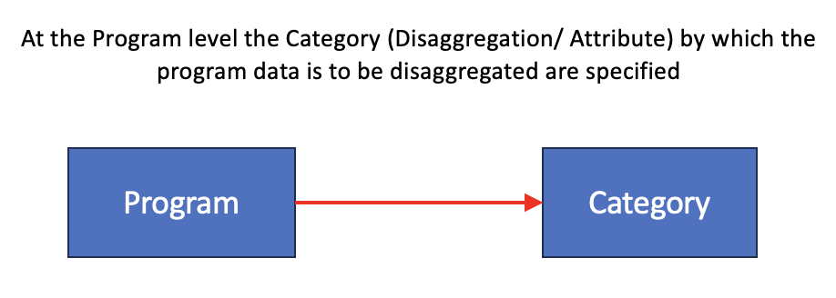{ width=60% }
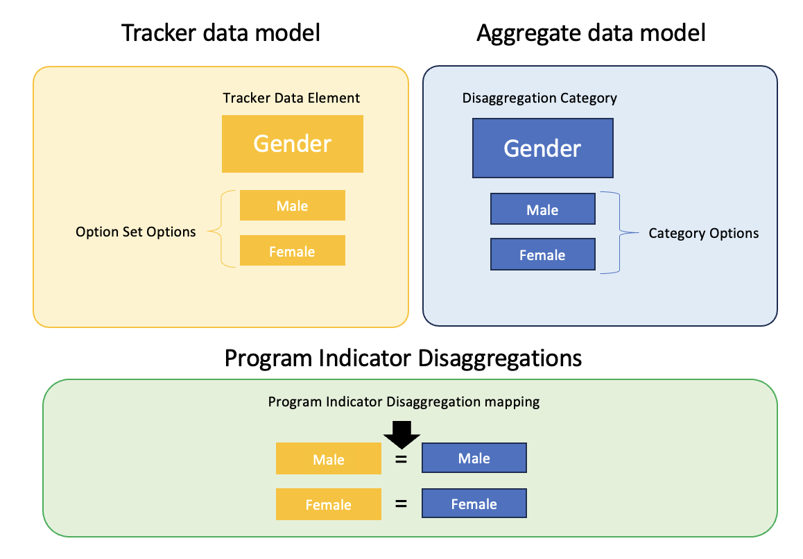{ width=60% }

The program indicator disaggregation mappings, defined at the program level, provide a connection between the two data models within DHIS2. This ultimately allows a user to create disaggregated views of program data within the Data Visualizer using a single program indicator where previously one for each disaggregation was needed.

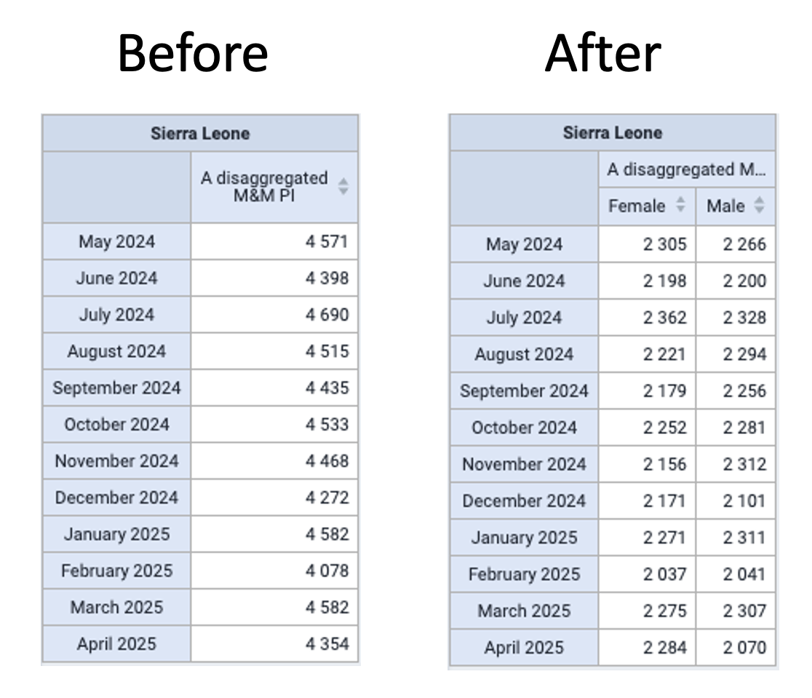{ width=60% }

1. Open the **Metadata Management** app, go to **Programs → Program disaggregations**, and use the **Select a Program** picker to add a mapping for a program. For this example we will use the **Inpatient morbidity and mortality** program.

2. This loads the program indicator mapping screen.

    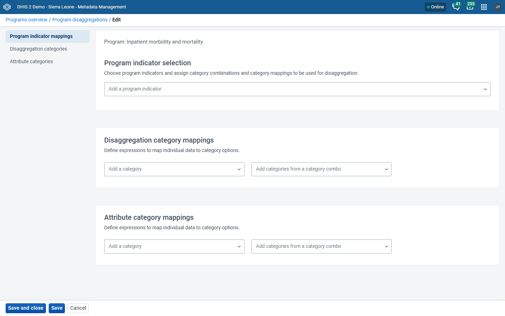

3. Under **Program indicator selection**, use the **Add a program indicator** picker to add the program indicator you want to map, in this example **BMI**.

4. Under **Disaggregation category mappings**, select a **Disaggregation category combination**, for example **Gender and U5y** (you may need to create a new category combination containing the categories **Gender** and **Under 5/5 and above of age** if not present).

    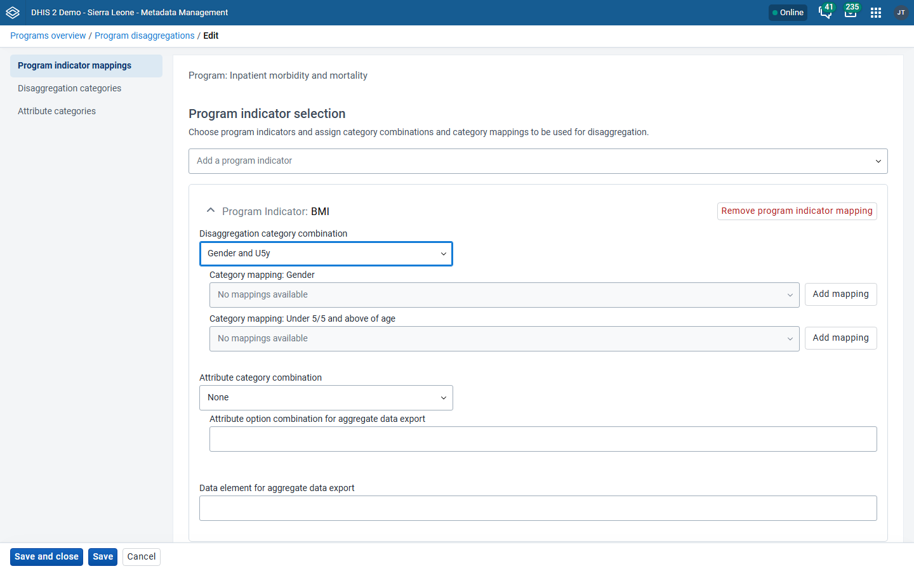

    As this is the first time these categories have been selected, there are no mappings currently available for them yet.

5. The categories from the combination appear as suggestions. Click **Add category** for both **Gender** and **U5y** (or use **Add a category** / **Add categories from a category combo** to add others), then click **Add mapping** on each category.

    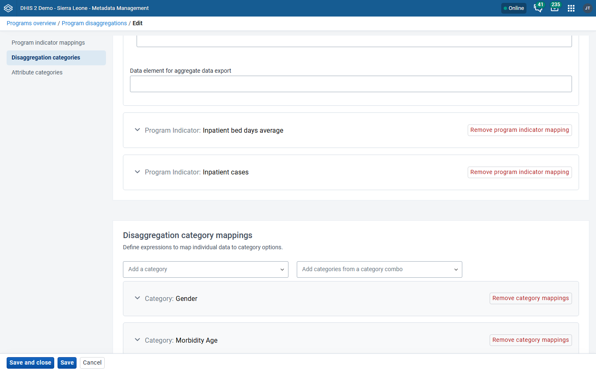

#### Create the category mappings

6. For each category, click **Set up filter** to open the expression editor and enter an expression using the program's data elements and attributes that defines the category. This uses the same expression language as a program indicator's own **Filter** section. It is recommended to open a program indicator within the program you are mapping, use its **Filter** section to construct the expression and then copy it into this field, so you can use that section's inbuilt expression validation.
   See [Functions, variables and operators](#mmp_program_indicator_functions_variables_operators).

    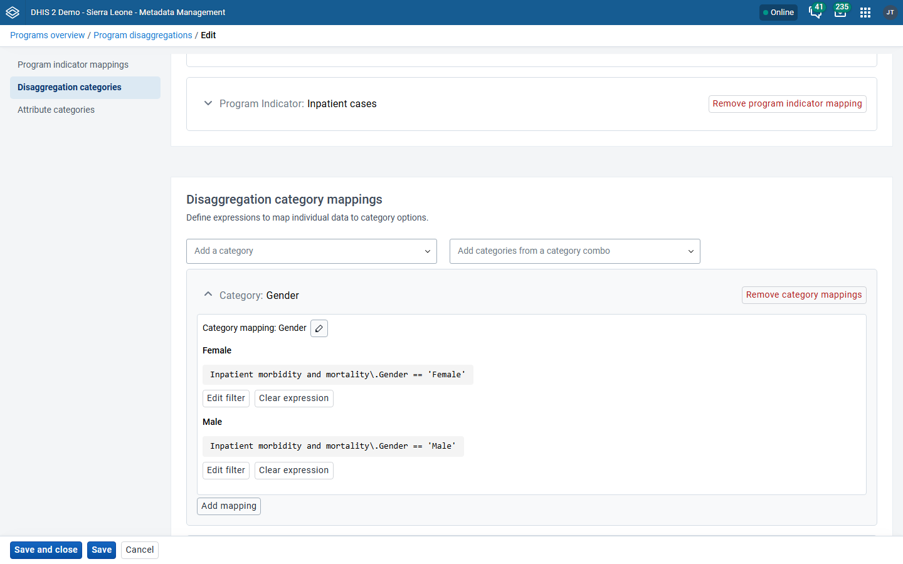
    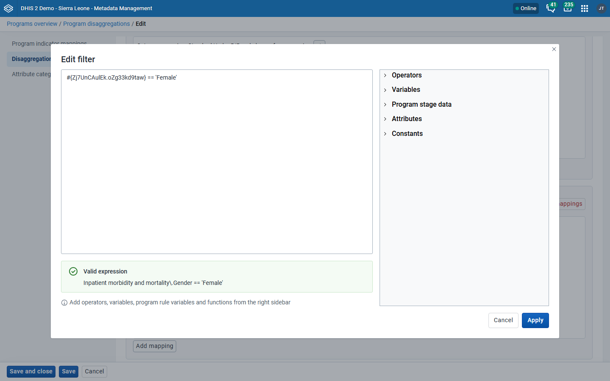{ .center width=60% }

    This example links the value selected in the **Gender** data element in the program to the category option. Since the option set in this case is a text field, the expression is set to match the text 'Female'. The next example for age shows a different way to define the relationship.

    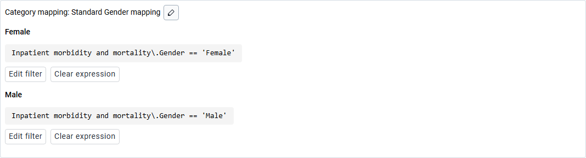

    To add the mapping for the Under 5 years and 5 years and above category options, since it is a numerical field you can use the operators `>` `>=` `<` `<=` `==` `!=` to define the relationship instead.

    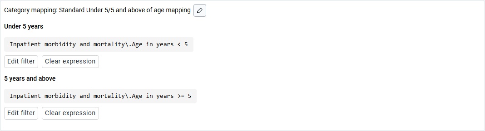

    If the program indicator also needs an attribute category combination mapped (rather than, or in addition to, the disaggregation category combination above), repeat this process under **Attribute category mappings**, selecting an **Attribute category combination** instead.

7. When mappings for all the category options are complete, click **Save and close** (or **Save** to save without leaving the page).

8. Open Data Visualizer. First, let's look at how this data was previously displayed. Create a visualisation showing the data of the 5 existing program indicators with the built-in disaggregations shown below.

    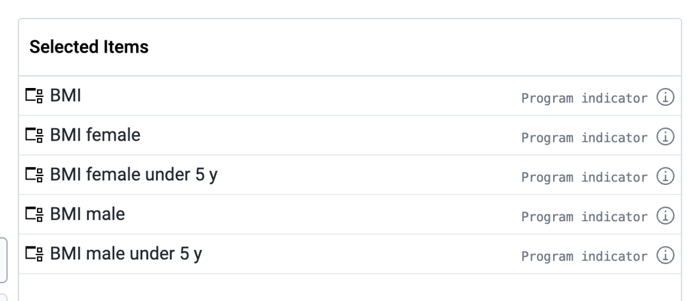{ .center width=60% }
    
    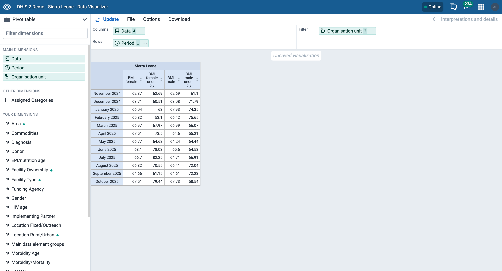

9. Now remove the 4 program indicators with disaggregations specified and leave only the BMI program indicator.

    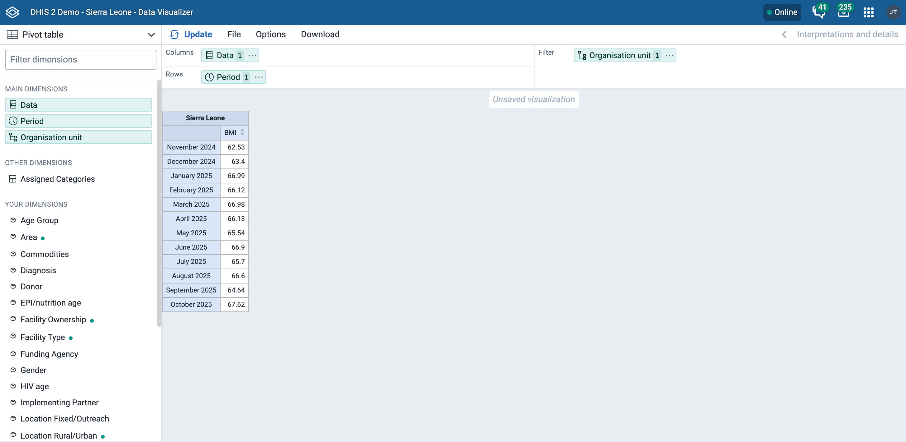

10. You can now add **Gender** and **Under 5/5 and above of age** as disaggregation categories from the Your Dimensions column for the program indicator, click update and see the results.

    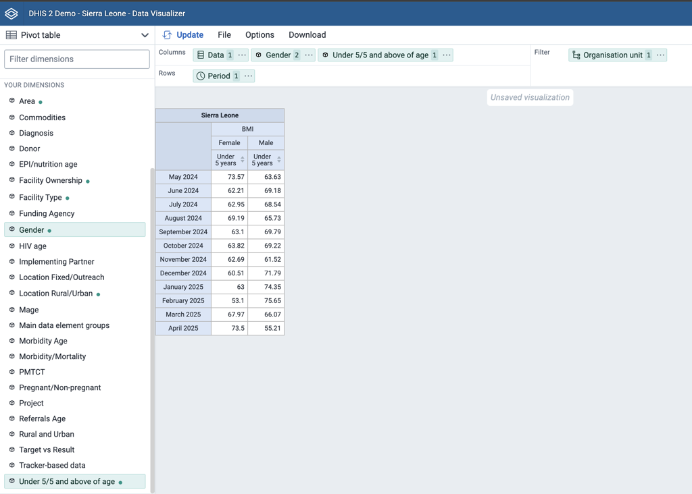

    You can now compare the data from the two separate program indicators and the single program indicator that has been disaggregated.

#### Transferring program indicator data via the Aggregate data exchange app

In addition to viewing a disaggregated program indicator in Data Visualizer, you can transfer the program data, via the disaggregated program indicator, into a data element that shares the same category combination.

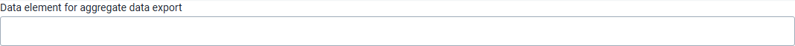

By adding the ID of a data element in the **Data element for aggregate data export** field, and then setting up the Aggregate Data Exchange app to transfer data, you can save program data in the aggregate data model.

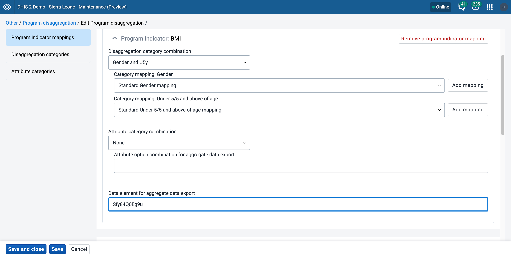

## Program indicators { #mmp_program_indicators }

Program indicators and program indicator groups are reached from **Indicators and Predictors → Program indicators** / **Program indicator groups** in the Metadata Management app, just as they were reached from the **INDICATOR** top-level tab in the Maintenance app.

The concepts, the create/edit form, and (most importantly) the full reference tables of functions, variables and operators available in program indicator expressions and filters are unchanged, and documented below.

### About program indicators { #mmp_about_program_indicators } 

Program indicators are expressions based on data elements and attributes
of tracked entities which can be used to calculate values based on a
formula. Program indicators consist of an aggregation type, an analytics
type, an expression and a filter.

Program indicators are evaluated based on the assigned aggregation type,
expression and filter. The order of evaluation is:

1.  The *filter* will filter the events which become part of the
    evaluation/aggregation routine.

2.  The *expression* will be evaluated per event.

3.  All evaluated expression values will be *aggregated* according to
    the aggregation type of the program indicator.

Table: Program indicator components

| Program indicator component | Description |
|---|---|
| Aggregation type | The aggregation type determines how the program indicator will be aggregated. The following aggregation types are available:  * Average  * Average (number)  * Average (number, disaggregation)  * Average (sum in organisation unit hierarchy)  * Average (sum of numbers)  * Average (sum of numbers, disaggregation)  * Average (Yes/No)  * Count  * Custom  The "custom" aggregation type allows you to specify the aggregation type in-line in the expression. All other aggregation types are applied to the entire expression.  Using the "custom" aggregation type might lead to an exception of the order of evaluation described above where individual parts of the expression can be evaluated and aggregated, as opposed to the entire expression being evaluated prior to aggregation.  * Default  * Max  * Min  * None  * Standard deviation  * Sum  * Variance |
| Analytics type | The available analytics types are *event* and *enrollment*. In the Metadata Management app, this field is labelled **Data source**.   The analytics type defines whether the program indicator is calculated based on events or program enrollments. This has an impact on what type of calculations can be made.  * Events implies a data source where each event exists as an independent row. This is suitable for performing aggregations such as counts and sums.  * Enrollments implies a data source where all events for a single enrollment is combined on the same row. This allows for calculations which can compare event data from various program stages within a program enrollment. |
| Organisation unit field | Determines which organisation unit is assigned to program indicator values.   For Event programs (without registration) the options are:  * Event organisation unit (default): where the event took place  * any data elements of value type Organisation Unit (if any) assigned to the program   For Tracker programs (with registration) and analytics type *Enrollment* the options are:  * Registration organisation unit: where the tracked entity instance was created  * Enrollment organisation unit (default): where the tracked entity instance was enrolled in this program  * Owner at start organisation unit: where the tracked entity instance was owned at the start of the reporting period  * Owner at end organisation unit: where the tracked entity instance was owned at the end of the reporting period   For Tracker programs (with registration) and analytics type *Event* the options are:  * Event organisation unit (default): where the event took place   * any data elements of value type Organisation Unit (if any) assigned to the program  * Registration organisation unit: where the tracked entity instance was created  * Enrollment organisation unit: where the tracked entity instance was enrolled in this program  * Owner at start organisation unit: where the tracked entity instance was owned at the start of the reporting period  * Owner at end organisation unit: where the tracked entity instance was owned at the end of the reporting period |
| Analytics period boundaries | Defines the boundaries for the program indicator calculation. The boundaries determine which events or enrollments gets included in aggregations, always relative to the aggregate reporting period start and end. When creating the program indicator, the default boundaries will get preselected based on analytics type.  * For analytics type *event*, the default boundaries will be configured to encapsulate any events with an event date after the reporting period starts and before the reporting period ends.  * For analytics type *enrollment*, the default boundaries will encapsulate all enrollments with an enrollment date after the reporting date starts and before the reporting period ends. In addition, the default enrollment program indicator evaluates the newest event for all program stages regardless of date.   It is possible to change the upper and lower boundaries to include a longer or shorter period relative to the reporting period, or delete one of the boundaries - in effect returning all data before or after a certain period. It is also possible to add more constraints, for example to make an enrollment program indicator only include event data up to a given point in time.  * Boundary target: Can be *incident date*, *event date*, *enrollment date* or *custom*. Designates what is being constrained by the boundary.    *custom* is used make boundary that target either a date data element, tracked entity attribute or the presence of an event in a program stage. This is done with a custom expression on the form:  - Data element of type date: #{programStageUid.dataElementUid}.  `#{A03MvHHogjR.a3kGcGDCuk6}`   - Tracked entity attribute of type date: #{attributeUid}.  `A{GPkGfbmArby}`   - Presence of one event in a specific program stage: PS_EVENTDATE:programStageUid.  `PS_EVENTDATE:A03MvHHogjR`    **Note**  This boundary target is only applicable to  Analytics type Enrollment   * Analytics period boundary type: Defines whether the boundary is an end boundary - starting with "before...", or a start boundary - "after...". Also defines whether the boundary relates to the end of the aggregate reporting period or the start of the aggregate reporting period.  * Offset period by amount: In some cases, for example cohort analytics, the boundary should be offset relative to the aggregate reporting period when running pivots and reports. The offset period by amount is used to move the current boundary either back(negative) or forward(positive) in time. The amount and period type together will determine how big the offset will be. An example can be when making a simple enrollment cohort program indicator for a 1 year cohort, it might be enough to offset each boundary of the program indicator with "-1" and "Years"  * Period type: See above. Can be any period, e.g. *Weekly* or *Quarterly*. |
| Expression | The expression defines how the indicator is being calculated. The expression can contain references to various entities which will be substituted with a related values when the indicator is calculated:  * Data elements: Will be substituted with the value of the data element for the time period and organisation unit for which the calculation is done. Refers to both program stage and data element.  * Attributes: Will be substituted with the value of the attribute for the person / tracked entity for which the calculation is done.  * Variables: Will be substituted with special values linked to the program, including incident date and date of enrollment for the person, current date and count of values in the expression for the time period and organisation unit for which the calculation is done.  * Constants: Will be substituted with the value of the constant.   The expression is a mathematical expression and can also contain operators.   For single event programs and tracker programs with analytics type *event*, the expression will be evaluated *per event*, then aggregated according to its aggregation type.   For tracker programs with analytics type *enrollment*, the expression will be evaluated *per enrollment*, then aggregated according to its aggregation type. |
| Filter | The filter is applied to events and filters the data source used for the calculation of the indicator. I.e. the filter is applied to the set of events before the indicator expression is being evaluated. The filter must evaluate to either true or false. It filter is applied to each individual event. If the filter evaluates to true then the event is included later in the expression evaluation, if not it is ignored. The filter can, in a similar way as expressions, contain references to data elements, attributes and constants.   The program indicator filter can in addition use logical operators. These operators can be used to form logical expressions which ultimately evaluate to either true or false. For example you can assert that multiple data elements must be a specific value, or that specific attributes must have numerical values less or greater than a constant. |

You manage the following program indicator objects:

| Object type | Available functions |
|---|---|
| Program indicator | Create, edit, clone, share, delete, show details and translate |
| Program indicator group | Create, edit, clone, share, delete, show details and translate |

### Create or edit a program indicator { #mmp_create_program_indicator } 

> **Note**
>
> A program indicator belongs to exactly one program.

Open the **Metadata Management** app and click **Indicators and Predictors** \> **Program indicators**, then click **New** (or select an existing program indicator to edit). The editor has its own section list:

* **Basic information**. Name, Short name, Code, Description, **Visual configuration** (color and icon).
* **Configuration**. **Program**, **Aggregation type**, **Data source** (**Event** or **Enrollment**, the analytics type described above), **Organisation unit field** (only shown once applicable to the program and data source chosen), and **Decimal places in output**.
* **Expression**. Click **Set up expression** (or **Edit expression** once one exists) to create the expression, based on mathematical operators and the attributes, variables and constants listed to the right.
* **Filter**. Click **Set up filter** (or **Edit filter** once one exists) to create the filter, the same way.
* **Period boundaries**. Click **Add a period boundary** to add one, with **Boundary target**, **Custom boundary text** (only for a **Custom** target), **Analytics period boundary type**, **Offset period by amount** and **Period type**. Existing boundaries can be edited or removed.
* **Advanced options**. **Show in data entry forms**, (optional) **Category option combination for aggregate data export**, (optional) **Attribute option combination for aggregate data export**, and (optional, DHIS2 2.42 and later) **Data element for aggregate data export**. **Show in data entry forms** determines whether the program indicator reaches data capture apps at all: with it unchecked, the indicator is never shown there.
* **Legends**. **Legend sets**, a transfer list letting you assign more than one.

Click **Save and close** when done.

### Create or edit a program indicator group { #mmp_create_program_indicator_group } 

1.  Open the **Metadata Management** app and click **Indicators and Predictors** \> **Program indicator groups**.

2.  Click **New**.

3.  Enter **Name** and **Code**.

4.  In the list of available program indicators, double-click the
    program indicators you want to assign to your group.

5.  Click **Save**.

### Reference information: Expression and filter examples per value type { #mmp_reference_information_program_indicator } 

The table below shows examples of how to write expressions and filters
for different data element and attribute value types:

Table: Expression and filter examples per value type

| Value types | Example syntax |
|---|---|
| Integer   Negative integer   Positive or zero integer   Positive integer   Number   Percentage | Numeric fields, can be used for aggregation as an expression, or in filters:  `#{mCXR7u4kNBW.K0A4BauXJDl} >= 3` |
| Yes/No   Yes only | Boolean fields. Yes is translated to numeric 1, No to numeric 0. Can be used for aggregation as an expression, or in filters:  `#{mCXR7u4kNBW.Popa3BauXJss} == 1` |
| Text   Long text   Phone number   Email   Time | Text fields. Can be checked for equality in filters:  `#{mCXR7u4kNBW.L8K4BauIKsl} == 'LiteralValue'` |
| Date   Age | Date fields. Most useful when combined with a d2:daysBetween function, which produces a number that can be aggregated as an expression or used in filters:  `d2:daysBetween(#{mCXR7u4kNBW.JKJKBausssl},V{enrollment_date}) > 100`  Can also directly be checked for equality in filters:  `#{mCXR7u4kNBW.JKJKBausssl} == '2011-10-28'` |

### Reference information: Functions, variables and operators to use in program indicator expressions and filters { #mmp_program_indicator_functions_variables_operators } 

An expression that includes both attributes, data elements and constants
looks like this:

    (A{GPkGfbmArby} + #{mCXR7u4kNBW.NFkjsNiQ9PH}) * C{bCqvfPR02Im}

An expression which uses the custom aggregation type and hence can use
inline aggregation types looks like
    this:

    (sum(#{mCXR7u4kNBW.K0A4BauXJDl} * #{mCXR7u4kNBW.NFkjsNiQ9PH}) / sum(#{mCXR7u4kNBW.NFkjsNiQ9PH})) * 100

Note how the "sum" aggregation operator is used inside the expression
itself.

Table: Functions for custom aggregation to use in a program indicator expression

| Function | Description |
|---|---|
| avg | The average of the argument's values across the aggregated rows. |
| count | The number of non-null values of the argument across the aggregated rows. |
| max | The largest of the argument's values across the aggregated rows. |
| min | The smallest of the argument's values across the aggregated rows. |
| stddev | The sample standard deviation of the argument's values across the aggregated rows. |
| sum | The sum of the argument's values across the aggregated rows. |
| variance | The sample variance of the argument's values across the aggregated rows. |

These functions are only usable when the program indicator's **Aggregation type** is set to **Custom**, and the argument is normally a data element or attribute reference, for example `sum(#{mCXR7u4kNBW.NFkjsNiQ9PH})`.

#### Adding comments in program indicator expression or filter
Uniform syntax is supported for both singleline and multiline comments

    d2:hasValue(#{mCXR7u4kNBW.NFkjsNiQ9PH}) /* this is comment */
    
    d2:hasValue(#{mCXR7u4kNBW.NFkjsNiQ9PH}) && /* this is 
    comment */
    d2:daysBetween(V{enrollment_date},PS_EVENTDATE:mCXR7u4kNBW)
    
#### Functions to use in a program indicator expression or filter

The program indicator expression and filter support a range of
functions. The functions can be applied to data elements and attributes:

 

Table: Functions to use in a program indicator expression or filter

| Function | Arguments | Description |
|---|---|---|
| d2:hasValue | (object) | Returns true if the data element/attribute has a value. Can be used in filters to distinguish between the number 0 and no value, and to distinguish between explicit "No" and no selection for a Yes/No field. |
| d2:minutesBetween | (datetime, datetime) | Produces the number of minutes between two data elements/attributes of type "date and time". When the first argument datetime comes before the second argument datetime, the number will be positive - in the opposite case, the number will be negative. The static datetime format is 'yyyy-MM-dd hh:mm'. Any of the arguments can be replaced with PS_EVENTDATE:(programStageUid) to compare the latest event date from a given program stage. |
| d2:daysBetween | (date, date) | Produces the number of days between two data elements/attributes of type date. When the first argument date comes before the second argument date, the number will be positive - in the opposite case, the number will be negative. The static date format is 'yyyy-MM-dd'. Any of the arguments can be replaced with PS_EVENTDATE:(programStageUid) to compare the latest event date from a given program stage. |
| d2:weeksBetween | (date, date) | Produces the number of full weeks between two data elements/attributes of type date. When the first argument date comes before the second argument date, the number will be positive - in the opposite case, the number will be negative. The static date format is 'yyyy-MM-dd'. Any of the arguments can be replaced with PS_EVENTDATE:(programStageUid) to compare the latest event date from a given program stage. |
| d2:monthsBetween | (date, date) | Produces the number of full months between two data elements/attributes of type date. When the first argument date comes before the second argument date, the number will be positive - in the opposite case, the number will be negative. The static date format is 'yyyy-MM-dd'. Any of the arguments can be replaced with PS_EVENTDATE:(programStageUid) to compare the latest event date from a given program stage. |
| d2:yearsBetween | (date, date) | Produces the number of full years between two data elements/attributes of type date. When the first argument date comes before the second argument date, the number will be positive - in the opposite case, the number will be negative. The static date format is 'yyyy-MM-dd'. Any of the arguments can be replaced with PS_EVENTDATE:(programStageUid) to compare the latest event date from a given program stage. |
| d2:condition | (boolean-expr, true-expr, false-expr) | Evaluates the boolean expression and if true returns the true expression value, if false returns the false expression value. The conditional expression must be quoted. The true-expr and false-expr arguments must follow the rules of any program indicator expression (including functions). |
| d2:zing | (expression) | Returns zero if the expression is negative, otherwise returns the expression value. The expression must follow the rules of any program indicator expression (including functions). |
| d2:oizp | (expression) | Returns one if the expression is zero or positive, otherwise returns zero. The expression must follow the rules of any program indicator expression (including functions). |
| d2:zpvc | (object, [,object ...]) | Returns the number of numeric zero and positive values among the given object arguments. Can be provided any number of arguments. |
| d2:relationshipCount | ([relationshipTypeUid]) | Produces the number of relationships of the given type that is connected to the enrollment or event. When no type is given, all types are counted. |
| d2:count | (dataElement) | Only meaningful for enrollment program indicators. Counts the number of data values that has been collected for the given program stage and data element in the course of the enrollment. The argument data element is supplied with the #{programStage.dataElement} syntax. In an event program indicator this still executes, but produces the same enrollment-wide total on every event rather than a per-event value. |
| d2:countIfValue | (dataElement, value) | Only meaningful for enrollment program indicators. Counts the number of data values that matches the given literal value for the given program stage and data element in the course of the enrollment. The argument data element is supplied with the #{programStage.dataElement} syntax. The value can be a hard coded text or number, for example 'No_anemia' if only the values containing this text should be counted. In an event program indicator this still executes, but produces the same enrollment-wide total on every event rather than a per-event value. |
| d2:countIfCondition | (dataElement, condition) | Only meaningful for enrollment program indicators. Counts the number of data values that matches the given condition criteria for the given program stage and data element in the course of the enrollment. The argument data element is supplied with the #{programStage.dataElement} syntax. The condition is supplied as a expression in single quotes, for example '<10' if only the values less than 10 should be counted. In an event program indicator this still executes, but produces the same enrollment-wide total on every event rather than a per-event value. |
| d2:maxValue | (dataElement) | Produces the maximum value of the given data element across the events in the enrollment. The argument data element is supplied with the #{programStage.dataElement} syntax. In an event program indicator this has no aggregation effect: it just returns the data element's own value, the same as referencing it directly. |
| d2:minValue | (dataElement) | Produces the minimum value of the given data element across the events in the enrollment. The argument data element is supplied with the #{programStage.dataElement} syntax. In an event program indicator this has no aggregation effect: it just returns the data element's own value, the same as referencing it directly. |
| if | (boolean-expr, true-expr, false-expr) | Evaluates the boolean expression and if true returns the true expression value, if false returns the false expression value. This is identical to the d2:condition function except that the boolean-expr is not quoted. |
| is | (expr1 in expression [, expression ...]) | Returns true if expr1 is equal to any of the following expressions, otherwise false. |
| isNull | (object) | Returns true if the object value is missing (null), otherwise false. |
| isNotNull | (object) | Returns true if the object value is not missing (not null), otherwise false. |
| firstNonNull | (object [, object ...]) | Returns the value of the first object that is not missing (not null). Can be provided any number of arguments. Any argument may also be a numeric or string literal, which will be returned if all the previous objects have missing values. |
| greatest | (expression [, expression ...]) | Returns the greatest (highest) value of the expressions given. Can be provided any number of arguments. Each expression must follow the rules of any program indicator expression (including functions). |
| least | (expression [, expression ...]) | Returns the least (lowest) value of the expressions given. Can be provided any number of arguments. Each expression must follow the rules of any program indicator expression (including functions). |
| log | (expression [, base ]) | Returns the natural logarithm (base e) of the numeric expression. If an integer is given as a second argument, returns the logarithm using that base. |
| log10 | (expression) | Returns the common logarithm (base 10) of the numeric expression. |
| contains | (text,text, ...) | Searches an expression for one or more substrings. Returns true if the expression contains all the substrings. Comparisons are case-sensitive. |
| containsItems | (text,text, ...) | Searches a comma-separated expression for one or more items. Returns true if every item exactly matches an element in the expression. Comparisons are case-sensitive. |
| removeZeros | (expression) | Replaces a value of exactly zero with no value, so it is excluded from aggregation instead of counted as zero. |

A filter that uses the "hasValue" function looks like this:

    d2:hasValue(#{mCXR7u4kNBW.NFkjsNiQ9PH})

A filter that uses the "relationshipCount(relationshipTypeUid)" function looks like this:

    d2:relationshipCount('KLkjshoQ90U')

A filter that uses the "is( x in y, z )" function looks like this:

    is(#{oahc9ooVema} in 'New', 'Relapse')

An expression that uses the "zing" and "oizp" functions looks like this:

    d2:zing(A{GPkGfbmArby}) + d2:oizp(#{mCXR7u4kNBW.NFkjsNiQ9PH}))

An expression that uses the "daysBetween" function looks like this:

    d2:daysBetween(#{mCXR7u4kNBW.k8ja2Aif1Ae},'2015-06-01')

An expression that uses the "yearBetween" function to compare the latest event of the program stage 'mCXR7u4kNBW' to the enrollment date looks like this:

    d2:daysBetween(V{enrollment_date},PS_EVENTDATE:mCXR7u4kNBW)

An expression that uses the "condition" function looks like this:

    d2:condition('#{mCXR7u4kNBW.NFkjsNiQ9PH} > 100',150,50)

An expression that uses the "countIfValue" function to only count the number of times the value 10 has been collected looks like this:

    d2:countIfValue(#{mCXR7u4kNBW.NFkjsNiQ9PH}),10)

An expression that uses the "zpvc" function looks like this:

    d2:zpvc(A{GPkGfbmArby}),#{mCXR7u4kNBW.NFkjsNiQ9PH}),4,-1)

An expression that uses the "if" and "isnull" functions looks like this:

    if(isNull(A{GPkGfbmArby}),10,20)

An expression that uses the "firstNonNull" function looks like this:

    firstNonNull(A{GPkGfbmArby}),#{mCXR7u4kNBW.NFkjsNiQ9PH},44)

An expression that uses the "greatest" function looks like this:

    greatest(#{mCXR7u4kNBW.k8ja2Aif1Ae},#{mCXR7u4kNBW.NFkjsNiQ9PH},1)

#### Variables to use in a program indicator expression or filter

The program indicator expression and filter support a range of
variables:

Table: Variables to use in a program indicator expression or filter

| Variable | Description |
|---|---|
| event_date | The date of when the event or the last event in the enrollment took place. |
| creation_date | The date of when an event or enrollment was created in the system. |
| due_date | The date of when an event is due. |
| scheduled_date | The date an event is scheduled for. Produces the same value as "due_date". |
| sync_date | The date of when the event or enrollment was last synchronized with the Android app. |
| incident_date | The date of the incidence of the event. |
| enrollment_date | The date of when the tracked entity instance was enrolled in the program. |
| enrollment_status | Can be used to include or exclude enrollments in certain statuses.   When calculating the haemoglobin improvement/deterioration throughout a pregnancy, it might make sense to only consider completed enrollments. If non-completed enrollments is not filtered out, these will represent half-finished ANC followups, where the final improvement/deterioration is not yet established. |
| current_date | The current date. |
| value_count | The number of non-null values in the expression part of the event. |
| zero_pos_value_count | The number of numeric positive values in the expression part of the event. |
| event_count | The count of events (useful in combination with filters). Aggregation type for the program indicator must be COUNT. |
| scheduled_event_count | The count of events with status SCHEDULE (useful in combination with filters). Aggregation type for the program indicator must be COUNT. |
| enrollment_count | The count of enrollments (useful in combination with filters). Aggregation type for the program indicator must be COUNT.  |
| tei_count | The count of tracked entity instances (useful in combination with filters). Aggregation type for the program indicator must be COUNT. |
| org_unit_count | The count of organisation units (useful in combination with filters). Aggregation type for the program indicator must be COUNT. |
| program_stage_name | Can be used in filters for including only certain program stages in a filter for tracker programs. Uses the name of the program stage:  `V{program_stage_name} == 'ANC first visit'` |
| program_stage_id | Can be used in filters for including only certain program stages in a filter for tracker programs. Uses the unique identifier of the program stage:  `V{program_stage_id} == 'YPSSfbmAtt1'` |
| analytics_period_start | Can be used in filters or expressions for comparing any date to the first date in each reporting period.  `d2:daysBetween(#{WZbXY0S00lP.w4ky6EkVahL}, V{analytics_period_start})` |
| analytics_period_end | Can be used in filters or expressions for comparing any date to the last inclusive date in each reporting period. |
| event_status | Can be used in filters or expressions for comparing event status.  `V{event_status} == 'COMPLETED'` |
| completed_date | Contains completion date of the event. If the event is not yet complete, then "completed_date" contains nothing. |

A filter that uses the "Analytics period end" variable to only include
women who has an LMP that would be in the first
    trimester:

    d2:daysBetween(#{WZbXY0S00lP.w4ky6EkVahL}, V{analytics_period_end}) <= 84

An expression that uses the "value count" variable looks like
    this:

    (#{A03MvHHogjR.a3kGcGDCuk6} + #{A03MvHHogjR.wQLfBvPrXqq}) / V{value_count}

An expression that uses the "event\_date" and "incident\_date" variables
looks like this:

    d2:daysBetween(V{incident_date},V{event_date})

#### Operators to use in a program indicator expression

A program indicator expression can use the following arithmetic operators, in addition to the functions above:

Table: Arithmetic operators to use in a program indicator expression

| Operator | Description |
|---|---|
| + | Add two numbers |
| - | Subtract one number from another |
| \* | Multiply two numbers |
| / | Divide two numbers |
| ^ | Exponentiation |
| % | The modulus of two numbers |

#### Operators to use in a program indicator filter

Table: Operators to use in a program indicator filter

| Operator | Description |
|---|---|
| and | Logical AND |
| or | Logical OR |
| == | Equal to |
| != | Not equal to |
| < | Less than |
| <= | Less than or equal to |
| > | Greater than |
| >= | Greater than or equal to |

These operators can be used to form logical expressions which ultimately
evaluate to either true or false. For example you can assert that
multiple data elements must be a specific value, or that specific
attributes must have numerical values less or greater than a constant.

A filter that uses both attributes and data elements looks like this:

    A{cejWyOfXge6} == 'Female' and #{A03MvHHogjR.a3kGcGDCuk6} <= 2

#### Missing values in program indicator filters

In a program indicator **filter**, a comparison against a data element or tracked entity
attribute that has no recorded value is neither true nor false, so the record is excluded
from the result. This applies to `==` and `!=` alike: `!= 1` does **not** include records where the
value is blank.

##### Worked example

Child Programme, *Baby Postnatal* stage, *MCH Yellow fever dose*, January 2026, Sierra Leone.
The stage has 778 events: 370 recorded **Yes**, 405 recorded **No**, and 3 were left **blank**.

| Filter | Returns | |
|---|---|---|
| `#{ZzYYXq4fJie.rxBfISxXS2U} == 1` | 370 | Yes |
| `#{ZzYYXq4fJie.rxBfISxXS2U} != 1` | 405 | No only; the 3 blanks are dropped |
| stage-guarded blank-tolerant form (below) | 408 | No + blank |

Note that 370 + 405 = 775, which is 3 short of the 778 events at the stage, while
370 + 408 = 778 exactly. If you are reconciling a program indicator against the Line Listing
or Event Reports app, this difference is usually the cause.

##### Recipes

| Intent | Filter |
|---|---|
| Value is recorded and is No | `#{X.de} == 0` |
| Value is No **or** blank (event program indicator) | `V{program_stage_id} == 'X' && (!d2:hasValue(#{X.de}) \|\| #{X.de} != 1)` |
| Value is No **or** blank (enrollment program indicator) | `!d2:hasValue(#{X.de}) \|\| #{X.de} != 1` |
| Value is recorded and is not No | `d2:hasValue(#{X.de}) && #{X.de} != 1` |
| Text: not `'Rapid'`, including blank | `V{program_stage_id} == 'X' && (!d2:hasValue(#{X.de}) \|\| #{X.de} != 'Rapid')` |
| Has any value | `d2:hasValue(#{X.de})`. Do **not** use `== ''` |

A clearer alternative for "count everything that is not Yes" is to put the logic in the
expression with `d2:condition`, whose `else` branch covers blanks without a double negative:

    expression:      d2:condition("#{ZzYYXq4fJie.rxBfISxXS2U} == 1", 0, 1)
    filter:          V{program_stage_id} == 'ZzYYXq4fJie'
    aggregationType: SUM

##### `== ''` never matches

A blank value is *absent*, not an empty string, so a filter clause such as
`#{X.de} == ''` never matches any record. Combined with `&&` it makes the whole program
indicator return nothing; combined with `||` it is silently dead code. Use
`!d2:hasValue(#{X.de})` instead.

`#{X.de} != ''` does work as a presence check, but `d2:hasValue(#{X.de})` states the intent
more clearly and behaves identically.

##### Event program indicators are not restricted to one program stage

A program indicator has a `program`, not a program stage. An event program indicator with no
filter counts every event of every stage in the program.

Stage scoping happens as a side effect of each `#{stage.dataElement}` reference: a clause that
requires a *positive* match on a data element of a given stage can only be true for events of
that stage. A clause that can be true *without* a value at that stage is not scoped. In
particular `!d2:hasValue(#{stage.dataElement})` is true for every event of every **other**
stage.

For the example above, the filter
`!d2:hasValue(#{ZzYYXq4fJie.rxBfISxXS2U}) || #{ZzYYXq4fJie.rxBfISxXS2U} != 1` returns
**1102** rather than 408, because it also matches all 694 events of the *Birth* stage.

Add `V{program_stage_id} == '<stageUid>' &&` whenever the filter contains `!d2:hasValue(...)`,
or when the blank handling lives in the expression rather than the filter. If every `&&`-ed
clause already requires a positive match on a data element of that stage, the guard is
redundant. `V{program_stage_id}` is empty for enrollment program indicators, where it is
neither needed nor usable: the enrollment subquery is already restricted to the stage.

##### Filters and expressions treat blanks differently

Filters exclude blanks, but **expressions still substitute a default** for a missing value:
`0` for numeric and boolean, `''` for text. The two halves of the same program indicator
therefore disagree about what a blank means:

| | in a filter | in an expression |
|---|---|---|
| `#{X.booleanDe} == 0` | 405 (blanks excluded) | 408 (blanks counted as 0) |
| `#{X.textDe} == ''` | 0 (never matches) | 3 (matches the blanks) |

Two consequences. A record admitted by a blank-tolerant filter contributes `0` to the
expression, which matters for `SUM` and `AVERAGE` program indicators. And a condition written
inside `d2:condition(...)` follows the *expression* rule, not the filter rule, so
`d2:condition("#{X.de} == 0", 1, 0)` counts blanks as No.

##### Enrollment program indicators: blank also means "no event"

On an enrollment program indicator, a blank value covers both "the event exists but the field
was left empty" and "no event of that stage exists for this enrollment". These cannot be
distinguished. For coverage reporting that is usually what you want; if it is not, use an
event program indicator.

## Tracked entity types, tracked entity attributes, and relationship types { #mmp_tracked_entity_relationship }

Reached from **Programs → Tracked entity types**, **Programs → Tracked entity attributes**, and **Programs → Relationship types**. These list and edit screens follow the same shared conventions as every other object type in the app. See [Common metadata object fields](#mm_common_metadata_fields), [Common actions](#mm_common_actions) and [Using a transfer list component](#mm_transfer_list_component) in [Configure metadata (Metadata Management app)](#metadata_management_app) 
For what a tracked entity type, tracked entity attribute, or relationship type configures, see below.

### About relationship types { #mmp_about_relationship_types } 

A relationship represents a link between two entities in the tracker model. A relationship is considered data in DHIS2 and is based on a relationship type, similar to how a tracked entity is based on a tracked entity type.

Relationships always include two entities, and these entities can include tracked entities, enrollments and events, and any combination of these.

> [!NOTE]
> Not all of these combinations are available in the current apps. Currently in the Capture app, you can create:
> * Tracked entity to tracked entity relationships
> * Event in event programs to tracked entity relationships (only from the event side)
> * Event in one program stage to event in another program stage in the same program (related stages - see more information [here](https://docs.dhis2.org/en/use/user-guides/dhis-core-version-241/tracking-individual-level-data/capture.html#related-stages-and-linked-events-for-tracker-programs))

Related-stage linking only works when **exactly one** relationship type matches: both sides must be constrained to **Event**, both stages must belong to the same program, and the user needs data write access to that relationship type. With no matching relationship type, no linking is offered; with more than one match, no linking is offered either, and the message **"Ambiguous relationships, contact system administrator"** is shown instead.

In addition, relationships can be defined as unidirectional or bidirectional. The only functional difference is currently that these require different levels of access to create. Unidirectional relationships require the user to have data write access to the "from" entity and data read access for the "to" entity, while bidirectional relationships require data write access for both sides.

For more information about the underlying model, see [Relationship model](#relationship_model_relationship_type).

### Create or edit a relationship type { #mmp_create_relationship_type } 

1. Open the **Metadata Management** app and click **Programs** > **Relationship types**.

2. Click the **+ New** button.

3. Type a **Name** for the relationship type.

4. (Optional) Assign a **Code**.

5. (Optional) Provide a **Description**.

6. (Optional) Select **"Bidirectional: relationship can be created from both sides"**.

7. Provide a **Name shown for initiating entity**. Required. For example, in a mother-child relationship this could be 'Mother of'.

8. If the relationship is bidirectional, also provide a **Name shown for receiving entity**, for example 'Mother'. This field only appears once **Bidirectional** is ticked, and is required in that case; unticking **Bidirectional** hides it again.

9. Under **Initiating side (From)**, choose what kind of entity this side of the relationship constrains: **Event**, **Enrollment**, or **Tracked entity**. See [Relationship model](#relationship_model_relationship_type).
    * **Tracked entity**. Choose a **Tracked entity type**, then optionally a **Program**. Reveals a transfer list, **"Choose which tracked entity attributes are shown when viewing the relationship"**, sourced from the tracked entity type's (and, if chosen, the program's) attributes.
    * **Enrollment**. Choose a **Program** (required). Reveals the same kind of tracked entity attributes transfer list, sourced from the program's attributes.
    * **Event**. Choose a **Program** (required), then a **Program stage** once a tracker program is picked. Reveals a transfer list of data elements instead, **"Choose which data elements are shown when viewing the relationship"**, sourced from the program stage's data elements.

10. Under **Receiving side (To)**, repeat the same choice for the other side of the relationship.

11. Click **Save and close**, or **Save** to save without leaving the page.

### About tracked entity types { #mmp_about_tracked_entity_type } 

A tracked entity is a type of entity which can be tracked through the
system. It can be anything from persons to commodities, for example a
medicine or a person.

A program must have one tracked entity. To enroll a tracked entity
instance into a program, the tracked entity type of the entity and
the tracked entity type of the program must be the same.

Tracked entity attributes are used to register extra information for a
tracked entity. Tracked entity attributes can be shared between
programs.

### Create or edit a tracked entity attribute { #mmp_create_tracked_entity_attribute }

The Metadata Management app splits this form
into tabs (Basic information, Data collection, Data handling, Search performance, Legends).
Several fields moved tabs and a few are new compared with the Maintenance app's single linear
form.

1. Open the **Metadata Management** app and click **Programs** > **Tracked entity attributes**.

2. Click the **+ New** button.

3. On the **Basic information** tab, fill in **Name**, **Form name**, **Short name**, **Code**
   and **Description**. See [Common metadata object fields](#mm_common_metadata_fields) in
   [Configure metadata (Metadata Management app)](#metadata_management_app). Only **Name** and
   **Short name** are required.

4. On the **Data collection** tab:

   1. (Optional) Select an **Option set**. This overrides the **Value type** selection to match
      the option set.

   2. Select a **Value type**. The type of data that the tracked entity attribute will record.

      Table: Value types

      | Value type | Description |
      |---|---|
      | Age | Dates rendered as calendar widget OR by entering number of years, months and/or days which calculates the date value based on current date. The date will be saved in the backend. |
      | Coordinate | A point coordinate specified as longitude and latitude in decimal degrees. All coordinate should be specified in the format "-19.23 , 56.42" with a comma separating the longitude and latitude. |
      | Date | Dates render as calendar widget in data entry. |
      | Date and time | Is a combination of the **DATE** and **TIME** data elements. |
      | Email | Valid email address. |
      | File | A file resource where you can store external files, for example documents and photos. |
      | Image | A file resource where you can store photos.       Unlike the **FILE** data element, the **IMAGE** data element can display the uploaded image directly in forms. |
      | Integer | Any whole number (positive and negative), including zero. |
      | Letter | A single letter. |
      | Long text | Textual value. Renders as text area with no length constraint in forms. |
      | Negative integer | Any whole number less than (but not including) zero. |
      | Number | Any real numeric value with a single decimal point. Thousands separators and scientific notation is not supported. |
      | Percentage | Whole numbers inclusive between 0 and 100. |
      | Phone number | Phone number. |
      | Positive integer | Any whole number greater than (but not including) zero. |
      | Positive or Zero integer | Any positive whole number, including zero. |
      | Organisation unit | Organisation units rendered as a hierarchy tree widget.       If the user has assigned "search organisation units", these will be displayed instead of the assigned organisation units. |
      | Unit interval | Any real number greater than or equal to 0 and less than or equal to 1. |
      | Text | Textual value. The maximum number of allowed characters per value is 50,000. |
      | Time | Time is stored in HH:mm format.       HH is a number between 0 and 23       mm is a number between 00 and 59 |
      | Username | DHIS2 user. Rendered as a dialog with a list of users and a search field. The user will need the "View User" authority to be able to utilise this data type. |
      | Yes/No | Boolean values, renders as drop-down lists in data entry. |
      | Yes only | True values, renders as check-boxes in data entry. |

   3. (Optional) Select **Unique values only** to require that every value of this attribute is
      unique. Selecting the checkbox reveals:

      - **Across entire system** or **Per organisation unit**. Whether the value must be
        unique system-wide, or only unique within the same organisation unit.
      - **Automatically generate values**. Select this to have the app generate the value
        automatically. This reveals a **Pattern for automatically generated values** field,
        which takes a pattern in DHIS2 TextPattern syntax. When a value is auto-generated this
        way it is unique for this attribute across the entire system regardless of the scope
        chosen above. This option is hidden when the scope above is set to **Per organisation
        unit**.

   4. (Optional) In the **Field mask** field, type a template used to hint at the correct
      formatting of the attribute. **This is currently only implemented in the DHIS2 Android
      Capture app, not in the web Capture app.** The following special
      characters match exactly one character of the given type:

      | Character | Match |
      | ------------- |----------------|
      | \d | digit |
      | \x | lower case letter |
      | \X | capital letter |
      | \w | any alphanumeric character |

      For example, the pattern `\d\d\d-\d\d\d-\d\d\d` shows a hyphen for every third digit.

5. On the **Data handling** tab:

   1. (Optional) Select **Inherit values from tracked entities linked by a relationship** to
      pre-fill this attribute's value, when registering a new entity, with the value already
      held by a related entity.
   2. (Optional) Select **Show in lists and search results when no program is selected**.
   3. (Optional) Select **Skip synchronization for this attribute and its values**.
   4. (DHIS2 2.43 and later) Select **Do not expose this attribute in analytics** to exclude
      the attribute from all analytics processing, including analytics tables and analytics
      apps.
   5. Select an **Aggregation type**. The default way this attribute is aggregated in
      analytics. Disabled for value types that cannot be aggregated.

6. On the **Search performance** tab (DHIS2 2.43 and later; this tab does not appear on an
   older server):

   1. (Optional) Select a **Preferred search operator**. Apps try to use this operator first,
      but may use others when needed. This preference is only actually
      honoured for a non-unique attribute of type Text, Long text, Phone number, or Email. A
      unique attribute or an option-set-backed attribute is always searched with Equal to
      instead, and a numeric, date/time, percentage, boolean, organisation unit, age, or
      username attribute always uses a fixed operator for its type (Range for numeric, date,
      time and percentage; Equal to for the rest), ignoring this preference.
   2. (Optional) Select one or more **Blocked search operators**. Searches using these
      operators return no results. Use this to prevent inefficient searches.
   3. (Optional) Set **Minimum characters required to search**. Users must enter at least this
      many characters before a search runs. Enter 0 for no minimum.
   4. (Optional) Select **Mark for trigram indexing**. Only relevant when using LIKE or
      "ends with" based searches.

7. On the **Legends** tab, (optional) assign one or multiple **Legends**.

8. Click **Save and close**, or **Save** to save without leaving the page.

### Create or edit a tracked entity type { #mmp_create_tracked_entity_type }

Like tracked entity attributes, this form is
now tabbed (Basic information, Tracked entity attributes), and gained several
fields that did not exist in the Maintenance app.

1. Open the **Metadata Management** app and click **Programs** > **Tracked entity types**.

2. Click the **+ New** button, or click an existing **tracked entity type** to edit it.

3. On the **Basic information** tab:

   1. Fill in **Name** and **Short name**. Both required. **Short name** is new compared
      with the Maintenance app; see [Common metadata object fields](#mm_common_metadata_fields)
      in [Configure metadata (Metadata Management app)](#metadata_management_app).
   2. (Optional) Under **Visual configuration**, select a **Color** and an **Icon** that the
      data capture apps use to identify this tracked entity type.
   3. (Optional) Enter a **Description**.
   4. Select a **Location type**. **Point**, **Polygon/Area**, or **Do not collect location
      data**. This is new compared with the Maintenance app, which did not offer a location
      type choice here.
   5. (Optional) Select **Enable tracked entity instance audit log**. This is also new.
   6. (Optional) Enter a **Minimum number of attributes required to search**. This specifies
      how many attributes must be filled in to search for this tracked entity type in a
      *global search*. See [Configure search](#mmp_configure_search) below.
   7. (Optional) Enter a **Maximum number of tracked entity instances to return when
      searching**. Entering 0 shows all search results.
   8. DHIS2 2.43.2 and later also adds a **Name (Plural)** field.

4. On the **Tracked entity attributes** tab, move attributes from **Available Tracked entity
   attributes** into **Selected Tracked entity attributes** using the transfer list. See
   [Using a transfer list component](#mm_transfer_list_component) in
   [Configure metadata (Metadata Management app)](#metadata_management_app). Once attributes
   are selected, the **Manage attributes** grid below lets you mark each one **Required**,
   **Searchable**, and/or **Display in list**.

5. Click **Save and close**, or **Save** to save without leaving the page.

## Configure search { #mmp_configure_search }

Users can be given search organisation units, which makes it possible to
search for tracked entity instances outside their data capture
organisation units.

Searching can be done either in the context of a program, or in the
context of a tracked entity type. To give users the option of
searching in the context of a program, it is necessary to configure
which of the programs tracked entity attributes is searchable. To give
users the option of searching in the context of a tracked entity type,
you will have to configure which of the tracked entity type attributes
is searchable.

### Configure search for a tracker program { #mmp_configure_search_tracker_program }

To be able to search with a program, you will have to make some of the
program attributes searchable. Unique program attributes will always be
searchable.

1.  Open the **Metadata Management** app and click **Programs** \> **Programs**.

2.  Open or create a tracker program.

3.  Go to the **Enrollment: Data** section.

4.  If you have no attributes, add one.

5.  Set the attribute searchable.

Searchable program attributes will be assigned to a search group.

  - Unique group. One group per unique program attribute. Unique
    attributes cannot be combined with other program attributes in a
    search. The result from the search can only be 0 or 1 tracked entity
    instance.

  - Non-unique group. This group contains all non-unique program
    attributes and makes it possible to combine multiple attributes in a
    search.

There are two limits that can be set for a program search, as part of
the program's own **Program Details** section (see [Program Details](#mmp_tracker_program_details) above):

  - **Minimum number of attributes required to search**. Defines how many of the non-unique
    attributes must be entered before a search can be performed.

  - **Maximum number of search results to display**. Defines how specific a
    search must be, by limiting the number of matching tracked entities a user is allowed to get for
    their search criteria. If the number of matching records is larger than this setting, the server rejects
    the search with an error rather than returning a partial list. The user must then provide more specific search
    criteria, in order to reduce the number of matching records. More on limits
    [here](../developer/web-api/tracker.md#tracked-entities-collection-limits).

    > **NOTE**
    >
    > This limit is only applied to search results when searching outside the user's capture scope. Within the
    capture scope, the user can see any number of results.

### Configure search for a tracked entity type { #mmp_configure_search_tracked_entity_type }

To be able to search without a program, you will have to make some of
the tracked entity type's attributes searchable. Unique attributes will always be
searchable.

1.  Open the **Metadata Management** app and click **Programs** \> **Tracked entity types**.

2.  Open a tracked entity type.

3.  If it has no attributes, add one, under its **Tracked entity attributes** tab.

4.  Set the attribute searchable.

Searchable attributes will be assigned to a search group.

  - Unique group. One group per unique attribute. Unique attributes
    cannot be combined with other attributes in a search. The result
    from the search can only be 0 or 1 tracked entity instance.

  - Non-unique group. This group contains all non-unique attributes
    and makes it possible to combine multiple attributes in a search.

There are two limits that can be set, as part of the tracked entity type's own **Basic
information** tab (see [Create or edit a tracked entity type](#mmp_create_tracked_entity_type) above):

  - **Minimum number of attributes required to search**. Defines how many of the non-unique
    attributes must be entered before a search can be performed.

  - **Maximum number of tracked entity instances to return when searching**. Defines how specific a search must be, by limiting the number of matching tracked entities a user is allowed to get for their search criteria. If the number of matching records is larger than this maximum, they will not be returned. The user must provide more specific search criteria, in order to reduce the number of matching records, before they are returned.

    > **NOTE**
    >
    > This maximum is only applied to search results outside the user's capture scope. Within the capture scope, the user can see any number of results.

### Configure search organisation units for a user { #mmp_configure_search_org_units }

To be able to search in other organisation units than the users data
capture organisation units, the user must be assigned with search
organisation units. Giving a user a search organisation unit will also
give them access to search in all children of that organisation unit.

This is configured in the **Users app**, not the Metadata Management app:

1.  Open the **Users** app.

2.  Click on a user.

3.  Open **Assign search organisation units**.

4.  Select organisation units.

5.  Click **Save**.
