# Configure programs (Metadata Management app) { #mmp_configure_programs }

> **Note**
>
> This section documents the **Programs** section of the **Metadata Management app**, which replaces the Program-related functionality of the legacy Maintenance app. The Metadata Management app is available from the [DHIS2 App Hub](https://apps.dhis2.org/app/3c6d0723-904c-4c7a-bbd6-35f3c3aa356b) and is compatible with DHIS2 core V41 and above.
>
> If you are using DHIS2 without the Metadata Management app installed, see [Configure programs in the Maintenance app](#configure_programs_in_maintenance_app) for the Maintenance app instead.

Public health information systems traditionally report aggregated data about service provision across their health programs. This does not allow you to trace the people provided with these services. In DHIS2, you can define your own programs with stages. These programs are an essential part of the "tracker" functionality which lets you track individual records. You can also track other 'entities' such as wells or insurances.

The Metadata Management app groups all program-related metadata under the **Programs** section of its sidebar:

* Overview
* Programs
* Program stages
* Tracked entity types
* Tracked entity attributes
* Relationship types
* Program rules
* Program rule variables
* Program disaggregations

Two related object types are **not** under the Programs section. They live under **Indicators and Predictors** instead, in both the old and new app:

* Program indicators
* Program indicator groups

> **Note**
>
> The functions you have access to depend on your user role's access permissions.

## What changed from the Maintenance app { #mmp_what_changed }

The way programs are created and edited changed more fundamentally than most other object types covered in [Configure metadata (Metadata Management app)](#metadata_management_app). The underlying program model (event vs. tracker programs, program stages, tracked entity types, program rules) is unchanged. The editing experience, however, is not a like-for-like port of the Maintenance app's screens. The main differences:

Table: Programs — Maintenance app vs. Metadata Management app

| | Maintenance app | Metadata Management app |
|---|---|---|
| Editing pattern | A numbered step-by-step **wizard**. For tracker programs, the steps are Program details → Enrollment details → Attributes → Program stages → Access → Notifications. Event programs use a shorter version of the same wizard. You move forward and backward through numbered steps. | A single **scrollable page** with a left-hand section list that acts as an in-page anchor menu (Program Details, Program Settings/Enrollment: Settings, Data/Enrollment: Data, Form/Enrollment: Form, Program Stages, Notifications, Access and Sharing, Customization). Clicking a section scrolls the page to it. There is no forward/back flow. |
| Choosing the program type | Two separate creation actions from a speed-dial floating button: **Event Program** and **Tracker Program**. | A single **New** button opens a **Choose program type** dialog with two options: **Single event** ("Collect standalone events with no person or entity attached") and **Tracker** ("Collect events for a person or other entity over time"). The underlying `programType` values (`WITHOUT_REGISTRATION` / `WITH_REGISTRATION`) are unchanged, but the labels shown to the user are new. |
| Access level (Open / Audited / Protected / Closed) | Part of the first wizard step, **Program details**, alongside version, tracked entity type and category combination. | Moved out of Program Details and into the **Access and Sharing** section, next to organisation unit and role access. |
| Custom label overrides (report date, due date, program stage, event, incident date, enrollment date, enrollment) | Mixed into the **Program details** and **Enrollment details** wizard steps as ordinary fields. | Pulled out into their own dedicated **Customization** section, both at the program level and, separately, at the program stage level. |
| Notifications | Two separate lists reached from wizard step 6, on two tabs: **Program stage notifications** and **Program notifications**. | One unified **Notifications** section and **Add a notification** flow, where you pick **Program** ("send when there is activity in the program or enrollment") or **Stage** ("send when there is activity in a specific stage") as a `Notification type` radio choice inside the same dialog. |
| Program stages | A table you can only populate once the program itself has been saved (wizard step 4 shows "Save"/"Cancel" until the program exists). | A **Program Stages** section listing existing stages, with an **Add a program stage** action that opens a dedicated stage editor (its own left-hand section list: Basic information, Data entry options, Creation and scheduling, Data, Program stage form, Customization). The app explicitly warns that saving a stage does not save other changes to the program. Stage edits and program edits are separate save actions. |
| Program rules / program rule variables | A 3-step wizard (program rule details → expression → actions) reached from the **PROGRAM** top tab. | A 3-section scrollable page (Basic information, Expression, Actions) reached from **Programs → Program rules**. Same fields, same wizard-to-scroll pattern change as programs themselves. |
| Program disaggregations | Documented in this chapter as ["Setting up new Program disaggregation Mappings"](#program_disaggregation_mapping). Reached indirectly. | A first-class **Program disaggregations** page under the Programs section, listing programs that already have a mapping (with **Edit**/**Delete** actions) and a **Select a Program** picker to add one. |
| Program indicators, program rule expression/filter reference (functions, variables, operators) | Documented in this chapter, under **INDICATOR** in the Maintenance app. | Unchanged: still under **Indicators and Predictors**, not Programs, in both apps. The expression language itself (functions, variables, operators) has not changed — see the reference tables in [Configure programs in the Maintenance app](#configure_programs_in_maintenance_app), which remain accurate for the Metadata Management app. |

None of this changes what a program *is* - a program still has the same settings, the same program stage model, and the same rule engine. What changed is where each setting lives on the screen and whether you reach it through a wizard or a scrolling page.

## About programs { #mmp_about_program_maintenance_app } 

Traditionally, public health information systems have been reporting
aggregated data of service provision across their health programs. This
does not allow you to trace the people provided with these services. In
DHIS2, you can define your own programs with stages. These programs are
an essential part of the "tracker" functionality which lets you track
individual records. You can also track other ‘entities’ such as wells or
insurances. You can create two types of programs:

Table: Program types

| Program type | Description | Examples of use |
|---|---|---|
| Event program | Single event *without* registration program (anonymous program or SEWoR)   Anonymous, individual events are tracked through the health system. No person or entity is attached to these individual transactions.   Has only one program stage. | To record health cases without registering any information into the system.   To record survey data or surveillance line-listing. |
| Single stage Tracker program | Single event *with* registration program (SEWR)   An entity (person, commodity, etc.) is tracked through each individual transaction with the health system   Has only one program stage.   A tracked entity instance (TEI) can only enroll in the program once. | To record birth certificate and death certificate. |
| Multi-stage Tracker program | Multi events *with* registration program (MEWR)   An entity (person, commodity, etc.) is tracked through each individual transaction with the health system   Has multiple program stages. | Mother Health Program with stages as ANC Visit (2-4+), Delivery, PNC Visit. |

To create a program, you must first configure several types of metadata
objects. You create these metadata objects in the **Metadata Management** app.

Table: Program metadata objects in the Metadata Management app

| Object type | Description | Available functions |
|---|---|---|
| Event program | A program to record single event without registration | Create, edit, share, delete, show details and translate |
| Tracker program | A program to record single or multiple events with registration | Create, edit, share, delete, show details and translate |
| Program indicator | An expression based on data elements and attributes of tracked entities which you use to calculate values based on a formula. | Create, edit, clone, share, delete, show details and translate |
| Program rule | Allows you to create and control dynamic behaviour of the user interface in the **Tracker Capture** and **Event Capture** apps. | Create, edit, clone, delete, show details and translate |
| Program rule variable | Variables you use to create program rule expressions. | Create, edit, clone, delete, show details and translate |
| Relationship type | Defines the relationship between tracked entity A and tracked entity B, for example mother and child. | Create, edit, clone, share, delete, show details and translate |
| Tracked entity type | Types of entities which can be tracked through the system. Can be anything from persons to commodities, for example a medicine or a person.   A program must have one tracked entity. To enrol a tracked entity instance into a program, the tracked entity of an entity and tracked entity of a program must be the same.            **Note**           A program must be specified with only one tracked entity. Only tracked entity as same as the tracked entity of program can enroll into that program. | Create, edit, clone, share, delete, show details and translate |
| Tracked entity attribute | Used to register extra information for a tracked entity.   Can be shared between programs. | Create, edit, clone, share, delete, show details and translate |
| Program | A program consist of program stages. | Create, edit, share, delete, assign to organisation units, show details and translate |
| Program stage | A program stage defines which actions should be taken at each stage. | Create, edit, share, change sort order, delete, show details and translate |
| Program indicator group | A group of program indicators | Create, edit, clone, share, delete, show details and translate |
| Validation rule | A validation rule is based on an expression which defines a relationship between data element values. | Create, edit, clone, share, delete, show details and translate |
| Program notification | Automated message reminder   Set reminders to be automatically sent to enrolled tracked entity instances before scheduled appointments and after missed visits. | Create, edit and delete |
| Program stage notification | Automated message reminder   Set reminders to be automatically sent whenever a program stage is completed, or before or after the due date. | Create, edit and delete |
| Program disaggregation | Define expressions to map individual data to category options   Create disaggregation category mappings for a program and assign to program indicators| Create, edit and delete |

## Configure event programs in the Metadata Management app { #mmp_configure_event_program_in_mma_app } 

### About event programs { #mmp_about_event_program } 

Single event *without* registration programs are called event programs.
You configure them in the **Metadata Management** app. Event programs can have
three types of data entry forms:

Table: Types of data entry forms for event programs

| Form type | Description |
|---|---|
| Basic | Lists all data elements which belong to the program. You can change the order of the data elements. |
| Section | A section groups data elements. You can then arrange the order of the sections to create the desired layout of the data entry form. |
| Custom | Defines the data entry form as HTML page. |

> **Note**
>
>   - Custom forms take precedence over section forms if both are
>     present.
>
>   - If no custom or section form is defined, the basic form will be
>     used.
>
>   - The Android apps only supports basic and section forms.

You can create *program notifications* for event programs. The
notifications are sent either via the internal DHIS2 messaging system,
via e-mail or via text messages (SMS). You can use program notifications
to, for example, send an automatic reminder to a tracked entity 10 days
before a scheduled appointment. You use the program’s tracked entity
attributes (for example first name) and program parameters (for example
enrollment date) to create a notification template. In the
**Parameters** field, you'll find a list of available tracked entity
attributes and program parameters.

## Creating a single event program { #mmp_create_single_event_program }

### Workflow: Create a single event program { #mmp_workflow_single_event_program }

1. Open the **Metadata Management** app.
2. In the sidebar, click **Programs**, then **Programs**.
3. Click **New**.
4. In the **Choose program type** dialog, select **Single event**, then click **Continue**.
5. Fill in **Program Details**.
6. Fill in **Program Settings**.
7. Assign data elements under **Data**.
8. Choose a form type under **Form**.
9. Click **Save** (notifications and full sharing options only become available once the program has been saved at least once).
10. Add notifications, if needed.
11. Set organisation unit and role access under **Access and Sharing**.
12. Override labels under **Customization**, if needed.
13. Click **Save and close**.

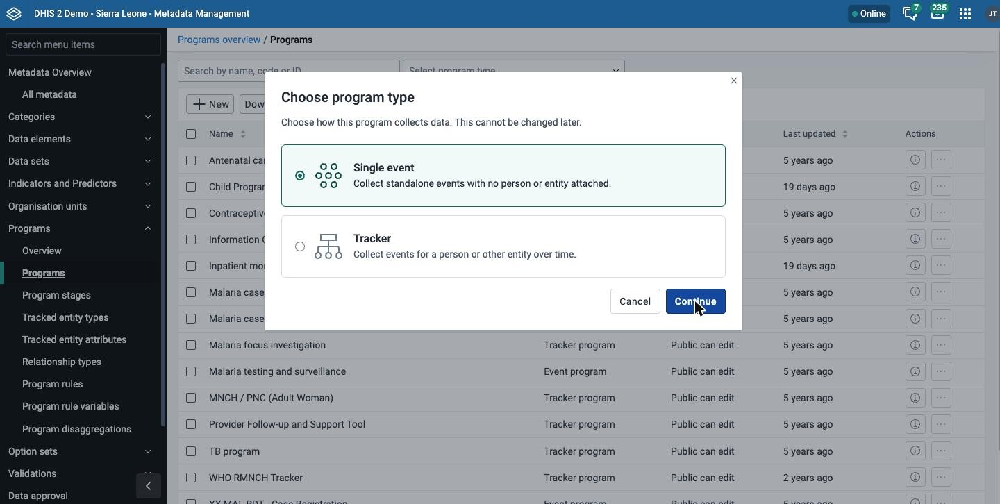

### Program Details { #mmp_single_event_program_details }

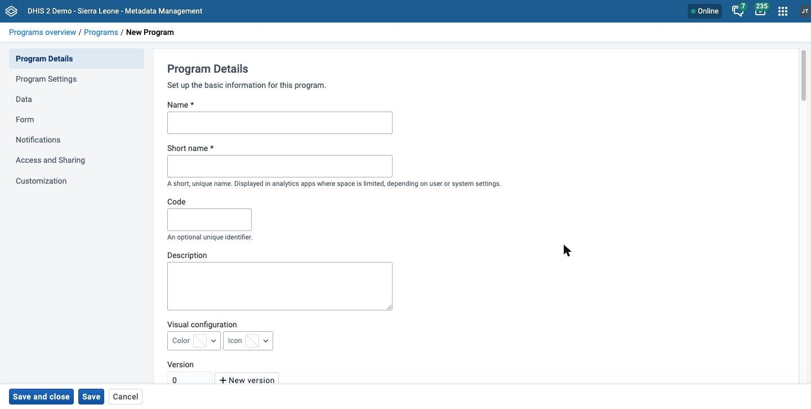

Set up the basic information for the program:

* **Name** and **Short name** (required) — see [Common metadata object fields](#mm_common_metadata_fields).
* **Code**, **Description**, **Visual configuration** (color and icon) — as described in [Common metadata object fields](#mm_common_metadata_fields).
* **Version** — a manually incremented number. Click **New version** to increment it. This is informational only and is not used to enforce compatibility.
* **Location type** — **Point**, **Polygon/Area**, or **Do not collect location data**, for the event's location. In the Maintenance app, this field was called **Feature type**.
* **Event category combination** — assign a category combination to disaggregate this program's events. The default is **None**. In the Maintenance app, this field was called **Category combination**.

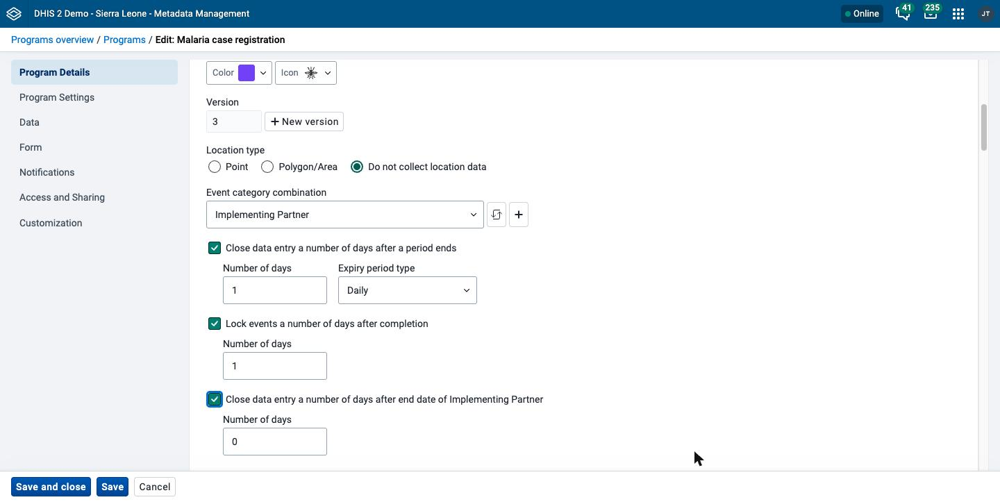

Once you assign an event category combination, two checkboxes below it let you close data entry and lock events on a schedule. A third checkbox appears only after you pick a category combination other than **None**:

* **Close data entry a number of days after a period ends** — reveals a **Number of days** field and an **Expiry period type** field (for example **Daily** or **Monthly**). In the Maintenance app, these were the **Expiry period type** and **Expiry days** fields.
* **Lock events a number of days after completion** — reveals a **Number of days** field. Once that many days pass after an event is completed, you can no longer edit it. In the Maintenance app, this was **Completed events expiry days**.
* **Close data entry a number of days after end date of *[category combination name]*** — named after the event category combination you picked, for example **Close data entry a number of days after end date of Implementing Partner**. Reveals a **Number of days** field. In the Maintenance app, this was **Open days after category option end date**.

### Program Settings { #mmp_single_event_program_settings }

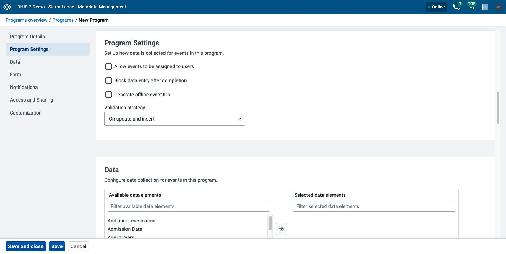

Configure how data is collected for events in this program:

* **Allow events to be assigned to users** — lets a user role assign individual events to a specific user.
* **Block data entry after completion** — once an event is marked complete, its values can no longer be edited.
* **Generate offline event IDs** — generates event identifiers locally when working offline, instead of requesting them from the server.
* **Validation strategy** — choose whether validation rules run **On update and insert** or **On complete**.

### Data { #mmp_single_event_program_data }

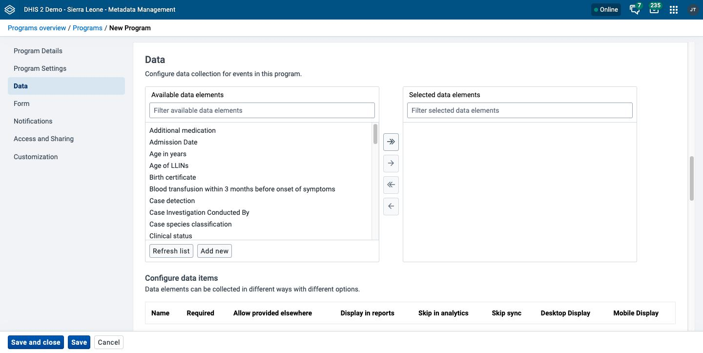

1. Use the **Available data elements** / **Selected data elements** transfer list to choose which data elements this program collects. See [Using a transfer list component](#mm_transfer_list_component).
2. In the **Configure data items** table below the transfer list, set, per data element, the options described below.
3. Click **Add new** above the available-elements list to create a new data element without leaving the program editor.

Data elements can be collected in different ways, with different options:

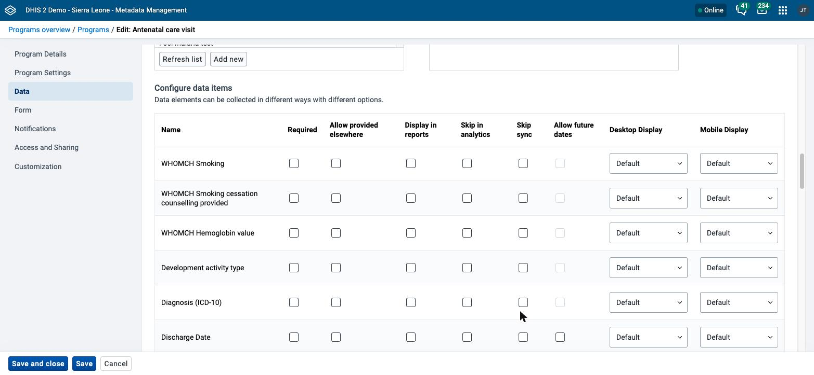

Table: Configure data items — column reference

| Column | Description |
|---|---|
| **Required** | The data element's value must be filled in before the event can be completed. |
| **Allow provided elsewhere** | Marks that this value can come from a facility other than the one where the event is entered, rather than from this facility's own data entry. |
| **Display in reports** | Shows the data element's value in the Event Capture app's data entry list. |
| **Skip in analytics** | Excludes the data element from analytics tables. |
| **Skip sync** | Excludes the data element's values from data synchronization jobs, for example when running the Android app offline. |
| **Allow future dates** | Only appears for a **Date** data element. Allows a user to pick a date in the future. |
| **Desktop Display** | Chooses how the field renders in the web Capture app. |
| **Mobile Display** | Chooses how the field renders in the Android Capture app. |

The **Desktop Display** and **Mobile Display** options offered for a data element depend on its value type. A few examples:

* A **Yes/No** data element offers **Default**, **Vertical radiobuttons**, **Horizontal radiobuttons**, **Vertical checkboxes** and **Horizontal checkboxes**.
* A **Number** data element offers **Default**, **Value**, **Slider** and **Linear scale**.
* An **option set**-backed data element offers **Default**, **Dropdown**, **radio button and checkbox layouts**, **Shared header radiobuttons**, and **Icons as buttons**.

Other value types (for example plain text) may offer only **Default**. In the Maintenance app, these same per-data-element settings were labelled **Compulsory**, **Allow provided elsewhere**, **Display in reports**, **Date in future**, **Skip synchronization**, **Mobile render type** and **Desktop render type** - the Metadata Management app renames a few of them but keeps the same underlying options.

### Form { #mmp_single_event_program_form }

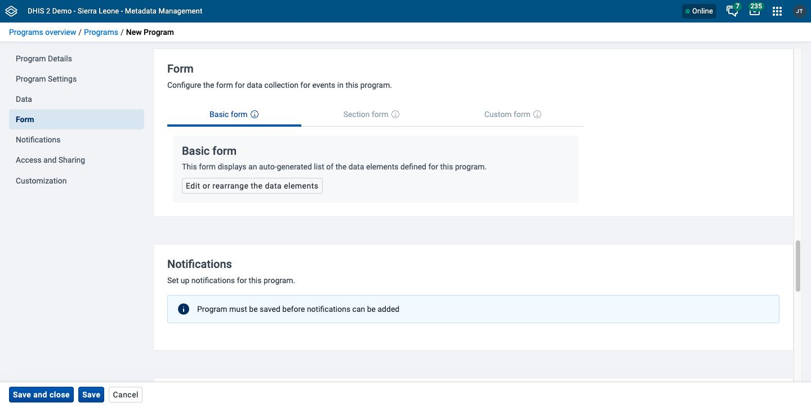

Choose how the data entry form for this program's events is laid out:

* **Basic form** — an auto-generated list of the data elements defined for the program, in the order they were added. Use **Edit or rearrange the data elements** to change that order.
* **Section form** — group data elements into named sections.
* **Custom form** — write your own HTML/CSS form layout.

These three options replace the Maintenance app's separate "Create data entry forms" step. The underlying form types (basic, section, custom) are unchanged.

### Notifications { #mmp_single_event_program_notifications }

The program must be saved at least once before notifications can be added. See [Notifications](#mmp_notifications) below — the **Add a notification** flow is identical for single event and tracker programs, except that a single event program has no stage to send a stage-scoped notification about.

### Access and Sharing { #mmp_single_event_program_access }

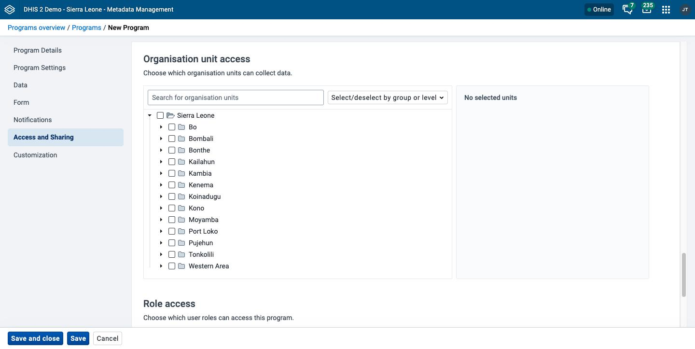

1. Under **Organisation unit access**, select which organisation units can collect data for this program, using the tree, the search box, or **Select/deselect by group or level**.
2. Under **Role access**, choose which user roles can access this program. Full sharing settings (equivalent to the Maintenance app's sharing dialog) are only available once the program has been saved.

### Customization { #mmp_single_event_program_customization }

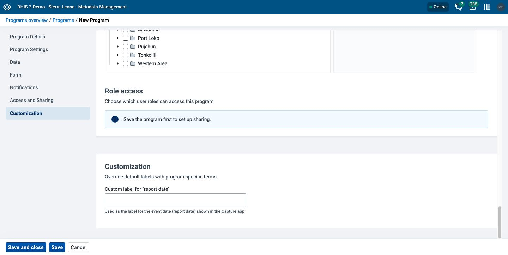

Override default labels with program-specific terms — for a single event program, this is limited to a custom label for **"report date"** (the label shown for the event date in the Capture app).

## Creating a tracker program { #mmp_create_tracker_program }

### Workflow: Create a tracker program { #mmp_workflow_tracker_program }

1. Open the **Metadata Management** app.
2. In the sidebar, click **Programs**, then **Programs**.
3. Click **New**.
4. In the **Choose program type** dialog, select **Tracker**, then click **Continue**.
5. Fill in **Program Details**.
6. Fill in **Enrollment: Settings**, including the required **Tracked entity type**.
7. Assign tracked entity attributes under **Enrollment: Data**.
8. Choose an enrollment form type under **Enrollment: Form**.
9. Click **Save**.
10. Add one or more program stages under **Program Stages** — see [Create or edit a program stage](#mmp_create_program_stage).
11. Add notifications, if needed.
12. Set the access level, organisation unit access and role access under **Access and Sharing**.
13. Override labels under **Customization**, if needed.
14. Click **Save and close**.

### Program Details { #mmp_tracker_program_details }

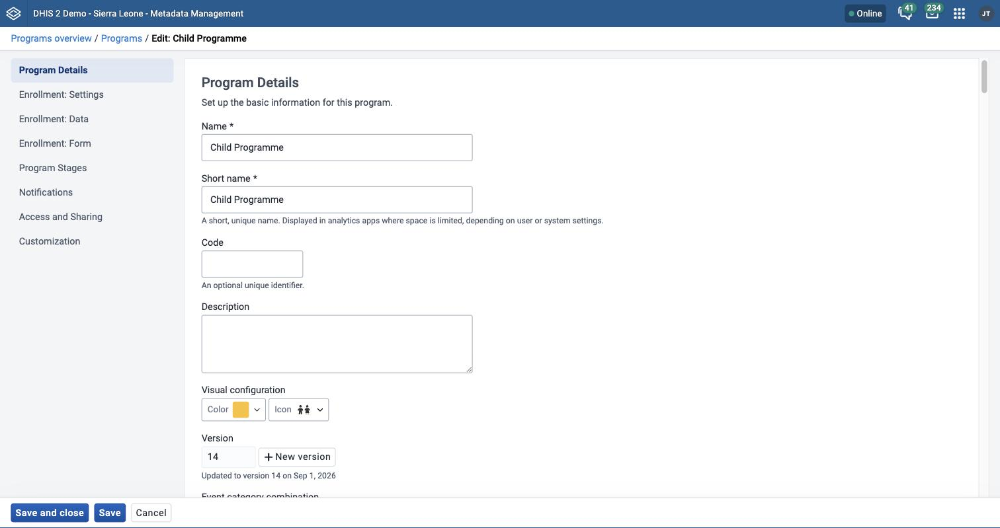

See [Program Details](#mmp_single_event_program_details) above.
Differences from the event program details:
 A tracker program has no **Location type** field at this level. The **Tracked entity type** field, and the location type for the enrollment itself, sit in **Enrollment: Settings** instead — see below.

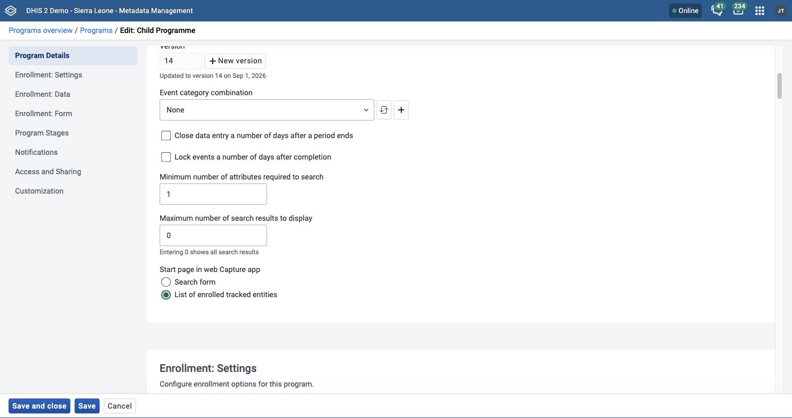

A tracker program also has three fields to manage tracked entity search options:

* **Minimum number of attributes required to search** — how many tracked entity attributes a user must fill in before they can search for a tracked entity. In the Maintenance app, this field had the same name.
* **Maximum number of search results to display** — enter **0** to show all search results. In the Maintenance app, this was **Maximum number of tracked entities to return in search**.
* **Start page in web Capture app** — **Search form** or **List of enrolled tracked entities**. In the Maintenance app, this was a checkbox, **Display front page list**.

### Enrollment: Settings { #mmp_tracker_enrollment_settings }

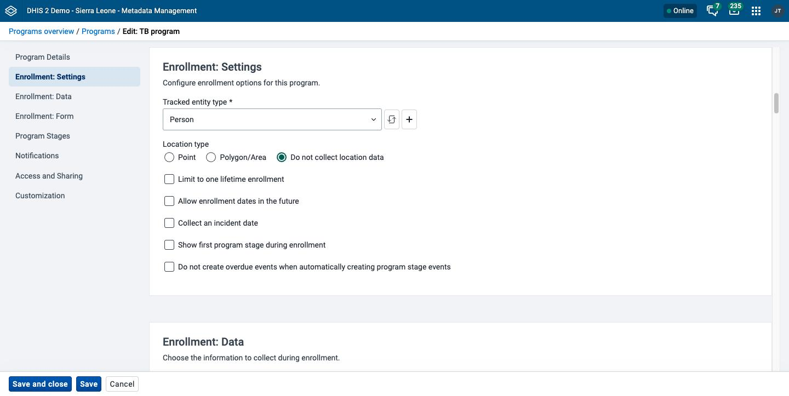

* **Tracked entity type** (required) — the type of entity (Person, and so on) this program enrolls. Use the **+** button to create a new tracked entity type without leaving the program editor.
* **Location type** — **Point**, **Polygon/Area**, or **Do not collect location data**, for the enrollment location. In the Maintenance app, this field was called **Feature type**.
* **Limit to one lifetime enrollment** — a tracked entity instance can only enroll in the program once, ever.
* **Allow enrollment dates in the future**.
* **Collect an incident date** — a date distinct from the enrollment date, for example date of onset of a condition.
* **Show first program stage during enrollment**.
* **Do not create overdue events when automatically creating program stage events**.

### Enrollment: Data { #mmp_tracker_enrollment_data }

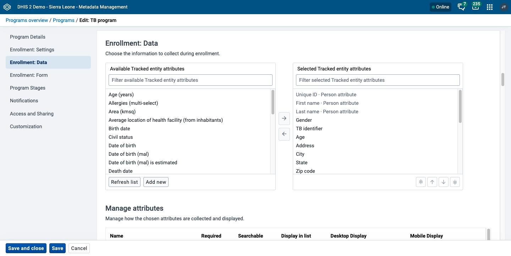

1. Use the **Available Tracked entity attributes** / **Selected Tracked entity attributes** transfer list to choose which attributes are collected at enrollment. See [Using a transfer list component](#mm_transfer_list_component). Attributes already marked as **Unique ID** for the tracked entity type (for example a system-generated ID) appear pre-selected and greyed out.
2. In the **Manage attributes** table, set, per attribute: **Required**, **Searchable**, **Display in list**, **Desktop Display** and **Mobile Display**.

### Enrollment: Form { #mmp_tracker_enrollment_form }

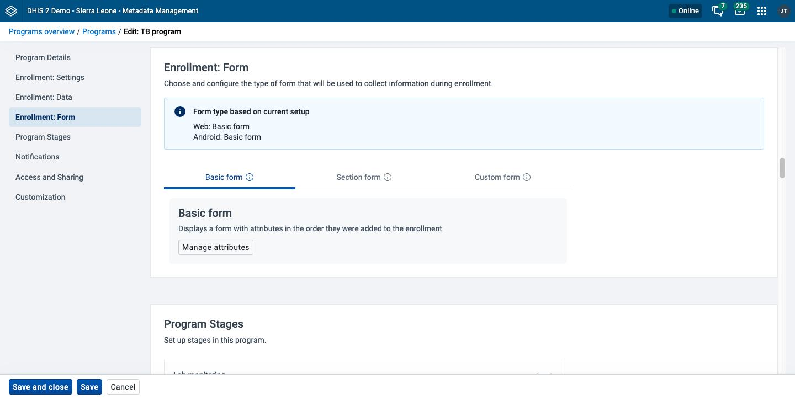

Same three form types as for a single event program's **Form** section (Basic, Section, Custom) — see [Form](#mmp_single_event_program_form) above, applied here to the enrollment form rather than an event form. An info box at the top of the section reports the form type currently in effect separately for **Web** and **Android**.

### Program Stages { #mmp_tracker_program_stages }

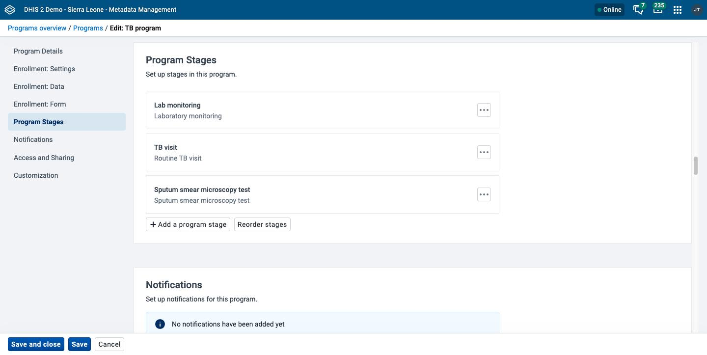

The **Program Stages** section lists the program's existing stages, each with a **...** menu for further actions (for example reordering or deleting). Click **Add a program stage** to create a new one, or **Reorder stages** to change the order stages appear in.

#### Create or edit a program stage { #mmp_create_program_stage }

Adding or editing a stage opens a dedicated editor with its own left-hand section list, separate from the program's own sections:

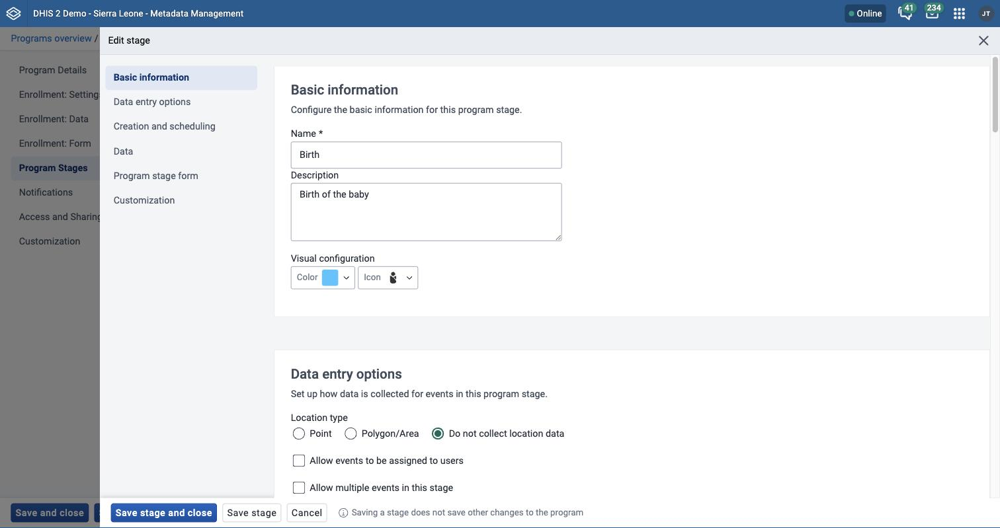

* **Basic information** — Name (required), Description, Visual configuration (color and icon).

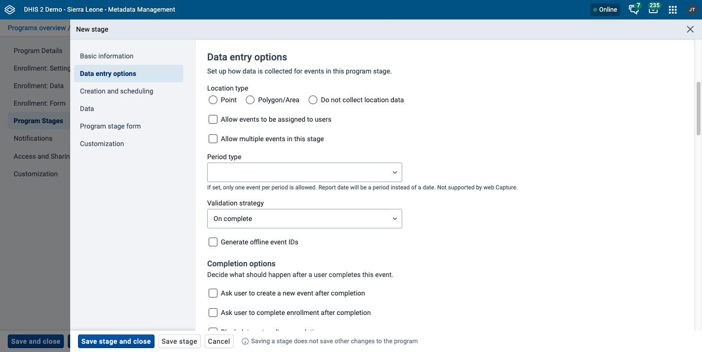

**Data entry options**:

* **Location type** — **Point**, **Polygon/Area**, or **Do not collect location data**, for this stage's events. In the Maintenance app, this field was called **Feature type**.
* **Allow events to be assigned to users**.
* **Allow multiple events in this stage**.
* **Period type** — restricts events to one per period rather than one per date. Not supported by the web Capture app.
* **Validation strategy** — **On complete**, or **On update and insert**.
* **Generate offline event IDs**.
* **Completion options** — choose whether completing an event should prompt the user to create a new event, complete the enrollment, or block further data entry.

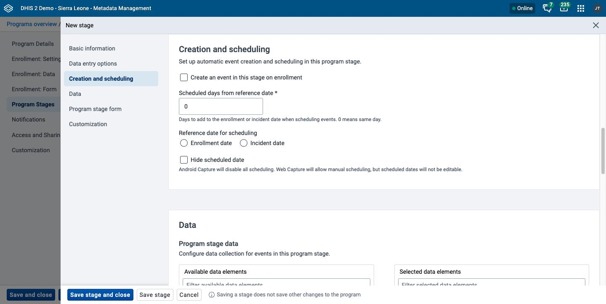

* **Creation and scheduling** — whether to create an event in this stage automatically on enrollment. How many days after the reference date (enrollment date or incident date) the event should be scheduled. Whether to hide the scheduled date from the Android Capture app. Web Capture still allows manual scheduling, but does not let you edit the scheduled date itself.

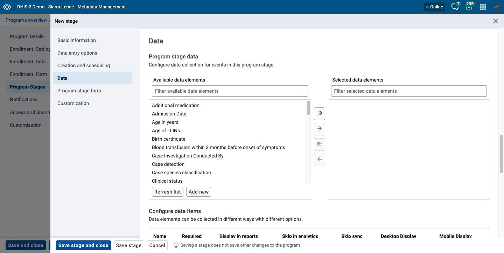

* **Data** — the same data-element transfer list and **Configure data items** table used for single event programs, scoped to this stage. See [Data](#mmp_single_event_program_data) above.

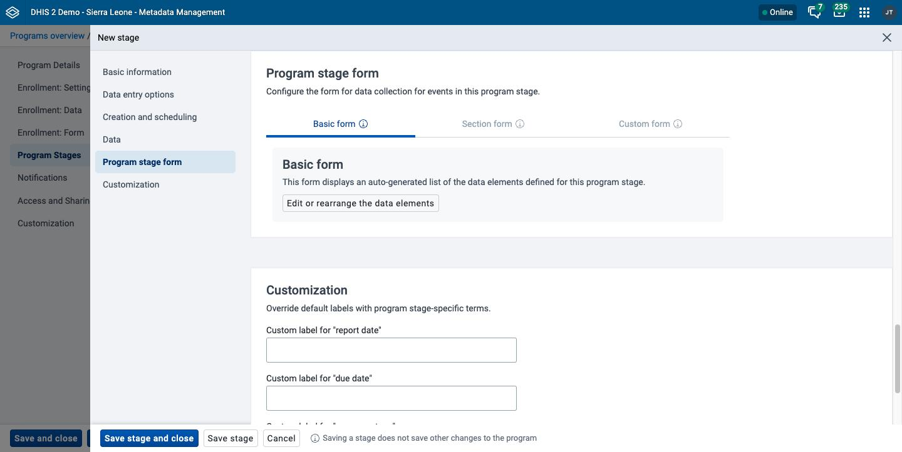

* **Program stage form** — the same Basic / Section / Custom form choice as elsewhere, scoped to this stage's own event form.

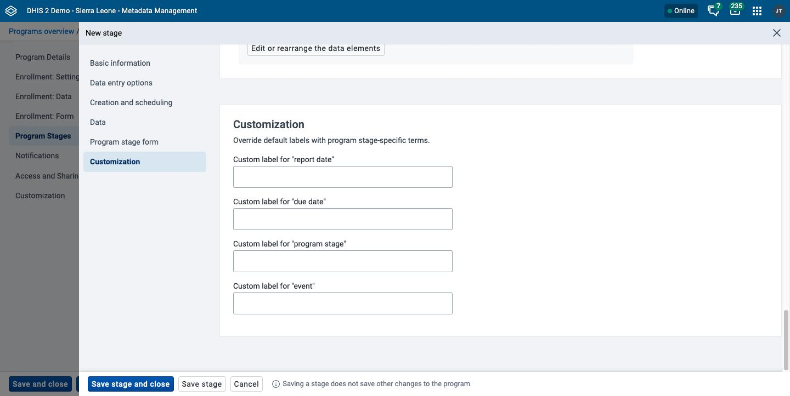

* **Customization** — custom labels for **"report date"**, **"due date"**, **"program stage"** and **"event"**, scoped to this stage.

The editor's footer reads **"Saving a stage does not save other changes to the program."** Use **Save stage** or **Save stage and close** to save the stage on its own. This action does not save other pending changes elsewhere on the program page. Save those changes separately, using the program's own **Save** or **Save and close** buttons.

### Notifications { #mmp_notifications }

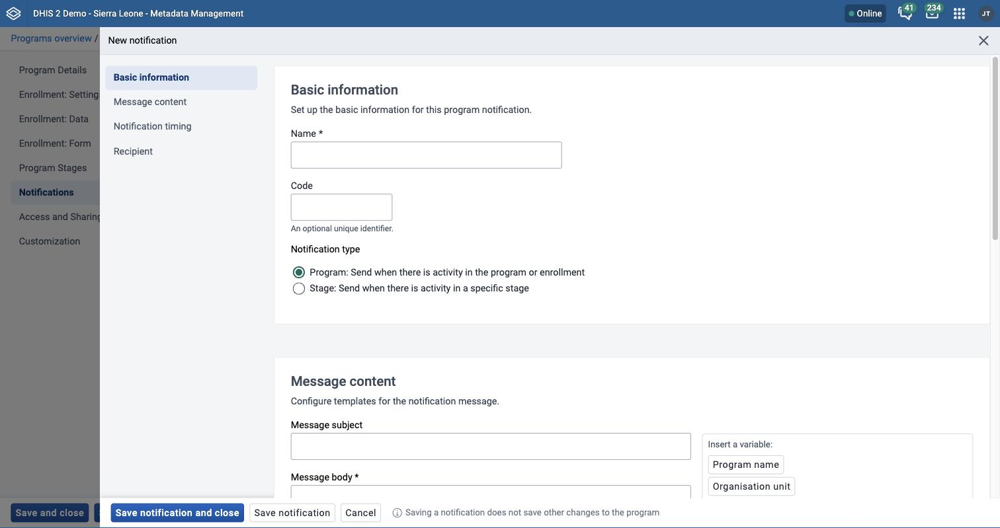

Click **Add a notification** to open the notification editor, which has its own section list:

* **Basic information** — Name (required), Code, and **Notification type**: **Program** ("Send when there is activity in the program or enrollment") or **Stage** ("Send when there is activity in a specific stage"). This single choice replaces the Maintenance app's two separate tabs, **Program notifications** and **Program stage notifications**.
* **Message content** — the message subject and body templates, with variables you can insert.
* **Notification timing** — when the notification fires relative to the relevant date.
* **Recipient** — who receives the notification.

As with program stages, the footer warns that **"Saving a notification does not save other changes to the program."**

### Access and Sharing { #mmp_tracker_program_access }

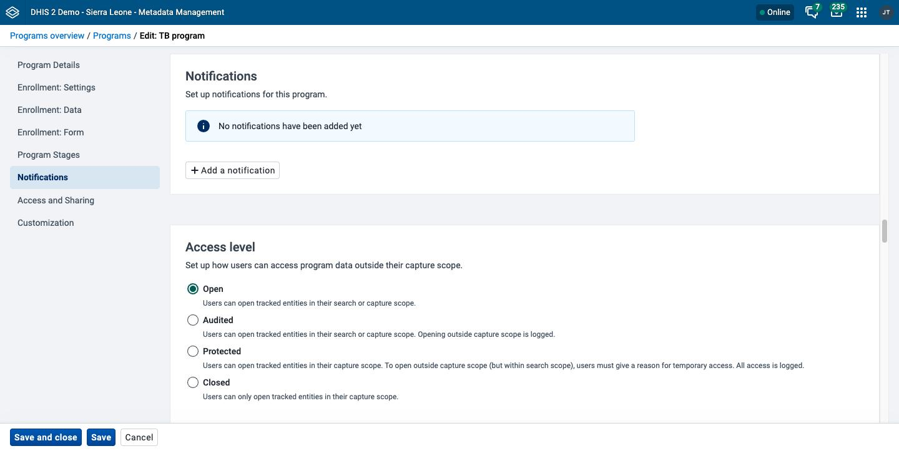

This section covers three things that were split across different places in the Maintenance app:

* **Access level** — **Open** (users can open tracked entities in their search or capture scope), **Audited** (same as Open, but opening a tracked entity outside the capture scope is logged), **Protected** (users must give a reason for temporary access to open a tracked entity outside their capture scope but within their search scope. All access is logged), or **Closed** (users can only open tracked entities within their capture scope). In the Maintenance app, this setting was part of the first wizard step, **Program details**. Here, it opens the **Access and Sharing** section instead.
* **Organisation unit access** and **Role access** — the same organisation unit tree and role picker as for a single event program. See [Access and Sharing](#mmp_single_event_program_access) above.

### Customization { #mmp_tracker_program_customization }

Override default labels with program-specific terms. For a tracker program this includes labels for **"report date"**, **"due date"**, **"program stage"**, **"event"**, **"incident date"**, **"enrollment date"** and **"enrollment"** — the same custom-label fields the Maintenance app mixed into its **Program details** and **Enrollment details** wizard steps, now gathered into one section. Stage-specific labels are set separately, per stage, in that stage's own **Customization** tab — see [Create or edit a program stage](#mmp_create_program_stage) above.

## Program rules and program rule variables { #mmp_program_rules }

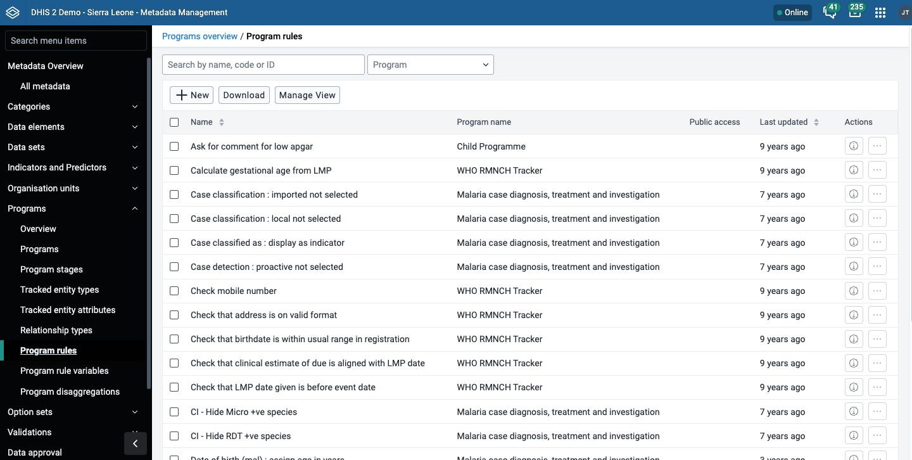

Reached from **Programs → Program rules** and **Programs → Program rule variables**. Program rules let you create and control dynamic behaviour of the user interface in the Tracker Capture and Event Capture apps. Program rule variables are the values you reference from a program rule expression. The concepts, the expression language, and the available operators and functions are unchanged from the Maintenance app — see [About program rules](#about_program_rules), [Create or edit a program rule variable](#create_program_rule_variable), the [worked examples](#program_rule_examples), and the [full operator and function reference](#program_rules_operators_functions) in [Configure programs in the Maintenance app](#configure_programs_in_maintenance_app).

What changed is the editing pattern, exactly as for programs themselves:

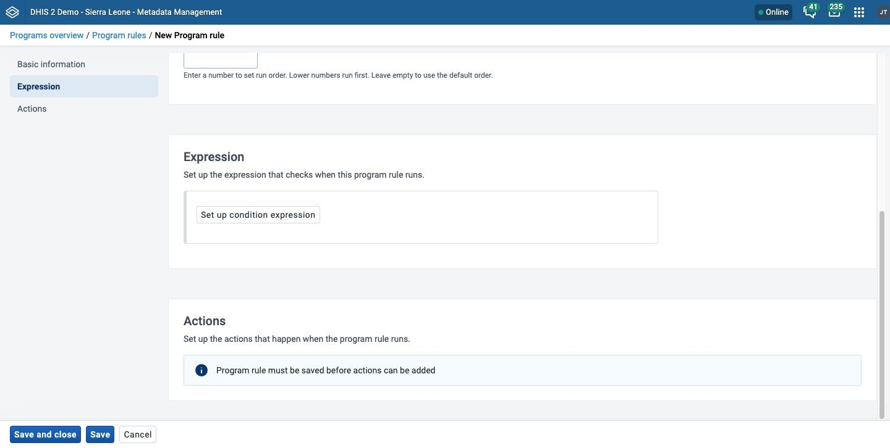

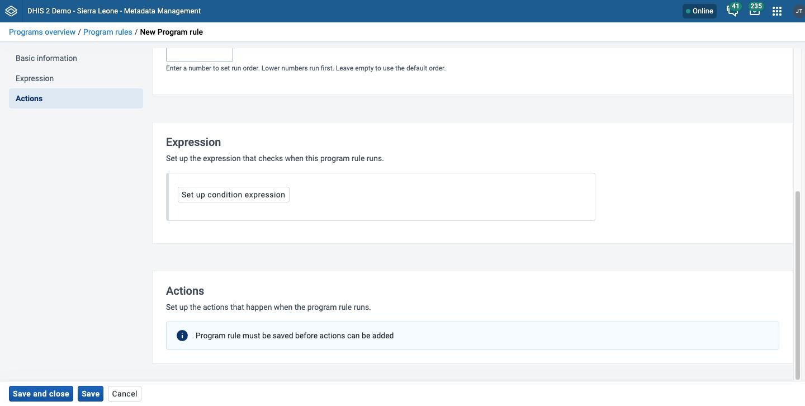

* **Basic information** — Name, Description, Program (required), Priority.
* **Expression** — click **Set up condition expression** to open the expression editor. As in the Maintenance app, the rule must be saved before actions can be added.
* **Actions** — set up the actions the rule triggers when its expression evaluates to true.

The Maintenance app presented these same three groups of fields as a 3-step wizard (**Enter program rule details** → **Enter program rule expression** → **Define program rule actions**). 

## Program disaggregations { #mmp_program_disaggregations }

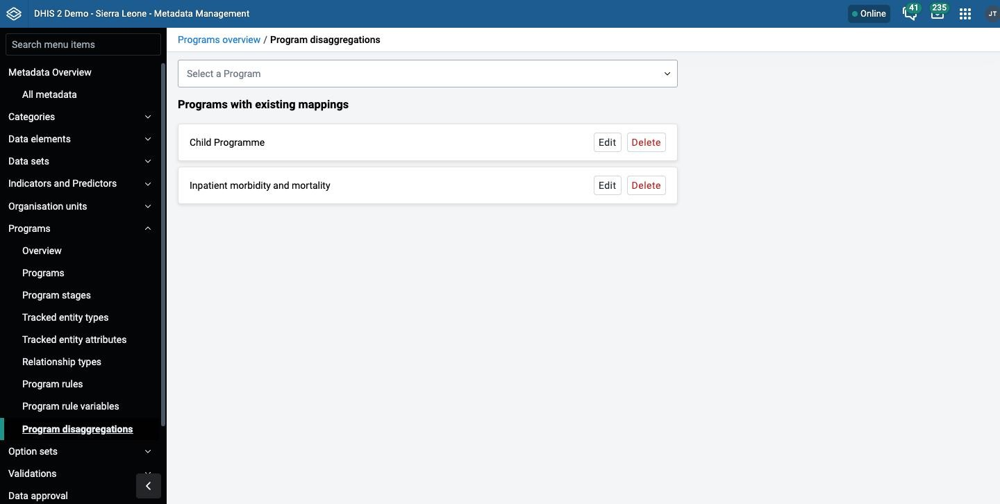

Reached from **Programs → Program disaggregations**. This page lists every program that already has a disaggregation mapping, each with **Edit** and **Delete** actions, plus a **Select a Program** picker to start a mapping for a program that does not have one yet. The mapping mechanics themselves — mapping category option combinations onto program indicator data for aggregate reporting — are unchanged. See [Setting up new Program disaggregation Mappings](#program_disaggregation_mapping) in [Configure programs in the Maintenance app](#configure_programs_in_maintenance_app). 

## Program indicators { #mmp_program_indicators }

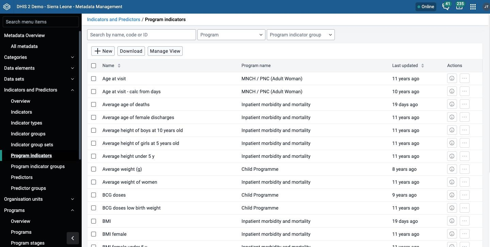

Program indicators and program indicator groups are reached from **Indicators and Predictors → Program indicators** / **Program indicator groups** in the Metadata Management app, just as they were reached from the **INDICATOR** top-level tab in the Maintenance app. 

The concepts, the create/edit form, and — most importantly — the full reference tables of functions, variables and operators available in program indicator expressions and filters are unchanged. See [About program indicators](#about_program_indicators), [Create or edit a program indicator](#create_program_indicator), [Create or edit a program indicator group](#create_program_indicator_group), and the [expression and filter reference](#program_indicator_functions_variables_operators) in [Configure programs in the Maintenance app](#configure_programs_in_maintenance_app).

## Tracked entity types, tracked entity attributes, and relationship types { #mmp_tracked_entity_relationship }

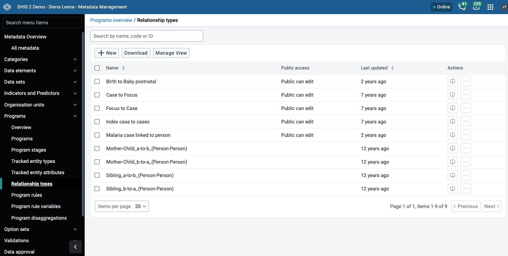

Reached from **Programs → Tracked entity types**, **Programs → Tracked entity attributes**, and **Programs → Relationship types**. These list and edit screens follow the same shared conventions as every other object type in the app — see [Common metadata object fields](#mm_common_metadata_fields), [Common actions](#mm_common_actions) and [Using a transfer list component](#mm_transfer_list_component) in [Configure metadata (Metadata Management app)](#metadata_management_app) 
For what a tracked entity type, tracked entity attribute, or relationship type configures, see [About relationship types](#about_relationship_types), [Create or edit a relationship type](#create_relationship_type), [About tracked entity types](#about_tracked_entity), [Create or edit a tracked entity attribute](#create_tracked_entity_attribute) and [Create or edit a tracked entity type](#create_tracked_entity) in [Configure programs in the Maintenance app](#configure_programs_in_maintenance_app).
