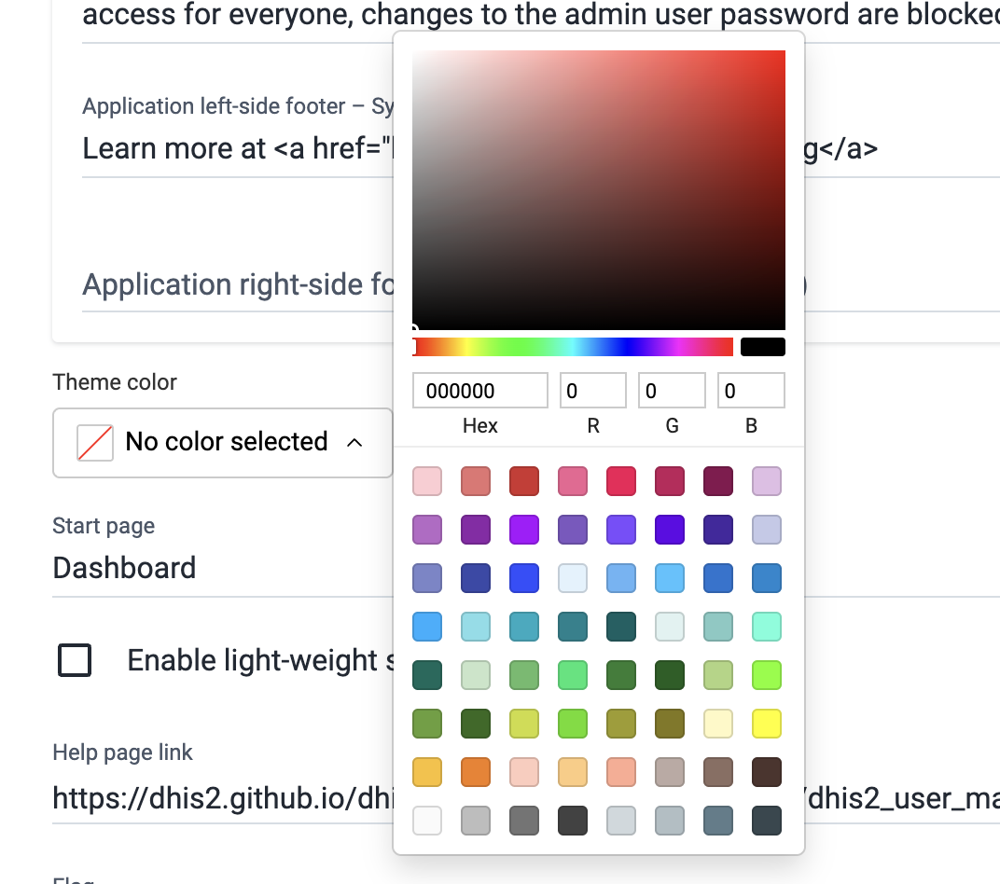
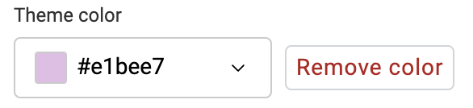
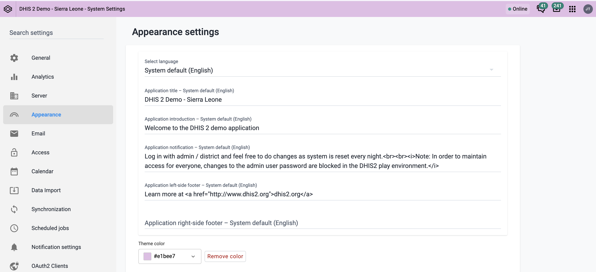
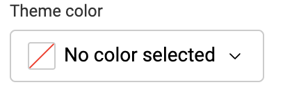
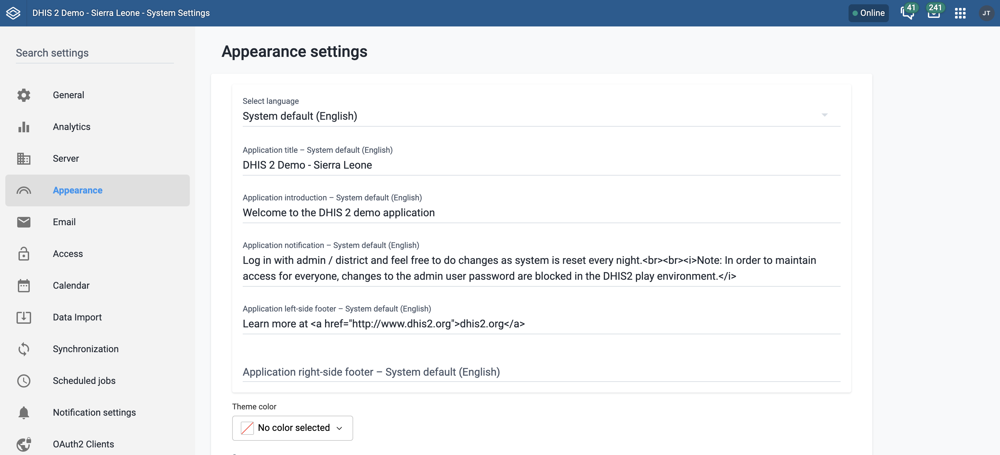

# Custom Theme Color { #custom_theme_color }

For v43+ and with the Global Shell enabled, a user can set a custom theme color for their DHIS2 instance and android application. The color is applied to the header bar visible across all DHIS2 apps.

## Set a theme color

- Open the **System Settings** app.
- Go to the **Appearance** tab.
- Under **Theme Color**, click the color selector.
- Choose a color from the presets, or type a hex or RGB value directly.

{ width=50% }

- Click outside the picker to confirm your selection. The setting saves automatically.

{ width=30% }

- The header bar will update to reflect the chosen color upon refreshing the page.

**Note**: Text and icon colors in the header bar are automatically adjusted to maintain readability against the selected background.

## Remove a theme color

- Open the **System Settings** app.
- Go to the **Appearance** tab.
- Next to the current color, click **Remove color**.

{ width=30% }

{ width=30% }

- The setting saves automatically. Refresh the page. The header bar will revert to the DHIS2 default color.

