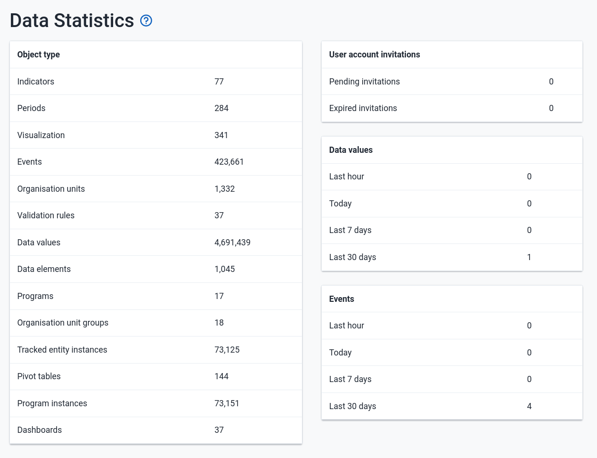
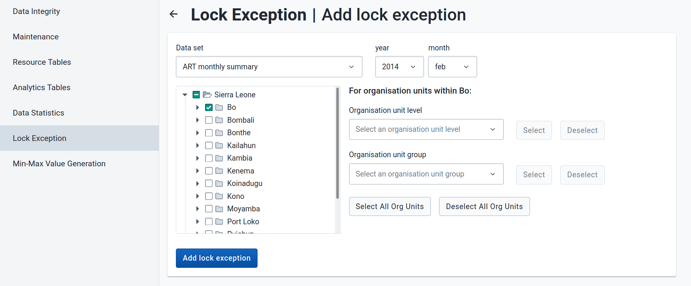
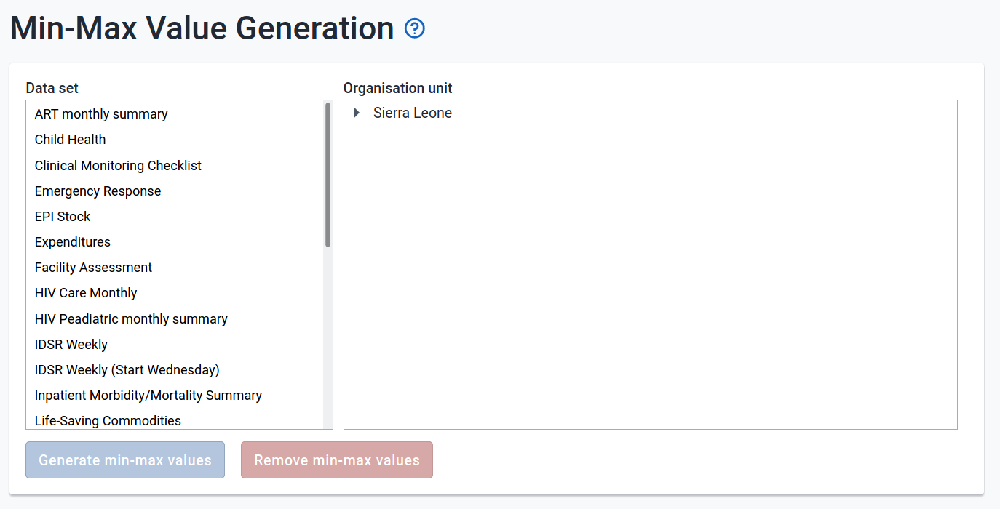

# Data Administration { #data_admin }

The data administration module provides a range of functions to ensure
that the data stored in the DHIS2 database is integral and that the
database performance is optimised. These functions should be executed on
a regular basis by a data administrator to ensure that the quality of
the data stored is optimal.

## Data integrity { #data_admin_data_integrity }

DHIS2 can perform a wide range of data integrity checks on the data
contained in the database. Identifying and correcting data integrity
issues is extremely important for ensuring that the data used for
analysis purposes is valid. Each of the data integrity checks that are
performed by the system will be described, along with general procedures
that can be performed to resolve these issues.

### Data elements without data set

Each data element must be assigned to a data set. Values for data
elements will not be able to be entered into the system if a data
element is not assigned to a data set. Choose
Maintenance-\>Datasets-\>Edit from the main menu and then add the
"orphaned" data element to the appropriate data set.

### Data elements without groups

Some Data Elements have been allocated to several Data Element Groups.
This is currently not allowed, because it will result in duplication of
linked data records in the analytics record sets that provide aggregated
data. Go to Maintenance -\> Data Element Groups to review each Data
Element identified and remove the incorrect Group allocations.

### Data elements violating exclusive group sets

Some data elements have been allocated to several data element groups
that are members of the same data element group set. All group sets in
DHIS2 are defined as exclusive, which means that a data element can
*only* be allocated to *one* data element group within that group set.
Go to Maintenance -\> Data elements and indicators -\> Data element
groups to review each data element identified in the integrity check.
Either remove the data element from all groups except the one that it
should be allocated to, or see if one of the groups should be placed in
a different group set.

### Data elements in data set but not in form or sections

Data elements have been assigned to a data set, but have not been
assigned to any sections of the data set forms. All data sets which use
section forms, should generally have all data elements in the data set
assigned to exactly one section of the dataset.

### Data elements assigned to data sets with different period types

Data elements should not be assigned to two separate data sets whose
period types differ. The recommended approach would be to create two
separate data elements (for instance a monthly and yearly data element)
and assign these to respective datasets.

### Data sets not assigned to organisation units

All data sets should be assigned to at least one organisation unit.

### Sections with invalid category combinations

Data sets which use section forms should only have a single category
combination within each section. This violation could result from
assigning a data element to a section, but then changing the category
combination of this data element at a later point in time.

### Indicators with identical formulas

Although this rule will not affect data quality, it generally does not
make sense to have two indicators with the exact same definition. Review
the identified indicators and their formulas and delete or modify any
indicator that appears to be the duplicate.

### Indicators without groups

All data elements and indicators must be assigned to at least one group,
so these Indicators need to be allocated to their correct Data Element
and Indicator Group. From the main menu, go to Data elements/Indicators
-\> Indicator Groups, and allocate each of the \`Orphaned\` indicators
to its correct group.

### Invalid indicator numerators

Violations of this rule may be caused by an incorrect reference to a
deleted or modified data element. Review the indicator and make
corrections to the numerator definition.

### Invalid indicator denominators

Violations of this rule may be caused by an incorrect reference to a
deleted or modified data element. Review the indicator and make
corrections to the denominator definition.

### Indicators violating exclusive group sets

Some indicators have been allocated to several indicator groups that are
members of the same indicator group set. All group sets in DHIS2 are
defined as exclusive, which means that an indicator can *only* be
allocated to *one* indicator group within that group set. Go to
Maintenance -\> Data elements and indicators -\> Indicator groups to
review each indicator identified in the integrity check. Either remove
the indicator from all groups except the one that it should be allocated
to, or see if one of the groups should be placed in a different group
set.

### Duplicate periods

If periods have been imported from external applications, it may be
possible that some periods will be duplicated. If you have any periods
which appear to be duplicated here, you will need to resolve these
directly in the DHIS2 database. All data which has been assigned to the
duplicated period, should be moved to the correct period, and the
duplicate period should be removed.

### Organisation units with cyclic references

Organisation units cannot be both parent and children of each other,
directly nor indirectly. If this situation occurs, you will need to
resolve the cyclic reference directly in the DHIS2 database in the
"organisation unit" table, by reassigning the "parentid" field of the
organisation units.

### Orphaned organisation units

All organisation units must exist within the organisation unit
hierarchy. Go to Organisation units -\> Hierarchy Operations and move the
offending organisation unit into the proper position in the hierarchy.

### Organisation units without groups

All organisation units *must* be allocated to at least *one* group. The
problem might either be that you have not defined any compulsory OrgUnit
Group Set at all, or that there are violations of the compulsory rule
for some OrgUnits . NOTE: If you have defined no compulsory OrgUnit
Group Sets, then you must first define them by going to Organisation
units-\>Organisation unit group sets and define at least one compulsory
Group Set (the group set 'Type' are nearly universally relevant). If you
have the relevant group sets, go to Maintenance -\> OrgUnit Groups to
review each OrgUnit identified and add the relevant Group allocation.

### Organisation units violating compulsory group sets

These organisation units have not been assigned to the any organisation
unit group within one of the *compulsory* organisation unit group sets.
When a group set is defined as compulsory, it means that an organisation
unit must be allocated to at least one organisation unit group within
that group set. For instance, all organisation units must belong to one
of the groups in the 'Type' group set. It might belong to the
\`Hospital\` or the \`Clinic\` or any other 'type' group - but it must
belong to exactly one of them. Go to Organisation units-\>Organisation
unit groups to review each organisation unit identified in the integrity
check. Allocate all organisation units to exactly one compulsory group.

### Organisation units violating exclusive group sets

Some organisation units have been allocated to several organisation unit
groups that are members of the same organisation unit group set. All
group sets in DHIS2 are defined as exclusive, which means that an
organisation unit can *only* be allocated to *one* organisation unit
group within that Group Set. For instance, one organisation unit cannot
normally belong to the both the 'Hospital' and 'Clinic' groups , but
rather to only to one of them. Go to Organisation unit-\>Organisation
unit groups to review each organisation unit identified in the integrity
check. Remove the organisation units from all groups except the one that
it should be allocated to.

### Organisation unit groups without group sets

The organisation unit groups listed here have not been allocated to a
group set. Go to Maintenance-\>Organisation unit-\>Organisation unit
group sets and allocate the Organisation unit group to the appropriate
group set.

### Validation rules without groups

All validation rules must be assigned to a group. Go to **Maintenance**
app \> **Validation rule group** and assign the offending validation
rule to a group.

### Invalid validation rule left side expressions

An error exists in the left-side validation rule definition. Go to
**Maintenance** app -\> **Validation rule** and click **Edit** on the
offending rule. Click **Left side** and make the required corrections.

### Invalid validation rule right side expressions

An error exists in the right-side validation rule definition. Go to
**Maintenance** app -\> **Validation rule** and click **Edit** on the
offending rule. Click **Right side** and make the required corrections.

### ProgramRules with no condition

Report will highlight all the **Program rules** not configured with **Condition**. Evaluation for rules not having condition are always evaluated as false.

### ProgramRules with no priority

Report will highlight all the **Program rules** not configured with **Priority**. This is optional but its existence is very important when **ProgramRuleActionType** is **ASSIGN**. Rules with ASSIGN action type should have higher priority then the rest of the action types.

### ProgramRules with no action

Report will highlight all the **Program rules** not configured with any **ProgramRuleAction**.

### ProgramRuleVariables without dataElements

Report will highlight all the **Program rule variables** not configured with **DataElement**. Report will be based on source type configuration. DataElement should be provided when the source type of ProgramRuleVariable is **DataElement**.

### ProgramRuleVariables without attributes

Report will highlight all the **Program rule variables** not configured with **TrackedEntityAttribute**. Report will be based on source type configuration. TrackedEntityAttribute should be provided when the source type of ProgramRuleVariable is **Attribute**.

### ProgramRuleActions with no data Objects.

Report will highlight all the **Program rule actions** not configured with any Data object. Data object can be either **DataElement** of **TrackedEntityAttribute**. There are certain ProgramRuleActions which are responsible for assigning values to either dataElement or trackedEntityAttribute.

### ProgramRuleActions with no notification

Report will highlight all the **Program rule actions** which have ProgramRuleActionType set to SENDMESSAGE/SCHEDULEMESSAGE where the configuration does not provide any link to notification.

### ProgramRuleActions with no section id

Report will highlight all the **Program rule actions** which have ProgramRuleActionType set to **HIDESECTION** but configuration does not provide any section id.

### ProgramRuleActions with no program stage id

Report will highlight all the **Program rule actions** which have ProgramRuleActionType set to **HIDEPROGRAMSTAGE** but configuration does not provide any program stage id.

### Invalid program indicator expression

Reports all the violations in program indicator expression caused by invalid **DataElement** or invalid **TrackedEntityAttribute**.

### Invalid program indicator filter expression

Reports all the violations in program indicator filter expression caused by invalid **DataElement** or invalid **TrackedEntityAttribute**.

### Tracked entity attributes having a suboptimal search configuration

Reports all tracked entity attributes with suboptimal configuration, which could potentially result in slower search performance when searching for tracked entities using those attributes.

### Partial trigram indexes on trackedentityattributevalue in sync with the tracked entity attribute

Reports all tracked entity attributes that are not in sync with the trigram index in the database. This means that some indexes may need to be created, deleted, or both.

### Tracked entity attributes with a partial trigram index created

Reports all tracked entity attributes that have a partial trigram index in the `trackedentityattributevalue` table.

## Maintenance { #data_admin_maintenance }

Table: Data maintenance functions in the Data Administration app

| Function | Description |
|---|---|
| Clear analytics tables | Completely empties the analytics tables. These tables are used to generate aggregate data for the pivot tables, GIS and reports. |
| Analyze analytics tables | Performs a PostgreSQL `analyze` operation on all analytics tables. |
| Remove zero data values | Removes zero data values from the database. Values registered for data elements with aggregation operator average is not removed, as such values will be significant when aggregating the data, contrary to values registered for data elements with aggregation operator sum.   Reducing the number of data values will improve system performance. |
| Permanently remove soft deleted data values / events / enrollments / tracked entity instances | When a data value is deleted in DHIS2, the system will mark the corresponding database row as deleted, and not actually delete the row.   Running this maintenance function will physically remove these data value rows from the database. |
| Prune periods | Removes all periods which have no registered data values. Reducing the number of periods will improve system performance. |
| Remove expired invitations | Will delete users which represent user account invitations that now have gone past their expiry date. |
| Drop SQL views | DHIS2 lets you set up and manage SQL views as system objects with corresponding database SQL views.   Running this maintenance function will drop underlying SQL views for all system views. Use the **Create SQL views** function to recreate these SQL views. |
| Create SQL views | Recreates all SQL views in the database. |
| Update category option combinations | Rebuilds the category option combinations. This may be required after altering the category options which belong to a given category. |
| Update organisation unit paths | The organisation unit table in the DHIS2 database has a column "path" which contains a concatenated string of all ancestors in the hierarchy for each organisation unit.   Running this maintenance function will update and ensure that these values are in sync with the current organisation unit hierarchy. This column is managed by DHIS2, but a manual update might be useful when doing data loading directly in the database. |
| Clear application cache | Clears the system cache. |
| Reload apps | Manually reloads and detects installed DHIS2 apps.   The installed apps are also detected when the system starts and when installing or uninstall apps. |

## Resource tables { #data_admin_resource_tables }

Resource tables are supporting tables that are used during analysis of
data. One would typically join the contents of these tables with the
data value table when doing queries from third-party applications like
Microsoft Excel. They are also used extensively by the analysis modules
of DHIS2. Regeneration of the resource tables should only be done once
all data integrity issues are resolved. The resource tables are also
generated automatically, every time the analytics process is run by the
system.

  - Organisation unit structure (analytics_rs_orgunitstructure)

    This table should be regenerated any time there have been any
    changes made to the organisational unit hierarchy. This table
    provides information about the organisation unit hierarchy. It has
    one row for each organisation unit, one column for each organisation
    unit level and the organisation unit identifiers for all parents in
    the lineage as values.

  - Data element group set structure (analytics_rs_dataelementgroupsetstructure)

    This table provides information about which data elements are
    members of which data element group sets. The table has one row for
    each data element, one column for each data element group set and
    the names of the data element group as values.

  - Indicator group set structure (analytics_rs_indicatorgroupsetstructure)

    This table provides information about which indicators are members
    of which indicator group sets. The table has one row for each
    indicator, one column for each indicator group set and the names of
    the indicator group as values.

  - Organisation unit group set structure
    (analytics_rs_organisationunitgroupsetstructure)

    This table provides information about which organisation units are
    members of which organisation unit group sets. The table has one row
    for each organisation unit, one column for each organisation unit
    group set and the names of the organisation unit groups as values.

  - Category structure (analytics_rs_categorystructure)

    This table provides information about which data elements are
    members of which categories. The table has one row for each data
    element, one column for each category and the names of the category
    options as values.

  - Data element category option combo name (analytics_rs_categoryoptioncomboname)

    This table should be regenerated any time there have been changes
    made to the category combination names. It contains readable names
    for the various combinations of categories.

  - Data element structure (analytics_rs_dataelementstructure)

    This table provides information about all data elements and which
    period type (frequency) they capture data at. The period type is
    determined through the data set membership and hence relies on data
    elements to be member of data sets with similar period types to have
    a defined behaviour.

  - Date periods structure (analytics_rs_dateperiodstructure)

    This table provides information about all periods and which period
    type they are associated with. For each period type with lower
    frequency than itself, it contains information about which period it
    will fall within.

  - Periods structure (analytics_rs_periodstructure)

    Similar to `analytics_rs_dateperiodstructure`, containing a scoped set of
    periods more adapted for aggregated analytics.
    It's based on `period` and `periodtype` tables.

  - Data element category option combinations
    (analytics_rs_dataelementcategoryoptioncombo)

    This table provides a mapping between data elements and all possible
    category option combinations.

  - Data set organisation unit category (analytics_rs_datasetorganisationunitcategory)

    This table provides information related to data sets, organisation units
    and its category option combinations associated. If no association is found,
    it uses the default category option combo.
  

## Analytics tables management { #data_admin_analytics_tables }

DHIS2 generates database tables which the system then uses as basis for
various analytics functions. These tables are also valuable if you write
advanced SQL reports. In the **Data Administration** app, you can execute the tables
generation immediately. If you want to schedule them to be executed at regular intervals,
this can be done in the **Scheduler** app. This means that you can refresh recent analytics on
demand and see updated pivot tables without waiting for all of the past years data to
re-process.

> **Note**
>
> You can also generate the tables through the web API. This task is
> typically performed by a system administrator.

1.  Open the **Data Administration** app and click **Analytics Tables**.

2.  Select the parts of the analytics process you want to skip:

      - **Skip generation of resource tables**

      - **Skip generation of aggregate data and completeness data**

      - **Skip generation of event data**

      - **Skip generation of enrollment data**

      - **Skip generation of organisation unit ownership data**

3.  Select **Number of last years of data to include**.  (If 0 is selected,
then you will run latest or continuous analytics, as defined in
[Continuous analytics table](scheduling.html#scheduling_continuous_analytics_table).)

4.  Click **Start export**.

## Data statistics { #data_admin__data_statistics }

The data statistics module provides an overview of the number of objects
stored in the DHIS2 database.

The total number of each type of object is presented in a series of
tables with summary statistics of each object.

## Lock exceptions { #data_admin__lock_exception }

Lock exceptions provide fine-grained control over exemption from a
locked data set. After the expiry of the data set, data entry will be
denied by default, unless an exception has been granted through the Lock
exception interface.

### Adding a lock exception

By granting a lock exception, data entry will be enabled even after the
expiry period of the data set has passed.

1. Open the **Data Administration** app and click **Lock Exception**.
2. Click **Add lock exception** at the top of the page
3. Select the desired data set, organisation units and time period (see
   screenshot below)
4. Click **Add lock exception**

In the example above, a data lock exception would be created for "Bo" for the
"ART monthly summary" dataset for "February 2014".

In order to run this function, no extra authority is needed.

## Min-Max Value Generation { #data_admin_min_max_value_generation }

This administrative function can be used to generate min-max values,
which are used as part of the data quality and validation process for
specific organization units and data sets. Simply select the dataset
from the left hand frame, and then select the required organisation
units to generate the min-max values for from the organisational units
selector on the right. Press the "Generate" button to generate or
regenerate all min-max values. Press "Remove" to remove all min-max
values which are currently stored in the database. In order to run this
function, the user MUST have the authority `F_GENERATE_MIN_MAX_VALUES`.

## Cache Statistics { #data_admin_cache_statistics }

This option is for system administrators only to use. The cache
statistics shows the status of the application level cache. The
application level cache refers to the objects and query results that the
application is caching in order to speed up performance. If the database
has been modified directly the application cache needs to be cleared for
it to take effect.
