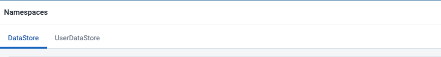

# Datastore Management App  { #datastore_management_app } 

The Datastore Management App is intended for advanced-level DHIS2 users. Read more about the Datastore here: [DHIS2 datastore](https://docs.dhis2.org/en/develop/using-the-api/dhis-core-version-master/data-store.html).

## Using the Datastore Management App
The Datastore Management App has a new interface that supports both web API datastores, i.e. the global and the user datastores, hence allowing users to manipulate their contents.  

## Select a datastore
On app load, the the datastore loads all the namespaces contained in the global datastore. However, a user can select the datastore they want to work with from the tabs available



## Add a new namespace and key
- In either datastore, you can add a new namespace by clicking on the **New namespace** button.

- An **Add New Namespace** modal appears for the user to add a new namespace and key

{ .center }

## Search for a namespace
- Search for a particular namespace in the datastore by making use of the search bar

{ .center }

## Delete a namespace
- Click on the delete icon in the actions column of a particular namespace
- A **Delete Namespace** modal appears asking you to confirm this action and its repercussions.


## View the keys in a namespace
- Click on a namespace, and you will be redirected to the next page with all its keys 

## Add a new key
- In the active namespace, you can add a new key by clicking on the new key button. 
- An **Add New Key** appears for you to add a new namespace and key


## Search for a key
- Search for a particular key in the namespace by making use of the search bar


## Delete a key
- Click on the delete icon in the actions column of a particular key
- A **Delete Key** modal appears asking you to confirm this action and its repercussions.


## Share a key
- This option is only available for keys in the **global datastore** and NOT the user datastore
- Click on the **share icon** in the actions column for the key you want to share.
- A **Sharing and access** dialog appears where you can select the users or usergroups to share to and restrict their edit/view actions as well

{ .center }

## Edit a key
- To edit the contents of a key, click on it. 
- Its value will be rendered in the JSON editor on the right
- You can then modify the value within there
- Click the **Save changes** button if satisfied with your edits
- Click the **Close** button to close the editor if you are done viewing the key's values


### JSON editor
- The JSON editor validates the data in it and will show an error if it is not valid JSON. For example:


- To find a value within the editor, you can use keyboard commands to open up the search palette which helps you find and/or replace values within your data. For windows: ```ctrl + f```. For mac: ```cmd + f```


## Back to the main page
- Click on the datastore or userdatastore link in the left hand panel header to go back to the main page with all the namespaces in the selected datastore. 


