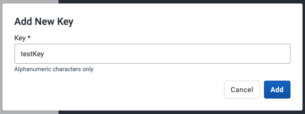

# Datastore Management App  { #datastore_management_app } 

The Datastore Management app is intended for advanced-level DHIS2 users. Read more about the Datastore here: [DHIS2 datastore](https://docs.dhis2.org/en/develop/using-the-api/dhis-core-version-master/data-store.html).

## Using the Datastore Management App
The Datastore Management app lets you manage the content of the web API global and user data stores. This is helpful when managing apps and external scripts. 

## Select a datastore
On app load, the datastore loads all the namespaces contained in the global datastore. You can select the type of datastore you want to work with from the available tabs.


## Add a new namespace and key
In either datastore, you can add a new namespace by clicking on the **New namespace** button. An **Add New Namespace** modal appears for the user to add a new namespace and key.


## Search for a namespace
In the namespace list view, search for a particular namespace in the datastore using the search bar in the top left.


## Delete a namespace
Click on the delete icon in the actions column of a particular namespace. A **Delete Namespace** modal asks you to confirm this action and its repercussions.


## View the keys in a namespace
Click a namespace, and the app will redirect to a page displaying all its keys.  

### Add a new key
When viewing the keys in a namespace, click the **New Key** button. An **Add New Key** modal appears for you to add a new key to the active namespace.



### Search for a key
Search for a particular key in the namespace using the search bar in the top left.


### Delete a key
Click the **delete icon** in the actions column of a particular key. A **Delete Key** modal asks you to confirm this action and its repercussions.


### Share a key
This option is only available for keys in the **global datastore** and NOT the user datastore.

Click the **share icon** in the actions column for the key you want to share. A **Sharing and access** dialog appears where you can restrict access settings for different users and groups.


### Edit a key
To edit the contents of a key, click on it. Its value will be rendered in the JSON editor on the right, and you can then modify the value within there.

- Click the **Save changes** button if satisfied with your edits.
- Click the **Close** button to close the editor.


#### JSON editor
The JSON editor validates the user's input and will show an error if it is not valid JSON. For example:


To find a value within the editor, you can use keyboard commands to open up the search palette, which helps you find and/or replace values within your data. For Windows: ```Ctrl + F```. For MacOS: ```Cmd + F```.


### Back to the main page
Click the **DataStore** or **UserDataStore** link in the left panel header to return to the main page with all the namespaces in the selected datastore. 


