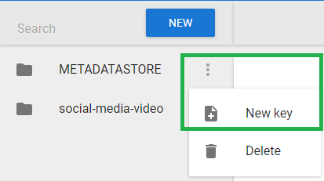
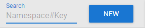
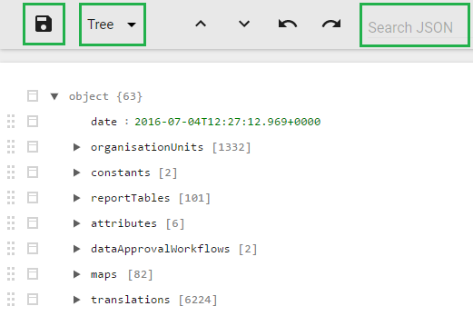
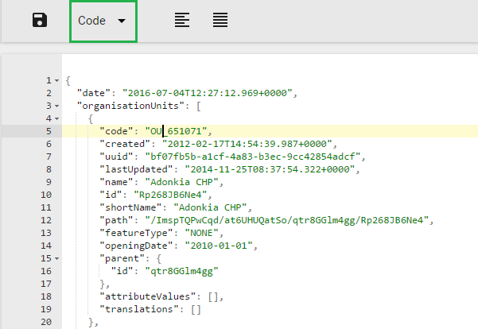
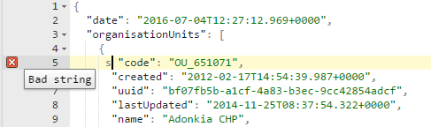

# Datastore Manager { #datastore_manager_app } 

The Datastore Manager is intended for advanced-level DHIS2 users. Before
you use the Datastore Manager, you can read more about the Data store
here: [DHIS2 data
store](https://docs.dhis2.org/en/develop/using-the-api/dhis-core-version-master/data-store.html).

## Using the Datastore Manager

The Datastore Manager lets you manage the content of the web API data
stores. This is helpful when managing apps and external scripts.

## Add a new namespace and key to the Datastore Manager

Note: You have to create a namespace before you can add a key to it.

1.  Click **New**.

2.  Enter a name for the namespace you want to create.

3.  Enter a key name, and select **Create**. The new namespace displays
    in the left pane.

## Add a key to an existing namespace in the Datastore Manager

To add a new key to an existing namespace in the Datastore Manager,

1.  Select the namespace you want to add a key to.

2.  Click the options menu, and click **New key**.
    
    

3.  Enter a key name in the New key dialog box.

4.  Click **Create**. The new key is added to the namespace you
    selected.

## Delete a namespace or key from the Datastore Manager

To delete a namespace, or key, click the Options menu, and then click
**Delete**, and then **Delete** again. Note that if you delete the only
key in a namespace, you will also delete the namespace it belongs to.

## Search for namespaces or keys

Use the search tool in the top left corner to search for namespaces and
keys as follows:

  - Enter a namespace name followed by **\#** and the key name to search
    for a specific key in a namespace.

  - Enter **\#** followed by the name of a key to search for keys
only.

## Search your JSON library

Use the search tool in the workspace toolbar to search your JSON
library.

## Edit namespaces or keys in the Datastore Manager

Use the **Search** tool to find namespaces or keys in your datastore.
When you edit your content, you can toggle between the **Tree** view and
the **Code** view. Use the **Tree** view to get an overview of the
contents of the Datastore. Use the **Code** view to edit your code
directly in the code editor. Remember to save your work by clicking the
**Save** button.

In the Code view, you can edit your code. When you edit a line of code,
it is highlighted in yellow.

Any errors are marked by the editor. If you hover over the error icon,
you can view a short description of the error.

