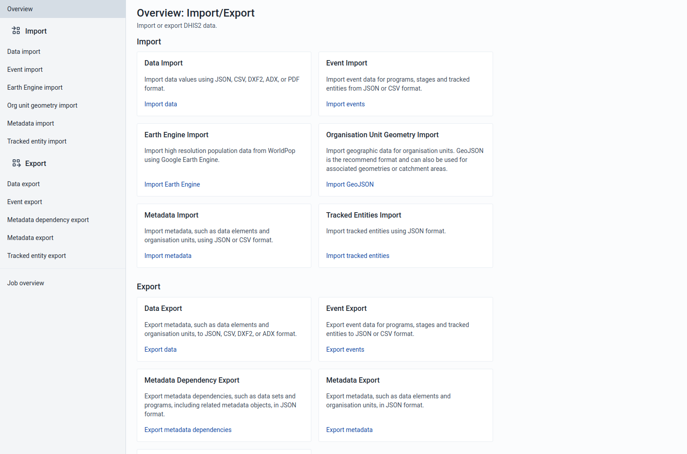
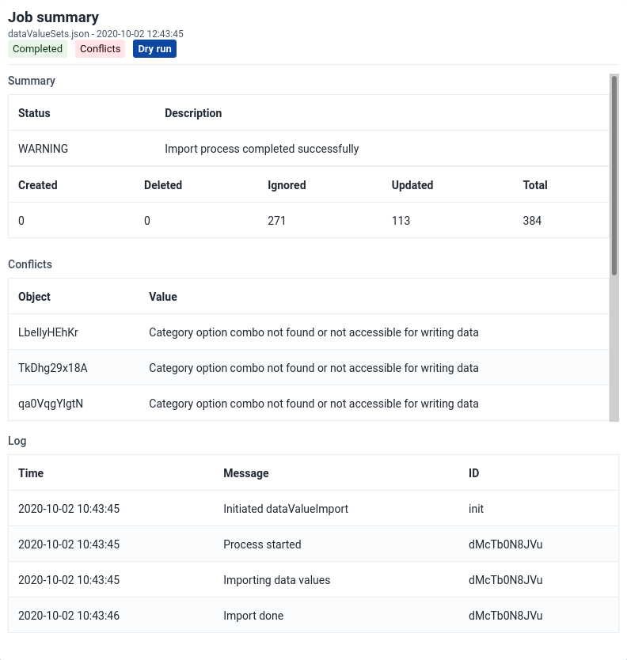

# Import/Export App { #import_export }

In a primary health system, the HMIS typically involves a distributed
application, where the same application is running in different
geographical locations (PHCs,CHCs, hospitals, districts, and state).
Many of these physical locations do not have Internet connectivity, and
hence they work off-line. At some point (normally at the district
level), the data needs to be synchronised in order to have a
consolidated database for the a particular geographical region. For
this, it is important to be able to export data from one location (which
is working offline, say at the health facility level) and import into
another one (say at the district level).
This feature of exporting and importing is thus a crucial function of a HMIS.
This feature also helps us overcome the dependency on the Internet to some
degree, as data updates can be transferred via USB key where there is no
connectivity, or through email where there is limited Internet
connectivity. DHIS2 provides robust import-export functionality to
fulfil these needs.

To access the Import/Export app, search in the top header bar for
Import/Export. Import/Export app offers a number of services details for
which can be found below.

## Importing data { #importing_data }

### Import progress logger { #import_progress_logger }

No matter what you import ("Data", "Events", "Org unit geometry", "Metadata" or "Tracked entity" data), you can always view the progress of the import by looking at the "Job Summary" at the top of the page.

### Import Summaries { #metadata_import_summaries }

On import request completion, we show import summaries above the
import form. Any conflicts or errors are shown in the table under the
main summary for the import.

### Metadata Import { #metadata_import }

Metadata Import can be accessed from the sidebar by clicking on
Metadata Import.

1.  Choose a file to upload

2.  Select a format: _JSON_ , _CSV_, or _XML_

3.  Select the appropriate settings for:

    - Identifier
    - Import report mode
    - Preheat mode
    - Import strategy
    - Atomic mode
    - Merge mode

4.  Click **Advanced options** if you want to adjust one or more of
    the following settings before importing:

    - Flush mode
    - Skip sharing
    - Skip validation
    - Async
    - Inclusive strategy

5.  Click on the **Import** button which will upload the file and start the
    importing process.

> **Tip**
>
> **It is highly recommend to use the Dry run option** to test before
> importing data; to make sure you keep control over any changes to your
> Metadata, and to check for problems with out-of-sync data elements or
> organisation unit names

> **Note**
>
> If an organisation unit e.g. `Nduvuibu MCHP` had a unknown reference to an object with ID `aaaU6Kr7Gtpidn`, it means that the object with ID `aaaU6Kr7Gtpidn` was not present in your imported file, and it was not found in the existing database.
>
> You can control this using **Identifier** option, to indicate if you want to allow objects with such invalid references to be imported or not. If you choose to import invalid references you will have to correct the reference manually in DHIS2 later.

#### Matching Identifiers in DXF2 { #matching_identifiers_in_dxf2 }

The DXF2 format currently support matching for two identifiers, the
internal DHIS2 identifier (known as a UID), and also using an external
identifier called called a "code". When the importer is trying to search
for references (like the one above), it will first go to the UID field,
and then to the code field. This allows you to import from legacy
systems without having a UID for every meta-data object. I.e. if you are
importing facility data from a legacy system, you can leave out the ID
field completely (DHIS2 will fill this in for you) and put the
legacy system's own identifiers in the code field, this identifier is
required to be unique. This not only works for organisation units, but
for all kinds of meta-data, allowing for easy import from other systems.

### Data Import { #import }

Data Import can be accessed from the sidebar by clicking on Data
Import.

1.  Choose a file to upload

2.  Select a format: _JSON_, _CSV_, _XML_, _ADX_, or _PDF_

3.  Select the appropriate settings for:

    - Strategy
    - Preheat cache

4.  Click **Advanced options** if you want to adjust one or more of
    the following settings before importing:

    - Data element ID scheme
    - Org unit ID scheme
    - ID scheme
    - Skip existing check

5.  Click on the **Import** button which will upload the file and start the
    importing process.

> **Tip**
>
> **It is highly recommend to use the Dry run option** to test before
> importing data; to make sure you keep control over any changes to your
> Metadata, and to check for problems with out-of-sync data elements or
> organisation unit names

#### PDF Data { #importPDFdata }

DHIS2 supports import of data in the PDF format. This can be used to
import data produced by off-line PDF data entry forms. Please refer to
the section **Data set management** for details on how to produce a PDF
form which can be used for off-line data entry.

To import a PDF data file, navigate to the _PDF Data Import_ item in the
side menu. Upload the completed PDF file and click _Import_.

### Event Import { #event_import }

Event Import can be accessed from the sidebar by clicking on Event
Import.

1.  Select a format: _JSON_ or _CSV_.

2.  Click **Advanced options** if you want to adjust one or more of
    the following settings before importing:

    - Event ID scheme
    - Data element ID scheme
    - Org unit ID scheme
    - ID scheme

3.  Click on the **Import** button which will upload the file and start the
    importing process.

### Earth Engine Import { #ee_import }

Earth Engine Import can be accessed from the sidebar by clicking on Earth Engine
Import.

Import high resolution population data from WorldPop using Google Earth Engine. A [Google
Earth Engine account](https://docs.dhis2.org/en/topics/tutorials/google-earth-engine-sign-up.html) is required to use this importer.

#### Select which Earth Engine data should be imported

The first section of the form is used to configure the Earth Engine data to import.

1. Select which Earth Engine dataset should be imported. Currently the choices are *Population* and *Population age groups*.

2. After a dataset has been selected, a period must be selected. Only one period can be imported at a time.

3. Choose how the data should be rounded. By default data is not rounded.

4. Select which organisation units to import data to. If you select facility level organisation units, then you must choose an associated geometry for the facilities. Without an associated geometry for facilities, the Earth Engine cannot determine the population.

#### Select the data elements to import the Earth Engine data into

Once you have configured the Earth Engine dataset, you need to select which data element to import the data to. For datasets with disaggregation groups, such as "Population age groups", the DHIS2 data element must have disaggregations in the form of category option combos that match the Earth Engine dataset disaggregation groups.

> **Configuring data elements for Earth Engine import**
>
> When configuring the DHIS2 data elements that will contain Earth Engine data, if you plan to import data to multiple org unit levels, ensure that those levels are added as Aggregation Levels in the data element configuration.
>
> Some Earth Engine datasets contain disaggregation groups, the DHIS2 data element must be configured with corresponding category option combos. For example the "Population age groups" dataset is disaggregated by gender (Male, Female) and 5-year age groups.
>
> In DHIS2 this means that you must have a Male/Female category, and a 5-year age group category (<1yr, 1-4yr, 5-9yr, 10-14yr... 80+yr). These are combined into a category combination.
>
> Pro-tip: To automatically match the category option combo to the Earth Engine disaggregation group, add a Code to each category option combo that matches the earth engine group name. For example, with "Population age groups", the groups are named: F_0, F_1, F_5..., M_0, M_1, M_5...

#### Run the import

Once the data element and category option combos have been selected, the Preview button is enabled. After reviewing the data you want to import, you can do a dry run first, or proceed with the actual import.

### Organisation Unit Geometry Import { #geometry_import }

Accessed from the sidebar by clicking on _Org Unit geometry import_. Two
geometry formats are supported: GeoJSON and GML. GeoJSON is the
recommended format and can also be used to import associated geometries
(catchment areas).

#### GeoJSON import { #geojson_import }

1.  Upload a file using the GeoJSON format.

2.  By default the GeoJSON feature id should match the organisation unit id.

3.  Check **Match GeoJSON property to organisation unit scheme** to match by
    a feature propery. Type the GeoJSON property name and select the
    Organisation unit ID scheme (_Id_, _Code_ or _Name_).

4.  Check **Import as associated geometry** to import the GeoJSON features
    as associated geometries the organisation units (e.g. catchment areas).
    Select at geometry attribute where the data should be imported. This requires
    an attribure of type _GeoJSON_ applied to _Organisatiot unit_. This
    attribute can be defined in the Maintenance app.

5.  Click on the **Start import** button which will upload the file and start the
    importing process.

> **Tip**
>
> **It is highly recommend to use the Dry run option** to test before
> importing data; to make sure you keep control over any changes to
> your organisation unit geometries.

#### GML import { #gml_import }

1.  Upload a file using the GML (Geographic Markup Language) format.

2.  Click on the **Import** button which will upload the file and start the
    importing process.

### Tracked Entities Import { #tei_import }

Tracked entities import can be accessed from the sidebar by
clicking on Tracked entity import.

1.  Choose a JSON file to upload

1.  Select the appropriate settings for:

    - Identifier
    - Import report mode
    - Preheat mode
    - Import strategy
    - Atomic mode
    - Merge mode

1.  Click **Advanced options** if you want to adjust one or more of
    the following settings before importing:

    - Flush mode
    - Skip sharing
    - Skip validation
    - Inclusion strategy
    - Data element ID scheme
    - Event ID scheme
    - Org unit ID scheme
    - ID scheme

1.  Click on the **Import** button which will upload the file and start the
    importing process.

> **Tip**
>
> **It is highly recommend to use the Dry run option** to test before
> importing data; to make sure you keep control over any changes to
> your tracked entities.

## Exporting data

### Metadata Export { #metadata_export }

Metadata export can be accessed from the sidebar by clicking on
Metadata export.

1.  Choose the list of objects you would like to export.

2.  Select a format: *JSON*

3.  Select a compression type: _zip_, _gzip_ or _uncompressed_

4.  Decide whether to check _Skip sharing and access settings_

5.  Click **Export metadata** which will open a new web-browser window
    that will give you a file to download to your local computer.

### Metadata Export with Dependencies { #metadata_export_dependencies }

Metadata export with dependencies lets you create canned exports for
metadata objects. This type of export will include the metadata objects
and the metadata object's related objects; that is, the metadata which
belong together with the main object.

Table: Object types and their dependencies

| Object type          | Dependencies included in export                                                                                                                                                                                                                                                                                                                                                           |
| -------------------- | ----------------------------------------------------------------------------------------------------------------------------------------------------------------------------------------------------------------------------------------------------------------------------------------------------------------------------------------------------------------------------------------- |
| **Data sets**        | Data elements   Sections   Indicators   Indicator types   Attributes   Data entry forms   Legend sets   Legends   Category combinations   Categories   Category options   Category option combinations   Option sets                                                                                              |
| Programs             | Data entry form   Tracked entity   Program stages   Program attributes   Program indicators   Program rules   Program rule actions   Program rule variables   Program attributes   Data elements   Category combinations   Categories   Category options   Category option combinations   Option sets |
| Category combination | Category combinations   Categories   Category options   Category option combinations   Attributes                                                                                                                                                                                                                                                                 |
| Dashboard            | Dashboard items   Charts   Event charts   Pivot tables   Event reports   Maps   Reports   Resources                                                                                                                                                                                                                                             |
| Data element groups  | Data elements   Category combinations   Categories   Category options   Category option combinations   Option sets   Attributes   Legend sets   Legends                                                                                                                                                                                   |
| OptionSets           | Option                                                                                                                                                                                                                                                                                                                                                                                    |

1.  Select an object type: _Data sets_, _Programs_, _Category combination_,
    _Dashboard_, _Data element groups_ or _OptionSets_.

2.  Select an object.

3.  Select a format: *JSON*

4.  Select a compression type: _Zip_ , _GZip_ or _Uncompressed_

5.  Click **Export metadata dependencies** which will open a new
    web-browser window that will give you a file to download to your
    local computer.

### Data export { #data_export }

Data export can be accessed from the sidebar by clicking on Data
export.

1.  Select which organisation units to export from.

2.  Select if you want export to include descendants of organisation
    units selected in Step 1 or only the manually selected
    organisation units.

3.  Select which data sets to export.

4.  Set the start and end date.

5.  Select a format: _JSON_, _CSV_, _XML_, or _ADX_

6.  Select a compression mode: **Zip** , **GZip** or **Uncompressed**

7.  Click **Advanced options** if you want to adjust one or more of
    the following settings before exporting:

    - Include deleted
    - Data element ID scheme
    - Organisation unit ID scheme
    - ID scheme

8.  Click **Export data** which will open a new web-browser window
    that will give you a file to download to your local computer.

### Event export { #event_export }

Event export can be accessed from the sidebar by clicking on Event
export.

You can export event or tracker data in JSON or CSV.

1.  Select an organisation unit.

1.  Select the inclusion:

    - _Selected_: Export event data only for the selected
      organisation unit

    - _Directly below_: Export event data including the first
      level of the organisation units inside the selections as well
      as the selected organisation unit itself.

    - _All below_: Export event data for all organisation units
      inside the selections as well as the selected organisation
      unit itself.

1.  Select a program and a program stage (if applicable).

1.  Set the start date and end date.

1.  Select a format: _JSON_ or _CSV_.

1.  Select a compression mode: _Zip_, _GZip_ or _Uncompressed_.

1.  Click **Advanced options** if you want to adjust one or more of
    the following settings before exporting:

    - Include deleted
    - Data element ID scheme
    - Organisation unit ID scheme
    - ID scheme

1.  Click **Export events** which will open a new web-browser window
    that will give you a file to download to your local computer.

### Tracked entities export { #tei_export }

Tracked entities export can be accessed from the sidebar by
clicking on tracked entities export.

You can export tracked entities in JSON, or CSV format.

1.  Select the organisation units that should be included. There are three modes for selecting organisation units:

    - _Accessible_: to select data view organisation units associated with the current user

    - _Capture_: to select data view organisation units associated with the current user.

    - _Manually select organisation units_: to manually select the organisation units.

1. If you choose to _manually select organisation units_ then you will be presented with further options:

    - _Selected_: Export data only for the selected
      organisation unit

    - _Directly below_: Export data including the first
      level of the organisation units inside the selections as well
      as the selected organisation unit itself.

    - _All below_: Export event data for all organisation units
      inside the selections as well as the selected organisation
      unit itself.

1.  Decide whether you want to filter by _program_ or _tracked entity type_.

1. Decide what statuses to include in the export

1. Decide which follow-up statuses to include in the export

1.  Select a format: _JSON_ or _CSV_.

1.  Click **Advanced options** if you want to adjust one or more of
    the following settings before exporting:

    - Filter by last updated date
    - Filter by assigned user
    - Include deleted
    - Data element ID scheme
    - Event ID scheme
    - Organisation unit ID scheme
    - ID scheme

1.  Click **Export tracked entity** which will open a new
    web-browser window that will give you a file to download to your
    local computer.

## Changes to Tracker import/export in v41+ { #v41_tracker_changes }

The import/export app was upgraded to use the [new tracker API](https://docs.dhis2.org/en/develop/using-the-api/dhis-core-version-master/tracker.html) for importing and exporting tracked entities and events. The [deprecated tracker API](https://docs.dhis2.org/en/develop/using-the-api/dhis-core-version-master/tracker-deprecated.html) will be removed in v42 hence all applications are advised to upgrade as soon as possible.

This brings a lot of benefits in terms of the consistency and reliability of the import/export experience for tracked entities and events, such as better validation, error reporting and the use of a more reliable job scheduling workflow.

These benefits come with a couple of important caveats. First, the new format of the exported files is incompatible with previous versions of the app, so exports from v41 can not be imported in previous versions, and exports from previous versions can not be imported in v41. We also dropped support for XML format, and only support JSON and CSV. More context for these changes can be found in the [Tracker API documentation](https://docs.dhis2.org/en/develop/using-the-api/dhis-core-version-master/tracker.html).

## Job Overview { #job_overview }

The job overview page can be accessed from the sidebar by clicking on
_Job Overview_.

This page allows you to see the progress of all the imports you have
started this session. You can see the list of all jobs on the left
side and details about a specific selected job on the right.

### Filtering by import job type

By default jobs of all import types are shown in the job list, but you
can filter categories you are interested in by clicking on the job
type filters above the job list.

### Recreating a previous job

You can recreate previously run import jobs by clicking on the
_Recreate job_ button at the bottom of the page, assuming you have
selected a job from the list. This will take you to the correct import
page and fill in all the form details exactly as the job you chose to
recreate.

## Schemes

The various schemes used in many of the import and export pages are
also known as identifier schemes and are used to map metadata objects
to other metadata during import, and to render metadata as part of
exports.

Table: Available values

| Scheme       | Description                                                                                                                                                                                                                                                                                                                                                         |
| ------------ | ------------------------------------------------------------------------------------------------------------------------------------------------------------------------------------------------------------------------------------------------------------------------------------------------------------------------------------------------------------------- |
| ID, UID      | Match on DHIS2 stable Identifier, this is the default id scheme.                                                                                                                                                                                                                                                                                                    |
| CODE         | Match on DHIS2 Code, mainly used to exchange data with an external system.                                                                                                                                                                                                                                                                                          |
| NAME         | Match on DHIS2 Name, please note that this uses what is available as _object.name_, and not the translated name. Also note that names are not always unique, and in that case, they can not be used.                                                                                                                                                                |
| ATTRIBUTE:ID | Match on metadata attribute, this attribute needs to be assigned to the type you are matching on, and also that the unique property is set to _true_. The main usage of this is also to exchange data with external systems, it has some advantages over _CODE_ since multiple attributes can be added, so it can be used to synchronize with more than one system. |

### ID scheme

The ID scheme applies to all types of objects, but can be overwritten
by more specific object types.
