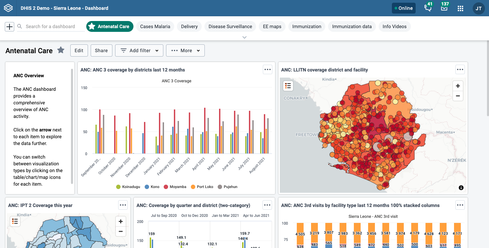
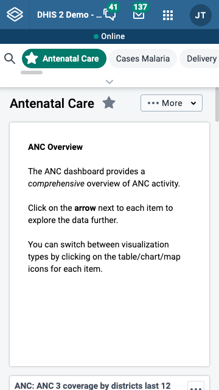
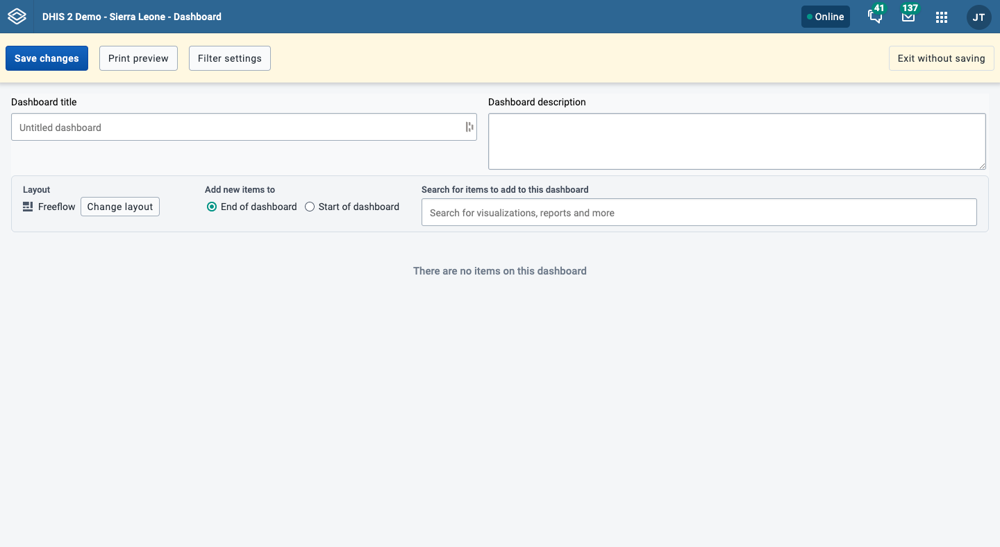
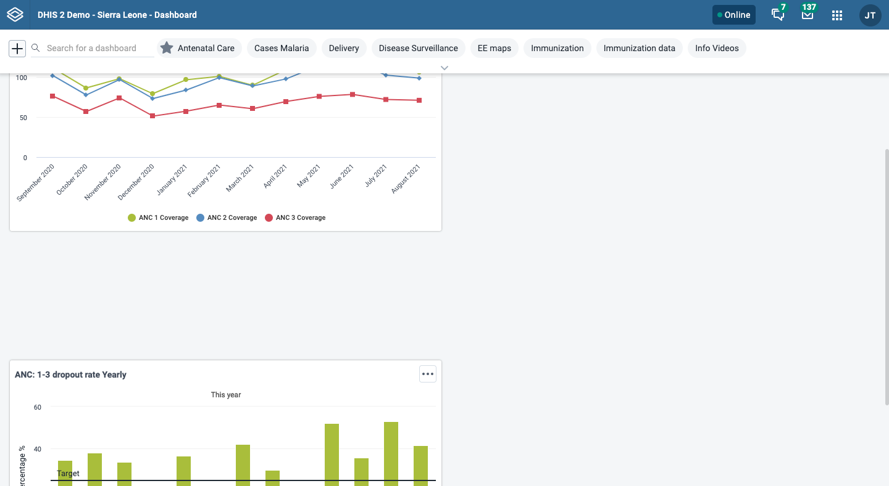
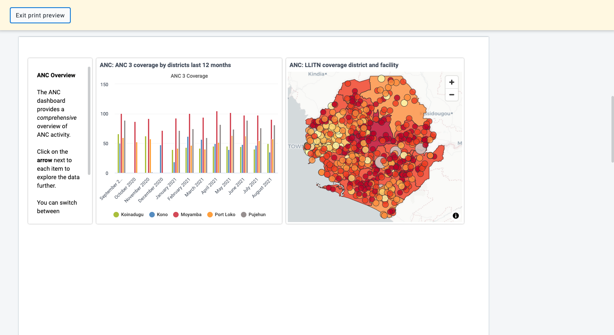
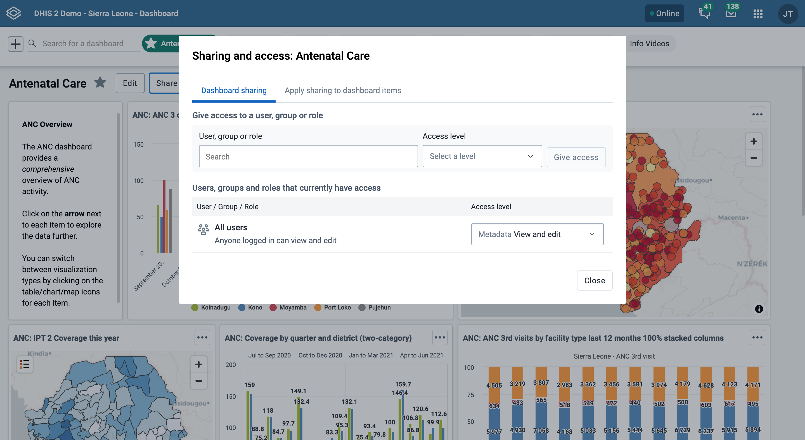

# Managing dashboards { #dashboard } 

## About dashboards

The Dashboards app makes it possible to present a high level overview of your data, including displaying analytical objects such as maps, charts, reports and tables, and displaying descriptions and other textual information.

Features of the Dashboards app include:
* View and print dashboards
* Create and edit dashboards
* Share dashboards with other users and user groups
* Apply temporary filters while viewing dashboards
* Responsive view on mobile devices and small screens
* Access dashboards while offline

As an example, a user or administrator could create a dashboard called "Antenatal care" containing all relevant information on antenatal care. This dashboard could then be shared with the user group called "ANC control", which might consist of all users of the ANC control program. All users within this group would then be able to view the same dashboard.

The Dashboards app can be personalized in the following ways:
* [Set the height of the bar displaying the list of available dashboards](#dashboards_personalize_bar)
* [Star dashboards for quick access to your favorite dashboards](#dashboard-star-dashboard)
* [Show or hide dashboard description](#dashboard-show-description)

## Dashboard and control bar { #dashboards_setup } 

Dashboards have a title, description, and any number of dashboard items. Above the dashboard is the dashboards bar, which shows all your available dashboards, a dashboard search field, and a **+** button for creating a new dashboard.

The dashboard has two modes: view and edit/create. When you first log in
to DHIS2, your most recently used dashboard will be displayed in view mode, if you are on the same computer as you were previously. If you are using a different computer, then the first starred dashboard will be displayed. If there are no starred dashboards, then the first dashboard (alphabetically) will be displayed. Starred dashboards always show first in the dashboard list.

Below is an example of a dashboard named "Antenatal Care", which has been populated with charts and maps:

### Responsive view on small screens

When viewing dashboards on small screens (for instance, mobile phone in portrait orientation), the dashboard will adapt to the screen and show all items in a single column. Some options, including editing, filtering and sharing, will not be available.

 {.center}

### Searching in the list of dashboards

You can search for a specific dashboard using the search field in the
upper left of the control bar entitled “Search for a dashboard”. The
search is case insensitive, and as you type, the list of dashboards will
filter down to those that match your search text.

### Personalizing the height of the dashboards bar { #dashboards_personalize_bar }

You can set a specific height for the dashboards bar by
down-clicking and dragging the bottom edge of the bar. When you
finish dragging, the new height will be set. Clicking on **Show more**
will expand the dashboards bar to its maximum height (10 "rows"). Clicking
on **Show less** will reset the height to your personalized height.

## Creating a dashboard

To create a new dashboard, click the **+** button in the left
corner of the dashboards bar to enter create mode:

**Create mode:**

In create mode, you can add a title, description and dashboard items to your dashboard. If you do not add a title, the dashboard will automatically be titled "Untitled dashboard".

### Adding items to the dashboard

When adding items to the dashboard you can choose an overall layout, as well as whether new items added are placed at the start or end of the dashboard. In *Freeflow* layout, you can place and size the items freely on the dashboard. With *Fixed columns* layout, you can choose the number of columns to have on the dashboard, and the dashboard will automatically be layed out for you. Items cannot be moved or resized in *Fixed columns* layout. You can change this layout setting at any time.

Add items to the dashboard by searching for items ("Search for items to add to this dashboard"). Item types are:

- Visualizations (charts and tables)
- Maps
- Event reports
- Event charts
- Reports
- Resources
- Apps
- Messages
- Text boxes
- Spacers

The list of items in the drop-down initially displays 10 visualizations (charts and tables), and 5 from each of the other categories, based on the search text you enter. Messages (Email), text boxes and spacer items are also found in the list. To view more items, click on **Show more**, and the list for that type will be extended to 25 items. If you still do not find the item you want, try typing a more specific search text.

Once you select an item, it will be added to either the start or the end of the dashboard, depending on the setting you have selected. In *Freeflow* layout, the added items can be moved using the mouse by down-clicking on the item and dragging it to the desired position. It can also be resized with the mouse by down-clicking on the drag handle in the lower right corner of the item and dragging to the desired size.

#### Spacer items

The dashboard is configured with the "anti-gravity" setting for
positioning items. This means that items will "rise" upwards until they
bump into another item. In order to force empty vertical space between
items (like an empty row), you can add spacer items to the dashboard.
They are only visible in edit/create mode. In view mode, they are not
displayed, but take up the defined space.

Spacer in **edit/create mode**:

Spacer in **view mode**:

### Removing items

Remove items by clicking on the red trash can at the upper right of the
item. Be aware that because of the "anti-gravity" setting in the
dashboard, when you remove an item, the items that are positioned below
the removed item will "rise" upwards.

### Print preview

Click on the **Print preview** button to view how the dashboard would look in dashboard layout print.

Click on **Exit print preview** to return to editing the dashboard.

Note that some items may be moved to the next page to avoid being split between two pages. Items may also be shortened to fit on one page. Items that are shortened show an info icon in the upper right corner in preview. The info icon is not visible in the actual print.

### Restricting dashboard filters { #restricting-dashboard-filters } 

By default, users will be able to filter dashboard items by any dimension defined in your system. Dashboard filter settings can be edited for a given dashboard by clicking on **Filter settings**.

To restrict available filters, you can click **Only allow filtering by selected dimensions** and select the filters which you wish to allow on the dashboard. When the dashboard is in view mode, users will only be able to choose from among the filters selected. Period and Organisation Unit will be selected by default but can be removed if desired.

In order to save updates to filter settings, you need to first click **Confirm** to close the filter settings and then click **Save changes** to save the dashboard changes.

### Saving the dashboard

When creating or editing a dashboard, changes are only saved when you
click **Save changes** button in the dashboard edit bar at the top of
the page. If you don't want to save your changes, click the **Exit without saving** button to the upper right. You will then be returned to
view mode with the dashboard you were previously viewing.

## Editing an existing dashboard

If you have access rights to edit the currently active dashboard, there
will be an **Edit** button to the right of the dashboard title in view
mode. Click on this button to enter edit mode.

Refer to the above section about creating dashboards for information on
adding and removing items to the dashboard.

### Translating dashboard title and description

You can add translations for dashboard title and description while in
edit mode. The dialog provides a list of languages to translate to, and
shows the original dashboard title underneath the name input field.

1.  Click on the **TRANSLATE** button located above the dashboard

2.  Select the language you wish to add a translation for.

3.  Add the title and/or description, and click **SAVE**

## Deleting a dashboard

If you have access to delete the dashboard, then there will be a
**Delete** button located above the dashboard, when in edit mode. A
confirmation dialog will first be displayed to confirm that you want to
delete the dashboard.

## Viewing a dashboard

From view mode, you can toggle showing the description, star a dashboard, apply filters, print the dashboard, make the dashboard available offline, and share the dashboard with other users and user groups.

### Show description { #dashboard-show-description }

To toggle the description, click on the **...More** button and choose **Show description** (or **Hide description**). This setting will be remembered for all dashboards that you open. This setting applies to you, not other users.

### Star dashboards { #dashboard-star-dashboard }

Your starred dashboards are listed first in the list of dashboards. To star a dashboard, click on the star button to the right of the title. You can also toggle the star from the **...More** menu. When the star is “filled”, that means the dashboard is starred. Starring a dashboard only applies to you, not other users.

### Filtering a dashboard

Multiple filters can be applied to a dashboard for changing the data displayed in the various dashboard items. The filters are applied to each dashboard item in the same way: each added filter overrides the original value for that dimension in the original chart, table or map (visualization). It is possible to filter on Organisation Units, Periods and other dynamic dimensions depending on the DHIS2 instance.

To add a filter, click on the **Add Filter** button and choose the dimension:

A dialog opens where the filter selection can be made.

Click on **Confirm** in the dialog to apply the filter to the
current dashboard.

Filters are not stored, so when switching to a different dashboard they are lost. Black filter badges appear above the dashboard items to indicate that what is shown in the dashboard items is not the original visualization, but a filtered one where the filters override the stored dimensions' values.

Filter badges can be clicked for opening the filter selection dialogs thus allowing for filter editing. A filter can be removed by clicking on the **Remove** button in the badge. Whenever a filter is added, edited or removed, the dashboard items reload to show the updated data. The filter badges are always visible at the top of the page when scrolling the dashboard content.

By default, users are able to filter dashboard items by any dimension defined in your system. To limit available filters, see [Restricting dashboard filters](#restricting-dashboard-filters).

### Making dashboards available offline

To make a dashboard available offline, choose the **Make dashboard available offline** option in the **More** menu. This will cause a reload of the dashboard where requests to the server are recorded and saved in browser storage. Note that offline dashboards are only available on the computer and browser where you set it to offline.

Offline dashboards have an indicator on the dashboard chip in the dashboards bar, as well as a tag showing the time it was saved

If the dashboard has been changed since you made it available offline, either by you or someone else, you'll need to choose **Sync offline data now** from the **More** menu to save the latest version of the dashboard. If you currently have a filter applied when requesting the dashboard be made available offline, the filter will have to be removed first.

You can also remove a dashboard from offline storaged by choosing **Remove from offline storage** in the **More** menu.

#### Other notes about Dashboards app when you are offline:
If you are offline, any buttons or actions that require a connection to complete successfully are disabled. They will be re-enabled once connectivity is restored.

### Printing a dashboard

From the **...More** menu you can print the active dashboard. There are two styles of dashboard print: dashboard layout and one item per page. For both styles, a title page is added that shows the dashboard title, description (if the Show description setting is on), and any applied dashboard filters.

For best print results:

- use Chrome or Edge
- wait until all dashboard items have loaded before printing
- use A4 landscape setting with default margins set and background graphics turned on

#### Print dashboard layout

Dashboard layout print will approximate the dashboard layout as it is shown in the browser. Note that some adjustments may need to be made to the layout in order to prevent items being split onto multiple pages: the position of some items may be adjusted downwards, and items that are taller than one page are shortened.

Click on the **Print** button in the upper right to trigger the browser print functionality.

#### Print one item per page

This style of print will print each dashboard item on a separate page, maximizing the use of the paper size.

Click on the **Print** button in the upper right to trigger the browser print functionality.

## Dashboard items with charts, pivot tables or maps

Dashboard items with charts, pivot table or maps may have a context menu button in the upper right corner of the item with additional viewing options, depending on the system settings that have been configured for the DHIS2 instance. If all the relevant system settings have been disabled, then there will not be a context menu button. Here are the possible menu options: 

### Switching between visualizations

Dashboard items showing charts, pivot tables and maps can be toggled
between these visualizations. Click on the item context menu button and choose the desired view (e.g., **View as Table**, **View as Map**, **View as Chart**):

### View item in fullscreen

To view the chart, table or map in fullscreen, click on the **View fullscreen** option. To exit fullscreen, you can either press **esc** key or click the exit button in the upper right corner of the fullscreen view.

### Open in app

To open the visualization in its relevant app (e.g., Data Visualizer, Maps) click on the **Open in [app name] app** option.

## Show interpretations and details

You can write interpretations for the chart, pivot table, map, event report, and event chart items by clicking on **Show interpretations and details**:

> **Note**
> 
>  This option may be disabled on your system if the system setting _Allow users to show dashboard items interpretations and details_ is unchecked.)

The item will be expanded vertically underneath to show the description, interpretations and replies. You can like an interpretation, reply to an interpretation, and add your own interpretation. You can edit, share or delete your own interpretations and replies, and if you have moderator access, you can delete others’ interpretations.

It is possible to format the description field, and interpretations with **bold**, _italic_ by using the Markdown style markers \* and \_ for **bold** and _italic_ respectively. The text field for writing new interpretations has a toolbar for adding rich text. Keyboard shortcuts are also available: Ctrl/Cmd + B and Ctrl/Cmd + I. A limited set of smilies is supported and can be used by typing one of the following character combinations: :) :-) :( :-( :+1 :-1. URLs are automatically detected and converted into a clickable link.

Interpretations are sorted in descending order by date, with the most recent shown on top. Interpretation replies are sorted in ascending order by date, with the oldest shown on top.

## Sharing a dashboard { #dashboard_sharing } 

In order to share a dashboard with user groups, click on the **SHARE** button to the right of the dashboard title to display the dashboard sharing settings options. To share the dashboard with specific users or user groups, type in the name in the input field to add them to the dashboard sharing settings

All dashboards have two sharing groups set by default.

- External access (without login)

  This option, when selected, provides access to the dashboard as an external resource through the API. This is useful for when you are creating an external web portal but would like to call information from a dashboard you have made internally within DHIS2. By default, this option is not selected. For more information, see [Viewing analytical resource representations](https://docs.dhis2 org/master/en/developer/html/webapi_viewing_analytical_resource_representations.html#) in the developer guide.

- Public access (with login)

  This option allows the selected dashboard to be pushed to all users within your DHIS2 instance. This can also be hidden from public view by selecting the "None" option, which is the default option for new dashboards.

User groups that have been added manually can be assigned two types of permissions within the dashboard

- Can view

  Provides the user group with view only rights to the dashboard.

- Can edit and view

  Allows the user groups to edit the dashboard in addition to viewing it. Editing allows for altering the layout, resizing and removing items, renaming/deleting the dashboard etc.

You can provide users with the url of the dashboard, allowing them to navigate directly to the dashboard. To get the dashboard url, just access the dashboard in view mode, and copy the browser url. For example, the url to the Antenatal Care dashboard in play.dhis2.org/demo is:

https://play.dhis2.org/demo/dhis-web-dashboard/\#/nghVC4wtyzi
